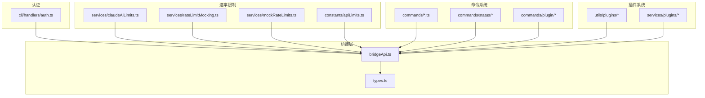
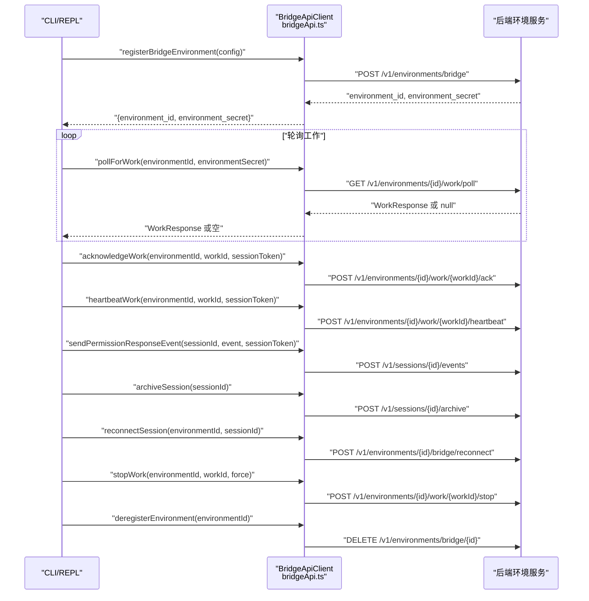
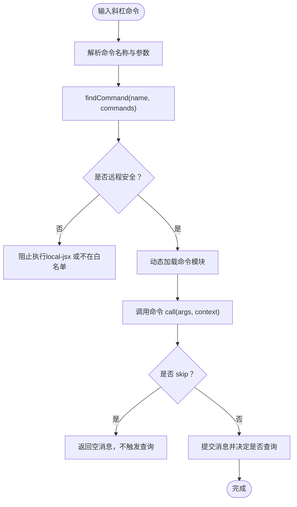
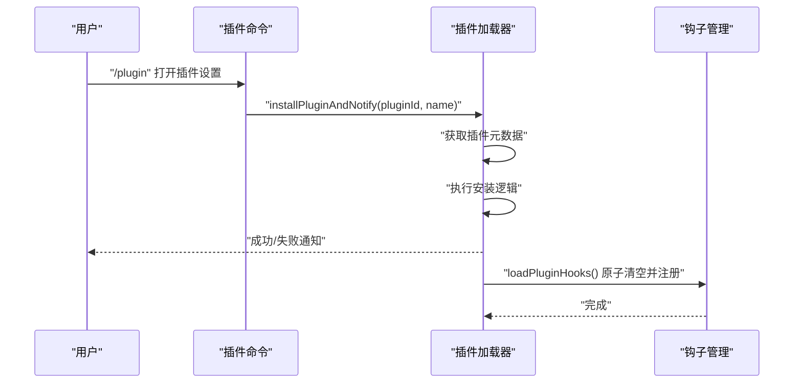
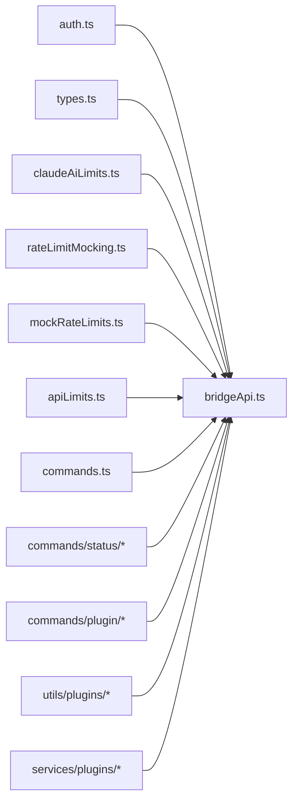

# API 参考

<cite>
**本文引用的文件**
- [bridgeApi.ts](file://bridge/bridgeApi.ts)
- [types.ts](file://bridge/types.ts)
- [auth.ts](file://cli/handlers/auth.ts)
- [apiLimits.ts](file://constants/apiLimits.ts)
- [claudeAiLimits.ts](file://services/claudeAiLimits.ts)
- [rateLimitMocking.ts](file://services/rateLimitMocking.ts)
- [mockRateLimits.ts](file://services/mockRateLimits.ts)
- [index.tsx](file://commands/plugin/index.tsx)
- [plugin.tsx](file://commands/plugin/plugin.tsx)
- [index.ts](file://commands/status/index.ts)
- [status.tsx](file://commands/status/status.tsx)
- [commands.ts](file://commands.ts)
- [commands.ts](file://commands/add-dir/index.ts)
- [commands.ts](file://commands/agents/index.ts)
- [commands.ts](file://commands/branch/index.ts)
- [commands.ts](file://commands/bridge/index.ts)
- [commands.ts](file://commands/btw/index.ts)
- [commands.ts](file://commands/bughunter/index.ts)
- [commands.ts](file://commands/chrome/index.ts)
- [commands.ts](file://commands/clear/index.ts)
- [commands.ts](file://commands/color/index.ts)
- [commands.ts](file://commands/compact/index.ts)
- [commands.ts](file://commands/config/index.ts)
- [commands.ts](file://commands/context/index.ts)
- [commands.ts](file://commands/copy/index.ts)
- [commands.ts](file://commands/cost/index.ts)
- [commands.ts](file://commands/debug-tool-call/index.ts)
- [commands.ts](file://commands/desktop/index.ts)
- [commands.ts](file://commands/diff/index.ts)
- [commands.ts](file://commands/doctor/index.ts)
- [commands.ts](file://commands/effort/index.ts)
- [commands.ts](file://commands/env/index.ts)
- [commands.ts](file://commands/exit/index.ts)
- [commands.ts](file://commands/export/index.ts)
- [commands.ts](file://commands/extra-usage/index.ts)
- [commands.ts](file://commands/fast/index.ts)
- [commands.ts](file://commands/feedback/index.ts)
- [commands.ts](file://commands/files/index.ts)
- [commands.ts](file://commands/good-claude/index.ts)
- [commands.ts](file://commands/heapdump/index.ts)
- [commands.ts](file://commands/help/index.ts)
- [commands.ts](file://commands/hooks/index.ts)
- [commands.ts](file://commands/ide/index.ts)
- [commands.ts](file://commands/install-github-app/index.ts)
- [commands.ts](file://commands/install-slack-app/index.ts)
- [commands.ts](file://commands/issue/index.ts)
- [commands.ts](file://commands/keybindings/index.ts)
- [commands.ts](file://commands/login/index.ts)
- [commands.ts](file://commands/logout/index.ts)
- [commands.ts](file://commands/mcp/index.ts)
- [commands.ts](file://commands/memory/index.ts)
- [commands.ts](file://commands/mobile/index.ts)
- [commands.ts](file://commands/mock-limits/index.ts)
- [commands.ts](file://commands/model/index.ts)
- [commands.ts](file://commands/oauth-refresh/index.ts)
- [commands.ts](file://commands/onboarding/index.ts)
- [commands.ts](file://commands/output-style/index.ts)
- [commands.ts](file://commands/passes/index.ts)
- [commands.ts](file://commands/perf-issue/index.ts)
- [commands.ts](file://commands/permissions/index.ts)
- [commands.ts](file://commands/plan/index.ts)
- [commands.ts](file://commands/plugin/index.ts)
- [commands.ts](file://commands/pr_comments/index.ts)
- [commands.ts](file://commands/privacy-settings/index.ts)
- [commands.ts](file://commands/rate-limit-options/index.ts)
- [commands.ts](file://commands/release-notes/index.ts)
- [commands.ts](file://commands/reload-plugins/index.ts)
- [commands.ts](file://commands/remote-env/index.ts)
- [commands.ts](file://commands/remote-setup/index.ts)
- [commands.ts](file://commands/rename/index.ts)
- [commands.ts](file://commands/reset-limits/index.ts)
- [commands.ts](file://commands/resume/index.ts)
- [commands.ts](file://commands/review/index.ts)
- [commands.ts](file://commands/rewind/index.ts)
- [commands.ts](file://commands/sandbox-toggle/index.ts)
- [commands.ts](file://commands/session/index.ts)
- [commands.ts](file://commands/share/index.ts)
- [commands.ts](file://commands/skills/index.ts)
- [commands.ts](file://commands/stats/index.ts)
- [commands.ts](file://commands/status/index.ts)
- [commands.ts](file://commands/stickers/index.ts)
- [commands.ts](file://commands/summary/index.ts)
- [commands.ts](file://commands/tag/index.ts)
- [commands.ts](file://commands/tasks/index.ts)
- [commands.ts](file://commands/teleport/index.ts)
- [commands.ts](file://commands/terminalSetup/index.ts)
- [commands.ts](file://commands/theme/index.ts)
- [commands.ts](file://commands/thinkback/index.ts)
- [commands.ts](file://commands/thinkback-play/index.ts)
- [commands.ts](file://commands/upgrade/index.ts)
- [commands.ts](file://commands/usage/index.ts)
- [commands.ts](file://commands/vim/index.ts)
- [commands.ts](file://commands/voice/index.ts)
- [commands.ts](file://commands/advisor.ts)
- [commands.ts](file://commands/bridge-kick.ts)
- [commands.ts](file://commands/brief.ts)
- [commands.ts](file://commands/commit-push-pr.ts)
- [commands.ts](file://commands/commit.ts)
- [commands.ts](file://commands/createMovedToPluginCommand.ts)
- [commands.ts](file://commands/init-verifiers.ts)
- [commands.ts](file://commands/init.ts)
- [commands.ts](file://commands/insights.ts)
- [commands.ts](file://commands/install.tsx)
- [commands.ts](file://commands/review.ts)
- [commands.ts](file://commands/security-review.ts)
- [commands.ts](file://commands/statusline.tsx)
- [commands.ts](file://commands/ultraplan.tsx)
- [commands.ts](file://commands/version.ts)
- [commands.ts](file://commands/exit.ts)
- [commands.ts](file://commands/export.ts)
- [commands.ts](file://commands/extra-usage.ts)
- [commands.ts](file://commands/fast.ts)
- [commands.ts](file://commands/feedback.ts)
- [commands.ts](file://commands/files.ts)
- [commands.ts](file://commands/good-claude.ts)
- [commands.ts](file://commands/heapdump.ts)
- [commands.ts](file://commands/help.ts)
- [commands.ts](file://commands/hooks.ts)
- [commands.ts](file://commands/ide.ts)
- [commands.ts](file://commands/install-github-app.ts)
- [commands.ts](file://commands/install-slack-app.ts)
- [commands.ts](file://commands/issue.ts)
- [commands.ts](file://commands/keybindings.ts)
- [commands.ts](file://commands/login.ts)
- [commands.ts](file://commands/logout.ts)
- [commands.ts](file://commands/mcp.ts)
- [commands.ts](file://commands/memory.ts)
- [commands.ts](file://commands/mobile.ts)
- [commands.ts](file://commands/mock-limits.ts)
- [commands.ts](file://commands/model.ts)
- [commands.ts](file://commands/oauth-refresh.ts)
- [commands.ts](file://commands/onboarding.ts)
- [commands.ts](file://commands/output-style.ts)
- [commands.ts](file://commands/passes.ts)
- [commands.ts](file://commands/perf-issue.ts)
- [commands.ts](file://commands/permissions.ts)
- [commands.ts](file://commands/plan.ts)
- [commands.ts](file://commands/plugin.ts)
- [commands.ts](file://commands/pr_comments.ts)
- [commands.ts](file://commands/privacy-settings.ts)
- [commands.ts](file://commands/rate-limit-options.ts)
- [commands.ts](file://commands/release-notes.ts)
- [commands.ts](file://commands/reload-plugins.ts)
- [commands.ts](file://commands/remote-env.ts)
- [commands.ts](file://commands/remote-setup.ts)
- [commands.ts](file://commands/rename.ts)
- [commands.ts](file://commands/reset-limits.ts)
- [commands.ts](file://commands/resume.ts)
- [commands.ts](file://commands/review.ts)
- [commands.ts](file://commands/rewind.ts)
- [commands.ts](file://commands/sandbox-toggle.ts)
- [commands.ts](file://commands/session.ts)
- [commands.ts](file://commands/share.ts)
- [commands.ts](file://commands/skills.ts)
- [commands.ts](file://commands/stats.ts)
- [commands.ts](file://commands/status.ts)
- [commands.ts](file://commands/stickers.ts)
- [commands.ts](file://commands/summary.ts)
- [commands.ts](file://commands/tag.ts)
- [commands.ts](file://commands/tasks.ts)
- [commands.ts](file://commands/teleport.ts)
- [commands.ts](file://commands/terminalSetup.ts)
- [commands.ts](file://commands/theme.ts)
- [commands.ts](file://commands/thinkback.ts)
- [commands.ts](file://commands/thinkback-play.ts)
- [commands.ts](file://commands/upgrade.ts)
- [commands.ts](file://commands/usage.ts)
- [commands.ts](file://commands/vim.ts)
- [commands.ts](file://commands/voice.ts)
- [commands.ts](file://commands/advisor.ts)
- [commands.ts](file://commands/bridge-kick.ts)
- [commands.ts](file://commands/brief.ts)
- [commands.ts](file://commands/commit-push-pr.ts)
- [commands.ts](file://commands/commit.ts)
- [commands.ts](file://commands/createMovedToPluginCommand.ts)
- [commands.ts](file://commands/init-verifiers.ts)
- [commands.ts](file://commands/init.ts)
- [commands.ts](file://commands/insights.ts)
- [commands.ts](file://commands/install.tsx)
- [commands.ts](file://commands/review.ts)
- [commands.ts](file://commands/security-review.ts)
- [commands.ts](file://commands/statusline.tsx)
- [commands.ts](file://commands/ultraplan.tsx)
- [commands.ts](file://commands/version.ts)
</cite>

## 目录
1. [简介](#简介)
2. [项目结构](#项目结构)
3. [核心组件](#核心组件)
4. [架构总览](#架构总览)
5. [详细组件分析](#详细组件分析)
6. [依赖分析](#依赖分析)
7. [性能考量](#性能考量)
8. [故障排查指南](#故障排查指南)
9. [结论](#结论)
10. [附录](#附录)

## 简介
本参考文档面向 Claude Code 的开发者与集成者，系统化梳理以下 API 体系：
- 命令 API：CLI 与 REPL 中可用的命令集合及其行为边界
- 工具 API：内置工具（如 Bash、文件读写、Web 搜索等）的调用规范
- 状态 API：系统状态查询、显示与诊断能力
- 插件 API：插件安装、启用、重载、钩子热加载与市场管理流程
- 桥接 API（Bridge API）：远程控制桥接环境注册、工作轮询、会话心跳与事件上报等

文档覆盖各 API 的参数、返回值、错误码、认证机制、限流与安全策略，并提供最佳实践、性能优化建议、版本兼容性与废弃策略说明，以及测试与调试工具指引。

## 项目结构
围绕 API 的实现主要分布在如下模块：
- 桥接层：bridge/bridgeApi.ts、bridge/types.ts 提供与后端环境服务交互的客户端与协议类型
- 认证与登录：cli/handlers/auth.ts 提供登录、登出、状态查询与凭据处理
- 速率限制与配额：services/claudeAiLimits.ts、services/rateLimitMocking.ts、services/mockRateLimits.ts、constants/apiLimits.ts 提供配额检测、早期预警与模拟限流
- 命令系统：commands/*.ts 定义命令入口与行为；commands/status/ 与 commands/plugin/ 提供状态与插件管理命令
- 插件系统：utils/plugins/* 与 services/plugins/* 支持插件生命周期与钩子热加载



**图表来源**
- [bridgeApi.ts](file://bridge/bridgeApi.ts)
- [types.ts](file://bridge/types.ts)
- [auth.ts](file://cli/handlers/auth.ts)
- [claudeAiLimits.ts](file://services/claudeAiLimits.ts)
- [rateLimitMocking.ts](file://services/rateLimitMocking.ts)
- [mockRateLimits.ts](file://services/mockRateLimits.ts)
- [apiLimits.ts](file://constants/apiLimits.ts)
- [index.ts](file://commands/status/index.ts)
- [plugin.tsx](file://commands/plugin/plugin.tsx)

**章节来源**
- [bridgeApi.ts](file://bridge/bridgeApi.ts)
- [types.ts](file://bridge/types.ts)
- [auth.ts](file://cli/handlers/auth.ts)
- [claudeAiLimits.ts](file://services/claudeAiLimits.ts)
- [rateLimitMocking.ts](file://services/rateLimitMocking.ts)
- [mockRateLimits.ts](file://services/mockRateLimits.ts)
- [apiLimits.ts](file://constants/apiLimits.ts)
- [index.ts](file://commands/status/index.ts)
- [plugin.tsx](file://commands/plugin/plugin.tsx)

## 核心组件
- 桥接客户端（Bridge API Client）
  - 职责：封装与后端环境服务的 HTTP 交互，包括环境注册、工作轮询、会话心跳、权限响应事件上报、会话归档与强制重连等
  - 关键方法：registerBridgeEnvironment、pollForWork、acknowledgeWork、stopWork、deregisterEnvironment、sendPermissionResponseEvent、archiveSession、reconnectSession、heartbeatWork
  - 错误处理：统一通过 handleErrorStatus 抛出 BridgeFatalError 或普通 Error，区分 401/403/404/410/429 等场景
- 认证与登录（CLI Handlers）
  - 职责：OAuth 登录、登出、状态查询；保存与刷新令牌；生成 API Key（Console 用户）
  - 关键函数：authLogin、authStatus、authLogout、installOAuthTokens
- 速率限制与配额（Services）
  - 职责：解析服务器头中的配额信息，计算早期预警，支持模拟限流与过载配额禁用原因
  - 关键函数：getEarlyWarningFromHeaders、isMockRateLimitError、addExceededLimit 等
- 命令系统（Commands）
  - 职责：定义命令入口、过滤远程模式安全命令、执行与生命周期通知
  - 关键函数：findCommand、isBridgeSafeCommand、filterCommandsForRemoteMode、notifyCommandLifecycle
- 插件系统（Plugin Management）
  - 职责：插件安装、启用/禁用、重载、钩子热加载与缓存清理
  - 关键函数：installPluginAndNotify、loadPluginHooks、pruneRemovedPluginHooks、setupPluginHookHotReload

**章节来源**
- [bridgeApi.ts](file://bridge/bridgeApi.ts)
- [types.ts](file://bridge/types.ts)
- [auth.ts](file://cli/handlers/auth.ts)
- [claudeAiLimits.ts](file://services/claudeAiLimits.ts)
- [rateLimitMocking.ts](file://services/rateLimitMocking.ts)
- [mockRateLimits.ts](file://services/mockRateLimits.ts)
- [commands.ts](file://commands.ts)

## 架构总览
下图展示桥接 API 的核心交互流程：客户端通过 OAuth 令牌或受信设备令牌发起请求，后端返回工作密钥与会话入口信息，客户端据此建立会话并进行心跳与事件上报。



**图表来源**
- [bridgeApi.ts](file://bridge/bridgeApi.ts)
- [types.ts](file://bridge/types.ts)

## 详细组件分析

### 命令 API（CLI/REPL）
- 设计目标
  - 提供可扩展的命令入口，支持本地命令、提示词命令与 JSX 命令
  - 过滤远程模式下的安全命令，避免不安全 UI 渲染
- 关键接口
  - 命令查找与筛选：findCommand、isBridgeSafeCommand、filterCommandsForRemoteMode
  - 命令生命周期监听：setCommandLifecycleListener、notifyCommandLifecycle
  - 命令建议应用：applyCommandSuggestion
- 参数与返回
  - 命令对象包含 type、name、aliases、description、immediate、load 等字段
  - 生命周期回调接收 uuid 与 state（started/completed）
- 错误与安全
  - 远程输入仅允许 prompt 类型与白名单 local 命令，阻止 local-jsx 命令渲染 UI
- 使用示例路径
  - 命令入口定义：[commands/status/index.ts](file://commands/status/index.ts)
  - 命令执行流程：[processSlashCommand.tsx](file://utils/processUserInput/processSlashCommand.tsx)
  - 命令建议应用：[commandSuggestions.ts](file://utils/suggestions/commandSuggestions.ts)



**图表来源**
- [commands.ts](file://commands.ts)
- [processSlashCommand.tsx](file://utils/processUserInput/processSlashCommand.tsx)
- [commandSuggestions.ts](file://utils/suggestions/commandSuggestions.ts)

**章节来源**
- [commands.ts](file://commands.ts)
- [processSlashCommand.tsx](file://utils/processUserInput/processSlashCommand.tsx)
- [commandSuggestions.ts](file://utils/suggestions/commandSuggestions.ts)

### 工具 API（内置工具）
- 设计目标
  - 提供文件读写、代码执行、网络检索、任务管理等工具能力
  - 对危险操作进行安全校验（如只读命令白名单、帮助命令豁免）
- 关键实现
  - 只读命令安全校验：makeRegexForSafeCommand、READONLY_COMMANDS
  - 帮助命令豁免：isHelpCommand
  - 工具结果存储与缓存：toolResultStorage、toolSchemaCache
- 参数与返回
  - 工具调用遵循统一签名，返回标准结果结构（含文本、附件、错误等）
- 错误与安全
  - 严格限制命令注入与重定向字符，避免文件写入与变量扩展风险
- 使用示例路径
  - 只读命令验证：[readOnlyValidation.ts](file://tools/BashTool/readOnlyValidation.ts)
  - 帮助命令判断：[commands.ts](file://utils/bash/commands.ts)

**章节来源**
- [readOnlyValidation.ts](file://tools/BashTool/readOnlyValidation.ts)
- [commands.ts](file://utils/bash/commands.ts)

### 状态 API（系统状态与诊断）
- 设计目标
  - 提供系统状态查询、版本、模型、账户、API 连通性与工具状态的可视化展示
- 关键实现
  - 状态命令入口：commands/status/index.ts
  - 状态界面：commands/status/status.tsx（渲染设置页默认“状态”标签）
  - 命令安全过滤：isBridgeSafeCommand、filterCommandsForRemoteMode
- 参数与返回
  - 命令调用返回 JSX 组件，用于在 REPL 中渲染状态面板
- 使用示例路径
  - 状态命令入口：[index.ts](file://commands/status/index.ts)
  - 状态界面实现：[status.tsx](file://commands/status/status.tsx)

**章节来源**
- [index.ts](file://commands/status/index.ts)
- [status.tsx](file://commands/status/status.tsx)
- [commands.ts](file://commands.ts)

### 插件 API（安装、启用、重载与钩子热加载）
- 设计目标
  - 支持插件安装、启用/禁用、重载与钩子热加载，保证插件变更时的原子切换
- 关键实现
  - 插件命令入口：commands/plugin/index.tsx
  - 插件设置界面：commands/plugin/plugin.tsx
  - 刷新与钩子热加载：loadPluginHooks、pruneRemovedPluginHooks、setupPluginHookHotReload
  - 缓存清理：clearPluginCache、clearPluginHookCache
- 参数与返回
  - 安装流程：installPluginAndNotify 接收插件 ID、名称与安装函数，返回通知结果
  - 钩子热加载：基于设置快照比较，按需清理缓存并重新加载
- 错误与回退
  - 加载失败记录日志并保留已注册插件数据，避免丢失
- 使用示例路径
  - 插件命令入口：[index.tsx](file://commands/plugin/index.tsx)
  - 插件设置界面：[plugin.tsx](file://commands/plugin/plugin.tsx)
  - 钩子热加载：[loadPluginHooks.ts](file://utils/plugins/loadPluginHooks.ts)



**图表来源**
- [index.tsx](file://commands/plugin/index.tsx)
- [plugin.tsx](file://commands/plugin/plugin.tsx)
- [loadPluginHooks.ts](file://utils/plugins/loadPluginHooks.ts)

**章节来源**
- [index.tsx](file://commands/plugin/index.tsx)
- [plugin.tsx](file://commands/plugin/plugin.tsx)
- [loadPluginHooks.ts](file://utils/plugins/loadPluginHooks.ts)

### 桥接 API（Bridge API）
- 设计目标
  - 为远程控制桥接提供统一的环境注册、工作轮询、会话心跳与事件上报接口
- 关键接口与参数
  - registerBridgeEnvironment(config)
    - 参数：BridgeConfig（目录、机器名、分支、仓库、最大会话数、spawn 模式、worker 类型、环境 ID、复用 ID、API 基础地址、会话入口地址等）
    - 返回：{ environment_id, environment_secret }
  - pollForWork(environmentId, environmentSecret, signal?, reclaimOlderThanMs?)
    - 返回：WorkResponse 或 null（无工作）
  - acknowledgeWork(environmentId, workId, sessionToken)
  - stopWork(environmentId, workId, force)
  - deregisterEnvironment(environmentId)
  - sendPermissionResponseEvent(sessionId, event, sessionToken)
  - archiveSession(sessionId)
  - reconnectSession(environmentId, sessionId)
  - heartbeatWork(environmentId, workId, sessionToken)
- 错误码与处理
  - 401：认证失败（BridgeFatalError），提示登录
  - 403：访问被拒绝（BridgeFatalError），区分过期与权限不足
  - 404：未找到（BridgeFatalError），组织不可用
  - 410：会话/环境过期（BridgeFatalError）
  - 429：限流（普通 Error），提示轮询过于频繁
  - 其他：通用错误（普通 Error）
- 认证与安全
  - OAuth 令牌：withOAuthRetry 支持一次自动刷新重试
  - 受信设备令牌：可选发送 X-Trusted-Device-Token 头
  - 路径参数安全：validateBridgeId 校验 ID 合法性，防止路径遍历
- 使用示例路径
  - 桥接客户端创建与调用：[bridgeApi.ts](file://bridge/bridgeApi.ts)
  - 协议类型与客户端接口：[types.ts](file://bridge/types.ts)

```mermaid
classDiagram
class BridgeApiClient {
+registerBridgeEnvironment(config) Promise~{environment_id, environment_secret}~
+pollForWork(environmentId, environmentSecret, signal?, reclaim?) Promise~WorkResponse|null~
+acknowledgeWork(environmentId, workId, sessionToken) Promise~void~
+stopWork(environmentId, workId, force) Promise~void~
+deregisterEnvironment(environmentId) Promise~void~
+sendPermissionResponseEvent(sessionId, event, sessionToken) Promise~void~
+archiveSession(sessionId) Promise~void~
+reconnectSession(environmentId, sessionId) Promise~void~
+heartbeatWork(environmentId, workId, sessionToken) Promise~{lease_extended, state}~
}
class BridgeConfig {
+string dir
+string machineName
+string branch
+string|nil gitRepoUrl
+number maxSessions
+SpawnMode spawnMode
+boolean verbose
+boolean sandbox
+string bridgeId
+string workerType
+string environmentId
+string|nil reuseEnvironmentId
+string apiBaseUrl
+string sessionIngressUrl
+string|nil debugFile
+number|nil sessionTimeoutMs
}
BridgeApiClient --> BridgeConfig : "使用"
```

**图表来源**
- [bridgeApi.ts](file://bridge/bridgeApi.ts)
- [types.ts](file://bridge/types.ts)

**章节来源**
- [bridgeApi.ts](file://bridge/bridgeApi.ts)
- [types.ts](file://bridge/types.ts)

## 依赖分析
- 组件耦合
  - Bridge API 客户端依赖认证与受信设备令牌提供者，通过依赖注入实现可测试性
  - 速率限制服务与桥接 API 解耦，通过 HTTP 头与错误类型进行协作
  - 命令系统与桥接 API 通过安全过滤与生命周期监听解耦
  - 插件系统通过钩子热加载与缓存清理实现低侵入更新
- 外部依赖
  - HTTP 客户端 axios 用于桥接 API 请求
  - 设置与策略变更检测用于插件钩子热加载
- 循环依赖
  - 通过接口与类型分离避免循环导入



**图表来源**
- [auth.ts](file://cli/handlers/auth.ts)
- [bridgeApi.ts](file://bridge/bridgeApi.ts)
- [types.ts](file://bridge/types.ts)
- [claudeAiLimits.ts](file://services/claudeAiLimits.ts)
- [rateLimitMocking.ts](file://services/rateLimitMocking.ts)
- [mockRateLimits.ts](file://services/mockRateLimits.ts)
- [apiLimits.ts](file://constants/apiLimits.ts)
- [commands.ts](file://commands.ts)
- [index.ts](file://commands/status/index.ts)
- [plugin.tsx](file://commands/plugin/plugin.tsx)

**章节来源**
- [auth.ts](file://cli/handlers/auth.ts)
- [bridgeApi.ts](file://bridge/bridgeApi.ts)
- [types.ts](file://bridge/types.ts)
- [claudeAiLimits.ts](file://services/claudeAiLimits.ts)
- [rateLimitMocking.ts](file://services/rateLimitMocking.ts)
- [mockRateLimits.ts](file://services/mockRateLimits.ts)
- [apiLimits.ts](file://constants/apiLimits.ts)
- [commands.ts](file://commands.ts)
- [index.ts](file://commands/status/index.ts)
- [plugin.tsx](file://commands/plugin/plugin.tsx)

## 性能考量
- 轮询与空闲处理
  - 空轮询统计与日志节流，避免高频日志输出
  - 超时与中断信号支持，降低资源占用
- 速率限制与配额
  - 早期预警：基于服务器头与时间相对阈值双通道检测
  - 模拟限流：支持测试场景下的快速失败与重试头
- 图像与 PDF 限制
  - 客户端侧尺寸与大小限制，减少编码与传输成本
- 插件钩子热加载
  - 基于设置快照比较，仅在实际变更时清理缓存并重载，降低抖动

[本节为通用指导，无需特定文件来源]

## 故障排查指南
- 认证问题
  - 401：检查登录状态与令牌刷新；若无刷新处理器，直接抛出 BridgeFatalError
  - 403：检查组织权限与角色；区分过期与权限不足
  - 404/410：确认组织可用性与会话/环境有效性
- 限流与配额
  - 429：降低轮询频率；查看 retry-after 与配额头
  - 早期预警：关注统一配额头与时间进度阈值
- 桥接调试
  - 注入故障：/bridge-kick 子命令可模拟致命与瞬态错误，观察恢复路径
  - 日志：开启调试文件与状态行，定位空轮询与重连状态
- 插件问题
  - 安装失败：查看通知与错误日志；确保插件存在且可安装
  - 钩子失效：触发 /reload-plugins 或等待热加载；检查设置快照变更

**章节来源**
- [bridgeApi.ts](file://bridge/bridgeApi.ts)
- [bridgeDebug.ts](file://bridge/bridgeDebug.ts)
- [commands/bridge-kick.ts](file://commands/bridge-kick.ts)
- [loadPluginHooks.ts](file://utils/plugins/loadPluginHooks.ts)

## 结论
本文档系统化梳理了 Claude Code 的命令、工具、状态与插件 API，以及桥接 API 的核心交互与错误处理。通过明确的参数、返回值、错误码与安全策略，结合性能优化与故障排查建议，帮助开发者与集成者高效、稳定地使用与扩展 Claude Code 的能力。

[本节为总结性内容，无需特定文件来源]

## 附录

### 版本兼容性与废弃策略
- 桥接 API
  - anthropic-beta 头：environments-2025-11-01，用于新特性与兼容层
  - ID 校验：validateBridgeId 强制路径安全，避免历史兼容性破坏
- 速率限制
  - 统一配额头优先，时间相对阈值作为回退，避免硬编码过期
- 插件系统
  - 钩子热加载基于设置快照，保证变更可控与可回滚

**章节来源**
- [bridgeApi.ts](file://bridge/bridgeApi.ts)
- [claudeAiLimits.ts](file://services/claudeAiLimits.ts)
- [loadPluginHooks.ts](file://utils/plugins/loadPluginHooks.ts)

### 认证机制
- OAuth 登录与令牌刷新：authLogin、installOAuthTokens
- 受信设备令牌：可选头 X-Trusted-Device-Token
- 登出与状态：authLogout、authStatus

**章节来源**
- [auth.ts](file://cli/handlers/auth.ts)

### 限流规则与安全考虑
- 速率限制：getEarlyWarningFromHeaders、isMockRateLimitError
- 模拟限流：addExceededLimit、isMockRateLimitError
- 安全限制：图像/PDF 最大尺寸与数量、只读命令白名单、帮助命令豁免

**章节来源**
- [claudeAiLimits.ts](file://services/claudeAiLimits.ts)
- [rateLimitMocking.ts](file://services/rateLimitMocking.ts)
- [mockRateLimits.ts](file://services/mockRateLimits.ts)
- [apiLimits.ts](file://constants/apiLimits.ts)
- [readOnlyValidation.ts](file://tools/BashTool/readOnlyValidation.ts)
- [commands.ts](file://utils/bash/commands.ts)

### 最佳实践与性能优化建议
- 降低轮询频率，利用心跳与事件上报替代高频轮询
- 在远程模式下仅执行安全命令，避免 UI 渲染
- 使用插件钩子热加载减少停机时间
- 控制媒体上传规模，遵守图像与 PDF 限制

**章节来源**
- [bridgeApi.ts](file://bridge/bridgeApi.ts)
- [commands.ts](file://commands.ts)
- [apiLimits.ts](file://constants/apiLimits.ts)

### API 测试与调试工具
- 桥接故障注入：/bridge-kick 子命令
- 状态命令：/status 查看系统状态
- 插件命令：/plugin 打开插件设置与市场

**章节来源**
- [commands/bridge-kick.ts](file://commands/bridge-kick.ts)
- [index.ts](file://commands/status/index.ts)
- [plugin.tsx](file://commands/plugin/plugin.tsx)