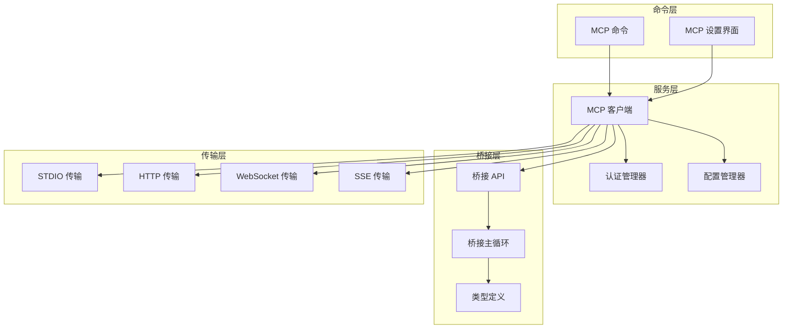
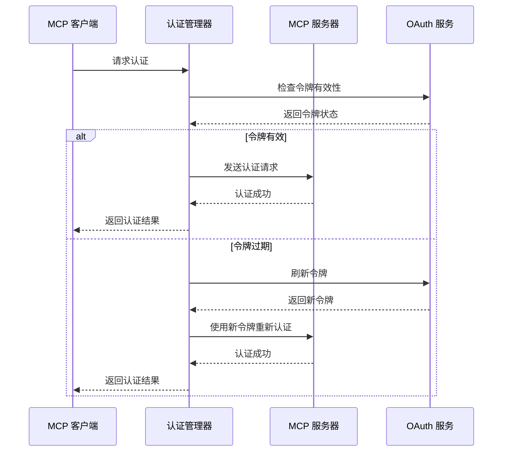
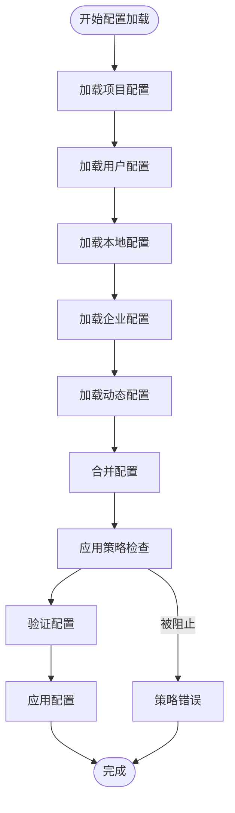
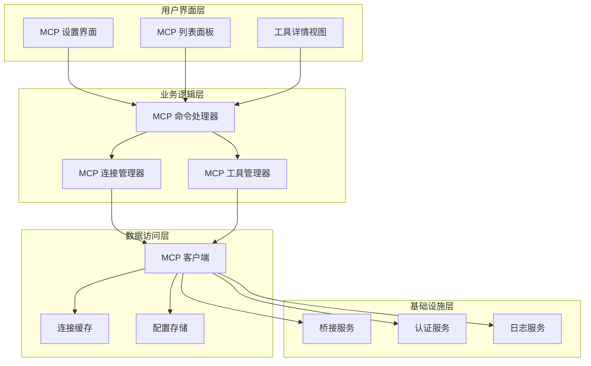
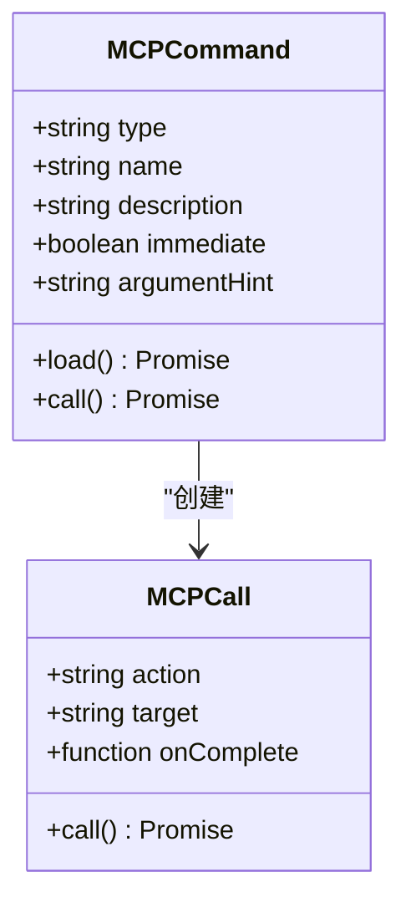
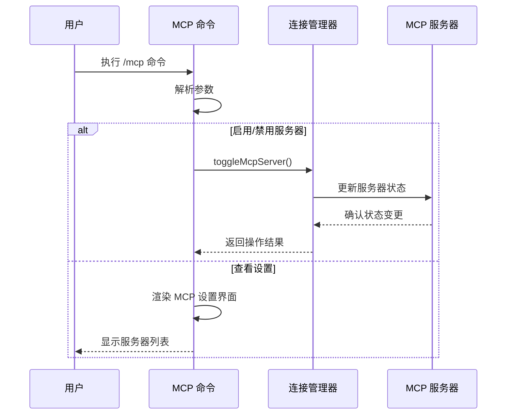
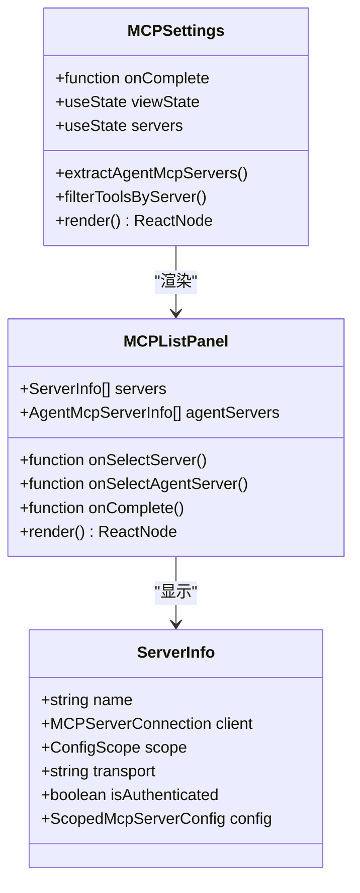
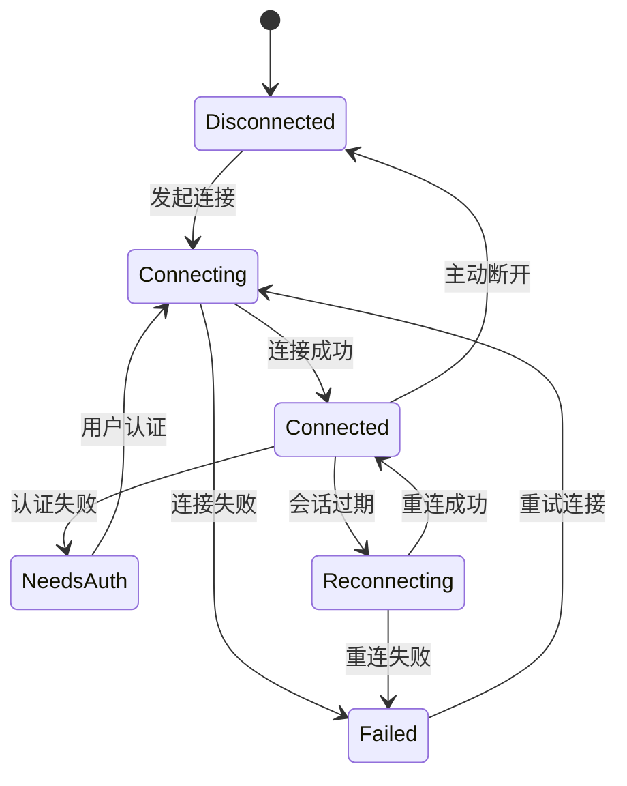
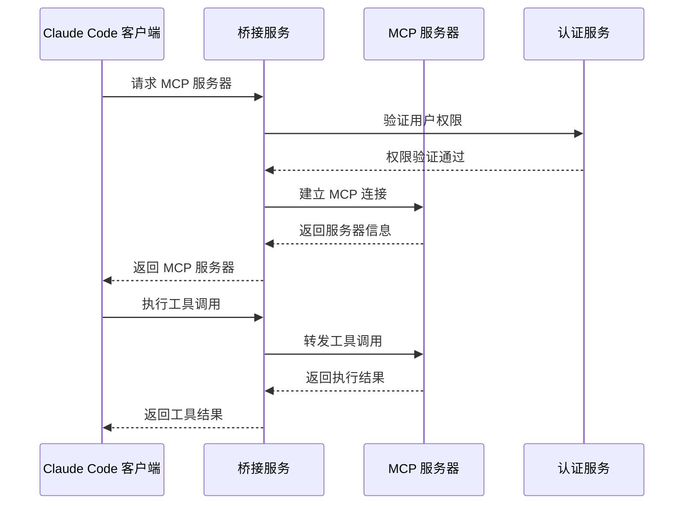

# MCP API

<cite>
**本文档引用的文件**
- [commands/mcp/index.ts](file://commands/mcp/index.ts)
- [commands/mcp/mcp.tsx](file://commands/mcp/mcp.tsx)
- [components/mcp/index.ts](file://components/mcp/index.ts)
- [components/mcp/MCPSettings.tsx](file://components/mcp/MCPSettings.tsx)
- [components/mcp/MCPListPanel.tsx](file://components/mcp/MCPListPanel.tsx)
- [services/mcp/client.ts](file://services/mcp/client.ts)
- [services/mcp/config.ts](file://services/mcp/config.ts)
- [services/mcp/auth.ts](file://services/mcp/auth.ts)
- [bridge/bridgeApi.ts](file://bridge/bridgeApi.ts)
- [bridge/bridgeMain.ts](file://bridge/bridgeMain.ts)
- [bridge/types.ts](file://bridge/types.ts)
</cite>

## 目录
1. [简介](#简介)
2. [项目结构](#项目结构)
3. [核心组件](#核心组件)
4. [架构概览](#架构概览)
5. [详细组件分析](#详细组件分析)
6. [依赖分析](#依赖分析)
7. [性能考虑](#性能考虑)
8. [故障排除指南](#故障排除指南)
9. [结论](#结论)
10. [附录](#附录)

## 简介

本文件为 Claude Code MCP（Model Context Protocol）集成的完整 API 文档。MCP 是一个开放协议，允许 AI 助手访问外部工具和服务。在 Claude Code 中，MCP 集成为开发者提供了强大的扩展能力，包括：

- **MCP 服务器连接管理**：支持本地 STDIO、远程 HTTP、WebSocket 和 SSE 传输
- **资源管理**：工具发现、资源列表和内容读取
- **工具调用**：安全的工具执行和结果处理
- **认证系统**：多层认证机制和令牌管理
- **连接重连策略**：智能重连和错误恢复
- **与 Claude Code 内部系统的集成**：无缝的用户体验

## 项目结构

Claude Code 的 MCP 集成采用模块化架构，主要分为以下几个层次：



**图表来源**
- [commands/mcp/index.ts:1-13](file://commands/mcp/index.ts#L1-L13)
- [services/mcp/client.ts:1-800](file://services/mcp/client.ts#L1-L800)
- [bridge/bridgeApi.ts:1-540](file://bridge/bridgeApi.ts#L1-L540)

**章节来源**
- [commands/mcp/index.ts:1-13](file://commands/mcp/index.ts#L1-L13)
- [components/mcp/index.ts:1-10](file://components/mcp/index.ts#L1-L10)

## 核心组件

### MCP 客户端核心功能

MCP 客户端是整个系统的核心，负责管理所有 MCP 服务器连接和工具调用。

#### 连接管理
- 支持多种传输协议：STDIO、HTTP、WebSocket、SSE
- 智能连接缓存和复用
- 自动重连机制和错误处理
- 会话管理和生命周期控制

#### 工具管理
- 工具发现和注册
- 工具参数验证和转换
- 工具调用结果处理
- 工具权限控制

#### 资源管理
- 资源列表获取
- 资源内容读取
- 资源元数据管理
- 资源缓存优化

**章节来源**
- [services/mcp/client.ts:1-800](file://services/mcp/client.ts#L1-L800)

### 认证系统

MCP 集成实现了多层次的认证机制：

#### 多层认证架构
- **OAuth 令牌管理**：自动刷新和轮换
- **服务器特定认证**：每个 MCP 服务器独立认证
- **会话级认证**：基于 JWT 的会话令牌
- **代理认证**：支持企业代理环境

#### 认证流程


**图表来源**
- [services/mcp/auth.ts](file://services/mcp/auth.ts)
- [services/mcp/client.ts:335-361](file://services/mcp/client.ts#L335-L361)

**章节来源**
- [services/mcp/auth.ts](file://services/mcp/auth.ts)
- [services/mcp/client.ts:152-186](file://services/mcp/client.ts#L152-L186)

### 配置管理系统

MCP 配置管理支持多种配置源和作用域：

#### 配置作用域
- **项目级配置**：存储在 `.mcp.json` 文件中
- **用户级配置**：全局用户配置
- **本地配置**：当前工作目录配置
- **企业配置**：受企业策略限制的配置
- **动态配置**：内置的默认配置

#### 配置合并策略


**图表来源**
- [services/mcp/config.ts:625-761](file://services/mcp/config.ts#L625-L761)

**章节来源**
- [services/mcp/config.ts:1-800](file://services/mcp/config.ts#L1-L800)

## 架构概览

Claude Code 的 MCP 集成采用分层架构设计，确保了系统的可扩展性和可维护性：



**图表来源**
- [commands/mcp/mcp.tsx:1-85](file://commands/mcp/mcp.tsx#L1-L85)
- [components/mcp/MCPSettings.tsx:1-398](file://components/mcp/MCPSettings.tsx#L1-L398)
- [services/mcp/client.ts:595-606](file://services/mcp/client.ts#L595-L606)

## 详细组件分析

### MCP 命令系统

MCP 命令系统提供了用户友好的交互界面：

#### 命令结构


**图表来源**
- [commands/mcp/index.ts:1-13](file://commands/mcp/index.ts#L1-L13)
- [commands/mcp/mcp.tsx:63-84](file://commands/mcp/mcp.tsx#L63-L84)

#### 命令执行流程


**图表来源**
- [commands/mcp/mcp.tsx:12-56](file://commands/mcp/mcp.tsx#L12-L56)

**章节来源**
- [commands/mcp/index.ts:1-13](file://commands/mcp/index.ts#L1-L13)
- [commands/mcp/mcp.tsx:1-85](file://commands/mcp/mcp.tsx#L1-L85)

### MCP 设置界面

MCP 设置界面提供了直观的服务器管理功能：

#### 界面组件结构


**图表来源**
- [components/mcp/MCPSettings.tsx:16-398](file://components/mcp/MCPSettings.tsx#L16-L398)
- [components/mcp/MCPListPanel.tsx:17-504](file://components/mcp/MCPListPanel.tsx#L17-L504)

#### 服务器状态管理
界面能够实时显示服务器的各种状态：

| 状态类型 | 描述 | 图标 | 处理方式 |
|---------|------|------|----------|
| connected | 连接正常 | ✓ | 可直接使用 |
| connecting | 正在连接 | ○ | 等待连接完成 |
| reconnecting | 重连中 | ○ | 继续等待或手动重试 |
| needs-auth | 需要认证 | △ | 引导用户进行认证 |
| failed | 连接失败 | ✗ | 显示错误信息并提供修复建议 |

**章节来源**
- [components/mcp/MCPSettings.tsx:1-398](file://components/mcp/MCPSettings.tsx#L1-L398)
- [components/mcp/MCPListPanel.tsx:1-504](file://components/mcp/MCPListPanel.tsx#L1-L504)

### MCP 客户端连接管理

MCP 客户端实现了复杂的连接管理机制：

#### 连接生命周期


**图表来源**
- [services/mcp/client.ts:595-606](file://services/mcp/client.ts#L595-L606)

#### 连接池管理
客户端使用连接池来优化资源使用：

| 特性 | 实现方式 | 性能影响 |
|------|----------|----------|
| 连接复用 | 缓存已建立的连接 | 减少连接建立开销 |
| 连接超时 | 60秒超时检测 | 防止连接泄漏 |
| 最大并发数 | 默认3个连接 | 控制资源消耗 |
| 连接健康检查 | 定期心跳检测 | 提前发现连接问题 |

**章节来源**
- [services/mcp/client.ts:552-561](file://services/mcp/client.ts#L552-L561)
- [services/mcp/client.ts:595-606](file://services/mcp/client.ts#L595-L606)

### 桥接服务集成

桥接服务是 Claude Code 与 MCP 服务器之间的桥梁：

#### 桥接架构


**图表来源**
- [bridge/bridgeApi.ts:141-197](file://bridge/bridgeApi.ts#L141-L197)
- [bridge/bridgeMain.ts:141-152](file://bridge/bridgeMain.ts#L141-L152)

#### 错误处理机制
桥接服务实现了完善的错误处理：

| 错误类型 | 处理方式 | 用户反馈 |
|----------|----------|----------|
| 认证失败 | 触发重新认证 | 显示认证提示 |
| 连接超时 | 自动重连 | 显示重连状态 |
| 服务器无响应 | 回退到备用服务器 | 显示服务器不可用 |
| 权限不足 | 引导用户升级权限 | 显示权限不足信息 |

**章节来源**
- [bridge/bridgeApi.ts:454-500](file://bridge/bridgeApi.ts#L454-L500)
- [bridge/bridgeMain.ts:141-152](file://bridge/bridgeMain.ts#L141-L152)

## 依赖分析

### 组件间依赖关系

```mermaid
graph TD
subgraph "外部依赖"
SDK[@modelcontextprotocol/sdk]
AXIOS[axios]
WS[ws]
Lodash[lodash-es]
end
subgraph "内部模块"
CLIENT[client.ts]
AUTH[auth.ts]
CONFIG[config.ts]
TYPES[types.ts]
UTILS[utils.ts]
end
subgraph "UI 组件"
SETTINGS[MCPSettings.tsx]
LIST[MCPListPanel.tsx]
TOOLS[MCPToolListView.tsx]
end
CLIENT --> SDK
CLIENT --> AXIOS
CLIENT --> WS
CLIENT --> Lodash
CLIENT --> AUTH
CLIENT --> CONFIG
CLIENT --> TYPES
CLIENT --> UTILS
SETTINGS --> CLIENT
LIST --> CLIENT
TOOLS --> CLIENT
```

**图表来源**
- [services/mcp/client.ts:1-800](file://services/mcp/client.ts#L1-L800)
- [components/mcp/MCPSettings.tsx:1-398](file://components/mcp/MCPSettings.tsx#L1-L398)

### 关键依赖特性

#### MCP SDK 集成
- 支持多种传输协议
- 内置消息序列化/反序列化
- 自动重连和错误处理
- 流式响应处理

#### HTTP 客户端配置
- 超时控制（60秒）
- 重试机制
- 代理支持
- TLS 配置

**章节来源**
- [services/mcp/client.ts:492-550](file://services/mcp/client.ts#L492-L550)
- [services/mcp/client.ts:1-800](file://services/mcp/client.ts#L1-L800)

## 性能考虑

### 连接优化策略

#### 连接池优化
- **并发连接数限制**：默认3个连接，避免资源耗尽
- **连接复用**：相同服务器的请求共享连接
- **连接健康监控**：定期检测连接状态
- **优雅关闭**：连接结束时正确释放资源

#### 缓存策略
- **认证令牌缓存**：15分钟TTL，减少重复认证
- **服务器配置缓存**：避免频繁读取配置文件
- **工具元数据缓存**：加速工具发现过程
- **资源内容缓存**：减少重复网络请求

### 性能监控指标

| 指标类型 | 目标值 | 监控方法 |
|----------|--------|----------|
| 连接成功率 | >99% | 统计连接尝试次数 |
| 平均响应时间 | <2秒 | 监控工具调用延迟 |
| 认证成功率 | >95% | 跟踪认证请求结果 |
| 错误率 | <1% | 监控异常情况 |

## 故障排除指南

### 常见问题诊断

#### 连接问题
**症状**：MCP 服务器显示 "connecting" 或 "failed"

**诊断步骤**：
1. 检查网络连接是否正常
2. 验证服务器 URL 是否正确
3. 确认防火墙设置允许连接
4. 检查代理配置

**解决方案**：
- 重启 MCP 服务器
- 检查服务器日志
- 验证服务器证书
- 联系服务器管理员

#### 认证问题
**症状**：MCP 服务器显示 "needs authentication"

**诊断步骤**：
1. 检查 OAuth 令牌是否有效
2. 验证服务器认证配置
3. 确认用户权限设置
4. 检查企业策略限制

**解决方案**：
- 重新登录获取新令牌
- 更新服务器认证配置
- 联系管理员提升权限
- 检查企业策略设置

#### 工具调用问题
**症状**：工具调用返回错误或超时

**诊断步骤**：
1. 检查工具参数格式
2. 验证工具可用性
3. 确认服务器负载情况
4. 检查网络延迟

**解决方案**：
- 修正工具调用参数
- 重试工具调用
- 优化服务器性能
- 调整超时设置

### 调试工具

#### 日志级别
- **调试模式**：详细的操作日志和错误信息
- **普通模式**：基本的操作状态和警告信息
- **静默模式**：仅显示严重错误

#### 调试命令
```bash
# 启用调试模式
claude --debug

# 查看 MCP 服务器状态
claude mcp status

# 重置 MCP 连接缓存
claude mcp reset-cache

# 导出 MCP 配置
claude mcp export-config
```

**章节来源**
- [components/mcp/MCPListPanel.tsx:425-431](file://components/mcp/MCPListPanel.tsx#L425-L431)

## 结论

Claude Code 的 MCP 集成提供了一个强大而灵活的扩展平台。通过模块化的架构设计、完善的认证机制和智能的连接管理，用户可以轻松地集成各种外部工具和服务。

### 主要优势

1. **多协议支持**：支持 STDIO、HTTP、WebSocket、SSE 等多种传输协议
2. **智能连接管理**：自动重连、连接池优化、健康检查
3. **安全认证**：多层次认证机制，支持企业级安全要求
4. **用户友好**：直观的界面和详细的错误提示
5. **高性能**：优化的缓存策略和连接管理

### 未来发展方向

1. **增强的工具管理**：更丰富的工具发现和管理功能
2. **改进的性能监控**：更详细的性能指标和分析
3. **扩展的认证支持**：支持更多类型的认证机制
4. **更好的错误处理**：更智能的错误诊断和自动修复

## 附录

### API 参考

#### MCP 客户端 API

| 方法 | 参数 | 返回值 | 描述 |
|------|------|--------|------|
| connectToServer | name, serverRef | Promise~MCPServerConnection~ | 连接到指定的 MCP 服务器 |
| getMcpServerConnectionBatchSize |  | number | 获取连接批次大小 |
| isMcpAuthCached | serverId | Promise~boolean~ | 检查服务器认证缓存 |
| clearMcpAuthCache |  | void | 清除认证缓存 |

#### 配置管理 API

| 方法 | 参数 | 返回值 | 描述 |
|------|------|--------|------|
| addMcpConfig | name, config, scope | Promise~void~ | 添加新的 MCP 服务器配置 |
| removeMcpConfig | name, scope | Promise~void~ | 移除 MCP 服务器配置 |
| getAllMcpConfigs |  | Promise~Record~ | 获取所有 MCP 配置 |
| isMcpServerDisabled | name | boolean | 检查服务器是否被禁用 |

#### 认证管理 API

| 方法 | 参数 | 返回值 | 描述 |
|------|------|--------|------|
| handleRemoteAuthFailure | name, serverRef, transportType | MCPServerConnection | 处理远程认证失败 |
| createClaudeAiProxyFetch | innerFetch | FetchLike | 创建 claude.ai 代理请求函数 |
| isMcpAuthCached | serverId | Promise~boolean~ | 检查认证缓存状态 |

### 配置示例

#### 基本 MCP 服务器配置
```json
{
  "mcpServers": {
    "my-server": {
      "type": "http",
      "url": "https://api.example.com/mcp",
      "headers": {
        "Authorization": "Bearer ${MCP_TOKEN}"
      }
    }
  }
}
```

#### 本地 MCP 服务器配置
```json
{
  "mcpServers": {
    "local-server": {
      "type": "stdio",
      "command": "python",
      "args": ["mcp-server.py"],
      "env": {
        "PORT": "8080"
      }
    }
  }
}
```

### 最佳实践

1. **安全配置**：始终使用 HTTPS 和适当的认证机制
2. **性能优化**：合理设置连接池大小和超时时间
3. **错误处理**：实现完善的错误处理和重试机制
4. **监控告警**：建立有效的监控和告警系统
5. **文档维护**：保持配置和使用文档的及时更新