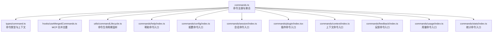
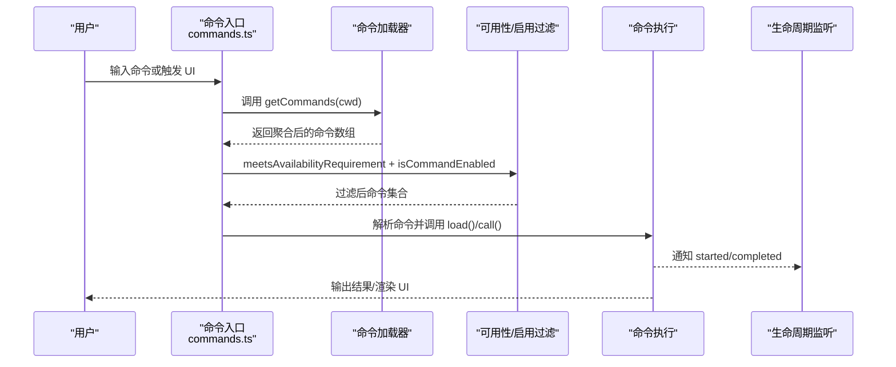
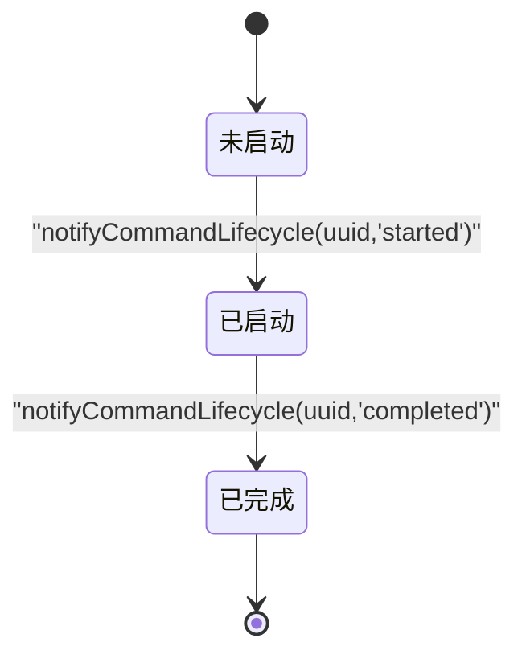
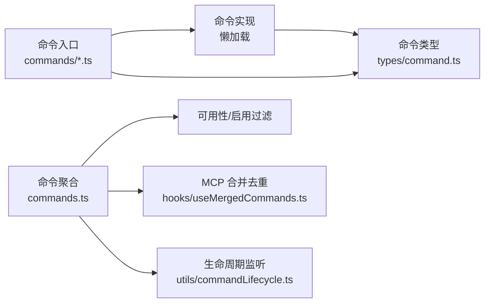

# 命令 API

<cite>
**本文引用的文件**
- [commands.ts](file://commands.ts)
- [types/command.ts](file://types/command.ts)
- [hooks/useMergedCommands.ts](file://hooks/useMergedCommands.ts)
- [utils/commandLifecycle.ts](file://utils/commandLifecycle.ts)
- [commands/help/index.ts](file://commands/help/index.ts)
- [commands/help/help.tsx](file://commands/help/help.tsx)
- [commands/config/index.ts](file://commands/config/index.ts)
- [commands/config/config.tsx](file://commands/config/config.tsx)
- [commands/session/index.ts](file://commands/session/index.ts)
- [commands/session/session.tsx](file://commands/session/session.tsx)
- [commands/plugin/index.tsx](file://commands/plugin/index.tsx)
- [commands/plugin/plugin.tsx](file://commands/plugin/plugin.tsx)
- [commands/context/index.ts](file://commands/context/index.ts)
- [commands/feedback/index.ts](file://commands/feedback/index.ts)
- [commands/usage/index.ts](file://commands/usage/index.ts)
- [commands/stats/index.ts](file://commands/stats/index.ts)
</cite>

## 目录
1. [简介](#简介)
2. [项目结构](#项目结构)
3. [核心组件](#核心组件)
4. [架构总览](#架构总览)
5. [详细组件分析](#详细组件分析)
6. [依赖关系分析](#依赖关系分析)
7. [性能考量](#性能考量)
8. [故障排除指南](#故障排除指南)
9. [结论](#结论)
10. [附录](#附录)

## 简介
本文件为 Claude Code 命令系统的 API 文档，面向开发者与高级用户，系统性梳理内置命令的接口规范、调用方式、参数与返回值、错误处理、权限与安全限制、扩展与自定义命令开发接口、生命周期管理与状态转换、以及调试与故障排除工具。文档同时提供命令在不同运行模式（本地、远程、桥接）下的可用性与安全策略说明，并给出可操作的最佳实践。

## 项目结构
命令系统的核心由“命令注册与发现”“命令类型与上下文”“命令生命周期”“UI 命令与非 UI 命令”“可用性与安全过滤”等模块构成。命令来源包括内置命令、技能目录、插件、工作流、MCP 技能等；命令通过统一的命令集合加载器进行聚合与去重，并按可用性与启用状态进行筛选。

图表来源
- [commands.ts:258-517](file://commands.ts#L258-L517)
- [types/command.ts:16-217](file://types/command.ts#L16-L217)
- [hooks/useMergedCommands.ts:1-16](file://hooks/useMergedCommands.ts#L1-L16)
- [utils/commandLifecycle.ts:1-22](file://utils/commandLifecycle.ts#L1-L22)
- [commands/help/index.ts:1-11](file://commands/help/index.ts#L1-L11)
- [commands/config/index.ts:1-12](file://commands/config/index.ts#L1-L12)
- [commands/session/index.ts:1-17](file://commands/session/index.ts#L1-L17)
- [commands/plugin/index.tsx:1-11](file://commands/plugin/index.tsx#L1-L11)
- [commands/context/index.ts:1-25](file://commands/context/index.ts#L1-L25)
- [commands/feedback/index.ts:1-27](file://commands/feedback/index.ts#L1-L27)
- [commands/usage/index.ts:1-50](file://commands/usage/index.ts#L1-L50)
- [commands/stats/index.ts:1-50](file://commands/stats/index.ts#L1-L50)

章节来源
- [commands.ts:258-517](file://commands.ts#L258-L517)
- [types/command.ts:16-217](file://types/command.ts#L16-L217)

## 核心组件
- 命令类型与上下文
  - PromptCommand：模型可调用的提示型命令，支持内容长度、进度消息、工具白名单、上下文执行模式（内联/分叉）、路径过滤、钩子设置等。
  - LocalCommand：本地命令，支持非交互式执行，延迟加载实现。
  - LocalJSXCommand：本地 JSX 命令，延迟加载 UI 组件，用于渲染交互界面。
  - CommandBase：通用元数据，如名称、别名、描述、启用状态、隐藏标记、可用性、来源、版本、是否对模型可见等。
- 命令集合与发现
  - 内置命令列表、动态技能、插件命令、工作流命令、MCP 技能统一聚合，按可用性与启用状态过滤，支持去重与动态插入。
- 命令生命周期
  - 提供生命周期监听器注册与通知机制，便于外部观察命令启动与完成事件。
- 命令合并与去重
  - 当存在 MCP 提供的命令时，与初始命令集进行去重合并，保证名称唯一。

章节来源
- [types/command.ts:16-217](file://types/command.ts#L16-L217)
- [commands.ts:258-517](file://commands.ts#L258-L517)
- [utils/commandLifecycle.ts:1-22](file://utils/commandLifecycle.ts#L1-L22)
- [hooks/useMergedCommands.ts:1-16](file://hooks/useMergedCommands.ts#L1-L16)

## 架构总览
命令系统采用“声明式入口 + 动态聚合 + 运行时过滤”的架构。命令入口文件仅声明元信息与懒加载函数，实际实现按需加载；聚合层负责从多源加载命令并去重；过滤层根据可用性、启用状态、运行模式与安全策略进行筛选；生命周期与合并钩子贯穿命令的发现、加载与展示阶段。

图表来源
- [commands.ts:476-517](file://commands.ts#L476-L517)
- [utils/commandLifecycle.ts:16-21](file://utils/commandLifecycle.ts#L16-L21)

## 详细组件分析

### 命令类型与接口规范
- PromptCommand
  - 关键字段：type='prompt'、progressMessage、contentLength、argNames、allowedTools、model、source、pluginInfo、disableNonInteractive、hooks、skillRoot、context（'inline'|'fork'）、agent、effort、paths、getPromptForCommand(args, context)。
  - 执行流程：模型侧调用时，通过 getPromptForCommand 生成内容块，用于对话上下文扩展。
  - 参数验证：由具体命令实现负责；框架层提供路径过滤、工具白名单、上下文模式等约束。
  - 返回值：ContentBlockParam[]（文本/图像等）。
  - 错误处理：命令实现内部捕获异常并返回可读错误信息；框架层记录日志并继续服务。
- LocalCommand
  - 关键字段：type='local'、supportsNonInteractive、load() 返回 { call(args, context) }。
  - 执行流程：非交互式会话中直接调用 call(args, context)，返回 LocalCommandResult（text/compact/skip）。
  - 参数验证：命令实现自行校验；框架层提供非交互式开关。
  - 返回值：LocalCommandResult。
- LocalJSXCommand
  - 关键字段：type='local-jsx'、load() 返回 { call(onDone, context, args) }。
  - 执行流程：渲染 UI 组件，onDone 回调用于关闭面板、传递结果与后续输入。
  - 参数验证：UI 层进行输入校验；框架层提供上下文（主题、IDE 状态、动态 MCP 配置等）。
  - 返回值：React 节点。

章节来源
- [types/command.ts:16-152](file://types/command.ts#L16-L152)

### 命令可用性与安全策略
- 可用性要求
  - availability 支持 'claude-ai'（claude.ai 订阅者）与 'console'（Console 直连 api.anthropic.com 用户）。meetAvailabilityRequirement 在 getCommands 中先行过滤。
- 远程模式安全
  - REMOTE_SAFE_COMMANDS：仅允许在远程模式下执行的本地命令集合（如 session、exit、clear、help、theme、color、vim、cost、usage、copy、btw、feedback、plan、keybindings、statusline、stickers、mobile）。
  - BRIDGE_SAFE_COMMANDS：通过远程桥接（移动端/网页）允许执行的本地命令集合（如 compact、clear、cost、summary、releaseNotes、files），prompt 命令默认允许，local-jsx 命令默认阻止。
  - isBridgeSafeCommand：综合判断命令类型与安全集合。
- 权限与隐私
  - 某些命令受环境变量与隐私级别限制（例如禁用反馈/缺陷报告、最小化流量模式、特定用户类型）。

章节来源
- [commands.ts:417-443](file://commands.ts#L417-L443)
- [commands.ts:619-686](file://commands.ts#L619-L686)
- [commands.ts:672-676](file://commands.ts#L672-L676)
- [commands/feedback/index.ts:12-22](file://commands/feedback/index.ts#L12-L22)

### 命令生命周期与状态转换
- 生命周期状态：started → completed。
- 监听器注册：setCommandLifecycleListener(cb)；通知：notifyCommandLifecycle(uuid, state)。
- 使用场景：外部模块（如遥测、UI 状态）订阅命令生命周期，实现统计与可视化。

图表来源
- [utils/commandLifecycle.ts:1-22](file://utils/commandLifecycle.ts#L1-L22)

章节来源
- [utils/commandLifecycle.ts:1-22](file://utils/commandLifecycle.ts#L1-L22)

### 命令合并与去重
- 当 MCP 提供命令时，useMergedCommands 将 MCP 命令与初始命令集合并，并按 name 去重，确保名称唯一且优先保留初始命令集中的同名项。

章节来源
- [hooks/useMergedCommands.ts:1-16](file://hooks/useMergedCommands.ts#L1-L16)

### 典型命令示例与最佳实践

#### 帮助命令（LocalJSX）
- 入口与元信息
  - 类型：local-jsx
  - 名称：help
  - 描述：显示帮助与可用命令
  - 加载：懒加载 UI 组件
- 调用方式
  - UI 命令，通过 onDone 关闭面板；命令列表由上下文注入。
- 最佳实践
  - 保持描述简洁明确；避免在 description 中泄露敏感信息；必要时使用 argumentHint 提示参数格式。

章节来源
- [commands/help/index.ts:1-11](file://commands/help/index.ts#L1-L11)
- [commands/help/help.tsx:1-11](file://commands/help/help.tsx#L1-L11)

#### 配置命令（LocalJSX）
- 入口与元信息
  - 类型：local-jsx
  - 名称：config（别名：settings）
  - 描述：打开配置面板
  - 加载：懒加载设置组件
- 调用方式
  - UI 命令，onDone 关闭面板；支持默认标签页切换。
- 最佳实践
  - 对敏感设置进行访问控制；在 UI 中提供撤销与确认流程。

章节来源
- [commands/config/index.ts:1-12](file://commands/config/index.ts#L1-L12)
- [commands/config/config.tsx:1-7](file://commands/config/config.tsx#L1-L7)

#### 会话命令（LocalJSX，远程模式）
- 入口与元信息
  - 类型：local-jsx
  - 名称：session（别名：remote）
  - 描述：显示远程会话 URL 与二维码
  - 启用条件：仅在远程模式下启用
  - 加载：懒加载会话信息组件
- 调用方式
  - UI 命令，渲染二维码与 URL；不支持非交互式。
- 最佳实践
  - 在非远程模式下提示用户使用 --remote 启动；QR 生成失败时记录调试日志。

章节来源
- [commands/session/index.ts:1-17](file://commands/session/index.ts#L1-L17)
- [commands/session/session.tsx:1-140](file://commands/session/session.tsx#L1-L140)

#### 插件命令（LocalJSX，立即执行）
- 入口与元信息
  - 类型：local-jsx
  - 名称：plugin（别名：plugins、marketplace）
  - 描述：管理 Claude Code 插件
  - 立即执行：immediate=true
  - 加载：懒加载插件设置组件
- 调用方式
  - UI 命令，onDone 完成回调；支持传入参数 args。
- 最佳实践
  - 对插件安装/卸载进行权限校验；在 UI 中提供进度与错误提示。

章节来源
- [commands/plugin/index.tsx:1-11](file://commands/plugin/index.tsx#L1-L11)
- [commands/plugin/plugin.tsx:1-7](file://commands/plugin/plugin.tsx#L1-L7)

#### 上下文命令（LocalJSX 与 Local 非交互）
- 入口与元信息
  - 名称：context
  - 交互式版本：local-jsx，用于可视化上下文使用情况
  - 非交互式版本：local，支持非交互式会话，输出当前上下文使用情况
- 调用方式
  - 交互式：渲染可视化网格；非交互式：返回文本摘要。
- 最佳实践
  - 在非交互式会话中避免渲染重型 UI；在交互式会话中提供清晰的视觉反馈。

章节来源
- [commands/context/index.ts:1-25](file://commands/context/index.ts#L1-L25)

#### 反馈命令（LocalJSX，可用性受限）
- 入口与元信息
  - 类型：local-jsx
  - 名称：feedback（别名：bug）
  - 描述：提交关于 Claude Code 的反馈
  - 参数提示：argumentHint="[report]"
  - 启用条件：受环境变量、隐私级别、策略限制与用户类型影响
  - 加载：懒加载反馈组件
- 调用方式
  - UI 命令，onDone 关闭面板；支持参数传入。
- 最佳实践
  - 在隐私模式或企业环境中谨慎启用；对敏感信息进行脱敏处理。

章节来源
- [commands/feedback/index.ts:1-27](file://commands/feedback/index.ts#L1-L27)

#### 用量与统计命令（Prompt/Local）
- 入口与元信息
  - 名称：usage、stats
  - 类型：根据具体实现（Prompt 或 Local）
  - 描述：显示用量信息与统计
  - 加载：按需导入实现文件
- 调用方式
  - Prompt 命令：模型侧调用，返回内容块；Local 命令：本地执行，返回文本或紧凑结果。
- 最佳实践
  - 对敏感数据进行脱敏；在非交互式会话中提供简洁输出。

章节来源
- [commands/usage/index.ts:1-50](file://commands/usage/index.ts#L1-L50)
- [commands/stats/index.ts:1-50](file://commands/stats/index.ts#L1-L50)

### 命令扩展与自定义命令开发接口
- 自定义命令来源
  - 技能目录：/skills 下的命令自动被发现与加载。
  - 插件命令：通过插件系统注册的命令。
  - 工作流命令：基于工作流脚本生成的命令。
  - MCP 技能：通过 MCP 协议提供的模型可调用技能。
- 开发步骤
  - 定义命令入口文件，导出 Command 对象（含 name/description/type/load 等）。
  - 实现命令逻辑：
    - PromptCommand：实现 getPromptForCommand(args, context)。
    - LocalCommand：实现 supportsNonInteractive 与 call(args, context)。
    - LocalJSXCommand：实现 load() 返回的 call(onDone, context, args)。
  - 可选增强：设置 availability、isEnabled、isHidden、aliases、argumentHint、whenToUse、version、disableModelInvocation、userInvocable、loadedFrom、kind、immediate、isSensitive、userFacingName 等。
- 发现与聚合
  - 将命令加入 commands.ts 的 COMMANDS 列表或通过 getSkills/getPluginCommands 等异步加载器返回。
  - 使用 getCommands(cwd) 获取最终命令集合；必要时调用 clearCommandMemoizationCaches 清理缓存以反映新增动态技能。
- 安全与可用性
  - 通过 availability 限定可用环境；通过 isEnabled 控制特性开关；通过 isHidden 控制是否出现在类型提示中。
  - 对于远程/桥接场景，遵循 REMOTE_SAFE_COMMANDS 与 BRIDGE_SAFE_COMMANDS 白名单策略。

章节来源
- [commands.ts:258-517](file://commands.ts#L258-L517)
- [commands.ts:547-559](file://commands.ts#L547-L559)
- [commands.ts:619-686](file://commands.ts#L619-L686)
- [commands.ts:672-676](file://commands.ts#L672-L676)

## 依赖关系分析
- 命令入口到实现
  - commands/*.ts 文件仅导出 Command 元信息与 load 函数，实际实现通过 import() 懒加载。
- 命令聚合与过滤
  - commands.ts 聚合多源命令，按 availability 与 isEnabled 过滤，支持动态技能插入与去重。
- UI 与上下文
  - LocalJSX 命令通过 LocalJSXCommandContext 注入主题、IDE 状态、动态 MCP 配置等上下文。
- 生命周期与合并
  - utils/commandLifecycle.ts 提供全局监听器；hooks/useMergedCommands.ts 处理 MCP 命令合并。

图表来源
- [commands.ts:258-517](file://commands.ts#L258-L517)
- [hooks/useMergedCommands.ts:1-16](file://hooks/useMergedCommands.ts#L1-L16)
- [utils/commandLifecycle.ts:1-22](file://utils/commandLifecycle.ts#L1-L22)
- [types/command.ts:16-217](file://types/command.ts#L16-L217)

章节来源
- [commands.ts:258-517](file://commands.ts#L258-L517)
- [hooks/useMergedCommands.ts:1-16](file://hooks/useMergedCommands.ts#L1-L16)
- [utils/commandLifecycle.ts:1-22](file://utils/commandLifecycle.ts#L1-L22)
- [types/command.ts:16-217](file://types/command.ts#L16-L217)

## 性能考量
- 懒加载与缓存
  - 命令实现通过 load() 懒加载，减少初始化开销；commands.ts 对命令聚合与技能加载进行 memoize 缓存，避免重复 I/O。
- 并发加载
  - getSkills、getPluginCommands、getWorkflowCommands 等通过 Promise.all 并发加载，提升启动速度。
- 远程/桥接优化
  - REMOTE_SAFE_COMMANDS 与 BRIDGE_SAFE_COMMANDS 白名单减少不必要的命令渲染与执行，降低网络与渲染压力。
- 建议
  - 将重型 UI 组件拆分为独立模块并懒加载；对频繁调用的命令实现进行轻量化；合理使用 isHidden 与 isEnabled 控制曝光与启用。

[本节为通用建议，无需列出章节来源]

## 故障排除指南
- 命令未出现或不可见
  - 检查 availability 是否满足当前环境；检查 isEnabled 是否开启；检查 isHidden 是否导致隐藏。
  - 对于动态技能，调用 clearCommandMemoizationCaches 清理缓存后重新加载。
- 命令执行失败
  - 查看命令实现中的错误处理与日志记录；确认参数格式与必填项；检查上下文（主题、IDE 状态、动态 MCP 配置）是否完整。
- 远程/桥接不可用
  - 确认命令类型是否在 REMOTE_SAFE_COMMANDS 或 BRIDGE_SAFE_COMMANDS 中；对于 local-jsx 命令，默认不允许通过桥接执行。
- UI 命令无法关闭
  - 确保 onDone 回调正确调用；在 UI 组件中提供显式的关闭入口（如 ESC）。
- 生命周期事件未触发
  - 确认 setCommandLifecycleListener 已正确注册监听器；检查 notifyCommandLifecycle 的调用时机。

章节来源
- [commands.ts:417-443](file://commands.ts#L417-L443)
- [commands.ts:619-686](file://commands.ts#L619-L686)
- [commands.ts:672-676](file://commands.ts#L672-L676)
- [utils/commandLifecycle.ts:16-21](file://utils/commandLifecycle.ts#L16-L21)

## 结论
Claude Code 命令系统通过声明式入口、多源聚合、运行时过滤与安全策略，实现了灵活、可扩展且安全的命令生态。开发者可通过统一的命令类型与上下文接口快速扩展命令能力；通过生命周期与合并钩子实现可观测与一致的用户体验；通过可用性与远程/桥接安全策略保障在不同运行模式下的稳定性与安全性。

[本节为总结，无需列出章节来源]

## 附录

### 命令接口速查表
- PromptCommand
  - 字段：type、progressMessage、contentLength、argNames、allowedTools、model、source、pluginInfo、disableNonInteractive、hooks、skillRoot、context、agent、effort、paths、getPromptForCommand(args, context)
  - 调用：模型侧扩展对话上下文
  - 返回：ContentBlockParam[]
- LocalCommand
  - 字段：type、supportsNonInteractive、load()、call(args, context)
  - 调用：本地执行，支持非交互式
  - 返回：LocalCommandResult（text/compact/skip）
- LocalJSXCommand
  - 字段：type、load()、call(onDone, context, args)
  - 调用：渲染 UI 组件
  - 返回：React 节点

章节来源
- [types/command.ts:16-152](file://types/command.ts#L16-L152)

### 命令可用性与安全清单
- 可用性：availability=['claude-ai'|'console']
- 远程安全：REMOTE_SAFE_COMMANDS（会话、退出、清屏、帮助、主题、颜色、Vim、用量、复制、备注、反馈、计划、快捷键、状态栏、贴纸、移动端）
- 桥接安全：BRIDGE_SAFE_COMMANDS（紧凑、清屏、用量、摘要、更新日志、文件列表）
- 默认策略：prompt 命令允许；local-jsx 命令阻止；local 命令需显式列入白名单

章节来源
- [commands.ts:619-686](file://commands.ts#L619-L686)
- [commands.ts:672-676](file://commands.ts#L672-L676)