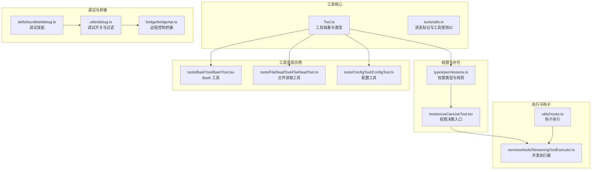
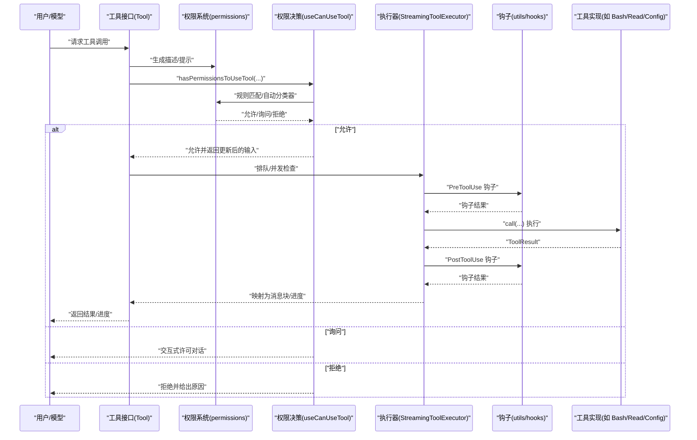
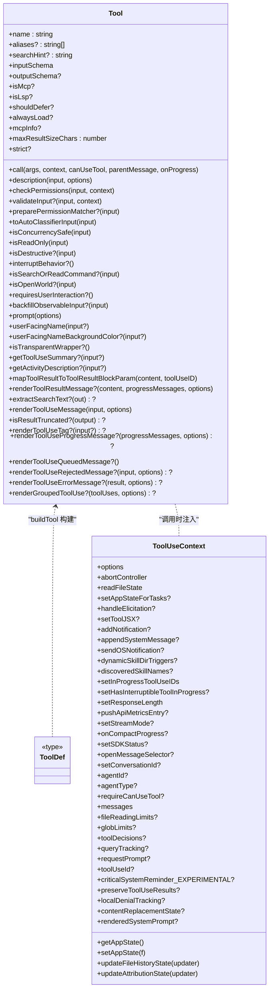
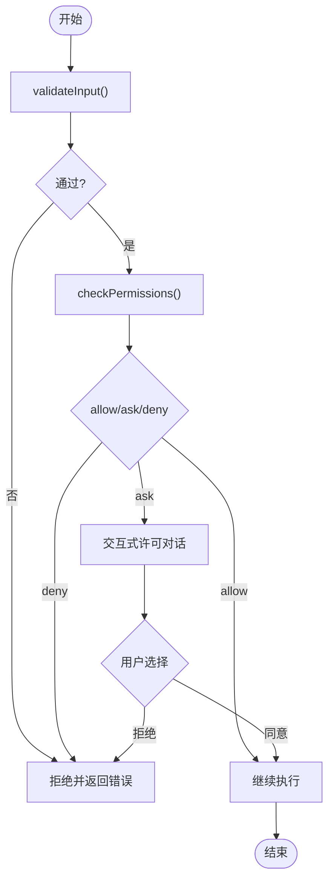
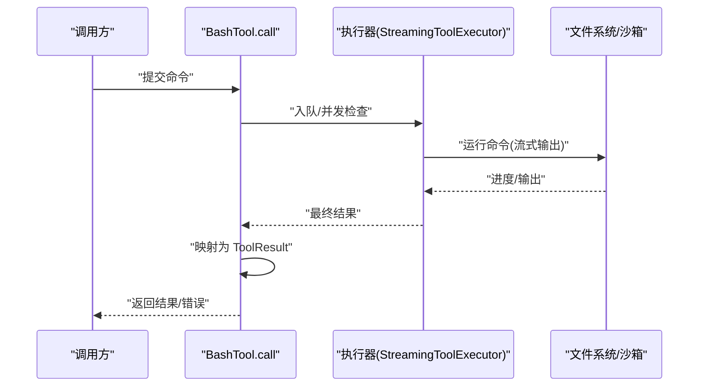
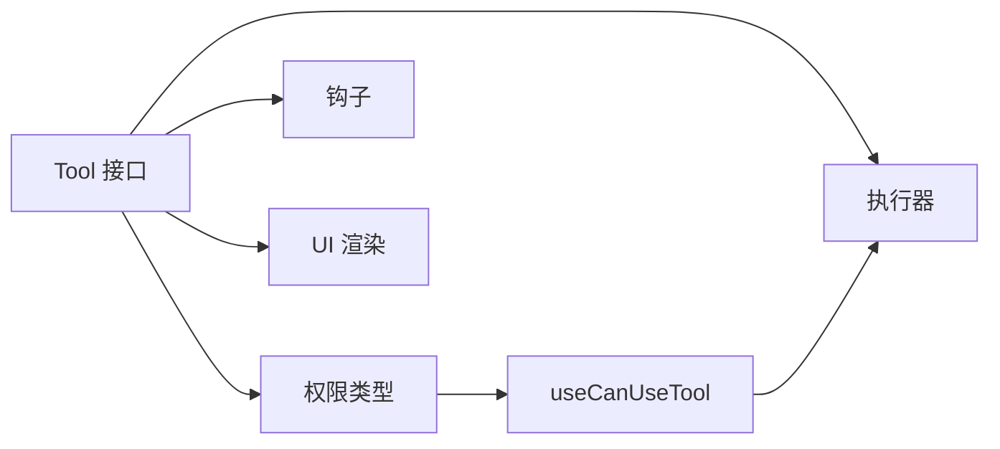

# 工具 API

<cite>
**本文引用的文件**
- [Tool.ts](file://Tool.ts)
- [tools/utils.ts](file://tools/utils.ts)
- [types/permissions.ts](file://types/permissions.ts)
- [hooks/useCanUseTool.tsx](file://hooks/useCanUseTool.tsx)
- [constants/tools.ts](file://constants/tools.ts)
- [tools/BashTool/BashTool.tsx](file://tools/BashTool/BashTool.tsx)
- [tools/FileReadTool/FileReadTool.ts](file://tools/FileReadTool/FileReadTool.ts)
- [tools/ConfigTool/ConfigTool.ts](file://tools/ConfigTool/ConfigTool.ts)
- [utils/commandLifecycle.ts](file://utils/commandLifecycle.ts)
- [services/tools/StreamingToolExecutor.ts](file://services/tools/StreamingToolExecutor.ts)
- [utils/hooks.ts](file://utils/hooks.ts)
- [skills/bundled/debug.ts](file://skills/bundled/debug.ts)
- [utils/debug.ts](file://utils/debug.ts)
- [bridge/bridgeApi.ts](file://bridge/bridgeApi.ts)
</cite>

## 目录
1. [简介](#简介)
2. [项目结构](#项目结构)
3. [核心组件](#核心组件)
4. [架构总览](#架构总览)
5. [详细组件分析](#详细组件分析)
6. [依赖分析](#依赖分析)
7. [性能考量](#性能考量)
8. [故障排查指南](#故障排查指南)
9. [结论](#结论)
10. [附录](#附录)

## 简介
本文件为 Claude Code 工具系统提供完整的 API 参考与开发指南，覆盖工具接口规范、权限模型、安全检查、生命周期管理、状态维护、错误处理、扩展与自定义工具实现、与权限系统的集成关系，以及测试与调试方法。内容基于仓库源码进行系统化梳理，确保技术细节与可操作性兼顾。

## 项目结构
工具系统围绕统一的工具抽象构建，核心位于根级工具定义与类型声明，并在 tools 目录下提供具体工具实现；权限与许可逻辑分布在 types/permissions.ts 与 hooks/useCanUseTool.tsx 中；运行时执行由 services/tools/StreamingToolExecutor.ts 负责；调试与桥接能力通过 utils/debug.ts 与 bridge/bridgeApi.ts 提供。

**图表来源**
- [Tool.ts:1-793](file://Tool.ts#L1-L793)
- [tools/utils.ts:1-41](file://tools/utils.ts#L1-L41)
- [types/permissions.ts:1-442](file://types/permissions.ts#L1-L442)
- [hooks/useCanUseTool.tsx:1-204](file://hooks/useCanUseTool.tsx#L1-L204)
- [tools/BashTool/BashTool.tsx:1-800](file://tools/BashTool/BashTool.tsx#L1-L800)
- [tools/FileReadTool/FileReadTool.ts:1-800](file://tools/FileReadTool/FileReadTool.ts#L1-L800)
- [tools/ConfigTool/ConfigTool.ts:1-468](file://tools/ConfigTool/ConfigTool.ts#L1-L468)
- [services/tools/StreamingToolExecutor.ts:123-151](file://services/tools/StreamingToolExecutor.ts#L123-L151)
- [utils/hooks.ts:3884-3922](file://utils/hooks.ts#L3884-L3922)
- [skills/bundled/debug.ts:1-29](file://skills/bundled/debug.ts#L1-L29)
- [utils/debug.ts:42-83](file://utils/debug.ts#L42-L83)
- [bridge/bridgeApi.ts:1-540](file://bridge/bridgeApi.ts#L1-L540)

**章节来源**
- [Tool.ts:1-793](file://Tool.ts#L1-L793)
- [tools/utils.ts:1-41](file://tools/utils.ts#L1-L41)
- [types/permissions.ts:1-442](file://types/permissions.ts#L1-L442)
- [hooks/useCanUseTool.tsx:1-204](file://hooks/useCanUseTool.tsx#L1-L204)
- [constants/tools.ts:1-113](file://constants/tools.ts#L1-L113)

## 核心组件
- 工具抽象与类型：统一的 Tool 接口、ToolDef、ToolUseContext、ToolResult、权限上下文等，定义了工具的输入输出、行为特性、渲染与进度回调、权限校验、并发安全等契约。
- 权限系统：权限模式、规则、决策结果、自动分类器、工作目录附加范围等，贯穿工具调用前的许可判断。
- 执行器：并发安全策略、队列调度、钩子执行、慢阶段日志与性能追踪。
- 具体工具：Bash、FileRead、Config 等典型工具的输入/输出模式、安全约束、UI 渲染与错误映射。
- 调试与桥接：会话级调试开关、日志路径、远程控制桥接 API 的认证与重试、致命错误处理。

**章节来源**
- [Tool.ts:362-695](file://Tool.ts#L362-L695)
- [types/permissions.ts:16-442](file://types/permissions.ts#L16-L442)
- [services/tools/StreamingToolExecutor.ts:123-151](file://services/tools/StreamingToolExecutor.ts#L123-L151)
- [tools/BashTool/BashTool.tsx:420-800](file://tools/BashTool/BashTool.tsx#L420-L800)
- [tools/FileReadTool/FileReadTool.ts:337-800](file://tools/FileReadTool/FileReadTool.ts#L337-L800)
- [tools/ConfigTool/ConfigTool.ts:67-468](file://tools/ConfigTool/ConfigTool.ts#L67-L468)
- [utils/debug.ts:42-83](file://utils/debug.ts#L42-L83)
- [bridge/bridgeApi.ts:56-540](file://bridge/bridgeApi.ts#L56-L540)

## 架构总览
工具调用从“描述/提示生成”开始，经“权限决策（含自动分类器）”、“并发与队列调度”、“工具执行”、“结果映射与 UI 渲染”，最终进入“钩子与后处理”。权限系统贯穿其中，提供统一的许可模型与安全边界。

**图表来源**
- [Tool.ts:379-560](file://Tool.ts#L379-L560)
- [hooks/useCanUseTool.tsx:32-183](file://hooks/useCanUseTool.tsx#L32-L183)
- [services/tools/StreamingToolExecutor.ts:129-151](file://services/tools/StreamingToolExecutor.ts#L129-L151)
- [utils/hooks.ts:3884-3922](file://utils/hooks.ts#L3884-L3922)

## 详细组件分析

### 工具抽象与接口规范
- 工具接口关键点
  - 输入/输出：通过 Zod schema 定义输入，输出通过 outputSchema 描述；支持 JSON Schema 输入（inputJSONSchema）。
  - 行为特性：是否只读、是否破坏性、是否并发安全、中断行为、是否搜索/读取命令、是否开放世界、是否 MCP/LSP 工具等。
  - 生命周期钩子：validateInput、checkPermissions、preparePermissionMatcher、toAutoClassifierInput、renderToolUseMessage/Progress/Queued/Error/Rejected、mapToolResultToToolResultBlockParam 等。
  - 上下文：ToolUseContext 提供工具运行期所需的能力（文件读写缓存、AppState、通知、消息追加、权限上下文、限额等）。
  - 结果：ToolResult 支持新消息注入、上下文修改器、MCP 元数据透传。
- 默认实现：buildTool 使用 TOOL_DEFAULTS 填充常用方法，保证一致性与安全默认。

**图表来源**
- [Tool.ts:362-695](file://Tool.ts#L362-L695)
- [Tool.ts:158-300](file://Tool.ts#L158-L300)

**章节来源**
- [Tool.ts:362-695](file://Tool.ts#L362-L695)
- [Tool.ts:783-792](file://Tool.ts#L783-L792)

### 权限模型与安全检查
- 权限模式与规则
  - 模式：acceptEdits、bypassPermissions、default、dontAsk、plan、auto（可选）、bubble。
  - 规则来源：用户设置、项目设置、本地设置、标志位、策略、命令行、会话等。
  - 决策：allow、deny、ask；支持挂起分类器检查、建议更新、元数据、阻断路径等。
- 许可流程
  - 工具在调用前先 validateInput，再 checkPermissions，最后由 useCanUseTool 统一决策，必要时触发交互式许可对话或自动分类器。
  - 分类器支持快速/思考两阶段，带令牌用量与持续时间统计。
- 工作目录与沙箱
  - 额外工作目录附加范围、危险规则剥离、避免弹窗模式、自动化检查前置等。

**图表来源**
- [Tool.ts:489-503](file://Tool.ts#L489-L503)
- [hooks/useCanUseTool.tsx:32-183](file://hooks/useCanUseTool.tsx#L32-L183)
- [types/permissions.ts:16-442](file://types/permissions.ts#L16-L442)

**章节来源**
- [types/permissions.ts:16-442](file://types/permissions.ts#L16-L442)
- [hooks/useCanUseTool.tsx:32-183](file://hooks/useCanUseTool.tsx#L32-L183)

### Bash 工具（示例）
- 输入/输出
  - 输入：命令字符串、超时、描述、后台运行、危险禁用沙箱、内部 sed 预计算等。
  - 输出：标准输出/错误、是否图像、后台任务ID、解释语义、持久化路径等。
- 安全与并发
  - 只读检测、权限检查、沙箱注解、自动背景化策略、阻塞 sleep 检测。
- UI 与结果映射
  - 进度消息、错误/拒绝 UI、大结果持久化与预览、图像压缩与尺寸限制。
- 并发与队列
  - 通过执行器保证非并发工具串行、并发安全工具并行。

**图表来源**
- [tools/BashTool/BashTool.tsx:624-800](file://tools/BashTool/BashTool.tsx#L624-L800)
- [services/tools/StreamingToolExecutor.ts:129-151](file://services/tools/StreamingToolExecutor.ts#L129-L151)

**章节来源**
- [tools/BashTool/BashTool.tsx:227-296](file://tools/BashTool/BashTool.tsx#L227-L296)
- [tools/BashTool/BashTool.tsx:420-800](file://tools/BashTool/BashTool.tsx#L420-L800)

### 文件读取工具（FileRead）
- 输入/输出
  - 输入：绝对路径、偏移行、限制行数、PDF 页面范围。
  - 输出：文本、图像、笔记本、PDF 元信息、页面拆分、未变更占位等。
- 安全与限制
  - 设备文件阻断、UNC 路径延迟检查、二进制扩展白名单、最大大小/令牌限制、重复读取去重。
- UI 与结果映射
  - 行号格式化、内存文件新鲜度提示、反恶意软件提醒、PDF/图像/笔记本专用映射。

**章节来源**
- [tools/FileReadTool/FileReadTool.ts:227-335](file://tools/FileReadTool/FileReadTool.ts#L227-L335)
- [tools/FileReadTool/FileReadTool.ts:337-800](file://tools/FileReadTool/FileReadTool.ts#L337-L800)

### 配置工具（Config）
- 输入/输出
  - 输入：设置键、可选新值。
  - 输出：成功/失败、操作类型、当前/新值、错误信息。
- 权限与验证
  - 读取免许可；设置需许可；支持选项校验、异步写前校验、语音模式依赖检查。
- 应用状态同步
  - 设置变更后同步到 AppState，即时影响 UI。

**章节来源**
- [tools/ConfigTool/ConfigTool.ts:36-65](file://tools/ConfigTool/ConfigTool.ts#L36-L65)
- [tools/ConfigTool/ConfigTool.ts:67-468](file://tools/ConfigTool/ConfigTool.ts#L67-L468)

### 工具生命周期与状态维护
- 工具使用 ID 与消息标记
  - 通过工具使用 ID 将用户消息与工具调用关联，避免重复显示“正在运行”消息。
- 命令生命周期监听
  - 提供 started/completed 事件监听器，便于外部观察工具执行状态。
- 钩子执行
  - 支持 setup 钩子与通用钩子执行，带超时与强制同步选项，慢阶段日志记录。

**章节来源**
- [tools/utils.ts:12-41](file://tools/utils.ts#L12-L41)
- [utils/commandLifecycle.ts:1-21](file://utils/commandLifecycle.ts#L1-L21)
- [utils/hooks.ts:3884-3922](file://utils/hooks.ts#L3884-L3922)

### 执行器与并发控制
- 并发策略
  - 无并发工具必须串行；并发安全工具可并行；队列按顺序推进，遇到非并发工具且不可执行时停止。
- 队列推进
  - 按 canExecuteTool 判断，执行完成后继续推进后续工具。

**章节来源**
- [services/tools/StreamingToolExecutor.ts:129-151](file://services/tools/StreamingToolExecutor.ts#L129-L151)

### 与权限系统的集成
- 工具侧
  - 实现 validateInput/checkPermissions/preparePermissionMatcher 等，参与许可判定。
- 决策侧
  - useCanUseTool 统一收集描述、触发自动分类器、处理挂起分类器、交互式许可对话、记录决策与日志。
- 规则与模式
  - 支持通配符匹配、前缀匹配、分类器规则、工作目录附加范围、危险规则剥离等。

**章节来源**
- [hooks/useCanUseTool.tsx:32-183](file://hooks/useCanUseTool.tsx#L32-L183)
- [types/permissions.ts:419-442](file://types/permissions.ts#L419-L442)

### 工具扩展与自定义工具实现
- 必备步骤
  - 使用 buildTool 定义 ToolDef，至少实现 name、inputSchema、call、prompt、userFacingName 等。
  - 如涉及文件路径，实现 getPath；如需要 UI，实现 renderToolUseMessage/Progress/Result 等。
  - 如涉及权限，实现 checkPermissions/preparePermissionMatcher；如涉及输入校验，实现 validateInput。
- 最佳实践
  - 明确 isReadOnly/isDestructive/isConcurrencySafe，避免误判。
  - 合理设置 maxResultSizeChars，对大结果采用持久化与预览。
  - 提供 getToolUseSummary/getActivityDescription，提升 UI 体验。
  - 对 MCP/LSP 工具，正确设置 isMcp/isLsp 与 mcpInfo。

**章节来源**
- [Tool.ts:783-792](file://Tool.ts#L783-L792)
- [Tool.ts:400-560](file://Tool.ts#L400-L560)

### 测试与调试方法
- 调试开关
  - 支持运行时启用调试、命令行过滤模式、调试文件输出；适用于问题诊断与性能追踪。
- 调试技能
  - 内置 debug 技能，根据用户类型决定是否开启日志并读取会话调试日志。
- 性能追踪
  - 工具执行 span 记录开始/结束、耗时、结果令牌数、错误信息，便于性能分析。
- 桥接与远程控制
  - 桥接 API 提供认证重试、致命错误分类、会话事件上报、心跳与停止等能力。

**章节来源**
- [utils/debug.ts:42-83](file://utils/debug.ts#L42-L83)
- [skills/bundled/debug.ts:12-29](file://skills/bundled/debug.ts#L12-L29)
- [utils/telemetry/perfettoTracing.ts:696-763](file://utils/telemetry/perfettoTracing.ts#L696-L763)
- [bridge/bridgeApi.ts:56-540](file://bridge/bridgeApi.ts#L56-L540)

## 依赖分析
- 工具与权限
  - 工具通过 Tool 接口与权限类型耦合，权限决策由 useCanUseTool 统一入口处理。
- 工具与执行器
  - 执行器负责并发与队列，工具仅关注自身业务逻辑。
- 工具与 UI
  - 工具通过 render* 方法与 UI 解耦，便于在不同界面（REPL/SDK/Transcript）复用。
- 工具与钩子
  - 钩子在工具前后执行，支持慢阶段日志与性能观测。

**图表来源**
- [Tool.ts:362-695](file://Tool.ts#L362-L695)
- [hooks/useCanUseTool.tsx:32-183](file://hooks/useCanUseTool.tsx#L32-L183)
- [services/tools/StreamingToolExecutor.ts:129-151](file://services/tools/StreamingToolExecutor.ts#L129-L151)
- [utils/hooks.ts:3884-3922](file://utils/hooks.ts#L3884-L3922)

**章节来源**
- [Tool.ts:362-695](file://Tool.ts#L362-L695)
- [hooks/useCanUseTool.tsx:32-183](file://hooks/useCanUseTool.tsx#L32-L183)

## 性能考量
- 并发与队列
  - 非并发工具串行，避免资源竞争；并发安全工具并行，提高吞吐。
- 大结果处理
  - 超过阈值的结果持久化至磁盘并通过预览展示，减少内存占用与模型传输成本。
- 慢阶段日志
  - 钩子与后处理阶段超过阈值会记录慢阶段日志，便于定位瓶颈。
- 图像与 PDF
  - 图像压缩与尺寸限制、PDF 页面提取与元信息返回，降低传输与解析开销。

**章节来源**
- [services/tools/StreamingToolExecutor.ts:129-151](file://services/tools/StreamingToolExecutor.ts#L129-L151)
- [utils/telemetry/perfettoTracing.ts:727-763](file://utils/telemetry/perfettoTracing.ts#L727-L763)
- [tools/FileReadTool/FileReadTool.ts:652-718](file://tools/FileReadTool/FileReadTool.ts#L652-L718)

## 故障排查指南
- 权限相关
  - 检查权限模式与规则来源，确认是否存在 deny 规则或工作目录限制；查看自动分类器结果与建议。
- 工具执行
  - 查看工具执行器的慢阶段日志；核对并发策略是否导致阻塞；检查钩子执行是否异常。
- 调试与桥接
  - 启用调试日志，查看调试技能输出；确认桥接认证与重试逻辑；检查致命错误类型与状态码。
- 文件读取
  - 关注设备文件阻断、UNC 路径检查、二进制扩展限制、最大大小/令牌限制与重复读取去重。

**章节来源**
- [hooks/useCanUseTool.tsx:171-183](file://hooks/useCanUseTool.tsx#L171-L183)
- [utils/hooks.ts:3884-3922](file://utils/hooks.ts#L3884-L3922)
- [bridge/bridgeApi.ts:454-508](file://bridge/bridgeApi.ts#L454-L508)
- [tools/FileReadTool/FileReadTool.ts:418-495](file://tools/FileReadTool/FileReadTool.ts#L418-L495)

## 结论
本文件系统化梳理了 Claude Code 工具系统的接口规范、权限模型、执行与并发控制、UI 渲染、调试与桥接能力。遵循统一的工具抽象与权限决策流程，结合并发安全策略与性能观测，可高效扩展与维护工具生态。建议在实现新工具时严格定义输入输出、权限与安全约束，并充分利用 UI 渲染与钩子扩展能力。

## 附录
- 工具可用性与限制
  - 不同场景（异步代理、协调者、进程内队友）对工具可用性有不同限制，详见 constants/tools.ts。
- 工具常量与名称
  - 工具名称常量集中于各工具目录，便于全局引用与一致性管理。

**章节来源**
- [constants/tools.ts:1-113](file://constants/tools.ts#L1-L113)