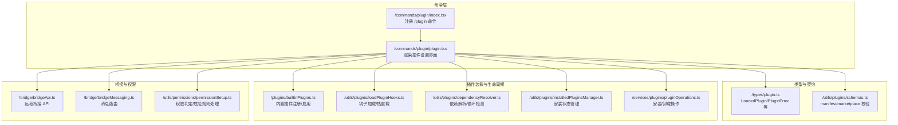
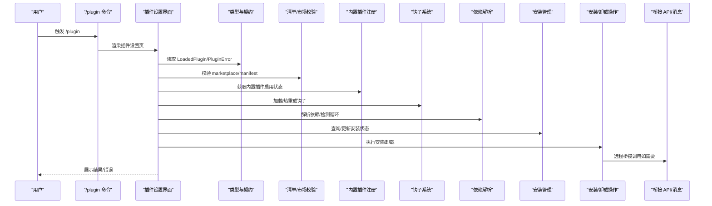
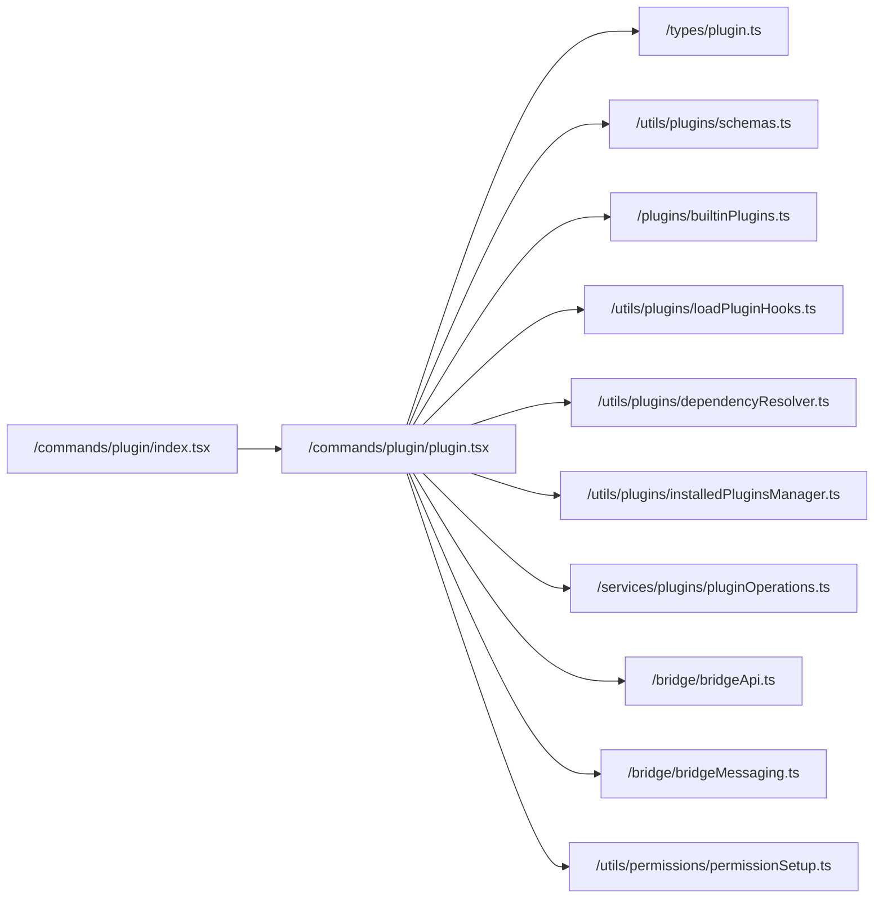
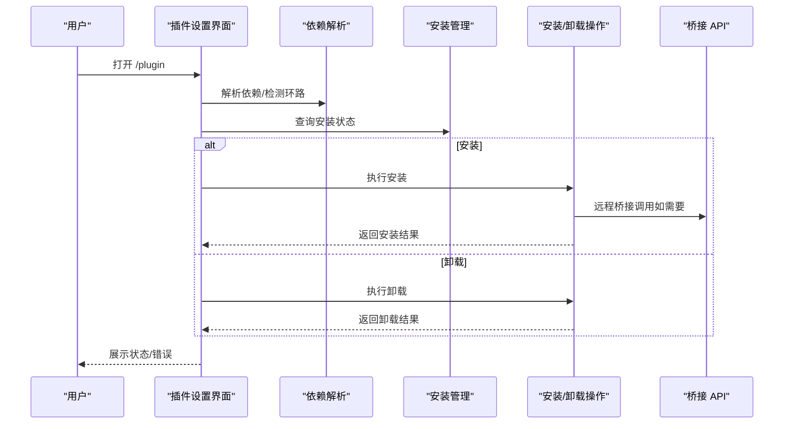

# 插件 API

<cite>
**本文引用的文件**
- [commands/plugin/index.tsx](file://commands/plugin/index.tsx)
- [commands/plugin/plugin.tsx](file://commands/plugin/plugin.tsx)
- [types/plugin.ts](file://types/plugin.ts)
- [plugins/builtinPlugins.ts](file://plugins/builtinPlugins.ts)
- [utils/plugins/schemas.ts](file://utils/plugins/schemas.ts)
- [utils/plugins/loadPluginHooks.ts](file://utils/plugins/loadPluginHooks.ts)
- [utils/plugins/dependencyResolver.ts](file://utils/plugins/dependencyResolver.ts)
- [utils/plugins/pluginFlagging.ts](file://utils/plugins/pluginFlagging.ts)
- [utils/plugins/installedPluginsManager.ts](file://utils/plugins/installedPluginsManager.ts)
- [services/plugins/pluginOperations.ts](file://services/plugins/pluginOperations.ts)
- [utils/plugins/pluginBlocklist.ts](file://utils/plugins/pluginBlocklist.ts)
- [bridge/bridgeApi.ts](file://bridge/bridgeApi.ts)
- [bridge/bridgeMessaging.ts](file://bridge/bridgeMessaging.ts)
- [utils/permissions/permissionSetup.ts](file://utils/permissions/permissionSetup.ts)
</cite>

## 目录
1. [简介](#简介)
2. [项目结构](#项目结构)
3. [核心组件](#核心组件)
4. [架构总览](#架构总览)
5. [详细组件分析](#详细组件分析)
6. [依赖关系分析](#依赖关系分析)
7. [性能考量](#性能考量)
8. [故障排查指南](#故障排查指南)
9. [结论](#结论)
10. [附录](#附录)

## 简介
本文件为 Claude Code 插件系统的完整 API 参考与实践指南，覆盖插件注册机制、生命周期管理、接口规范、发现/安装/卸载流程、开发与测试发布建议，以及与宿主应用的通信机制与安全模型。内容基于仓库中的命令入口、类型定义、插件加载与钩子系统、依赖解析、安装管理、桥接通信与权限控制等模块进行系统化梳理。

## 项目结构
围绕插件系统的关键目录与文件：
- 命令入口：/commands/plugin 提供 /plugin UI 与交互命令
- 类型与契约：/types/plugin 定义插件元数据、已加载插件、错误类型与结果
- 内置插件注册：/plugins/builtinPlugins 提供内置插件注册与启用状态管理
- 插件清单与校验：/utils/plugins/schemas 提供 marketplace、manifest、hooks、MCP/LSP 配置的 Zod 校验
- 钩子系统：/utils/plugins/loadPluginHooks 提供钩子热重载与裁剪
- 依赖解析：/utils/plugins/dependencyResolver 负责跨市场边界与循环依赖检测
- 安装与卸载：/utils/plugins/installedPluginsManager 与 /services/plugins/pluginOperations
- 插件标记与封禁：/utils/plugins/pluginFlagging、/utils/plugins/pluginBlocklist
- 桥接通信：/bridge/bridgeApi、/bridge/bridgeMessaging
- 权限模型：/utils/permissions/permissionSetup



图表来源
- [commands/plugin/index.tsx:1-11](file://commands/plugin/index.tsx#L1-L11)
- [commands/plugin/plugin.tsx:1-7](file://commands/plugin/plugin.tsx#L1-L7)
- [types/plugin.ts:44-100](file://types/plugin.ts#L44-L100)
- [utils/plugins/schemas.ts:274-320](file://utils/plugins/schemas.ts#L274-L320)
- [plugins/builtinPlugins.ts:28-39](file://plugins/builtinPlugins.ts#L28-L39)
- [utils/plugins/loadPluginHooks.ts:159-287](file://utils/plugins/loadPluginHooks.ts#L159-L287)
- [utils/plugins/dependencyResolver.ts:106-142](file://utils/plugins/dependencyResolver.ts#L106-L142)
- [utils/plugins/installedPluginsManager.ts:648-782](file://utils/plugins/installedPluginsManager.ts#L648-L782)
- [services/plugins/pluginOperations.ts:420-445](file://services/plugins/pluginOperations.ts#L420-L445)
- [bridge/bridgeApi.ts:68-452](file://bridge/bridgeApi.ts#L68-L452)
- [bridge/bridgeMessaging.ts:124-148](file://bridge/bridgeMessaging.ts#L124-L148)
- [utils/permissions/permissionSetup.ts:287-946](file://utils/permissions/permissionSetup.ts#L287-L946)

章节来源
- [commands/plugin/index.tsx:1-11](file://commands/plugin/index.tsx#L1-L11)
- [commands/plugin/plugin.tsx:1-7](file://commands/plugin/plugin.tsx#L1-L7)
- [types/plugin.ts:44-100](file://types/plugin.ts#L44-L100)
- [plugins/builtinPlugins.ts:28-39](file://plugins/builtinPlugins.ts#L28-L39)
- [utils/plugins/schemas.ts:274-320](file://utils/plugins/schemas.ts#L274-L320)

## 核心组件
- 插件元数据与加载对象
  - LoadedPlugin：描述已加载插件的完整信息，包括名称、清单、路径、来源、仓库标识、启用状态、是否内置、命令/代理/技能/输出样式/钩子/MCP/LSP 等路径与配置、用户设置等。
  - PluginComponent：插件可提供的组件类型枚举（commands、agents、skills、hooks、output-styles）。
- 插件错误类型
  - PluginError：统一的类型安全错误类型集合，涵盖路径不存在、Git 认证失败、网络错误、清单解析/验证失败、市场不可用/被策略阻止、MCP/LSP 配置无效/启动失败/超时、依赖未满足、缓存缺失等。
  - getPluginErrorMessage：将任意 PluginError 映射为人类可读消息，便于日志与 UI 展示。
- 插件加载结果
  - PluginLoadResult：返回已启用/已禁用插件列表与错误列表，用于 UI 与诊断。

章节来源
- [types/plugin.ts:44-100](file://types/plugin.ts#L44-L100)
- [types/plugin.ts:101-289](file://types/plugin.ts#L101-L289)
- [types/plugin.ts:285-289](file://types/plugin.ts#L285-L289)
- [types/plugin.ts:295-363](file://types/plugin.ts#L295-L363)

## 架构总览
插件系统围绕“清单与模式校验”“注册与启用”“装载与生命周期”“依赖与冲突”“安装与卸载”“桥接通信”“权限控制”展开，形成从 UI 到后端服务的闭环。



图表来源
- [commands/plugin/index.tsx:1-11](file://commands/plugin/index.tsx#L1-L11)
- [commands/plugin/plugin.tsx:1-7](file://commands/plugin/plugin.tsx#L1-L7)
- [types/plugin.ts:44-100](file://types/plugin.ts#L44-L100)
- [utils/plugins/schemas.ts:274-320](file://utils/plugins/schemas.ts#L274-L320)
- [plugins/builtinPlugins.ts:57-102](file://plugins/builtinPlugins.ts#L57-L102)
- [utils/plugins/loadPluginHooks.ts:159-287](file://utils/plugins/loadPluginHooks.ts#L159-L287)
- [utils/plugins/dependencyResolver.ts:106-142](file://utils/plugins/dependencyResolver.ts#L106-L142)
- [utils/plugins/installedPluginsManager.ts:648-782](file://utils/plugins/installedPluginsManager.ts#L648-L782)
- [services/plugins/pluginOperations.ts:420-445](file://services/plugins/pluginOperations.ts#L420-L445)
- [bridge/bridgeApi.ts:68-452](file://bridge/bridgeApi.ts#L68-L452)
- [bridge/bridgeMessaging.ts:124-148](file://bridge/bridgeMessaging.ts#L124-L148)

## 详细组件分析

### 插件注册与内置插件机制
- 注册入口
  - /commands/plugin/index.tsx 将 /plugin 命令注册为本地 JSX 命令，并在调用时动态加载 UI 组件。
  - /commands/plugin/plugin.tsx 提供插件设置界面的渲染逻辑。
- 内置插件
  - /plugins/builtinPlugins.ts 提供内置插件注册表，支持：
    - registerBuiltinPlugin：在启动时注册内置插件定义
    - isBuiltinPluginId：识别内置插件 ID（以 @builtin 结尾）
    - getBuiltinPlugins：按用户设置拆分已启用/已禁用
    - getBuiltinPluginSkillCommands：将内置插件技能转换为命令对象
  - 内置插件与用户可切换的“启用/禁用”状态通过用户设置持久化。

```mermaid
classDiagram
class BuiltinPluginRegistry {
+registerBuiltinPlugin(def)
+isBuiltinPluginId(id) boolean
+getBuiltinPluginDefinition(name)
+getBuiltinPlugins() {enabled, disabled}
+getBuiltinPluginSkillCommands() Command[]
+clearBuiltinPlugins()
}
class LoadedPlugin {
+string name
+PluginManifest manifest
+string path
+string source
+string repository
+boolean enabled
+boolean isBuiltin
+string[] commandsPaths
+string[] agentsPaths
+string[] skillsPaths
+string[] outputStylesPaths
+HooksSettings hooksConfig
+Record~string,McpServerConfig~ mcpServers
+Record~string,LspServerConfig~ lspServers
+Record~string,unknown~ settings
}
BuiltinPluginRegistry --> LoadedPlugin : "生成已启用/已禁用列表"
```

图表来源
- [plugins/builtinPlugins.ts:28-102](file://plugins/builtinPlugins.ts#L28-L102)
- [types/plugin.ts:44-70](file://types/plugin.ts#L44-L70)

章节来源
- [commands/plugin/index.tsx:1-11](file://commands/plugin/index.tsx#L1-L11)
- [commands/plugin/plugin.tsx:1-7](file://commands/plugin/plugin.tsx#L1-L7)
- [plugins/builtinPlugins.ts:28-102](file://plugins/builtinPlugins.ts#L28-L102)

### 插件清单与市场校验
- 清单元数据（plugin.json）
  - 名称、版本、描述、作者、主页、仓库、许可证、关键词、依赖等字段的 Zod 校验。
- 市场名称与来源校验
  - 市场名称禁止包含空格/路径分隔符/点号序列，且不能与官方保留名或模式冲突；保留名仅允许来自官方组织源。
- 钩子、命令、代理、技能、输出样式、MCP/LSP 的附加声明与校验
  - 支持相对路径、数组、对象映射等多种形式；MCP/LSP 配置严格校验参数与默认值。
- 用户配置与通道（Channel）
  - 支持在清单中声明用户可配置项与助手模式下的通道，便于在启用时弹窗收集敏感/非敏感配置。

章节来源
- [utils/plugins/schemas.ts:274-320](file://utils/plugins/schemas.ts#L274-L320)
- [utils/plugins/schemas.ts:216-246](file://utils/plugins/schemas.ts#L216-L246)
- [utils/plugins/schemas.ts:119-157](file://utils/plugins/schemas.ts#L119-L157)
- [utils/plugins/schemas.ts:429-452](file://utils/plugins/schemas.ts#L429-L452)
- [utils/plugins/schemas.ts:543-572](file://utils/plugins/schemas.ts#L543-L572)
- [utils/plugins/schemas.ts:708-788](file://utils/plugins/schemas.ts#L708-L788)
- [utils/plugins/schemas.ts:622-654](file://utils/plugins/schemas.ts#L622-L654)
- [utils/plugins/schemas.ts:670-703](file://utils/plugins/schemas.ts#L670-L703)

### 插件错误类型与诊断
- 错误类型覆盖
  - 文件系统/网络/Git/MCP/LSP/市场策略/依赖/缓存等多类错误，均提供结构化上下文（来源、插件、路径、方法、超时等）。
- 错误消息映射
  - getPluginErrorMessage 将错误类型映射为用户可读提示，便于日志与 UI 展示。

章节来源
- [types/plugin.ts:101-283](file://types/plugin.ts#L101-L283)
- [types/plugin.ts:295-363](file://types/plugin.ts#L295-L363)

### 钩子系统与生命周期
- 钩子加载与热重载
  - loadPluginHooks：加载并注册插件钩子，支持缓存清理与原子替换，避免旧钩子残留。
  - clearPluginHookCache/pruneRemovedPluginHooks：在插件禁用/卸载时及时裁剪钩子，保证一致性。
  - setupPluginHookHotReload：监听策略设置变化，按需触发钩子热重载。
- 生命周期要点
  - 钩子在启用插件后注册，在禁用/卸载时裁剪；与命令/代理/MCP 同步，遵循一致的热重载节奏。

章节来源
- [utils/plugins/loadPluginHooks.ts:159-287](file://utils/plugins/loadPluginHooks.ts#L159-L287)

### 依赖解析与冲突处理
- 依赖解析
  - 递归遍历依赖，跳过已启用依赖，防止意外写入设置；跨市场依赖受白名单限制；检测环形依赖并报告链路。
- 安全与一致性
  - 安装根插件必须显式缓存/注册，避免“安装成功但未生效”的假象。

章节来源
- [utils/plugins/dependencyResolver.ts:106-142](file://utils/plugins/dependencyResolver.ts#L106-L142)

### 安装、卸载与状态管理
- 安装状态
  - /utils/plugins/installedPluginsManager 提供安装详情查询、内存/磁盘状态同步、按市场批量移除、会话内状态重置等能力。
- 卸载操作
  - /services/plugins/pluginOperations 提供按作用域（用户/项目/本地）卸载插件，清理设置与数据目录。
- 自动封禁与标记
  - /utils/plugins/pluginBlocklist 检测被删除插件并自动卸载，同时写入标记；/utils/plugins/pluginFlagging 提供标记持久化与过期清理。

章节来源
- [utils/plugins/installedPluginsManager.ts:648-782](file://utils/plugins/installedPluginsManager.ts#L648-L782)
- [services/plugins/pluginOperations.ts:420-445](file://services/plugins/pluginOperations.ts#L420-L445)
- [utils/plugins/pluginBlocklist.ts:42-79](file://utils/plugins/pluginBlocklist.ts#L42-L79)
- [utils/plugins/pluginFlagging.ts:86-144](file://utils/plugins/pluginFlagging.ts#L86-L144)

### 桥接通信与宿主应用交互
- 远程桥接 API
  - /bridge/bridgeApi.ts 提供环境注册、轮询任务、确认/停止任务、心跳、事件上报、反授权重试、错误分类与致命错误封装。
- 消息路由
  - /bridge/bridgeMessaging.ts 负责入站消息解析与路由，区分控制响应、控制请求与普通消息，过滤重复与回放。
- 使用场景
  - 插件在需要远程执行或与远端会话交互时，通过桥接 API 发起请求并在消息层接收响应与通知。

章节来源
- [bridge/bridgeApi.ts:68-452](file://bridge/bridgeApi.ts#L68-L452)
- [bridge/bridgeMessaging.ts:124-148](file://bridge/bridgeMessaging.ts#L124-L148)

### 权限控制与安全模型
- 权限判定
  - /utils/permissions/permissionSetup.ts 提供危险权限识别、移除与恢复、自动模式下的权限豁免开关、策略设置变更的热重载订阅。
- 关键行为
  - 识别危险规则（如通配 Bash/PowerShell/Agent 允许），在必要时临时剥离并允许用户恢复；支持 bypassPermissions 模式可用性检查与禁用门控。
- 与插件的关系
  - 插件通过钩子、命令、工具等扩展宿主能力，权限系统对这些扩展进行评估与拦截，确保安全边界。

章节来源
- [utils/permissions/permissionSetup.ts:287-946](file://utils/permissions/permissionSetup.ts#L287-L946)

## 依赖关系分析
- 命令到 UI：/commands/plugin/index.tsx -> /commands/plugin/plugin.tsx
- UI 到类型与契约：/commands/plugin/plugin.tsx -> /types/plugin.ts
- UI 到清单与市场：/commands/plugin/plugin.tsx -> /utils/plugins/schemas.ts
- UI 到内置插件：/commands/plugin/plugin.tsx -> /plugins/builtinPlugins.ts
- UI 到钩子：/commands/plugin/plugin.tsx -> /utils/plugins/loadPluginHooks.ts
- UI 到依赖：/commands/plugin/plugin.tsx -> /utils/plugins/dependencyResolver.ts
- UI 到安装/卸载：/commands/plugin/plugin.tsx -> /utils/plugins/installedPluginsManager.ts, /services/plugins/pluginOperations.ts
- UI 到桥接：/commands/plugin/plugin.tsx -> /bridge/bridgeApi.ts, /bridge/bridgeMessaging.ts
- UI 到权限：/commands/plugin/plugin.tsx -> /utils/permissions/permissionSetup.ts



图表来源
- [commands/plugin/index.tsx:1-11](file://commands/plugin/index.tsx#L1-L11)
- [commands/plugin/plugin.tsx:1-7](file://commands/plugin/plugin.tsx#L1-L7)
- [types/plugin.ts:44-100](file://types/plugin.ts#L44-L100)
- [utils/plugins/schemas.ts:274-320](file://utils/plugins/schemas.ts#L274-L320)
- [plugins/builtinPlugins.ts:28-102](file://plugins/builtinPlugins.ts#L28-L102)
- [utils/plugins/loadPluginHooks.ts:159-287](file://utils/plugins/loadPluginHooks.ts#L159-L287)
- [utils/plugins/dependencyResolver.ts:106-142](file://utils/plugins/dependencyResolver.ts#L106-L142)
- [utils/plugins/installedPluginsManager.ts:648-782](file://utils/plugins/installedPluginsManager.ts#L648-L782)
- [services/plugins/pluginOperations.ts:420-445](file://services/plugins/pluginOperations.ts#L420-L445)
- [bridge/bridgeApi.ts:68-452](file://bridge/bridgeApi.ts#L68-L452)
- [bridge/bridgeMessaging.ts:124-148](file://bridge/bridgeMessaging.ts#L124-L148)
- [utils/permissions/permissionSetup.ts:287-946](file://utils/permissions/permissionSetup.ts#L287-L946)

## 性能考量
- 缓存与懒加载
  - 钩子系统使用缓存与原子替换，避免频繁重建导致的抖动。
  - 安装状态在内存与磁盘之间保持一致性，减少重复 IO。
- 超时与重试
  - 桥接 API 对轮询与请求设置合理超时；对 401 场景提供一次刷新重试，降低失败率。
- 依赖解析
  - 通过已启用集合与跨市场白名单快速短路，避免无谓下载与安装。

## 故障排查指南
- 常见错误定位
  - 清单解析/验证失败：检查 plugin.json 字段与路径；参考 getPluginErrorMessage 的映射。
  - 市场不可用/被策略阻止：确认 marketplace 名称合法性与来源；查看策略阻断原因。
  - MCP/LSP 配置无效/启动失败：核对命令、参数、传输方式、初始化选项与工作区设置。
  - 依赖未满足：确认依赖插件已启用且在同一市场或允许的跨市场白名单内。
  - 缓存缺失：运行 /plugins 刷新缓存。
- 操作建议
  - 使用 /plugins 查看已安装/启用状态与错误列表
  - 使用 /reload-plugins 重新加载钩子与组件
  - 在权限问题时检查危险规则与 bypassPermissions 模式

章节来源
- [types/plugin.ts:295-363](file://types/plugin.ts#L295-L363)
- [utils/plugins/pluginBlocklist.ts:42-79](file://utils/plugins/pluginBlocklist.ts#L42-L79)
- [utils/plugins/pluginFlagging.ts:86-144](file://utils/plugins/pluginFlagging.ts#L86-L144)
- [utils/plugins/installedPluginsManager.ts:648-782](file://utils/plugins/installedPluginsManager.ts#L648-L782)

## 结论
本插件系统以类型安全的契约、严格的清单与市场校验、完善的钩子与生命周期管理、可靠的依赖解析与安装卸载流程为核心，结合桥接通信与权限控制，为插件生态提供了高可用、可审计、可扩展的基础能力。开发者可依据本文档的接口规范与最佳实践，快速实现命令扩展、工具添加与 UI 集成，并在安全与性能之间取得平衡。

## 附录

### 插件开发接口规范（概要）
- 清单字段
  - 必填：name（小写连字符）、version（语义化）
  - 可选：description、author、homepage、repository、license、keywords、dependencies
- 组件声明
  - commands/agents/skills/outputStyles：支持相对路径、数组、对象映射
  - hooks：支持 hooks.json 或清单内额外声明
  - mcpServers：支持 .mcp.json、MCPB 文件、内联配置
  - lspServers：支持 .lsp.json、内联配置
- 用户配置与通道
  - userConfig：在启用时弹窗收集，敏感值进入安全存储
  - channels：声明 MCP 通道并在助手模式下收集配置

章节来源
- [utils/plugins/schemas.ts:274-320](file://utils/plugins/schemas.ts#L274-L320)
- [utils/plugins/schemas.ts:429-452](file://utils/plugins/schemas.ts#L429-L452)
- [utils/plugins/schemas.ts:543-572](file://utils/plugins/schemas.ts#L543-L572)
- [utils/plugins/schemas.ts:708-788](file://utils/plugins/schemas.ts#L708-L788)
- [utils/plugins/schemas.ts:622-654](file://utils/plugins/schemas.ts#L622-L654)
- [utils/plugins/schemas.ts:670-703](file://utils/plugins/schemas.ts#L670-L703)

### 插件发现、安装与卸载流程（时序）


图表来源
- [utils/plugins/dependencyResolver.ts:106-142](file://utils/plugins/dependencyResolver.ts#L106-L142)
- [utils/plugins/installedPluginsManager.ts:648-782](file://utils/plugins/installedPluginsManager.ts#L648-L782)
- [services/plugins/pluginOperations.ts:420-445](file://services/plugins/pluginOperations.ts#L420-L445)
- [bridge/bridgeApi.ts:68-452](file://bridge/bridgeApi.ts#L68-L452)

### 安全模型与权限控制要点
- 危险规则识别与剥离
  - 识别 Bash/PowerShell/Agent 的危险允许规则，必要时临时剥离并允许恢复
- bypassPermissions 模式
  - 受功能门与设置控制，支持在特定场景下放宽权限
- 策略设置热重载
  - 监听策略变更，按需清理插件相关缓存并重载钩子

章节来源
- [utils/permissions/permissionSetup.ts:287-946](file://utils/permissions/permissionSetup.ts#L287-L946)