# 数据类型

<cite>
**本文引用的文件**
- [types/ids.ts](file://types/ids.ts)
- [types/permissions.ts](file://types/permissions.ts)
- [types/plugin.ts](file://types/plugin.ts)
- [types/command.ts](file://types/command.ts)
- [types/hooks.ts](file://types/hooks.ts)
- [types/textInputTypes.ts](file://types/textInputTypes.ts)
- [types/logs.ts](file://types/logs.ts)
- [types/generated/events_mono/claude_code/v1/claude_code_internal_event.ts](file://types/generated/events_mono/claude_code/v1/claude_code_internal_event.ts)
- [bridge/types.ts](file://bridge/types.ts)
- [tasks/types.ts](file://tasks/types.ts)
</cite>

## 目录
1. [简介](#简介)
2. [项目结构](#项目结构)
3. [核心组件](#核心组件)
4. [架构总览](#架构总览)
5. [详细组件分析](#详细组件分析)
6. [依赖分析](#依赖分析)
7. [性能考虑](#性能考虑)
8. [故障排查指南](#故障排查指南)
9. [结论](#结论)
10. [附录](#附录)

## 简介
本文件为 Claude Code 的数据类型参考文档，系统性梳理并解释项目中的核心数据结构、枚举与接口定义，覆盖类型别名、品牌化类型（branded types）、联合与交叉类型、条件类型、泛型约束与使用场景，并说明类型之间的关系、继承层次与传递方式。文档同时提供类型转换、验证与序列化规范，列举常量、配置项与默认值，给出最佳实践与注意事项，帮助开发者在多模块间正确使用与扩展类型体系。

## 项目结构
本项目的类型定义主要分布在以下位置：
- types：核心业务类型与生成类型（如事件协议）
- bridge：桥接远程控制相关类型
- tasks：任务状态类型聚合
- 各模块内部也存在局部类型定义，但本文聚焦于跨模块共享或对外暴露的关键类型

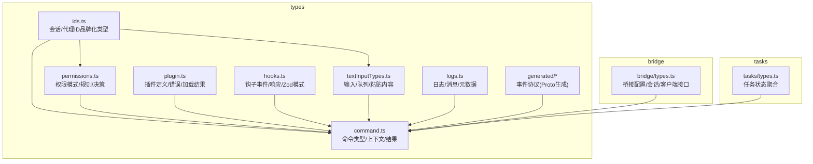

图表来源
- [types/ids.ts:1-45](file://types/ids.ts#L1-L45)
- [types/permissions.ts:1-442](file://types/permissions.ts#L1-L442)
- [types/plugin.ts:1-364](file://types/plugin.ts#L1-L364)
- [types/command.ts:1-217](file://types/command.ts#L1-L217)
- [types/hooks.ts:1-291](file://types/hooks.ts#L1-L291)
- [types/textInputTypes.ts:1-388](file://types/textInputTypes.ts#L1-L388)
- [types/logs.ts:1-331](file://types/logs.ts#L1-L331)
- [types/generated/events_mono/claude_code/v1/claude_code_internal_event.ts:1-866](file://types/generated/events_mono/claude_code/v1/claude_code_internal_event.ts#L1-L866)
- [bridge/types.ts:1-263](file://bridge/types.ts#L1-L263)
- [tasks/types.ts:1-47](file://tasks/types.ts#L1-L47)

章节来源
- [types/ids.ts:1-45](file://types/ids.ts#L1-L45)
- [types/permissions.ts:1-442](file://types/permissions.ts#L1-L442)
- [types/plugin.ts:1-364](file://types/plugin.ts#L1-L364)
- [types/command.ts:1-217](file://types/command.ts#L1-L217)
- [types/hooks.ts:1-291](file://types/hooks.ts#L1-L291)
- [types/textInputTypes.ts:1-388](file://types/textInputTypes.ts#L1-L388)
- [types/logs.ts:1-331](file://types/logs.ts#L1-L331)
- [types/generated/events_mono/claude_code/v1/claude_code_internal_event.ts:1-866](file://types/generated/events_mono/claude_code/v1/claude_code_internal_event.ts#L1-L866)
- [bridge/types.ts:1-263](file://bridge/types.ts#L1-L263)
- [tasks/types.ts:1-47](file://tasks/types.ts#L1-L47)

## 核心组件
本节对关键类型进行分门别类的说明，包括品牌化类型、权限模型、插件系统、命令与钩子、输入与日志、桥接与任务等。

- 品牌化类型（SessionId/AgentId）
  - 通过“品牌化”字符串字面量实现编译期区分，避免会话ID与代理ID混用。
  - 提供安全的类型转换函数与格式校验工具，确保运行时一致性。
  - 参考路径：[types/ids.ts:10-44](file://types/ids.ts#L10-L44)

- 权限模型
  - 模式：外部可配置模式集合，内部运行时模式集合，支持自动分类器模式。
  - 行为：允许/拒绝/询问；决策结果包含理由、建议更新、内容块等。
  - 规则：按来源（用户设置/项目设置/本地设置/策略/命令/会话）与行为组合。
  - 分类器：Yolo分类器结果包含置信度、阶段、用量统计、请求ID/消息ID等。
  - 参考路径：[types/permissions.ts:16-324](file://types/permissions.ts#L16-L324)

- 插件系统
  - 内置插件定义、仓库配置、已加载插件、组件类型（命令/代理/技能/钩子/输出样式）。
  - 插件错误类型采用判别联合，覆盖路径/网络/Git/清单/市场/服务器/LSP/MCP/Hook等错误。
  - 错误消息提取函数用于统一展示。
  - 参考路径：[types/plugin.ts:18-289](file://types/plugin.ts#L18-L289)

- 命令系统
  - 本地命令/本地JSX命令/Prompt命令三类形态，支持非交互、上下文、钩子、资源根目录、fork子代理等。
  - 命令可用性声明（claude-ai/console），启用/隐藏/别名/版本/敏感参数等元信息。
  - 参考路径：[types/command.ts:25-217](file://types/command.ts#L25-L217)

- 钩子系统
  - 钩子事件枚举与输入/输出类型，支持同步/异步响应。
  - Zod模式定义与类型推断，保证SDK与Schema一致。
  - 回调钩子签名、匹配器、进度/阻塞错误、权限请求结果等。
  - 参考路径：[types/hooks.ts:22-291](file://types/hooks.ts#L22-L291)

- 输入与队列
  - 文本输入基础属性、Vim模式、输入状态、提示/高亮/粘贴处理。
  - 队列优先级（立即/下一阶段/稍后）、入队命令携带来源/工作负载/代理ID等。
  - 图像粘贴有效性判断与ID提取。
  - 参考路径：[types/textInputTypes.ts:27-388](file://types/textInputTypes.ts#L27-L388)

- 日志与会话元数据
  - 序列化消息、日志选项、标题/标签/代理名称/颜色/设置、PR链接、工作树状态、内容替换、文件历史快照、归属快照等。
  - 时间戳、会话ID、分支、摘要、文件大小、侧链标记、Lite日志等字段。
  - 参考路径：[types/logs.ts:8-331](file://types/logs.ts#L8-L331)

- 事件协议（生成）
  - Claude Code 内部事件结构，包含环境元数据、Slack上下文、认证上下文、附加元数据等。
  - 由 Proto 生成，提供序列化/反序列化辅助方法。
  - 参考路径：[types/generated/events_mono/claude_code/v1/claude_code_internal_event.ts:80-130](file://types/generated/events_mono/claude_code/v1/claude_code_internal_event.ts#L80-L130)

- 桥接类型
  - 会话活动、工作模式、桥接配置、客户端接口、会话句柄、会话spawn选项、日志器接口等。
  - 参考路径：[bridge/types.ts:18-263](file://bridge/types.ts#L18-L263)

- 任务类型
  - 任务状态联合、后台任务过滤逻辑、状态字段与断言。
  - 参考路径：[tasks/types.ts:12-47](file://tasks/types.ts#L12-L47)

章节来源
- [types/ids.ts:10-44](file://types/ids.ts#L10-L44)
- [types/permissions.ts:16-324](file://types/permissions.ts#L16-L324)
- [types/plugin.ts:18-289](file://types/plugin.ts#L18-L289)
- [types/command.ts:25-217](file://types/command.ts#L25-L217)
- [types/hooks.ts:22-291](file://types/hooks.ts#L22-L291)
- [types/textInputTypes.ts:27-388](file://types/textInputTypes.ts#L27-L388)
- [types/logs.ts:8-331](file://types/logs.ts#L8-L331)
- [types/generated/events_mono/claude_code/v1/claude_code_internal_event.ts:80-130](file://types/generated/events_mono/claude_code/v1/claude_code_internal_event.ts#L80-L130)
- [bridge/types.ts:18-263](file://bridge/types.ts#L18-L263)
- [tasks/types.ts:12-47](file://tasks/types.ts#L12-L47)

## 架构总览
下图展示了核心类型在系统中的角色与交互关系，强调跨模块传递与依赖：

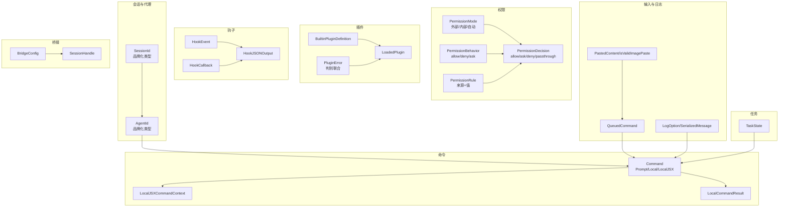

图表来源
- [types/ids.ts:10-44](file://types/ids.ts#L10-L44)
- [types/permissions.ts:16-324](file://types/permissions.ts#L16-L324)
- [types/plugin.ts:18-289](file://types/plugin.ts#L18-L289)
- [types/command.ts:25-217](file://types/command.ts#L25-L217)
- [types/hooks.ts:22-291](file://types/hooks.ts#L22-L291)
- [types/textInputTypes.ts:27-388](file://types/textInputTypes.ts#L27-L388)
- [types/logs.ts:8-331](file://types/logs.ts#L8-L331)
- [bridge/types.ts:81-263](file://bridge/types.ts#L81-L263)
- [tasks/types.ts:12-47](file://tasks/types.ts#L12-L47)

## 详细组件分析

### 品牌化类型与转换
- SessionId/AgentId 使用“品牌化”字符串字面量，防止运行时混淆。
- 转换函数与格式校验函数提供安全的类型转换与验证。
- 在命令、日志、输入等模块广泛使用，确保上下文一致性。

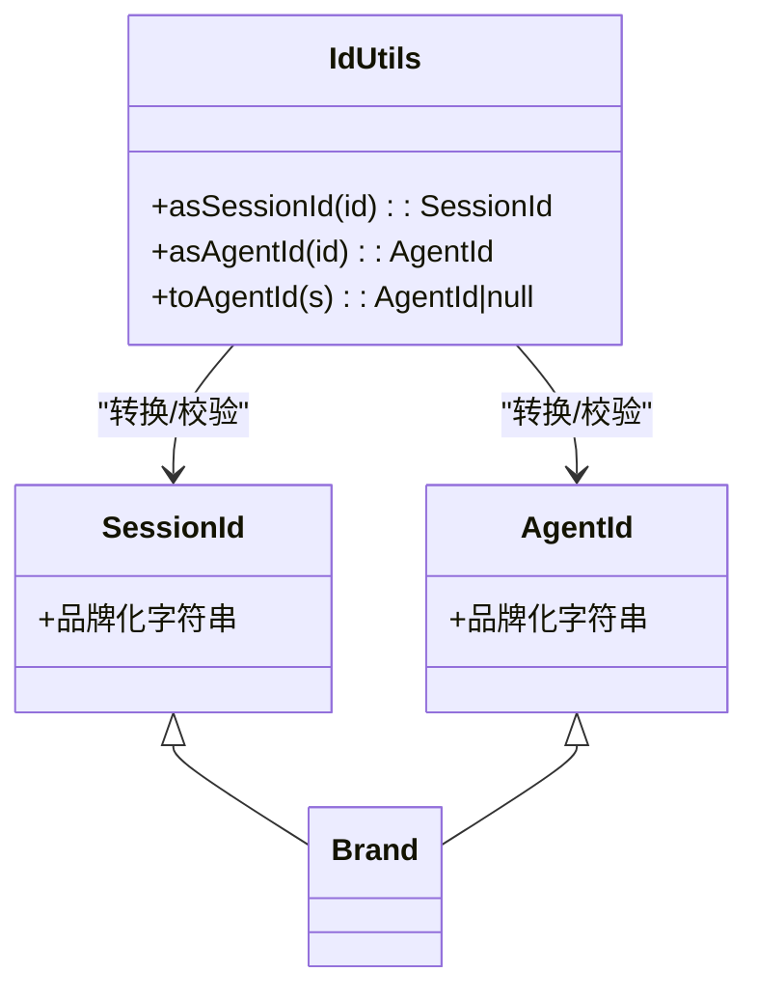

图表来源
- [types/ids.ts:10-44](file://types/ids.ts#L10-L44)

章节来源
- [types/ids.ts:10-44](file://types/ids.ts#L10-L44)

### 权限模型与决策流程
- 外部/内部权限模式集合，支持自动分类器模式。
- 规则来源与行为组合，决策包含理由、建议更新、内容块等。
- 分类器结果包含阶段、用量、请求ID/消息ID等指标。

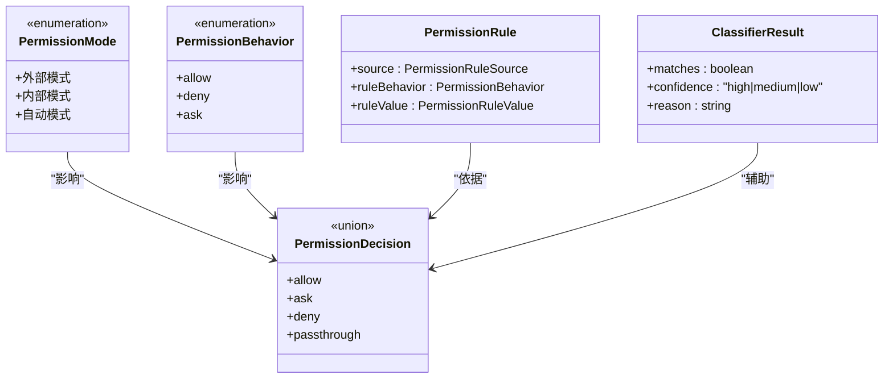

图表来源
- [types/permissions.ts:16-324](file://types/permissions.ts#L16-L324)

章节来源
- [types/permissions.ts:16-324](file://types/permissions.ts#L16-L324)

### 插件系统与错误处理
- 内置插件定义、仓库配置、已加载插件、组件类型。
- 插件错误采用判别联合，覆盖路径/网络/Git/清单/市场/服务器/LSP/MCP/Hook等。
- 错误消息提取函数统一展示。

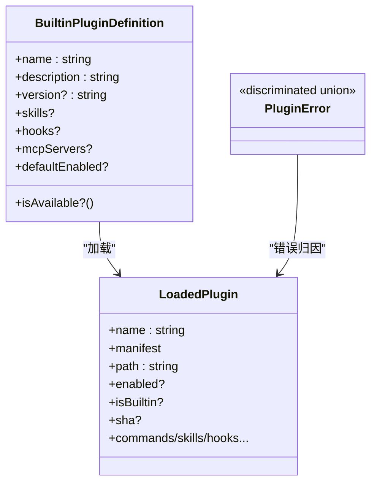

图表来源
- [types/plugin.ts:18-289](file://types/plugin.ts#L18-L289)

章节来源
- [types/plugin.ts:18-289](file://types/plugin.ts#L18-L289)

### 命令系统与上下文
- 命令形态：Prompt/Local/LocalJSX，支持非交互、fork子代理、钩子注册、资源根目录等。
- 上下文包含工具使用能力、消息更新、动态MCP配置、主题、IDE安装状态等。
- 结果类型支持文本、紧凑显示、跳过等。

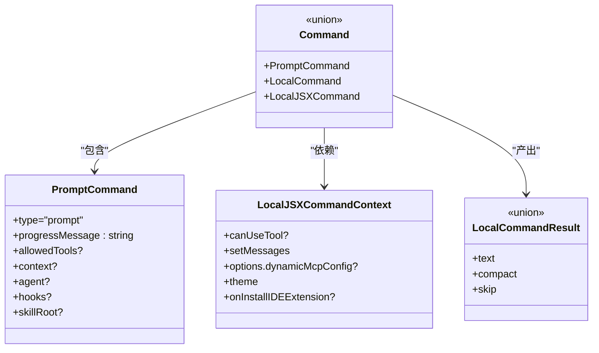

图表来源
- [types/command.ts:25-217](file://types/command.ts#L25-L217)

章节来源
- [types/command.ts:25-217](file://types/command.ts#L25-L217)

### 钩子系统与Zod模式
- 钩子事件枚举与输入/输出类型，支持同步/异步响应。
- Zod模式定义与类型推断，保证SDK与Schema一致。
- 回调钩子签名、匹配器、进度/阻塞错误、权限请求结果等。

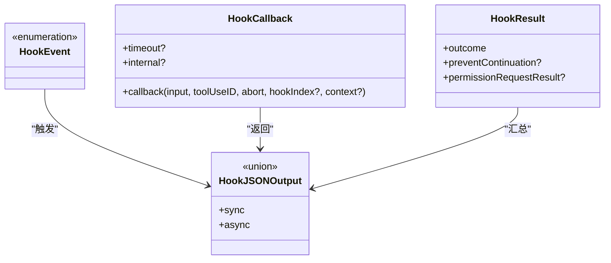

图表来源
- [types/hooks.ts:22-291](file://types/hooks.ts#L22-L291)

章节来源
- [types/hooks.ts:22-291](file://types/hooks.ts#L22-L291)

### 输入与队列处理
- 文本输入基础属性、Vim模式、输入状态、提示/高亮/粘贴处理。
- 队列优先级（立即/下一阶段/稍后）、入队命令携带来源/工作负载/代理ID等。
- 图像粘贴有效性判断与ID提取。

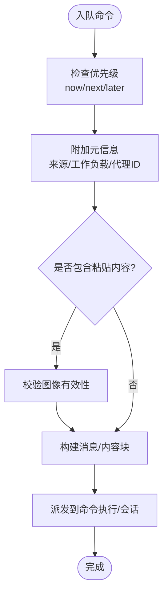

图表来源
- [types/textInputTypes.ts:299-388](file://types/textInputTypes.ts#L299-L388)

章节来源
- [types/textInputTypes.ts:27-388](file://types/textInputTypes.ts#L27-L388)

### 日志与会话元数据
- 序列化消息、日志选项、标题/标签/代理名称/颜色/设置、PR链接、工作树状态、内容替换、文件历史快照、归属快照等。
- 时间戳、会话ID、分支、摘要、文件大小、侧链标记、Lite日志等字段。

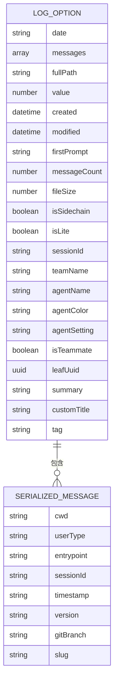

图表来源
- [types/logs.ts:8-53](file://types/logs.ts#L8-L53)

章节来源
- [types/logs.ts:8-331](file://types/logs.ts#L8-L331)

### 事件协议（生成）
- Claude Code 内部事件结构，包含环境元数据、Slack上下文、认证上下文、附加元数据等。
- 由 Proto 生成，提供序列化/反序列化辅助方法。

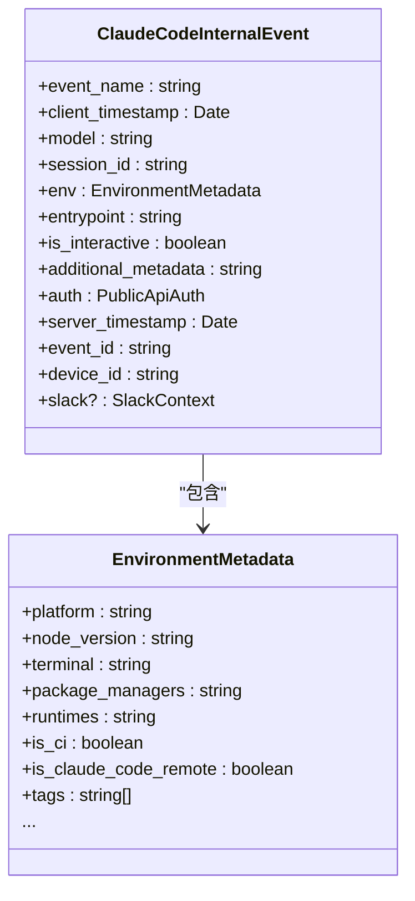

图表来源
- [types/generated/events_mono/claude_code/v1/claude_code_internal_event.ts:80-130](file://types/generated/events_mono/claude_code/v1/claude_code_internal_event.ts#L80-L130)

章节来源
- [types/generated/events_mono/claude_code/v1/claude_code_internal_event.ts:80-130](file://types/generated/events_mono/claude_code/v1/claude_code_internal_event.ts#L80-L130)

### 桥接类型与会话生命周期
- 会话活动、工作模式、桥接配置、客户端接口、会话句柄、会话spawn选项、日志器接口等。
- 支持心跳、停止、重新连接、归档会话等操作。

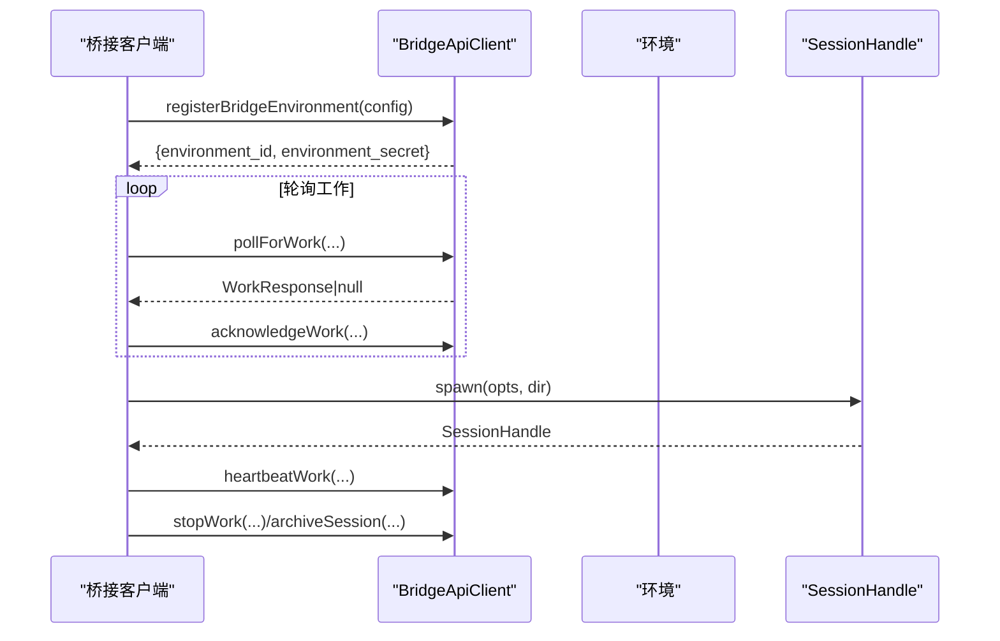

图表来源
- [bridge/types.ts:133-176](file://bridge/types.ts#L133-L176)
- [bridge/types.ts:178-211](file://bridge/types.ts#L178-L211)
- [bridge/types.ts:213-263](file://bridge/types.ts#L213-L263)

章节来源
- [bridge/types.ts:133-176](file://bridge/types.ts#L133-L176)
- [bridge/types.ts:178-211](file://bridge/types.ts#L178-L211)
- [bridge/types.ts:213-263](file://bridge/types.ts#L213-L263)

### 任务类型聚合与过滤
- 任务状态联合、后台任务过滤逻辑、状态字段与断言。
- 任务是否为后台任务取决于状态与背景化标志。

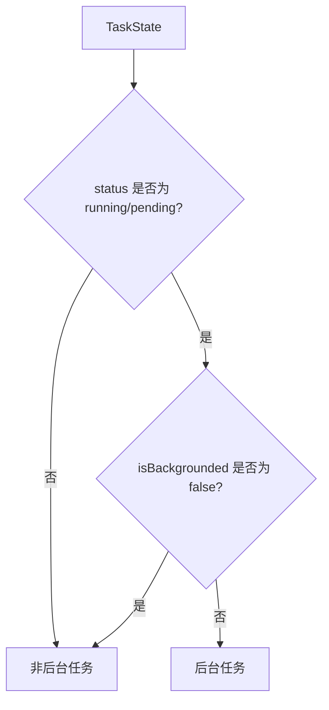

图表来源
- [tasks/types.ts:37-47](file://tasks/types.ts#L37-L47)

章节来源
- [tasks/types.ts:12-47](file://tasks/types.ts#L12-L47)

## 依赖分析
- 类型耦合
  - 品牌化类型贯穿命令、日志、输入等模块，确保上下文一致性。
  - 权限类型被命令与钩子广泛使用，作为决策与提示的基础。
  - 插件类型与命令/钩子/输出样式集成，形成扩展点。
  - 桥接类型与会话生命周期紧密耦合，支撑远程控制功能。
- 可能的循环依赖
  - 权限类型与实现分离，通过常量与只读数组避免循环导入。
  - 生成类型（事件协议）独立于业务逻辑，不引入循环。
- 外部依赖
  - 生成类型依赖 Proto 编译产物与时间戳类型。
  - 钩子系统依赖 Zod 与懒加载模式，保证类型与Schema一致。

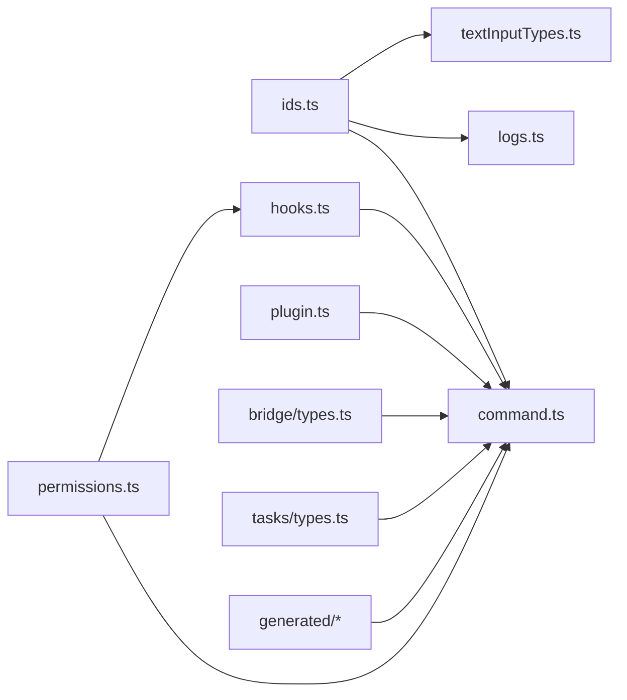

图表来源
- [types/ids.ts:10-44](file://types/ids.ts#L10-L44)
- [types/permissions.ts:16-324](file://types/permissions.ts#L16-L324)
- [types/plugin.ts:18-289](file://types/plugin.ts#L18-L289)
- [types/command.ts:25-217](file://types/command.ts#L25-L217)
- [types/hooks.ts:22-291](file://types/hooks.ts#L22-L291)
- [types/textInputTypes.ts:27-388](file://types/textInputTypes.ts#L27-L388)
- [types/logs.ts:8-331](file://types/logs.ts#L8-L331)
- [types/generated/events_mono/claude_code/v1/claude_code_internal_event.ts:80-130](file://types/generated/events_mono/claude_code/v1/claude_code_internal_event.ts#L80-L130)
- [bridge/types.ts:81-263](file://bridge/types.ts#L81-L263)
- [tasks/types.ts:12-47](file://tasks/types.ts#L12-L47)

章节来源
- [types/ids.ts:10-44](file://types/ids.ts#L10-L44)
- [types/permissions.ts:16-324](file://types/permissions.ts#L16-L324)
- [types/plugin.ts:18-289](file://types/plugin.ts#L18-L289)
- [types/command.ts:25-217](file://types/command.ts#L25-L217)
- [types/hooks.ts:22-291](file://types/hooks.ts#L22-L291)
- [types/textInputTypes.ts:27-388](file://types/textInputTypes.ts#L27-L388)
- [types/logs.ts:8-331](file://types/logs.ts#L8-L331)
- [types/generated/events_mono/claude_code/v1/claude_code_internal_event.ts:80-130](file://types/generated/events_mono/claude_code/v1/claude_code_internal_event.ts#L80-L130)
- [bridge/types.ts:81-263](file://bridge/types.ts#L81-L263)
- [tasks/types.ts:12-47](file://tasks/types.ts#L12-L47)

## 性能考虑
- 品牌化类型零运行时开销：仅在编译期提供类型安全，不引入运行时检查。
- 权限决策与分类器：尽量复用缓存与令牌用量统计，避免重复计算。
- 插件加载：判别联合错误类型减少分支判断成本，错误消息提取函数统一展示。
- 输入与队列：图像粘贴有效性快速过滤，避免无效内容进入后续处理。
- 事件协议：生成类型具备高效的序列化/反序列化方法，适合高频事件上报。

## 故障排查指南
- 权限相关
  - 检查模式与规则来源，确认决策原因类型（规则/模式/子命令结果/钩子/异步代理/沙箱覆盖/分类器/工作目录/安全检查/其他）。
  - 对于分类器不可用或超长转录，遵循回退策略（正常提示而非失败闭合）。
- 插件相关
  - 使用判别联合错误类型定位具体问题（路径/网络/Git/清单/市场/服务器/LSP/MCP/Hook等）。
  - 通过错误消息提取函数获取用户可读提示。
- 命令与钩子
  - 确认命令可用性与启用状态，检查钩子事件与回调上下文。
  - 对于异步钩子，关注超时与状态管理。
- 输入与日志
  - 检查队列优先级与来源，确认代理ID与工作负载标记。
  - 对于图像粘贴，使用有效性判断与ID提取辅助函数。
- 桥接
  - 关注心跳、停止、重新连接与环境注销流程，确保会话令牌与活动记录正确更新。

章节来源
- [types/permissions.ts:271-324](file://types/permissions.ts#L271-L324)
- [types/plugin.ts:101-289](file://types/plugin.ts#L101-L289)
- [types/hooks.ts:248-291](file://types/hooks.ts#L248-L291)
- [types/textInputTypes.ts:367-388](file://types/textInputTypes.ts#L367-L388)
- [bridge/types.ts:133-176](file://bridge/types.ts#L133-L176)

## 结论
本参考文档系统梳理了 Claude Code 的核心数据类型，涵盖品牌化类型、权限模型、插件系统、命令与钩子、输入与日志、桥接与任务等关键领域。通过明确类型之间的关系、转换与验证规范、常量与默认值，以及跨模块传递方式，开发者可在保持类型安全的同时高效扩展系统。建议在新增类型时遵循现有模式（判别联合、品牌化类型、Zod模式、生成类型），并在模块边界处清晰标注依赖与职责。

## 附录
- 类型别名与条件类型
  - 品牌化类型：通过“品牌化”字符串字面量实现编译期区分。
  - 判别联合：插件错误、权限决策、钩子输出等均采用判别键区分分支。
  - 条件类型：在输入与日志中用于排除通知模式、限定可编辑模式等。
- 泛型约束与使用
  - 权限决策与钩子结果保留泛型输入，确保上下文扩展时类型安全。
- 序列化与验证
  - 事件协议由 Proto 生成，提供序列化/反序列化辅助方法。
  - 钩子系统通过 Zod 模式与懒加载机制，确保类型与Schema一致。
- 最佳实践
  - 优先使用品牌化类型与格式校验函数，避免硬编码字符串。
  - 使用判别联合表达多态，配合类型守卫提升可维护性。
  - 将外部依赖（如生成类型）置于独立模块，降低耦合。
  - 在模块边界处明确类型契约，避免循环依赖。