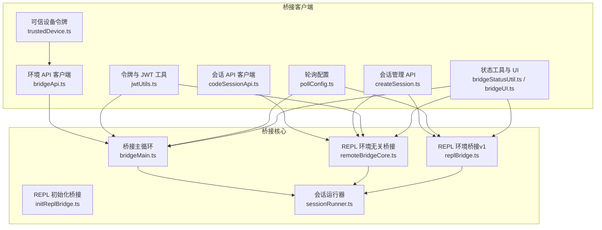
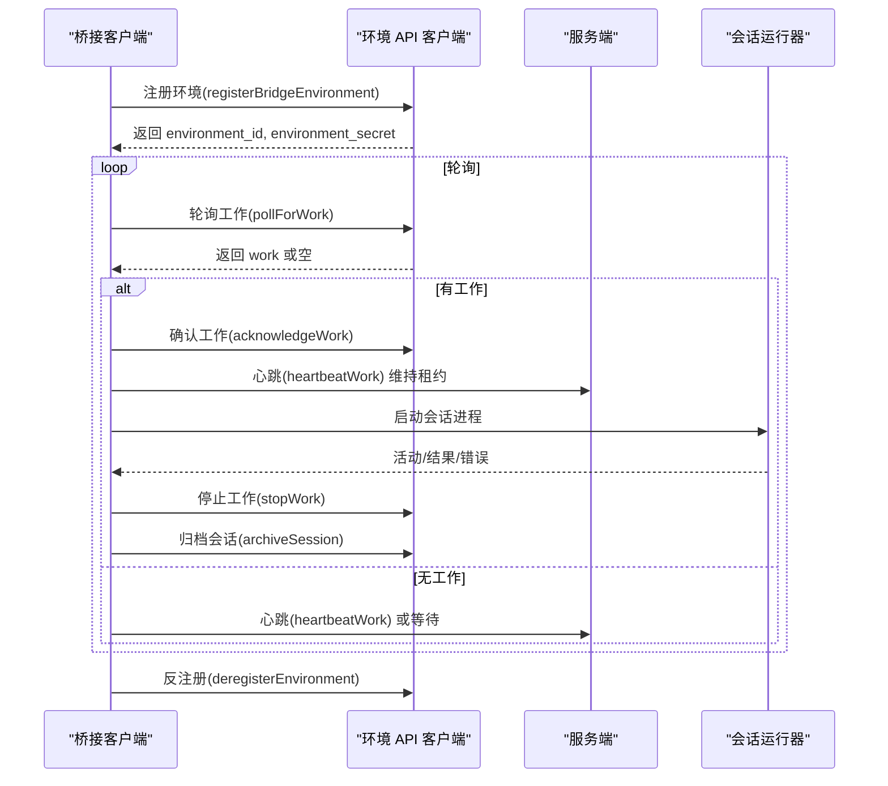
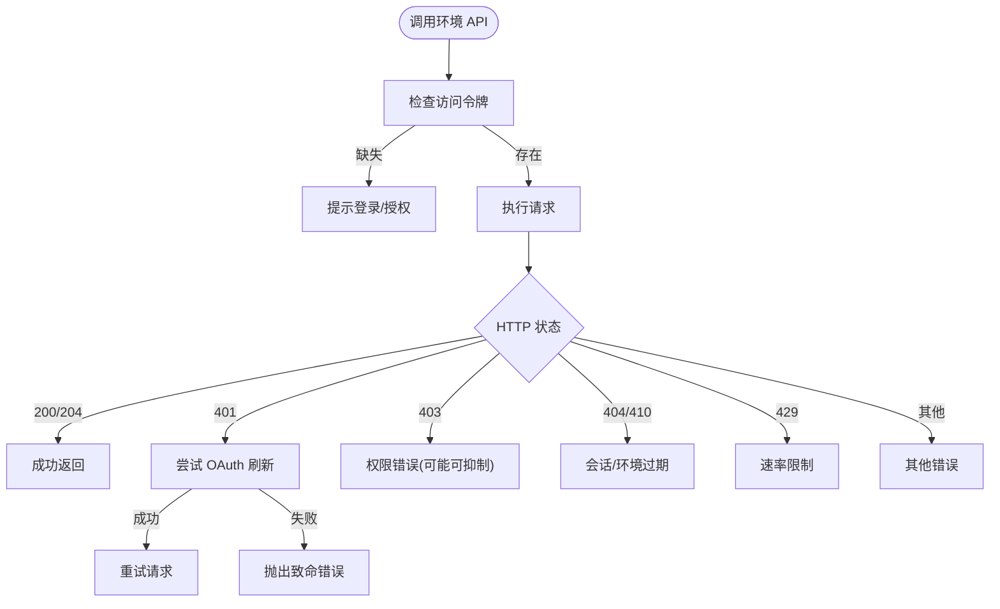
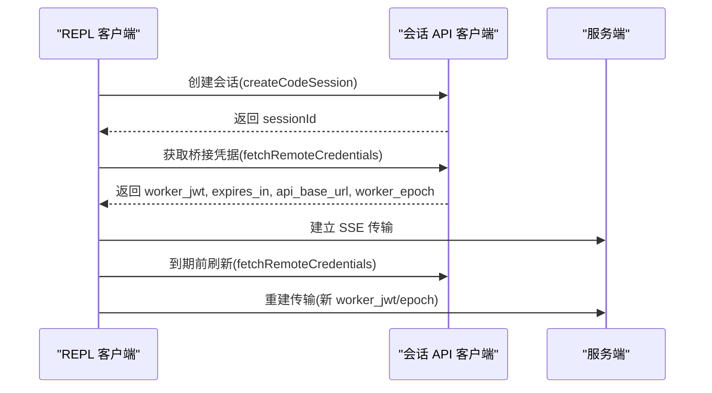
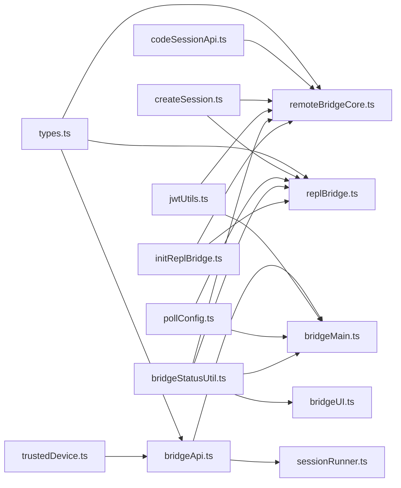

# 桥接 API

<cite>
**本文引用的文件**
- [bridgeApi.ts](file://bridge/bridgeApi.ts)
- [bridgeMain.ts](file://bridge/bridgeMain.ts)
- [types.ts](file://bridge/types.ts)
- [jwtUtils.ts](file://bridge/jwtUtils.ts)
- [codeSessionApi.ts](file://bridge/codeSessionApi.ts)
- [createSession.ts](file://bridge/createSession.ts)
- [sessionRunner.ts](file://bridge/sessionRunner.ts)
- [trustedDevice.ts](file://bridge/trustedDevice.ts)
- [pollConfig.ts](file://bridge/pollConfig.ts)
- [bridgeStatusUtil.ts](file://bridge/bridgeStatusUtil.ts)
- [bridgeUI.ts](file://bridge/bridgeUI.ts)
- [remoteBridgeCore.ts](file://bridge/remoteBridgeCore.ts)
- [initReplBridge.ts](file://bridge/initReplBridge.ts)
- [replBridge.ts](file://bridge/replBridge.ts)
- [bridgeConfig.ts](file://bridge/bridgeConfig.ts)
</cite>

## 目录
1. [简介](#简介)
2. [项目结构](#项目结构)
3. [核心组件](#核心组件)
4. [架构总览](#架构总览)
5. [详细组件分析](#详细组件分析)
6. [依赖关系分析](#依赖关系分析)
7. [性能考量](#性能考量)
8. [故障排查指南](#故障排查指南)
9. [结论](#结论)
10. [附录](#附录)

## 简介
本文件为 Claude Code 桥接系统的桥接 API 详细文档，覆盖远程会话管理、容量控制、JWT 认证与安全机制、桥接建立/维护/断开流程、远程控制与会话同步、状态监控与故障恢复、以及与本地系统的集成方式。文档面向开发者与运维人员，既提供代码级实现细节，也提供可操作的使用示例与调试工具说明。

## 项目结构
桥接系统主要位于 bridge 目录，围绕“环境注册—工作轮询—会话接入—心跳维持—断开归档”的主循环展开，并提供 REPL 路径（无环境层）与传统环境路径两条实现。核心模块包括：
- 环境与工作 API：注册、轮询、确认、停止、反注册、会话归档、重连、心跳
- 会话生命周期：创建、标题同步、归档
- 令牌与认证：OAuth 刷新、JWT 解析与刷新调度、可信设备令牌
- REPL 桥接：直接会话桥接（v2），或通过环境层桥接（v1）
- 配置与 UI：轮询配置、状态显示、日志输出
- 会话运行器：子进程会话创建、活动追踪、权限请求转发

图表来源
- [bridgeApi.ts](file://bridge/bridgeApi.ts)
- [codeSessionApi.ts](file://bridge/codeSessionApi.ts)
- [createSession.ts](file://bridge/createSession.ts)
- [jwtUtils.ts](file://bridge/jwtUtils.ts)
- [trustedDevice.ts](file://bridge/trustedDevice.ts)
- [pollConfig.ts](file://bridge/pollConfig.ts)
- [bridgeStatusUtil.ts](file://bridge/bridgeStatusUtil.ts)
- [bridgeUI.ts](file://bridge/bridgeUI.ts)
- [remoteBridgeCore.ts](file://bridge/remoteBridgeCore.ts)
- [replBridge.ts](file://bridge/replBridge.ts)
- [initReplBridge.ts](file://bridge/initReplBridge.ts)
- [sessionRunner.ts](file://bridge/sessionRunner.ts)

章节来源
- [bridgeApi.ts](file://bridge/bridgeApi.ts)
- [bridgeMain.ts](file://bridge/bridgeMain.ts)
- [types.ts](file://bridge/types.ts)
- [jwtUtils.ts](file://bridge/jwtUtils.ts)
- [codeSessionApi.ts](file://bridge/codeSessionApi.ts)
- [createSession.ts](file://bridge/createSession.ts)
- [sessionRunner.ts](file://bridge/sessionRunner.ts)
- [trustedDevice.ts](file://bridge/trustedDevice.ts)
- [pollConfig.ts](file://bridge/pollConfig.ts)
- [bridgeStatusUtil.ts](file://bridge/bridgeStatusUtil.ts)
- [bridgeUI.ts](file://bridge/bridgeUI.ts)
- [remoteBridgeCore.ts](file://bridge/remoteBridgeCore.ts)
- [initReplBridge.ts](file://bridge/initReplBridge.ts)
- [replBridge.ts](file://bridge/replBridge.ts)

## 核心组件
- 环境 API 客户端：提供环境注册、工作轮询、工作确认、停止、反注册、会话归档、重连、心跳等接口；内置 OAuth 401 自动刷新与错误分类处理。
- 会话 API 客户端：用于 REPL 环境无关桥接，支持创建会话、获取桥接凭据（含 worker_jwt、过期时间、API 基址、worker_epoch）。
- 会话管理 API：在环境层桥接中用于创建/获取/归档会话，支持标题同步。
- 令牌与 JWT 工具：解码 JWT 载荷与过期时间、基于过期时间的主动刷新调度、失败重试与取消。
- 可信设备令牌：在增强安全层级下，通过可信设备令牌头参与鉴权。
- 轮询配置：通过 GrowthBook 动态下发轮询间隔、心跳间隔、容量阈值等参数。
- 状态工具与 UI：桥接状态机、连接/断开/失败提示、QR 码、会话计数与活动展示。
- REPL 初始化与桥接：根据策略选择环境无关或环境桥接路径，处理标题推导、历史回放、权限模式切换等。

章节来源
- [bridgeApi.ts](file://bridge/bridgeApi.ts)
- [codeSessionApi.ts](file://bridge/codeSessionApi.ts)
- [createSession.ts](file://bridge/createSession.ts)
- [jwtUtils.ts](file://bridge/jwtUtils.ts)
- [trustedDevice.ts](file://bridge/trustedDevice.ts)
- [pollConfig.ts](file://bridge/pollConfig.ts)
- [bridgeStatusUtil.ts](file://bridge/bridgeStatusUtil.ts)
- [bridgeUI.ts](file://bridge/bridgeUI.ts)
- [remoteBridgeCore.ts](file://bridge/remoteBridgeCore.ts)
- [initReplBridge.ts](file://bridge/initReplBridge.ts)
- [replBridge.ts](file://bridge/replBridge.ts)

## 架构总览
桥接系统分为两条路径：
- 环境层桥接（v1）：先注册环境，再轮询工作，收到工作后解析工作密钥获取会话入口令牌，建立会话传输，周期性心跳维持租约。
- 环境无关桥接（v2）：直接创建会话并获取 worker_jwt，建立 SSE + CCRClient 传输，按过期时间主动刷新凭据并重建传输。

图表来源
- [bridgeApi.ts](file://bridge/bridgeApi.ts)
- [bridgeMain.ts](file://bridge/bridgeMain.ts)
- [sessionRunner.ts](file://bridge/sessionRunner.ts)

章节来源
- [bridgeApi.ts](file://bridge/bridgeApi.ts)
- [bridgeMain.ts](file://bridge/bridgeMain.ts)
- [sessionRunner.ts](file://bridge/sessionRunner.ts)

## 详细组件分析

### 环境 API 客户端与错误处理
- 提供环境注册、工作轮询、工作确认、停止、反注册、会话归档、重连、心跳等方法。
- 内置 OAuth 401 自动刷新与错误类型提取，区分认证失败、权限不足、会话/环境过期、速率限制等场景。
- 对于 409（已归档）等幂等错误进行宽容处理。

图表来源
- [bridgeApi.ts](file://bridge/bridgeApi.ts)

章节来源
- [bridgeApi.ts](file://bridge/bridgeApi.ts)

### 会话 API 客户端（REPL 环境无关）
- 创建会话：POST /v1/code/sessions，返回会话 ID。
- 获取桥接凭据：POST /v1/code/sessions/{id}/bridge，返回 worker_jwt、expires_in、api_base_url、worker_epoch。
- 传输层：SSE + CCRClient，按 expires_in 主动刷新凭据并重建传输，epoch 递增以避免旧 epoch 导致的 409。

图表来源
- [codeSessionApi.ts](file://bridge/codeSessionApi.ts)
- [remoteBridgeCore.ts](file://bridge/remoteBridgeCore.ts)

章节来源
- [codeSessionApi.ts](file://bridge/codeSessionApi.ts)
- [remoteBridgeCore.ts](file://bridge/remoteBridgeCore.ts)

### 会话管理 API（环境层桥接）
- 创建会话：POST /v1/sessions，携带事件与上下文信息。
- 获取/更新会话：GET /v1/sessions/{id}、PATCH /v1/sessions/{id} 更新标题。
- 归档会话：POST /v1/sessions/{id}/archive，支持幂等（409 视为成功）。

章节来源
- [createSession.ts](file://bridge/createSession.ts)

### 令牌与 JWT 工具
- JWT 解码：剥离前缀、Base64URL 解码载荷，提取 exp。
- 主动刷新：在到期前 5 分钟触发刷新，若未知则按 30 分钟回退；支持失败重试上限与取消。
- 与会话运行器集成：通过 stdin 发送新的会话访问令牌，确保后续请求使用最新令牌。

章节来源
- [jwtUtils.ts](file://bridge/jwtUtils.ts)
- [sessionRunner.ts](file://bridge/sessionRunner.ts)

### 可信设备令牌
- 在增强安全层级下，通过 X-Trusted-Device-Token 头参与鉴权。
- 令牌持久化存储于安全存储，支持清空缓存与重新注册。

章节来源
- [trustedDevice.ts](file://bridge/trustedDevice.ts)

### 轮询配置与容量控制
- 通过 GrowthBook 动态下发轮询间隔、心跳间隔、容量阈值等参数。
- 支持“容量时仅心跳”“容量时轮询+心跳”“非容量时轮询”等组合策略，避免过度轮询与资源浪费。

章节来源
- [pollConfig.ts](file://bridge/pollConfig.ts)
- [bridgeMain.ts](file://bridge/bridgeMain.ts)

### 状态监控与 UI
- 状态机：Ready/Connecting/Connected/Reconnecting/Failed。
- UI 展示：会话计数、活动轨迹、QR 码、仓库分支信息、工具活动摘要等。
- 日志与诊断：结构化日志、诊断日志、错误详情提取。

章节来源
- [bridgeStatusUtil.ts](file://bridge/bridgeStatusUtil.ts)
- [bridgeUI.ts](file://bridge/bridgeUI.ts)

### REPL 初始化与桥接
- 策略选择：根据 GrowthBook 开关选择环境无关（v2）或环境桥接（v1）路径。
- 标题推导：从首个/第三个用户消息派生标题，支持异步生成并回写。
- 历史回放：初始消息批量写入，避免重复与顺序错乱。
- 权限模式：支持动态切换权限模式并通过回调校验策略。

章节来源
- [initReplBridge.ts](file://bridge/initReplBridge.ts)
- [remoteBridgeCore.ts](file://bridge/remoteBridgeCore.ts)
- [replBridge.ts](file://bridge/replBridge.ts)

## 依赖关系分析
- 环境 API 客户端依赖 OAuth 令牌、可信设备令牌、轮询配置与错误处理工具。
- 会话运行器依赖环境 API 客户端提供的工作密钥与会话入口令牌，负责子进程生命周期与活动追踪。
- REPL 路径依赖初始化模块进行策略选择、标题推导与历史回放。
- UI 与状态工具独立于业务逻辑，提供统一的状态渲染与交互反馈。

图表来源
- [types.ts](file://bridge/types.ts)
- [bridgeApi.ts](file://bridge/bridgeApi.ts)
- [bridgeMain.ts](file://bridge/bridgeMain.ts)
- [codeSessionApi.ts](file://bridge/codeSessionApi.ts)
- [createSession.ts](file://bridge/createSession.ts)
- [jwtUtils.ts](file://bridge/jwtUtils.ts)
- [trustedDevice.ts](file://bridge/trustedDevice.ts)
- [pollConfig.ts](file://bridge/pollConfig.ts)
- [bridgeStatusUtil.ts](file://bridge/bridgeStatusUtil.ts)
- [bridgeUI.ts](file://bridge/bridgeUI.ts)
- [remoteBridgeCore.ts](file://bridge/remoteBridgeCore.ts)
- [initReplBridge.ts](file://bridge/initReplBridge.ts)
- [replBridge.ts](file://bridge/replBridge.ts)
- [sessionRunner.ts](file://bridge/sessionRunner.ts)

章节来源
- [types.ts](file://bridge/types.ts)
- [bridgeApi.ts](file://bridge/bridgeApi.ts)
- [bridgeMain.ts](file://bridge/bridgeMain.ts)
- [codeSessionApi.ts](file://bridge/codeSessionApi.ts)
- [createSession.ts](file://bridge/createSession.ts)
- [jwtUtils.ts](file://bridge/jwtUtils.ts)
- [trustedDevice.ts](file://bridge/trustedDevice.ts)
- [pollConfig.ts](file://bridge/pollConfig.ts)
- [bridgeStatusUtil.ts](file://bridge/bridgeStatusUtil.ts)
- [bridgeUI.ts](file://bridge/bridgeUI.ts)
- [remoteBridgeCore.ts](file://bridge/remoteBridgeCore.ts)
- [initReplBridge.ts](file://bridge/initReplBridge.ts)
- [replBridge.ts](file://bridge/replBridge.ts)
- [sessionRunner.ts](file://bridge/sessionRunner.ts)

## 性能考量
- 轮询与心跳：通过 GrowthBook 动态调整轮询间隔与心跳间隔，避免在容量饱和时过度轮询。
- 主动刷新：在 JWT 过期前 5 分钟触发刷新，减少 401 重试带来的抖动。
- 容量唤醒：当会话结束或达到容量阈值时，通过唤醒信号快速切换到更积极的轮询策略。
- 传输重建：REPL v2 通过 epoch 递增避免旧传输导致的 409，保证无缝切换。

## 故障排查指南
- 认证失败（401）：检查 OAuth 令牌是否有效，必要时触发自动刷新；若多次失败，考虑重新登录。
- 权限不足（403）：检查组织策略与角色权限；部分 403 可被抑制（如外部轮询权限）。
- 会话/环境过期（404/410）：需要重新注册环境并重连会话；可通过 reconnectSession 强制重新派发。
- 速率限制（429）：降低轮询频率或等待冷却；检查客户端并发策略。
- 传输异常：REPL v2 在 401 时自动刷新凭据并重建传输；若仍失败，检查网络与服务端状态。
- 日志与诊断：启用详细日志与诊断日志，定位具体错误与耗时瓶颈。

章节来源
- [bridgeApi.ts](file://bridge/bridgeApi.ts)
- [remoteBridgeCore.ts](file://bridge/remoteBridgeCore.ts)
- [replBridge.ts](file://bridge/replBridge.ts)

## 结论
本桥接 API 体系通过环境层与环境无关两种路径，实现了稳定的远程会话管理、容量控制与安全认证。其设计强调：
- 明确的错误分类与恢复策略
- 动态轮询与心跳配置
- 主动令牌刷新与传输重建
- 可观测的状态与 UI 展示
- 与本地系统的深度集成（子进程、权限请求、标题同步）

## 附录

### 使用示例与调试工具
- 登录与授权：确保已登录并具备订阅权限，否则会收到登录指引。
- 环境注册与轮询：使用环境 API 客户端完成注册、轮询、确认、停止与反注册。
- 会话创建与归档：在环境层桥接中使用会话管理 API；在 REPL v2 中使用会话 API 客户端。
- REPL 初始化：通过 initReplBridge 选择路径、推导标题、回放历史、设置权限模式。
- 调试：启用详细日志与诊断日志，观察轮询间隔、心跳、传输重建与错误类型；使用 QR 码快速连接。

章节来源
- [bridgeConfig.ts](file://bridge/bridgeConfig.ts)
- [initReplBridge.ts](file://bridge/initReplBridge.ts)
- [bridgeUI.ts](file://bridge/bridgeUI.ts)
- [bridgeApi.ts](file://bridge/bridgeApi.ts)
- [codeSessionApi.ts](file://bridge/codeSessionApi.ts)
- [createSession.ts](file://bridge/createSession.ts)