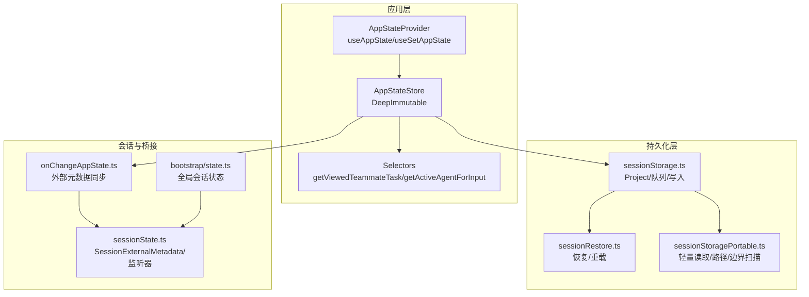
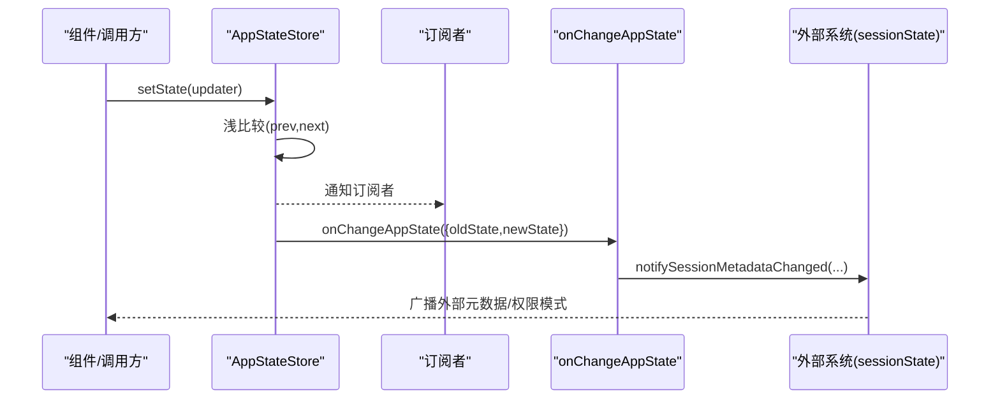
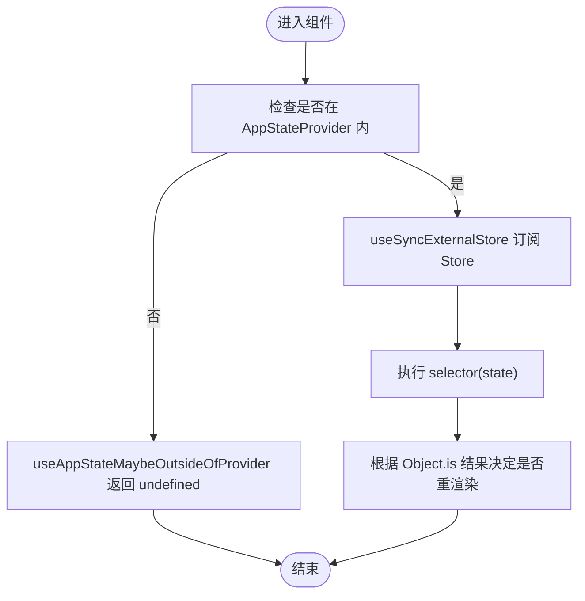
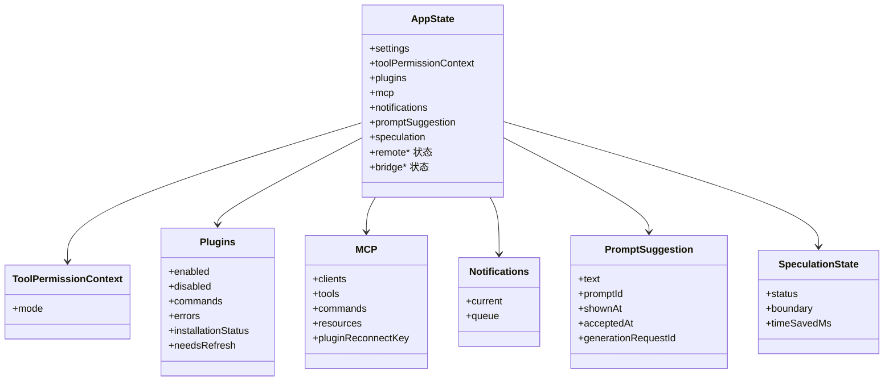
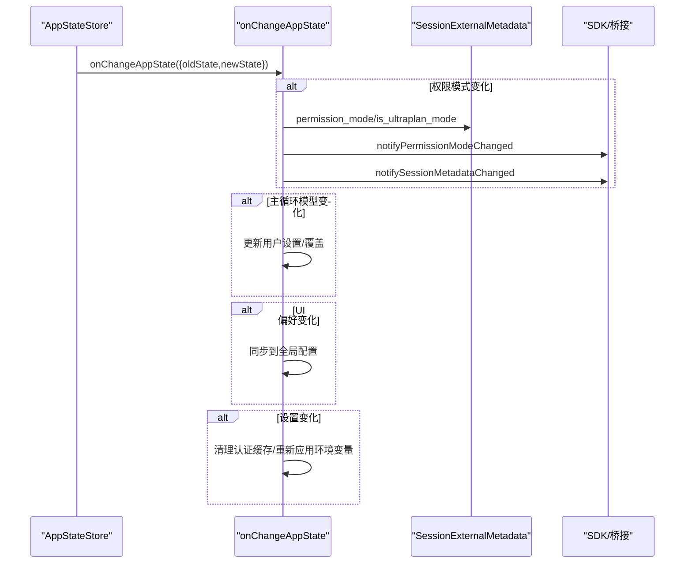
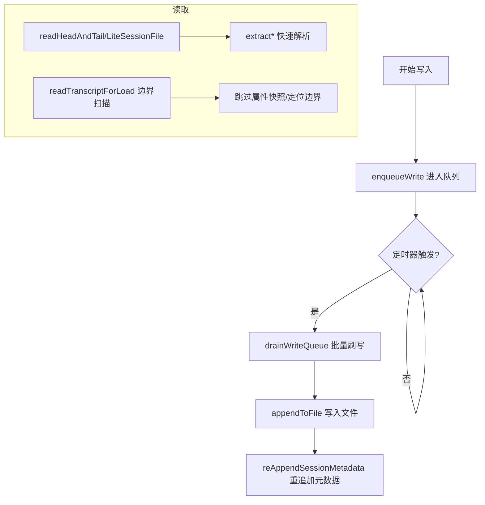
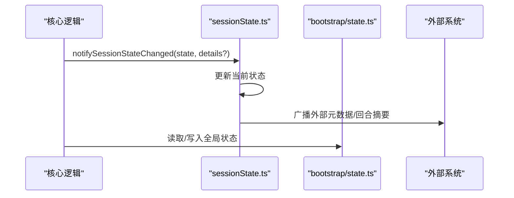
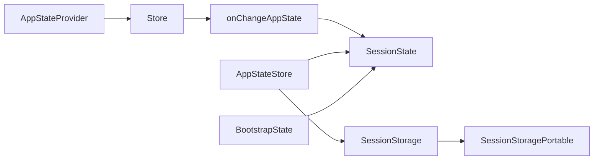

# 状态 API

<cite>
**本文引用的文件**
- [state/AppState.tsx](file://state/AppState.tsx)
- [state/AppStateStore.ts](file://state/AppStateStore.ts)
- [state/store.ts](file://state/store.ts)
- [state/selectors.ts](file://state/selectors.ts)
- [state/onChangeAppState.ts](file://state/onChangeAppState.ts)
- [state/teammateViewHelpers.ts](file://state/teammateViewHelpers.ts)
- [utils/sessionState.ts](file://utils/sessionState.ts)
- [utils/sessionStorage.ts](file://utils/sessionStorage.ts)
- [utils/sessionRestore.ts](file://utils/sessionRestore.ts)
- [utils/sessionStoragePortable.ts](file://utils/sessionStoragePortable.ts)
- [bootstrap/state.ts](file://bootstrap/state.ts)
</cite>

## 目录
1. [简介](#简介)
2. [项目结构](#项目结构)
3. [核心组件](#核心组件)
4. [架构总览](#架构总览)
5. [详细组件分析](#详细组件分析)
6. [依赖关系分析](#依赖关系分析)
7. [性能考量](#性能考量)
8. [故障排查指南](#故障排查指南)
9. [结论](#结论)
10. [附录](#附录)

## 简介
本文件为 Claude Code 状态管理系统提供完整的 API 文档，覆盖应用状态的数据结构、状态变更接口、订阅机制、持久化、同步与恢复流程，并给出状态查询、更新与监听的规范说明。文档同时解释状态的版本管理与迁移策略、调试与监控工具接口，以及状态与其他系统的集成方式（如桥接、会话元数据、远程控制等）。最后提供使用示例与最佳实践建议。

## 项目结构
状态系统由“应用状态”、“全局会话状态”、“持久化与恢复”三部分组成：
- 应用状态：React 可订阅的状态容器，提供选择器与更新器，支持细粒度订阅与浅比较优化。
- 全局会话状态：跨进程/跨模块共享的会话元信息与外部桥接状态（如权限模式、任务摘要、待处理动作）。
- 持久化与恢复：基于 JSONL 的会话文件写入、读取、压缩边界扫描、工作树与跨项目恢复、代理元数据等。

**图表来源**
- [state/AppState.tsx:37-110](file://state/AppState.tsx#L37-L110)
- [state/AppStateStore.ts:89-452](file://state/AppStateStore.ts#L89-L452)
- [state/selectors.ts:11-77](file://state/selectors.ts#L11-L77)
- [state/onChangeAppState.ts:43-92](file://state/onChangeAppState.ts#L43-L92)
- [utils/sessionState.ts:30-151](file://utils/sessionState.ts#L30-L151)
- [utils/sessionStorage.ts:530-794](file://utils/sessionStorage.ts#L530-L794)
- [utils/sessionRestore.ts:409-552](file://utils/sessionRestore.ts#L409-L552)
- [utils/sessionStoragePortable.ts:204-466](file://utils/sessionStoragePortable.ts#L204-L466)
- [bootstrap/state.ts:428-499](file://bootstrap/state.ts#L428-L499)

**章节来源**
- [state/AppState.tsx:37-110](file://state/AppState.tsx#L37-L110)
- [state/AppStateStore.ts:89-452](file://state/AppStateStore.ts#L89-L452)
- [state/selectors.ts:11-77](file://state/selectors.ts#L11-L77)
- [state/onChangeAppState.ts:43-92](file://state/onChangeAppState.ts#L43-L92)
- [utils/sessionState.ts:30-151](file://utils/sessionState.ts#L30-L151)
- [utils/sessionStorage.ts:530-794](file://utils/sessionStorage.ts#L530-L794)
- [utils/sessionRestore.ts:409-552](file://utils/sessionRestore.ts#L409-L552)
- [utils/sessionStoragePortable.ts:204-466](file://utils/sessionStoragePortable.ts#L204-L466)
- [bootstrap/state.ts:428-499](file://bootstrap/state.ts#L428-L499)

## 核心组件
- 应用状态容器与订阅
  - 提供 Provider、选择器钩子与稳定更新器，支持细粒度订阅与浅比较优化，避免不必要渲染。
  - 支持在 Provider 外安全访问（返回 undefined），便于通用组件使用。
- 应用状态数据结构
  - 包含设置、权限上下文、插件与 MCP 状态、通知、提示词建议、推测状态、遥测与桥接状态等。
- 全局会话状态与外部元数据
  - 通过 onChangeAppState 同步到外部（桥接/SDK），并通过 sessionState.ts 的监听器广播。
- 持久化与恢复
  - 基于 JSONL 的增量写入、批量刷写、压缩边界扫描、工作树与跨项目恢复、代理元数据等。

**章节来源**
- [state/AppState.tsx:117-179](file://state/AppState.tsx#L117-L179)
- [state/AppStateStore.ts:89-452](file://state/AppStateStore.ts#L89-L452)
- [state/onChangeAppState.ts:43-92](file://state/onChangeAppState.ts#L43-L92)
- [utils/sessionState.ts:30-151](file://utils/sessionState.ts#L30-L151)
- [utils/sessionStorage.ts:530-794](file://utils/sessionStorage.ts#L530-L794)
- [utils/sessionRestore.ts:409-552](file://utils/sessionRestore.ts#L409-L552)

## 架构总览
应用状态采用“不可变快照 + 订阅回调”的设计，配合 onChangeAppState 将关键状态变化同步至外部系统；持久化层以 JSONL 为核心，结合轻量读取与边界扫描实现高效加载与恢复。

**图表来源**
- [state/store.ts:10-35](file://state/store.ts#L10-L35)
- [state/AppState.tsx:142-163](file://state/AppState.tsx#L142-L163)
- [state/onChangeAppState.ts:43-92](file://state/onChangeAppState.ts#L43-L92)
- [utils/sessionState.ts:136-151](file://utils/sessionState.ts#L136-L151)

## 详细组件分析

### 组件一：应用状态容器与订阅
- Provider 与上下文
  - AppStateProvider 创建并注入 Store，确保嵌套使用时抛出错误。
  - 在挂载时检查并禁用可能被远程设置覆盖的“绕过权限模式”，保证一致性。
- 订阅与选择器
  - useAppState(selector) 返回选择值，仅在 Object.is 不同时触发重渲染。
  - 严禁在 selector 中返回新对象，应返回现有子引用以获得优化。
  - useSetAppState 返回稳定引用，避免因更新器变化导致的额外渲染。
  - useAppStateStore 直接获取 Store，用于非 React 场景。
  - useAppStateMaybeOutsideOfProvider 安全版本，在 Provider 外部返回 undefined。
- 设置变更联动
  - 通过 useSettingsChange 将外部设置变更应用到 AppState，保持与全局配置一致。

**图表来源**
- [state/AppState.tsx:117-200](file://state/AppState.tsx#L117-L200)

**章节来源**
- [state/AppState.tsx:37-110](file://state/AppState.tsx#L37-L110)
- [state/AppState.tsx:117-200](file://state/AppState.tsx#L117-L200)

### 组件二：应用状态数据结构与选择器
- 数据结构要点
  - 包含设置、权限上下文、任务、插件与 MCP、通知、提示词建议、推测状态、遥测与桥接状态等。
  - 部分字段为“统一任务状态”，包含函数类型，因此未纳入深度不可变。
- 选择器
  - getViewedTeammateTask：从 AppState 中提取当前查看的同伴任务。
  - getActiveAgentForInput：根据视图状态与任务类型，判断输入路由目标（领袖、已查看同伴、指定代理）。

**图表来源**
- [state/AppStateStore.ts:89-452](file://state/AppStateStore.ts#L89-L452)

**章节来源**
- [state/AppStateStore.ts:89-452](file://state/AppStateStore.ts#L89-L452)
- [state/selectors.ts:11-77](file://state/selectors.ts#L11-L77)

### 组件三：状态变更与外部同步
- onChangeAppState
  - 当 toolPermissionContext.mode 发生变化时，将外部模式（toExternalPermissionMode）与 isUltraplanMode 同步到外部元数据与 SDK 状态流。
  - 当 mainLoopModel 变化时，同步到用户设置与主循环模型覆盖。
  - 当 expandedView/verbose/tungstenPanelVisible 等 UI 偏好变化时，同步到全局配置。
  - 当 settings 变化时，清理认证缓存并重新应用环境变量。
- 外部元数据映射
  - externalMetadataToAppState 将外部元数据还原为内部状态，保证桥接/SDK 与本地状态一致。

**图表来源**
- [state/onChangeAppState.ts:43-172](file://state/onChangeAppState.ts#L43-L172)
- [utils/sessionState.ts:136-151](file://utils/sessionState.ts#L136-L151)

**章节来源**
- [state/onChangeAppState.ts:43-172](file://state/onChangeAppState.ts#L43-L172)
- [utils/sessionState.ts:30-151](file://utils/sessionState.ts#L30-L151)

### 组件四：持久化与恢复
- 持久化
  - Project 类负责写入队列、批量刷写、远程/内部事件写入、会话元数据重追加等。
  - 支持按文件队列、定时刷新、最大块大小限制，避免大文件写入阻塞。
- 轻量读取
  - 仅读取文件头尾固定大小窗口，用于快速提取标题、标签、最后提示等元数据。
- 边界扫描与压缩
  - 通过紧凑边界标记定位压缩点，跳过属性快照，保留最后一条属性快照至文件末尾。
- 恢复
  - 支持跨项目/工作树恢复、代理元数据恢复、上下文折叠日志恢复、代理定义刷新、工作树状态恢复等。
  - 支持 fork 会话时的内容替换记录迁移，避免缓存误判。

**图表来源**
- [utils/sessionStorage.ts:530-794](file://utils/sessionStorage.ts#L530-L794)
- [utils/sessionStoragePortable.ts:204-466](file://utils/sessionStoragePortable.ts#L204-L466)
- [utils/sessionStoragePortable.ts:717-794](file://utils/sessionStoragePortable.ts#L717-L794)

**章节来源**
- [utils/sessionStorage.ts:530-794](file://utils/sessionStorage.ts#L530-L794)
- [utils/sessionStoragePortable.ts:204-466](file://utils/sessionStoragePortable.ts#L204-L466)
- [utils/sessionStoragePortable.ts:717-794](file://utils/sessionStoragePortable.ts#L717-L794)
- [utils/sessionRestore.ts:409-552](file://utils/sessionRestore.ts#L409-L552)

### 组件五：全局会话状态与桥接
- 会话状态
  - 会话状态（idle/running/requires_action）与“需要操作”详情通过监听器广播。
  - 外部元数据（权限模式、是否超计划模式、模型、待处理动作、回合摘要等）可被外部系统查询。
- 全局会话状态
  - bootstrap/state.ts 提供会话 ID、项目根、工作目录、成本与用量统计、交互时间、慢操作列表等全局状态读写接口。

**图表来源**
- [utils/sessionState.ts:88-151](file://utils/sessionState.ts#L88-L151)
- [bootstrap/state.ts:428-499](file://bootstrap/state.ts#L428-L499)

**章节来源**
- [utils/sessionState.ts:88-151](file://utils/sessionState.ts#L88-L151)
- [bootstrap/state.ts:428-499](file://bootstrap/state.ts#L428-L499)

## 依赖关系分析
- 组件耦合
  - AppStateProvider 依赖 Store 与 onChangeAppState，确保设置变更与外部系统同步。
  - 选择器仅依赖 AppState，保持纯函数特性，便于测试与复用。
  - 持久化层通过 Project 单例与写队列解耦，避免频繁 IO 抖动。
- 外部依赖
  - 与桥接/SDK 的同步通过 sessionState.ts 的监听器完成，确保多路径修改均能被广播。
  - 与远程控制（replBridge）状态通过 AppStateStore 字段与 onChangeAppState 同步。

**图表来源**
- [state/AppState.tsx:37-110](file://state/AppState.tsx#L37-L110)
- [state/store.ts:10-35](file://state/store.ts#L10-L35)
- [state/onChangeAppState.ts:43-172](file://state/onChangeAppState.ts#L43-L172)
- [utils/sessionState.ts:136-151](file://utils/sessionState.ts#L136-L151)
- [utils/sessionStorage.ts:530-794](file://utils/sessionStorage.ts#L530-L794)
- [utils/sessionStoragePortable.ts:204-466](file://utils/sessionStoragePortable.ts#L204-L466)
- [bootstrap/state.ts:428-499](file://bootstrap/state.ts#L428-L499)

**章节来源**
- [state/AppState.tsx:37-110](file://state/AppState.tsx#L37-L110)
- [state/store.ts:10-35](file://state/store.ts#L10-L35)
- [state/onChangeAppState.ts:43-172](file://state/onChangeAppState.ts#L43-L172)
- [utils/sessionState.ts:136-151](file://utils/sessionState.ts#L136-L151)
- [utils/sessionStorage.ts:530-794](file://utils/sessionStorage.ts#L530-L794)
- [utils/sessionStoragePortable.ts:204-466](file://utils/sessionStoragePortable.ts#L204-L466)
- [bootstrap/state.ts:428-499](file://bootstrap/state.ts#L428-L499)

## 性能考量
- 订阅优化
  - 使用 useSyncExternalStore 与 Object.is 比较，避免不必要的重渲染。
  - 选择器不应返回新对象，推荐返回现有子引用。
- 写入批量化
  - Project 内部队列与定时器合并写入，最大块大小限制防止内存膨胀。
- 轻量读取
  - 仅读取文件头尾窗口，快速提取元数据；长文件采用边界扫描跳过属性快照。
- 缓存与去重
  - 项目目录路径与计划 slug 等使用 memoize 缓存，减少重复计算。

[本节为通用指导，无需特定文件分析]

## 故障排查指南
- 权限模式不同步
  - 确认 onChangeAppState 是否被所有修改路径调用；检查 externalMetadataToAppState 是否正确还原。
- 会话元数据未更新
  - 检查 notifySessionMetadataChanged 的监听器注册与广播时机；确认 SDK 事件队列是否启用。
- 持久化写入失败或丢失
  - 查看 Project 写队列与定时器状态；确认目录存在性与权限；检查 reAppendSessionMetadata 是否在退出时执行。
- 恢复后状态异常
  - 检查工作树状态、代理元数据、上下文折叠日志与代理定义刷新；确认 fork 会话的内容替换记录迁移。

**章节来源**
- [state/onChangeAppState.ts:43-172](file://state/onChangeAppState.ts#L43-L172)
- [utils/sessionState.ts:136-151](file://utils/sessionState.ts#L136-L151)
- [utils/sessionStorage.ts:530-794](file://utils/sessionStorage.ts#L530-L794)
- [utils/sessionRestore.ts:409-552](file://utils/sessionRestore.ts#L409-L552)

## 结论
该状态系统以不可变快照与细粒度订阅为核心，结合 onChangeAppState 的外部同步与 Project 的高性能持久化，实现了跨模块、跨进程的一致状态管理。通过选择器与轻量读取，系统在复杂场景下仍保持良好的性能与可观测性。建议在扩展新状态字段时遵循现有模式，确保订阅优化与外部同步的完整性。

[本节为总结，无需特定文件分析]

## 附录

### API 规范：状态查询、更新与监听
- 查询
  - useAppState(selector)：返回选择值，仅在浅比较变化时重渲染。
  - useAppStateMaybeOutsideOfProvider(selector)：Provider 外部安全访问，返回 undefined。
- 更新
  - useSetAppState()：返回稳定更新器，避免额外渲染。
  - AppStateProvider 的 initialState 与 onChangeAppState 回调用于初始化与变更监听。
- 监听
  - setSessionStateChangedListener / setSessionMetadataChangedListener / setPermissionModeChangedListener：注册外部状态监听。
  - onChangeAppState 作为单一变更入口，确保外部系统同步。

**章节来源**
- [state/AppState.tsx:117-200](file://state/AppState.tsx#L117-L200)
- [utils/sessionState.ts:60-84](file://utils/sessionState.ts#L60-L84)
- [state/onChangeAppState.ts:43-92](file://state/onChangeAppState.ts#L43-L92)

### 版本管理与迁移策略
- 外部元数据键
  - permission_mode、is_ultraplan_mode、model、pending_action、post_turn_summary、task_summary 等，通过 externalMetadataToAppState 与 onChangeAppState 实现双向同步。
- 会话切换
  - switchSession 原子切换 sessionId 与项目目录，避免漂移；支持 fork 会话时的内容替换迁移。
- 工作树与跨项目恢复
  - restoreWorktreeForResume/exitRestoredWorktree 与 restoreSessionMetadata 保证工作树状态与项目目录一致性。

**章节来源**
- [utils/sessionState.ts:30-46](file://utils/sessionState.ts#L30-L46)
- [state/onChangeAppState.ts:24-41](file://state/onChangeAppState.ts#L24-L41)
- [utils/sessionRestore.ts:332-400](file://utils/sessionRestore.ts#L332-L400)
- [bootstrap/state.ts:468-499](file://bootstrap/state.ts#L468-L499)

### 调试与监控工具接口
- 会话状态事件
  - notifySessionStateChanged：广播会话状态与“需要操作”详情。
  - enqueueSdkEvent：可选地向 SDK 事件流发送会话状态事件。
- 全局状态读写
  - 通过 bootstrap/state.ts 的 getter/setter 访问/修改全局会话状态（如 sessionId、项目根、成本统计、交互时间、慢操作列表等）。
- 慢操作追踪
  - getSlowOperations 返回最近的慢操作列表，自动清理过期条目。

**章节来源**
- [utils/sessionState.ts:92-134](file://utils/sessionState.ts#L92-L134)
- [bootstrap/state.ts:1043-1633](file://bootstrap/state.ts#L1043-L1633)

### 与其他系统的集成
- 桥接与 SDK
  - 通过 SessionExternalMetadata 与 onChangeAppState 同步权限模式、超计划模式、任务摘要等。
- 远程控制（replBridge）
  - AppStateStore 中包含 replBridge_* 状态字段，与 onChangeAppState 同步连接状态、会话 URL、错误信息等。
- 会话元数据
  - 通过 setSessionMetadataChangedListener 注册监听，外部系统可查询当前会话的 pending_action、post_turn_summary、task_summary 等。

**章节来源**
- [utils/sessionState.ts:136-151](file://utils/sessionState.ts#L136-L151)
- [state/AppStateStore.ts:133-158](file://state/AppStateStore.ts#L133-L158)
- [state/onChangeAppState.ts:43-92](file://state/onChangeAppState.ts#L43-L92)

### 使用示例与最佳实践
- 示例：在组件中订阅状态片段
  - 使用 useAppState(selector) 返回只读片段，避免返回新对象。
  - 对多个独立字段进行多次调用，分别订阅。
- 示例：更新状态
  - 使用 useSetAppState() 获取稳定更新器，传入 (prev) => next。
  - 在 Provider 外部使用 useAppStateMaybeOutsideOfProvider(selector) 安全访问。
- 示例：监听外部状态
  - setPermissionModeChangedListener(cb) 监听权限模式变化。
  - setSessionStateChangedListener(cb) 监听会话状态变化。
- 最佳实践
  - 选择器必须纯函数且无副作用；避免在选择器中创建新对象。
  - onChangeAppState 中的外部同步应尽量原子化，减少广播噪声。
  - 持久化写入使用 Project 的队列机制，避免频繁小写入。

**章节来源**
- [state/AppState.tsx:126-179](file://state/AppState.tsx#L126-L179)
- [utils/sessionState.ts:60-84](file://utils/sessionState.ts#L60-L84)
- [state/onChangeAppState.ts:43-92](file://state/onChangeAppState.ts#L43-L92)