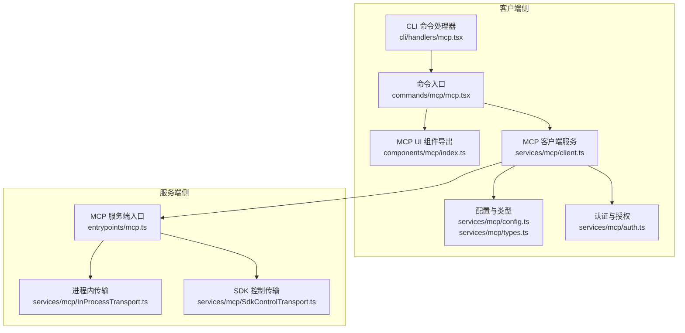
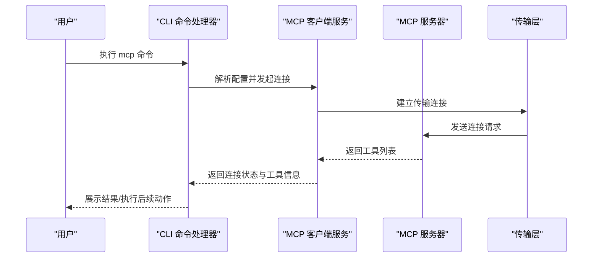
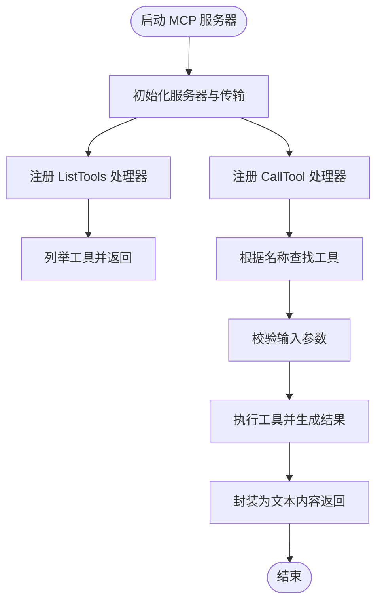
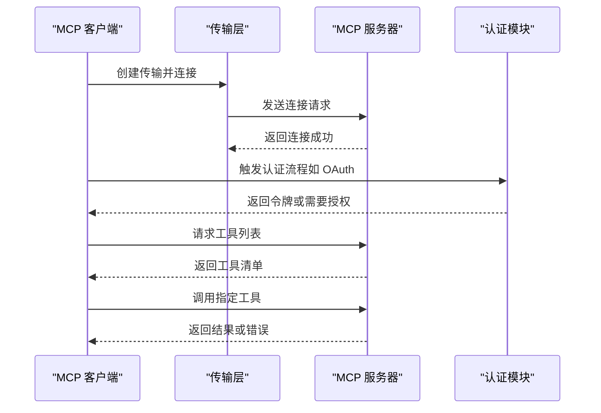
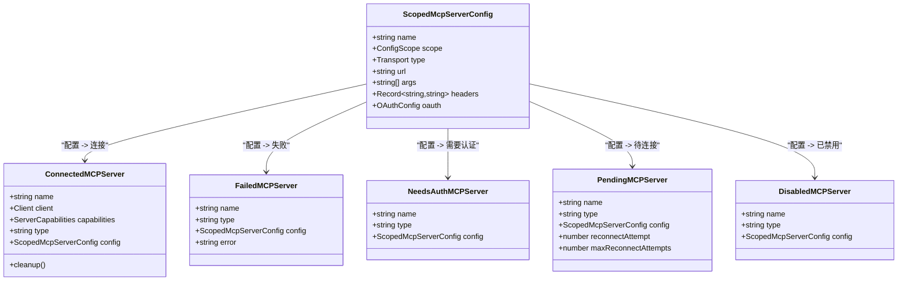
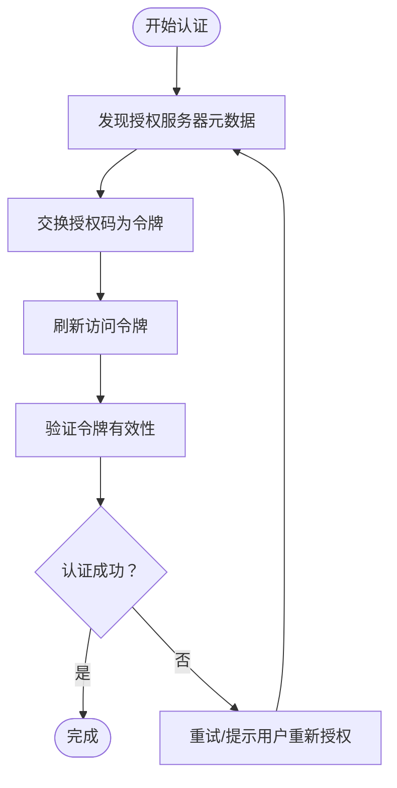
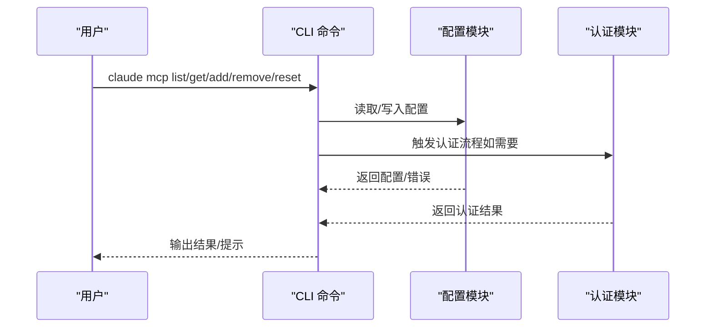
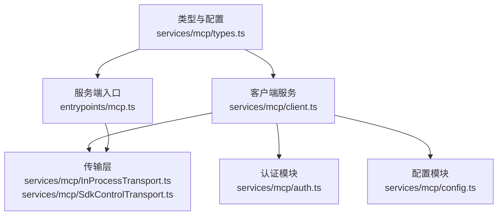

# MCP 协议概述

<cite>
**本文档引用的文件**
- [entrypoints/mcp.ts](file://entrypoints/mcp.ts)
- [services/mcp/types.ts](file://services/mcp/types.ts)
- [services/mcp/client.ts](file://services/mcp/client.ts)
- [services/mcp/config.ts](file://services/mcp/config.ts)
- [services/mcp/auth.ts](file://services/mcp/auth.ts)
- [services/mcp/InProcessTransport.ts](file://services/mcp/InProcessTransport.ts)
- [services/mcp/SdkControlTransport.ts](file://services/mcp/SdkControlTransport.ts)
- [cli/handlers/mcp.tsx](file://cli/handlers/mcp.tsx)
- [commands/mcp/mcp.tsx](file://commands/mcp/mcp.tsx)
- [components/mcp/index.ts](file://components/mcp/index.ts)
- [tools/McpAuthTool/McpAuthTool.ts](file://tools/McpAuthTool/McpAuthTool.ts)
- [services/mcp/normalization.ts](file://services/mcp/normalization.ts)
- [services/mcp/claudeai.ts](file://services/mcp/claudeai.ts)
</cite>

## 目录
1. [引言](#引言)
2. [项目结构](#项目结构)
3. [核心组件](#核心组件)
4. [架构总览](#架构总览)
5. [详细组件分析](#详细组件分析)
6. [依赖关系分析](#依赖关系分析)
7. [性能考量](#性能考量)
8. [故障排除指南](#故障排除指南)
9. [结论](#结论)
10. [附录](#附录)

## 引言
本文件系统性阐述 MCP（Model Context Protocol，模型上下文协议）在 Claude Code 中的设计理念、实现方式与应用价值。MCP 是一个开放协议，用于在 AI 模型与外部工具、资源之间建立标准化的上下文交换通道。Claude Code 基于 MCP 实现了“工具即服务”的能力：本地或远程的 MCP 服务器可向 Claude Code 暴露工具清单与调用接口，Claude Code 在对话过程中按需调用这些工具，从而扩展其能力边界。

在 Claude Code 中，MCP 的价值体现在：
- 统一工具接入：通过标准化协议统一管理本地/远程工具，无需为每个工具编写特定适配器
- 安全可控：支持多种传输与认证方式，结合企业策略与权限控制
- 可扩展性：支持 CLI、桌面端、插件等多种入口，便于生态扩展
- 一致性体验：工具调用结果以统一的消息结构返回，便于前端渲染与用户反馈

## 项目结构
围绕 MCP 的核心代码分布在以下模块：
- 入口与服务端：负责启动 MCP 服务器，暴露工具列表与调用处理逻辑
- 客户端与连接：负责发现、连接、认证与调用远端 MCP 服务器
- 配置与类型：定义服务器配置、传输类型、连接状态等数据结构
- 认证与授权：支持 OAuth、跨应用访问（XAA）等认证流程
- CLI 与命令行：提供 MCP 服务器的增删查改、健康检查、导入等操作
- UI 组件：提供 MCP 设置、工具列表、重连等交互界面

**图表来源**
- [cli/handlers/mcp.tsx:1-362](file://cli/handlers/mcp.tsx#L1-L362)
- [commands/mcp/mcp.tsx:1-85](file://commands/mcp/mcp.tsx#L1-L85)
- [components/mcp/index.ts:1-10](file://components/mcp/index.ts#L1-L10)
- [services/mcp/client.ts:1-200](file://services/mcp/client.ts#L1-L200)
- [services/mcp/config.ts:1-200](file://services/mcp/config.ts#L1-L200)
- [services/mcp/types.ts:1-259](file://services/mcp/types.ts#L1-L259)
- [services/mcp/auth.ts:1-200](file://services/mcp/auth.ts#L1-L200)
- [entrypoints/mcp.ts:1-197](file://entrypoints/mcp.ts#L1-L197)
- [services/mcp/InProcessTransport.ts:1-63](file://services/mcp/InProcessTransport.ts#L1-L63)
- [services/mcp/SdkControlTransport.ts:39-136](file://services/mcp/SdkControlTransport.ts#L39-L136)

**章节来源**
- [entrypoints/mcp.ts:1-197](file://entrypoints/mcp.ts#L1-L197)
- [services/mcp/types.ts:1-259](file://services/mcp/types.ts#L1-L259)
- [services/mcp/client.ts:1-200](file://services/mcp/client.ts#L1-L200)
- [services/mcp/config.ts:1-200](file://services/mcp/config.ts#L1-L200)
- [services/mcp/auth.ts:1-200](file://services/mcp/auth.ts#L1-L200)
- [services/mcp/InProcessTransport.ts:1-63](file://services/mcp/InProcessTransport.ts#L1-L63)
- [services/mcp/SdkControlTransport.ts:39-136](file://services/mcp/SdkControlTransport.ts#L39-L136)
- [cli/handlers/mcp.tsx:1-362](file://cli/handlers/mcp.tsx#L1-L362)
- [commands/mcp/mcp.tsx:1-85](file://commands/mcp/mcp.tsx#L1-L85)
- [components/mcp/index.ts:1-10](file://components/mcp/index.ts#L1-L10)

## 核心组件
- MCP 服务端入口：启动 MCP 服务器，注册工具列表与调用处理器，使用标准输入输出传输
- MCP 客户端服务：负责连接不同类型的 MCP 服务器（stdio、sse、http、ws、sdk），并进行认证、错误处理与资源管理
- 配置与类型系统：定义服务器配置、传输类型、连接状态、序列化状态等
- 认证与授权：支持 OAuth 流程、跨应用访问（XAA）、Claude.ai 连接器等
- CLI 与命令行：提供 MCP 服务器的增删查改、健康检查、导入等操作
- UI 组件：提供 MCP 设置、工具列表、重连等交互界面

**章节来源**
- [entrypoints/mcp.ts:35-197](file://entrypoints/mcp.ts#L35-L197)
- [services/mcp/client.ts:1-200](file://services/mcp/client.ts#L1-L200)
- [services/mcp/types.ts:1-259](file://services/mcp/types.ts#L1-L259)
- [services/mcp/auth.ts:1-200](file://services/mcp/auth.ts#L1-L200)
- [cli/handlers/mcp.tsx:1-362](file://cli/handlers/mcp.tsx#L1-L362)
- [components/mcp/index.ts:1-10](file://components/mcp/index.ts#L1-L10)

## 架构总览
MCP 在 Claude Code 中采用“客户端-服务端”双栈设计：
- 服务端侧：Claude Code 自身可作为 MCP 服务器，向外暴露工具清单与调用能力；也可通过 SDK 控制传输桥接到其他进程内的 MCP 服务
- 客户端侧：Claude Code 作为 MCP 客户端，连接本地/远程 MCP 服务器，动态获取工具与资源，并在会话中调用工具

**图表来源**
- [cli/handlers/mcp.tsx:144-190](file://cli/handlers/mcp.tsx#L144-L190)
- [services/mcp/client.ts:1-200](file://services/mcp/client.ts#L1-L200)
- [entrypoints/mcp.ts:35-197](file://entrypoints/mcp.ts#L35-L197)

## 详细组件分析

### MCP 服务端入口（Claude Code 作为服务器）
- 功能职责：初始化 MCP 服务器，注册工具列表与调用处理器，使用标准输入输出传输
- 关键点：
  - 工具列表：从工具系统获取可用工具，转换为 MCP 规范的工具描述
  - 工具调用：根据名称查找工具，校验输入，执行工具并返回文本内容
  - 错误处理：捕获异常并返回标准化错误响应
  - 缓存：对文件状态读取使用 LRU 缓存，避免内存增长

**图表来源**
- [entrypoints/mcp.ts:35-197](file://entrypoints/mcp.ts#L35-L197)

**章节来源**
- [entrypoints/mcp.ts:35-197](file://entrypoints/mcp.ts#L35-L197)

### MCP 客户端服务（连接与调用）
- 功能职责：连接不同类型的 MCP 服务器，处理认证、超时、错误与资源管理
- 支持的传输类型：stdio、sse、http、ws、sdk
- 关键点：
  - 连接管理：支持批量连接、超时控制、重连策略
  - 认证：支持 OAuth、跨应用访问（XAA）、Claude.ai 连接器
  - 资源与工具：动态获取工具、提示词、资源列表
  - 错误分类：区分会话过期、认证失败、工具调用错误等

**图表来源**
- [services/mcp/client.ts:1-200](file://services/mcp/client.ts#L1-L200)
- [services/mcp/auth.ts:1-200](file://services/mcp/auth.ts#L1-L200)

**章节来源**
- [services/mcp/client.ts:1-200](file://services/mcp/client.ts#L1-L200)
- [services/mcp/auth.ts:1-200](file://services/mcp/auth.ts#L1-L200)

### 配置与类型系统
- 功能职责：定义 MCP 服务器配置、传输类型、连接状态、序列化状态等数据结构
- 关键点：
  - 配置范围：local、user、project、dynamic、enterprise、claudeai、managed
  - 传输类型：stdio、sse、sse-ide、http、ws、sdk
  - 服务器配置：支持命令行、URL、头信息、OAuth 等
  - 连接状态：connected、failed、needs-auth、pending、disabled

**图表来源**
- [services/mcp/types.ts:163-227](file://services/mcp/types.ts#L163-L227)

**章节来源**
- [services/mcp/types.ts:1-259](file://services/mcp/types.ts#L1-L259)

### 认证与授权
- 功能职责：支持 OAuth、跨应用访问（XAA）、Claude.ai 连接器等认证流程
- 关键点：
  - OAuth 流程：发现授权服务器元数据、交换令牌、刷新令牌
  - 敏感参数保护：对日志中的敏感 OAuth 参数进行脱敏
  - 非标准错误归一化：将部分非标准错误码归一化为标准错误类型
  - XAA：支持跨应用访问，简化多系统间的身份协同

**图表来源**
- [services/mcp/auth.ts:1-200](file://services/mcp/auth.ts#L1-L200)
- [tools/McpAuthTool/McpAuthTool.ts:1-35](file://tools/McpAuthTool/McpAuthTool.ts#L1-L35)

**章节来源**
- [services/mcp/auth.ts:1-200](file://services/mcp/auth.ts#L1-L200)
- [tools/McpAuthTool/McpAuthTool.ts:1-35](file://tools/McpAuthTool/McpAuthTool.ts#L1-L35)

### CLI 与命令行
- 功能职责：提供 MCP 服务器的增删查改、健康检查、导入等操作
- 关键点：
  - 列表：并发检查多个服务器健康状态
  - 添加：支持从 JSON、从 Claude Desktop 导入
  - 移除：支持按作用域移除并清理安全存储
  - 重置：重置项目级服务器的批准/拒绝状态

**图表来源**
- [cli/handlers/mcp.tsx:144-283](file://cli/handlers/mcp.tsx#L144-L283)
- [services/mcp/config.ts:657-906](file://services/mcp/config.ts#L657-L906)

**章节来源**
- [cli/handlers/mcp.tsx:1-362](file://cli/handlers/mcp.tsx#L1-L362)
- [services/mcp/config.ts:657-906](file://services/mcp/config.ts#L657-L906)

### UI 组件与交互
- 功能职责：提供 MCP 设置、工具列表、重连等交互界面
- 关键点：
  - MCP 设置面板：展示服务器列表、连接状态、工具详情
  - 重连：针对断开或认证失败的服务器提供重连入口
  - 工具视图：展示工具描述、输入/输出模式与调用历史

**章节来源**
- [components/mcp/index.ts:1-10](file://components/mcp/index.ts#L1-L10)
- [commands/mcp/mcp.tsx:1-85](file://commands/mcp/mcp.tsx#L1-L85)

## 依赖关系分析
- 传输层：支持多种传输类型，包括标准输入输出、SSE、HTTP、WebSocket、SDK 控制传输
- 认证层：与 OAuth、跨应用访问（XAA）、Claude.ai 连接器深度集成
- 配置层：统一管理服务器配置、作用域与序列化状态
- 工具层：将 Claude Code 内部工具映射为 MCP 工具，支持输入/输出模式转换

**图表来源**
- [services/mcp/types.ts:1-259](file://services/mcp/types.ts#L1-L259)
- [services/mcp/client.ts:1-200](file://services/mcp/client.ts#L1-L200)
- [services/mcp/auth.ts:1-200](file://services/mcp/auth.ts#L1-L200)
- [services/mcp/config.ts:1-200](file://services/mcp/config.ts#L1-L200)
- [services/mcp/InProcessTransport.ts:1-63](file://services/mcp/InProcessTransport.ts#L1-L63)
- [services/mcp/SdkControlTransport.ts:39-136](file://services/mcp/SdkControlTransport.ts#L39-L136)
- [entrypoints/mcp.ts:1-197](file://entrypoints/mcp.ts#L1-L197)

**章节来源**
- [services/mcp/types.ts:1-259](file://services/mcp/types.ts#L1-L259)
- [services/mcp/client.ts:1-200](file://services/mcp/client.ts#L1-L200)
- [services/mcp/auth.ts:1-200](file://services/mcp/auth.ts#L1-L200)
- [services/mcp/config.ts:1-200](file://services/mcp/config.ts#L1-L200)
- [services/mcp/InProcessTransport.ts:1-63](file://services/mcp/InProcessTransport.ts#L1-L63)
- [services/mcp/SdkControlTransport.ts:39-136](file://services/mcp/SdkControlTransport.ts#L39-L136)
- [entrypoints/mcp.ts:1-197](file://entrypoints/mcp.ts#L1-L197)

## 性能考量
- 连接批处理：CLI 列表命令使用并发连接检查，提升大规模服务器健康检查效率
- 缓存策略：服务端对文件状态读取使用 LRU 缓存，限制内存占用
- 超时控制：客户端对连接与认证设置超时，避免长时间阻塞
- 序列化与压缩：工具输出采用 JSON 序列化，必要时进行内容截断与大小估算

[本节为通用指导，不直接分析具体文件]

## 故障排除指南
- 连接超时：检查网络与代理设置，确认服务器可达性与认证状态
- 认证失败：确认 OAuth 客户端信息、回调端口与令牌刷新流程
- 工具调用错误：查看工具输入参数是否符合模式，检查工具启用状态
- 会话过期：当服务器返回“会话未找到”错误时，清理连接缓存并重新获取客户端实例

**章节来源**
- [services/mcp/client.ts:1048-1077](file://services/mcp/client.ts#L1048-L1077)
- [services/mcp/auth.ts:1-200](file://services/mcp/auth.ts#L1-L200)

## 结论
MCP 在 Claude Code 中实现了“工具即服务”的统一接入框架，通过标准化协议与多样的传输/认证方式，既满足个人开发者快速集成本地工具的需求，也支持企业级的集中治理与安全管控。服务端与客户端的清晰分层、完善的配置与类型系统、以及丰富的 UI 与 CLI 支撑，使得 MCP 成为 Claude Code 生态扩展的关键基础设施。

[本节为总结性内容，不直接分析具体文件]

## 附录

### 数据格式与消息结构
- 工具描述：包含名称、描述、输入/输出 JSON Schema
- 工具调用：包含工具名与参数对象
- 错误响应：包含错误标志与文本内容，保留元数据以便上层处理

**章节来源**
- [entrypoints/mcp.ts:59-188](file://entrypoints/mcp.ts#L59-L188)
- [services/mcp/types.ts:232-258](file://services/mcp/types.ts#L232-L258)

### 通信机制
- 传输类型：stdio、sse、http、ws、sdk
- 认证方式：OAuth、跨应用访问（XAA）、Claude.ai 连接器
- 名称规范化：对服务器与工具名称进行字符替换与去重处理，确保 API 兼容性

**章节来源**
- [services/mcp/types.ts:23-26](file://services/mcp/types.ts#L23-L26)
- [services/mcp/auth.ts:1-200](file://services/mcp/auth.ts#L1-L200)
- [services/mcp/normalization.ts:1-23](file://services/mcp/normalization.ts#L1-L23)

### 版本兼容性与标准化
- 服务器标识：包含名称与版本号，便于客户端识别与兼容性判断
- 能力声明：通过能力字段声明支持的功能（如工具、提示词、资源等）
- 兼容策略：对输出模式进行类型检查与过滤，避免根级别 union 类型导致的兼容问题

**章节来源**
- [entrypoints/mcp.ts:47-57](file://entrypoints/mcp.ts#L47-L57)
- [entrypoints/mcp.ts:68-92](file://entrypoints/mcp.ts#L68-L92)