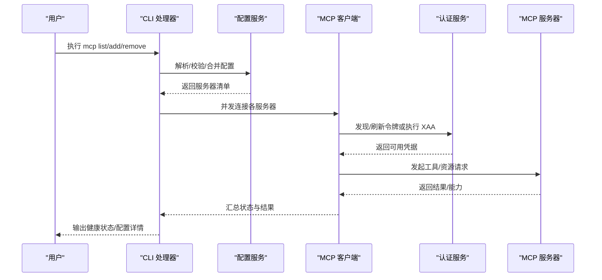
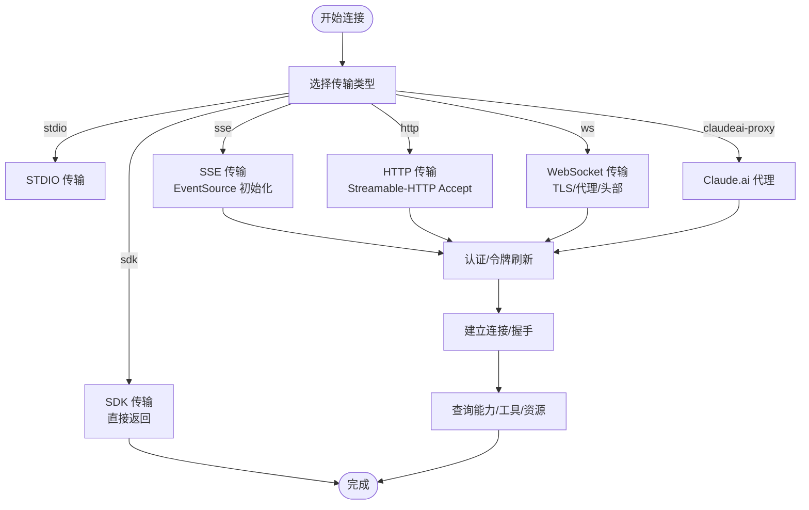
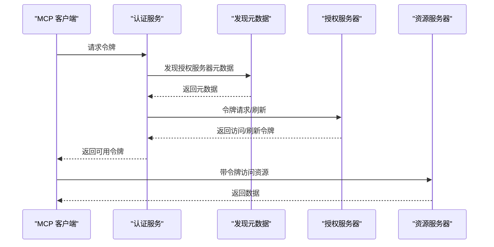
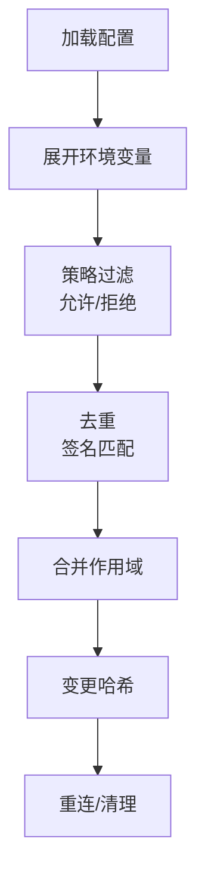
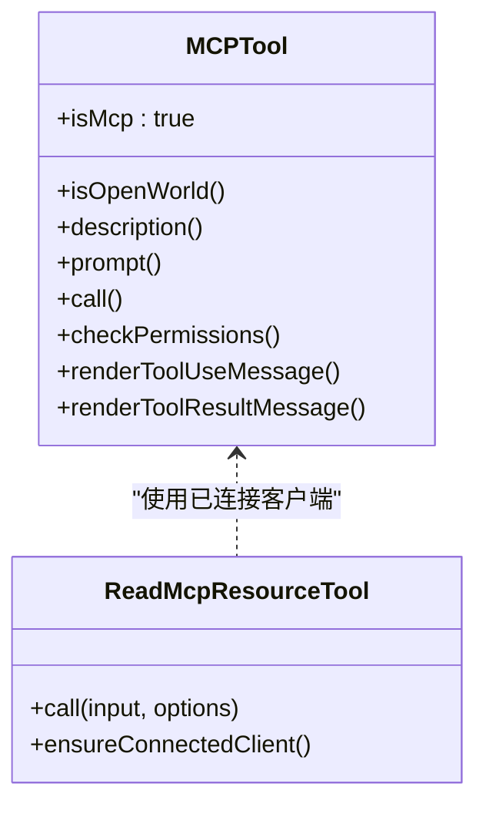
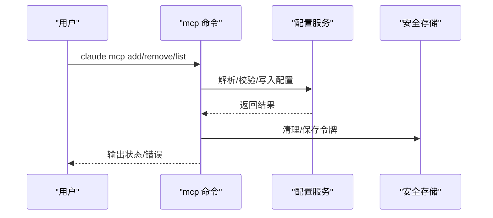
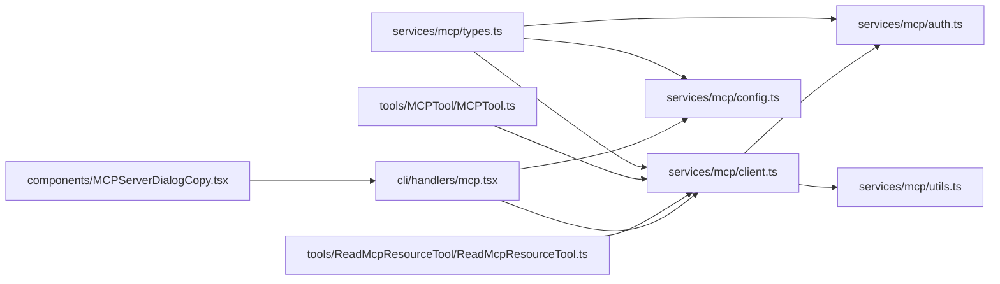

# MCP 协议集成

<cite>
**本文档引用的文件**
- [services/mcp/client.ts](file://services/mcp/client.ts)
- [services/mcp/config.ts](file://services/mcp/config.ts)
- [services/mcp/auth.ts](file://services/mcp/auth.ts)
- [services/mcp/types.ts](file://services/mcp/types.ts)
- [services/mcp/utils.ts](file://services/mcp/utils.ts)
- [tools/MCPTool/MCPTool.ts](file://tools/MCPTool/MCPTool.ts)
- [tools/ReadMcpResourceTool/ReadMcpResourceTool.ts](file://tools/ReadMcpResourceTool/ReadMcpResourceTool.ts)
- [cli/handlers/mcp.tsx](file://cli/handlers/mcp.tsx)
- [components/MCPServerDialogCopy.tsx](file://components/MCPServerDialogCopy.tsx)
</cite>

## 目录
1. [简介](#简介)
2. [项目结构](#项目结构)
3. [核心组件](#核心组件)
4. [架构总览](#架构总览)
5. [详细组件分析](#详细组件分析)
6. [依赖关系分析](#依赖关系分析)
7. [性能考量](#性能考量)
8. [故障排除指南](#故障排除指南)
9. [结论](#结论)
10. [附录](#附录)

## 简介
本文件系统性阐述 Claude Code 中对 Model Context Protocol（MCP）协议的集成方案，覆盖协议工作原理、服务器连接管理、资源访问与权限控制、工具使用与配置、开发与集成最佳实践、安全考虑与防护措施，以及与系统工具体系的整合关系，并提供可操作的故障排除与调试方法。

## 项目结构
MCP 集成主要分布在以下模块：
- 服务层：负责 MCP 客户端连接、认证、工具与资源发现、状态管理与缓存
- 配置层：负责服务器配置解析、策略过滤（允许/拒绝列表）、作用域管理
- 工具层：封装 MCP 工具调用与资源读取，统一 UI 呈现与权限提示
- CLI 层：提供命令行添加、删除、列出、健康检查等运维能力
- 组件层：提供用户交互对话框与安全提示

```mermaid
graph TB
subgraph "CLI"
CLI["cli/handlers/mcp.tsx<br/>命令行处理器"]
end
subgraph "服务层"
SVC_CFG["services/mcp/config.ts<br/>配置与策略"]
SVC_CLI["services/mcp/client.ts<br/>客户端与连接"]
SVC_AUTH["services/mcp/auth.ts<br/>认证与令牌管理"]
SVC_UTIL["services/mcp/utils.ts<br/>工具与辅助"]
end
subgraph "工具层"
TOOL_MCP["tools/MCPTool/MCPTool.ts<br/>通用 MCP 工具"]
TOOL_READ["tools/ReadMcpResourceTool/ReadMcpResourceTool.ts<br/>资源读取工具"]
end
subgraph "组件层"
UI_COPY["components/MCPServerDialogCopy.tsx<br/>安全提示"]
end
CLI --> SVC_CFG
CLI --> SVC_CLI
SVC_CLI --> SVC_AUTH
SVC_CLI --> SVC_UTIL
SVC_CFG --> SVC_CLI
TOOL_MCP --> SVC_CLI
TOOL_READ --> SVC_CLI
UI_COPY --> CLI
```

**图表来源**
- [cli/handlers/mcp.tsx:1-362](file://cli/handlers/mcp.tsx#L1-L362)
- [services/mcp/config.ts:1-800](file://services/mcp/config.ts#L1-L800)
- [services/mcp/client.ts:1-800](file://services/mcp/client.ts#L1-L800)
- [services/mcp/auth.ts:1-800](file://services/mcp/auth.ts#L1-L800)
- [services/mcp/utils.ts:1-576](file://services/mcp/utils.ts#L1-L576)
- [tools/MCPTool/MCPTool.ts:1-78](file://tools/MCPTool/MCPTool.ts#L1-L78)
- [tools/ReadMcpResourceTool/ReadMcpResourceTool.ts:47-101](file://tools/ReadMcpResourceTool/ReadMcpResourceTool.ts#L47-L101)
- [components/MCPServerDialogCopy.tsx:1-15](file://components/MCPServerDialogCopy.tsx#L1-L15)

**章节来源**
- [services/mcp/client.ts:1-800](file://services/mcp/client.ts#L1-L800)
- [services/mcp/config.ts:1-800](file://services/mcp/config.ts#L1-L800)
- [services/mcp/auth.ts:1-800](file://services/mcp/auth.ts#L1-L800)
- [services/mcp/types.ts:1-259](file://services/mcp/types.ts#L1-L259)
- [services/mcp/utils.ts:1-576](file://services/mcp/utils.ts#L1-L576)
- [tools/MCPTool/MCPTool.ts:1-78](file://tools/MCPTool/MCPTool.ts#L1-L78)
- [tools/ReadMcpResourceTool/ReadMcpResourceTool.ts:47-101](file://tools/ReadMcpResourceTool/ReadMcpResourceTool.ts#L47-L101)
- [cli/handlers/mcp.tsx:1-362](file://cli/handlers/mcp.tsx#L1-L362)
- [components/MCPServerDialogCopy.tsx:1-15](file://components/MCPServerDialogCopy.tsx#L1-L15)

## 核心组件
- MCP 客户端与连接管理：负责不同传输类型（stdio、SSE、HTTP、WebSocket、SDK、claude.ai 代理）的连接建立、重连、会话过期检测与恢复、并发批量连接、超时与请求头处理
- 认证与令牌管理：支持标准 OAuth 流程、跨应用访问（XAA）流程、令牌撤销、发现元数据、步骤提升（step-up）与安全存储
- 配置与策略：支持多作用域（用户/项目/本地/动态/企业/claude.ai/托管）配置合并、去重、策略白名单/黑名单、环境变量展开、签名与变更检测
- 工具与资源：统一 MCP 工具包装、资源读取、工具分类与折叠、权限提示与 UI 呈现
- CLI 运维：提供添加/删除/列出/健康检查/从桌面导入等命令行能力

**章节来源**
- [services/mcp/client.ts:1-800](file://services/mcp/client.ts#L1-L800)
- [services/mcp/auth.ts:1-800](file://services/mcp/auth.ts#L1-L800)
- [services/mcp/config.ts:1-800](file://services/mcp/config.ts#L1-L800)
- [services/mcp/types.ts:1-259](file://services/mcp/types.ts#L1-L259)
- [tools/MCPTool/MCPTool.ts:1-78](file://tools/MCPTool/MCPTool.ts#L1-L78)
- [tools/ReadMcpResourceTool/ReadMcpResourceTool.ts:47-101](file://tools/ReadMcpResourceTool/ReadMcpResourceTool.ts#L47-L101)
- [cli/handlers/mcp.tsx:1-362](file://cli/handlers/mcp.tsx#L1-L362)

## 架构总览
MCP 在 Claude Code 中采用“配置驱动 + 服务抽象 + 工具封装”的分层架构：
- 配置层：解析与合并多源配置，执行策略过滤与去重，生成标准化的服务器定义
- 服务层：根据配置选择传输类型，构造传输层（HTTP/SSE/WebSocket/STDIO/SDK），完成连接、认证、工具与资源发现、错误处理与重连
- 工具层：将 MCP 工具与资源暴露为统一的工具接口，提供 UI 呈现与权限提示
- CLI 层：提供运维与诊断命令，支持批量健康检查与配置导入



**图表来源**
- [cli/handlers/mcp.tsx:144-190](file://cli/handlers/mcp.tsx#L144-L190)
- [services/mcp/config.ts:1082-1120](file://services/mcp/config.ts#L1082-L1120)
- [services/mcp/client.ts:595-800](file://services/mcp/client.ts#L595-L800)
- [services/mcp/auth.ts:256-311](file://services/mcp/auth.ts#L256-L311)

**章节来源**
- [cli/handlers/mcp.tsx:144-190](file://cli/handlers/mcp.tsx#L144-L190)
- [services/mcp/config.ts:1082-1120](file://services/mcp/config.ts#L1082-L1120)
- [services/mcp/client.ts:595-800](file://services/mcp/client.ts#L595-L800)
- [services/mcp/auth.ts:256-311](file://services/mcp/auth.ts#L256-L311)

## 详细组件分析

### MCP 客户端与连接管理
- 传输类型支持：stdio、sse、http、ws、sdk、sse-ide、ws-ide、claudeai-proxy
- 连接策略：按类型选择对应传输层，注入用户代理、代理、TLS、自定义头部；SSE 使用独立 EventSource 初始化避免请求超时；HTTP/Streamable-HTTP 强制 Accept 头以满足规范
- 超时与信号：为每个请求创建独立超时信号，避免单次超时信号复用导致后续请求立即失败
- 并发与批处理：批量连接大小可配置，降低同时连接过多导致的资源竞争
- 会话与重连：检测会话过期（HTTP 404 + 特定 JSON-RPC 错误码），触发重新连接；对 SDK 类型服务器直接返回，不进行外部连接
- 工具与资源发现：基于服务器能力自动构建工具与资源视图，支持缓存与去重



**图表来源**
- [services/mcp/client.ts:595-800](file://services/mcp/client.ts#L595-L800)
- [services/mcp/client.ts:456-550](file://services/mcp/client.ts#L456-L550)
- [services/mcp/client.ts:1688-1704](file://services/mcp/client.ts#L1688-L1704)

**章节来源**
- [services/mcp/client.ts:595-800](file://services/mcp/client.ts#L595-L800)
- [services/mcp/client.ts:456-550](file://services/mcp/client.ts#L456-L550)
- [services/mcp/client.ts:1688-1704](file://services/mcp/client.ts#L1688-L1704)

### 认证与令牌管理
- OAuth 发现与刷新：支持配置化元数据 URL 或按 RFC 9728/8414 自动发现；POST 响应体非标准错误码归一化为标准 invalid_grant
- 令牌撤销：优先撤销刷新令牌，再撤销访问令牌；支持 RFC 7009 兼容与回退到 Bearer 授权
- 步骤提升与安全存储：支持保留发现状态与范围，减少重复探测；敏感参数日志脱敏
- XAA（跨应用访问）：一次 IdP 登录复用至所有 XAA 服务器，执行 RFC 8693+jwt-bearer 交换，保存到与 OAuth 相同的密钥库槽位



**图表来源**
- [services/mcp/auth.ts:256-311](file://services/mcp/auth.ts#L256-L311)
- [services/mcp/auth.ts:381-459](file://services/mcp/auth.ts#L381-L459)
- [services/mcp/auth.ts:664-800](file://services/mcp/auth.ts#L664-L800)

**章节来源**
- [services/mcp/auth.ts:256-311](file://services/mcp/auth.ts#L256-L311)
- [services/mcp/auth.ts:381-459](file://services/mcp/auth.ts#L381-L459)
- [services/mcp/auth.ts:664-800](file://services/mcp/auth.ts#L664-L800)

### 配置与策略
- 多作用域配置：支持用户级、项目级、本地级、动态级、企业级、claude.ai、托管等配置来源合并
- 策略过滤：允许/拒绝列表支持名称、命令、URL 三种维度匹配；企业配置具有独占控制权
- 去重与签名：基于命令数组或 URL（去除代理路径标记）计算签名，避免重复与冲突
- 环境变量展开：在加载阶段展开配置中的环境变量，缺失变量记录以便诊断
- 变更检测：通过哈希比较配置内容变化，触发重连或清理



**图表来源**
- [services/mcp/config.ts:133-194](file://services/mcp/config.ts#L133-L194)
- [services/mcp/config.ts:336-508](file://services/mcp/config.ts#L336-L508)
- [services/mcp/utils.ts:157-169](file://services/mcp/utils.ts#L157-L169)

**章节来源**
- [services/mcp/config.ts:133-194](file://services/mcp/config.ts#L133-L194)
- [services/mcp/config.ts:336-508](file://services/mcp/config.ts#L336-L508)
- [services/mcp/utils.ts:157-169](file://services/mcp/utils.ts#L157-L169)

### 工具与资源
- MCP 工具包装：统一工具接口，支持只读、破坏性、开放世界等标注，提供 UI 呈现与截断处理
- 资源读取：通过已连接客户端发起 resources/read 请求，支持结果大小限制与二进制内容持久化
- 权限与提示：工具调用前触发权限检查，必要时弹出审批或提示



**图表来源**
- [tools/MCPTool/MCPTool.ts:27-77](file://tools/MCPTool/MCPTool.ts#L27-L77)
- [tools/ReadMcpResourceTool/ReadMcpResourceTool.ts:75-101](file://tools/ReadMcpResourceTool/ReadMcpResourceTool.ts#L75-L101)
- [services/mcp/client.ts:1688-1704](file://services/mcp/client.ts#L1688-L1704)

**章节来源**
- [tools/MCPTool/MCPTool.ts:27-77](file://tools/MCPTool/MCPTool.ts#L27-L77)
- [tools/ReadMcpResourceTool/ReadMcpResourceTool.ts:75-101](file://tools/ReadMcpResourceTool/ReadMcpResourceTool.ts#L75-L101)
- [services/mcp/client.ts:1688-1704](file://services/mcp/client.ts#L1688-L1704)

### CLI 运维
- 列表与健康检查：并发批量检查服务器连接状态，支持 stdio/sse/http/claudeai-proxy 类型展示
- 添加/删除：支持从 JSON 字符串或文件添加，支持从 Claude Desktop 导入；删除时清理安全存储
- 重置项目选择：重置项目级服务器批准/拒绝状态



**图表来源**
- [cli/handlers/mcp.tsx:144-190](file://cli/handlers/mcp.tsx#L144-L190)
- [cli/handlers/mcp.tsx:73-141](file://cli/handlers/mcp.tsx#L73-L141)
- [cli/handlers/mcp.tsx:285-314](file://cli/handlers/mcp.tsx#L285-L314)

**章节来源**
- [cli/handlers/mcp.tsx:144-190](file://cli/handlers/mcp.tsx#L144-L190)
- [cli/handlers/mcp.tsx:73-141](file://cli/handlers/mcp.tsx#L73-L141)
- [cli/handlers/mcp.tsx:285-314](file://cli/handlers/mcp.tsx#L285-L314)

## 依赖关系分析
- 类型与模式：MCP 配置类型由 Zod Schema 定义，确保配置结构与传输类型约束
- 服务耦合：客户端依赖配置与认证服务；工具层依赖客户端；CLI 依赖配置与客户端
- 外部依赖：MCP SDK 提供传输与认证实现；HTTP/SSE/WebSocket 适配器；安全存储与锁文件



**图表来源**
- [services/mcp/types.ts:1-259](file://services/mcp/types.ts#L1-L259)
- [services/mcp/client.ts:1-800](file://services/mcp/client.ts#L1-L800)
- [services/mcp/config.ts:1-800](file://services/mcp/config.ts#L1-L800)
- [services/mcp/auth.ts:1-800](file://services/mcp/auth.ts#L1-L800)
- [services/mcp/utils.ts:1-576](file://services/mcp/utils.ts#L1-L576)
- [tools/MCPTool/MCPTool.ts:1-78](file://tools/MCPTool/MCPTool.ts#L1-L78)
- [tools/ReadMcpResourceTool/ReadMcpResourceTool.ts:47-101](file://tools/ReadMcpResourceTool/ReadMcpResourceTool.ts#L47-L101)
- [cli/handlers/mcp.tsx:1-362](file://cli/handlers/mcp.tsx#L1-L362)
- [components/MCPServerDialogCopy.tsx:1-15](file://components/MCPServerDialogCopy.tsx#L1-L15)

**章节来源**
- [services/mcp/types.ts:1-259](file://services/mcp/types.ts#L1-L259)
- [services/mcp/client.ts:1-800](file://services/mcp/client.ts#L1-L800)
- [services/mcp/config.ts:1-800](file://services/mcp/config.ts#L1-L800)
- [services/mcp/auth.ts:1-800](file://services/mcp/auth.ts#L1-L800)
- [services/mcp/utils.ts:1-576](file://services/mcp/utils.ts#L1-L576)
- [tools/MCPTool/MCPTool.ts:1-78](file://tools/MCPTool/MCPTool.ts#L1-L78)
- [tools/ReadMcpResourceTool/ReadMcpResourceTool.ts:47-101](file://tools/ReadMcpResourceTool/ReadMcpResourceTool.ts#L47-L101)
- [cli/handlers/mcp.tsx:1-362](file://cli/handlers/mcp.tsx#L1-L362)
- [components/MCPServerDialogCopy.tsx:1-15](file://components/MCPServerDialogCopy.tsx#L1-L15)

## 性能考量
- 连接批处理：批量连接大小可配置，避免过度并发导致资源争用
- 请求超时：为每个请求设置独立超时信号，防止单次超时信号复用造成后续请求立即失败
- 缓存与去重：工具/资源与认证缓存，减少重复请求；基于签名的去重避免重复连接
- 内容截断与持久化：对大输出进行估算与截断，必要时持久化二进制内容，避免内存压力

[本节为通用指导，无需特定文件引用]

## 故障排除指南
- 连接失败
  - 检查服务器类型与传输参数（URL、头部、代理、TLS）
  - 查看批量连接日志与错误码，确认是否为超时或 404 会话过期
  - 使用 CLI 的健康检查命令批量诊断
- 认证问题
  - 若返回需要认证，检查 OAuth 客户端配置与回调端口
  - 对于 XAA，确认 IdP 与 AS 配置一致，必要时清理缓存后重试
  - 使用令牌撤销功能清理异常令牌
- 策略与配置
  - 企业配置独占控制时无法手动添加服务器
  - 检查允许/拒绝列表与命令/URL 匹配规则
  - 使用配置导入与重置功能恢复默认状态

**章节来源**
- [services/mcp/client.ts:193-206](file://services/mcp/client.ts#L193-L206)
- [services/mcp/client.ts:340-361](file://services/mcp/client.ts#L340-L361)
- [services/mcp/auth.ts:467-618](file://services/mcp/auth.ts#L467-L618)
- [services/mcp/config.ts:619-761](file://services/mcp/config.ts#L619-L761)
- [cli/handlers/mcp.tsx:144-190](file://cli/handlers/mcp.tsx#L144-L190)

## 结论
Claude Code 的 MCP 集成通过清晰的分层设计与完善的认证、配置、工具与 CLI 支撑，实现了对多种传输类型的统一接入与安全可控的工具/资源访问。其策略过滤、去重与变更检测机制保证了在复杂配置场景下的稳定性，而丰富的诊断与运维能力则提升了可维护性与可观测性。

[本节为总结，无需特定文件引用]

## 附录

### MCP 工具使用与配置要点
- 工具调用：通过统一工具接口发起，支持只读、破坏性、开放世界等标注
- 资源读取：需先建立有效连接，再调用 resources/read，注意结果大小限制
- 权限提示：工具调用前触发权限检查，必要时弹出审批对话框

**章节来源**
- [tools/MCPTool/MCPTool.ts:27-77](file://tools/MCPTool/MCPTool.ts#L27-L77)
- [tools/ReadMcpResourceTool/ReadMcpResourceTool.ts:75-101](file://tools/ReadMcpResourceTool/ReadMcpResourceTool.ts#L75-L101)

### MCP 服务器开发与集成最佳实践
- 传输选择：优先使用 SSE/HTTP/WS，避免不必要的 stdio 子进程开销
- 认证设计：提供标准 OAuth 元数据端点，支持刷新与撤销；对 XAA 场景提供 IdP 与 AS 分离配置
- 策略兼容：遵循允许/拒绝列表命名与命令/URL 匹配规则，便于企业策略管控
- 安全提示：在 UI 中明确提示 MCP 服务器可能执行代码或访问系统资源，所有工具调用需审批

**章节来源**
- [services/mcp/auth.ts:256-311](file://services/mcp/auth.ts#L256-L311)
- [services/mcp/config.ts:336-508](file://services/mcp/config.ts#L336-L508)
- [components/MCPServerDialogCopy.tsx:4-8](file://components/MCPServerDialogCopy.tsx#L4-L8)

### MCP 协议安全考虑与防护措施
- 令牌安全：严格区分客户端认证与资源所有者认证，遵循 RFC 7009；支持回退到 Bearer 授权
- 日志脱敏：对 OAuth 查询参数进行脱敏，避免泄露敏感值
- 会话过期：检测 404 + 特定 JSON-RPC 错误码，主动重建连接
- 企业策略：企业配置独占控制，阻止用户添加不受控服务器

**章节来源**
- [services/mcp/auth.ts:108-125](file://services/mcp/auth.ts#L108-L125)
- [services/mcp/auth.ts:381-459](file://services/mcp/auth.ts#L381-L459)
- [services/mcp/client.ts:193-206](file://services/mcp/client.ts#L193-L206)
- [services/mcp/config.ts:1082-1096](file://services/mcp/config.ts#L1082-L1096)

### MCP 系统与工具系统的集成关系
- 工具命名空间：MCP 工具采用 `mcp__<server>__<tool>` 命名，便于过滤与归属识别
- 能力展示：通过 `/mcp` 菜单展示工具与资源能力，区分 MCP prompts 与 skills
- 权限与 UI：统一 UI 呈现与权限提示，确保用户对潜在危险操作有充分认知

**章节来源**
- [services/mcp/utils.ts:39-94](file://services/mcp/utils.ts#L39-L94)
- [services/mcp/utils.ts:413-436](file://services/mcp/utils.ts#L413-L436)