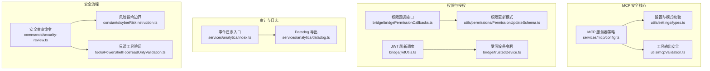
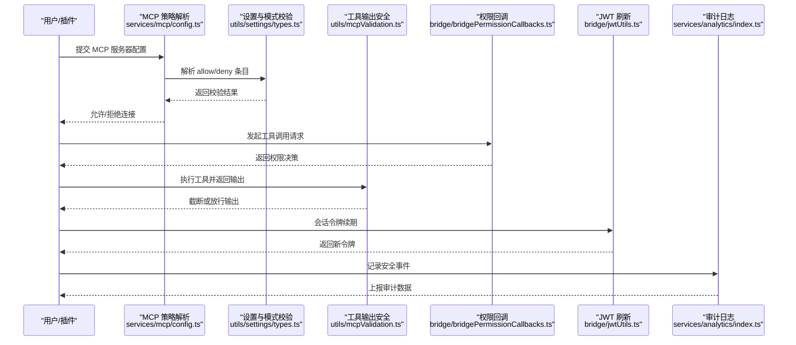
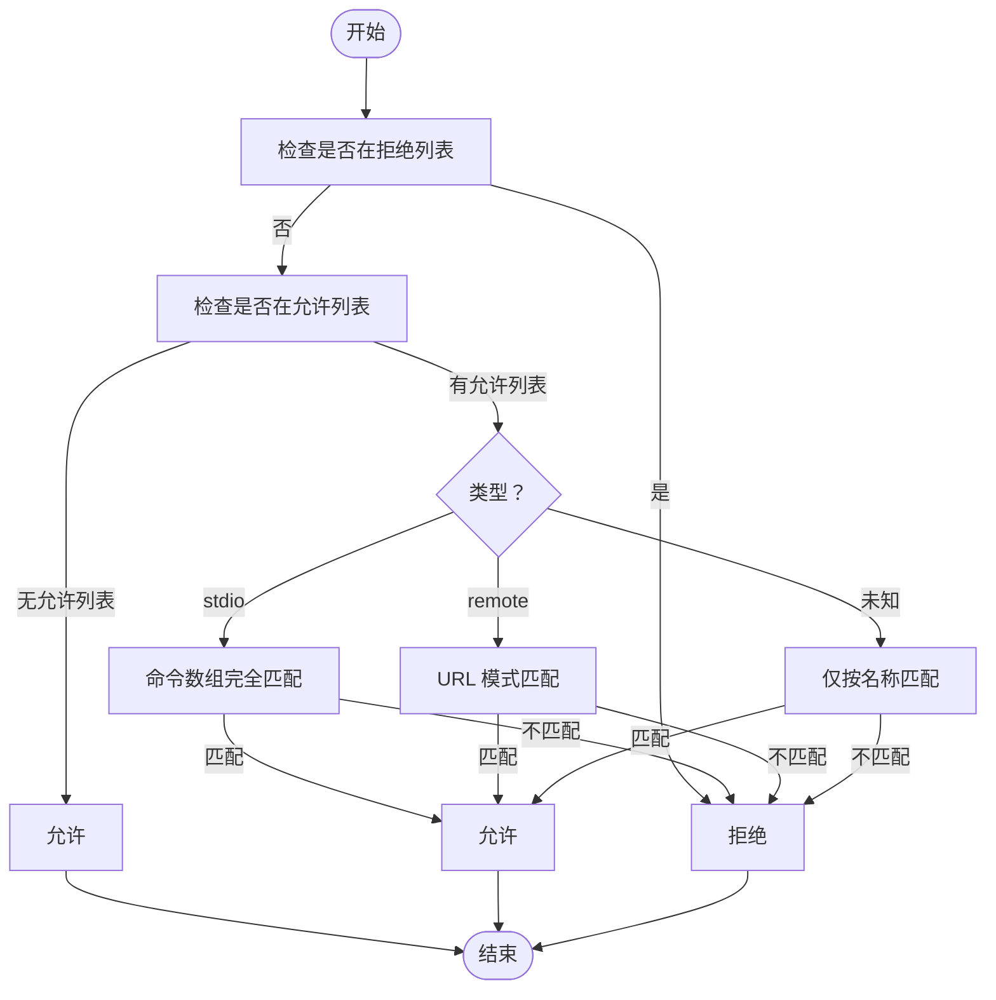
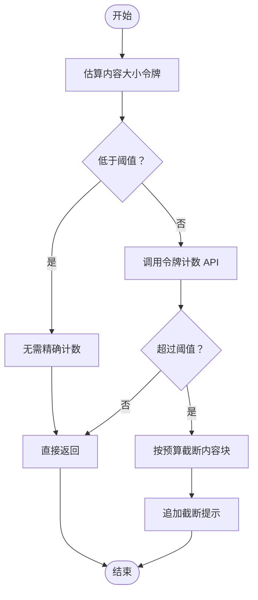
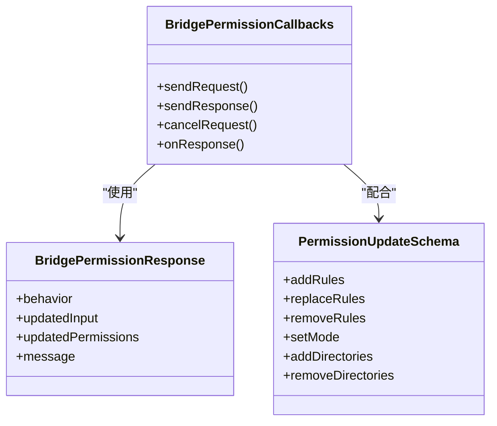
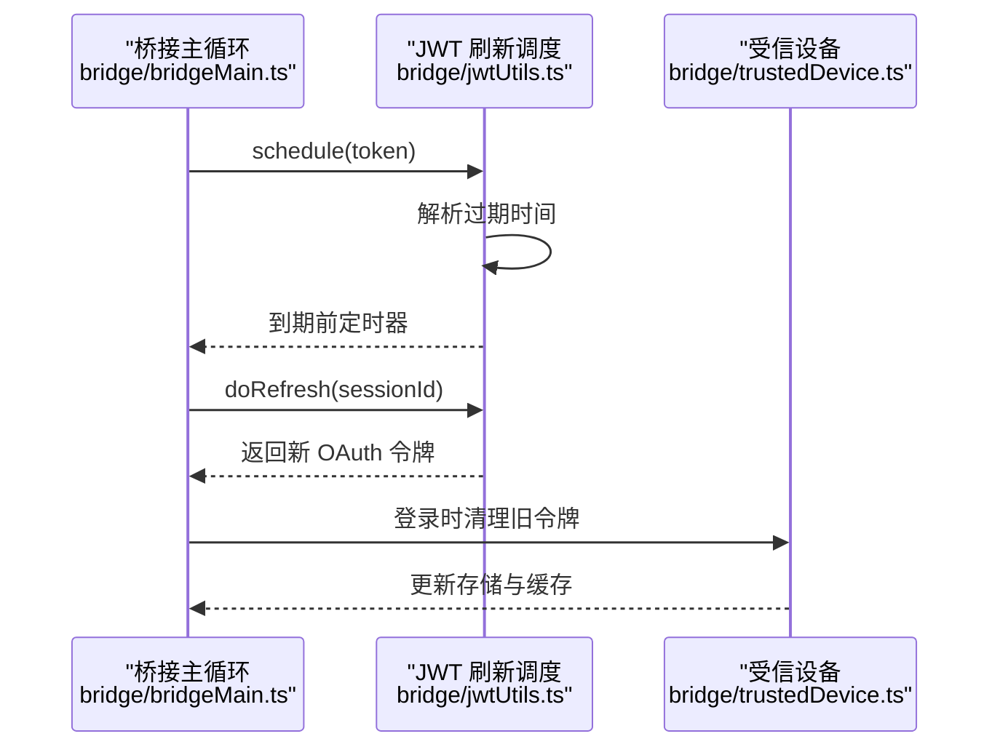
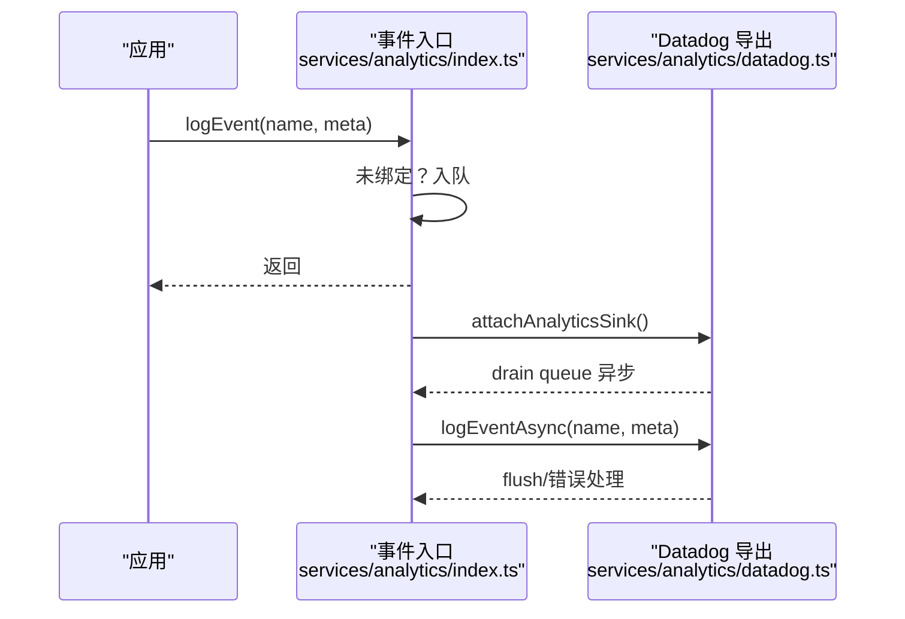
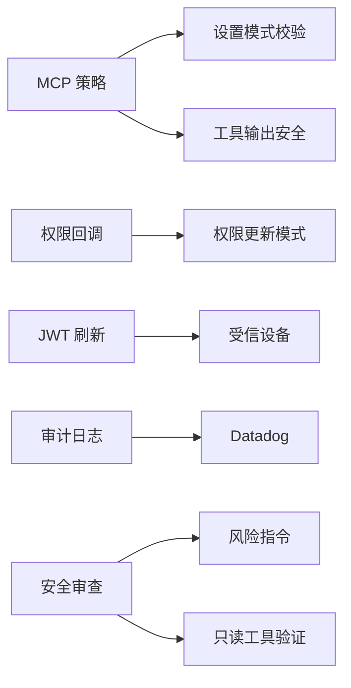

# MCP 安全与防护

<cite>
**本文引用的文件**
- [services/mcp/config.ts](file://services/mcp/config.ts)
- [utils/settings/types.ts](file://utils/settings/types.ts)
- [utils/mcpValidation.ts](file://utils/mcpValidation.ts)
- [bridge/bridgePermissionCallbacks.ts](file://bridge/bridgePermissionCallbacks.ts)
- [utils/permissions/PermissionUpdateSchema.ts](file://utils/permissions/PermissionUpdateSchema.ts)
- [bridge/jwtUtils.ts](file://bridge/jwtUtils.ts)
- [bridge/bridgeMain.ts](file://bridge/bridgeMain.ts)
- [bridge/trustedDevice.ts](file://bridge/trustedDevice.ts)
- [services/analytics/index.ts](file://services/analytics/index.ts)
- [services/analytics/datadog.ts](file://services/analytics/datadog.ts)
- [constants/cyberRiskInstruction.ts](file://constants/cyberRiskInstruction.ts)
- [commands/security-review.ts](file://commands/security-review.ts)
- [tools/PowerShellTool/readOnlyValidation.ts](file://tools/PowerShellTool/readOnlyValidation.ts)
</cite>

## 目录
1. [简介](#简介)
2. [项目结构](#项目结构)
3. [核心组件](#核心组件)
4. [架构总览](#架构总览)
5. [详细组件分析](#详细组件分析)
6. [依赖关系分析](#依赖关系分析)
7. [性能考量](#性能考量)
8. [故障排查指南](#故障排查指南)
9. [结论](#结论)
10. [附录](#附录)

## 简介
本文件面向 Claude Code 中的 MCP（Model Context Protocol）安全与防护体系，系统阐述协议层面的安全威胁与应对策略，覆盖通道权限控制、访问白名单与流量过滤、SSRF 防护、URL 验证与资源限制、安全审计与日志、异常检测、安全配置与漏洞扫描、安全事件响应与隔离恢复机制，并阐明 MCP 安全系统与 Claude Code 整体安全架构的关系。

## 项目结构
围绕 MCP 的安全实现，主要涉及以下模块：
- 企业级 MCP 服务器白/黑名单与策略：服务端配置与策略解析
- 设置与模式校验：允许/拒绝条目、URL 模式匹配、命令数组精确匹配
- 工具输出安全：令牌计数与内容截断，防止超大输出
- 权限与授权：桥接层权限回调、OAuth/JWT 生命周期管理
- 审计与日志：事件队列、采样与敏感信息保护
- 安全审查与风险指令：安全审查流程与风险边界

图表来源
- [services/mcp/config.ts](file://services/mcp/config.ts)
- [utils/settings/types.ts](file://utils/settings/types.ts)
- [utils/mcpValidation.ts](file://utils/mcpValidation.ts)
- [bridge/bridgePermissionCallbacks.ts](file://bridge/bridgePermissionCallbacks.ts)
- [utils/permissions/PermissionUpdateSchema.ts](file://utils/permissions/PermissionUpdateSchema.ts)
- [bridge/jwtUtils.ts](file://bridge/jwtUtils.ts)
- [bridge/trustedDevice.ts](file://bridge/trustedDevice.ts)
- [services/analytics/index.ts](file://services/analytics/index.ts)
- [services/analytics/datadog.ts](file://services/analytics/datadog.ts)
- [commands/security-review.ts](file://commands/security-review.ts)
- [constants/cyberRiskInstruction.ts](file://constants/cyberRiskInstruction.ts)
- [tools/PowerShellTool/readOnlyValidation.ts](file://tools/PowerShellTool/readOnlyValidation.ts)

章节来源
- [services/mcp/config.ts](file://services/mcp/config.ts)
- [utils/settings/types.ts](file://utils/settings/types.ts)
- [utils/mcpValidation.ts](file://utils/mcpValidation.ts)
- [bridge/bridgePermissionCallbacks.ts](file://bridge/bridgePermissionCallbacks.ts)
- [utils/permissions/PermissionUpdateSchema.ts](file://utils/permissions/PermissionUpdateSchema.ts)
- [bridge/jwtUtils.ts](file://bridge/jwtUtils.ts)
- [bridge/trustedDevice.ts](file://bridge/trustedDevice.ts)
- [services/analytics/index.ts](file://services/analytics/index.ts)
- [services/analytics/datadog.ts](file://services/analytics/datadog.ts)
- [commands/security-review.ts](file://commands/security-review.ts)
- [constants/cyberRiskInstruction.ts](file://constants/cyberRiskInstruction.ts)
- [tools/PowerShellTool/readOnlyValidation.ts](file://tools/PowerShellTool/readOnlyValidation.ts)

## 核心组件
- MCP 服务器策略与白/黑名单
  - 基于名称、命令数组（stdio）、URL 模式的精确匹配与通配符匹配，支持企业级 denylist 优先于 allowlist。
- 设置与模式校验
  - Zod 模式定义允许/拒绝条目，确保字段互斥且格式正确；URL 模式转换为正则进行匹配。
- 工具输出安全
  - 基于令牌计数的阈值判断与内容截断，限制 MCP 工具输出大小，避免资源滥用。
- 权限与授权
  - 权限回调接口与权限更新模式，结合 OAuth/JWT 生命周期管理与受信设备令牌，保障会话安全。
- 审计与日志
  - 事件队列与采样、敏感信息保护标记、PII 字段剥离，统一导出至 Datadog。
- 安全审查与风险指令
  - 安全审查命令模板与排除规则，风险指令明确边界，只读工具验证降低注入风险。

章节来源
- [services/mcp/config.ts](file://services/mcp/config.ts)
- [utils/settings/types.ts](file://utils/settings/types.ts)
- [utils/mcpValidation.ts](file://utils/mcpValidation.ts)
- [bridge/bridgePermissionCallbacks.ts](file://bridge/bridgePermissionCallbacks.ts)
- [utils/permissions/PermissionUpdateSchema.ts](file://utils/permissions/PermissionUpdateSchema.ts)
- [bridge/jwtUtils.ts](file://bridge/jwtUtils.ts)
- [bridge/trustedDevice.ts](file://bridge/trustedDevice.ts)
- [services/analytics/index.ts](file://services/analytics/index.ts)
- [services/analytics/datadog.ts](file://services/analytics/datadog.ts)
- [commands/security-review.ts](file://commands/security-review.ts)
- [constants/cyberRiskInstruction.ts](file://constants/cyberRiskInstruction.ts)
- [tools/PowerShellTool/readOnlyValidation.ts](file://tools/PowerShellTool/readOnlyValidation.ts)

## 架构总览
MCP 安全体系以“策略前置、权限最小化、输出治理、审计可观测”为核心设计原则，贯穿配置解析、连接建立、工具调用到日志上报的全链路。

图表来源
- [services/mcp/config.ts](file://services/mcp/config.ts)
- [utils/settings/types.ts](file://utils/settings/types.ts)
- [utils/mcpValidation.ts](file://utils/mcpValidation.ts)
- [bridge/bridgePermissionCallbacks.ts](file://bridge/bridgePermissionCallbacks.ts)
- [bridge/jwtUtils.ts](file://bridge/jwtUtils.ts)
- [services/analytics/index.ts](file://services/analytics/index.ts)

## 详细组件分析

### 组件一：MCP 服务器白/黑名单与策略
- 名称匹配：基于 serverName 的精确匹配，用于通用场景。
- 命令匹配（stdio）：对 stdio 服务器使用命令数组完全一致匹配，避免路径或参数差异导致的误判。
- URL 匹配：对远程服务器使用通配符 URL 模式转换为正则进行匹配，支持主机、路径、端口通配。
- 优先级：denylist 优先于 allowlist；当 allowlist 为空时默认阻断；仅当存在允许条目时才进行匹配。
- 内容去重：通过签名（命令数组或解包后的 URL）去重，避免重复连接同一后端。

图表来源
- [services/mcp/config.ts](file://services/mcp/config.ts)
- [utils/settings/types.ts](file://utils/settings/types.ts)

章节来源
- [services/mcp/config.ts](file://services/mcp/config.ts)
- [utils/settings/types.ts](file://utils/settings/types.ts)

### 组件二：设置与模式校验（Zod）
- 允许条目：serverName、serverCommand、serverUrl 三者互斥，支持正则约束与最小长度校验。
- 拒绝条目：同允许条目，但用于显式阻止。
- URL 模式：将通配符转换为正则，支持主机、路径、端口等维度的模糊匹配。
- 命令数组：严格要求至少一个元素，确保非空命令。

章节来源
- [utils/settings/types.ts](file://utils/settings/types.ts)

### 组件三：工具输出安全与资源限制
- 令牌计数阈值：先以启发式估算判断是否需要进一步 API 计数，避免昂贵的令牌统计。
- 输出截断：字符串直接截断；内容块按剩余字符预算逐项拼接，图片尝试压缩以适配剩余空间。
- 截断消息：在被截断内容末尾追加提示，指导用户使用分页/过滤能力。
- 环境变量与特性开关：支持通过环境变量与动态配置调整最大输出令牌数。

图表来源
- [utils/mcpValidation.ts](file://utils/mcpValidation.ts)

章节来源
- [utils/mcpValidation.ts](file://utils/mcpValidation.ts)

### 组件四：权限控制与访问白名单
- 权限回调接口：定义请求/响应结构与类型守卫，确保桥接层与前端交互的强类型安全。
- 权限更新模式：支持添加/替换/移除规则、设置模式、增删目录等，目标可落至用户/项目/本地/会话/CLI 参数。
- 白名单/黑名单：结合 MCP 策略与权限规则，形成多层访问控制。

图表来源
- [bridge/bridgePermissionCallbacks.ts](file://bridge/bridgePermissionCallbacks.ts)
- [utils/permissions/PermissionUpdateSchema.ts](file://utils/permissions/PermissionUpdateSchema.ts)

章节来源
- [bridge/bridgePermissionCallbacks.ts](file://bridge/bridgePermissionCallbacks.ts)
- [utils/permissions/PermissionUpdateSchema.ts](file://utils/permissions/PermissionUpdateSchema.ts)

### 组件五：JWT 与受信设备令牌
- JWT 解码：支持剥离前缀并解析载荷中的过期时间，用于刷新调度。
- 刷新调度：在到期前一定窗口内触发刷新，失败重试有限次数，避免会话中断。
- 受信设备：登录时强制重新注册，清理旧令牌缓存，防止跨账户混淆。

图表来源
- [bridge/bridgeMain.ts](file://bridge/bridgeMain.ts)
- [bridge/jwtUtils.ts](file://bridge/jwtUtils.ts)
- [bridge/trustedDevice.ts](file://bridge/trustedDevice.ts)

章节来源
- [bridge/bridgeMain.ts](file://bridge/bridgeMain.ts)
- [bridge/jwtUtils.ts](file://bridge/jwtUtils.ts)
- [bridge/trustedDevice.ts](file://bridge/trustedDevice.ts)

### 组件六：安全审计与日志
- 事件队列：未绑定 sink 时事件入队，启动后异步冲刷。
- 采样与脱敏：支持动态采样配置，敏感元数据需显式标注；PII 字段在导出前剥离。
- Datadog：批量写入、定时刷新、错误处理与降级。

图表来源
- [services/analytics/index.ts](file://services/analytics/index.ts)
- [services/analytics/datadog.ts](file://services/analytics/datadog.ts)

章节来源
- [services/analytics/index.ts](file://services/analytics/index.ts)
- [services/analytics/datadog.ts](file://services/analytics/datadog.ts)

### 组件七：安全审查与风险边界
- 安全审查命令：内置模板与工具集，聚焦高置信度漏洞，自动排除若干低影响类别。
- 风险指令：明确安全测试、防御性安全、CTF、教育场景的边界，禁止破坏性技术与恶意用途。
- 只读工具验证：对 PowerShell 事件日志类命令进行安全标志位限制，避免 XXE/命令注入等风险。

章节来源
- [commands/security-review.ts](file://commands/security-review.ts)
- [constants/cyberRiskInstruction.ts](file://constants/cyberRiskInstruction.ts)
- [tools/PowerShellTool/readOnlyValidation.ts](file://tools/PowerShellTool/readOnlyValidation.ts)

## 依赖关系分析
- MCP 策略依赖设置模式校验，确保 allow/deny 条目合法。
- 权限回调与权限更新模式共同构成权限控制闭环。
- JWT 刷新与受信设备令牌保障会话生命周期安全。
- 审计日志贯穿各组件，形成统一可观测性。
- 安全审查与风险指令为开发与运营提供安全基线。

图表来源
- [services/mcp/config.ts](file://services/mcp/config.ts)
- [utils/settings/types.ts](file://utils/settings/types.ts)
- [utils/mcpValidation.ts](file://utils/mcpValidation.ts)
- [bridge/bridgePermissionCallbacks.ts](file://bridge/bridgePermissionCallbacks.ts)
- [utils/permissions/PermissionUpdateSchema.ts](file://utils/permissions/PermissionUpdateSchema.ts)
- [bridge/jwtUtils.ts](file://bridge/jwtUtils.ts)
- [bridge/trustedDevice.ts](file://bridge/trustedDevice.ts)
- [services/analytics/index.ts](file://services/analytics/index.ts)
- [services/analytics/datadog.ts](file://services/analytics/datadog.ts)
- [commands/security-review.ts](file://commands/security-review.ts)
- [constants/cyberRiskInstruction.ts](file://constants/cyberRiskInstruction.ts)
- [tools/PowerShellTool/readOnlyValidation.ts](file://tools/PowerShellTool/readOnlyValidation.ts)

章节来源
- [services/mcp/config.ts](file://services/mcp/config.ts)
- [utils/settings/types.ts](file://utils/settings/types.ts)
- [utils/mcpValidation.ts](file://utils/mcpValidation.ts)
- [bridge/bridgePermissionCallbacks.ts](file://bridge/bridgePermissionCallbacks.ts)
- [utils/permissions/PermissionUpdateSchema.ts](file://utils/permissions/PermissionUpdateSchema.ts)
- [bridge/jwtUtils.ts](file://bridge/jwtUtils.ts)
- [bridge/trustedDevice.ts](file://bridge/trustedDevice.ts)
- [services/analytics/index.ts](file://services/analytics/index.ts)
- [services/analytics/datadog.ts](file://services/analytics/datadog.ts)
- [commands/security-review.ts](file://commands/security-review.ts)
- [constants/cyberRiskInstruction.ts](file://constants/cyberRiskInstruction.ts)
- [tools/PowerShellTool/readOnlyValidation.ts](file://tools/PowerShellTool/readOnlyValidation.ts)

## 性能考量
- 策略匹配：命令数组与 URL 正则匹配为 O(n) 与 O(1) 匹配，开销可控；建议合理配置 allowlist，减少无效匹配。
- 输出截断：启发式估算避免频繁调用昂贵的令牌计数 API；批量截断与图片压缩提升吞吐。
- 审计日志：批量写入与定时刷新，避免阻塞主线程；采样降低带宽与存储压力。
- 会话令牌：到期前窗口刷新与失败重试上限，平衡可用性与稳定性。

## 故障排查指南
- 连接被拒绝
  - 检查 denylist 是否命中；确认 allowlist 是否为空导致默认阻断。
  - 对比命令数组与 URL 模式，确保完全一致或模式正确。
- 权限提示过多
  - 调整权限更新模式与规则，减少 ask 规则数量；必要时设置默认模式。
- 会话中断或令牌过期
  - 查看 JWT 刷新调度日志；确认受信设备令牌是否被清理或过期。
- 审计缺失
  - 确认 sink 是否已绑定；检查采样配置与敏感信息标记。
- 输出过大
  - 调整最大输出令牌数；优化上游工具的分页/过滤能力。

章节来源
- [services/mcp/config.ts](file://services/mcp/config.ts)
- [utils/mcpValidation.ts](file://utils/mcpValidation.ts)
- [bridge/jwtUtils.ts](file://bridge/jwtUtils.ts)
- [services/analytics/index.ts](file://services/analytics/index.ts)

## 结论
MCP 安全体系通过“策略前置、权限最小化、输出治理、审计可观测”的设计，在保证功能灵活性的同时，有效降低了连接风险、权限滥用与资源耗尽的风险。建议在企业环境中启用严格的 denylist 与 allowlist，并结合权限模式与审计日志形成闭环管控。

## 附录

### 安全配置指南
- 启用 denylist 优先策略，避免 allowlist 为空导致的默认放行。
- 对 stdio 服务器使用命令数组精确匹配，对远程服务器使用通配符 URL 模式。
- 限制 MCP 工具输出大小，结合分页/过滤能力。
- 配置权限模式与规则，减少交互成本。
- 开启审计日志并设置采样率，确保合规与可观测性。

### 漏洞扫描方法
- 使用安全审查命令模板，聚焦高置信度漏洞类别。
- 结合风险指令边界，避免误报与噪音。
- 对只读工具进行安全标志位验证，降低注入风险。

### 安全事件响应与隔离
- 事件响应：基于审计日志快速定位事件来源与影响范围。
- 隔离策略：临时禁用相关 MCP 服务器或收紧权限规则。
- 恢复机制：回滚配置变更，恢复受信设备令牌，重启桥接进程。