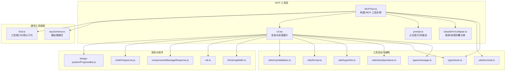
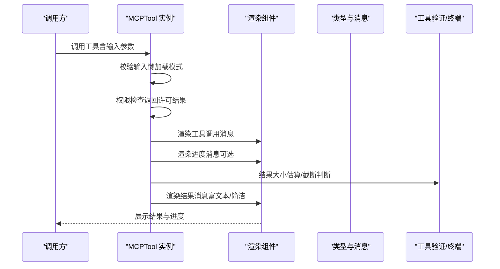
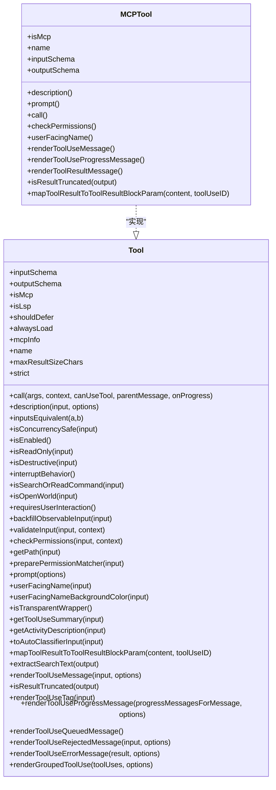
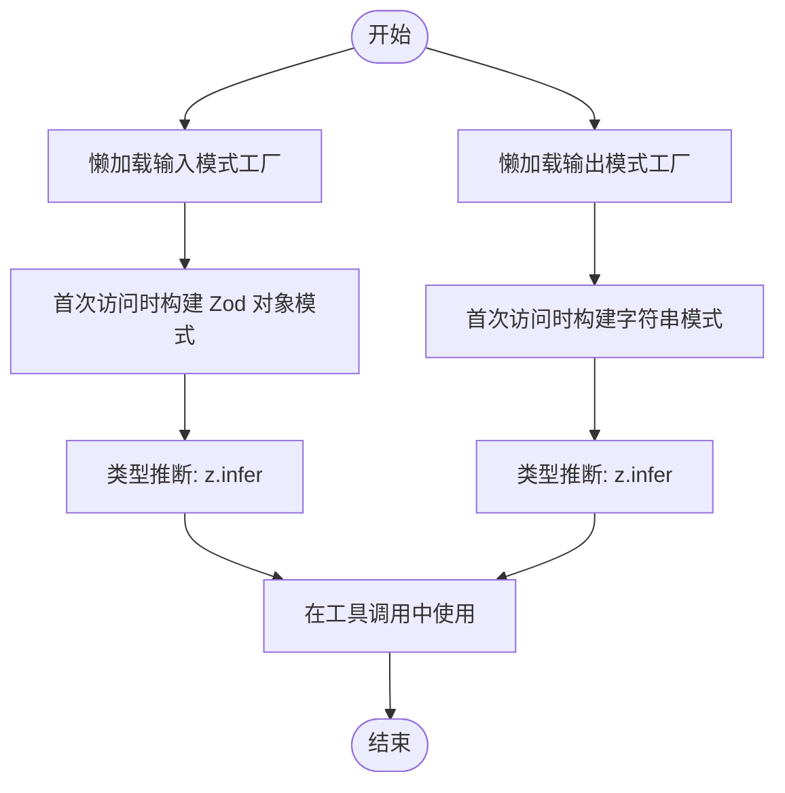
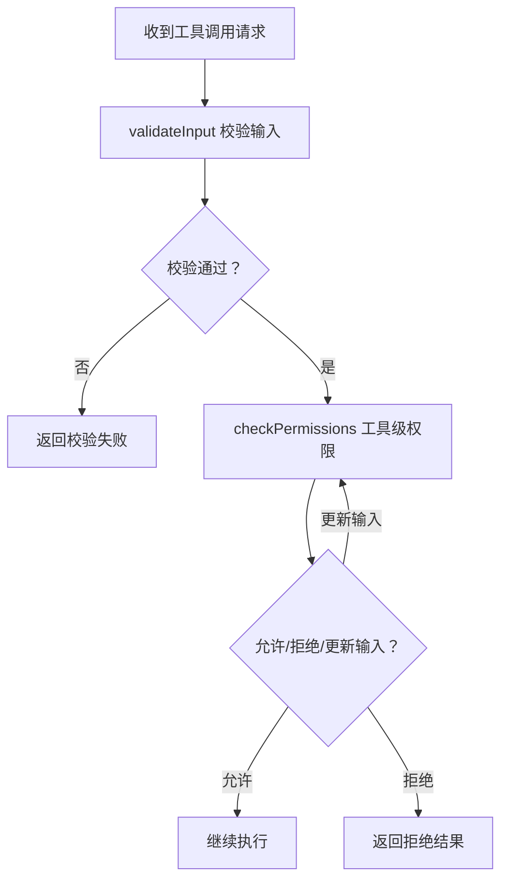
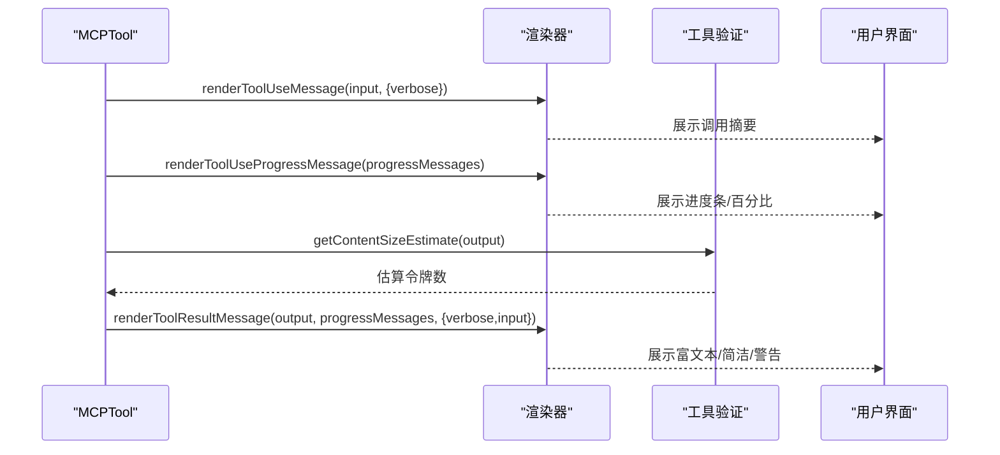
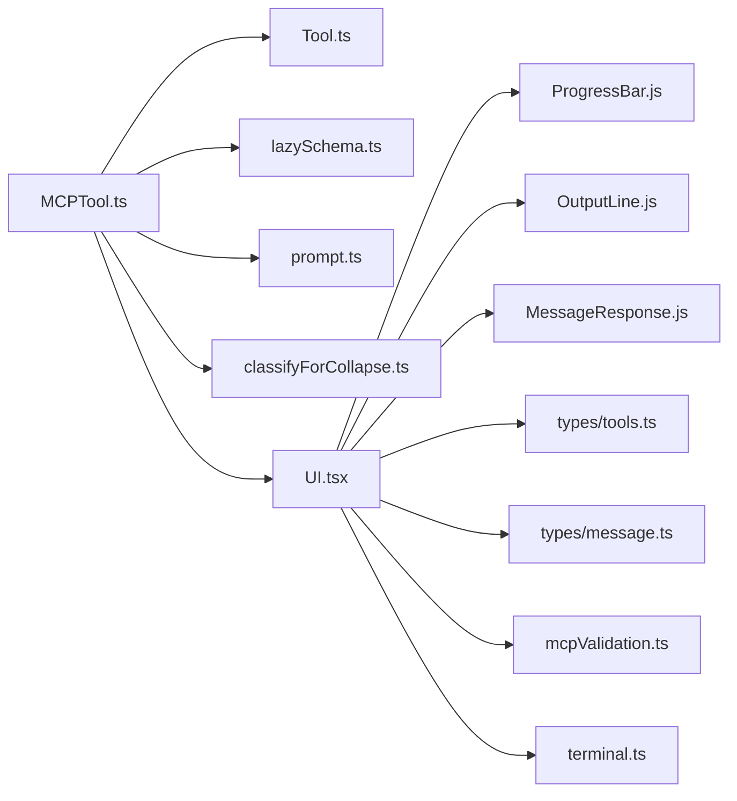

# MCP 工具定义

<cite>
**本文引用的文件**
- [MCPTool.ts](file://tools/MCPTool/MCPTool.ts)
- [UI.tsx](file://tools/MCPTool/UI.tsx)
- [classifyForCollapse.ts](file://tools/MCPTool/classifyForCollapse.ts)
- [prompt.ts](file://tools/MCPTool/prompt.ts)
- [Tool.ts](file://Tool.ts)
- [lazySchema.ts](file://utils/lazySchema.ts)
- [mcpValidation.ts](file://utils/mcpValidation.ts)
- [terminal.ts](file://utils/terminal.ts)
- [types/tools.ts](file://types/tools.ts)
- [types/message.ts](file://types/message.ts)
- [design-system/ProgressBar.js](file://components/design-system/ProgressBar.js)
- [shell/OutputLine.js](file://components/shell/OutputLine.js)
- [MessageResponse.js](file://components/MessageResponse.js)
- [ink.ts](file://ink.ts)
- [ink/stringWidth.ts](file://ink/stringWidth.ts)
- [utils/format.ts](file://utils/format.ts)
- [utils/hyperlink.ts](file://utils/hyperlink.ts)
- [utils/slowOperations.ts](file://utils/slowOperations.ts)
</cite>

## 目录
1. [简介](#简介)
2. [项目结构](#项目结构)
3. [核心组件](#核心组件)
4. [架构总览](#架构总览)
5. [详细组件分析](#详细组件分析)
6. [依赖关系分析](#依赖关系分析)
7. [性能考量](#性能考量)
8. [故障排查指南](#故障排查指南)
9. [结论](#结论)
10. [附录](#附录)

## 简介
本文件系统化阐述 MCP（Model Context Protocol）工具在本仓库中的定义与实现，重点覆盖以下方面：
- MCPTool 接口定义与工具元数据
- 输入/输出模式与类型推断
- 动态属性重写与懒加载模式
- 权限检查机制与提示词策略
- 渲染组件、进度显示与结果映射
- 工具生命周期管理、错误处理与性能优化
- 标准化接口规范与最佳实践

## 项目结构
MCP 工具相关的核心文件位于 tools/MCPTool 目录，并与通用工具框架、UI 组件、类型与工具验证模块协同工作。

**图表来源**
- [MCPTool.ts:1-78](file://tools/MCPTool/MCPTool.ts#L1-L78)
- [UI.tsx:1-403](file://tools/MCPTool/UI.tsx#L1-L403)
- [Tool.ts:362-792](file://Tool.ts#L362-L792)
- [lazySchema.ts:1-9](file://utils/lazySchema.ts#L1-L9)
- [mcpValidation.ts:1-200](file://utils/mcpValidation.ts#L1-L200)
- [terminal.ts:1-200](file://utils/terminal.ts#L1-L200)
- [types/tools.ts:1-200](file://types/tools.ts#L1-L200)
- [types/message.ts:1-200](file://types/message.ts#L1-L200)
- [design-system/ProgressBar.js:1-200](file://components/design-system/ProgressBar.js#L1-L200)
- [shell/OutputLine.js:1-200](file://components/shell/OutputLine.js#L1-L200)
- [MessageResponse.js:1-200](file://components/MessageResponse.js#L1-L200)
- [ink.ts:1-200](file://ink.ts#L1-L200)
- [ink/stringWidth.ts:1-200](file://ink/stringWidth.ts#L1-L200)
- [utils/format.ts:1-200](file://utils/format.ts#L1-L200)
- [utils/hyperlink.ts:1-200](file://utils/hyperlink.ts#L1-L200)
- [utils/slowOperations.ts:1-200](file://utils/slowOperations.ts#L1-L200)

**章节来源**
- [MCPTool.ts:1-78](file://tools/MCPTool/MCPTool.ts#L1-L78)
- [UI.tsx:1-403](file://tools/MCPTool/UI.tsx#L1-L403)
- [Tool.ts:362-792](file://Tool.ts#L362-L792)

## 核心组件
- MCPTool 定义：通过 buildTool 构建，声明 isMcp、名称、描述、提示词、输入/输出模式、权限检查、渲染函数等。
- 懒加载模式：使用 lazySchema 延迟构造输入/输出 Zod 模式，避免模块初始化时的昂贵计算。
- 渲染管线：提供工具调用消息、进度消息与结果消息的三段式渲染，支持富文本与简洁模式切换。
- 折叠分类：对常见 MCP 工具进行“搜索/读取”操作识别，用于 UI 折叠与紧凑展示。
- 提示词与描述：占位符由运行时客户端覆盖，确保工具描述与提示词可按服务器动态注入。

**章节来源**
- [MCPTool.ts:27-77](file://tools/MCPTool/MCPTool.ts#L27-L77)
- [lazySchema.ts:1-9](file://utils/lazySchema.ts#L1-L9)
- [UI.tsx:38-150](file://tools/MCPTool/UI.tsx#L38-L150)
- [classifyForCollapse.ts:1-605](file://tools/MCPTool/classifyForCollapse.ts#L1-L605)
- [prompt.ts:1-4](file://tools/MCPTool/prompt.ts#L1-L4)

## 架构总览
MCP 工具在运行时由 MCP 客户端注入真实名称、描述与提示词，同时保持统一的工具接口与渲染协议。工具调用链路如下：

**图表来源**
- [MCPTool.ts:27-77](file://tools/MCPTool/MCPTool.ts#L27-L77)
- [UI.tsx:38-150](file://tools/MCPTool/UI.tsx#L38-L150)
- [mcpValidation.ts:1-200](file://utils/mcpValidation.ts#L1-L200)
- [terminal.ts:1-200](file://utils/terminal.ts#L1-L200)
- [types/tools.ts:1-200](file://types/tools.ts#L1-L200)
- [types/message.ts:1-200](file://types/message.ts#L1-L200)

## 详细组件分析

### MCPTool 接口与元数据
- 工具标识：isMcp 标记为 MCP 工具；isOpenWorld 固定返回 false，表示非开放世界工具。
- 名称与描述：name、description、prompt 在运行时由 MCP 客户端覆盖，以适配不同服务器与工具变体。
- 用户名：userFacingName 默认回退到工具名，便于 UI 显示。
- 最大结果长度：maxResultSizeChars 控制结果持久化阈值，避免循环读取或过大输出。
- 输入/输出模式：inputSchema 与 outputSchema 使用懒加载工厂，首次访问时才构建 Zod 模式。
- 权限检查：checkPermissions 返回许可结果，允许或拒绝工具执行。
- 截断判定：isResultTruncated 基于终端行截断逻辑判断结果是否需要展开。
- 结果映射：mapToolResultToToolResultBlockParam 将工具输出映射为标准块参数，供上层消费。

**图表来源**
- [Tool.ts:362-792](file://Tool.ts#L362-L792)
- [MCPTool.ts:27-77](file://tools/MCPTool/MCPTool.ts#L27-L77)

**章节来源**
- [MCPTool.ts:27-77](file://tools/MCPTool/MCPTool.ts#L27-L77)
- [Tool.ts:362-792](file://Tool.ts#L362-L792)

### 输入/输出模式与类型推断
- 输入模式：使用 lazySchema 包装的 Zod 对象模式，passthrough 允许任意键，便于 MCP 工具自定义参数结构。
- 输出模式：字符串类型描述，作为 MCP 工具执行结果的统一输出形态。
- 类型推断：通过 z.infer 从懒加载模式中提取输入/输出类型，保证类型安全与运行时一致性。
- 动态属性重写：工具的 name、description、prompt、call 等方法在运行时由 MCP 客户端注入真实实现，确保与服务器一致。

**图表来源**
- [MCPTool.ts:13-25](file://tools/MCPTool/MCPTool.ts#L13-L25)
- [lazySchema.ts:1-9](file://utils/lazySchema.ts#L1-L9)

**章节来源**
- [MCPTool.ts:13-25](file://tools/MCPTool/MCPTool.ts#L13-L25)
- [lazySchema.ts:1-9](file://utils/lazySchema.ts#L1-L9)

### 权限检查机制
- 工具级权限：checkPermissions 返回许可结果，允许或拒绝工具执行。
- 通用权限系统：工具在通过 validateInput 后，再进入工具级权限检查，最终由通用权限模块决定是否弹窗或自动放行。
- 可配置规则：支持基于来源的权限规则（允许/禁止/询问），并可配置绕过权限模式与自动化检查时机。

**图表来源**
- [Tool.ts:489-503](file://Tool.ts#L489-L503)
- [MCPTool.ts:56-61](file://tools/MCPTool/MCPTool.ts#L56-L61)

**章节来源**
- [Tool.ts:489-503](file://Tool.ts#L489-L503)
- [MCPTool.ts:56-61](file://tools/MCPTool/MCPTool.ts#L56-L61)

### 渲染组件、进度显示与结果映射
- 工具调用消息：renderToolUseMessage 将输入参数序列化为简洁/富文本形式，支持非详细模式下的截断。
- 进度消息：renderToolUseProgressMessage 展示进度条与百分比，支持无总数时的计数展示。
- 结果消息：renderToolResultMessage 支持数组内容块（如图片、文本）与 Slack 发送结果的紧凑展示；根据令牌量给出大响应警告。
- 富文本输出：MCPTextOutput 优先尝试“解包文本负载”“扁平 JSON”“原始输出”，在性能与可读性之间权衡。
- 结果映射：mapToolResultToToolResultBlockParam 将输出映射为标准块参数，便于上层消费。

**图表来源**
- [UI.tsx:38-150](file://tools/MCPTool/UI.tsx#L38-L150)
- [mcpValidation.ts:1-200](file://utils/mcpValidation.ts#L1-L200)
- [design-system/ProgressBar.js:1-200](file://components/design-system/ProgressBar.js#L1-L200)
- [shell/OutputLine.js:1-200](file://components/shell/OutputLine.js#L1-L200)
- [MessageResponse.js:1-200](file://components/MessageResponse.js#L1-L200)
- [ink.ts:1-200](file://ink.ts#L1-L200)
- [ink/stringWidth.ts:1-200](file://ink/stringWidth.ts#L1-L200)
- [utils/format.ts:1-200](file://utils/format.ts#L1-L200)
- [utils/hyperlink.ts:1-200](file://utils/hyperlink.ts#L1-L200)
- [utils/slowOperations.ts:1-200](file://utils/slowOperations.ts#L1-L200)

**章节来源**
- [UI.tsx:38-150](file://tools/MCPTool/UI.tsx#L38-L150)
- [mcpValidation.ts:1-200](file://utils/mcpValidation.ts#L1-L200)

### 动态属性重写与懒加载模式
- 动态重写：工具的 name、description、prompt、call 等在运行时由 MCP 客户端注入，确保与服务器一致。
- 懒加载：通过 lazySchema 延迟构建 Zod 模式，避免模块初始化时的昂贵计算，提升启动性能。
- 类型安全：结合 z.infer 与懒加载工厂，既保证类型推断，又避免不必要的模式构建。

**章节来源**
- [MCPTool.ts:27-61](file://tools/MCPTool/MCPTool.ts#L27-L61)
- [lazySchema.ts:1-9](file://utils/lazySchema.ts#L1-L9)

### 工具生命周期管理
- 生命周期阶段：输入校验 → 权限检查 → 渲染调用消息 → 执行工具 → 渲染进度 → 渲染结果 → 结果映射。
- 中断行为：工具可声明中断行为（取消/阻塞），影响新消息提交时的处理策略。
- 并发安全：工具可声明并发安全性，影响调度与资源占用策略。
- 搜索/读取折叠：classifyForCollapse 识别“搜索/读取”类工具，用于 UI 折叠与紧凑展示。

**章节来源**
- [Tool.ts:418-433](file://Tool.ts#L418-L433)
- [classifyForCollapse.ts:1-605](file://tools/MCPTool/classifyForCollapse.ts#L1-L605)

## 依赖关系分析
- 内聚性：MCPTool 将工具定义、渲染、权限、提示词与折叠分类整合在同一模块，内聚度高。
- 耦合性：与通用工具框架 Tool.ts 的耦合通过接口契约实现，与 UI 组件通过渲染函数解耦。
- 外部依赖：依赖 Zod 进行模式校验，依赖 UI 组件库进行进度与输出渲染，依赖工具验证模块进行内容估算与截断判断。

**图表来源**
- [MCPTool.ts:1-78](file://tools/MCPTool/MCPTool.ts#L1-L78)
- [Tool.ts:362-792](file://Tool.ts#L362-L792)
- [lazySchema.ts:1-9](file://utils/lazySchema.ts#L1-L9)
- [prompt.ts:1-4](file://tools/MCPTool/prompt.ts#L1-L4)
- [classifyForCollapse.ts:1-605](file://tools/MCPTool/classifyForCollapse.ts#L1-L605)
- [UI.tsx:1-403](file://tools/MCPTool/UI.tsx#L1-L403)
- [types/tools.ts:1-200](file://types/tools.ts#L1-L200)
- [types/message.ts:1-200](file://types/message.ts#L1-L200)
- [mcpValidation.ts:1-200](file://utils/mcpValidation.ts#L1-L200)
- [terminal.ts:1-200](file://utils/terminal.ts#L1-L200)

**章节来源**
- [MCPTool.ts:1-78](file://tools/MCPTool/MCPTool.ts#L1-L78)
- [Tool.ts:362-792](file://Tool.ts#L362-L792)

## 性能考量
- 懒加载模式：仅在首次访问时构建 Zod 模式，减少初始化开销。
- 输出估算与警告：通过 getContentSizeEstimate 估算令牌数，在超过阈值时提示“大响应”风险，避免上下文溢出。
- 渲染策略：优先“解包文本负载”“扁平 JSON”，在性能与可读性之间平衡；非详细模式下对长输入进行截断。
- 终端截断：isResultTruncated 基于终端行截断逻辑，避免渲染过多内容导致卡顿。

**章节来源**
- [lazySchema.ts:1-9](file://utils/lazySchema.ts#L1-L9)
- [UI.tsx:20-41](file://tools/MCPTool/UI.tsx#L20-L41)
- [mcpValidation.ts:1-200](file://utils/mcpValidation.ts#L1-L200)
- [terminal.ts:1-200](file://utils/terminal.ts#L1-L200)

## 故障排查指南
- 权限被拒：检查 checkPermissions 返回的行为与更新后的输入；确认通用权限系统规则与绕过模式设置。
- 输出过大：关注“大 MCP 响应”警告，必要时调整工具参数或启用分页/筛选。
- 渲染异常：确认渲染函数的输入完整性（部分输入可能在流式过程中到达），以及 UI 组件的可用性。
- 进度缺失：确认工具是否实现了 renderToolUseProgressMessage，以及进度消息的数据结构符合类型要求。

**章节来源**
- [Tool.ts:500-503](file://Tool.ts#L500-L503)
- [UI.tsx:57-90](file://tools/MCPTool/UI.tsx#L57-L90)
- [types/tools.ts:1-200](file://types/tools.ts#L1-L200)
- [types/message.ts:1-200](file://types/message.ts#L1-L200)

## 结论
MCP 工具在本项目中通过统一的工具接口与渲染协议，实现了与多种 MCP 服务器的兼容与扩展。其关键优势包括：
- 动态属性重写与懒加载模式，兼顾灵活性与性能；
- 清晰的权限检查与提示词注入机制；
- 丰富的渲染策略与进度展示，提升用户体验；
- 标准化的结果映射与生命周期管理，便于集成与维护。

建议在实际接入时：
- 明确服务器提供的工具清单与参数约束，合理设计输入/输出模式；
- 配置合适的权限规则与绕过策略；
- 利用折叠分类与渲染策略优化 UI 展示；
- 关注输出大小与性能指标，避免上下文溢出与卡顿。

## 附录

### 标准化接口规范与最佳实践
- 接口规范
  - 必须实现：name、description、prompt、inputSchema、outputSchema、call、checkPermissions、renderToolUseMessage、renderToolUseProgressMessage、renderToolResultMessage、mapToolResultToToolResultBlockParam。
  - 可选实现：isSearchOrReadCommand、isResultTruncated、getActivityDescription、toAutoClassifierInput 等。
- 最佳实践
  - 使用 lazySchema 延迟构建模式，避免初始化开销。
  - 在运行时注入真实名称与描述，确保与服务器一致。
  - 合理设置 maxResultSizeChars，防止循环读取与过大输出。
  - 优先实现富文本渲染策略，提供简洁模式下的可读性保障。
  - 明确权限检查与输入校验流程，确保安全可控。

**章节来源**
- [Tool.ts:362-792](file://Tool.ts#L362-L792)
- [MCPTool.ts:27-77](file://tools/MCPTool/MCPTool.ts#L27-L77)