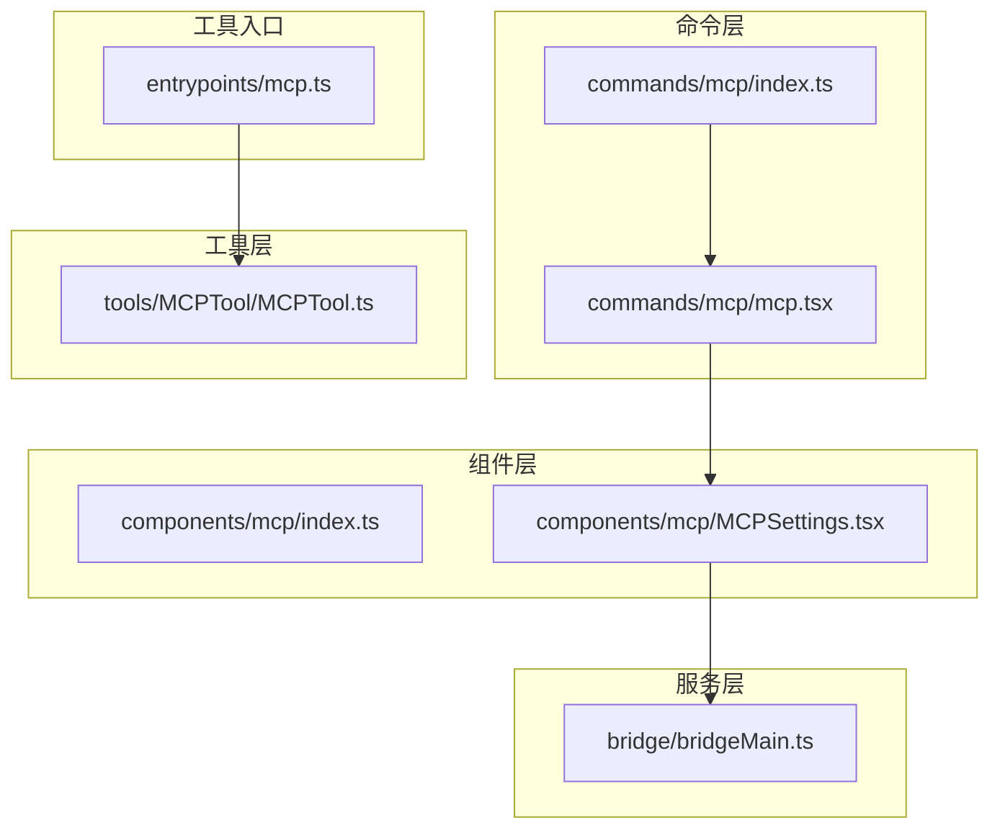
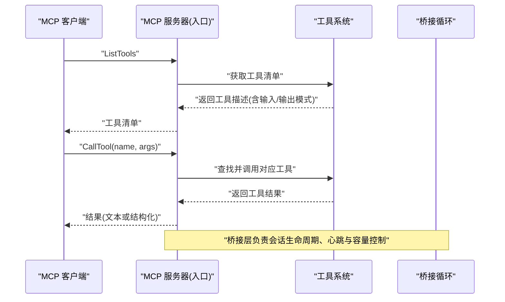
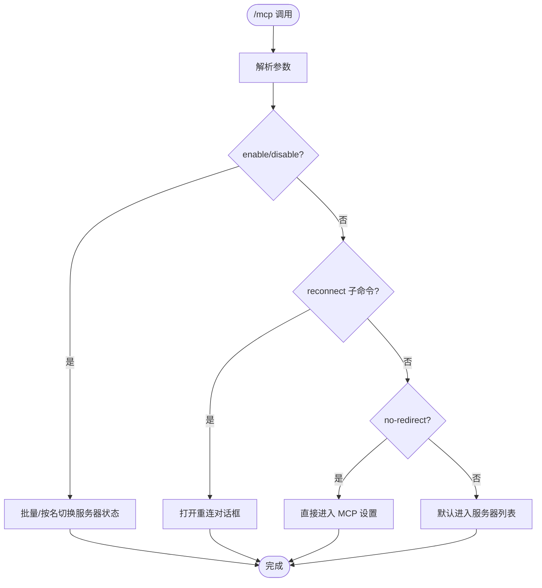
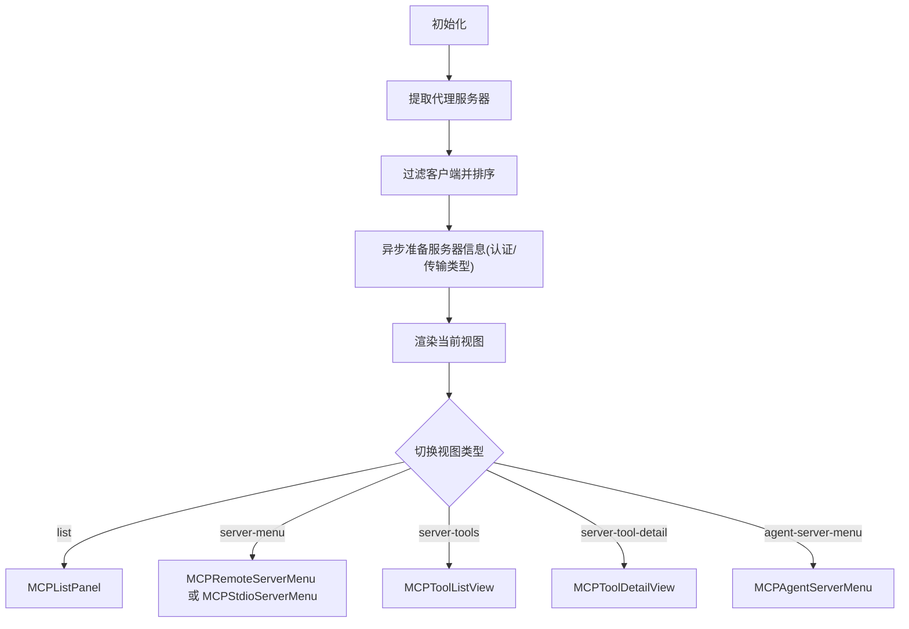
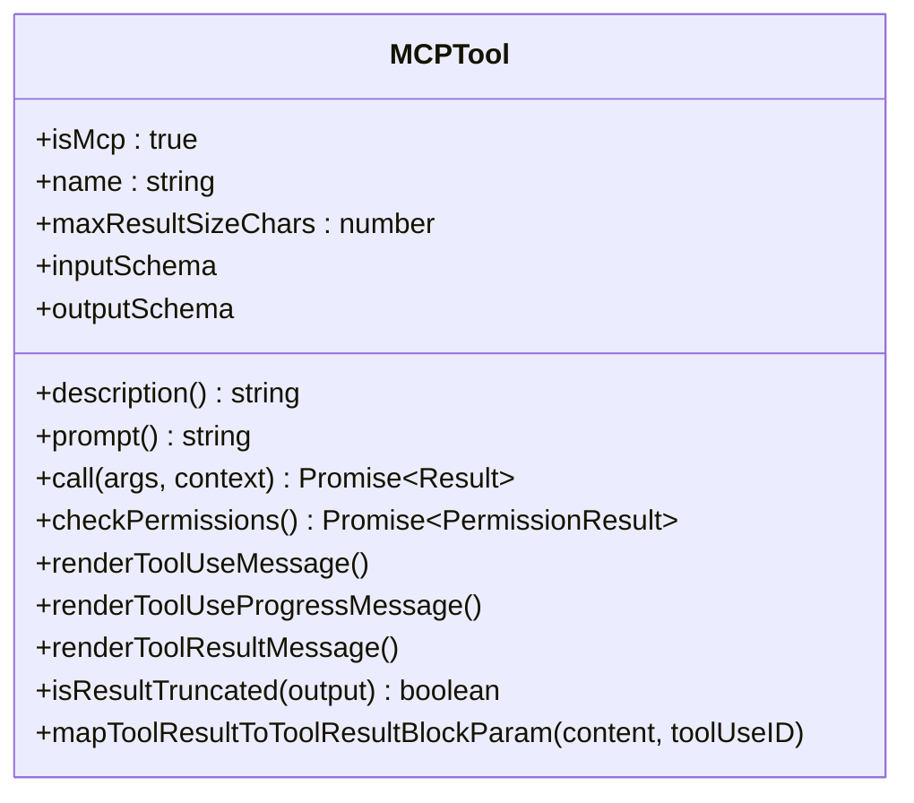
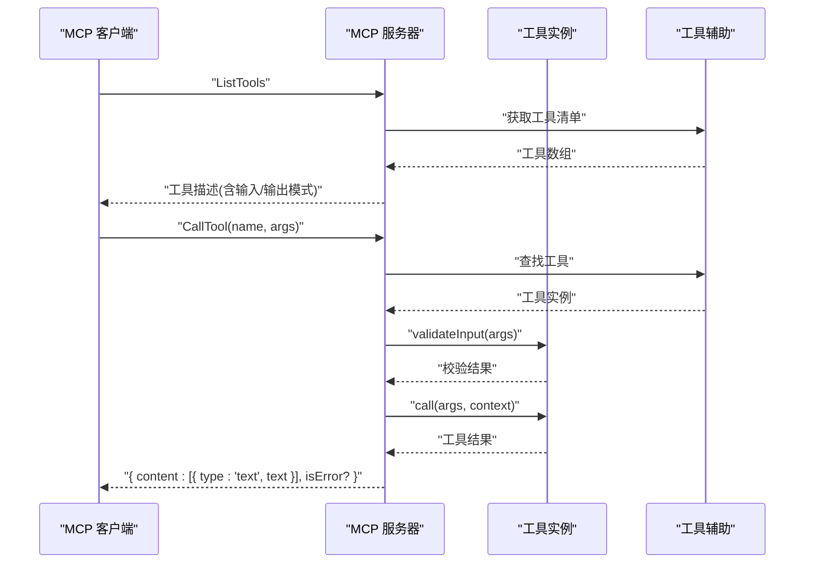
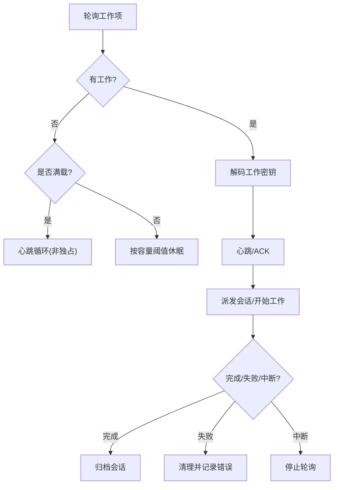
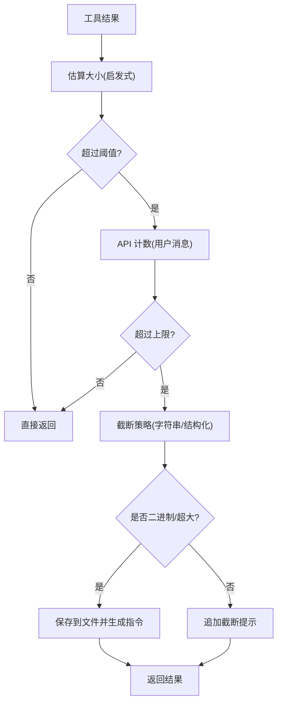
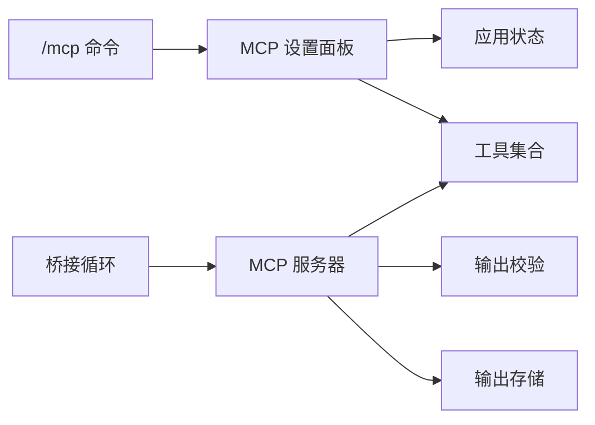

# MCP 工具集成

<cite>
**本文档引用的文件**
- [commands/mcp/index.ts](file://commands/mcp/index.ts)
- [commands/mcp/mcp.tsx](file://commands/mcp/mcp.tsx)
- [components/mcp/index.ts](file://components/mcp/index.ts)
- [components/mcp/MCPSettings.tsx](file://components/mcp/MCPSettings.tsx)
- [bridge/bridgeMain.ts](file://bridge/bridgeMain.ts)
- [entrypoints/mcp.ts](file://entrypoints/mcp.ts)
- [tools/MCPTool/MCPTool.ts](file://tools/MCPTool/MCPTool.ts)
- [utils/mcpValidation.ts](file://utils/mcpValidation.ts)
- [utils/mcpOutputStorage.ts](file://utils/mcpOutputStorage.ts)
</cite>

## 目录
1. [简介](#简介)
2. [项目结构](#项目结构)
3. [核心组件](#核心组件)
4. [架构总览](#架构总览)
5. [详细组件分析](#详细组件分析)
6. [依赖关系分析](#依赖关系分析)
7. [性能考虑](#性能考虑)
8. [故障排除指南](#故障排除指南)
9. [结论](#结论)
10. [附录](#附录)

## 简介
本文件系统性阐述 Claude Code 中的 MCP（Model Context Protocol）工具集成，覆盖 MCP 工具的定义、注册与调用机制，参数传递与结果处理、错误管理，权限控制与安全验证、资源限制，以及工具链组合、并行执行与结果聚合等主题。同时给出开发指南、最佳实践、性能优化、缓存策略与并发控制建议，并解释 MCP 工具与 Claude Code 工具系统的统一集成架构。

## 项目结构
MCP 工具相关能力分布在命令层、组件层、服务层与工具层：
- 命令层：提供 /mcp 命令入口，负责交互式服务器与工具列表管理
- 组件层：提供 MCP 设置面板、服务器菜单、工具列表与详情视图
- 服务层：桥接逻辑、连接管理、状态与日志
- 工具层：MCP 工具抽象与具体实现
- 工具入口：独立 MCP 服务器进程，暴露工具清单与调用接口

**图表来源**
- [commands/mcp/index.ts:1-13](file://commands/mcp/index.ts#L1-L13)
- [commands/mcp/mcp.tsx:1-85](file://commands/mcp/mcp.tsx#L1-L85)
- [components/mcp/index.ts:1-10](file://components/mcp/index.ts#L1-L10)
- [components/mcp/MCPSettings.tsx:1-398](file://components/mcp/MCPSettings.tsx#L1-L398)
- [bridge/bridgeMain.ts:1-800](file://bridge/bridgeMain.ts#L1-L800)
- [entrypoints/mcp.ts:1-197](file://entrypoints/mcp.ts#L1-L197)
- [tools/MCPTool/MCPTool.ts:1-78](file://tools/MCPTool/MCPTool.ts#L1-L78)

**章节来源**
- [commands/mcp/index.ts:1-13](file://commands/mcp/index.ts#L1-L13)
- [commands/mcp/mcp.tsx:1-85](file://commands/mcp/mcp.tsx#L1-L85)
- [components/mcp/index.ts:1-10](file://components/mcp/index.ts#L1-L10)
- [components/mcp/MCPSettings.tsx:1-398](file://components/mcp/MCPSettings.tsx#L1-L398)
- [bridge/bridgeMain.ts:1-800](file://bridge/bridgeMain.ts#L1-L800)
- [entrypoints/mcp.ts:1-197](file://entrypoints/mcp.ts#L1-L197)
- [tools/MCPTool/MCPTool.ts:1-78](file://tools/MCPTool/MCPTool.ts#L1-L78)

## 核心组件
- MCP 命令与 UI
  - /mcp 命令入口与参数解析，支持启用/禁用服务器、重连、跳转到插件设置页等
  - MCP 设置面板：展示服务器列表、认证状态、工具清单与详情
- MCP 工具抽象
  - 定义输入/输出模式、权限检查、截断策略、消息渲染等
- MCP 服务器入口
  - 暴露 ListTools 与 CallTool 请求处理器，将 Claude Code 工具映射为 MCP 工具
- 桥接与运行时
  - 桥接循环、心跳、会话管理、容量唤醒、超时与错误处理
- 输出校验与存储
  - 内容大小估算、令牌上限、截断与二进制持久化

**章节来源**
- [commands/mcp/mcp.tsx:63-84](file://commands/mcp/mcp.tsx#L63-L84)
- [components/mcp/MCPSettings.tsx:21-398](file://components/mcp/MCPSettings.tsx#L21-L398)
- [tools/MCPTool/MCPTool.ts:27-78](file://tools/MCPTool/MCPTool.ts#L27-L78)
- [entrypoints/mcp.ts:35-197](file://entrypoints/mcp.ts#L35-L197)
- [bridge/bridgeMain.ts:141-800](file://bridge/bridgeMain.ts#L141-L800)
- [utils/mcpValidation.ts:14-209](file://utils/mcpValidation.ts#L14-L209)
- [utils/mcpOutputStorage.ts:13-190](file://utils/mcpOutputStorage.ts#L13-L190)

## 架构总览
MCP 集成采用“本地 MCP 服务器 + Claude Code 工具系统”的统一架构：
- 本地 MCP 服务器进程通过 STDIO 传输与客户端通信
- 服务器将 Claude Code 工具转换为 MCP 工具，提供统一的工具清单与调用协议
- 桥接层负责多会话、心跳、容量控制与错误恢复
- 输出侧提供令牌计数、截断与大体积内容的文件落盘与指令提示

**图表来源**
- [entrypoints/mcp.ts:59-188](file://entrypoints/mcp.ts#L59-L188)
- [bridge/bridgeMain.ts:141-780](file://bridge/bridgeMain.ts#L141-L780)

**章节来源**
- [entrypoints/mcp.ts:35-197](file://entrypoints/mcp.ts#L35-L197)
- [bridge/bridgeMain.ts:141-800](file://bridge/bridgeMain.ts#L141-L800)

## 详细组件分析

### 命令与 UI：/mcp 交互
- 参数解析
  - enable/disable：批量或按名称启用/禁用 MCP 服务器
  - reconnect：触发指定服务器的重连流程
  - no-redirect：绕过重定向，直接进入 MCP 设置界面
- 视图切换
  - 列表视图：展示所有可用服务器与代理服务器
  - 服务器菜单：根据传输类型（STDIO/HTTP/SSE/Claude AI Proxy）显示不同操作
  - 工具列表与详情：按服务器筛选工具，查看工具描述与参数
- 状态与认证
  - 对 HTTP/SSE 服务器进行认证状态检测，结合会话令牌与工具可用性判断是否已认证

**图表来源**
- [commands/mcp/mcp.tsx:63-84](file://commands/mcp/mcp.tsx#L63-L84)

**章节来源**
- [commands/mcp/mcp.tsx:1-85](file://commands/mcp/mcp.tsx#L1-L85)

### MCP 设置面板：服务器与工具管理
- 服务器信息准备
  - 过滤非 IDE 客户端，区分传输类型，计算认证状态
  - 对 Claude AI Proxy 类型服务器标记为未认证（由后端处理）
- 视图状态
  - 列表、服务器菜单、工具列表、工具详情、代理服务器菜单
- 默认标签页
  - STDIO 服务器默认进入“Claude Code”标签；Claude AI Proxy 默认“claude.ai”

**图表来源**
- [components/mcp/MCPSettings.tsx:46-384](file://components/mcp/MCPSettings.tsx#L46-L384)

**章节来源**
- [components/mcp/MCPSettings.tsx:1-398](file://components/mcp/MCPSettings.tsx#L1-L398)

### MCP 工具抽象：定义、权限与渲染
- 输入/输出模式
  - 输入模式允许任意对象（MCP 工具自定义 Schema），输出为字符串
- 权限检查
  - 返回“放行”策略与提示信息，实际权限由上层工具系统判定
- 截断策略
  - 基于终端行截断检测，避免超长输出
- 渲染
  - 提供工具使用消息、进度消息与结果消息的渲染函数
- 名称与描述
  - 名称与描述在运行时由 MCP 客户端覆盖，以反映真实工具

**图表来源**
- [tools/MCPTool/MCPTool.ts:27-78](file://tools/MCPTool/MCPTool.ts#L27-L78)

**章节来源**
- [tools/MCPTool/MCPTool.ts:1-78](file://tools/MCPTool/MCPTool.ts#L1-L78)

### MCP 服务器入口：工具注册与调用
- 服务器初始化
  - 创建 MCP 服务器实例，声明工具能力
- ListTools 处理器
  - 获取工具清单，转换输入/输出 Schema（仅支持根级 object 的输出 Schema）
  - 将工具描述与 prompt 作为工具说明返回
- CallTool 处理器
  - 查找工具并构造工具使用上下文（含命令、工具集、模型、调试开关等）
  - 执行输入校验、工具调用与结果封装
  - 错误捕获并返回 isError 标记与错误文本

**图表来源**
- [entrypoints/mcp.ts:59-188](file://entrypoints/mcp.ts#L59-L188)

**章节来源**
- [entrypoints/mcp.ts:1-197](file://entrypoints/mcp.ts#L1-L197)

### 桥接循环：会话、心跳与容量控制
- 会话管理
  - 维护活跃会话、工作项、兼容会话 ID、入站令牌、定时器与清理任务
- 心跳与认证
  - 定期向服务器发送心跳；若出现 401/403，触发 requeue 重新派发
- 容量与睡眠唤醒
  - 在满载时采用“非独占心跳”模式，通过容量唤醒信号提前结束休眠以接受新工作
- 超时与中断
  - 超时看门狗标记会话为失败；在关闭或中断时分别走不同的清理路径
- 日志与诊断
  - 记录连接断开、重新连接、会话完成、失败原因等事件

**图表来源**
- [bridge/bridgeMain.ts:141-780](file://bridge/bridgeMain.ts#L141-L780)

**章节来源**
- [bridge/bridgeMain.ts:141-800](file://bridge/bridgeMain.ts#L141-L800)

### 输出校验与存储：令牌限制与大体积内容
- 令牌上限
  - 支持环境变量与特性开关配置最大 MCP 输出令牌数，默认 25000
  - 使用启发式估算与 API 计数双重策略判断是否需要截断
- 截断策略
  - 字符串：按字符数截断并附加截断提示
  - 结构化内容：逐块评估，优先保留文本块，图片块尝试压缩以适配剩余预算
- 大体积内容落盘
  - 二进制内容按 MIME 推导扩展名写入工具结果目录
  - 生成可读指令，指导用户使用偏移/限制参数分段读取与查询

**图表来源**
- [utils/mcpValidation.ts:59-178](file://utils/mcpValidation.ts#L59-L178)
- [utils/mcpOutputStorage.ts:39-190](file://utils/mcpOutputStorage.ts#L39-L190)

**章节来源**
- [utils/mcpValidation.ts:1-209](file://utils/mcpValidation.ts#L1-L209)
- [utils/mcpOutputStorage.ts:1-190](file://utils/mcpOutputStorage.ts#L1-L190)

## 依赖关系分析
- 命令与组件
  - /mcp 命令加载 MCP 设置组件，后者依赖应用状态与工具集合
- 服务器与工具
  - MCP 服务器从工具系统获取工具清单，转换 Schema 并执行调用
- 桥接与服务器
  - 桥接循环负责会话生命周期，MCP 服务器通过 STDIO 与客户端交互
- 输出与存储
  - 输出校验模块与存储模块共同保障大体积内容的可读性与合规性

**图表来源**
- [commands/mcp/mcp.tsx:1-85](file://commands/mcp/mcp.tsx#L1-L85)
- [components/mcp/MCPSettings.tsx:1-398](file://components/mcp/MCPSettings.tsx#L1-L398)
- [entrypoints/mcp.ts:1-197](file://entrypoints/mcp.ts#L1-L197)
- [bridge/bridgeMain.ts:141-800](file://bridge/bridgeMain.ts#L141-L800)
- [utils/mcpValidation.ts:1-209](file://utils/mcpValidation.ts#L1-L209)
- [utils/mcpOutputStorage.ts:1-190](file://utils/mcpOutputStorage.ts#L1-L190)

**章节来源**
- [commands/mcp/mcp.tsx:1-85](file://commands/mcp/mcp.tsx#L1-L85)
- [components/mcp/MCPSettings.tsx:1-398](file://components/mcp/MCPSettings.tsx#L1-L398)
- [entrypoints/mcp.ts:1-197](file://entrypoints/mcp.ts#L1-L197)
- [bridge/bridgeMain.ts:141-800](file://bridge/bridgeMain.ts#L141-L800)
- [utils/mcpValidation.ts:1-209](file://utils/mcpValidation.ts#L1-L209)
- [utils/mcpOutputStorage.ts:1-190](file://utils/mcpOutputStorage.ts#L1-L190)

## 性能考虑
- 缓存策略
  - MCP 服务器对文件状态读取使用 LRU 缓存，限制数量与内存占用，避免无界增长
- 令牌与截断
  - 启发式估算先行，再用 API 精确计数，减少不必要的 API 调用
- 并发与容量
  - 桥接循环在满载时采用非独占心跳，配合容量唤醒，提升吞吐与响应速度
- 大体积内容
  - 二进制与超大文本优先落盘，避免污染模型上下文，同时提供分段读取指令

**章节来源**
- [entrypoints/mcp.ts:40-46](file://entrypoints/mcp.ts#L40-L46)
- [utils/mcpValidation.ts:14-47](file://utils/mcpValidation.ts#L14-L47)
- [bridge/bridgeMain.ts:640-740](file://bridge/bridgeMain.ts#L640-L740)
- [utils/mcpOutputStorage.ts:148-174](file://utils/mcpOutputStorage.ts#L148-L174)

## 故障排除指南
- 认证失败
  - 心跳阶段若收到 401/403，桥接循环会触发 requeue 重新派发；检查服务器凭据与会话令牌
- 服务器不可达
  - 断线后自动重连并记录断开时长；确认网络与服务器可达性
- 工具调用异常
  - MCP 服务器捕获工具调用错误，返回 isError 标记与错误文本；检查工具输入与权限
- 输出过大
  - 自动截断或落盘；遵循指令使用偏移/限制参数分段读取，必要时使用查询工具

**章节来源**
- [bridge/bridgeMain.ts:202-270](file://bridge/bridgeMain.ts#L202-L270)
- [entrypoints/mcp.ts:170-188](file://entrypoints/mcp.ts#L170-L188)
- [utils/mcpValidation.ts:151-178](file://utils/mcpValidation.ts#L151-L178)
- [utils/mcpOutputStorage.ts:39-59](file://utils/mcpOutputStorage.ts#L39-L59)

## 结论
本集成以 MCP 服务器为桥梁，将 Claude Code 工具系统无缝暴露给外部 MCP 客户端，实现了统一的工具定义、注册与调用协议。通过严格的权限控制、安全验证、资源限制与输出管理，确保在复杂场景下的稳定性与可扩展性。桥接层提供的会话管理、心跳与容量控制进一步提升了并发与可靠性。开发与运维团队可据此构建健壮的工具链组合与并行执行方案。

## 附录
- 开发指南与最佳实践
  - 工具 Schema 设计：输出根节点保持 object，避免 union/oneOf 导致 MCP 不兼容
  - 输入校验：在工具内部实现 validateInput，确保参数合法性
  - 权限控制：结合 checkPermissions 与上层权限判定，最小授权原则
  - 输出策略：优先小文本直接返回，超大/二进制内容落盘并提供分段读取指令
  - 并发控制：合理设置最大会话数与心跳间隔，利用容量唤醒机制提升吞吐
- 与 Claude Code 工具系统的统一集成
  - MCP 服务器将工具清单与调用映射到 Claude Code 工具体系，共享权限、消息与上下文能力