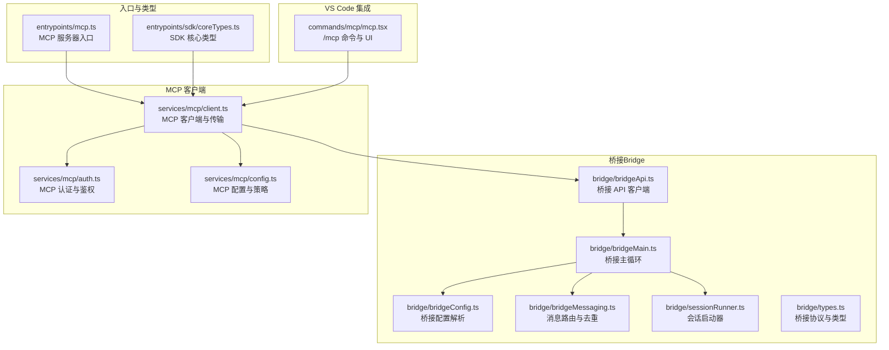
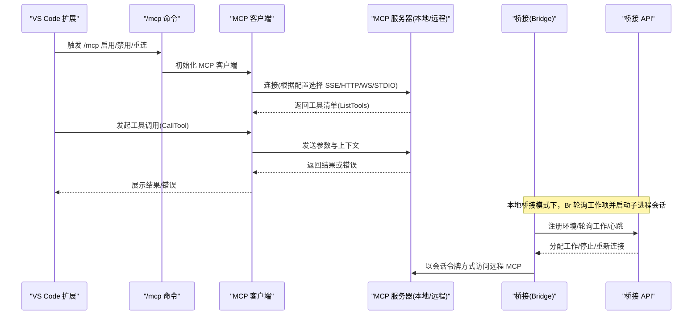
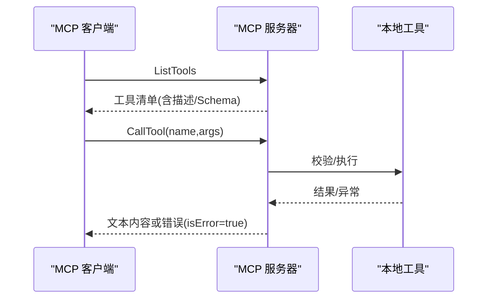
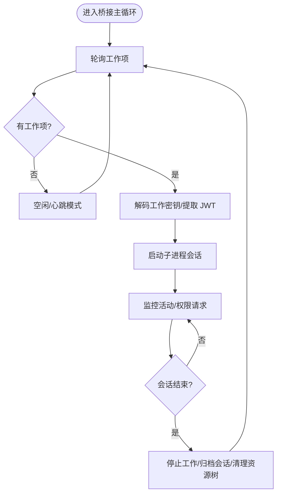
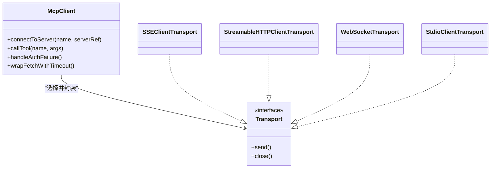
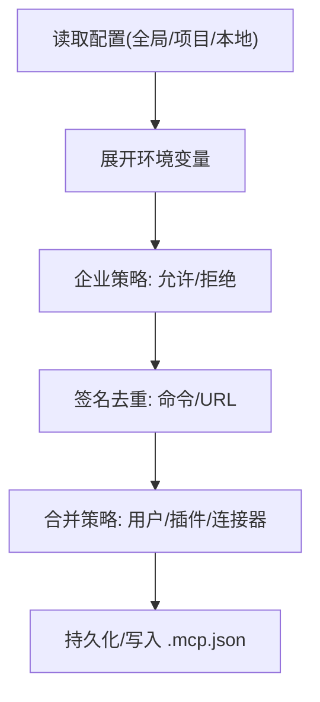
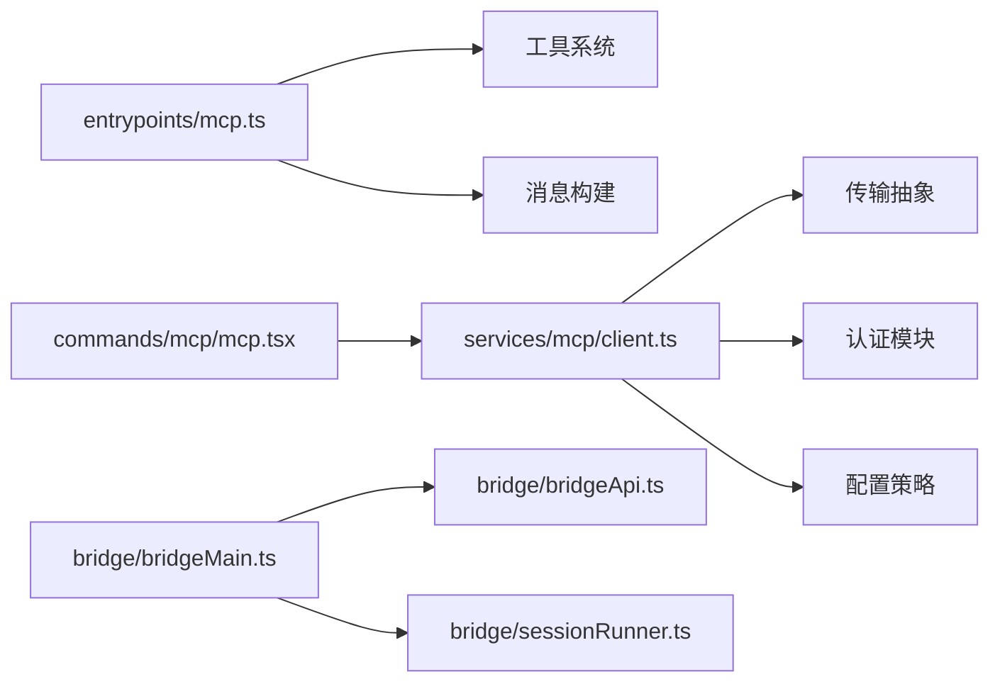

# MCP SDK 开发

<cite>
**本文档引用的文件**
- [entrypoints/mcp.ts](file://entrypoints/mcp.ts)
- [bridge/types.ts](file://bridge/types.ts)
- [bridge/bridgeMain.ts](file://bridge/bridgeMain.ts)
- [bridge/bridgeApi.ts](file://bridge/bridgeApi.ts)
- [bridge/sessionRunner.ts](file://bridge/sessionRunner.ts)
- [bridge/bridgeConfig.ts](file://bridge/bridgeConfig.ts)
- [bridge/bridgeMessaging.ts](file://bridge/bridgeMessaging.ts)
- [services/mcp/client.ts](file://services/mcp/client.ts)
- [services/mcp/config.ts](file://services/mcp/config.ts)
- [services/mcp/auth.ts](file://services/mcp/auth.ts)
- [entrypoints/sdk/coreTypes.ts](file://entrypoints/sdk/coreTypes.ts)
- [commands/mcp/mcp.tsx](file://commands/mcp/mcp.tsx)
</cite>

## 目录
1. [简介](#简介)
2. [项目结构](#项目结构)
3. [核心组件](#核心组件)
4. [架构总览](#架构总览)
5. [详细组件分析](#详细组件分析)
6. [依赖关系分析](#依赖关系分析)
7. [性能考虑](#性能考虑)
8. [故障排除指南](#故障排除指南)
9. [结论](#结论)
10. [附录](#附录)

## 简介
本文件面向 MCP SDK 开发者，系统性阐述 Claude Code 生态中的 MCP（Model Context Protocol）能力：从本地 MCP 服务器到远程桥接（Bridge）会话、从 VS Code 扩展集成到类型定义与配置管理，覆盖初始化流程、连接建立、状态管理、通信协议、消息格式与错误处理，并提供使用示例、最佳实践与性能优化建议。

## 项目结构
该仓库围绕“CLI + SDK + 桥接 + 服务端 MCP”四层组织：
- 入口与 SDK 类型：entrypoints 下提供 MCP 服务器入口与 SDK 核心类型导出
- 桥接（Bridge）：负责本地进程生命周期、工作项轮询、心跳、权限控制与会话状态管理
- MCP 客户端：统一接入远端/本地 MCP 服务器，抽象多种传输（HTTP/SSE/WebSocket/STDIO）
- 配置与策略：企业级允许/拒绝列表、环境变量展开、去重与合并策略
- VS Code 扩展集成：命令入口与 UI 组件，支持启用/禁用、重连与设置面板

**图表来源**
- [entrypoints/mcp.ts:35-196](file://entrypoints/mcp.ts#L35-L196)
- [bridge/bridgeMain.ts:141-800](file://bridge/bridgeMain.ts#L141-L800)
- [bridge/bridgeApi.ts:68-452](file://bridge/bridgeApi.ts#L68-L452)
- [bridge/sessionRunner.ts:248-551](file://bridge/sessionRunner.ts#L248-L551)
- [bridge/bridgeMessaging.ts:132-462](file://bridge/bridgeMessaging.ts#L132-L462)
- [bridge/bridgeConfig.ts:17-49](file://bridge/bridgeConfig.ts#L17-L49)
- [bridge/types.ts:81-263](file://bridge/types.ts#L81-L263)
- [services/mcp/client.ts:595-800](file://services/mcp/client.ts#L595-L800)
- [services/mcp/config.ts:536-551](file://services/mcp/config.ts#L536-L551)
- [services/mcp/auth.ts:1-200](file://services/mcp/auth.ts#L1-L200)
- [entrypoints/sdk/coreTypes.ts:11-63](file://entrypoints/sdk/coreTypes.ts#L11-L63)
- [commands/mcp/mcp.tsx:63-85](file://commands/mcp/mcp.tsx#L63-L85)

**章节来源**
- [entrypoints/mcp.ts:35-196](file://entrypoints/mcp.ts#L35-L196)
- [bridge/bridgeMain.ts:141-800](file://bridge/bridgeMain.ts#L141-L800)
- [bridge/bridgeApi.ts:68-452](file://bridge/bridgeApi.ts#L68-L452)
- [bridge/sessionRunner.ts:248-551](file://bridge/sessionRunner.ts#L248-L551)
- [bridge/bridgeMessaging.ts:132-462](file://bridge/bridgeMessaging.ts#L132-L462)
- [bridge/bridgeConfig.ts:17-49](file://bridge/bridgeConfig.ts#L17-L49)
- [bridge/types.ts:81-263](file://bridge/types.ts#L81-L263)
- [services/mcp/client.ts:595-800](file://services/mcp/client.ts#L595-L800)
- [services/mcp/config.ts:536-551](file://services/mcp/config.ts#L536-L551)
- [services/mcp/auth.ts:1-200](file://services/mcp/auth.ts#L1-L200)
- [entrypoints/sdk/coreTypes.ts:11-63](file://entrypoints/sdk/coreTypes.ts#L11-L63)
- [commands/mcp/mcp.tsx:63-85](file://commands/mcp/mcp.tsx#L63-L85)

## 核心组件
- MCP 服务器入口：基于 MCP SDK Server，提供 ListTools 与 CallTool 能力，将本地工具暴露给 MCP 客户端
- 桥接（Bridge）：负责注册环境、轮询工作项、心跳、会话生命周期管理、权限控制与日志输出
- MCP 客户端：统一抽象多种传输（SSE/HTTP/WebSocket/STDIO），处理认证、超时、去重、错误分类与缓存
- 配置与策略：支持企业级允许/拒绝列表、环境变量展开、签名去重、多源合并与持久化
- VS Code 集成：/mcp 命令入口，支持启用/禁用、重连与设置面板，适配不同用户类型

**章节来源**
- [entrypoints/mcp.ts:35-196](file://entrypoints/mcp.ts#L35-L196)
- [bridge/bridgeMain.ts:141-800](file://bridge/bridgeMain.ts#L141-L800)
- [services/mcp/client.ts:595-800](file://services/mcp/client.ts#L595-L800)
- [services/mcp/config.ts:536-551](file://services/mcp/config.ts#L536-L551)
- [commands/mcp/mcp.tsx:63-85](file://commands/mcp/mcp.tsx#L63-L85)

## 架构总览
下图展示 MCP SDK 在本地与远程场景下的整体交互：本地 MCP 服务器通过 STDIO 对接；远程 MCP 通过 SSE/HTTP/WebSocket 接入；桥接负责在本地与云端之间协调会话、权限与心跳。

**图表来源**
- [services/mcp/client.ts:595-800](file://services/mcp/client.ts#L595-L800)
- [bridge/bridgeMain.ts:141-800](file://bridge/bridgeMain.ts#L141-L800)
- [bridge/bridgeApi.ts:141-452](file://bridge/bridgeApi.ts#L141-L452)
- [commands/mcp/mcp.tsx:63-85](file://commands/mcp/mcp.tsx#L63-L85)

## 详细组件分析

### MCP 服务器入口（本地 STDIO）
- 功能要点
  - 创建 MCP Server，声明 capabilities（工具能力）
  - 注册 ListTools 请求处理器：动态生成工具描述、输入/输出 Schema（Zod 到 JSON Schema 转换）
  - 注册 CallTool 请求处理器：校验输入、执行工具、返回文本内容；异常转为 isError 结果
  - 使用 StdioServerTransport 建立 STDIO 通道
- 关键流程
  - 工具发现：通过 getTools 与 getEmptyToolPermissionContext 获取可用工具
  - Schema 转换：对输出 Schema 做根层级限制（仅 object），过滤 union/discriminatedUnion
  - 错误处理：捕获异常并记录日志，构造标准化错误响应
- 性能与健壮性
  - LRU 缓存 readFileState，避免内存无限增长
  - 严格校验输入与工具启用状态，减少无效调用

**图表来源**
- [entrypoints/mcp.ts:59-196](file://entrypoints/mcp.ts#L59-L196)

**章节来源**
- [entrypoints/mcp.ts:35-196](file://entrypoints/mcp.ts#L35-L196)

### 桥接（Bridge）：轮询、心跳与会话管理
- 功能要点
  - 注册环境、轮询工作项、确认工作、停止工作、注销环境
  - 心跳保活：对活动会话定期发送心跳，处理 401/403 重连
  - 会话生命周期：spawn、监控活动、完成归档、清理资源树
  - 权限控制：转发 control_request，发送 control_response
  - 日志与状态：实时更新状态栏、会话计数、活动摘要
- 关键流程
  - 轮询空闲：在容量满载时采用非独占心跳模式，降低请求频率
  - 会话结束：区分超时中断与正常完成，分别记录失败/成功
  - 重连策略：JWT 过期触发 server-side re-dispatch，避免静默死亡
- 错误处理
  - BridgeFatalError：401/403/404/410 等致命错误，区分过期与权限不足
  - 可抑制 403：某些操作（如 StopWork）的 403 可被抑制不提示

**图表来源**
- [bridge/bridgeMain.ts:141-800](file://bridge/bridgeMain.ts#L141-L800)
- [bridge/bridgeApi.ts:199-452](file://bridge/bridgeApi.ts#L199-L452)
- [bridge/sessionRunner.ts:248-551](file://bridge/sessionRunner.ts#L248-L551)

**章节来源**
- [bridge/bridgeMain.ts:141-800](file://bridge/bridgeMain.ts#L141-L800)
- [bridge/bridgeApi.ts:68-452](file://bridge/bridgeApi.ts#L68-L452)
- [bridge/sessionRunner.ts:248-551](file://bridge/sessionRunner.ts#L248-L551)

### MCP 客户端：传输抽象与认证
- 功能要点
  - 传输选择：SSE、HTTP、WebSocket、STDIO；IDE 特殊类型（sse-ide、ws-ide）
  - 认证与鉴权：ClaudeAuthProvider、OAuth 自动刷新、401 重试、代理与 TLS 支持
  - 超时与 Accept 头：针对 MCP Streamable HTTP 规范，保证 Accept 头存在
  - 结果处理：工具调用结果标准化，错误携带 _meta 元数据
- 关键流程
  - 连接缓存：按 serverRef 生成缓存键，memoize 提升并发性能
  - 步进检测：wrapFetchWithStepUpDetection 捕捉需要提升授权的场景
  - 会话过期：识别 JSON-RPC -32001（Session not found）并清理连接缓存
- 错误处理
  - McpAuthError：认证失败，标记 needs-auth 并写入缓存
  - McpSessionExpiredError：会话过期，要求重新获取客户端后重试

**图表来源**
- [services/mcp/client.ts:595-800](file://services/mcp/client.ts#L595-L800)
- [services/mcp/auth.ts:1-200](file://services/mcp/auth.ts#L1-L200)

**章节来源**
- [services/mcp/client.ts:595-800](file://services/mcp/client.ts#L595-L800)
- [services/mcp/auth.ts:1-200](file://services/mcp/auth.ts#L1-L200)

### 配置与策略：企业级管控
- 功能要点
  - 允许/拒绝列表：支持名称、命令数组、URL 模式三类条目，支持通配符
  - 策略合并：多源设置合并，denylist 优先于 allowlist
  - 环境变量展开：字符串中支持 ${VAR} 展开，缺失变量可收集告警
  - 签名去重：基于命令/URL 的签名去重，避免重复加载相同服务器
  - 持久化：.mcp.json 写入采用原子 rename，保留文件权限
- 关键流程
  - 添加服务器：校验名称、保留名、企业配置独占、策略检查、写入目标作用域
  - 移除服务器：按作用域定位并写回
  - 远程 URL 解包：支持 CCR 代理路径，还原原始供应商 URL

**图表来源**
- [services/mcp/config.ts:536-551](file://services/mcp/config.ts#L536-L551)

**章节来源**
- [services/mcp/config.ts:536-551](file://services/mcp/config.ts#L536-L551)

### VS Code 扩展集成：命令与 UI
- 功能要点
  - /mcp 基础命令：重定向到插件设置页（特定用户类型）、显示设置面板
  - 启用/禁用/重连：批量或单个服务器切换，支持 no-redirect 测试模式
  - UI 组件：MCP 设置、重连对话框、工具列表与详情视图
- 交互流程
  - 参数解析：enable/disable/target/reconnect/no-redirect
  - 状态联动：与 MCPConnectionManager 协作，更新客户端状态

**章节来源**
- [commands/mcp/mcp.tsx:63-85](file://commands/mcp/mcp.tsx#L63-L85)

### SDK 类型定义与消息格式
- 核心类型
  - SDK 核心类型由 Zod 生成，提供 Hook 事件常量、退出原因等
  - 消息类型：SDKMessage、SDKControlRequest/Response、ResultSuccess 等
- 消息路由与去重
  - handleIngressMessage：解析入站消息，过滤 echo 与重复，分发到 onInboundMessage/onPermissionResponse/onControlRequest
  - BoundedUUIDSet：环形去重集合，确保内存上限
- 控制请求处理
  - handleServerControlRequest：对 initialize/set_model/set_max_thinking_tokens/set_permission_mode/interrupt 做快速响应，outbound-only 模式下拒绝可变请求

**章节来源**
- [entrypoints/sdk/coreTypes.ts:11-63](file://entrypoints/sdk/coreTypes.ts#L11-L63)
- [bridge/bridgeMessaging.ts:132-462](file://bridge/bridgeMessaging.ts#L132-L462)

## 依赖关系分析
- 组件耦合
  - MCP 服务器入口依赖工具系统与消息构建；桥接依赖 API 客户端与会话运行器
  - MCP 客户端依赖传输抽象、认证模块与配置策略
  - VS Code 集成通过命令入口与 UI 组件驱动 MCP 客户端状态
- 外部依赖
  - MCP SDK（@modelcontextprotocol/sdk）：Server/Client、Transport、类型与错误
  - WebSocket/EventSource/fetch：SSE/WS/HTTP 传输
  - Axios：桥接 API 调用
- 循环依赖
  - 未见直接循环；各模块职责清晰，通过接口与回调解耦

**图表来源**
- [entrypoints/mcp.ts:35-196](file://entrypoints/mcp.ts#L35-L196)
- [services/mcp/client.ts:595-800](file://services/mcp/client.ts#L595-L800)
- [bridge/bridgeMain.ts:141-800](file://bridge/bridgeMain.ts#L141-L800)
- [bridge/bridgeApi.ts:68-452](file://bridge/bridgeApi.ts#L68-L452)
- [bridge/sessionRunner.ts:248-551](file://bridge/sessionRunner.ts#L248-L551)
- [commands/mcp/mcp.tsx:63-85](file://commands/mcp/mcp.tsx#L63-L85)

**章节来源**
- [entrypoints/mcp.ts:35-196](file://entrypoints/mcp.ts#L35-L196)
- [services/mcp/client.ts:595-800](file://services/mcp/client.ts#L595-L800)
- [bridge/bridgeMain.ts:141-800](file://bridge/bridgeMain.ts#L141-L800)
- [bridge/bridgeApi.ts:68-452](file://bridge/bridgeApi.ts#L68-L452)
- [bridge/sessionRunner.ts:248-551](file://bridge/sessionRunner.ts#L248-L551)
- [commands/mcp/mcp.tsx:63-85](file://commands/mcp/mcp.tsx#L63-L85)

## 性能考虑
- 连接与缓存
  - 客户端连接按 serverRef 做 memoized 缓存，减少重复握手
  - 认证缓存（needs-auth）15 分钟 TTL，避免大规模 401 冲击
- 传输与超时
  - SSE/WS 与 HTTP 分别设置合适的超时策略，GET 不应用短超时
  - Streamable HTTP 明确 Accept 头，避免 406
- 内存与 IO
  - 本地 MCP 服务器对 readFileState 使用 LRU 缓存
  - 桥接会话运行器对活动与 stderr 采用环形缓冲，限制内存占用
- 并发与批处理
  - 连接批大小可通过环境变量调节，平衡吞吐与稳定性

[本节为通用指导，无需具体文件引用]

## 故障排除指南
- 认证相关
  - 401/403：检查 OAuth 令牌是否有效与刷新；桥接 API 与 MCP 客户端均支持一次重试
  - needs-auth：查看缓存文件与日志，确认是否需要手动授权
- 会话过期
  - JSON-RPC -32001：客户端会抛出会话过期错误，需重新获取客户端后重试
- 网络与代理
  - SSE/WS 连接失败：检查代理、TLS 与防火墙；确认 EventSource/WS URL 与头信息
- 桥接问题
  - 心跳失败：401/403 将触发 server-side re-dispatch；404/410 为致命错误
  - 会话中断：区分超时与外部中断，分别记录失败与完成
- 配置问题
  - 企业策略：denylist 优先，allowlist 为空则阻断；检查允许/拒绝条目与通配符匹配
  - 环境变量：展开缺失变量会收集告警，修正配置后重试

**章节来源**
- [services/mcp/client.ts:193-206](file://services/mcp/client.ts#L193-L206)
- [services/mcp/client.ts:340-361](file://services/mcp/client.ts#L340-L361)
- [bridge/bridgeApi.ts:454-500](file://bridge/bridgeApi.ts#L454-L500)
- [bridge/bridgeMain.ts:442-591](file://bridge/bridgeMain.ts#L442-L591)
- [services/mcp/config.ts:417-508](file://services/mcp/config.ts#L417-L508)

## 结论
本文件系统梳理了 MCP SDK 在本地与远程场景下的实现与集成方式，涵盖服务器入口、桥接会话、客户端传输与认证、配置策略以及 VS Code 扩展入口。通过明确的初始化流程、连接建立与状态管理，结合严格的错误处理与性能优化策略，开发者可以稳定地在 Claude Code 生态中扩展与使用 MCP 能力。

[本节为总结，无需具体文件引用]

## 附录
- 使用示例（步骤）
  - 启用本地 MCP 服务器：运行 MCP 服务器入口，确保 STDIO 通道可用
  - 配置远程 MCP：在 .mcp.json 中添加 SSE/HTTP/WS 服务器，或通过 CLI 命令添加
  - VS Code 集成：使用 /mcp 命令启用/禁用/重连，查看设置面板
  - 监控与排错：关注桥接日志、MCP 客户端日志与企业策略告警
- 最佳实践
  - 优先使用 SSE/WS 传输，HTTP 作为补充
  - 合理设置超时与批大小，避免网络抖动影响
  - 严格遵循企业策略，使用签名去重避免重复加载
  - 对工具输入进行显式校验，输出结果进行截断与存储

[本节为通用指导，无需具体文件引用]