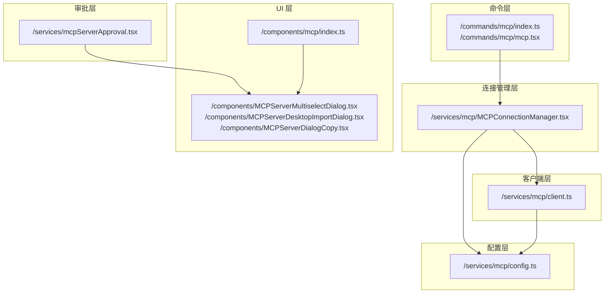
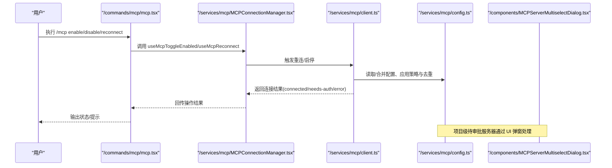
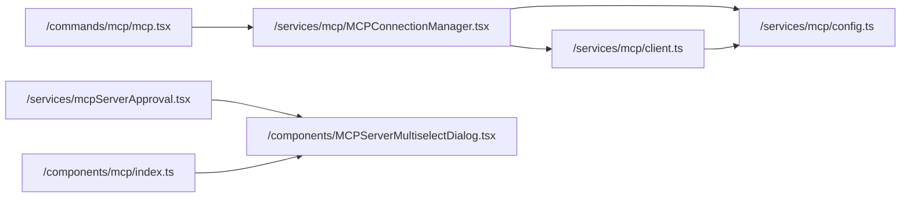

# MCP 服务器管理

<cite>
**本文引用的文件**
- [commands/mcp/mcp.tsx](file://commands/mcp/mcp.tsx)
- [commands/mcp/index.ts](file://commands/mcp/index.ts)
- [services/mcp/MCPConnectionManager.tsx](file://services/mcp/MCPConnectionManager.tsx)
- [services/mcp/config.ts](file://services/mcp/config.ts)
- [services/mcp/client.ts](file://services/mcp/client.ts)
- [services/mcpServerApproval.tsx](file://services/mcpServerApproval.tsx)
- [components/MCPServerDialogCopy.tsx](file://components/MCPServerDialogCopy.tsx)
- [components/MCPServerMultiselectDialog.tsx](file://components/MCPServerMultiselectDialog.tsx)
- [components/MCPServerDesktopImportDialog.tsx](file://components/MCPServerDesktopImportDialog.tsx)
- [components/mcp/index.ts](file://components/mcp/index.ts)
</cite>

## 目录
1. [简介](#简介)
2. [项目结构](#项目结构)
3. [核心组件](#核心组件)
4. [架构总览](#架构总览)
5. [详细组件分析](#详细组件分析)
6. [依赖关系分析](#依赖关系分析)
7. [性能考虑](#性能考虑)
8. [故障排查指南](#故障排查指南)
9. [结论](#结论)
10. [附录](#附录)

## 简介
本文件面向 Claude Code 的 MCP（Model Context Protocol）服务器管理能力，系统性阐述连接建立、维护与断开流程；服务器配置管理、连接池与并发控制；服务器发现、注册与健康检查；状态监控、故障恢复与重连策略；以及与 Claude Code 系统的集成模式。文档同时覆盖 UI 组件与配置项、性能优化与资源管理最佳实践。

## 项目结构
围绕 MCP 服务器管理的关键模块分布如下：
- 命令入口：/commands/mcp 提供 CLI 命令入口与路由分发
- 连接管理：/services/mcp/MCPConnectionManager.tsx 提供全局上下文与重连/启停能力
- 配置管理：/services/mcp/config.ts 负责企业策略、去重、写入与合并
- 客户端与传输：/services/mcp/client.ts 负责连接、认证、超时、批量与工具适配
- UI 对话框：/components 下的 MCP 相关对话框负责用户交互与审批
- 服务端审批：/services/mcpServerApproval.tsx 负责项目级待审批服务器的弹窗处理

图示来源
- [commands/mcp/index.ts:1-13](file://commands/mcp/index.ts#L1-L13)
- [commands/mcp/mcp.tsx:1-85](file://commands/mcp/mcp.tsx#L1-L85)
- [services/mcp/MCPConnectionManager.tsx:1-73](file://services/mcp/MCPConnectionManager.tsx#L1-L73)
- [services/mcp/config.ts:1-800](file://services/mcp/config.ts#L1-L800)
- [services/mcp/client.ts:1-800](file://services/mcp/client.ts#L1-L800)
- [services/mcpServerApproval.tsx:1-41](file://services/mcpServerApproval.tsx#L1-L41)
- [components/MCPServerMultiselectDialog.tsx:1-133](file://components/MCPServerMultiselectDialog.tsx#L1-L133)
- [components/MCPServerDesktopImportDialog.tsx:1-203](file://components/MCPServerDesktopImportDialog.tsx#L1-L203)
- [components/MCPServerDialogCopy.tsx:1-15](file://components/MCPServerDialogCopy.tsx#L1-L15)
- [components/mcp/index.ts:1-10](file://components/mcp/index.ts#L1-L10)

章节来源
- [commands/mcp/index.ts:1-13](file://commands/mcp/index.ts#L1-L13)
- [commands/mcp/mcp.tsx:1-85](file://commands/mcp/mcp.tsx#L1-L85)
- [services/mcp/MCPConnectionManager.tsx:1-73](file://services/mcp/MCPConnectionManager.tsx#L1-L73)
- [services/mcp/config.ts:1-800](file://services/mcp/config.ts#L1-L800)
- [services/mcp/client.ts:1-800](file://services/mcp/client.ts#L1-L800)
- [services/mcpServerApproval.tsx:1-41](file://services/mcpServerApproval.tsx#L1-L41)
- [components/MCPServerMultiselectDialog.tsx:1-133](file://components/MCPServerMultiselectDialog.tsx#L1-L133)
- [components/MCPServerDesktopImportDialog.tsx:1-203](file://components/MCPServerDesktopImportDialog.tsx#L1-L203)
- [components/MCPServerDialogCopy.tsx:1-15](file://components/MCPServerDialogCopy.tsx#L1-L15)
- [components/mcp/index.ts:1-10](file://components/mcp/index.ts#L1-L10)

## 核心组件
- 命令入口与路由
  - /commands/mcp/index.ts 定义本地 JSX 命令“mcp”，支持立即执行与参数提示
  - /commands/mcp/mcp.tsx 实现命令分发：启用/禁用、重连、跳转到设置页等
- 连接管理器
  - /services/mcp/MCPConnectionManager.tsx 暴露 useMcpReconnect/useMcpToggleEnabled，封装重连与启停逻辑
- 配置管理
  - /services/mcp/config.ts 提供添加/删除/合并/去重/策略过滤、环境变量展开、.mcp.json 写入等
- 客户端与传输
  - /services/mcp/client.ts 实现 SSE/WebSocket/HTTP/SDK/IDE 等多种传输，统一超时、认证、缓存与批量连接
- UI 对话框
  - 多选审批、桌面导入、复制提示等 UI 组件，配合审批流程与设置页使用
- 服务端审批
  - /services/mcpServerApproval.tsx 在启动时检测项目级待审批服务器并弹窗处理

章节来源
- [commands/mcp/index.ts:1-13](file://commands/mcp/index.ts#L1-L13)
- [commands/mcp/mcp.tsx:1-85](file://commands/mcp/mcp.tsx#L1-L85)
- [services/mcp/MCPConnectionManager.tsx:1-73](file://services/mcp/MCPConnectionManager.tsx#L1-L73)
- [services/mcp/config.ts:1-800](file://services/mcp/config.ts#L1-L800)
- [services/mcp/client.ts:1-800](file://services/mcp/client.ts#L1-L800)
- [services/mcpServerApproval.tsx:1-41](file://services/mcpServerApproval.tsx#L1-L41)
- [components/MCPServerMultiselectDialog.tsx:1-133](file://components/MCPServerMultiselectDialog.tsx#L1-L133)
- [components/MCPServerDesktopImportDialog.tsx:1-203](file://components/MCPServerDesktopImportDialog.tsx#L1-L203)
- [components/MCPServerDialogCopy.tsx:1-15](file://components/MCPServerDialogCopy.tsx#L1-L15)
- [components/mcp/index.ts:1-10](file://components/mcp/index.ts#L1-L10)

## 架构总览
下图展示从命令到 UI、再到连接与配置的整体调用链路：

图示来源
- [commands/mcp/mcp.tsx:63-84](file://commands/mcp/mcp.tsx#L63-L84)
- [services/mcp/MCPConnectionManager.tsx:37-72](file://services/mcp/MCPConnectionManager.tsx#L37-L72)
- [services/mcp/client.ts:595-607](file://services/mcp/client.ts#L595-L607)
- [services/mcp/config.ts:536-551](file://services/mcp/config.ts#L536-L551)
- [components/MCPServerMultiselectDialog.tsx:25-47](file://components/MCPServerMultiselectDialog.tsx#L25-L47)

## 详细组件分析

### 命令与路由（/commands/mcp）
- 功能要点
  - 支持子命令：enable/disable、reconnect、no-redirect
  - 将 /mcp 重定向至插件设置页（特定场景）
  - 通过组件渲染实现交互式操作（如 MCPSettings、MCPReconnect）
- 关键行为
  - 启用/禁用：根据目标筛选服务器并逐个切换
  - 重连：触发单个服务器的重新连接流程
  - 设置页：直接进入 MCP 设置界面

章节来源
- [commands/mcp/mcp.tsx:63-84](file://commands/mcp/mcp.tsx#L63-L84)
- [commands/mcp/index.ts:1-13](file://commands/mcp/index.ts#L1-L13)

### 连接管理器（/services/mcp/MCPConnectionManager.tsx）
- 功能要点
  - 提供 useMcpReconnect/useMcpToggleEnabled 两个 Hook
  - 通过上下文暴露重连与启停函数，避免在全局状态中重复定义
  - 将动态配置与严格模式参数注入内部连接管理逻辑
- 设计意义
  - 解耦 UI 与连接细节，便于复用与测试
  - 降低全局状态复杂度，减少上下文污染

章节来源
- [services/mcp/MCPConnectionManager.tsx:7-30](file://services/mcp/MCPConnectionManager.tsx#L7-L30)
- [services/mcp/MCPConnectionManager.tsx:37-72](file://services/mcp/MCPConnectionManager.tsx#L37-L72)

### 配置管理（/services/mcp/config.ts）
- 配置写入与原子化
  - 写入 .mcp.json 时保留原权限、先写临时文件再原子重命名，失败自动清理
- 企业策略与去重
  - 允许/拒绝列表策略：名称、命令、URL 三类匹配；URL 支持通配符正则
  - 插件与手动配置去重：以签名（命令数组或解包后的 URL）判定重复
  - claude.ai 连接器与手动配置去重：手动优先
- 环境变量展开与校验
  - 对字符串字段进行环境变量展开，记录缺失变量
  - 使用 Zod Schema 校验配置合法性
- 添加/删除服务器
  - 名称规则校验、保留名拦截、企业配置独占控制
  - 按作用域写入：project/user/local，并在 project 作用域写回 .mcp.json

章节来源
- [services/mcp/config.ts:88-131](file://services/mcp/config.ts#L88-L131)
- [services/mcp/config.ts:223-266](file://services/mcp/config.ts#L223-L266)
- [services/mcp/config.ts:281-310](file://services/mcp/config.ts#L281-L310)
- [services/mcp/config.ts:341-355](file://services/mcp/config.ts#L341-L355)
- [services/mcp/config.ts:364-408](file://services/mcp/config.ts#L364-L408)
- [services/mcp/config.ts:417-508](file://services/mcp/config.ts#L417-L508)
- [services/mcp/config.ts:536-551](file://services/mcp/config.ts#L536-L551)
- [services/mcp/config.ts:556-616](file://services/mcp/config.ts#L556-L616)
- [services/mcp/config.ts:625-761](file://services/mcp/config.ts#L625-L761)
- [services/mcp/config.ts:769-800](file://services/mcp/config.ts#L769-L800)

### 客户端与传输（/services/mcp/client.ts）
- 连接类型与传输
  - SSE、WebSocket、HTTP、SDK、IDE（sse-ide/ws-ide）等多传输适配
  - 会话入口令牌（Session Ingress）透传，支持代理与 TLS
- 认证与安全
  - ClaudeAuthProvider、OAuth 401 自动刷新、needs-auth 缓存与事件上报
  - claude.ai 代理请求自动附加 Bearer Token 并在 401 时重试
- 超时与批量
  - 单请求超时包装（非 GET），长 SSE 流不超时
  - 连接批大小可配置（本地/远程）
- 工具与内容
  - 工具过滤（IDE 限定）、内容截断与存储、图像处理、进度与元数据
- 错误与会话
  - 会话过期识别（HTTP 404 + 特定 JSON-RPC code）
  - 工具调用错误携带 _meta 元信息

章节来源
- [services/mcp/client.ts:595-607](file://services/mcp/client.ts#L595-L607)
- [services/mcp/client.ts:619-784](file://services/mcp/client.ts#L619-L784)
- [services/mcp/client.ts:340-362](file://services/mcp/client.ts#L340-L362)
- [services/mcp/client.ts:372-422](file://services/mcp/client.ts#L372-L422)
- [services/mcp/client.ts:492-550](file://services/mcp/client.ts#L492-L550)
- [services/mcp/client.ts:552-561](file://services/mcp/client.ts#L552-L561)
- [services/mcp/client.ts:563-573](file://services/mcp/client.ts#L563-L573)
- [services/mcp/client.ts:193-206](file://services/mcp/client.ts#L193-L206)
- [services/mcp/client.ts:177-186](file://services/mcp/client.ts#L177-L186)

### UI 组件与审批（/components 与 /services）
- 多选审批对话框
  - 用户选择启用/拒绝多个新服务器，更新本地设置并持久化
- 桌面导入对话框
  - 从 Claude Desktop 导入服务器，处理重名冲突与作用域写入
- 服务端审批
  - 启动时扫描项目级待审批服务器，按单个或批量弹窗处理
- 复制提示
  - 提醒 MCP 服务器可能执行代码或访问系统资源，所有工具调用需审批

章节来源
- [components/MCPServerMultiselectDialog.tsx:25-47](file://components/MCPServerMultiselectDialog.tsx#L25-L47)
- [components/MCPServerDesktopImportDialog.tsx:72-90](file://components/MCPServerDesktopImportDialog.tsx#L72-L90)
- [services/mcpServerApproval.tsx:15-40](file://services/mcpServerApproval.tsx#L15-L40)
- [components/MCPServerDialogCopy.tsx:4-8](file://components/MCPServerDialogCopy.tsx#L4-L8)

## 依赖关系分析
- 命令层依赖连接管理层（通过 Hook 获取重连/启停能力）
- 连接管理层依赖客户端与配置管理（读取配置、发起连接）
- 客户端依赖配置管理（策略、去重、签名、URL 解包）
- UI 组件依赖配置管理（读取/写入设置）与审批服务（项目级待审批）

图示来源
- [commands/mcp/mcp.tsx:19-40](file://commands/mcp/mcp.tsx#L19-L40)
- [services/mcp/MCPConnectionManager.tsx:45-48](file://services/mcp/MCPConnectionManager.tsx#L45-L48)
- [services/mcp/client.ts:135-144](file://services/mcp/client.ts#L135-L144)
- [services/mcp/config.ts:536-551](file://services/mcp/config.ts#L536-L551)
- [services/mcpServerApproval.tsx:15-40](file://services/mcpServerApproval.tsx#L15-L40)
- [components/mcp/index.ts:1-10](file://components/mcp/index.ts#L1-L10)

章节来源
- [commands/mcp/mcp.tsx:19-40](file://commands/mcp/mcp.tsx#L19-L40)
- [services/mcp/MCPConnectionManager.tsx:45-48](file://services/mcp/MCPConnectionManager.tsx#L45-L48)
- [services/mcp/client.ts:135-144](file://services/mcp/client.ts#L135-L144)
- [services/mcp/config.ts:536-551](file://services/mcp/config.ts#L536-L551)
- [services/mcpServerApproval.tsx:15-40](file://services/mcpServerApproval.tsx#L15-L40)
- [components/mcp/index.ts:1-10](file://components/mcp/index.ts#L1-L10)

## 性能考虑
- 连接批大小
  - 本地服务器默认批大小为 3，远程服务器默认批大小为 20，可通过环境变量调整
- 请求超时
  - 单请求超时包装，避免一次性 AbortSignal 超时导致后续请求立即失败
  - GET 请求（SSE 流）不超时，确保长连接稳定
- 缓存与去重
  - 配置签名去重减少重复连接与资源浪费
  - needs-auth 缓存（15 分钟）避免集中 401 重试风暴
- 文件写入原子化
  - .mcp.json 写入采用临时文件 + 原子重命名，保证一致性与可靠性

章节来源
- [services/mcp/client.ts:552-561](file://services/mcp/client.ts#L552-L561)
- [services/mcp/client.ts:492-550](file://services/mcp/client.ts#L492-L550)
- [services/mcp/config.ts:223-266](file://services/mcp/config.ts#L223-L266)
- [services/mcp/config.ts:281-310](file://services/mcp/config.ts#L281-L310)
- [services/mcp/config.ts:257-316](file://services/mcp/config.ts#L257-L316)
- [services/mcp/config.ts:88-131](file://services/mcp/config.ts#L88-L131)

## 故障排查指南
- 会话过期
  - 现象：HTTP 404 + 特定 JSON-RPC code -32001
  - 处理：触发重新连接流程，必要时清除会话缓存后重试
- 需要认证
  - 现象：远程 SSE/HTTP/claude.ai 代理返回 401 或需要授权
  - 处理：记录 needs-auth 缓存，触发授权流程（OAuth 刷新/弹窗）
- 工具调用错误
  - 现象：工具返回 isError: true，但携带 _meta 元信息
  - 处理：捕获 McpToolCallError，保留 _meta 用于诊断
- 配置冲突与策略阻断
  - 现象：添加/修改服务器被企业策略拒绝或与已有配置重复
  - 处理：检查允许/拒绝列表、命令/URL 签名、作用域与保留名限制

章节来源
- [services/mcp/client.ts:193-206](file://services/mcp/client.ts#L193-L206)
- [services/mcp/client.ts:340-362](file://services/mcp/client.ts#L340-L362)
- [services/mcp/client.ts:177-186](file://services/mcp/client.ts#L177-L186)
- [services/mcp/config.ts:364-408](file://services/mcp/config.ts#L364-L408)
- [services/mcp/config.ts:417-508](file://services/mcp/config.ts#L417-L508)
- [services/mcp/config.ts:625-761](file://services/mcp/config.ts#L625-L761)

## 结论
本文件梳理了 Claude Code 中 MCP 服务器管理的全链路：从命令入口、连接管理、配置策略、客户端传输，到 UI 审批与故障处理。通过严格的策略过滤、去重与原子化写入，结合批处理与超时控制，系统在可用性与稳定性之间取得平衡。建议在生产环境中：
- 明确企业策略与允许/拒绝清单
- 合理设置批大小与超时参数
- 使用 UI 审批流程管理新增服务器
- 建立日志与指标监控，关注 needs-auth 与会话过期事件

## 附录
- 常用环境变量
  - MCP_SERVER_CONNECTION_BATCH_SIZE：本地服务器连接批大小
  - MCP_REMOTE_SERVER_CONNECTION_BATCH_SIZE：远程服务器连接批大小
  - MCP_TIMEOUT：连接超时（毫秒）
  - MCP_TOOL_TIMEOUT：工具调用超时（毫秒）
  - MCP_TOOL_MAX_DESCRIPTION_LENGTH：工具描述最大长度
- 关键文件路径参考
  - 命令入口：/commands/mcp/index.ts、/commands/mcp/mcp.tsx
  - 连接管理：/services/mcp/MCPConnectionManager.tsx
  - 配置管理：/services/mcp/config.ts
  - 客户端：/services/mcp/client.ts
  - UI 审批：/services/mcpServerApproval.tsx
  - UI 对话框：/components/MCPServerMultiselectDialog.tsx、/components/MCPServerDesktopImportDialog.tsx、/components/MCPServerDialogCopy.tsx、/components/mcp/index.ts