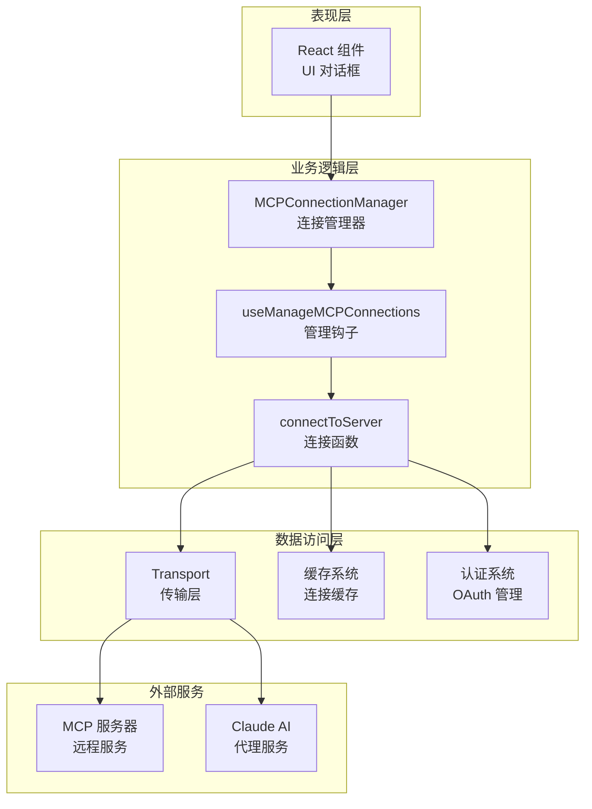
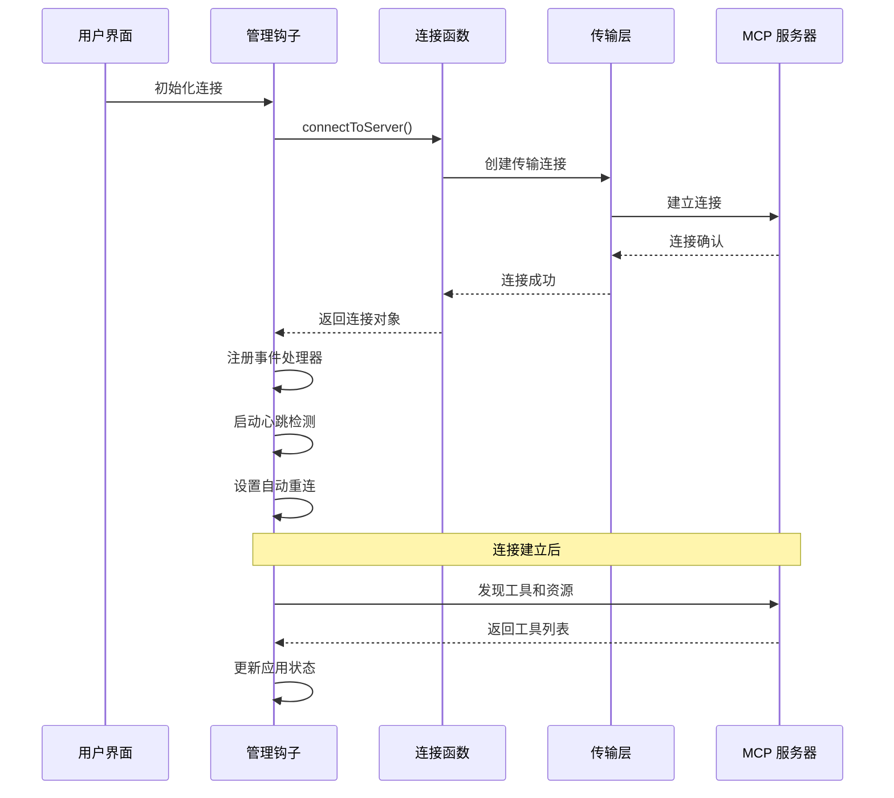
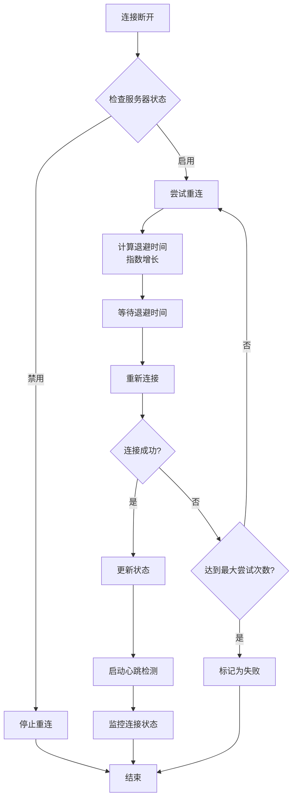
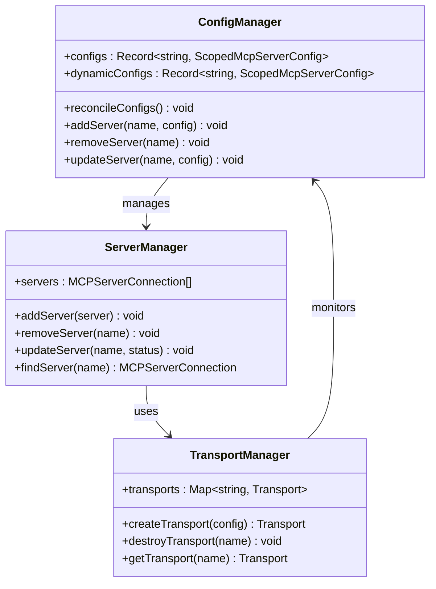
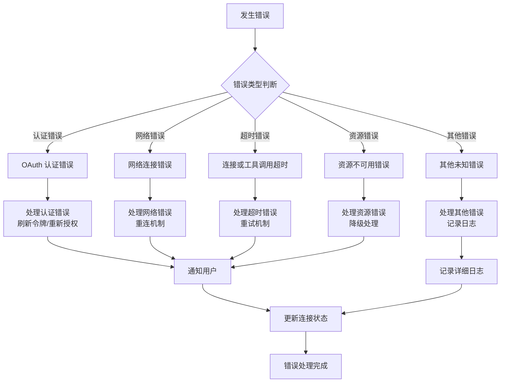
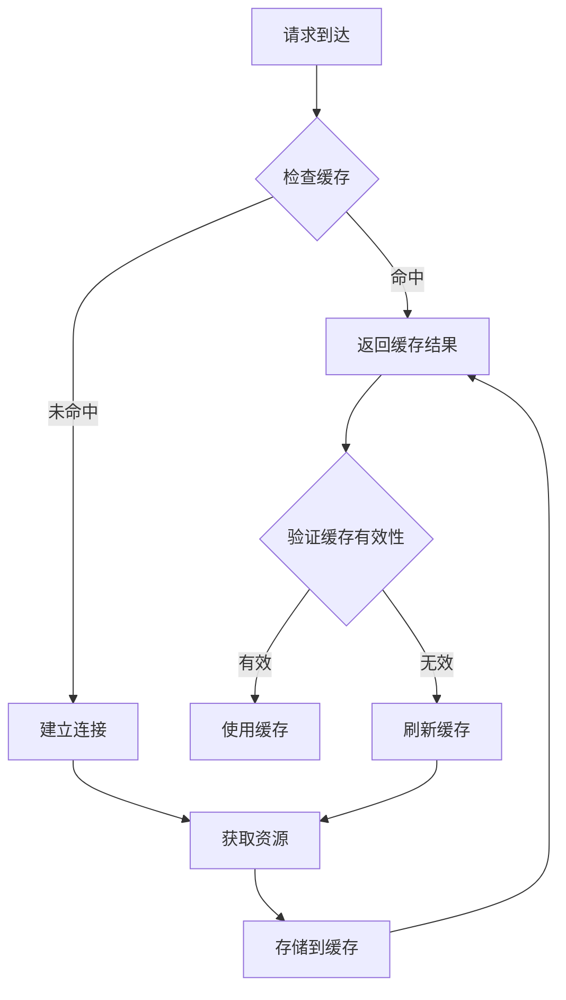

# MCP 连接管理

<cite>
**本文档引用的文件**
- [services/mcp/useManageMCPConnections.ts](file://services/mcp/useManageMCPConnections.ts)
- [services/mcp/client.ts](file://services/mcp/client.ts)
- [services/mcp/types.ts](file://services/mcp/types.ts)
- [services/mcp/MCPConnectionManager.tsx](file://services/mcp/MCPConnectionManager.tsx)
- [components/MCPServerApprovalDialog.tsx](file://components/MCPServerApprovalDialog.tsx)
- [components/MCPServerMultiselectDialog.tsx](file://components/MCPServerMultiselectDialog.tsx)
- [components/MCPServerDialogCopy.tsx](file://components/MCPServerDialogCopy.tsx)
- [components/mcp/MCPStdioServerMenu.tsx](file://components/mcp/MCPStdioServerMenu.tsx)
- [cli/print.ts](file://cli/print.ts)
- [utils/mcpWebSocketTransport.ts](file://utils/mcpWebSocketTransport.ts)
</cite>

## 目录
1. [简介](#简介)
2. [项目结构](#项目结构)
3. [核心组件](#核心组件)
4. [架构概览](#架构概览)
5. [详细组件分析](#详细组件分析)
6. [依赖关系分析](#依赖关系分析)
7. [性能考虑](#性能考虑)
8. [故障排除指南](#故障排除指南)
9. [结论](#结论)

## 简介

MCP（Model Context Protocol）连接管理系统是 Claude Code AI 平台中用于管理与各种 MCP 服务器连接的核心组件。该系统支持多种传输协议（stdio、SSE、HTTP、WebSocket），提供自动重连机制、连接池管理、动态配置更新等功能，确保与外部 MCP 服务器的稳定连接和高效通信。

该系统采用 React Hooks 架构，通过 useManageMCPConnections 钩子实现连接生命周期管理，支持实时状态同步、错误处理和性能监控。系统还提供了丰富的 UI 组件用于服务器配置管理和用户交互。

## 项目结构

MCP 连接管理系统的文件组织遵循功能模块化原则：

```mermaid
graph TB
subgraph "服务层"
A[useManageMCPConnections.ts<br/>连接管理钩子]
B[client.ts<br/>客户端连接逻辑]
C[types.ts<br/>类型定义]
D[MCPConnectionManager.tsx<br/>上下文管理器]
end
subgraph "UI 组件层"
E[MCPServerApprovalDialog.tsx<br/>服务器审批对话框]
F[MCPServerMultiselectDialog.tsx<br/>多选对话框]
G[MCPServerDialogCopy.tsx<br/>对话框复制文本]
H[MCPStdioServerMenu.tsx<br/>STDIO 服务器菜单]
end
subgraph "工具层"
I[mcpWebSocketTransport.ts<br/>WebSocket 传输]
J[CLI 工具]<br/>print.ts
end
A --> B
B --> C
D --> A
E --> A
F --> A
G --> E
H --> A
B --> I
J --> B
```

**图表来源**
- [services/mcp/useManageMCPConnections.ts:1-1142](file://services/mcp/useManageMCPConnections.ts#L1-L1142)
- [services/mcp/client.ts:1-3349](file://services/mcp/client.ts#L1-L3349)
- [services/mcp/types.ts:1-259](file://services/mcp/types.ts#L1-L259)

**章节来源**
- [services/mcp/useManageMCPConnections.ts:1-1142](file://services/mcp/useManageMCPConnections.ts#L1-L1142)
- [services/mcp/client.ts:1-3349](file://services/mcp/client.ts#L1-L3349)
- [services/mcp/types.ts:1-259](file://services/mcp/types.ts#L1-L259)

## 核心组件

### 连接管理钩子

useManageMCPConnections 是整个 MCP 连接系统的核心，负责：

- **初始化服务器配置**：从多种来源加载 MCP 服务器配置
- **批量连接管理**：并发连接多个 MCP 服务器
- **自动重连机制**：实现指数退避算法的自动重连
- **状态同步**：实时同步连接状态到应用状态
- **错误处理**：统一的错误处理和通知机制

### 客户端连接逻辑

client.ts 提供了完整的 MCP 客户端连接功能：

- **多协议支持**：支持 stdio、SSE、HTTP、WebSocket 等传输协议
- **认证管理**：OAuth 认证、会话管理和令牌刷新
- **资源管理**：工具、命令和资源的动态发现和缓存
- **结果处理**：MCP 工具调用结果的转换和处理

### 类型定义系统

types.ts 定义了完整的类型系统：

- **配置类型**：各种 MCP 服务器配置的类型定义
- **连接状态**：连接状态枚举和接口定义
- **资源类型**：服务器资源和工具的类型定义
- **传输类型**：不同传输协议的类型约束

**章节来源**
- [services/mcp/useManageMCPConnections.ts:134-763](file://services/mcp/useManageMCPConnections.ts#L134-L763)
- [services/mcp/client.ts:146-186](file://services/mcp/client.ts#L146-L186)
- [services/mcp/types.ts:179-227](file://services/mcp/types.ts#L179-L227)

## 架构概览

MCP 连接管理系统采用分层架构设计：



**图表来源**
- [services/mcp/MCPConnectionManager.tsx:1-72](file://services/mcp/MCPConnectionManager.tsx#L1-L72)
- [services/mcp/useManageMCPConnections.ts:143-1129](file://services/mcp/useManageMCPConnections.ts#L143-L1129)
- [services/mcp/client.ts:2137-2210](file://services/mcp/client.ts#L2137-L2210)

系统架构的关键特点：

1. **分层设计**：清晰的层次分离，便于维护和扩展
2. **异步处理**：全面使用 Promise 和 async/await 模式
3. **缓存策略**：智能缓存机制减少重复连接开销
4. **错误恢复**：完善的错误处理和自动恢复机制

## 详细组件分析

### 连接生命周期管理

连接生命周期管理是 MCP 系统的核心功能：



**图表来源**
- [services/mcp/client.ts:2324-2386](file://services/mcp/client.ts#L2324-L2386)
- [services/mcp/useManageMCPConnections.ts:333-468](file://services/mcp/useManageMCPConnections.ts#L333-L468)

### 自动重连机制

系统实现了智能的自动重连机制：



**图表来源**
- [services/mcp/useManageMCPConnections.ts:371-462](file://services/mcp/useManageMCPConnections.ts#L371-L462)

### 动态配置更新

系统支持动态配置更新：



**图表来源**
- [services/mcp/client.ts:5446-5479](file://services/mcp/client.ts#L5446-L5479)
- [services/mcp/types.ts:163-169](file://services/mcp/types.ts#L163-L169)

### 错误处理策略

系统采用多层次的错误处理策略：



**图表来源**
- [services/mcp/client.ts:3194-3232](file://services/mcp/client.ts#L3194-L3232)
- [services/mcp/useManageMCPConnections.ts:427-444](file://services/mcp/useManageMCPConnections.ts#L427-L444)

**章节来源**
- [services/mcp/useManageMCPConnections.ts:371-462](file://services/mcp/useManageMCPConnections.ts#L371-L462)
- [services/mcp/client.ts:2324-2386](file://services/mcp/client.ts#L2324-L2386)
- [services/mcp/client.ts:3194-3232](file://services/mcp/client.ts#L3194-L3232)

## 依赖关系分析

MCP 连接管理系统的主要依赖关系：

```mermaid
graph LR
subgraph "核心依赖"
A[@modelcontextprotocol/sdk<br/>MCP 协议实现]
B[lodash-es<br/>工具函数库]
C[p-map<br/>并发控制]
D[react<br/>React 框架]
end
subgraph "内部模块"
E[useManageMCPConnections]
F[client]
G[types]
H[MCPConnectionManager]
end
subgraph "工具类"
I[mcpWebSocketTransport]
J[auth]
K[config]
L[utils]
end
A --> E
B --> E
C --> E
D --> H
E --> F
F --> G
H --> E
F --> I
F --> J
F --> K
F --> L
```

**图表来源**
- [services/mcp/useManageMCPConnections.ts:1-65](file://services/mcp/useManageMCPConnections.ts#L1-L65)
- [services/mcp/client.ts:1-136](file://services/mcp/client.ts#L1-L136)

系统的关键依赖特性：

1. **协议兼容性**：完全兼容 MCP 协议标准
2. **模块化设计**：清晰的模块边界和职责分离
3. **可测试性**：良好的依赖注入支持单元测试
4. **可扩展性**：插件化的架构支持新功能扩展

**章节来源**
- [services/mcp/useManageMCPConnections.ts:1-65](file://services/mcp/useManageMCPConnections.ts#L1-L65)
- [services/mcp/client.ts:1-136](file://services/mcp/client.ts#L1-L136)

## 性能考虑

MCP 连接管理系统在性能方面采用了多项优化策略：

### 连接池管理

系统实现了智能的连接池管理：

- **并发控制**：本地服务器（stdio/sdk）使用较低并发度（通常 2-4），远程服务器使用较高并发度（通常 8-16）
- **资源隔离**：不同类型服务器使用独立的连接池
- **动态调整**：根据系统负载动态调整并发参数

### 缓存策略



**图表来源**
- [services/mcp/client.ts:2000-2031](file://services/mcp/client.ts#L2000-L2031)

### 内存优化

- **LRU 缓存**：使用 LRU 算法管理缓存，避免内存泄漏
- **懒加载**：延迟加载非必要的资源
- **及时清理**：连接关闭时及时释放资源

## 故障排除指南

### 常见问题诊断

#### 连接超时问题

当遇到连接超时问题时，可以按以下步骤排查：

1. **检查网络连接**：确认客户端能够访问 MCP 服务器
2. **查看超时设置**：检查连接超时和工具调用超时配置
3. **监控服务器状态**：确认 MCP 服务器正常运行
4. **查看日志信息**：分析详细的错误日志

#### 认证失败问题

认证失败的常见原因和解决方案：

1. **令牌过期**：自动刷新 OAuth 令牌
2. **权限不足**：检查用户权限和服务器配置
3. **网络问题**：检查代理设置和防火墙规则

#### 资源限制问题

当遇到资源限制问题时：

1. **检查内存使用**：监控系统内存使用情况
2. **优化缓存策略**：调整缓存大小和过期时间
3. **减少并发连接**：降低同时连接的服务器数量

### 调试工具

系统提供了丰富的调试工具：

- **详细日志**：启用详细日志模式获取完整调试信息
- **性能监控**：监控连接建立时间和响应时间
- **状态检查**：实时查看连接状态和配置信息

**章节来源**
- [services/mcp/client.ts:1048-1077](file://services/mcp/client.ts#L1048-L1077)
- [services/mcp/client.ts:3194-3232](file://services/mcp/client.ts#L3194-L3232)

## 结论

MCP 连接管理系统是一个功能完善、架构清晰的现代化连接管理解决方案。系统具有以下优势：

1. **高可靠性**：完善的错误处理和自动重连机制
2. **高性能**：智能缓存和并发控制策略
3. **易扩展**：模块化设计支持功能扩展
4. **用户友好**：丰富的 UI 组件和配置选项
5. **安全可靠**：完整的认证和授权机制

该系统为 Claude Code AI 平台提供了稳定可靠的 MCP 服务器连接能力，支持多种传输协议和复杂的业务场景需求。通过持续的优化和改进，系统将继续为用户提供优质的连接管理体验。