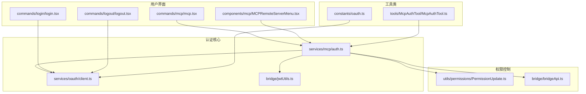
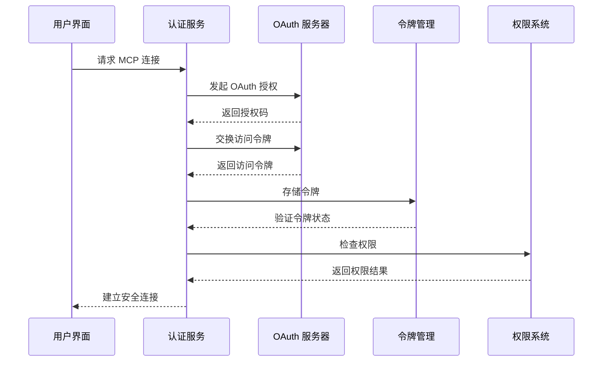
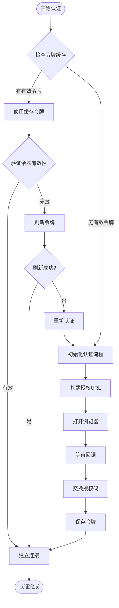
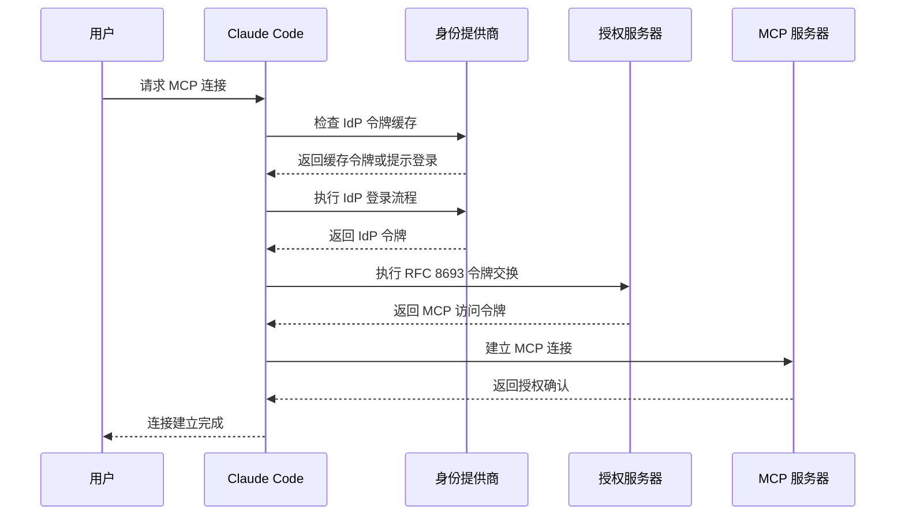
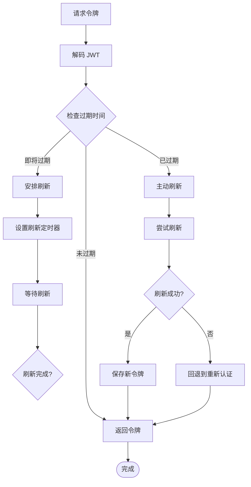
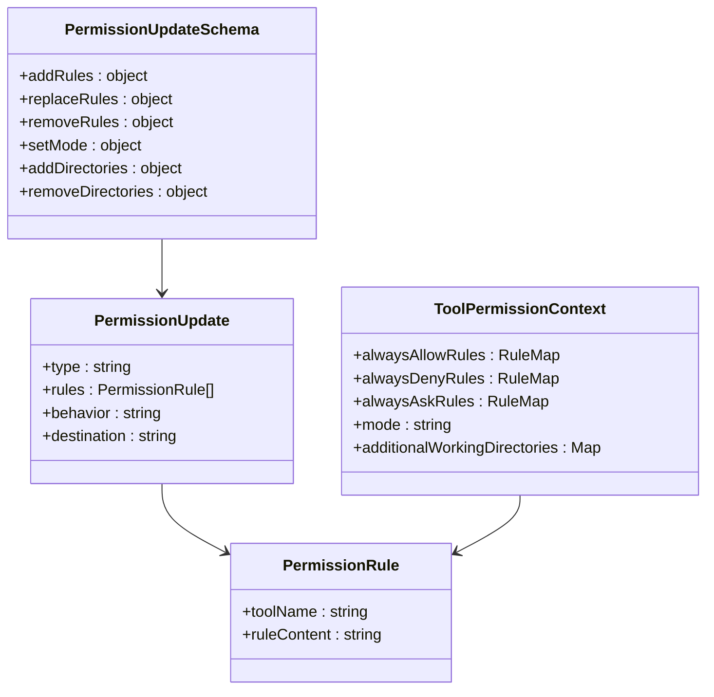
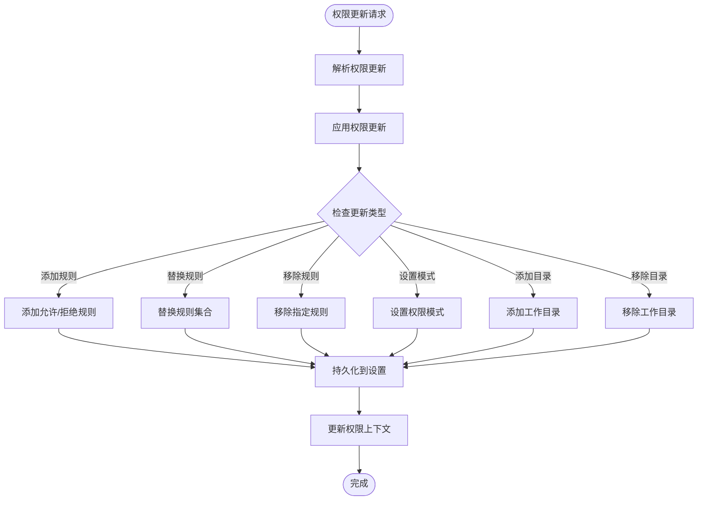
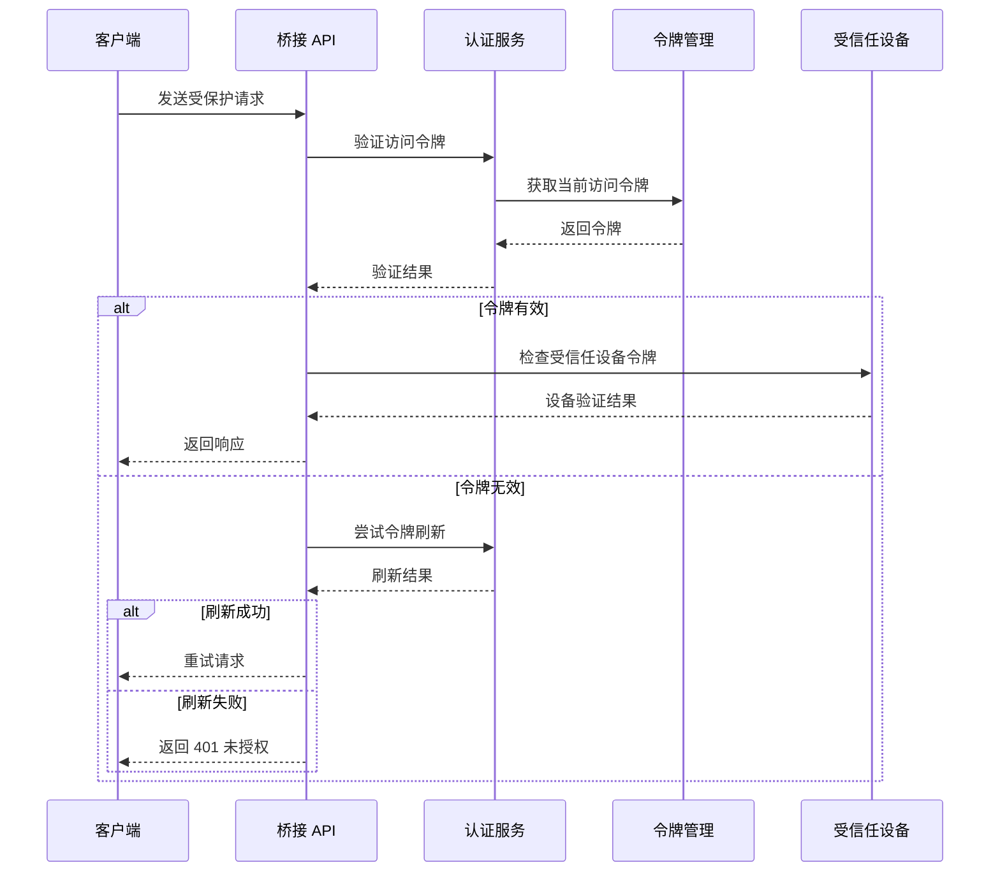
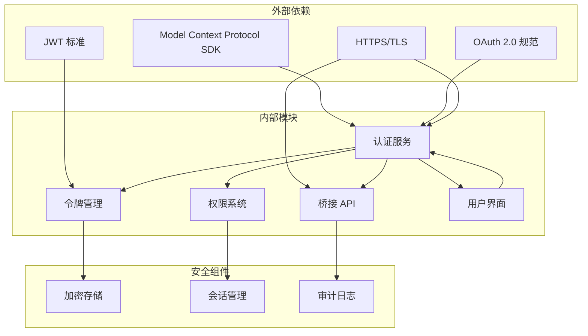
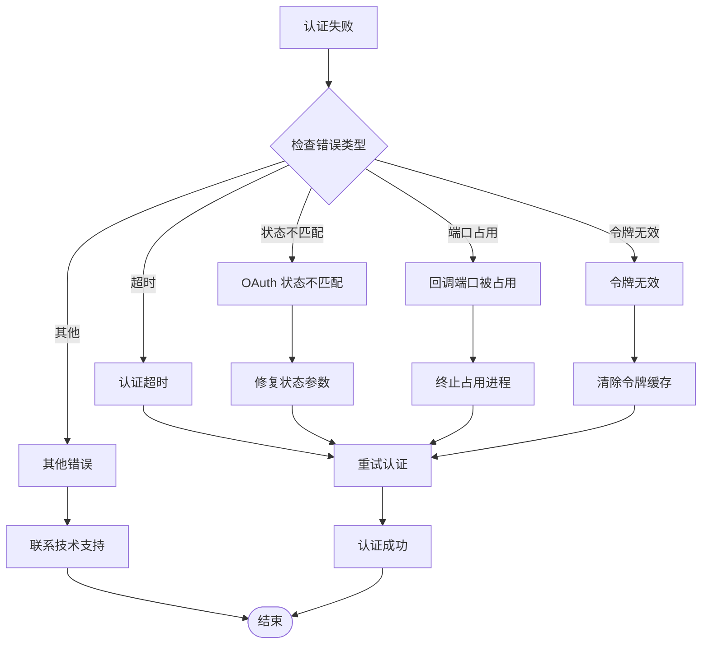

# MCP 认证与授权

<cite>
**本文档引用的文件**
- [services/mcp/auth.ts](file://services/mcp/auth.ts)
- [services/oauth/client.ts](file://services/oauth/client.ts)
- [bridge/jwtUtils.ts](file://bridge/jwtUtils.ts)
- [utils/permissions/PermissionUpdate.ts](file://utils/permissions/PermissionUpdate.ts)
- [bridge/bridgeApi.ts](file://bridge/bridgeApi.ts)
- [constants/oauth.ts](file://constants/oauth.ts)
- [commands/login/login.tsx](file://commands/login/login.tsx)
- [commands/logout/logout.tsx](file://commands/logout/logout.tsx)
- [commands/mcp/mcp.tsx](file://commands/mcp/mcp.tsx)
- [tools/McpAuthTool/McpAuthTool.ts](file://tools/McpAuthTool/McpAuthTool.ts)
- [components/mcp/MCPRemoteServerMenu.tsx](file://components/mcp/MCPRemoteServerMenu.tsx)
</cite>

## 目录
1. [简介](#简介)
2. [项目结构](#项目结构)
3. [核心组件](#核心组件)
4. [架构概览](#架构概览)
5. [详细组件分析](#详细组件分析)
6. [依赖关系分析](#依赖关系分析)
7. [性能考虑](#性能考虑)
8. [故障排除指南](#故障排除指南)
9. [结论](#结论)

## 简介

本文档深入解析 Claude Code 中的 MCP（Model Context Protocol）认证与授权系统。该系统实现了完整的 OAuth 2.0 认证流程，支持 JWT 令牌管理、API 密钥集成、身份提供商（IdP）集成以及跨应用访问（XAA）功能。系统还集成了细粒度的权限控制系统，支持基于规则的访问控制和会话管理。

## 项目结构

MCP 认证与授权系统主要分布在以下模块中：

**图表来源**
- [services/mcp/auth.ts:1-2466](file://services/mcp/auth.ts#L1-L2466)
- [services/oauth/client.ts:1-567](file://services/oauth/client.ts#L1-L567)
- [bridge/jwtUtils.ts:1-257](file://bridge/jwtUtils.ts#L1-L257)

**章节来源**
- [services/mcp/auth.ts:1-2466](file://services/mcp/auth.ts#L1-L2466)
- [services/oauth/client.ts:1-567](file://services/oauth/client.ts#L1-L567)
- [bridge/jwtUtils.ts:1-257](file://bridge/jwtUtils.ts#L1-L257)

## 核心组件

### OAuth 2.0 认证引擎

MCP 系统的核心是基于 Model Context Protocol SDK 的 OAuth 2.0 认证引擎，支持多种认证模式：

- **标准 OAuth 2.0 授权码流程**：支持 PKCE 扩展的安全认证
- **跨应用访问（XAA）**：单点登录（SSO）集成，支持 IdP 缓存
- **动态客户端注册**：自动客户端信息管理
- **令牌刷新机制**：智能令牌轮换和缓存

### JWT 令牌管理系统

系统提供了完整的 JWT 令牌生命周期管理：

- **令牌解码**：支持 JWT 载荷解析和验证
- **过期时间管理**：自动检测和处理令牌过期
- **刷新调度器**：基于时间戳的令牌自动刷新
- **安全存储**：加密存储敏感令牌信息

### 权限控制系统

集成了细粒度的权限管理机制：

- **规则驱动**：基于规则的访问控制
- **作用域管理**：精确的权限范围控制
- **目录权限**：文件系统级别的访问控制
- **会话权限**：动态权限决策

**章节来源**
- [services/mcp/auth.ts:1376-2360](file://services/mcp/auth.ts#L1376-L2360)
- [bridge/jwtUtils.ts:72-256](file://bridge/jwtUtils.ts#L72-L256)
- [utils/permissions/PermissionUpdate.ts:55-206](file://utils/permissions/PermissionUpdate.ts#L55-L206)

## 架构概览

MCP 认证系统采用分层架构设计，确保安全性、可扩展性和易用性：

**图表来源**
- [services/mcp/auth.ts:847-1342](file://services/mcp/auth.ts#L847-L1342)
- [services/oauth/client.ts:107-144](file://services/oauth/client.ts#L107-L144)

系统架构的关键特点：

1. **多层安全防护**：从网络传输到本地存储的全方位保护
2. **智能缓存策略**：平衡性能和安全性的缓存机制
3. **异常处理机制**：完善的错误恢复和降级策略
4. **审计日志记录**：完整的操作追踪和监控能力

## 详细组件分析

### OAuth 认证流程

#### 标准 OAuth 2.0 流程

**图表来源**
- [services/mcp/auth.ts:847-1342](file://services/mcp/auth.ts#L847-L1342)
- [services/oauth/client.ts:107-144](file://services/oauth/client.ts#L107-L144)

#### 跨应用访问（XAA）流程

XAA 提供了更高级别的单点登录体验：

**图表来源**
- [services/mcp/auth.ts:664-845](file://services/mcp/auth.ts#L664-L845)

### JWT 令牌管理

#### 令牌刷新机制

**图表来源**
- [bridge/jwtUtils.ts:102-230](file://bridge/jwtUtils.ts#L102-L230)

#### 安全特性

JWT 系统实现了多项安全特性：

- **自动过期检测**：实时监控令牌有效期
- **防重放攻击**：令牌刷新时序控制
- **加密存储**：敏感令牌的安全存储
- **审计日志**：完整的令牌操作记录

**章节来源**
- [bridge/jwtUtils.ts:1-257](file://bridge/jwtUtils.ts#L1-L257)

### 权限控制系统

#### 规则驱动的权限管理

**图表来源**
- [utils/permissions/PermissionUpdate.ts:55-206](file://utils/permissions/PermissionUpdate.ts#L55-L206)
- [utils/permissions/PermissionUpdateSchema.ts:42-78](file://utils/permissions/PermissionUpdateSchema.ts#L42-L78)

#### 权限更新流程

**图表来源**
- [utils/permissions/PermissionUpdate.ts:55-206](file://utils/permissions/PermissionUpdate.ts#L55-L206)

### 桥接 API 认证

#### 桥接 API 安全机制

**图表来源**
- [bridge/bridgeApi.ts:106-139](file://bridge/bridgeApi.ts#L106-L139)

**章节来源**
- [bridge/bridgeApi.ts:1-540](file://bridge/bridgeApi.ts#L1-L540)

## 依赖关系分析

### 组件间依赖关系

**图表来源**
- [services/mcp/auth.ts:1-50](file://services/mcp/auth.ts#L1-L50)
- [bridge/bridgeApi.ts:12-36](file://bridge/bridgeApi.ts#L12-L36)

### 关键依赖特性

1. **标准化协议**：严格遵循 OAuth 2.0 和 JWT 标准
2. **安全存储**：使用平台特定的安全存储解决方案
3. **会话一致性**：跨进程的会话状态同步
4. **审计跟踪**：完整的操作日志记录

**章节来源**
- [services/mcp/auth.ts:1-100](file://services/mcp/auth.ts#L1-L100)
- [bridge/bridgeApi.ts:1-50](file://bridge/bridgeApi.ts#L1-L50)

## 性能考虑

### 优化策略

MCP 认证系统采用了多项性能优化措施：

1. **智能缓存机制**：
   - 令牌缓存避免重复认证
   - IdP 令牌缓存支持快速重新认证
   - 元数据缓存减少发现开销

2. **并发控制**：
   - 令牌刷新去重防止资源浪费
   - 锁文件机制避免并发冲突
   - 异步操作非阻塞执行

3. **网络优化**：
   - 连接池复用
   - 超时控制和重试机制
   - 错误快速失败

### 性能监控

系统提供了全面的性能监控能力：

- **认证延迟统计**
- **令牌刷新成功率**
- **缓存命中率**
- **错误率监控**

## 故障排除指南

### 常见问题及解决方案

#### 认证失败处理

**图表来源**
- [services/mcp/auth.ts:1265-1341](file://services/mcp/auth.ts#L1265-L1341)

#### 重试机制

系统实现了智能的重试机制：

1. **指数退避重试**：1s, 2s, 4s, 8s 的重试间隔
2. **条件重试**：仅在可恢复错误时重试
3. **最大重试次数**：防止无限重试
4. **错误分类**：区分可重试和不可重试错误

#### 安全审计

所有认证相关操作都会记录详细的审计日志：

- **认证尝试记录**
- **令牌生成和刷新**
- **权限变更历史**
- **错误事件追踪**

**章节来源**
- [services/mcp/auth.ts:1265-1341](file://services/mcp/auth.ts#L1265-L1341)
- [commands/login/login.tsx:19-58](file://commands/login/login.tsx#L19-L58)
- [commands/logout/logout.tsx:16-48](file://commands/logout/logout.tsx#L16-L48)

## 结论

MCP 认证与授权系统是一个设计精良、安全可靠的认证框架。它通过以下关键特性确保了系统的安全性、可用性和可维护性：

1. **多层次安全保障**：从网络传输到本地存储的全方位保护
2. **灵活的认证模式**：支持标准 OAuth 2.0 和 XAA 单点登录
3. **智能化权限管理**：基于规则的细粒度访问控制
4. **完善的错误处理**：健壮的异常处理和恢复机制
5. **全面的监控审计**：完整的操作追踪和性能监控

该系统为 Claude Code 的 MCP 功能提供了坚实的基础，确保用户能够安全、可靠地访问各种 MCP 服务器和资源。