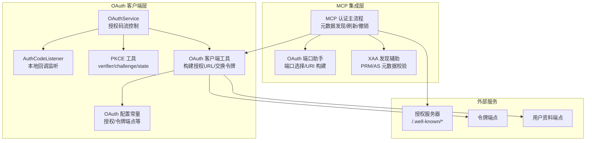
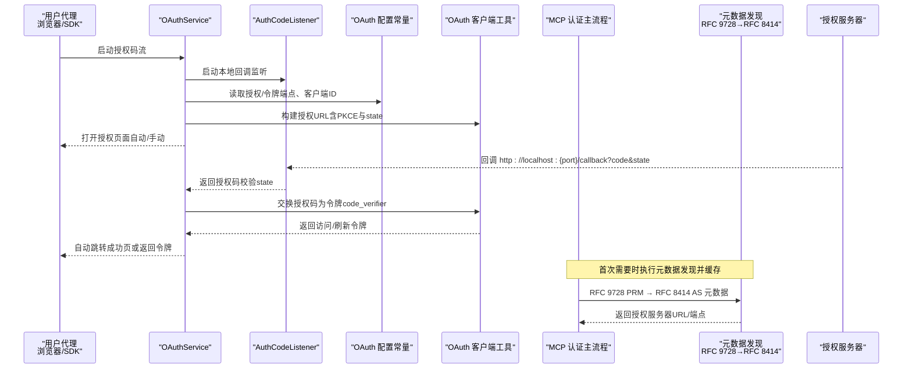
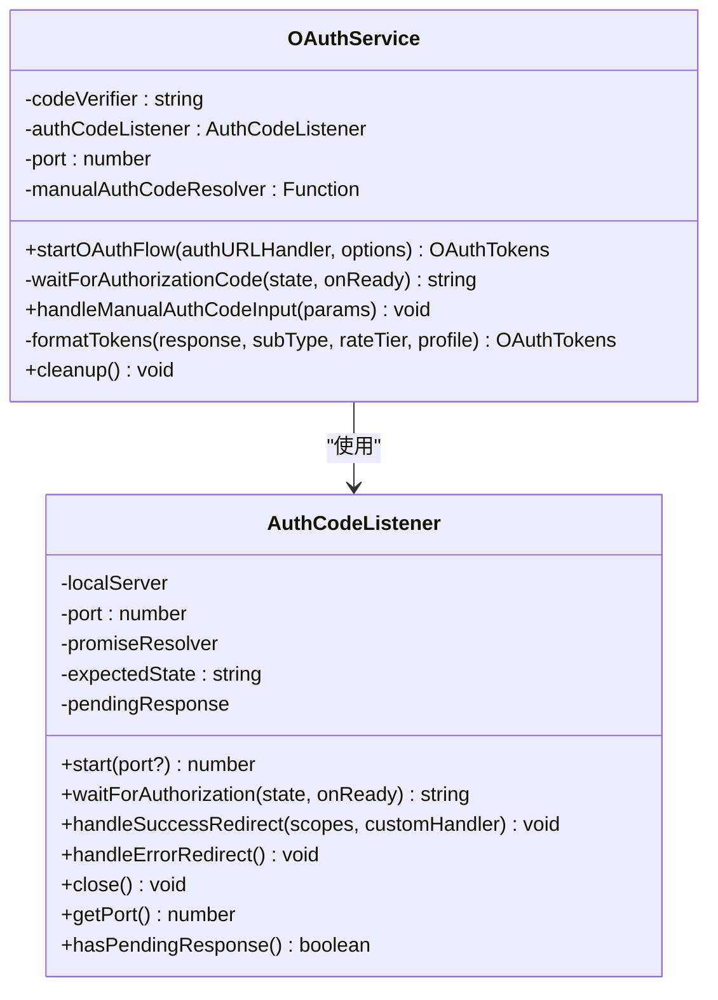
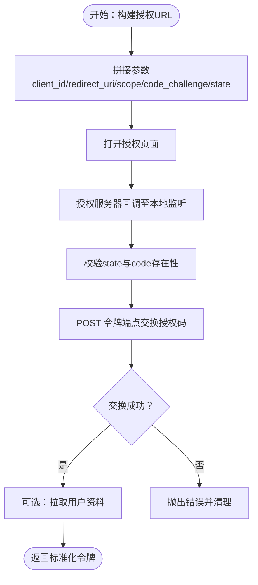
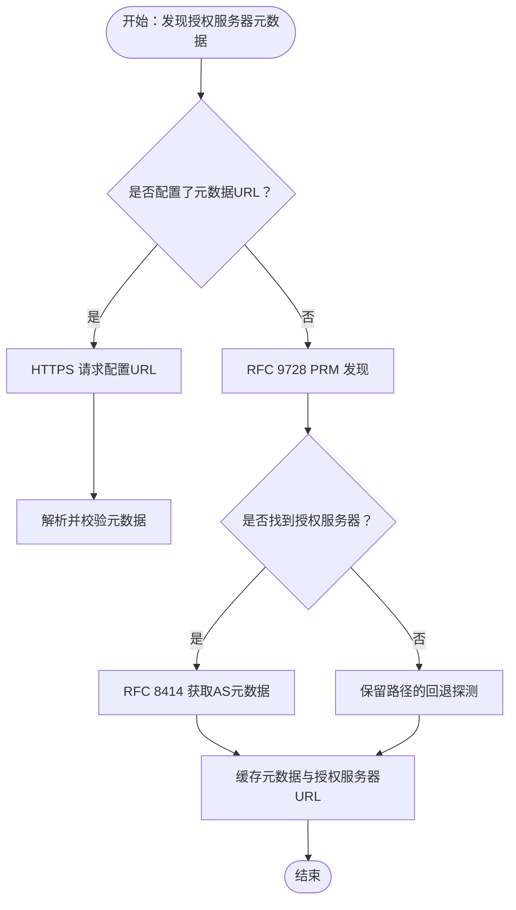
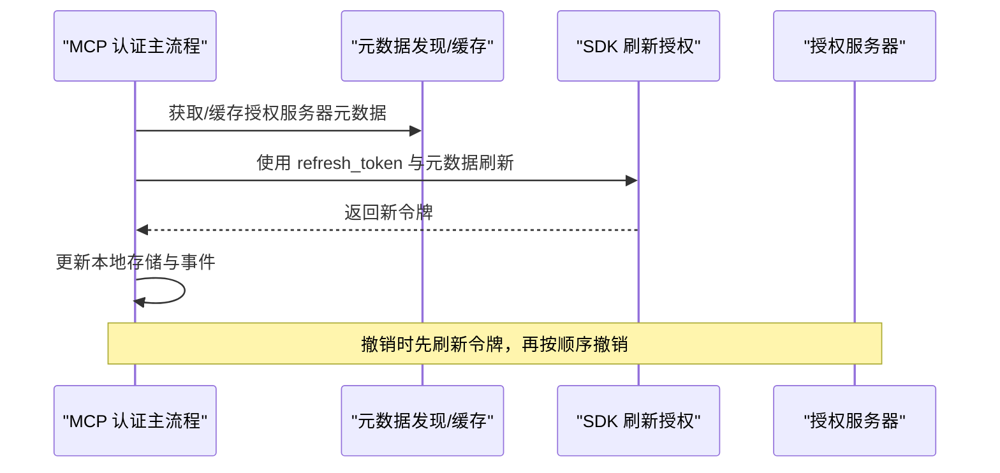
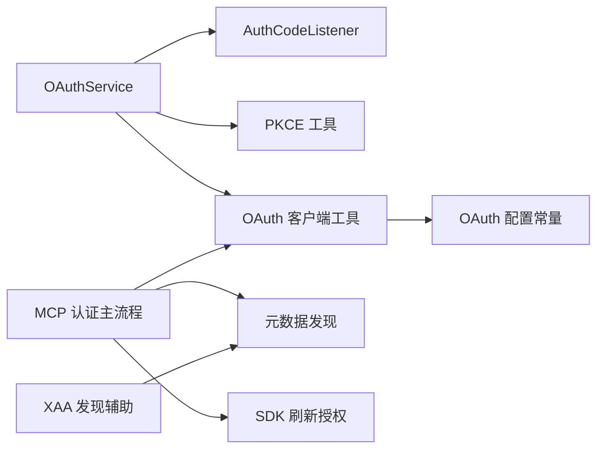

# OAuth 认证流程

<cite>
**本文引用的文件**
- [services/oauth/index.ts](file://services/oauth/index.ts)
- [services/oauth/client.ts](file://services/oauth/client.ts)
- [services/oauth/crypto.ts](file://services/oauth/crypto.ts)
- [services/oauth/auth-code-listener.ts](file://services/oauth/auth-code-listener.ts)
- [services/oauth/getOauthProfile.ts](file://services/oauth/getOauthProfile.ts)
- [constants/oauth.ts](file://constants/oauth.ts)
- [services/mcp/auth.ts](file://services/mcp/auth.ts)
- [services/mcp/oauthPort.ts](file://services/mcp/oauthPort.ts)
- [services/mcp/xaa.ts](file://services/mcp/xaa.ts)
- [utils/auth.ts](file://utils/auth.ts)
- [commands/install-github-app/OAuthFlowStep.tsx](file://commands/install-github-app/OAuthFlowStep.tsx)
</cite>

## 目录
1. [简介](#简介)
2. [项目结构](#项目结构)
3. [核心组件](#核心组件)
4. [架构总览](#架构总览)
5. [详细组件分析](#详细组件分析)
6. [依赖关系分析](#依赖关系分析)
7. [性能考量](#性能考量)
8. [故障排查指南](#故障排查指南)
9. [结论](#结论)
10. [附录](#附录)

## 简介
本文件系统性阐述 MCP 场景下的 OAuth 2.0 授权码流程（含 PKCE），覆盖从授权服务器发现、客户端注册/元数据获取、授权请求与令牌交换，到令牌存储、刷新与撤销的完整闭环。文档同时解释重定向 URI 的生成与端口分配策略、浏览器集成与用户代理行为，并给出配置示例、常见错误与调试技巧以及安全最佳实践。

## 项目结构
围绕 OAuth 的关键模块分布如下：
- 浏览器交互与本地回调捕获：OAuthService、AuthCodeListener
- PKCE 与参数构建：crypto 工具、client 构建授权 URL 与交换令牌
- 授权服务器元数据发现：constants/oauth 提供默认配置；MCP 层实现 RFC 9728 → RFC 8414 发现与缓存
- 令牌管理与刷新：client 刷新逻辑；MCP 层复用元数据缓存与 SDK 刷新
- 撤销与清理：MCP 层按 RFC 7009 先撤销刷新令牌再撤销访问令牌
- 安全与平台差异：Windows 端口范围、循环回环重定向 URI、状态参数防伪

图表来源
- [services/oauth/index.ts:1-199](file://services/oauth/index.ts#L1-L199)
- [services/oauth/auth-code-listener.ts:1-212](file://services/oauth/auth-code-listener.ts#L1-L212)
- [services/oauth/crypto.ts:1-24](file://services/oauth/crypto.ts#L1-L24)
- [services/oauth/client.ts:1-567](file://services/oauth/client.ts#L1-L567)
- [constants/oauth.ts:1-235](file://constants/oauth.ts#L1-L235)
- [services/mcp/auth.ts:239-311](file://services/mcp/auth.ts#L239-L311)
- [services/mcp/oauthPort.ts:1-79](file://services/mcp/oauthPort.ts#L1-L79)
- [services/mcp/xaa.ts:135-210](file://services/mcp/xaa.ts#L135-L210)

章节来源
- [services/oauth/index.ts:1-199](file://services/oauth/index.ts#L1-L199)
- [services/oauth/auth-code-listener.ts:1-212](file://services/oauth/auth-code-listener.ts#L1-L212)
- [services/oauth/crypto.ts:1-24](file://services/oauth/crypto.ts#L1-L24)
- [services/oauth/client.ts:1-567](file://services/oauth/client.ts#L1-L567)
- [constants/oauth.ts:1-235](file://constants/oauth.ts#L1-L235)
- [services/mcp/auth.ts:239-311](file://services/mcp/auth.ts#L239-L311)
- [services/mcp/oauthPort.ts:1-79](file://services/mcp/oauthPort.ts#L1-L79)
- [services/mcp/xaa.ts:135-210](file://services/mcp/xaa.ts#L135-L210)

## 核心组件
- OAuthService：封装授权码流，负责启动本地回调监听、生成 PKCE 值与 state、构建自动/手动授权 URL、等待授权码、交换令牌并返回标准化令牌对象。
- AuthCodeListener：在 localhost 上启动临时 HTTP 服务器，接收授权服务器的重定向回调，校验 state 并返回授权码。
- PKCE 工具：生成 code_verifier、计算 code_challenge、生成 state，确保授权码交换的安全性。
- OAuth 客户端工具：构建授权 URL（含 scope、login_hint、login_method 等）、交换授权码为令牌、刷新令牌、拉取用户资料与角色信息。
- OAuth 配置常量：定义授权端点、令牌端点、成功跳转页、手动回调地址、客户端 ID 等，支持多环境（prod/staging/local/custom）。
- MCP 认证主流程：实现 RFC 9728 → RFC 8414 授权服务器元数据发现与缓存；令牌刷新时复用缓存避免重复发现；按 RFC 7009 执行令牌撤销。
- OAuth 端口助手：跨平台端口范围与随机探测，生成 http://localhost:{port}/callback 的重定向 URI。
- XAA 发现辅助：对 PRM/AS 元数据进行资源与发行者一致性校验，强制 HTTPS 令牌端点。

章节来源
- [services/oauth/index.ts:14-199](file://services/oauth/index.ts#L14-L199)
- [services/oauth/auth-code-listener.ts:9-212](file://services/oauth/auth-code-listener.ts#L9-L212)
- [services/oauth/crypto.ts:11-24](file://services/oauth/crypto.ts#L11-L24)
- [services/oauth/client.ts:46-144](file://services/oauth/client.ts#L46-L144)
- [constants/oauth.ts:60-104](file://constants/oauth.ts#L60-L104)
- [services/mcp/auth.ts:239-311](file://services/mcp/auth.ts#L239-L311)
- [services/mcp/oauthPort.ts:21-79](file://services/mcp/oauthPort.ts#L21-L79)
- [services/mcp/xaa.ts:135-210](file://services/mcp/xaa.ts#L135-L210)

## 架构总览
下图展示 MCP 场景下的 OAuth 2.0 授权码流程（含 PKCE）与元数据发现路径：

图表来源
- [services/oauth/index.ts:32-132](file://services/oauth/index.ts#L32-L132)
- [services/oauth/auth-code-listener.ts:62-175](file://services/oauth/auth-code-listener.ts#L62-L175)
- [services/oauth/client.ts:46-144](file://services/oauth/client.ts#L46-L144)
- [services/mcp/auth.ts:256-311](file://services/mcp/auth.ts#L256-L311)

## 详细组件分析

### 组件一：OAuthService（授权码流控制）
- 职责：启动本地回调监听、生成 PKCE 与 state、构建自动/手动授权 URL、等待授权码、交换令牌、格式化返回值。
- 关键点：
  - 自动模式通过打开浏览器发起授权，本地监听捕获回调；手动模式提供授权 URL 供用户复制粘贴授权码。
  - 交换令牌时携带 code_verifier 与 state，确保安全与防伪。
  - 成功后根据授予的 scope 决定跳转的成功页。

图表来源
- [services/oauth/index.ts:21-199](file://services/oauth/index.ts#L21-L199)
- [services/oauth/auth-code-listener.ts:18-212](file://services/oauth/auth-code-listener.ts#L18-L212)

章节来源
- [services/oauth/index.ts:32-132](file://services/oauth/index.ts#L32-L132)
- [services/oauth/auth-code-listener.ts:62-175](file://services/oauth/auth-code-listener.ts#L62-L175)

### 组件二：PKCE 与状态参数（crypto）
- 生成 code_verifier（32 字节随机数，Base64URL 编码）。
- 以 SHA-256 对 verifier 做哈希并编码得到 code_challenge。
- 生成 state（用于 CSRF 防护）并与回调参数比对。

章节来源
- [services/oauth/crypto.ts:11-24](file://services/oauth/crypto.ts#L11-L24)

### 组件三：授权 URL 构建与令牌交换（client）
- 构建授权 URL：
  - 使用配置常量中的授权端点与客户端 ID。
  - 参数包含：response_type=code、redirect_uri（自动为 localhost 回调，手动为固定回调地址）、scope、code_challenge、code_challenge_method=S256、state。
  - 可选参数：inferenceOnly（仅长时效推理 scope）、orgUUID、login_hint、login_method。
- 令牌交换：
  - 使用授权端点 POST 交换授权码，携带 code_verifier、state、redirect_uri、client_id。
  - 支持可选的 expires_in。
- 刷新令牌：
  - 使用 refresh_token grant，携带 client_id 与 scope 扩展。
  - 成功后更新 expiresAt、scopes，并按需拉取用户资料以填充账户信息。

图表来源
- [services/oauth/client.ts:46-144](file://services/oauth/client.ts#L46-L144)
- [services/oauth/client.ts:107-144](file://services/oauth/client.ts#L107-L144)
- [services/oauth/client.ts:146-274](file://services/oauth/client.ts#L146-L274)

章节来源
- [services/oauth/client.ts:46-144](file://services/oauth/client.ts#L46-L144)
- [services/oauth/client.ts:107-144](file://services/oauth/client.ts#L107-L144)
- [services/oauth/client.ts:146-274](file://services/oauth/client.ts#L146-L274)

### 组件四：授权服务器元数据发现（RFC 9728 → RFC 8414）
- 优先级：
  - 若配置了 authServerMetadataUrl，则强制使用 HTTPS 获取并解析。
  - 否则先执行 RFC 9728 PRM 发现，读取 authorization_servers[0]，再按 RFC 8414 获取 AS 元数据。
  - 失败时保留路径感知的回退探测，兼容旧式服务器。
- 缓存与复用：
  - 首次发现结果与授权服务器 URL 会持久化缓存，后续刷新时优先复用，避免重复发现。
- XAA 辅助：
  - PRM/AS 元数据校验：资源与发行者一致性检查，强制 HTTPS 令牌端点。

图表来源
- [services/mcp/auth.ts:256-311](file://services/mcp/auth.ts#L256-L311)
- [services/mcp/xaa.ts:135-210](file://services/mcp/xaa.ts#L135-L210)

章节来源
- [services/mcp/auth.ts:256-311](file://services/mcp/auth.ts#L256-L311)
- [services/mcp/xaa.ts:135-210](file://services/mcp/xaa.ts#L135-L210)

### 组件五：令牌存储、刷新与撤销
- 存储：
  - 将 access_token、refresh_token、expires_in、scope、账户信息等写入安全存储。
- 刷新：
  - 复用已缓存的授权服务器元数据与客户端信息，通过 SDK 刷新授权，成功后更新存储并发出刷新事件。
- 撤销：
  - 按 RFC 7009，先撤销 refresh_token（更关键，防止新访问令牌生成），再撤销 access_token。
  - 若授权服务器未提供撤销端点，按“尽力而为”策略记录日志并清理本地令牌。

图表来源
- [services/mcp/auth.ts:461-574](file://services/mcp/auth.ts#L461-L574)
- [services/mcp/auth.ts:1669-1702](file://services/mcp/auth.ts#L1669-L1702)
- [services/mcp/auth.ts:2265-2281](file://services/mcp/auth.ts#L2265-L2281)

章节来源
- [services/mcp/auth.ts:461-574](file://services/mcp/auth.ts#L461-L574)
- [services/mcp/auth.ts:1669-1702](file://services/mcp/auth.ts#L1669-L1702)
- [services/mcp/auth.ts:2265-2281](file://services/mcp/auth.ts#L2265-L2281)

### 组件六：重定向 URI 与端口分配
- 重定向 URI：http://localhost:{port}/callback，遵循 RFC 8252，循环回环地址匹配任意端口。
- 端口选择：
  - Windows：使用 39152-49151 区间；其他平台：49152-65535。
  - 支持 MCP_OAUTH_CALLBACK_PORT 环境变量指定固定端口。
  - 随机探测可用端口，最多尝试 100 次；失败回退到 3118。

章节来源
- [services/mcp/oauthPort.ts:21-79](file://services/mcp/oauthPort.ts#L21-L79)

### 组件七：浏览器集成与用户代理
- 自动模式：OAuthService 调用 openBrowser 打开授权 URL；本地 AuthCodeListener 在回调时完成浏览器跳转。
- 手动模式：向用户展示授权 URL 与授权码，由用户复制粘贴授权码，OAuthService 通过内部 resolver 接收并继续流程。
- 命令行安装 GitHub 应用步骤中，也采用“授权码#state”的格式进行输入校验。

章节来源
- [services/oauth/index.ts:72-86](file://services/oauth/index.ts#L72-L86)
- [services/oauth/index.ts:156-167](file://services/oauth/index.ts#L156-L167)
- [commands/install-github-app/OAuthFlowStep.tsx:69-81](file://commands/install-github-app/OAuthFlowStep.tsx#L69-L81)

## 依赖关系分析
- OAuthService 依赖 AuthCodeListener 进行本地回调捕获；依赖 PKCE 工具生成安全参数；依赖 OAuth 客户端工具进行授权 URL 构建与令牌交换。
- OAuth 客户端工具依赖 OAuth 配置常量（授权/令牌端点、客户端 ID、手动回调地址等）。
- MCP 认证主流程依赖元数据发现与缓存，复用 SDK 刷新授权；在撤销阶段依赖授权服务器元数据中的撤销端点与认证方法列表。
- XAA 发现辅助为 PRM/AS 元数据提供一致性与安全性校验，确保 HTTPS 令牌端点。

图表来源
- [services/oauth/index.ts:1-50](file://services/oauth/index.ts#L1-L50)
- [services/oauth/auth-code-listener.ts:1-30](file://services/oauth/auth-code-listener.ts#L1-L30)
- [services/oauth/client.ts:1-32](file://services/oauth/client.ts#L1-L32)
- [constants/oauth.ts:1-31](file://constants/oauth.ts#L1-L31)
- [services/mcp/auth.ts:239-311](file://services/mcp/auth.ts#L239-L311)
- [services/mcp/xaa.ts:135-210](file://services/mcp/xaa.ts#L135-L210)

章节来源
- [services/oauth/index.ts:1-50](file://services/oauth/index.ts#L1-L50)
- [services/oauth/auth-code-listener.ts:1-30](file://services/oauth/auth-code-listener.ts#L1-L30)
- [services/oauth/client.ts:1-32](file://services/oauth/client.ts#L1-L32)
- [constants/oauth.ts:1-31](file://constants/oauth.ts#L1-L31)
- [services/mcp/auth.ts:239-311](file://services/mcp/auth.ts#L239-L311)
- [services/mcp/xaa.ts:135-210](file://services/mcp/xaa.ts#L135-L210)

## 性能考量
- 元数据缓存：首次发现后缓存授权服务器 URL 与元数据，刷新时优先复用，减少网络往返与解析开销。
- 令牌刷新去抖：在刷新过程中若已有刷新任务进行中，直接复用结果，避免并发刷新。
- 本地回调监听：仅在授权期间开启，结束后及时关闭，释放端口与资源。
- 用户资料拉取优化：若全局配置与安全存储中已有账户资料字段，则跳过额外的资料轮询，降低请求量。

章节来源
- [services/mcp/auth.ts:2215-2281](file://services/mcp/auth.ts#L2215-L2281)
- [services/oauth/client.ts:187-240](file://services/oauth/client.ts#L187-L240)

## 故障排查指南
- 端口不可用/占用：
  - 现象：启动本地回调监听失败或无可用端口。
  - 处理：检查 MCP_OAUTH_CALLBACK_PORT 是否被占用；尝试更换端口或允许随机探测；Windows 平台注意保留的端口范围。
- 状态不匹配：
  - 现象：回调返回 Invalid state parameter。
  - 处理：确认授权 URL 与回调中的 state 一致，避免中间人攻击与重放。
- 授权码无效：
  - 现象：令牌交换返回 401 或失败。
  - 处理：确认 code_verifier 与授权时的 code_challenge 对应；检查 redirect_uri 与授权时一致。
- 元数据发现失败：
  - 现象：RFC 9728 或 RFC 8414 探测失败。
  - 处理：检查授权服务器的 /.well-known/* 端点可达性与 HTTPS；必要时配置 authServerMetadataUrl。
- 撤销失败：
  - 现象：撤销 refresh_token 或 access_token 失败。
  - 处理：按 RFC 7009 先撤销刷新令牌；若授权服务器未提供撤销端点，清理本地令牌即可。

章节来源
- [services/mcp/oauthPort.ts:36-79](file://services/mcp/oauthPort.ts#L36-L79)
- [services/oauth/auth-code-listener.ts:164-169](file://services/oauth/auth-code-listener.ts#L164-L169)
- [services/oauth/client.ts:135-143](file://services/oauth/client.ts#L135-L143)
- [services/mcp/auth.ts:292-311](file://services/mcp/auth.ts#L292-L311)
- [services/mcp/auth.ts:523-565](file://services/mcp/auth.ts#L523-L565)

## 结论
该实现以 OAuthService 为核心，结合 PKCE、本地回调监听与严格的元数据发现/校验，构建了安全可靠的授权码流程。MCP 层通过缓存与 SDK 刷新授权，进一步提升刷新效率与稳定性；撤销流程遵循 RFC 7009，确保敏感令牌的可控失效。配合跨平台端口选择与循环回环重定向 URI，满足桌面与终端场景的多样化需求。

## 附录

### OAuth 配置示例（要点）
- 授权端点、令牌端点、手动回调地址、客户端 ID、成功跳转页等由 constants/oauth.ts 提供多环境配置。
- 支持通过环境变量覆盖部分端点与客户端 ID，便于测试与联邦部署。
- 授权 URL 构建时可附加 inferenceOnly、orgUUID、login_hint、login_method 等参数以优化用户体验。

章节来源
- [constants/oauth.ts:60-104](file://constants/oauth.ts#L60-L104)
- [constants/oauth.ts:186-235](file://constants/oauth.ts#L186-L235)
- [services/oauth/client.ts:46-105](file://services/oauth/client.ts#L46-L105)

### 安全最佳实践
- 强制使用 HTTPS 的授权服务器元数据与令牌端点，避免明文传输。
- 使用 PKCE（S256）绑定授权码与客户端，防止授权码拦截。
- 使用 state 参数防止 CSRF 攻击，严格校验回调中的 state。
- 限制本地回调端口范围并启用随机探测，降低端口冲突与扫描风险。
- 撤销令牌时优先撤销刷新令牌，防止生成新的访问令牌。

章节来源
- [services/mcp/xaa.ts:195-210](file://services/mcp/xaa.ts#L195-L210)
- [services/oauth/crypto.ts:15-23](file://services/oauth/crypto.ts#L15-L23)
- [services/mcp/oauthPort.ts:8-13](file://services/mcp/oauthPort.ts#L8-L13)
- [services/mcp/auth.ts:523-565](file://services/mcp/auth.ts#L523-L565)