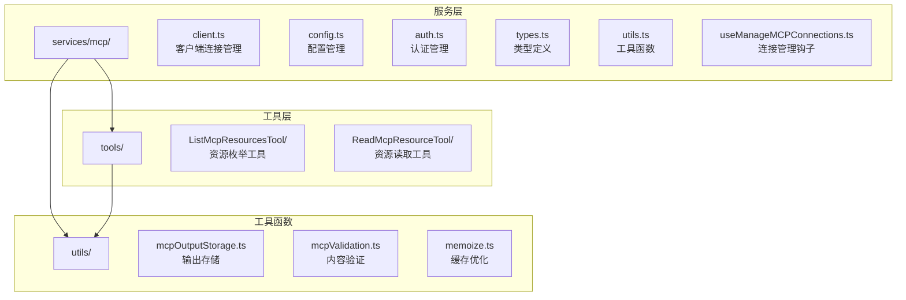
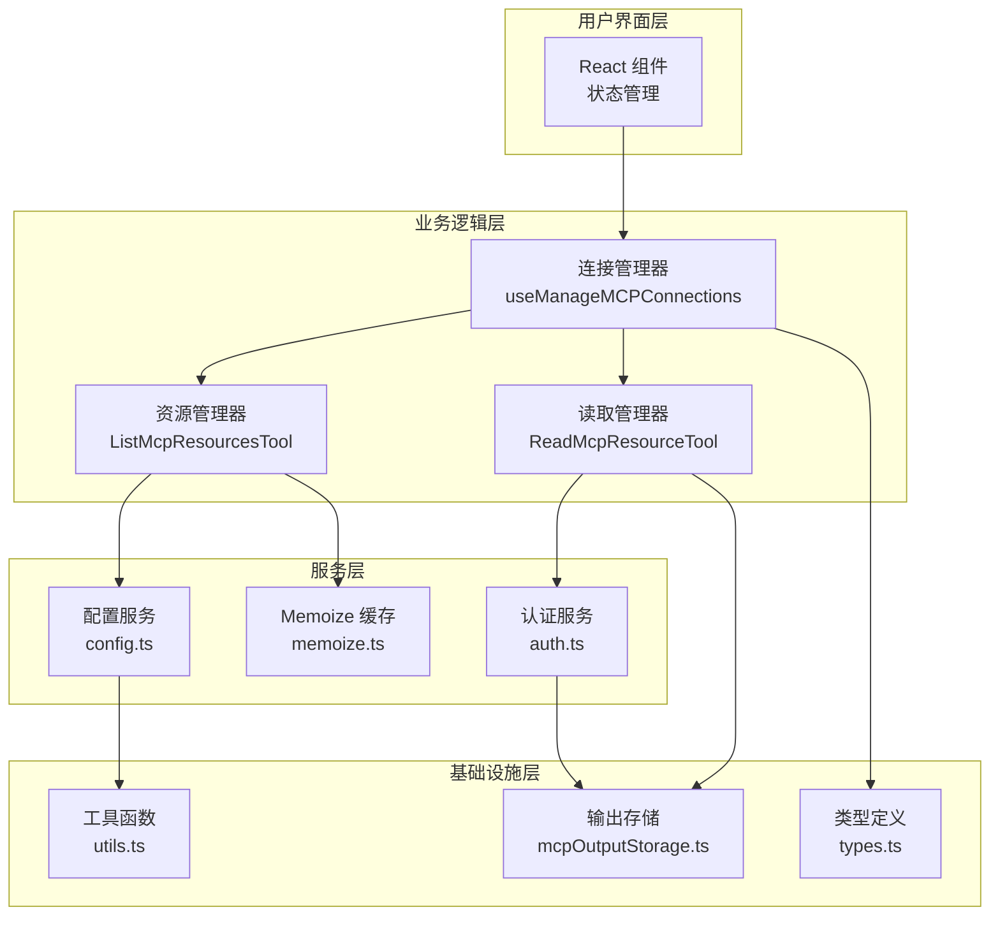
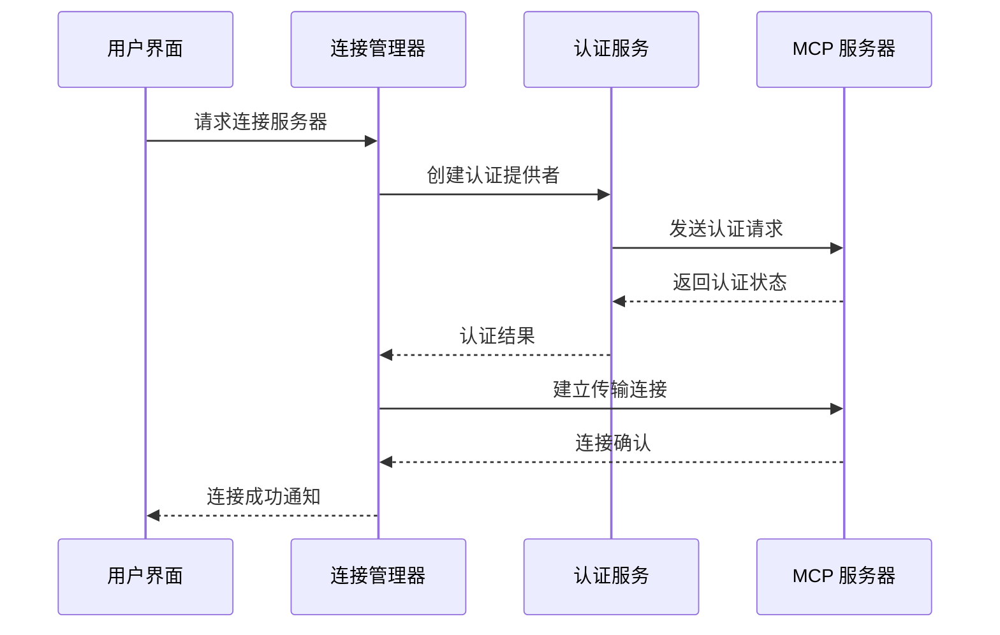
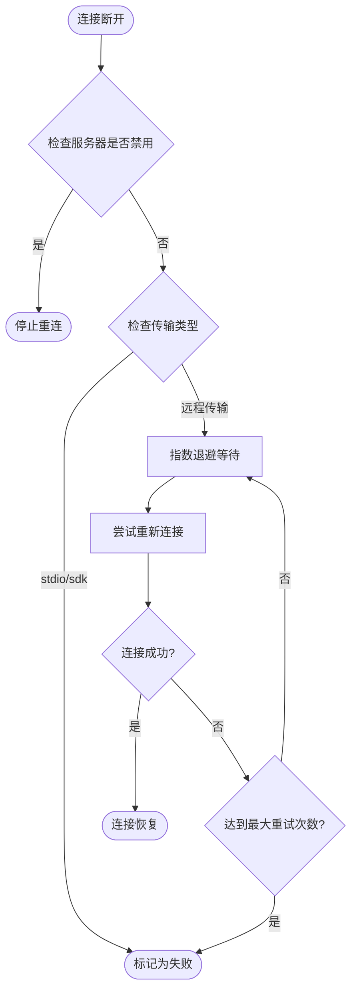
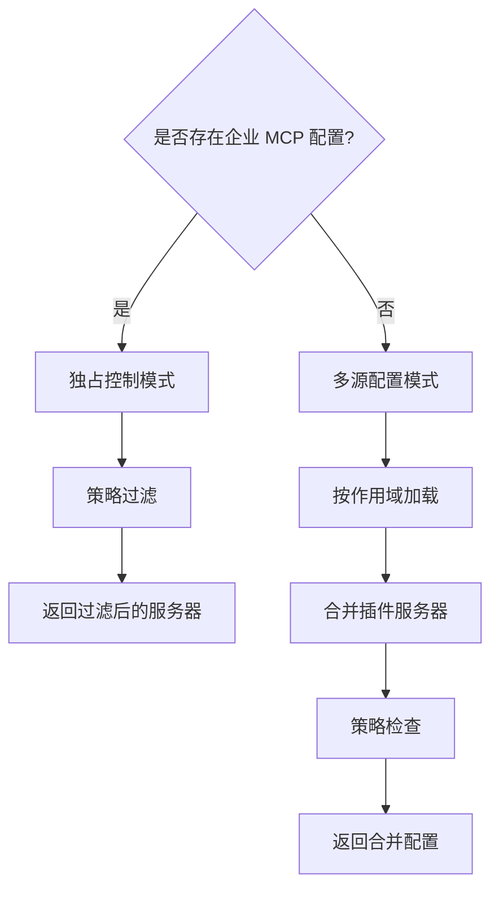
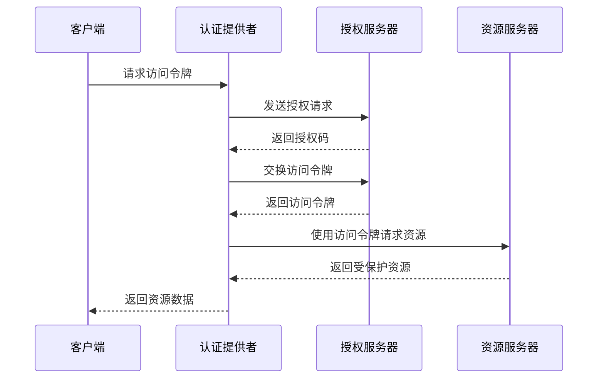
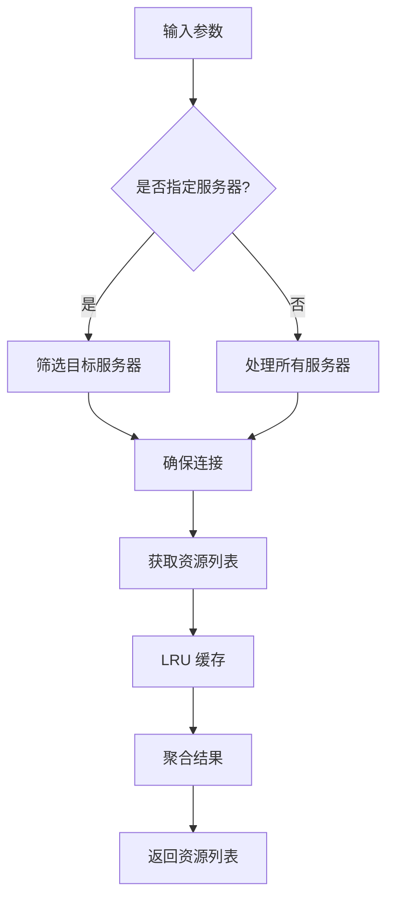
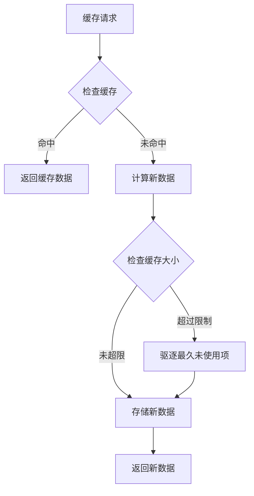
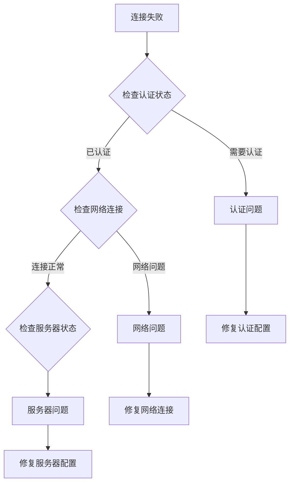

# MCP 资源访问

<cite>
**本文档引用的文件**
- [services/mcp/client.ts](file://services/mcp/client.ts)
- [services/mcp/config.ts](file://services/mcp/config.ts)
- [services/mcp/auth.ts](file://services/mcp/auth.ts)
- [services/mcp/types.ts](file://services/mcp/types.ts)
- [services/mcp/utils.ts](file://services/mcp/utils.ts)
- [services/mcp/useManageMCPConnections.ts](file://services/mcp/useManageMCPConnections.ts)
- [tools/ListMcpResourcesTool/ListMcpResourcesTool.ts](file://tools/ListMcpResourcesTool/ListMcpResourcesTool.ts)
- [tools/ReadMcpResourceTool/ReadMcpResourceTool.ts](file://tools/ReadMcpResourceTool/ReadMcpResourceTool.ts)
- [utils/mcpOutputStorage.ts](file://utils/mcpOutputStorage.ts)
- [utils/mcpValidation.ts](file://utils/mcpValidation.ts)
- [utils/memoize.ts](file://utils/memoize.ts)
</cite>

## 目录
1. [简介](#简介)
2. [项目结构](#项目结构)
3. [核心组件](#核心组件)
4. [架构概览](#架构概览)
5. [详细组件分析](#详细组件分析)
6. [依赖关系分析](#依赖关系分析)
7. [性能考虑](#性能考虑)
8. [故障排除指南](#故障排除指南)
9. [结论](#结论)

## 简介

MCP（Model Context Protocol）资源访问系统是 Claude Code AI 平台中的核心功能模块，负责管理与外部 MCP 服务器的连接、资源发现、枚举和访问。该系统提供了完整的资源访问生命周期管理，包括服务器配置、身份验证、资源发现、权限控制、缓存优化和安全策略。

本系统支持多种传输协议（stdio、SSE、HTTP、WebSocket），能够自动发现和连接 MCP 服务器，提供资源枚举和读取功能，并实现了完善的权限控制和安全机制。

## 项目结构

MCP 资源访问系统主要分布在以下目录结构中：



**图表来源**
- [services/mcp/client.ts:1-800](file://services/mcp/client.ts#L1-L800)
- [tools/ListMcpResourcesTool/ListMcpResourcesTool.ts:1-124](file://tools/ListMcpResourcesTool/ListMcpResourcesTool.ts#L1-L124)
- [tools/ReadMcpResourceTool/ReadMcpResourceTool.ts:1-159](file://tools/ReadMcpResourceTool/ReadMcpResourceTool.ts#L1-L159)

**章节来源**
- [services/mcp/client.ts:1-800](file://services/mcp/client.ts#L1-L800)
- [services/mcp/config.ts:1-800](file://services/mcp/config.ts#L1-L800)

## 核心组件

### 1. 客户端连接管理器

客户端连接管理器是整个 MCP 资源访问系统的核心，负责管理与 MCP 服务器的连接状态和通信。

**关键特性：**
- 支持多种传输协议（stdio、SSE、HTTP、WebSocket）
- 自动重连机制和指数退避策略
- 连接状态缓存和失效管理
- 通知监听和事件处理

### 2. 配置管理系统

配置管理系统负责 MCP 服务器的配置管理，包括企业级策略控制和用户自定义配置。

**核心功能：**
- 企业级 MCP 配置独占控制
- 策略过滤和权限控制
- 多作用域配置管理（用户、项目、本地）
- 插件 MCP 服务器去重

### 3. 认证管理器

认证管理器实现了完整的 OAuth 2.0 和 OpenID Connect 支持，包括标准认证和跨应用访问（XAA）。

**认证流程：**
- OAuth 元数据发现
- 令牌刷新和撤销
- 跨应用访问（XAA）支持
- 安全令牌存储

### 4. 资源访问工具

提供了专门的工具用于资源的枚举和读取操作。

**工具功能：**
- `ListMcpResourcesTool`：列出 MCP 服务器上的所有资源
- `ReadMcpResourceTool`：读取指定的 MCP 资源内容

**章节来源**
- [services/mcp/client.ts:595-800](file://services/mcp/client.ts#L595-L800)
- [services/mcp/config.ts:1082-1120](file://services/mcp/config.ts#L1082-L1120)
- [services/mcp/auth.ts:1-800](file://services/mcp/auth.ts#L1-L800)
- [tools/ListMcpResourcesTool/ListMcpResourcesTool.ts:40-124](file://tools/ListMcpResourcesTool/ListMcpResourcesTool.ts#L40-L124)
- [tools/ReadMcpResourceTool/ReadMcpResourceTool.ts:49-159](file://tools/ReadMcpResourceTool/ReadMcpResourceTool.ts#L49-L159)

## 架构概览

MCP 资源访问系统采用分层架构设计，确保了模块间的清晰分离和高内聚低耦合。



**图表来源**
- [services/mcp/useManageMCPConnections.ts:143-763](file://services/mcp/useManageMCPConnections.ts#L143-L763)
- [services/mcp/client.ts:1-800](file://services/mcp/client.ts#L1-L800)
- [services/mcp/config.ts:1-800](file://services/mcp/config.ts#L1-L800)

## 详细组件分析

### 客户端连接管理器

客户端连接管理器实现了完整的 MCP 服务器连接生命周期管理。

#### 连接建立流程



**图表来源**
- [services/mcp/client.ts:619-784](file://services/mcp/client.ts#L619-L784)
- [services/mcp/auth.ts:1-800](file://services/mcp/auth.ts#L1-L800)

#### 自动重连机制

连接管理器实现了智能的自动重连机制，支持指数退避策略：



**图表来源**
- [services/mcp/useManageMCPConnections.ts:354-465](file://services/mcp/useManageMCPConnections.ts#L354-L465)

**章节来源**
- [services/mcp/client.ts:595-800](file://services/mcp/client.ts#L595-L800)
- [services/mcp/useManageMCPConnections.ts:310-465](file://services/mcp/useManageMCPConnections.ts#L310-L465)

### 配置管理系统

配置管理系统提供了灵活的 MCP 服务器配置管理能力。

#### 企业级策略控制



**图表来源**
- [services/mcp/config.ts:1082-1120](file://services/mcp/config.ts#L1082-L1120)
- [services/mcp/config.ts:536-551](file://services/mcp/config.ts#L536-L551)

#### 策略过滤机制

配置系统实现了多层次的策略过滤：

**名称过滤：** 基于服务器名称的精确匹配  
**命令过滤：** 基于本地进程命令的匹配  
**URL 过滤：** 基于远程服务器 URL 的模式匹配  

**章节来源**
- [services/mcp/config.ts:417-508](file://services/mcp/config.ts#L417-L508)
- [services/mcp/config.ts:536-551](file://services/mcp/config.ts#L536-L551)

### 认证管理器

认证管理器实现了完整的 OAuth 2.0 和 OpenID Connect 支持。

#### OAuth 流程



**图表来源**
- [services/mcp/auth.ts:256-311](file://services/mcp/auth.ts#L256-L311)
- [services/mcp/auth.ts:664-800](file://services/mcp/auth.ts#L664-L800)

#### 跨应用访问（XAA）

XAA 提供了统一的身份提供商登录体验：

**工作流程：**
1. 从身份提供商获取 ID Token
2. 执行 RFC 8693 + RFC 7523 令牌交换
3. 将令牌保存到统一的安全存储中

**章节来源**
- [services/mcp/auth.ts:664-800](file://services/mcp/auth.ts#L664-L800)
- [services/mcp/auth.ts:1-800](file://services/mcp/auth.ts#L1-L800)

### 资源访问工具

#### 资源枚举工具

ListMcpResourcesTool 提供了 MCP 资源的枚举功能：



**图表来源**
- [tools/ListMcpResourcesTool/ListMcpResourcesTool.ts:66-101](file://tools/ListMcpResourcesTool/ListMcpResourcesTool.ts#L66-L101)

#### 资源读取工具

ReadMcpResourceTool 实现了 MCP 资源的读取功能：

**处理流程：**
1. 验证服务器连接状态
2. 检查资源访问权限
3. 发送资源读取请求
4. 处理二进制内容存储
5. 返回处理后的结果

**章节来源**
- [tools/ListMcpResourcesTool/ListMcpResourcesTool.ts:40-124](file://tools/ListMcpResourcesTool/ListMcpResourcesTool.ts#L40-L124)
- [tools/ReadMcpResourceTool/ReadMcpResourceTool.ts:75-159](file://tools/ReadMcpResourceTool/ReadMcpResourceTool.ts#L75-L159)

## 依赖关系分析

MCP 资源访问系统具有清晰的依赖层次结构：

```mermaid
graph TB
subgraph "外部依赖"
SDK[@modelcontextprotocol/sdk<br/>MCP 协议实现]
Lodash[lodash-es<br/>工具函数库]
Axios[axios<br/>HTTP 客户端]
end
subgraph "内部模块"
Client[client.ts<br/>核心连接管理]
Config[config.ts<br/>配置管理]
Auth[auth.ts<br/>认证服务]
Tools[工具函数<br/>mcpOutputStorage.ts]
Utils[通用工具<br/>memoize.ts]
end
subgraph "业务工具"
ListTool[ListMcpResourcesTool]
ReadTool[ReadMcpResourceTool]
end
SDK --> Client
Lodash --> Client
Axios --> Auth
Client --> Config
Client --> Auth
Client --> Tools
Client --> Utils
ListTool --> Client
ReadTool --> Client
```

**图表来源**
- [services/mcp/client.ts:1-800](file://services/mcp/client.ts#L1-L800)
- [services/mcp/auth.ts:1-800](file://services/mcp/auth.ts#L1-L800)
- [utils/mcpOutputStorage.ts:1-190](file://utils/mcpOutputStorage.ts#L1-L190)

**章节来源**
- [services/mcp/client.ts:1-800](file://services/mcp/client.ts#L1-L800)
- [services/mcp/auth.ts:1-800](file://services/mcp/auth.ts#L1-L800)

## 性能考虑

### 缓存策略

系统实现了多层次的缓存机制以优化性能：

#### LRU 缓存优化



**图表来源**
- [utils/memoize.ts:234-270](file://utils/memoize.ts#L234-L270)

#### 内容大小估算

系统实现了智能的内容大小估算机制：

**估算规则：**
- 文本内容：基于字符数的粗略估算
- 图像内容：固定 1600 tokens 估算值
- 混合内容：文本 + 图像的组合估算

**章节来源**
- [utils/memoize.ts:1-270](file://utils/memoize.ts#L1-L270)
- [utils/mcpValidation.ts:59-75](file://utils/mcpValidation.ts#L59-L75)

### 连接池管理

系统支持连接池管理以提高连接效率：

**连接池特性：**
- 批量连接处理
- 连接超时控制
- 自动清理机制

## 故障排除指南

### 常见问题诊断

#### 连接失败排查



#### 资源访问错误处理

**错误分类：**
- 认证错误：401 未授权
- 权限错误：403 禁止访问
- 资源不存在：404 资源未找到
- 服务器错误：5xx 服务器内部错误

**章节来源**
- [services/mcp/client.ts:193-206](file://services/mcp/client.ts#L193-L206)
- [services/mcp/auth.ts:1-800](file://services/mcp/auth.ts#L1-L800)

### 性能监控

系统提供了全面的性能监控能力：

**监控指标：**
- 连接建立时间
- 请求响应时间
- 缓存命中率
- 错误率统计

**日志记录：**
- 详细的操作日志
- 错误追踪信息
- 性能统计数据

## 结论

MCP 资源访问系统是一个功能完整、架构清晰的现代化资源管理解决方案。系统通过分层设计实现了良好的模块化，通过缓存优化提升了性能，通过严格的权限控制确保了安全性。

**主要优势：**
1. **完整的协议支持**：支持多种 MCP 传输协议
2. **智能缓存机制**：多层缓存优化性能
3. **严格的安全控制**：企业级策略和权限管理
4. **灵活的配置管理**：多作用域配置支持
5. **完善的错误处理**：全面的故障排除能力

该系统为 Claude Code AI 平台提供了强大的 MCP 资源访问能力，为用户提供了安全、高效、可靠的资源管理体验。