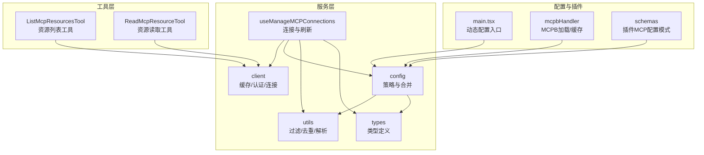
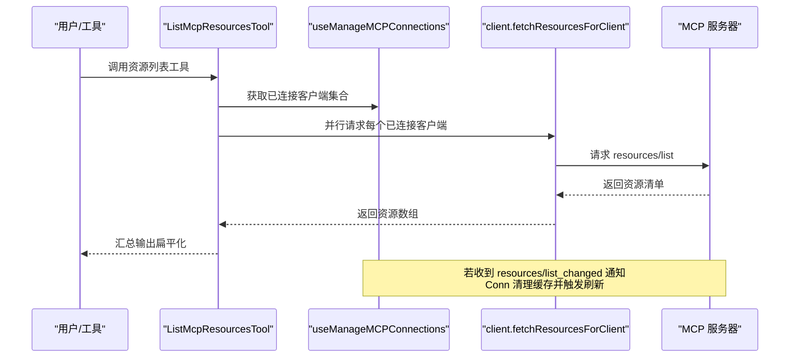
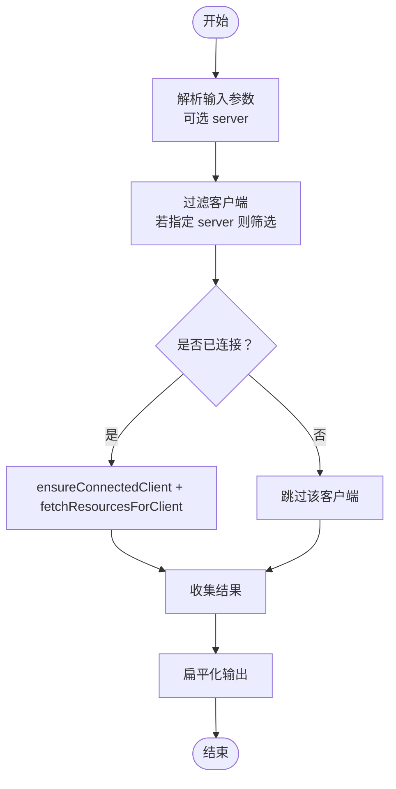
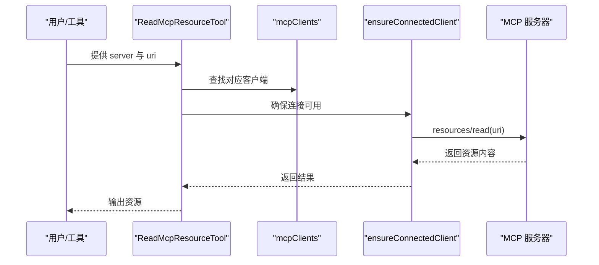
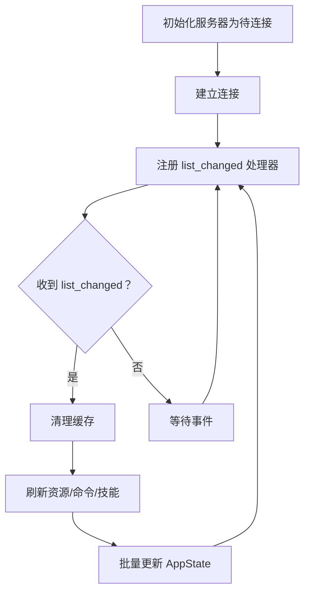
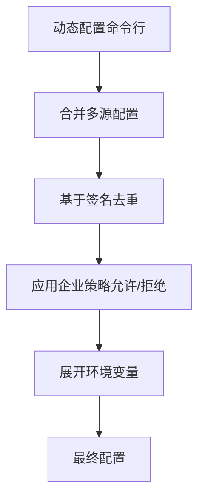
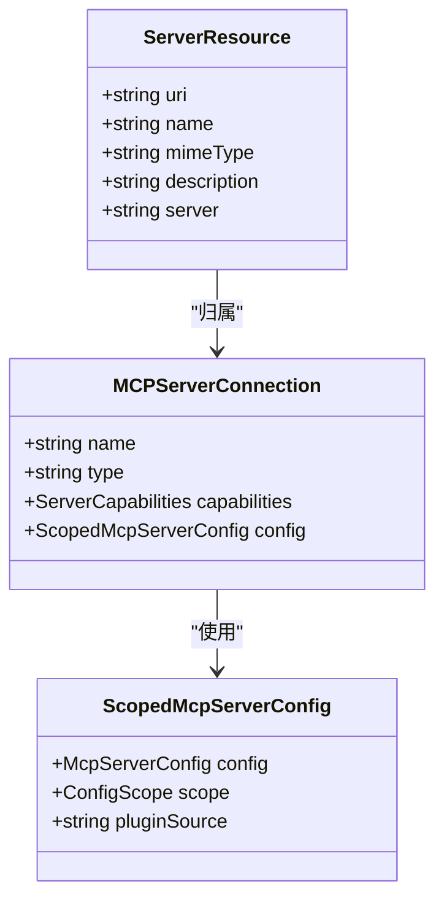
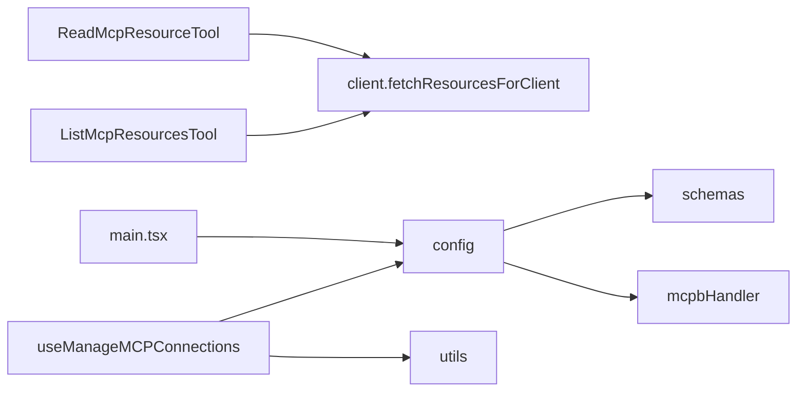

# 资源发现与枚举

<cite>
**本文引用的文件**
- [services/mcp/useManageMCPConnections.ts](file://services/mcp/useManageMCPConnections.ts)
- [tools/ListMcpResourcesTool/ListMcpResourcesTool.ts](file://tools/ListMcpResourcesTool/ListMcpResourcesTool.ts)
- [tools/ReadMcpResourceTool/ReadMcpResourceTool.ts](file://tools/ReadMcpResourceTool/ReadMcpResourceTool.ts)
- [services/mcp/types.ts](file://services/mcp/types.ts)
- [services/mcp/utils.ts](file://services/mcp/utils.ts)
- [services/mcp/config.ts](file://services/mcp/config.ts)
- [services/mcp/client.ts](file://services/mcp/client.ts)
- [utils/plugins/mcpbHandler.ts](file://utils/plugins/mcpbHandler.ts)
- [utils/plugins/schemas.ts](file://utils/plugins/schemas.ts)
- [main.tsx](file://main.tsx)
</cite>

## 目录
1. [简介](#简介)
2. [项目结构](#项目结构)
3. [核心组件](#核心组件)
4. [架构总览](#架构总览)
5. [详细组件分析](#详细组件分析)
6. [依赖关系分析](#依赖关系分析)
7. [性能考虑](#性能考虑)
8. [故障排查指南](#故障排查指南)
9. [结论](#结论)
10. [附录](#附录)

## 简介
本章节面向 MCP（模型上下文协议）资源发现与枚举能力，系统性阐述以下主题：
- 自动发现：服务器配置扫描、资源类型识别与元数据提取
- 枚举算法：过滤条件、排序规则与结果聚合
- 缓存策略：LRU 缓存、增量更新与失效处理
- 标识符与命名：资源标识符生成、命名规范与版本管理
- API 接口与使用示例：工具调用与交互流程
- 性能优化与并发策略：批量连接、并行拉取与回退重连
- 集成方式：与项目配置系统、插件生态与企业策略的衔接

## 项目结构
围绕 MCP 资源发现与枚举的关键模块分布如下：
- 服务层：连接管理、配置解析、策略过滤、缓存与通知处理
- 工具层：资源列表与读取工具，面向用户与自动化流程
- 类型与工具函数：统一的数据模型、过滤与去重逻辑
- 插件与配置：MCPB 文件支持、动态配置注入与企业策略

图示来源
- [services/mcp/useManageMCPConnections.ts:143-763](file://services/mcp/useManageMCPConnections.ts#L143-L763)
- [tools/ListMcpResourcesTool/ListMcpResourcesTool.ts:40-124](file://tools/ListMcpResourcesTool/ListMcpResourcesTool.ts#L40-L124)
- [tools/ReadMcpResourceTool/ReadMcpResourceTool.ts:49-101](file://tools/ReadMcpResourceTool/ReadMcpResourceTool.ts#L49-L101)
- [services/mcp/config.ts:536-551](file://services/mcp/config.ts#L536-L551)
- [services/mcp/utils.ts:1-576](file://services/mcp/utils.ts#L1-L576)
- [services/mcp/types.ts:1-259](file://services/mcp/types.ts#L1-L259)
- [services/mcp/client.ts:289-316](file://services/mcp/client.ts#L289-L316)
- [utils/plugins/mcpbHandler.ts:437-490](file://utils/plugins/mcpbHandler.ts#L437-L490)
- [utils/plugins/schemas.ts:537-572](file://utils/plugins/schemas.ts#L537-L572)
- [main.tsx:1413-1422](file://main.tsx#L1413-L1422)

章节来源
- [services/mcp/useManageMCPConnections.ts:143-763](file://services/mcp/useManageMCPConnections.ts#L143-L763)
- [tools/ListMcpResourcesTool/ListMcpResourcesTool.ts:40-124](file://tools/ListMcpResourcesTool/ListMcpResourcesTool.ts#L40-L124)
- [tools/ReadMcpResourceTool/ReadMcpResourceTool.ts:49-101](file://tools/ReadMcpResourceTool/ReadMcpResourceTool.ts#L49-L101)
- [services/mcp/config.ts:536-551](file://services/mcp/config.ts#L536-L551)
- [services/mcp/utils.ts:1-576](file://services/mcp/utils.ts#L1-L576)
- [services/mcp/types.ts:1-259](file://services/mcp/types.ts#L1-L259)
- [services/mcp/client.ts:289-316](file://services/mcp/client.ts#L289-L316)
- [utils/plugins/mcpbHandler.ts:437-490](file://utils/plugins/mcpbHandler.ts#L437-L490)
- [utils/plugins/schemas.ts:537-572](file://utils/plugins/schemas.ts#L537-L572)
- [main.tsx:1413-1422](file://main.tsx#L1413-L1422)

## 核心组件
- 连接与刷新（useManageMCPConnections）
  - 初始化服务器为“待连接”状态，批量更新 UI 状态
  - 注册资源变更通知处理器，触发增量刷新与缓存失效
  - 处理断线自动重连与回退策略
- 资源枚举工具（ListMcpResourcesTool）
  - 支持按服务器过滤，批量并行拉取资源清单
  - 输出标准化字段（URI、名称、MIME、描述、服务器名）
- 资源读取工具（ReadMcpResourceTool）
  - 基于资源 URI 读取具体资源内容
  - 校验服务器连接状态与能力声明
- 配置与策略（config）
  - 合并多源配置（全局、项目、本地、动态、企业、claude.ai）
  - 去重与策略过滤（允许/拒绝列表、环境变量展开）
- 工具函数（utils）
  - 资源/命令/工具的过滤与排除
  - 服务器签名计算、哈希校验与过期客户端清理
- 类型定义（types）
  - 服务器配置、连接状态、资源类型与 CLI 序列化结构
- 客户端缓存与认证（client）
  - 认证缓存写入串行化，防止竞态
  - LRU 缓存键按服务器名，失效在 onclose 与 list_changed 通知

章节来源
- [services/mcp/useManageMCPConnections.ts:203-308](file://services/mcp/useManageMCPConnections.ts#L203-L308)
- [tools/ListMcpResourcesTool/ListMcpResourcesTool.ts:66-101](file://tools/ListMcpResourcesTool/ListMcpResourcesTool.ts#L66-L101)
- [tools/ReadMcpResourceTool/ReadMcpResourceTool.ts:75-101](file://tools/ReadMcpResourceTool/ReadMcpResourceTool.ts#L75-L101)
- [services/mcp/config.ts:536-551](file://services/mcp/config.ts#L536-L551)
- [services/mcp/utils.ts:102-149](file://services/mcp/utils.ts#L102-L149)
- [services/mcp/types.ts:228-259](file://services/mcp/types.ts#L228-L259)
- [services/mcp/client.ts:289-316](file://services/mcp/client.ts#L289-L316)

## 架构总览
MCP 资源发现由“配置解析—连接建立—能力协商—资源枚举—增量更新—结果聚合”构成闭环。

图示来源
- [tools/ListMcpResourcesTool/ListMcpResourcesTool.ts:66-101](file://tools/ListMcpResourcesTool/ListMcpResourcesTool.ts#L66-L101)
- [services/mcp/useManageMCPConnections.ts:705-751](file://services/mcp/useManageMCPConnections.ts#L705-L751)
- [services/mcp/client.ts:289-316](file://services/mcp/client.ts#L289-L316)

## 详细组件分析

### 组件A：资源枚举工具（ListMcpResourcesTool）
- 输入/输出
  - 输入：可选目标服务器名
  - 输出：资源数组（URI、名称、MIME、描述、服务器）
- 过滤与聚合
  - 若指定服务器名，仅对匹配客户端执行
  - 对已连接客户端并行拉取，失败单点记录日志但不影响整体结果
  - 将各客户端结果扁平化输出
- 并发与健壮性
  - 使用 Promise.all 并行请求，提升吞吐
  - 单客户端异常不阻塞其他客户端

图示来源
- [tools/ListMcpResourcesTool/ListMcpResourcesTool.ts:66-101](file://tools/ListMcpResourcesTool/ListMcpResourcesTool.ts#L66-L101)

章节来源
- [tools/ListMcpResourcesTool/ListMcpResourcesTool.ts:40-124](file://tools/ListMcpResourcesTool/ListMcpResourcesTool.ts#L40-L124)

### 组件B：资源读取工具（ReadMcpResourceTool）
- 功能要点
  - 校验服务器存在、连接状态与资源能力
  - 通过 resources/read 方法读取指定 URI 的资源
  - 输出标准化结果对象
- 错误处理
  - 未找到服务器、未连接、不支持资源能力均抛出明确错误

图示来源
- [tools/ReadMcpResourceTool/ReadMcpResourceTool.ts:75-101](file://tools/ReadMcpResourceTool/ReadMcpResourceTool.ts#L75-L101)

章节来源
- [tools/ReadMcpResourceTool/ReadMcpResourceTool.ts:49-101](file://tools/ReadMcpResourceTool/ReadMcpResourceTool.ts#L49-L101)

### 组件C：连接与增量更新（useManageMCPConnections）
- 生命周期事件
  - onclose：清理缓存，若未禁用则按指数回退重连
  - list_changed 通知：清理对应缓存并刷新资源/命令/技能
- 批量状态更新
  - 16ms 时间窗口内合并多次更新，降低渲染抖动
- 通道与权限
  - 可选注册通道消息与权限通知处理器（受特性开关控制）

图示来源
- [services/mcp/useManageMCPConnections.ts:333-468](file://services/mcp/useManageMCPConnections.ts#L333-L468)
- [services/mcp/useManageMCPConnections.ts:705-751](file://services/mcp/useManageMCPConnections.ts#L705-L751)

章节来源
- [services/mcp/useManageMCPConnections.ts:203-308](file://services/mcp/useManageMCPConnections.ts#L203-L308)
- [services/mcp/useManageMCPConnections.ts:333-468](file://services/mcp/useManageMCPConnections.ts#L333-L468)
- [services/mcp/useManageMCPConnections.ts:705-751](file://services/mcp/useManageMCPConnections.ts#L705-L751)

### 组件D：配置解析与策略（config）
- 配置来源与合并
  - 全局、项目、本地、动态、企业、claude.ai、插件等多源
  - 动态配置通过命令行注入（main.tsx），随后与持久配置合并
- 去重与策略
  - 基于签名（命令/URL）去重，手动优先于插件与 claude.ai
  - 企业策略：允许/拒绝列表，支持名称、命令、URL 三种维度
- 环境变量展开与路径安全
  - 展开字符串中的环境变量，缺失变量单独报告
  - URL 去代理标记，便于签名一致性

图示来源
- [services/mcp/config.ts:536-551](file://services/mcp/config.ts#L536-L551)
- [services/mcp/config.ts:223-266](file://services/mcp/config.ts#L223-L266)
- [services/mcp/config.ts:417-508](file://services/mcp/config.ts#L417-L508)
- [services/mcp/config.ts:555-616](file://services/mcp/config.ts#L555-L616)
- [main.tsx:1413-1422](file://main.tsx#L1413-L1422)

章节来源
- [services/mcp/config.ts:536-551](file://services/mcp/config.ts#L536-L551)
- [services/mcp/config.ts:223-266](file://services/mcp/config.ts#L223-L266)
- [services/mcp/config.ts:417-508](file://services/mcp/config.ts#L417-L508)
- [services/mcp/config.ts:555-616](file://services/mcp/config.ts#L555-L616)
- [main.tsx:1413-1422](file://main.tsx#L1413-L1422)

### 组件E：工具函数与类型（utils/types）
- 过滤与排除
  - 按服务器过滤工具/命令/资源
  - 基于前缀与命名规则区分 MCP 与非 MCP 实体
- 去重与哈希
  - 配置哈希用于检测变更，触发断开与重建
  - 服务器签名（命令/URL）用于插件与手动配置去重
- 类型与序列化
  - ServerResource 扩展原生 Resource，增加 server 字段
  - CLI 序列化结构用于状态导出

图示来源
- [services/mcp/types.ts:228-259](file://services/mcp/types.ts#L228-L259)

章节来源
- [services/mcp/utils.ts:102-149](file://services/mcp/utils.ts#L102-L149)
- [services/mcp/utils.ts:157-169](file://services/mcp/utils.ts#L157-L169)
- [services/mcp/utils.ts:223-266](file://services/mcp/utils.ts#L223-L266)
- [services/mcp/types.ts:228-259](file://services/mcp/types.ts#L228-L259)

## 依赖关系分析
- 工具到服务
  - ListMcpResourcesTool 依赖 client.fetchResourcesForClient 与 ensureConnectedClient
  - ReadMcpResourceTool 依赖 client.ensureConnectedClient 与 SDK 请求
- 服务到配置
  - useManageMCPConnections 依赖 config 合并与策略过滤
- 配置到插件与模式
  - 插件可通过 MCPB 或 JSON 模式提供服务器配置
  - 动态配置通过命令行注入

图示来源
- [tools/ListMcpResourcesTool/ListMcpResourcesTool.ts:40-65](file://tools/ListMcpResourcesTool/ListMcpResourcesTool.ts#L40-L65)
- [tools/ReadMcpResourceTool/ReadMcpResourceTool.ts:49-74](file://tools/ReadMcpResourceTool/ReadMcpResourceTool.ts#L49-L74)
- [services/mcp/useManageMCPConnections.ts:14-14](file://services/mcp/useManageMCPConnections.ts#L14-L14)
- [services/mcp/config.ts:536-551](file://services/mcp/config.ts#L536-L551)
- [utils/plugins/schemas.ts:537-572](file://utils/plugins/schemas.ts#L537-L572)
- [utils/plugins/mcpbHandler.ts:437-490](file://utils/plugins/mcpbHandler.ts#L437-L490)
- [main.tsx:1413-1422](file://main.tsx#L1413-L1422)

章节来源
- [tools/ListMcpResourcesTool/ListMcpResourcesTool.ts:40-65](file://tools/ListMcpResourcesTool/ListMcpResourcesTool.ts#L40-L65)
- [tools/ReadMcpResourceTool/ReadMcpResourceTool.ts:49-74](file://tools/ReadMcpResourceTool/ReadMcpResourceTool.ts#L49-L74)
- [services/mcp/useManageMCPConnections.ts:14-14](file://services/mcp/useManageMCPConnections.ts#L14-L14)
- [services/mcp/config.ts:536-551](file://services/mcp/config.ts#L536-L551)
- [utils/plugins/schemas.ts:537-572](file://utils/plugins/schemas.ts#L537-L572)
- [utils/plugins/mcpbHandler.ts:437-490](file://utils/plugins/mcpbHandler.ts#L437-L490)
- [main.tsx:1413-1422](file://main.tsx#L1413-L1422)

## 性能考虑
- 并发与批处理
  - 资源枚举使用 Promise.all 并行拉取，显著降低总延迟
  - 连接生命周期内的批量更新采用时间窗口合并，避免频繁渲染
- 缓存与失效
  - fetchResourcesForClient 使用 LRU 缓存，键为服务器名；在 onclose 与 list_changed 时失效
  - 认证缓存写入串行化，避免竞态导致的脏写
- 回退与弹性
  - 断线后按指数回退重连，最大重试次数限制
  - 单客户端失败不影响整体结果，提升鲁棒性
- 策略与去重
  - 基于签名的去重减少重复连接与重复工具/命令/资源
  - 企业策略在合并阶段一次性过滤，避免无效请求

章节来源
- [tools/ListMcpResourcesTool/ListMcpResourcesTool.ts:84-96](file://tools/ListMcpResourcesTool/ListMcpResourcesTool.ts#L84-L96)
- [services/mcp/useManageMCPConnections.ts:203-308](file://services/mcp/useManageMCPConnections.ts#L203-L308)
- [services/mcp/client.ts:289-316](file://services/mcp/client.ts#L289-L316)
- [services/mcp/config.ts:223-266](file://services/mcp/config.ts#L223-L266)

## 故障排查指南
- 常见问题
  - 服务器未找到或未连接：检查客户端列表与连接状态
  - 不支持资源能力：确认服务器 capabilities 中声明了 resources
  - 资源列表为空：某些服务器可能仅提供工具而不提供资源
- 日志与诊断
  - 工具层记录单客户端错误，避免影响整体输出
  - 连接层记录重连尝试与失败原因，便于定位网络/鉴权问题
- 重试与恢复
  - 断线自动重连，指数回退；若被禁用则停止重试
  - 收到 list_changed 通知后自动刷新缓存与相关实体

章节来源
- [tools/ReadMcpResourceTool/ReadMcpResourceTool.ts:80-92](file://tools/ReadMcpResourceTool/ReadMcpResourceTool.ts#L80-L92)
- [tools/ListMcpResourcesTool/ListMcpResourcesTool.ts:90-94](file://tools/ListMcpResourcesTool/ListMcpResourcesTool.ts#L90-L94)
- [services/mcp/useManageMCPConnections.ts:333-468](file://services/mcp/useManageMCPConnections.ts#L333-L468)
- [services/mcp/useManageMCPConnections.ts:705-751](file://services/mcp/useManageMCPConnections.ts#L705-L751)

## 结论
本方案以“配置驱动 + 能力协商 + 增量更新 + 缓存失效”的组合实现了 MCP 资源的高效发现与枚举。通过严格的去重与策略过滤、稳健的并发与回退机制，以及清晰的工具接口与可观测性，既满足了开发体验，也兼顾了企业级合规与性能要求。

## 附录

### 资源发现 API 与使用示例
- 列出所有资源
  - 工具名：listMcpResources
  - 输入：可选 server（服务器名）
  - 输出：资源数组（URI、名称、MIME、描述、服务器）
  - 行为：对已连接客户端并行请求，失败单点记录日志
- 读取指定资源
  - 工具名：ReadMcpResourceTool
  - 输入：server（服务器名）、uri（资源 URI）
  - 输出：资源内容
  - 行为：校验连接与能力，发起 resources/read 请求

章节来源
- [tools/ListMcpResourcesTool/ListMcpResourcesTool.ts:66-124](file://tools/ListMcpResourcesTool/ListMcpResourcesTool.ts#L66-L124)
- [tools/ReadMcpResourceTool/ReadMcpResourceTool.ts:75-101](file://tools/ReadMcpResourceTool/ReadMcpResourceTool.ts#L75-L101)

### 资源标识符生成、命名规范与版本管理
- 标识符与命名
  - 资源标识符为 URI；工具/命令命名采用 mcp__<server>__<name> 或 <server>:<name> 形式
  - 服务器名规范化，确保跨源一致
- 版本管理
  - 资源本身不直接携带版本号；版本可通过资源内容或外部元数据管理
  - 服务器能力声明与变更通过 list_changed 通知驱动增量刷新

章节来源
- [services/mcp/utils.ts:40-62](file://services/mcp/utils.ts#L40-L62)
- [services/mcp/types.ts:228-230](file://services/mcp/types.ts#L228-L230)

### 配置系统集成
- 多源配置合并
  - 动态配置（命令行）与持久配置（全局/项目/本地/企业/claude.ai）合并
  - 插件可通过 MCPB 或 JSON 模式提供服务器配置
- 策略与去重
  - 基于签名去重，手动优先；企业策略在合并阶段生效
  - 环境变量展开与 URL 规范化，保证一致性

章节来源
- [services/mcp/config.ts:536-551](file://services/mcp/config.ts#L536-L551)
- [services/mcp/config.ts:223-266](file://services/mcp/config.ts#L223-L266)
- [utils/plugins/mcpbHandler.ts:437-490](file://utils/plugins/mcpbHandler.ts#L437-L490)
- [utils/plugins/schemas.ts:537-572](file://utils/plugins/schemas.ts#L537-L572)
- [main.tsx:1413-1422](file://main.tsx#L1413-L1422)