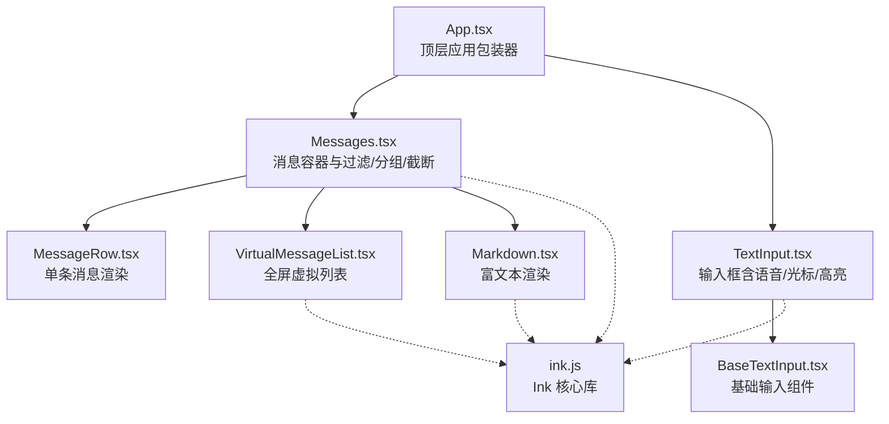
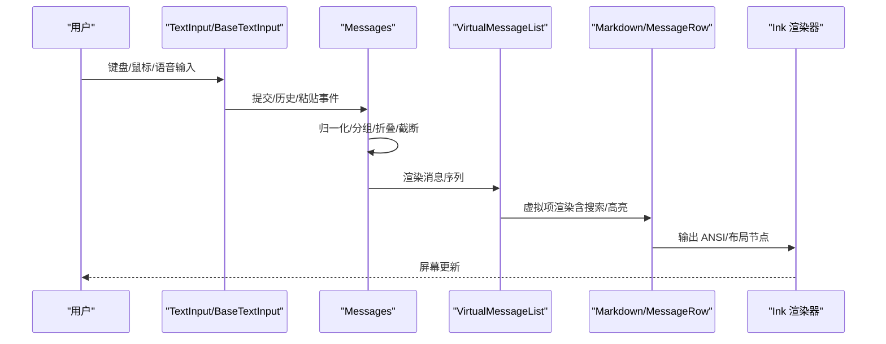
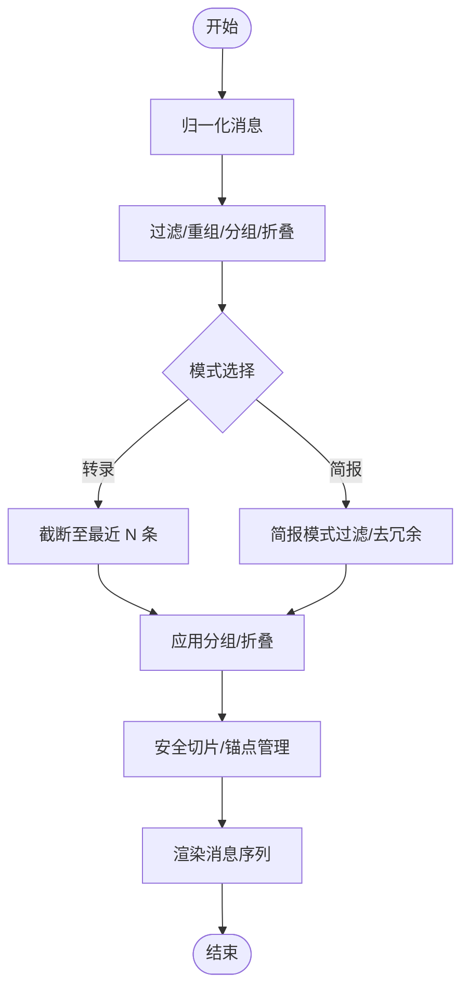
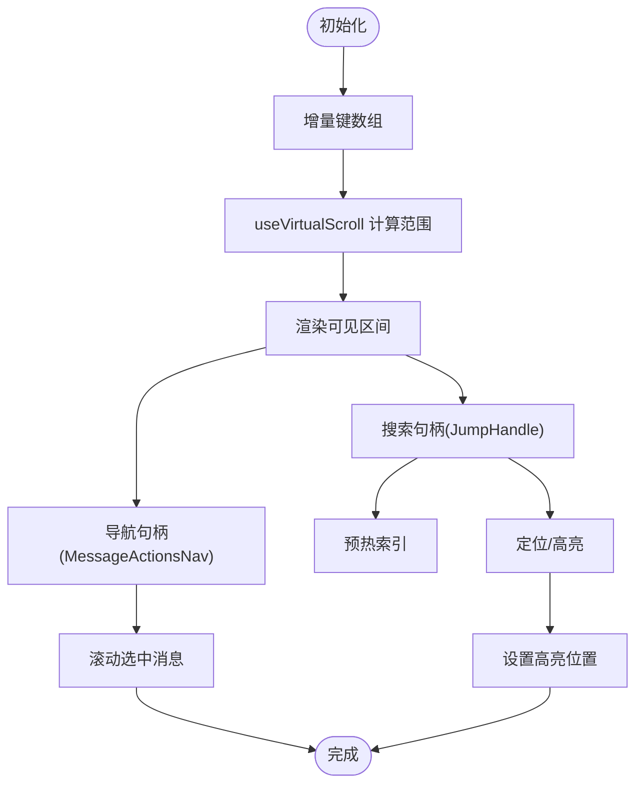
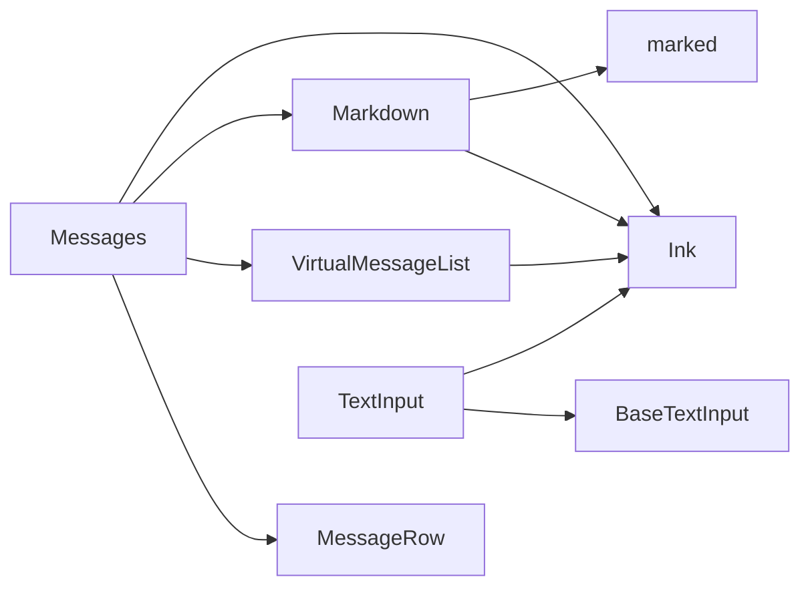

# UI 组件系统

<cite>
**本文档引用的文件**
- [components/App.tsx](file://components/App.tsx)
- [components/Messages.tsx](file://components/Messages.tsx)
- [components/MessageRow.tsx](file://components/MessageRow.tsx)
- [components/VirtualMessageList.tsx](file://components/VirtualMessageList.tsx)
- [components/TextInput.tsx](file://components/TextInput.tsx)
- [components/BaseTextInput.tsx](file://components/BaseTextInput.tsx)
- [components/Markdown.tsx](file://components/Markdown.tsx)
</cite>

## 目录
1. [简介](#简介)
2. [项目结构](#项目结构)
3. [核心组件](#核心组件)
4. [架构总览](#架构总览)
5. [详细组件分析](#详细组件分析)
6. [依赖关系分析](#依赖关系分析)
7. [性能考虑](#性能考虑)
8. [故障排除指南](#故障排除指南)
9. [结论](#结论)

## 简介
本文件系统化梳理 Claude Code 基于 React 与 Ink 的终端 UI 组件体系，重点覆盖消息显示、输入框、虚拟列表与 Markdown 渲染等核心模块。文档从架构设计、组件职责、数据流与处理逻辑、样式与主题、响应式与无障碍支持、组件间通信与状态管理、以及测试与调试最佳实践等方面进行深入解析，帮助开发者快速理解并高效扩展 UI 能力。

## 项目结构
UI 组件主要位于 components 目录，围绕会话消息展示（Messages）、单条消息渲染（MessageRow）、虚拟滚动（VirtualMessageList）、文本输入（TextInput/BaseTextInput）与富文本渲染（Markdown）构建完整的消息交互闭环；同时通过 App.tsx 提供顶层状态与上下文注入，确保 FPS 指标、统计信息与应用状态在整棵组件树中可用。

**图表来源**
- [components/App.tsx](file://components/App.tsx)
- [components/Messages.tsx](file://components/Messages.tsx)
- [components/MessageRow.tsx](file://components/MessageRow.tsx)
- [components/VirtualMessageList.tsx](file://components/VirtualMessageList.tsx)
- [components/TextInput.tsx](file://components/TextInput.tsx)
- [components/BaseTextInput.tsx](file://components/BaseTextInput.tsx)
- [components/Markdown.tsx](file://components/Markdown.tsx)

**章节来源**
- [components/App.tsx](file://components/App.tsx)
- [components/Messages.tsx](file://components/Messages.tsx)
- [components/MessageRow.tsx](file://components/MessageRow.tsx)
- [components/VirtualMessageList.tsx](file://components/VirtualMessageList.tsx)
- [components/TextInput.tsx](file://components/TextInput.tsx)
- [components/BaseTextInput.tsx](file://components/BaseTextInput.tsx)
- [components/Markdown.tsx](file://components/Markdown.tsx)

## 核心组件
- 应用包装器（App）
  - 职责：为交互会话提供顶层上下文，注入 FPS 指标、统计信息与应用状态。
  - 关键点：通过多个 Provider 将状态与指标传递给子树，避免重复渲染。
- 消息容器（Messages）
  - 职责：对消息进行归一化、分组、折叠、截断与排序，生成可渲染的消息序列，并支持“简报模式”与“转录模式”的差异化展示。
  - 关键点：虚拟滚动开关、截断锚点、搜索索引缓存、流式工具调用与思考内容的可见性控制。
- 单条消息（MessageRow）
  - 职责：根据消息类型与上下文决定是否静态渲染、是否展开、是否显示元数据与时间戳。
  - 关键点：保守 memo 比较器，仅在确定不会变化时跳过重渲染。
- 虚拟消息列表（VirtualMessageList）
  - 职责：在全屏模式下提供高性能虚拟滚动，支持粘性提示追踪、搜索定位与键盘导航。
  - 关键点：增量键数组、滚动目标计算、命中位置高亮、搜索锚点与预热索引。
- 文本输入（TextInput/BaseTextInput）
  - 职责：提供终端友好的输入体验，支持多行、历史、粘贴、占位符、光标与高亮、图像粘贴提示、语音录制波形等。
  - 关键点：粘贴处理器、声明式光标、无障碍开关、主题文本颜色、参数提示与高亮裁剪。
- 富文本（Markdown）
  - 职责：将 Markdown 内容渲染为 ANSI 文本或 React 表格组件，支持语法高亮与流式增量渲染。
  - 关键点：标记词法缓存、纯文本快速路径、表格专用组件、流式稳定边界渲染。

**章节来源**
- [components/App.tsx](file://components/App.tsx)
- [components/Messages.tsx](file://components/Messages.tsx)
- [components/MessageRow.tsx](file://components/MessageRow.tsx)
- [components/VirtualMessageList.tsx](file://components/VirtualMessageList.tsx)
- [components/TextInput.tsx](file://components/TextInput.tsx)
- [components/BaseTextInput.tsx](file://components/BaseTextInput.tsx)
- [components/Markdown.tsx](file://components/Markdown.tsx)

## 架构总览
UI 架构以“消息渲染管线 + 输入交互 + 主题与样式”为核心，结合 Ink 的终端渲染能力实现高性能与一致的用户体验。

**图表来源**
- [components/TextInput.tsx](file://components/TextInput.tsx)
- [components/BaseTextInput.tsx](file://components/BaseTextInput.tsx)
- [components/Messages.tsx](file://components/Messages.tsx)
- [components/VirtualMessageList.tsx](file://components/VirtualMessageList.tsx)
- [components/Markdown.tsx](file://components/Markdown.tsx)

## 详细组件分析

### 应用包装器（App）
- 功能
  - 提供 FPS 指标、统计信息与应用状态的全局上下文。
  - 通过 Provider 将状态注入到子组件树，减少重复渲染。
- 设计要点
  - 使用 React Compiler 的 memo 缓存优化渲染。
  - 支持可选的初始状态与子树注入。

**章节来源**
- [components/App.tsx](file://components/App.tsx)

### 消息容器（Messages）
- 功能
  - 对消息进行归一化、重组、分组、折叠与截断，支持简报模式与转录模式。
  - 处理流式工具调用与思考内容的可见性，维护搜索索引缓存。
  - 控制非虚拟渲染的安全上限，避免内存与渲染压力。
- 性能与复杂度
  - 分层计算：昂贵的变换（过滤/重组/分组/折叠/查找）与轻量切片分离，滚动只触发切片更新。
  - 截断锚点：基于 UUID 定位，避免按数量切片导致的偏移与屏幕重置。
  - 搜索索引：弱映射缓存降低每按键的分配成本。
- 关键流程图

**图表来源**
- [components/Messages.tsx](file://components/Messages.tsx)

**章节来源**
- [components/Messages.tsx](file://components/Messages.tsx)

### 单条消息（MessageRow）
- 功能
  - 根据消息类型与上下文决定是否静态渲染、是否展开、是否显示元数据与时间戳。
  - 处理“继续/展开”逻辑与“活跃折叠组”的动画状态。
- 性能
  - 保守 memo 比较器：仅在确定不会变化时跳过重渲染，显著降低滚动抖动。
  - 静态判定：基于工具调用状态、流式状态与解析结果集合判断是否静态。

**章节来源**
- [components/MessageRow.tsx](file://components/MessageRow.tsx)

### 虚拟消息列表（VirtualMessageList）
- 功能
  - 全屏模式下的高性能虚拟滚动，支持粘性提示追踪、搜索定位与键盘导航。
  - 提供可操作句柄（JumpHandle）用于跳转、搜索与高亮。
- 关键特性
  - 增量键数组：避免每次提交重建完整字符串数组。
  - 目标定位：基于消息顶部与呼吸空间（HEADROOM）精确滚动。
  - 搜索引擎：两阶段跳转 + 命中位置高亮，支持锚点与预热索引。
  - 导航接口：暴露进入光标、前后移动、首尾跳转等方法。
- 流程图

**图表来源**
- [components/VirtualMessageList.tsx](file://components/VirtualMessageList.tsx)

**章节来源**
- [components/VirtualMessageList.tsx](file://components/VirtualMessageList.tsx)

### 文本输入（TextInput/BaseTextInput）
- 功能
  - 提供终端友好输入：多行、历史、粘贴、占位符、光标与高亮、图像粘贴提示、语音录制波形。
  - 支持无障碍模式与主题颜色，提供参数提示与高亮裁剪。
- 设计要点
  - 粘贴处理器：区分粘贴与回车，避免重复提交。
  - 声音录制波形：平滑 EMA 抑制抖动，支持降运动模式。
  - 光标与焦点：声明式光标与终端焦点状态联动。
  - 参数提示：仅在命令无参时显示，避免误触发。

**章节来源**
- [components/TextInput.tsx](file://components/TextInput.tsx)
- [components/BaseTextInput.tsx](file://components/BaseTextInput.tsx)

### 富文本（Markdown）
- 功能
  - 将 Markdown 内容渲染为 ANSI 文本或 React 表格组件，支持语法高亮与流式增量渲染。
- 性能与优化
  - 词法缓存：模块级 Map 缓存标记词法，LRU 淘汰，避免重复解析。
  - 快速路径：无 Markdown 语法时直接渲染为段落，跳过解析。
  - 流式稳定边界：仅重新解析不稳定后缀，稳定前缀复用。

**章节来源**
- [components/Markdown.tsx](file://components/Markdown.tsx)

## 依赖关系分析
- 组件耦合
  - Messages 与 MessageRow：消息容器负责数据管线，MessageRow 负责单条渲染，二者通过 props 与 memo 保持低耦合。
  - VirtualMessageList 与 Messages：前者在全屏模式下替代普通 map，共享渲染策略与搜索/高亮能力。
  - TextInput/BaseTextInput：BaseTextInput 承担输入渲染与粘贴处理，TextInput 在其基础上增加语音/无障碍/高亮等增强。
  - Markdown：与消息渲染强关联，负责富文本输出。
- 外部依赖
  - Ink：提供终端渲染、布局、主题、输入与光标管理。
  - marked：Markdown 解析与格式化。
  - hooks 与 utils：提供设置、主题、高亮、消息处理等通用能力。

**图表来源**
- [components/Messages.tsx](file://components/Messages.tsx)
- [components/MessageRow.tsx](file://components/MessageRow.tsx)
- [components/VirtualMessageList.tsx](file://components/VirtualMessageList.tsx)
- [components/TextInput.tsx](file://components/TextInput.tsx)
- [components/BaseTextInput.tsx](file://components/BaseTextInput.tsx)
- [components/Markdown.tsx](file://components/Markdown.tsx)

**章节来源**
- [components/Messages.tsx](file://components/Messages.tsx)
- [components/MessageRow.tsx](file://components/MessageRow.tsx)
- [components/VirtualMessageList.tsx](file://components/VirtualMessageList.tsx)
- [components/TextInput.tsx](file://components/TextInput.tsx)
- [components/BaseTextInput.tsx](file://components/BaseTextInput.tsx)
- [components/Markdown.tsx](file://components/Markdown.tsx)

## 性能考虑
- 渲染路径优化
  - 消息管线分层：昂贵变换与切片分离，滚动仅更新切片，避免全量重排。
  - 静态渲染：MessageRow 的保守比较器确保“确定不变”的消息不重渲染。
  - 虚拟滚动：VirtualMessageList 仅渲染可见区域，高度缓存与增量键数组降低内存与计算开销。
- 解析与缓存
  - Markdown 词法缓存：LRU 淘汰，避免重复解析；无语法时走快速路径。
  - 搜索索引：弱映射缓存与预热，按键时仅做小写匹配与 indexOf。
- I/O 与终端
  - 进度条与终端通知：在支持 OSC 9 的终端中报告工具执行进度，减少 UI 干扰。
  - 截断与锚点：基于 UUID 的锚点避免按数量切片导致的偏移与屏幕重置。

[本节为通用指导，无需代码来源]

## 故障排除指南
- 滚动卡顿
  - 确认已启用虚拟滚动（全屏环境且传入 scrollRef）。
  - 检查是否禁用了虚拟滚动（环境变量开关）。
  - 观察消息是否频繁处于“流式中/未解析”状态，这会导致静态判定失败。
- 搜索无命中或错位
  - 确认已预热索引（warmSearchIndex），或等待自动预热。
  - 检查锚点（setAnchor）是否被手动滚动清除（disarmSearch）。
  - 确认 extractSearchText 是否正确返回消息文本。
- 输入异常
  - 粘贴冲突：确认粘贴处理器已正确处理回车键，避免重复提交。
  - 无障碍模式：检查环境变量是否开启无障碍，焦点与光标行为可能受影响。
- Markdown 渲染异常
  - 语法高亮：确认语法高亮未被禁用（设置项），或等待 CLI 高亮加载完成。
  - 流式渲染：若出现闪烁，确认稳定边界是否正确推进（流式组件内部逻辑）。

**章节来源**
- [components/VirtualMessageList.tsx](file://components/VirtualMessageList.tsx)
- [components/TextInput.tsx](file://components/TextInput.tsx)
- [components/BaseTextInput.tsx](file://components/BaseTextInput.tsx)
- [components/Markdown.tsx](file://components/Markdown.tsx)

## 结论
该 UI 组件系统以“高性能渲染 + 终端友好交互 + 可扩展的主题与样式”为目标，通过分层的消息管线、保守的渲染策略与虚拟滚动技术，在长会话与大量消息场景下仍能保持流畅体验。TextInput 与 Markdown 组件进一步增强了输入与内容表达能力。建议在扩展新功能时遵循现有模式：优先虚拟化、谨慎 memo、分离昂贵计算、统一主题与无障碍策略，并通过测试与调试工具验证性能与稳定性。