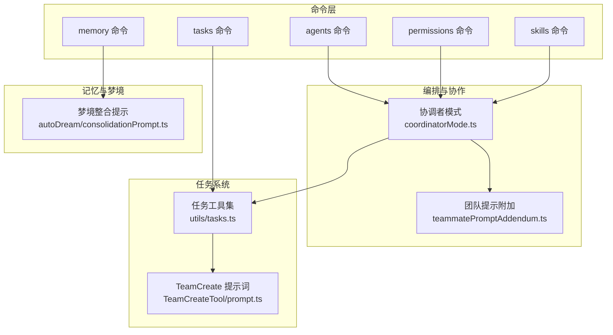
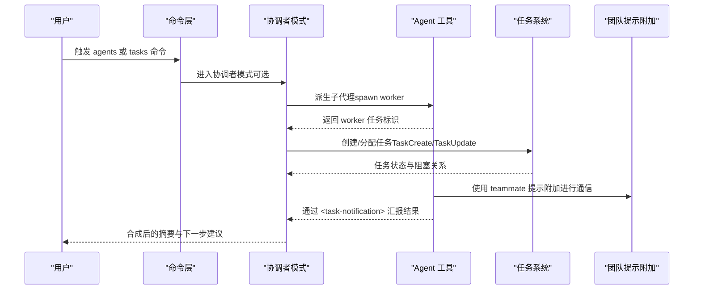
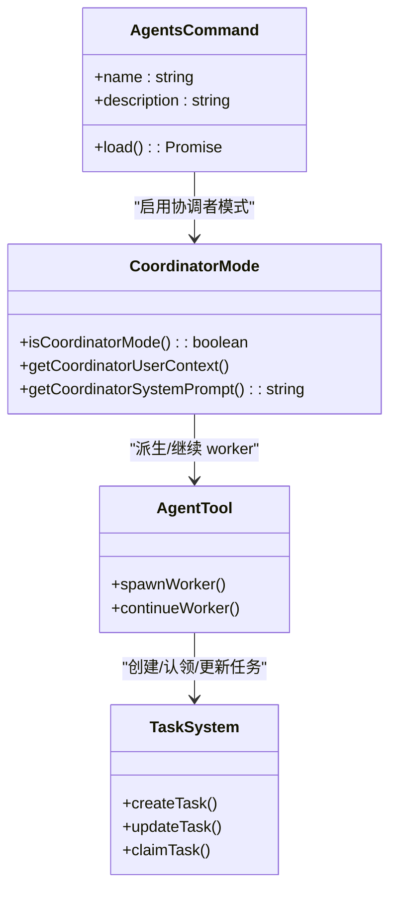
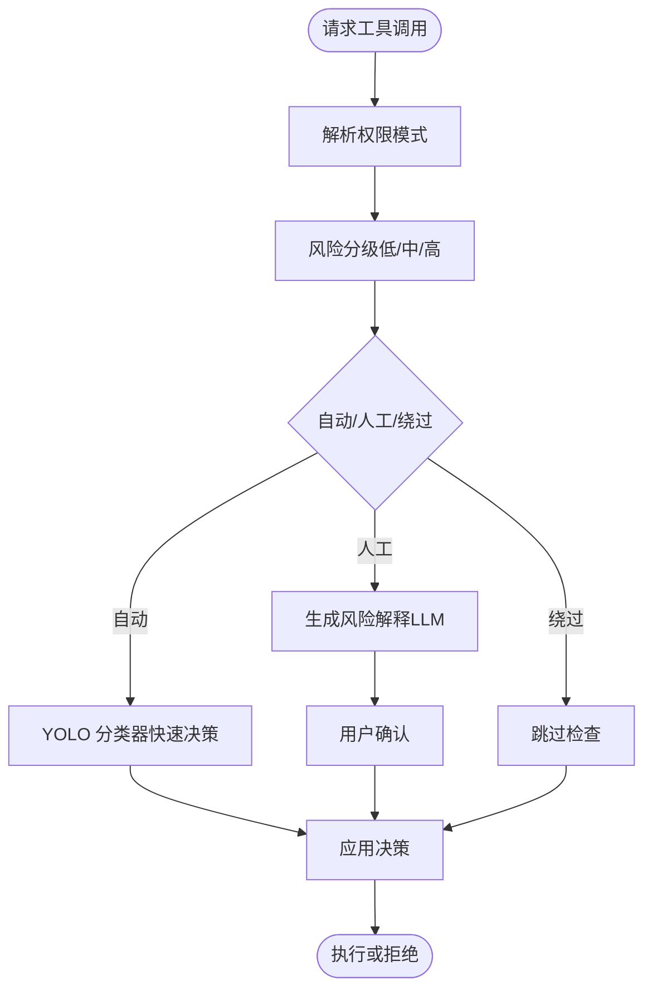
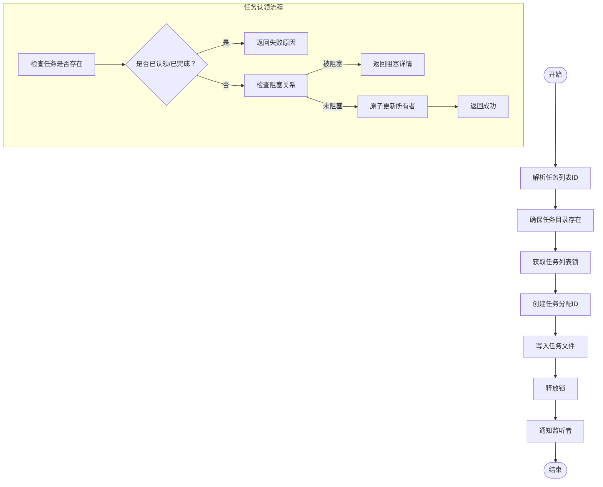
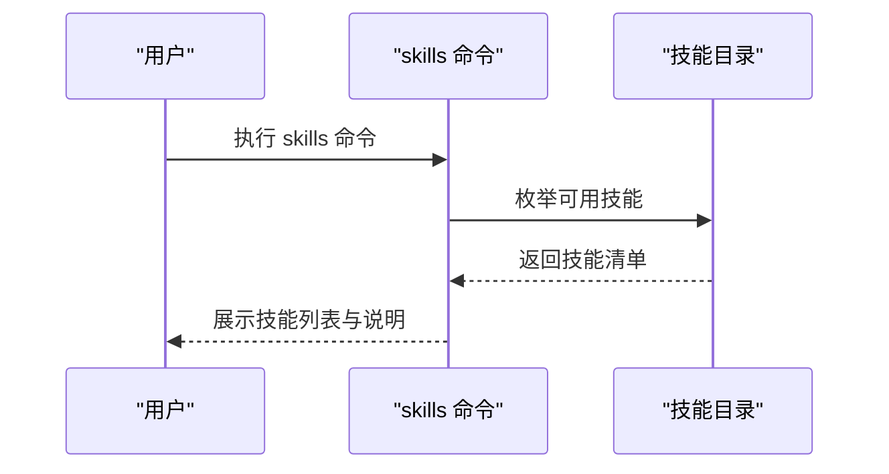
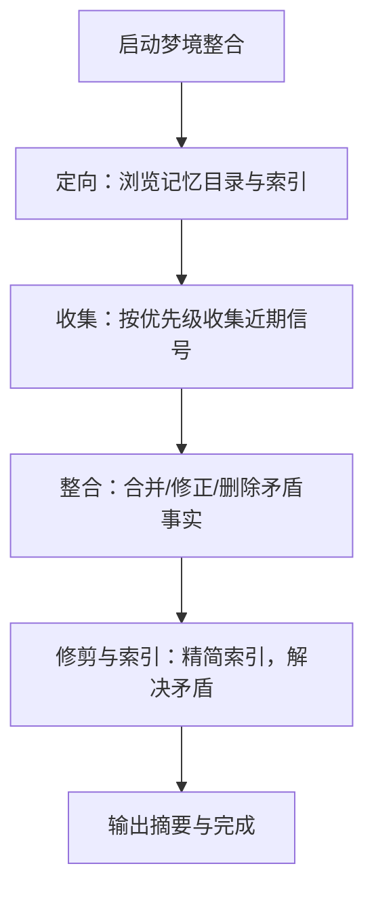
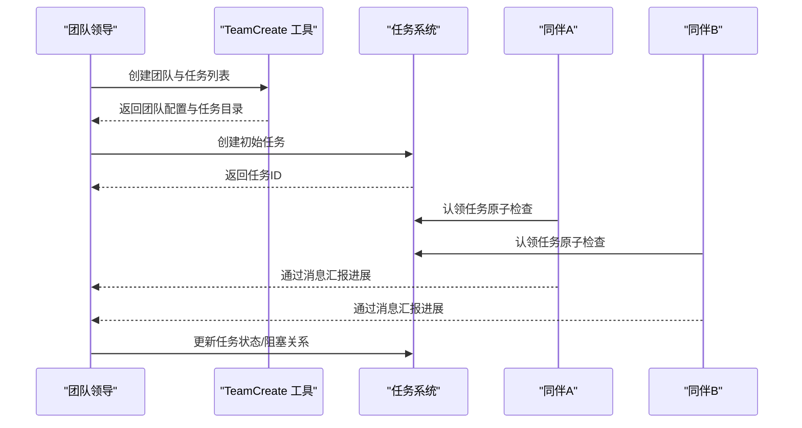
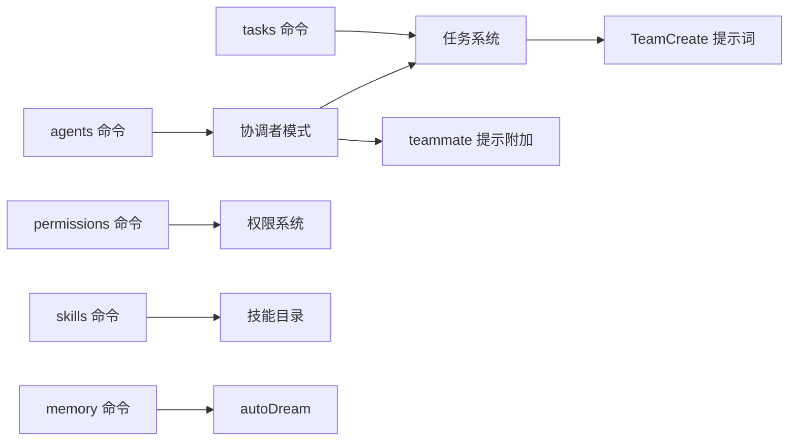

# 业务组件

<cite>
**本文引用的文件**
- [README.md](file://README.md)
- [coordinatorMode.ts](file://coordinator/coordinatorMode.ts)
- [tasks.ts](file://utils/tasks.ts)
- [prompt.ts（TeamCreateTool）](file://tools/TeamCreateTool/prompt.ts)
- [teammatePromptAddendum.ts](file://utils/swarm/teammatePromptAddendum.ts)
- [consolidationPrompt.ts（autoDream）](file://services/autoDream/consolidationPrompt.ts)
- [index.ts（commands/agents）](file://commands/agents/index.ts)
- [index.ts（commands/tasks）](file://commands/tasks/index.ts)
- [index.ts（commands/permissions）](file://commands/permissions/index.ts)
- [index.ts（commands/skills）](file://commands/skills/index.ts)
- [index.ts（commands/memory）](file://commands/memory/index.ts)
</cite>

## 目录
1. [引言](#引言)
2. [项目结构](#项目结构)
3. [核心组件](#核心组件)
4. [架构总览](#架构总览)
5. [详细组件分析](#详细组件分析)
6. [依赖分析](#依赖分析)
7. [性能考虑](#性能考虑)
8. [故障排查指南](#故障排查指南)
9. [结论](#结论)
10. [附录](#附录)

## 引言
本文件面向 Claude Code 的业务组件，聚焦以下领域：代理管理、权限控制、任务管理、技能系统、记忆与梦境（记忆整合）、团队协作与多智能体编排。我们将从功能职责、数据模型、交互逻辑、依赖关系、配置与扩展、状态管理与性能优化等方面进行系统化梳理，并辅以图示帮助理解。

## 项目结构
- 业务命令入口集中在 commands/* 下，分别提供 agents、tasks、permissions、skills、memory 等子命令的注册与加载。
- 多智能体编排与团队协作由 coordinator/* 提供；任务管理由 utils/tasks.ts 实现；团队提示词附加由 utils/swarm/* 提供；记忆整合由 services/autoDream/* 提供。
- README 对系统整体有宏观介绍，便于把握背景与边界。

图表来源
- [coordinatorMode.ts:111-370](file://coordinator/coordinatorMode.ts#L111-L370)
- [tasks.ts:199-241](file://utils/tasks.ts#L199-L241)
- [prompt.ts（TeamCreateTool）:1-114](file://tools/TeamCreateTool/prompt.ts#L1-L114)
- [teammatePromptAddendum.ts:1-19](file://utils/swarm/teammatePromptAddendum.ts#L1-L19)
- [consolidationPrompt.ts（autoDream）:1-66](file://services/autoDream/consolidationPrompt.ts#L1-L66)

章节来源
- [README.md:247-271](file://README.md#L247-L271)
- [index.ts（commands/agents）:1-11](file://commands/agents/index.ts#L1-L11)
- [index.ts（commands/tasks）:1-12](file://commands/tasks/index.ts#L1-L12)
- [index.ts（commands/permissions）:1-12](file://commands/permissions/index.ts#L1-L12)
- [index.ts（commands/skills）:1-11](file://commands/skills/index.ts#L1-L11)
- [index.ts（commands/memory）:1-11](file://commands/memory/index.ts#L1-L11)

## 核心组件
- 代理管理（Agents）
  - 职责：通过命令入口注册“agents”命令，用于管理代理配置与行为；在协调者模式下，配合 Agent 工具生成子代理，实现多智能体并行工作。
  - 关键点：命令类型为本地 JSX，加载器动态导入实现模块化。
- 权限控制（Permissions）
  - 职责：通过“permissions”命令管理允许/拒绝工具的规则，支持默认、自动、绕过、严格等模式，结合风险分级与受保护文件策略，保障安全。
  - 关键点：命令别名为 allowed-tools，体现其作为“工具许可”的角色。
- 任务管理（Tasks）
  - 职责：提供任务的创建、查询、更新、删除、阻塞关系维护、任务认领与状态统计等能力；支持多智能体共享任务列表与并发安全。
  - 关键点：基于文件系统的任务持久化与锁机制，确保并发一致性；提供任务列表 ID 解析与路径安全处理。
- 技能系统（Skills）
  - 职责：通过“skills”命令列出可用技能，支撑多智能体按需调用用户自定义技能，提升任务执行的可扩展性。
  - 关键点：命令入口注册为本地 JSX，便于后续扩展技能发现与管理界面。
- 记忆与梦境（Memory/Dream）
  - 职责：通过“memory”命令编辑记忆文件；autoDream 在后台周期性整合近期会话与日志，形成稳定记忆索引，降低未来会话的上下文负担。
  - 关键点：梦境整合分为定向、收集、整合、修剪与索引四个阶段，强调去重、消解矛盾与保持索引简洁。

章节来源
- [index.ts（commands/agents）:1-11](file://commands/agents/index.ts#L1-L11)
- [index.ts（commands/permissions）:1-12](file://commands/permissions/index.ts#L1-L12)
- [index.ts（commands/tasks）:1-12](file://commands/tasks/index.ts#L1-L12)
- [index.ts（commands/skills）:1-11](file://commands/skills/index.ts#L1-L11)
- [index.ts（commands/memory）:1-11](file://commands/memory/index.ts#L1-L11)
- [tasks.ts:69-89](file://utils/tasks.ts#L69-L89)
- [consolidationPrompt.ts（autoDream）:10-66](file://services/autoDream/consolidationPrompt.ts#L10-L66)

## 架构总览
- 协调者模式（Coordinator Mode）定义了“研究—合成—实现—验证”的四阶段流水线，鼓励并行与高内聚的任务分解；同时提供工具集与跨 worker 知识共享（可选草稿区）。
- 团队协作通过 TeamCreate 工具与任务系统联动：团队即任务列表，成员通过消息与任务双向协同；teammate 提示附加明确了可见性与通信约束。
- 任务系统采用文件级锁与高水位标记避免并发冲突与 ID 冲突；任务列表 ID 解析优先级覆盖了进程内同伴、进程式同伴、团队名、会话 ID 等场景。
- autoDream 作为后台子代理，定期对记忆目录与会话转录进行整合，形成稳定的索引文件，减少未来会话的认知成本。

图表来源
- [coordinatorMode.ts:111-370](file://coordinator/coordinatorMode.ts#L111-L370)
- [tasks.ts:284-308](file://utils/tasks.ts#L284-L308)
- [prompt.ts（TeamCreateTool）:37-111](file://tools/TeamCreateTool/prompt.ts#L37-L111)
- [teammatePromptAddendum.ts:8-18](file://utils/swarm/teammatePromptAddendum.ts#L8-L18)

## 详细组件分析

### 组件一：代理管理（Agents）
- 功能职责
  - 注册“agents”命令，提供代理配置管理入口；在协调者模式下，通过 Agent 工具派生子代理，承担研究、实现、验证等具体任务。
  - 支持不同 agent 类型与工具集合的匹配，避免越权操作（如只读代理不参与文件写入）。
- 数据模型与交互
  - 命令注册为本地 JSX，加载器动态导入，利于按需渲染与热更新。
  - 协调者模式下，Agent 工具返回的 worker 以 XML 通知形式回传状态与结果，避免与用户对话混淆。
- 配置与扩展
  - 可通过环境变量与特性开关控制是否启用协调者模式与简化模式。
  - MCP 客户端接入后，worker 可直接使用 MCP 工具，扩展能力。
- 状态管理与性能
  - 通过任务列表锁与原子检查避免并发争用；worker 结束后自动进入空闲状态，减少无效轮询。
- 依赖关系
  - 依赖协调者模式提示词与工具集；与任务系统协作完成任务认领与状态同步。

图表来源
- [index.ts（commands/agents）:1-11](file://commands/agents/index.ts#L1-L11)
- [coordinatorMode.ts:36-109](file://coordinator/coordinatorMode.ts#L36-L109)
- [tasks.ts:541-612](file://utils/tasks.ts#L541-L612)

章节来源
- [index.ts（commands/agents）:1-11](file://commands/agents/index.ts#L1-L11)
- [coordinatorMode.ts:111-370](file://coordinator/coordinatorMode.ts#L111-L370)

### 组件二：权限控制（Permissions）
- 功能职责
  - 管理工具使用许可规则，支持多种模式（默认交互、自动审批、绕过、严格）；对高风险工具动作进行风险分级与解释说明。
  - 保护敏感文件（如版本控制配置、shell 配置、密钥配置等），防止误改。
- 数据模型与交互
  - 命令别名为 allowed-tools，体现其作为“工具许可”的角色；通过 ML 分类器实现快速决策（YOLO 分类器）。
- 配置与扩展
  - 受特性门控与用户类型影响（内部用户可启用更多能力）；支持运行时特性缓存以避免阻塞主循环。
- 状态管理与性能
  - 权限决策采用缓存值，允许轻微陈旧；错误与异常路径清晰，避免阻断工具调用。
- 依赖关系
  - 与工具注册表、系统提示词、受保护文件清单共同构成权限体系。

图表来源
- [index.ts（commands/permissions）:1-12](file://commands/permissions/index.ts#L1-L12)

章节来源
- [index.ts（commands/permissions）:1-12](file://commands/permissions/index.ts#L1-L12)
- [README.md:347-361](file://README.md#L347-L361)

### 组件三：任务管理（Tasks）
- 功能职责
  - 提供任务的生命周期管理：创建、查询、更新、删除、阻塞关系维护、任务认领（含“是否忙碌”原子检查）、任务列表重置与高水位标记。
  - 支持多智能体共享同一任务列表，按团队名或会话 ID 解析任务存储位置。
- 数据模型与交互
  - 任务对象包含唯一 ID、主题、描述、活动形态、所有者、状态、阻塞与被阻塞任务列表、元数据等字段。
  - 任务列表 ID 解析优先级：显式环境变量 > 进程内同伴上下文 > 进程式同伴团队名 > 领导者团队名 > 会话 ID。
- 配置与扩展
  - 支持强制启用任务（非交互模式）；任务列表锁定与重试退避策略保证并发安全。
- 状态管理与性能
  - 文件级锁与高水位标记避免并发冲突与 ID 重复；监听信号用于同进程内的 UI 即时刷新。
- 依赖关系
  - 与团队配置文件协作，计算成员状态；与 TeamCreate 提示词协同，规范任务所有权与消息传递。

图表来源
- [tasks.ts:199-241](file://utils/tasks.ts#L199-L241)
- [tasks.ts:284-308](file://utils/tasks.ts#L284-L308)
- [tasks.ts:541-612](file://utils/tasks.ts#L541-L612)

章节来源
- [tasks.ts:69-89](file://utils/tasks.ts#L69-L89)
- [tasks.ts:199-241](file://utils/tasks.ts#L199-L241)
- [tasks.ts:284-308](file://utils/tasks.ts#L284-L308)
- [tasks.ts:370-391](file://utils/tasks.ts#L370-L391)
- [tasks.ts:393-441](file://utils/tasks.ts#L393-L441)
- [tasks.ts:443-456](file://utils/tasks.ts#L443-L456)
- [tasks.ts:458-486](file://utils/tasks.ts#L458-L486)
- [tasks.ts:541-612](file://utils/tasks.ts#L541-L612)
- [tasks.ts:763-798](file://utils/tasks.ts#L763-L798)
- [prompt.ts（TeamCreateTool）:24-46](file://tools/TeamCreateTool/prompt.ts#L24-L46)

### 组件四：技能系统（Skills）
- 功能职责
  - 通过“skills”命令列出可用技能，为多智能体提供可组合的执行单元，支持复杂任务的模块化拆分与复用。
- 数据模型与交互
  - 命令注册为本地 JSX，便于后续扩展技能发现、搜索与管理界面。
- 配置与扩展
  - 可与 MCP 服务器、项目技能目录集成，动态发现与加载技能。
- 状态管理与性能
  - 列表展示为主，无显著状态变更；可通过缓存与懒加载优化加载性能。
- 依赖关系
  - 与工具注册表、MCP 工具链、项目技能目录协同。

图表来源
- [index.ts（commands/skills）:1-11](file://commands/skills/index.ts#L1-L11)

章节来源
- [index.ts（commands/skills）:1-11](file://commands/skills/index.ts#L1-L11)

### 组件五：记忆与梦境（Memory/Dream）
- 功能职责
  - “memory”命令用于编辑记忆文件；autoDream 后台子代理定期整合近期会话与日志，形成稳定记忆索引，减少未来会话的认知成本。
- 数据模型与交互
  - 记忆整合分为四个阶段：定向（浏览现有记忆）、收集（近期信号）、整合（合并/修正）、修剪与索引（保持索引简洁与一致）。
- 配置与扩展
  - 可通过特性门控启用/禁用；支持额外上下文注入，增强整合效果。
- 状态管理与性能
  - 仅读取与写入，避免修改性操作；索引文件大小与行数限制，确保检索效率。
- 依赖关系
  - 依赖记忆目录与会话转录目录；遵循系统提示词中的记忆格式约定。

图表来源
- [consolidationPrompt.ts（autoDream）:10-66](file://services/autoDream/consolidationPrompt.ts#L10-L66)
- [index.ts（commands/memory）:1-11](file://commands/memory/index.ts#L1-L11)

章节来源
- [consolidationPrompt.ts（autoDream）:1-66](file://services/autoDream/consolidationPrompt.ts#L1-L66)
- [index.ts（commands/memory）:1-11](file://commands/memory/index.ts#L1-L11)

### 组件六：团队协作与多智能体编排
- 功能职责
  - TeamCreate 工具创建团队与对应任务列表；teammate 提示附加明确通信与可见性约束；协调者模式指导多智能体并行与流水线协作。
- 数据模型与交互
  - 团队配置包含领导 ID 与成员数组（名称、ID、类型）；任务列表与团队名一一对应。
  - 成员间通过 SendMessage 工具通信，消息自动投递至用户回合；同伴空闲通知提供信息摘要。
- 配置与扩展
  - 支持进程内同伴（共享任务列表）与进程式同伴（tmux/iTerm2）两种运行模式；可启用草稿区进行跨 worker 知识共享。
- 状态管理与性能
  - 通过任务所有权与阻塞关系驱动状态流转；同伴空闲减少无效轮询；原子认领与锁机制保证一致性。
- 依赖关系
  - 与任务系统、Agent 工具、SendMessage 工具紧密耦合；与协调者模式提示词协同。

图表来源
- [prompt.ts（TeamCreateTool）:24-111](file://tools/TeamCreateTool/prompt.ts#L24-L111)
- [tasks.ts:541-612](file://utils/tasks.ts#L541-L612)
- [teammatePromptAddendum.ts:8-18](file://utils/swarm/teammatePromptAddendum.ts#L8-L18)
- [coordinatorMode.ts:111-370](file://coordinator/coordinatorMode.ts#L111-L370)

章节来源
- [prompt.ts（TeamCreateTool）:1-114](file://tools/TeamCreateTool/prompt.ts#L1-L114)
- [tasks.ts:763-798](file://utils/tasks.ts#L763-L798)
- [teammatePromptAddendum.ts:1-19](file://utils/swarm/teammatePromptAddendum.ts#L1-L19)
- [coordinatorMode.ts:111-370](file://coordinator/coordinatorMode.ts#L111-L370)

## 依赖分析
- 命令层到业务组件
  - agents → 协调者模式 + Agent 工具 + 任务系统
  - tasks → 任务系统（文件锁、高水位、监听信号）
  - permissions → 权限系统（模式、风险分级、受保护文件）
  - skills → 技能目录（与 MCP/项目技能目录集成）
  - memory → autoDream（记忆整合）
- 业务组件到外部依赖
  - 任务系统依赖文件系统与锁库；权限系统依赖 ML 分类器与受保护文件清单；autoDream 依赖记忆目录与会话转录目录。
- 特性门控与环境变量
  - 协调者模式、草稿区、快速模式、Undercover 模式等通过特性门控与环境变量控制。

图表来源
- [index.ts（commands/agents）:1-11](file://commands/agents/index.ts#L1-L11)
- [index.ts（commands/tasks）:1-12](file://commands/tasks/index.ts#L1-L12)
- [index.ts（commands/permissions）:1-12](file://commands/permissions/index.ts#L1-L12)
- [index.ts（commands/skills）:1-11](file://commands/skills/index.ts#L1-L11)
- [index.ts（commands/memory）:1-11](file://commands/memory/index.ts#L1-L11)
- [tasks.ts:199-241](file://utils/tasks.ts#L199-L241)
- [prompt.ts（TeamCreateTool）:1-114](file://tools/TeamCreateTool/prompt.ts#L1-L114)
- [teammatePromptAddendum.ts:1-19](file://utils/swarm/teammatePromptAddendum.ts#L1-L19)

章节来源
- [README.md:389-413](file://README.md#L389-L413)

## 性能考虑
- 并发与锁
  - 任务系统采用文件级锁与重试退避策略，避免高并发下的竞争与死锁；任务列表级锁用于原子检查（如“是否忙碌”）。
- 缓存与惰性加载
  - 权限系统使用缓存特性值，允许轻微陈旧；工具 Schema 缓存减少提示词体积；命令加载采用动态导入，按需渲染。
- I/O 优化
  - autoDream 仅读取与写入，避免修改性操作；任务文件采用 JSON 存储，高水位标记避免 ID 冲突；索引文件大小与行数限制，提升检索效率。
- UI 刷新
  - 任务系统提供监听信号，同进程内 UI 可即时刷新，减少轮询开销。

## 故障排查指南
- 任务认领失败
  - 常见原因：任务不存在、已被他人认领、已完成、被其他任务阻塞、认领者正忙。
  - 排查步骤：检查任务状态与阻塞关系；确认任务列表锁是否正常；查看监听通知是否触发。
- 权限拒绝
  - 常见原因：风险等级过高、受保护文件、路径穿越攻击防护、自动审批失败。
  - 排查步骤：切换权限模式（默认/自动/绕过/严格）；检查 ML 分类器输出；核对受保护文件清单。
- 团队通信异常
  - 常见原因：消息未使用 SendMessage 工具、同伴未正确命名、空闲通知误解。
  - 排查步骤：确认消息目标为同伴名称；检查团队配置文件；理解空闲通知的信息性特征。
- autoDream 未更新索引
  - 常见原因：索引文件过大或行数过多、未满足整合条件。
  - 排查步骤：检查索引文件大小与行数；确认近期信号收集是否命中；核对整合与修剪逻辑。

章节来源
- [tasks.ts:488-500](file://utils/tasks.ts#L488-L500)
- [tasks.ts:541-612](file://utils/tasks.ts#L541-L612)
- [README.md:347-361](file://README.md#L347-L361)
- [prompt.ts（TeamCreateTool）:51-111](file://tools/TeamCreateTool/prompt.ts#L51-L111)
- [consolidationPrompt.ts（autoDream）:53-66](file://services/autoDream/consolidationPrompt.ts#L53-L66)

## 结论
本文件从命令入口、编排与协作、任务系统、权限控制、技能系统、记忆与梦境六个维度，系统梳理了 Claude Code 的业务组件。通过文件级锁、原子认领、特性门控与缓存策略，系统在保证安全性与一致性的同时，兼顾了性能与可扩展性。团队协作与多智能体编排在协调者模式与 TeamCreate 工具的配合下，实现了高效的任务分解与执行。

## 附录
- 命令入口一览
  - agents：注册代理管理命令
  - tasks：注册任务管理命令
  - permissions：注册权限管理命令
  - skills：注册技能列表命令
  - memory：注册记忆编辑命令
- 相关提示词与附加
  - 协调者模式系统提示词
  - Teammate 提示附加
  - TeamCreate 提示词
  - autoDream 记忆整合提示

章节来源
- [index.ts（commands/agents）:1-11](file://commands/agents/index.ts#L1-L11)
- [index.ts（commands/tasks）:1-12](file://commands/tasks/index.ts#L1-L12)
- [index.ts（commands/permissions）:1-12](file://commands/permissions/index.ts#L1-L12)
- [index.ts（commands/skills）:1-11](file://commands/skills/index.ts#L1-L11)
- [index.ts（commands/memory）:1-11](file://commands/memory/index.ts#L1-L11)
- [coordinatorMode.ts:111-370](file://coordinator/coordinatorMode.ts#L111-L370)
- [teammatePromptAddendum.ts:1-19](file://utils/swarm/teammatePromptAddendum.ts#L1-L19)
- [prompt.ts（TeamCreateTool）:1-114](file://tools/TeamCreateTool/prompt.ts#L1-L114)
- [consolidationPrompt.ts（autoDream）:1-66](file://services/autoDream/consolidationPrompt.ts#L1-L66)