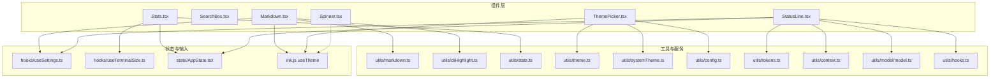
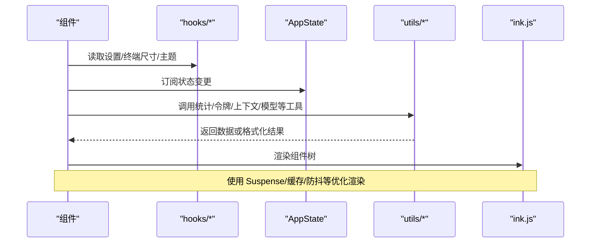
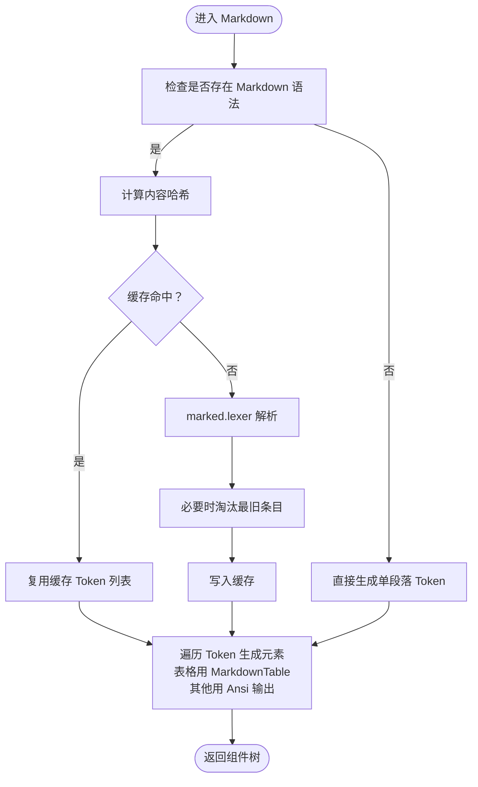
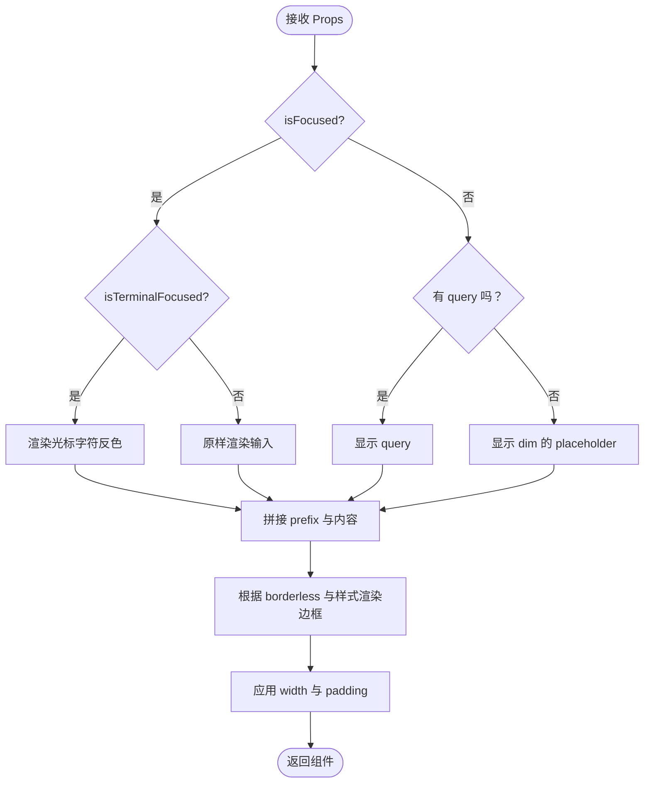
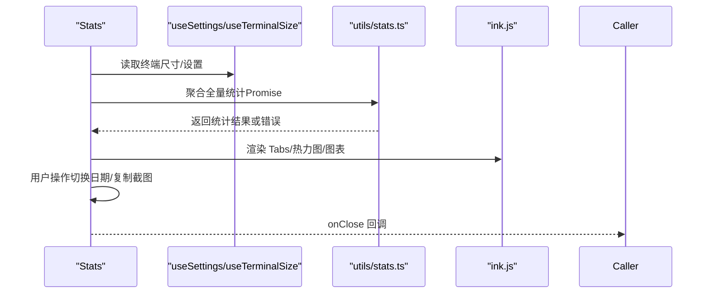
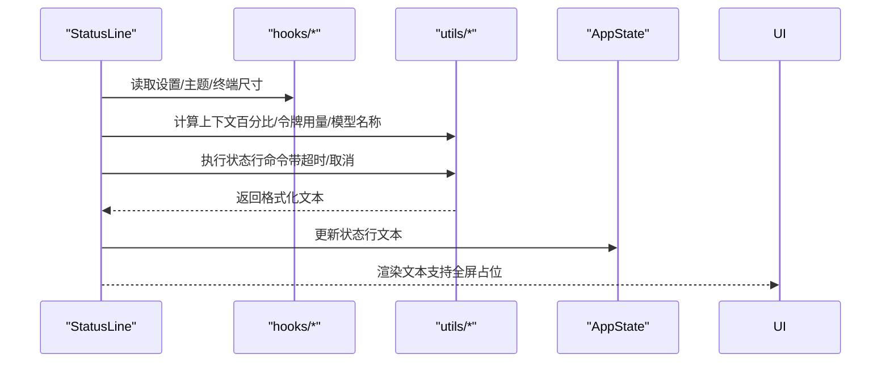
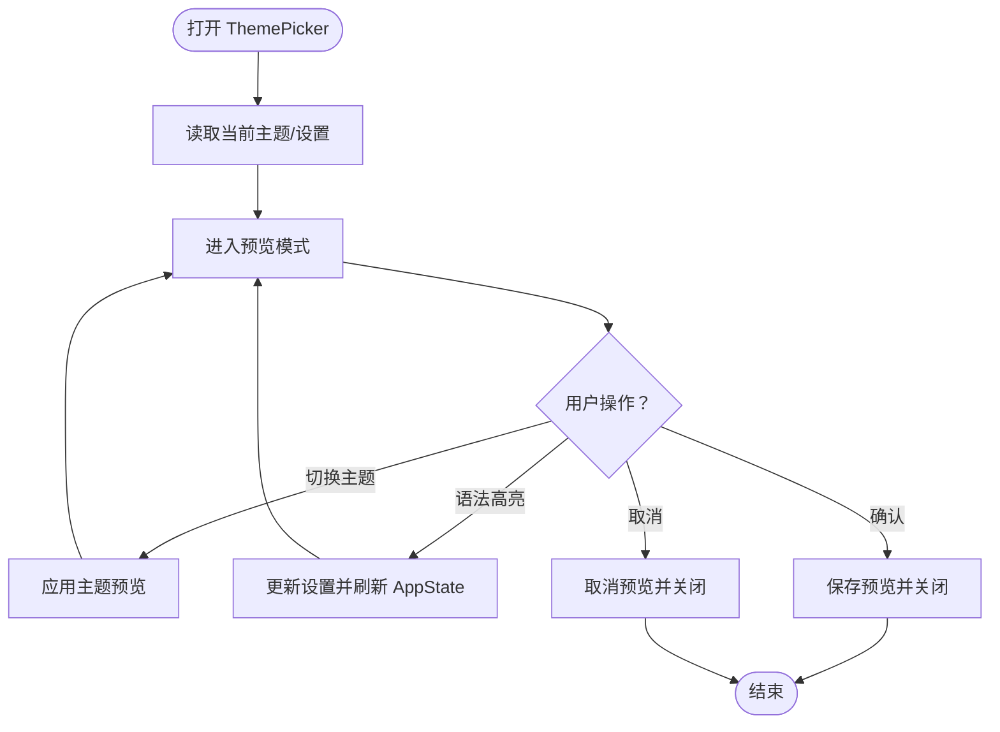
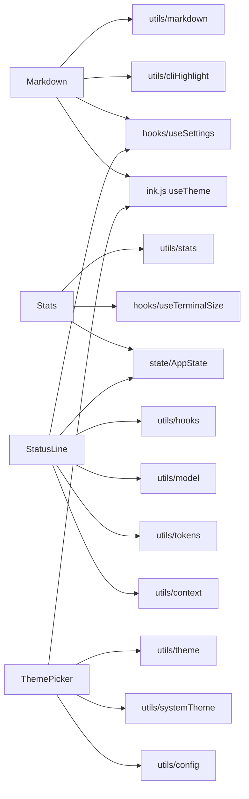

# 工具组件

<cite>
**本文引用的文件**
- [Markdown.tsx](file://components/Markdown.tsx)
- [SearchBox.tsx](file://components/SearchBox.tsx)
- [Stats.tsx](file://components/Stats.tsx)
- [StatusLine.tsx](file://components/StatusLine.tsx)
- [ThemePicker.tsx](file://components/ThemePicker.tsx)
- [Spinner.tsx](file://components/Spinner.tsx)
- [MarkdownTable.tsx](file://components/MarkdownTable.tsx)
- [StreamingMarkdown.tsx](file://components/Markdown.tsx)
- [useSettings.ts](file://hooks/useSettings.ts)
- [useTerminalSize.ts](file://hooks/useTerminalSize.ts)
- [useAppState.ts](file://state/AppState.tsx)
- [useTheme.ts](file://ink.js)
- [cliHighlight.ts](file://utils/cliHighlight.ts)
- [markdown.ts](file://utils/markdown.ts)
- [stats.ts](file://utils/stats.ts)
- [theme.ts](file://utils/theme.ts)
- [systemTheme.ts](file://utils/systemTheme.ts)
- [config.ts](file://utils/config.ts)
- [tokens.ts](file://utils/tokens.ts)
- [context.ts](file://utils/context.ts)
- [model.ts](file://utils/model/model.ts)
- [sessionStorage.ts](file://utils/sessionStorage.ts)
- [hooks.ts](file://utils/hooks.ts)
- [statusLine.ts](file://types/statusLine.ts)
- [textInputTypes.ts](file://types/textInputTypes.ts)
- [outputStyles.ts](file://constants/outputStyles.ts)
- [fullscreen.ts](file://utils/fullscreen.ts)
- [permissions.ts](file://utils/permissions/PermissionMode.ts)
- [claudeAiLimits.ts](file://services/claudeAiLimits.ts)
- [cost-tracker.ts](file://cost-tracker.ts)
- [messages.ts](file://utils/messages.ts)
- [worktree.ts](file://utils/worktree.ts)
- [PromptInput/utils.ts](file://components/PromptInput/utils.ts)
</cite>

## 目录
1. [简介](#简介)
2. [项目结构](#项目结构)
3. [核心组件](#核心组件)
4. [架构总览](#架构总览)
5. [详细组件分析](#详细组件分析)
6. [依赖关系分析](#依赖关系分析)
7. [性能考量](#性能考量)
8. [故障排查指南](#故障排查指南)
9. [结论](#结论)

## 简介
本文件系统性梳理 Claude Code 的“工具组件”，涵盖加载动画、Markdown 渲染、搜索框、统计信息、状态栏与主题选择器等。内容面向不同技术背景读者，既提供高层概览，也给出代码级的结构图、调用流程与时序图，帮助快速理解各组件的职责、配置项、可定制性与性能优化点。

## 项目结构
这些工具组件主要位于 components 目录下，配合 hooks、utils、services、types 等模块协作：
- 组件层：Markdown、SearchBox、Stats、StatusLine、ThemePicker、Spinner 等
- 工具与服务：markdown 解析、统计数据聚合、主题与高亮、终端尺寸、设置读取、令牌与上下文计算等
- 状态与输入：AppState、useSettings、useTerminalSize、useTheme、useKeybinding 等

图表来源
- [Markdown.tsx:1-236](file://components/Markdown.tsx#L1-L236)
- [Stats.tsx:1-311](file://components/Stats.tsx#L1-L311)
- [StatusLine.tsx:1-324](file://components/StatusLine.tsx#L1-L324)
- [ThemePicker.tsx:1-333](file://components/ThemePicker.tsx#L1-L333)
- [Spinner.tsx](file://components/Spinner.tsx)

章节来源
- [Markdown.tsx:1-236](file://components/Markdown.tsx#L1-L236)
- [Stats.tsx:1-311](file://components/Stats.tsx#L1-L311)
- [StatusLine.tsx:1-324](file://components/StatusLine.tsx#L1-L324)
- [ThemePicker.tsx:1-333](file://components/ThemePicker.tsx#L1-L333)

## 核心组件
- 加载动画（Spinner）：用于统计面板加载、状态行更新等场景，提供轻量的视觉反馈。
- Markdown 渲染（Markdown/StreamingMarkdown）：支持表格渲染、语法高亮、流式增量渲染，具备缓存与懒加载策略。
- 搜索框（SearchBox）：在终端界面中提供带前缀、占位符、光标偏移控制的输入框。
- 统计信息（Stats）：按时间范围聚合会话、令牌、模型使用、热力图等，支持复制截图。
- 状态栏（StatusLine）：根据消息、权限模式、模型等动态生成状态文本，支持防抖与日志记录。
- 主题选择器（ThemePicker）：提供主题预览、语法高亮开关、快捷键提示与帮助文案。

章节来源
- [Spinner.tsx](file://components/Spinner.tsx)
- [Markdown.tsx:1-236](file://components/Markdown.tsx#L1-L236)
- [SearchBox.tsx:1-72](file://components/SearchBox.tsx#L1-L72)
- [Stats.tsx:1-311](file://components/Stats.tsx#L1-L311)
- [StatusLine.tsx:1-324](file://components/StatusLine.tsx#L1-L324)
- [ThemePicker.tsx:1-333](file://components/ThemePicker.tsx#L1-L333)

## 架构总览
工具组件通过 hooks 与状态管理连接到应用核心，利用工具函数完成数据聚合与格式化，最终以 Ink 组件树渲染。

图表来源
- [Stats.tsx:82-111](file://components/Stats.tsx#L82-L111)
- [StatusLine.tsx:191-223](file://components/StatusLine.tsx#L191-L223)
- [Markdown.tsx:78-101](file://components/Markdown.tsx#L78-L101)
- [ThemePicker.tsx:30-75](file://components/ThemePicker.tsx#L30-L75)

## 详细组件分析

### Markdown 渲染组件
- 功能特性
  - 表格专用渲染组件，结合 Flex 布局；其他内容以 ANSI 字符串输出。
  - 语法高亮：延迟加载 CLI 高亮模块，失败时降级为纯文本。
  - 缓存：基于内容哈希的词法分析缓存，避免重复解析；对无 Markdown 语法的短文本直接走单段落路径。
  - 流式渲染：StreamingMarkdown 按块边界增量渲染，避免全量重算。
- 关键配置
  - 设置项：是否禁用语法高亮（影响高亮加载与降级）。
  - 主题：从 useTheme 获取当前主题，用于颜色映射。
  - 内容：children 字符串，内部会剥离提示 XML 标签后处理。
- 性能优化
  - 词法分析缓存（LRU 驱逐）、仅扫描前 500 字判断 Markdown 语法、流式增量边界推进。
- 可定制性
  - 通过主题与高亮模块控制颜色与语法着色；可传入 dimColor 控制整体明度。

图表来源
- [Markdown.tsx:32-71](file://components/Markdown.tsx#L32-L71)
- [Markdown.tsx:123-171](file://components/Markdown.tsx#L123-L171)
- [MarkdownTable.tsx](file://components/MarkdownTable.tsx)

章节来源
- [Markdown.tsx:1-236](file://components/Markdown.tsx#L1-L236)
- [MarkdownTable.tsx](file://components/MarkdownTable.tsx)
- [cliHighlight.ts](file://utils/cliHighlight.ts)
- [markdown.ts](file://utils/markdown.ts)
- [useSettings.ts](file://hooks/useSettings.ts)
- [useTheme.ts](file://ink.js)

### SearchBox 搜索框
- 功能特性
  - 支持前缀、占位符、宽度、边框样式、光标偏移等。
  - 根据焦点状态与终端焦点状态切换显示逻辑（含反色光标字符）。
  - 通过 Box/Text 组合实现 ANSI 边框与颜色控制。
- 关键配置
  - query：当前输入值
  - placeholder：默认提示文本
  - isFocused/isTerminalFocused：焦点与终端焦点状态
  - prefix：前缀图标或文本
  - width：宽度
  - cursorOffset：光标偏移
  - borderless：是否无边框
- 可定制性
  - 通过 props 调整外观与交互；结合键盘事件可扩展为命令行风格的输入框。

图表来源
- [SearchBox.tsx:14-71](file://components/SearchBox.tsx#L14-L71)

章节来源
- [SearchBox.tsx:1-72](file://components/SearchBox.tsx#L1-L72)

### Stats 统计面板
- 功能特性
  - 按日期范围（全部、7 天、30 天）聚合统计，支持热力图、模型使用、会话时长、连续活跃天数等。
  - 支持复制截图到剪贴板（通过 ANSI 文本）。
  - 使用 Suspense 异步加载，空数据与错误状态友好提示。
- 关键配置
  - onClose：关闭回调，支持结果与展示方式。
  - 日期范围切换：通过按键或命令触发。
  - 主题与终端宽度：用于热力图与布局适配。
- 性能优化
  - 全量数据先行加载，按需过滤缓存；滚动加载模型使用图表数据。
- 可定制性
  - 通过 Tabs/Pane 组织视图；支持键盘快捷键（如复制、切换日期范围）。

图表来源
- [Stats.tsx:82-111](file://components/Stats.tsx#L82-L111)
- [Stats.tsx:121-311](file://components/Stats.tsx#L121-L311)
- [stats.ts](file://utils/stats.ts)
- [useTerminalSize.ts](file://hooks/useTerminalSize.ts)

章节来源
- [Stats.tsx:1-311](file://components/Stats.tsx#L1-L311)
- [stats.ts](file://utils/stats.ts)
- [useTerminalSize.ts](file://hooks/useTerminalSize.ts)

### StatusLine 状态栏
- 功能特性
  - 根据消息、权限模式、Vim 模式、主循环模型等动态生成状态文本。
  - 防抖更新：仅在关键状态变化时触发，避免频繁重算。
  - 日志记录：首次挂载与命令热重载时记录遥测。
  - 全屏适配：在全屏环境下预留高度，避免布局抖动。
- 关键配置
  - messagesRef/lastAssistantMessageId：消息源与触发器。
  - vimMode：Vim 模式状态。
  - settings：状态行命令与内边距。
- 性能优化
  - 仅在消息 ID、权限模式、Vim 模式、模型变化时更新；使用 AbortController 取消过期请求。
- 可定制性
  - 通过状态行命令钩子注入上下文字段（模型、工作区、成本、上下文窗口、速率限制、代理/远程信息等）。

图表来源
- [StatusLine.tsx:138-324](file://components/StatusLine.tsx#L138-L324)
- [hooks.ts](file://utils/hooks.ts)
- [tokens.ts](file://utils/tokens.ts)
- [context.ts](file://utils/context.ts)
- [model.ts](file://utils/model/model.ts)
- [claudeAiLimits.ts](file://services/claudeAiLimits.ts)
- [cost-tracker.ts](file://cost-tracker.ts)
- [messages.ts](file://utils/messages.ts)
- [worktree.ts](file://utils/worktree.ts)
- [PromptInput/utils.ts](file://components/PromptInput/utils.ts)

章节来源
- [StatusLine.tsx:1-324](file://components/StatusLine.tsx#L1-L324)
- [statusLine.ts](file://types/statusLine.ts)
- [textInputTypes.ts](file://types/textInputTypes.ts)
- [outputStyles.ts](file://constants/outputStyles.ts)
- [fullscreen.ts](file://utils/fullscreen.ts)
- [permissions.ts](file://utils/permissions/PermissionMode.ts)

### ThemePicker 主题选择器
- 功能特性
  - 提供主题预览与保存、取消预览；支持语法高亮开关与快捷键提示。
  - 显示帮助文本与键盘提示，支持在特定上下文中跳过退出处理。
- 关键配置
  - onThemeSelect：主题选择回调
  - showIntroText/helpText/showHelpTextBelow：帮助文案控制
  - hideEscToCancel/skipExitHandling/onCancel：交互行为控制
- 可定制性
  - 通过 usePreviewTheme 与 useThemeSetting 实现预览与持久化；结合 useKeybinding 注册上下文。

图表来源
- [ThemePicker.tsx:30-120](file://components/ThemePicker.tsx#L30-L120)
- [useSettings.ts](file://hooks/useSettings.ts)
- [useTheme.ts](file://ink.js)
- [theme.ts](file://utils/theme.ts)
- [systemTheme.ts](file://utils/systemTheme.ts)
- [config.ts](file://utils/config.ts)

章节来源
- [ThemePicker.tsx:1-333](file://components/ThemePicker.tsx#L1-L333)
- [useSettings.ts](file://hooks/useSettings.ts)
- [useTheme.ts](file://ink.js)
- [theme.ts](file://utils/theme.ts)
- [systemTheme.ts](file://utils/systemTheme.ts)
- [config.ts](file://utils/config.ts)

### Spinner 加载动画
- 功能特性
  - 轻量的旋转/加载指示器，常用于 Stats、Markdown 首次高亮加载等场景。
- 可定制性
  - 与 Suspense 结合使用，等待异步资源加载完成后再渲染内容。

章节来源
- [Spinner.tsx](file://components/Spinner.tsx)

## 依赖关系分析
- 组件与工具函数
  - Markdown 依赖 utils/markdown 与 cliHighlight；SearchBox 依赖 ink.js 的 Box/Text；Stats 依赖 utils/stats；StatusLine 依赖 hooks 与 utils；ThemePicker 依赖 ink.js 主题与设置。
- 状态与输入
  - Stats/StatusLine 依赖 AppState；SearchBox/ThemePicker 依赖 useSettings/useTerminalSize/useTheme；Markdown 依赖 useSettings/useTheme。
- 外部集成
  - 主题与系统主题、配置、令牌与上下文计算、模型名称渲染、会话与工作树信息、速率限制等。

图表来源
- [Markdown.tsx:1-236](file://components/Markdown.tsx#L1-L236)
- [Stats.tsx:1-311](file://components/Stats.tsx#L1-L311)
- [StatusLine.tsx:1-324](file://components/StatusLine.tsx#L1-L324)
- [ThemePicker.tsx:1-333](file://components/ThemePicker.tsx#L1-L333)

章节来源
- [Markdown.tsx:1-236](file://components/Markdown.tsx#L1-L236)
- [Stats.tsx:1-311](file://components/Stats.tsx#L1-L311)
- [StatusLine.tsx:1-324](file://components/StatusLine.tsx#L1-L324)
- [ThemePicker.tsx:1-333](file://components/ThemePicker.tsx#L1-L333)

## 性能考量
- 渲染与缓存
  - Markdown：词法分析缓存、仅扫描前 500 字判断语法、流式增量渲染，显著降低重排成本。
  - Stats：全量数据先加载，按需过滤缓存；滚动加载模型列表，减少一次性渲染压力。
- 异步与防抖
  - Stats/StatusLine 使用 Suspense 与防抖，避免频繁请求与无效重渲染。
- 资源加载
  - Markdown 高亮模块延迟加载，失败时自动降级，保证可用性。
- 全屏与布局
  - StatusLine 在全屏环境预留空间，避免内容抖动。

## 故障排查指南
- Markdown 未显示高亮
  - 检查设置中的语法高亮开关；确认 CLI 高亮模块加载成功；若失败将自动降级。
- Stats 无法加载
  - 查看错误提示与空数据提示；确认网络与权限；尝试重新加载。
- StatusLine 不显示或空白
  - 检查信任对话是否已接受；查看日志提示；确认状态行命令可用且未被禁用。
- 主题选择器无效
  - 确认预览主题可用；检查系统主题模块可用性；核对设置更新是否生效。

章节来源
- [Markdown.tsx:80-101](file://components/Markdown.tsx#L80-L101)
- [Stats.tsx:231-251](file://components/Stats.tsx#L231-L251)
- [StatusLine.tsx:261-291](file://components/StatusLine.tsx#L261-L291)
- [ThemePicker.tsx:58-75](file://components/ThemePicker.tsx#L58-L75)

## 结论
上述工具组件围绕渲染、输入、统计、状态与主题五大维度构建，通过缓存、异步加载、防抖与布局适配等手段保障性能与体验。开发者可根据业务需求灵活组合这些组件，并通过设置与钩子扩展其行为与外观。