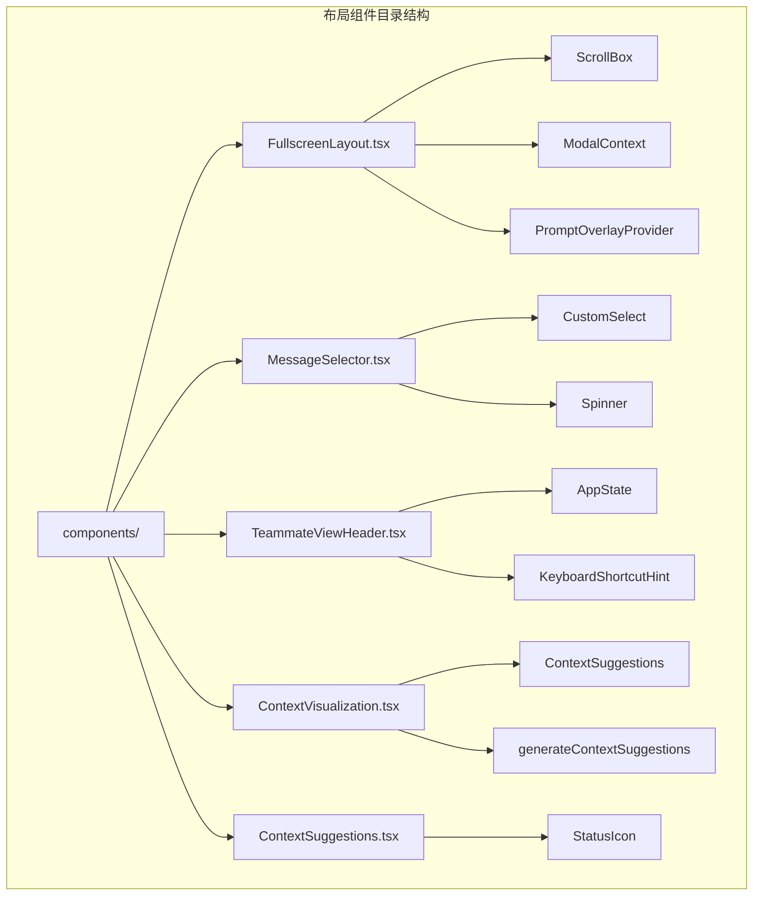
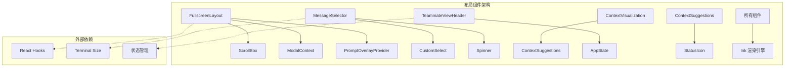
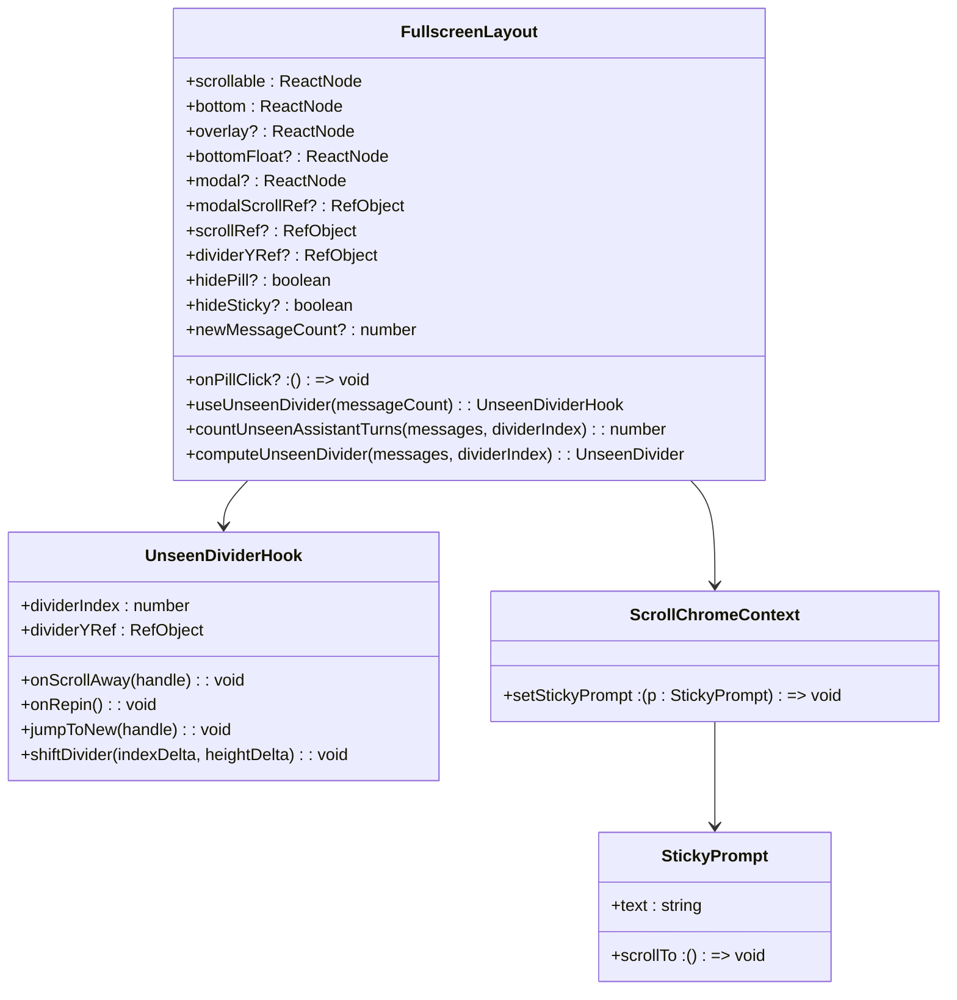
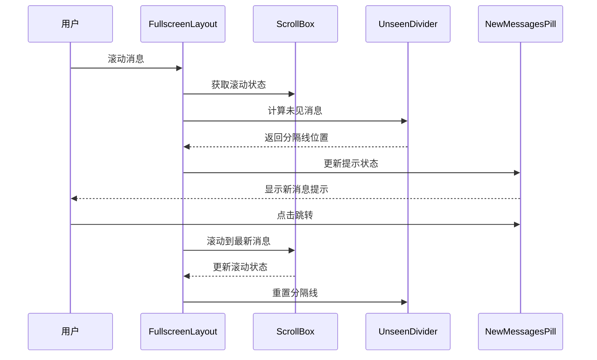
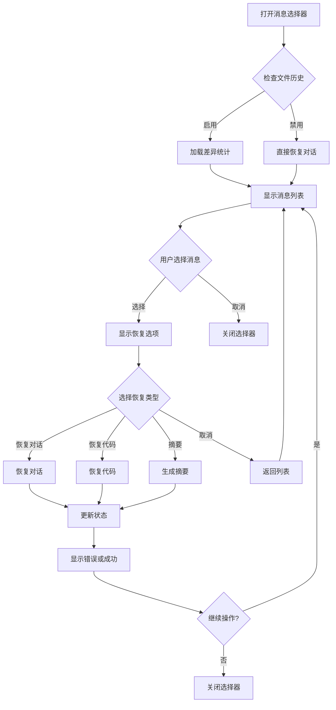
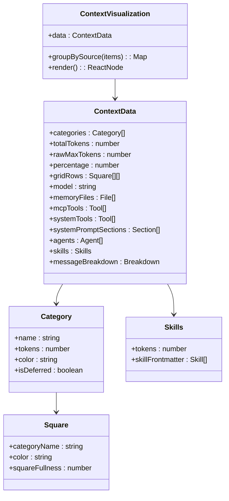
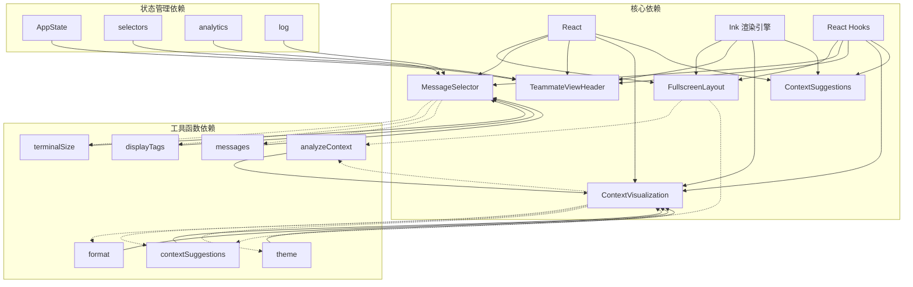

# 布局组件

<cite>
**本文档引用的文件**
- [FullscreenLayout.tsx](file://components/FullscreenLayout.tsx)
- [MessageSelector.tsx](file://components/MessageSelector.tsx)
- [TeammateViewHeader.tsx](file://components/TeammateViewHeader.tsx)
- [ContextVisualization.tsx](file://components/ContextVisualization.tsx)
- [ContextSuggestions.tsx](file://components/ContextSuggestions.tsx)
</cite>

## 目录
1. [简介](#简介)
2. [项目结构](#项目结构)
3. [核心组件](#核心组件)
4. [架构概览](#架构概览)
5. [详细组件分析](#详细组件分析)
6. [依赖分析](#依赖分析)
7. [性能考虑](#性能考虑)
8. [故障排除指南](#故障排除指南)
9. [结论](#结论)

## 简介

本文档详细介绍 Claude Code 应用中的布局组件系统，包括全屏布局、消息选择器、队友视图头部、上下文可视化和上下文建议等核心布局组件。这些组件共同构成了应用的用户界面布局框架，提供了响应式的屏幕适配机制和良好的用户体验。

布局组件系统采用基于 Ink 的终端渲染架构，通过 React 组件实现复杂的布局逻辑，支持动态内容渲染、滚动控制、状态管理等功能。每个组件都经过精心设计，以确保在不同终端尺寸下都能提供一致且优化的用户体验。

## 项目结构

布局组件主要位于 `components/` 目录下，按照功能模块进行组织：

**图表来源**
- [FullscreenLayout.tsx:1-637](file://components/FullscreenLayout.tsx#L1-L637)
- [MessageSelector.tsx:1-831](file://components/MessageSelector.tsx#L1-L831)
- [TeammateViewHeader.tsx:1-82](file://components/TeammateViewHeader.tsx#L1-L82)
- [ContextVisualization.tsx:1-489](file://components/ContextVisualization.tsx#L1-L489)
- [ContextSuggestions.tsx:1-47](file://components/ContextSuggestions.tsx#L1-L47)

**章节来源**
- [FullscreenLayout.tsx:1-637](file://components/FullscreenLayout.tsx#L1-L637)
- [MessageSelector.tsx:1-831](file://components/MessageSelector.tsx#L1-L831)
- [TeammateViewHeader.tsx:1-82](file://components/TeammateViewHeader.tsx#L1-L82)
- [ContextVisualization.tsx:1-489](file://components/ContextVisualization.tsx#L1-L489)
- [ContextSuggestions.tsx:1-47](file://components/ContextSuggestions.tsx#L1-L47)

## 核心组件

### 全屏布局组件 (FullscreenLayout)

全屏布局组件是应用的核心布局容器，负责管理整个界面的布局结构和交互逻辑。

**主要特性：**
- 支持全屏模式和非全屏模式切换
- 实现智能的滚动控制和粘性提示
- 提供模态对话框和覆盖层支持
- 集成链接点击处理和超链接支持

**关键功能：**
- `useUnseenDivider`: 跟踪未见消息分隔线的位置
- `FullscreenLayout`: 主要布局容器组件
- `NewMessagesPill`: 新消息提示胶囊
- `StickyPromptHeader`: 粘性提示头
- `SuggestionsOverlay`: 建议覆盖层
- `DialogOverlay`: 对话框覆盖层

**章节来源**
- [FullscreenLayout.tsx:1-637](file://components/FullscreenLayout.tsx#L1-L637)

### 消息选择器组件 (MessageSelector)

消息选择器组件允许用户在历史消息中进行选择和恢复操作。

**主要特性：**
- 支持消息列表的滚动浏览
- 提供代码和对话恢复选项
- 集成文件历史记录功能
- 支持摘要生成和上下文恢复

**关键功能：**
- `selectableUserMessagesFilter`: 过滤可选择的用户消息
- `computeDiffStatsBetweenMessages`: 计算消息间的差异统计
- `MessageSelector`: 主要选择器组件
- `UserMessageOption`: 用户消息选项显示

**章节来源**
- [MessageSelector.tsx:1-831](file://components/MessageSelector.tsx#L1-L831)

### 队友视图头部组件 (TeammateViewHeader)

队友视图头部组件显示当前查看的队友任务信息和相关控制。

**主要特性：**
- 显示队友名称和颜色标识
- 展示任务描述信息
- 提供退出快捷键提示
- 支持离屏冻结优化

**章节来源**
- [TeammateViewHeader.tsx:1-82](file://components/TeammateViewHeader.tsx#L1-L82)

### 上下文可视化组件 (ContextVisualization)

上下文可视化组件展示当前会话的上下文使用情况和相关信息。

**主要特性：**
- 显示令牌使用统计和百分比
- 展示各类上下文源的分布
- 提供 MCP 工具和系统工具信息
- 支持技能和代理人的可视化

**章节来源**
- [ContextVisualization.tsx:1-489](file://components/ContextVisualization.tsx#L1-L489)

### 上下文建议组件 (ContextSuggestions)

上下文建议组件提供基于当前上下文的优化建议。

**主要特性：**
- 显示上下文优化建议
- 提供节省的令牌数量
- 支持不同严重级别的状态图标
- 展示详细的建议说明

**章节来源**
- [ContextSuggestions.tsx:1-47](file://components/ContextSuggestions.tsx#L1-L47)

## 架构概览

布局组件系统采用分层架构设计，各组件之间通过清晰的接口进行通信：

**图表来源**
- [FullscreenLayout.tsx:1-637](file://components/FullscreenLayout.tsx#L1-L637)
- [MessageSelector.tsx:1-831](file://components/MessageSelector.tsx#L1-L831)
- [ContextVisualization.tsx:1-489](file://components/ContextVisualization.tsx#L1-L489)
- [ContextSuggestions.tsx:1-47](file://components/ContextSuggestions.tsx#L1-L47)
- [TeammateViewHeader.tsx:1-82](file://components/TeammateViewHeader.tsx#L1-L82)

## 详细组件分析

### 全屏布局组件深度分析

全屏布局组件是整个应用布局系统的核心，实现了复杂的状态管理和渲染逻辑：

**图表来源**
- [FullscreenLayout.tsx:1-637](file://components/FullscreenLayout.tsx#L1-L637)

**组件工作流程：**

**图表来源**
- [FullscreenLayout.tsx:1-637](file://components/FullscreenLayout.tsx#L1-L637)

**章节来源**
- [FullscreenLayout.tsx:1-637](file://components/FullscreenLayout.tsx#L1-L637)

### 消息选择器组件深度分析

消息选择器组件提供了强大的历史消息管理和恢复功能：

**图表来源**
- [MessageSelector.tsx:1-831](file://components/MessageSelector.tsx#L1-L831)

**章节来源**
- [MessageSelector.tsx:1-831](file://components/MessageSelector.tsx#L1-L831)

### 上下文可视化组件深度分析

上下文可视化组件提供了丰富的上下文信息展示功能：

**图表来源**
- [ContextVisualization.tsx:1-489](file://components/ContextVisualization.tsx#L1-L489)

**章节来源**
- [ContextVisualization.tsx:1-489](file://components/ContextVisualization.tsx#L1-L489)

## 依赖分析

布局组件之间的依赖关系形成了一个完整的生态系统：

**图表来源**
- [FullscreenLayout.tsx:1-637](file://components/FullscreenLayout.tsx#L1-L637)
- [MessageSelector.tsx:1-831](file://components/MessageSelector.tsx#L1-L831)
- [ContextVisualization.tsx:1-489](file://components/ContextVisualization.tsx#L1-L489)
- [ContextSuggestions.tsx:1-47](file://components/ContextSuggestions.tsx#L1-L47)
- [TeammateViewHeader.tsx:1-82](file://components/TeammateViewHeader.tsx#L1-L82)

**章节来源**
- [FullscreenLayout.tsx:1-637](file://components/FullscreenLayout.tsx#L1-L637)
- [MessageSelector.tsx:1-831](file://components/MessageSelector.tsx#L1-L831)
- [ContextVisualization.tsx:1-489](file://components/ContextVisualization.tsx#L1-L489)
- [ContextSuggestions.tsx:1-47](file://components/ContextSuggestions.tsx#L1-L47)
- [TeammateViewHeader.tsx:1-82](file://components/TeammateViewHeader.tsx#L1-L82)

## 性能考虑

布局组件系统在设计时充分考虑了性能优化：

### 渲染优化策略
- 使用 React.memo 缓存计算结果
- 实现稳定的上下文值避免不必要的重渲染
- 采用条件渲染减少 DOM 节点数量
- 优化滚动事件处理避免频繁重排

### 内存管理
- 合理使用 Ref 对象避免状态提升
- 及时清理事件监听器和订阅
- 控制数组和对象的创建频率
- 优化大列表的虚拟化渲染

### 响应式设计
- 动态适应终端尺寸变化
- 智能的内容截断和省略
- 自适应的布局网格系统
- 流畅的动画和过渡效果

## 故障排除指南

### 常见问题及解决方案

**布局错位问题**
- 检查终端尺寸获取是否正确
- 验证 CSS 样式是否被意外覆盖
- 确认 Ink 渲染引擎版本兼容性

**滚动性能问题**
- 优化长列表的虚拟化实现
- 减少不必要的状态更新
- 检查事件处理器的绑定和解绑

**内存泄漏问题**
- 确保所有事件监听器都有对应的清理函数
- 检查定时器和异步操作的清理
- 验证组件卸载时的状态清理

**章节来源**
- [FullscreenLayout.tsx:1-637](file://components/FullscreenLayout.tsx#L1-L637)
- [MessageSelector.tsx:1-831](file://components/MessageSelector.tsx#L1-L831)

## 结论

Claude Code 的布局组件系统展现了现代终端应用的优秀设计实践。通过精心设计的组件架构、完善的响应式支持和高效的性能优化，这些组件为用户提供了流畅、直观且功能丰富的交互体验。

主要优势包括：
- **模块化设计**：清晰的组件边界和职责分离
- **响应式适配**：智能的屏幕尺寸适应能力
- **性能优化**：高效的渲染和内存管理策略
- **用户体验**：直观的交互设计和反馈机制

这些布局组件不仅满足了当前的功能需求，还为未来的功能扩展和性能优化奠定了坚实的基础。通过持续的维护和改进，布局组件系统将继续为用户提供优秀的开发体验。