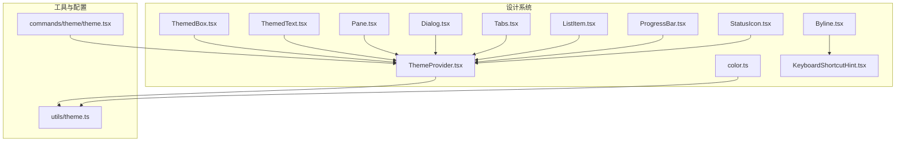
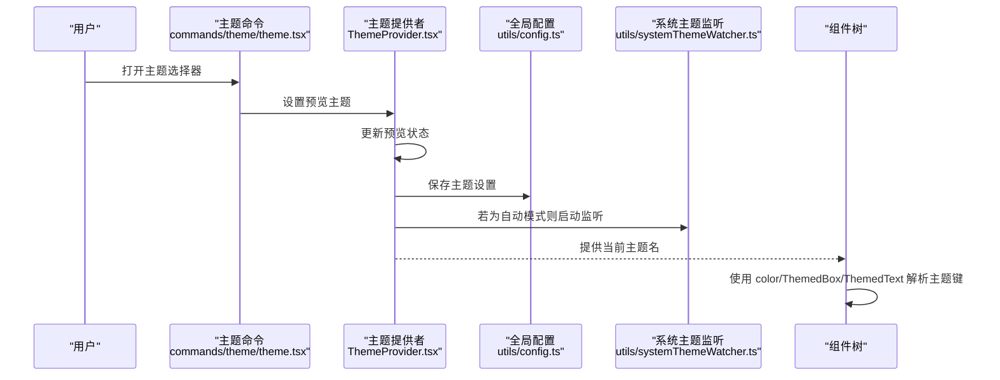
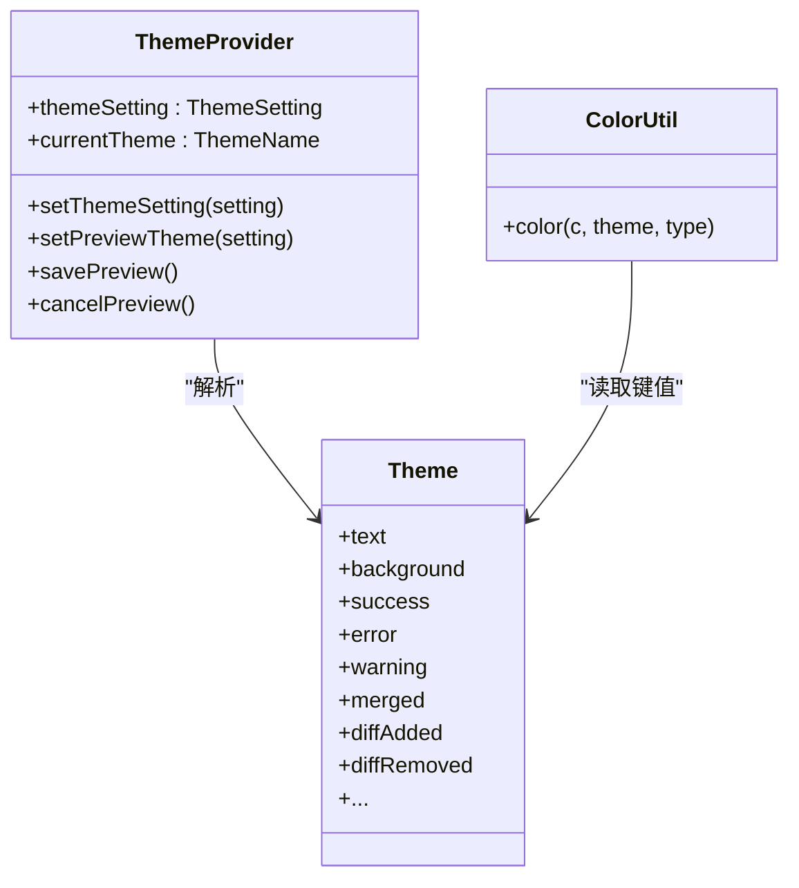
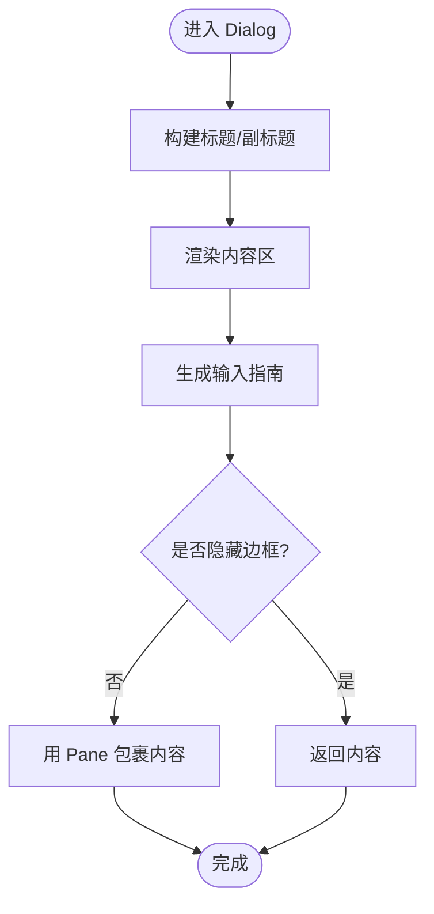
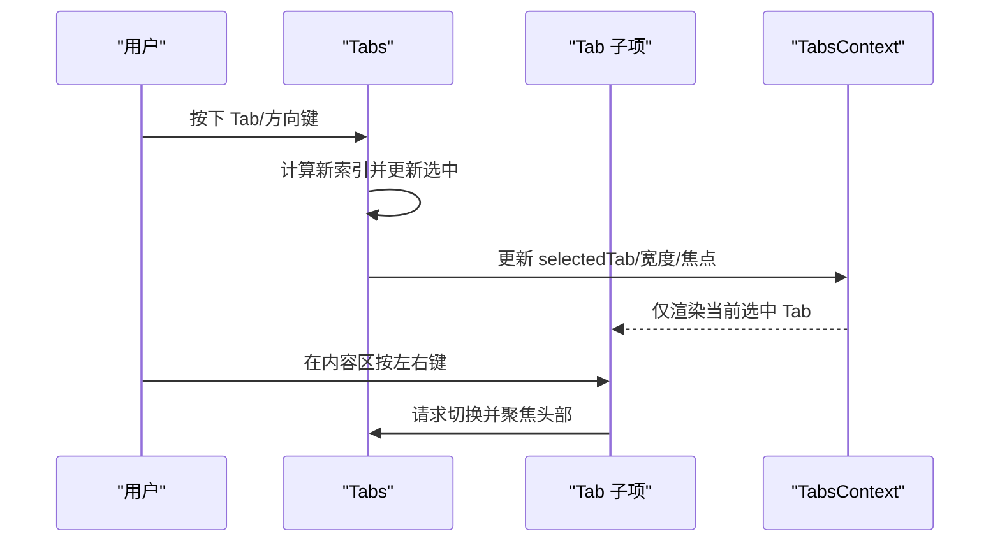
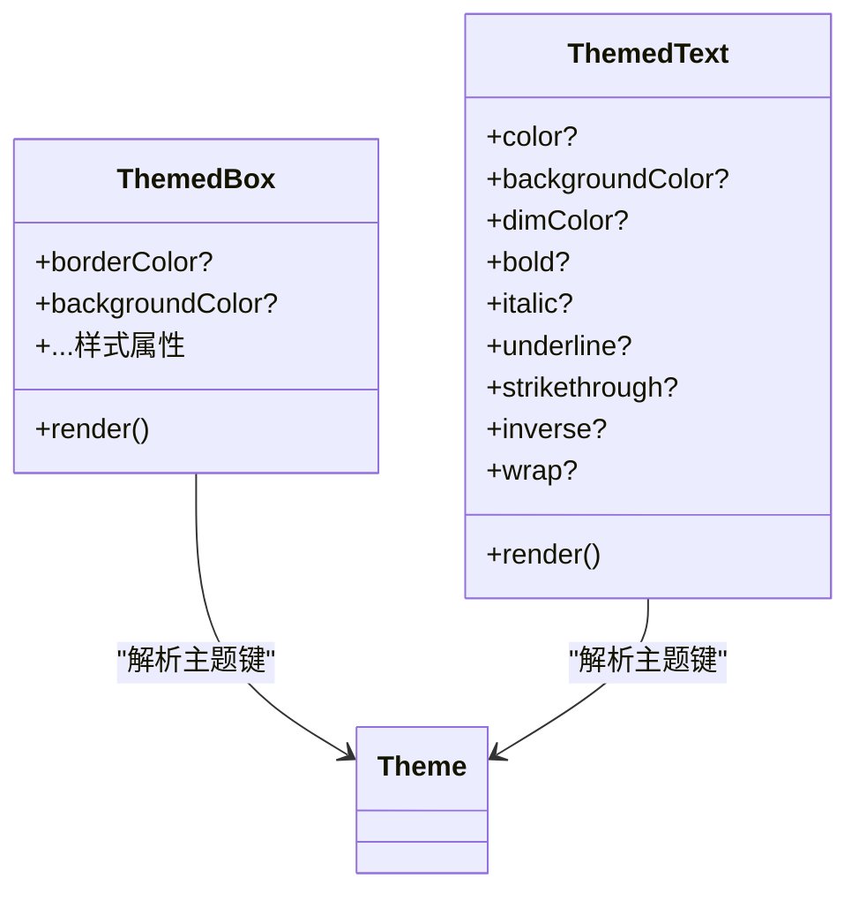
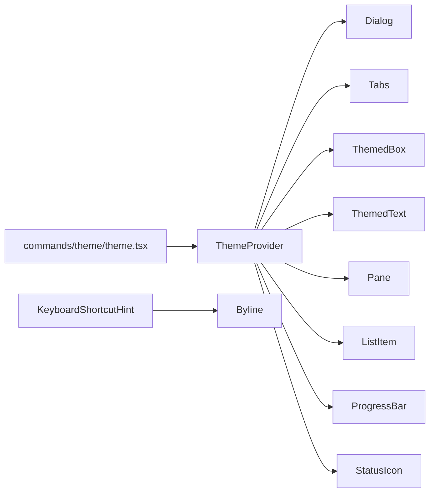

# 设计系统

<cite>
**本文档引用的文件**
- [App.tsx](file://components/App.tsx)
- [ThemeProvider.tsx](file://components/design-system/ThemeProvider.tsx)
- [color.ts](file://components/design-system/color.ts)
- [Dialog.tsx](file://components/design-system/Dialog.tsx)
- [Tabs.tsx](file://components/design-system/Tabs.tsx)
- [ThemedBox.tsx](file://components/design-system/ThemedBox.tsx)
- [ThemedText.tsx](file://components/design-system/ThemedText.tsx)
- [Pane.tsx](file://components/design-system/Pane.tsx)
- [Byline.tsx](file://components/design-system/Byline.tsx)
- [KeyboardShortcutHint.tsx](file://components/design-system/KeyboardShortcutHint.tsx)
- [ListItem.tsx](file://components/design-system/ListItem.tsx)
- [ProgressBar.tsx](file://components/design-system/ProgressBar.tsx)
- [StatusIcon.tsx](file://components/design-system/StatusIcon.tsx)
- [theme.ts](file://utils/theme.ts)
- [theme.tsx](file://commands/theme/theme.tsx)
</cite>

## 目录
1. [简介](#简介)
2. [项目结构](#项目结构)
3. [核心组件](#核心组件)
4. [架构总览](#架构总览)
5. [组件详解](#组件详解)
6. [依赖关系分析](#依赖关系分析)
7. [性能考量](#性能考量)
8. [故障排查指南](#故障排查指南)
9. [结论](#结论)
10. [附录](#附录)

## 简介
本设计系统面向基于 React 的终端交互界面（Ink 渲染器），提供统一的主题系统、颜色解析、对话框与标签页等核心 UI 组件。系统通过主题提供者集中管理用户偏好与系统主题联动，结合语义化颜色键值，实现跨组件的一致视觉与可访问性体验。同时，组件均兼容 Ink 的渲染特性，支持键盘快捷键、焦点声明与终端布局。

## 项目结构
设计系统位于 components/design-system 目录下，围绕以下关键模块组织：
- 主题与颜色：ThemeProvider、color 工具、主题常量与解析
- 基础容器与文本：ThemedBox、ThemedText、Pane
- 交互与布局：Dialog、Tabs、ListItem、ProgressBar、StatusIcon
- 辅助与提示：Byline、KeyboardShortcutHint
- 主题命令入口：commands/theme/theme.tsx

**图表来源**
- [ThemeProvider.tsx](file://components/design-system/ThemeProvider.tsx)
- [color.ts](file://components/design-system/color.ts)
- [ThemedBox.tsx](file://components/design-system/ThemedBox.tsx)
- [ThemedText.tsx](file://components/design-system/ThemedText.tsx)
- [Pane.tsx](file://components/design-system/Pane.tsx)
- [Dialog.tsx](file://components/design-system/Dialog.tsx)
- [Tabs.tsx](file://components/design-system/Tabs.tsx)
- [ListItem.tsx](file://components/design-system/ListItem.tsx)
- [ProgressBar.tsx](file://components/design-system/ProgressBar.tsx)
- [StatusIcon.tsx](file://components/design-system/StatusIcon.tsx)
- [Byline.tsx](file://components/design-system/Byline.tsx)
- [KeyboardShortcutHint.tsx](file://components/design-system/KeyboardShortcutHint.tsx)
- [theme.ts](file://utils/theme.ts)
- [theme.tsx](file://commands/theme/theme.tsx)

**章节来源**
- [App.tsx](file://components/App.tsx)
- [ThemeProvider.tsx](file://components/design-system/ThemeProvider.tsx)
- [theme.ts](file://utils/theme.ts)

## 核心组件
- 主题提供者与上下文：集中管理用户主题设置、预览、保存与系统主题联动
- 颜色解析工具：将主题键映射到具体颜色值，支持原始颜色直传
- 容器与文本：主题感知的 Box 与 Text 包装器，自动解析主题色
- 对话框与标签页：提供确认/取消、输入引导、键盘导航与内容区域布局
- 列表项与进度条：状态指示与滚动提示，支持焦点声明与自定义样式
- 状态图标：根据状态选择图标与颜色，支持尾随空格

**章节来源**
- [ThemeProvider.tsx](file://components/design-system/ThemeProvider.tsx)
- [color.ts](file://components/design-system/color.ts)
- [ThemedBox.tsx](file://components/design-system/ThemedBox.tsx)
- [ThemedText.tsx](file://components/design-system/ThemedText.tsx)
- [Dialog.tsx](file://components/design-system/Dialog.tsx)
- [Tabs.tsx](file://components/design-system/Tabs.tsx)
- [ListItem.tsx](file://components/design-system/ListItem.tsx)
- [ProgressBar.tsx](file://components/design-system/ProgressBar.tsx)
- [StatusIcon.tsx](file://components/design-system/StatusIcon.tsx)

## 架构总览
设计系统采用“主题提供者 + 主题解析 + 组件包装”的分层架构：
- 主题提供者负责持久化与实时切换，支持“自动”跟随系统主题
- 颜色工具在渲染前将主题键解析为具体颜色
- 组件通过 useTheme 获取当前主题名，并在需要时直接使用 color 工具或由包装器自动解析

**图表来源**
- [theme.tsx](file://commands/theme/theme.tsx)
- [ThemeProvider.tsx](file://components/design-system/ThemeProvider.tsx)
- [theme.ts](file://utils/theme.ts)

## 组件详解

### 主题提供者与颜色系统
- 主题提供者
  - 支持初始状态、保存回调、预览与取消预览
  - “自动”模式下监听系统主题变化并即时更新
  - 暴露 useTheme/useThemeSetting/usePreviewTheme 三类钩子
- 颜色系统
  - 主题键到颜色值的映射由 utils/theme.ts 提供
  - color 工具支持主题键与原始颜色（rgb/十六进制/ansi/ansi256）混合
  - 组件内部优先使用包装器（如 ThemedBox/ThemedText）自动解析

**图表来源**
- [ThemeProvider.tsx](file://components/design-system/ThemeProvider.tsx)
- [color.ts](file://components/design-system/color.ts)
- [theme.ts](file://utils/theme.ts)

**章节来源**
- [ThemeProvider.tsx](file://components/design-system/ThemeProvider.tsx)
- [color.ts](file://components/design-system/color.ts)
- [theme.ts](file://utils/theme.ts)

### 对话框组件 Dialog
- 功能要点
  - 标题、副标题、内容区、取消回调
  - 输入引导（默认/自定义），支持隐藏边框与边框颜色
  - 键盘绑定：Esc 取消、Enter 确认；可禁用内置取消以让嵌入输入框接管
- 交互细节
  - 自动注册确认/取消键位，结合退出键绑定显示二次确认提示
  - 可选的“仅输入指南”自定义函数，接收退出状态

**图表来源**
- [Dialog.tsx](file://components/design-system/Dialog.tsx)

**章节来源**
- [Dialog.tsx](file://components/design-system/Dialog.tsx)

### 标签页组件 Tabs
- 功能要点
  - 支持标题、颜色、默认选中、隐藏、全宽、受控/非受控模式
  - 内容固定高度（溢出隐藏）避免切换导致布局抖动
  - 键盘导航：左右/Tab 在头部与内容间切换
  - 可选从内容区接收左右键进行切换，并自动聚焦头部
- 上下文与焦点
  - TabsContext 提供当前选中标签、宽度、头部焦点状态与注册 opt-in
  - 子组件可通过 useTabsWidth/useTabHeaderFocus 获取宽度与焦点控制

**图表来源**
- [Tabs.tsx](file://components/design-system/Tabs.tsx)

**章节来源**
- [Tabs.tsx](file://components/design-system/Tabs.tsx)

### 主题化容器与文本
- ThemedBox
  - 将 border* 与 backgroundColor 的主题键解析为具体颜色后传递给底层 Box
  - 支持 ref、事件与样式透传
- ThemedText
  - 将 color/backgroundColor 的主题键解析为颜色
  - 支持 dimColor（使用 inactive）、inverse、bold/italic/underline/strikethrough/wrap
  - 提供 TextHoverColorContext 覆盖子树颜色（优先级高于显式 color）

**图表来源**
- [ThemedBox.tsx](file://components/design-system/ThemedBox.tsx)
- [ThemedText.tsx](file://components/design-system/ThemedText.tsx)
- [theme.ts](file://utils/theme.ts)

**章节来源**
- [ThemedBox.tsx](file://components/design-system/ThemedBox.tsx)
- [ThemedText.tsx](file://components/design-system/ThemedText.tsx)

### 其他重要组件
- Pane：带顶部彩色分割线的面板容器，支持模态场景下的简化渲染
- Byline：内联元数据分隔符（·），自动过滤无效子节点
- KeyboardShortcutHint：快捷键提示文本，支持括号包裹与加粗
- ListItem：列表项通用模式（焦点指针、选中勾选、滚动箭头、描述行）
- ProgressBar：按比例绘制块状进度条，支持填充/空闲颜色
- StatusIcon：根据状态选择图标与颜色，支持尾随空格

**章节来源**
- [Pane.tsx](file://components/design-system/Pane.tsx)
- [Byline.tsx](file://components/design-system/Byline.tsx)
- [KeyboardShortcutHint.tsx](file://components/design-system/KeyboardShortcutHint.tsx)
- [ListItem.tsx](file://components/design-system/ListItem.tsx)
- [ProgressBar.tsx](file://components/design-system/ProgressBar.tsx)
- [StatusIcon.tsx](file://components/design-system/StatusIcon.tsx)

## 依赖关系分析
- 组件对主题提供者的依赖
  - 大多数组件通过 useTheme 获取当前主题名，再由 color 或包装器解析主题键
- 组件间的协作
  - Dialog 与 KeyboardShortcutHint/Byline 协作提供输入指南
  - Tabs 与 Tab 子项通过上下文共享状态
  - ThemedBox/ThemedText 作为通用装饰器被各组件复用
- 主题命令入口
  - commands/theme/theme.tsx 通过 ThemePicker 与 ThemeProvider 交互，实现主题切换与保存

**图表来源**
- [ThemeProvider.tsx](file://components/design-system/ThemeProvider.tsx)
- [Dialog.tsx](file://components/design-system/Dialog.tsx)
- [Tabs.tsx](file://components/design-system/Tabs.tsx)
- [ThemedBox.tsx](file://components/design-system/ThemedBox.tsx)
- [ThemedText.tsx](file://components/design-system/ThemedText.tsx)
- [Pane.tsx](file://components/design-system/Pane.tsx)
- [ListItem.tsx](file://components/design-system/ListItem.tsx)
- [ProgressBar.tsx](file://components/design-system/ProgressBar.tsx)
- [StatusIcon.tsx](file://components/design-system/StatusIcon.tsx)
- [theme.tsx](file://commands/theme/theme.tsx)

**章节来源**
- [theme.tsx](file://commands/theme/theme.tsx)
- [ThemeProvider.tsx](file://components/design-system/ThemeProvider.tsx)

## 性能考量
- 渲染优化
  - 大量组件使用 React 缓存策略（如局部记忆化），减少重复计算与重渲染
  - Tabs 的内容区域固定高度与溢出隐藏，避免切换时布局抖动
- 主题解析
  - 颜色解析在渲染阶段进行，建议在上层组件缓存解析结果或复用包装器
- 键盘与焦点
  - 通过 useDeclaredCursor 声明光标位置，避免额外的焦点管理开销

[本节为通用指导，不涉及具体代码片段]

## 故障排查指南
- 主题未生效
  - 检查 ThemeProvider 是否包裹应用根部；确认 useTheme 返回的主题名与期望一致
  - 若为“自动”，确认系统主题监听已启用且无外部构建排除
- 颜色显示异常
  - 确认使用的颜色键存在于主题映射中；若传入原始颜色，确保格式正确（rgb/#/ansi/ansi256）
- 键盘绑定冲突
  - Dialog 默认消费 Esc/Enter；若嵌入输入框，请将 isCancelActive 设为 false，交由输入框处理
- Tabs 导航失效
  - 确认未禁用导航；若内容区自行处理左右键，请开启 navFromContent 并在内容区失焦时聚焦头部

**章节来源**
- [ThemeProvider.tsx](file://components/design-system/ThemeProvider.tsx)
- [Dialog.tsx](file://components/design-system/Dialog.tsx)
- [Tabs.tsx](file://components/design-system/Tabs.tsx)

## 结论
该设计系统以 ThemeProvider 为核心，结合 color 工具与主题键映射，实现了跨组件一致的颜色体系与可访问性保障。通过 ThemedBox/ThemedText 等包装器，组件无需关心颜色解析细节即可获得主题化外观。Dialog/Tabs 等复合组件提供了丰富的交互能力与键盘导航，满足终端场景下的高效操作需求。整体架构清晰、职责分离，便于扩展与维护。

[本节为总结性内容，不涉及具体代码片段]

## 附录

### 主题键与颜色规范
- 语义化命名
  - 文本与背景：text、background、inverseText
  - 状态：success、error、warning、merged、suggestion
  - 差异：diffAdded、diffRemoved、diffAddedDimmed、diffRemovedDimmed、diffAddedWord、diffRemovedWord
  - 代理/智能体：agent 系列颜色键
  - 其他：promptBorder、bashBorder、rate_limit_fill、rate_limit_empty、fastMode 等
- 可访问性
  - 使用 inactive 作为 dimColor 的语义化来源
  - 建议在高对比度场景下优先使用语义键而非硬编码颜色
- 颜色值类型
  - 支持主题键与原始颜色（rgb、#、ansi256、ansi）

**章节来源**
- [theme.ts](file://utils/theme.ts)

### 组件使用示例与最佳实践
- 使用主题键
  - 在需要颜色的组件上直接传入主题键（如 color="success"）
  - 需要背景色时使用 backgroundColor="..."（键名限定）
- 自定义颜色
  - 传入原始颜色字符串（rgb/十六进制/ansi/ansi256）绕过主题解析
- 扩展与继承
  - 新组件建议封装为主题感知版本（如 ThemedBox/ThemedText）
  - 复杂交互组件可参考 Dialog/Tabs 的上下文与键盘绑定模式
- 与 Ink 集成
  - 使用 useDeclaredCursor 声明光标位置
  - 注意 Ink 的样式级联与覆盖规则，必要时使用 TextHoverColorContext

**章节来源**
- [ThemedBox.tsx](file://components/design-system/ThemedBox.tsx)
- [ThemedText.tsx](file://components/design-system/ThemedText.tsx)
- [Dialog.tsx](file://components/design-system/Dialog.tsx)
- [Tabs.tsx](file://components/design-system/Tabs.tsx)