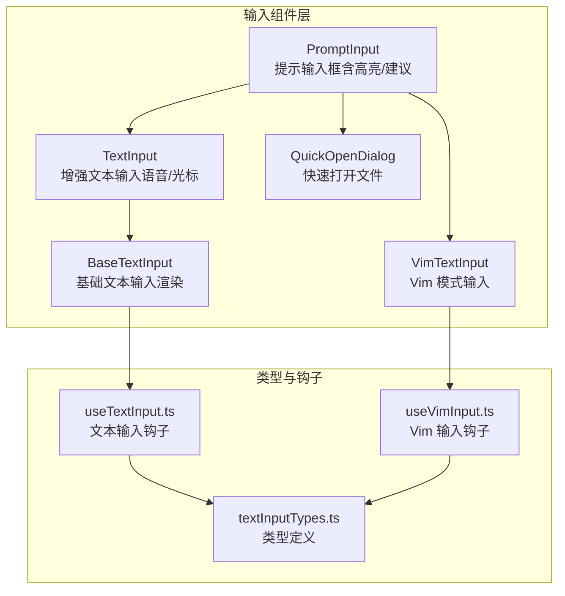
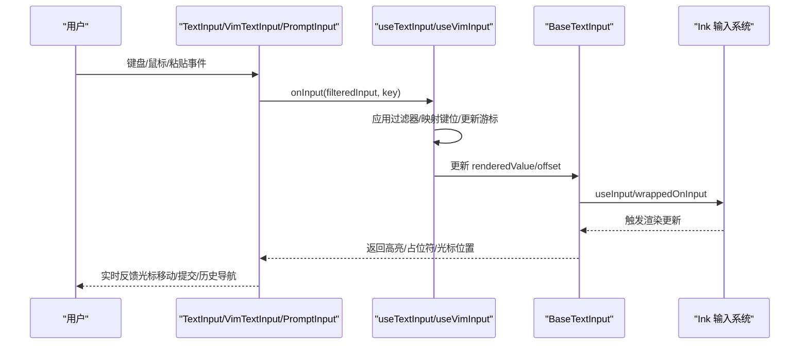
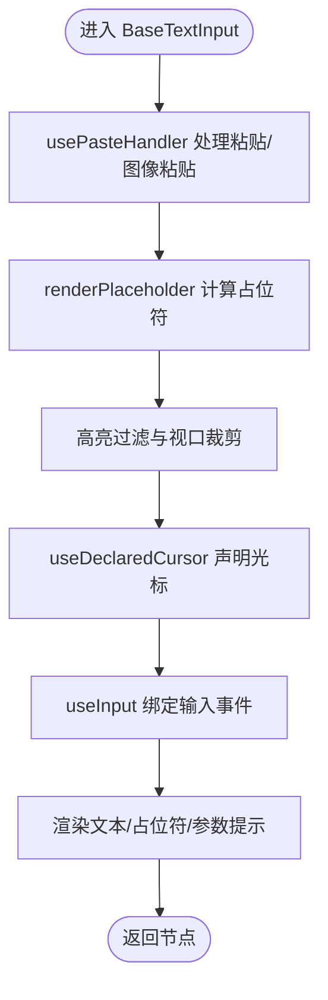
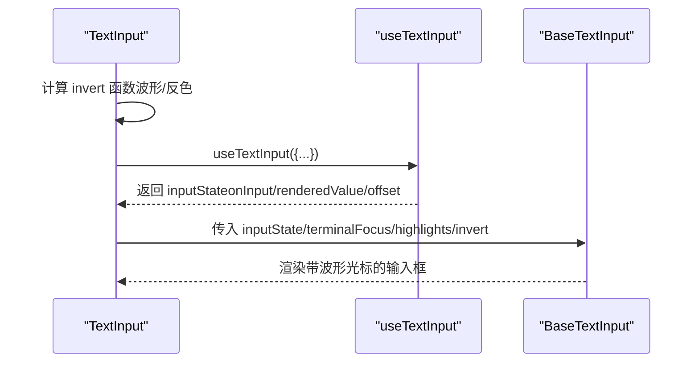
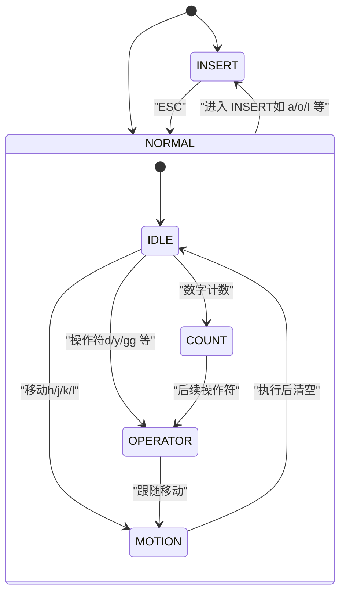
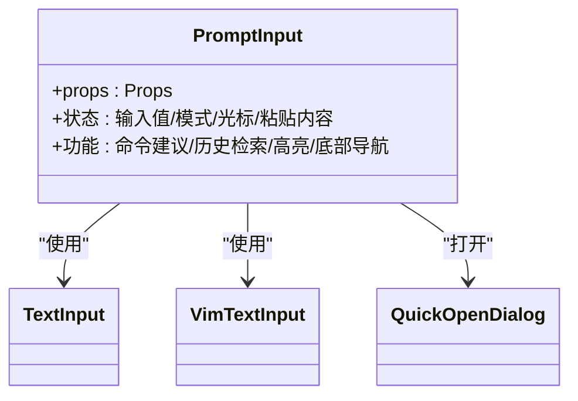
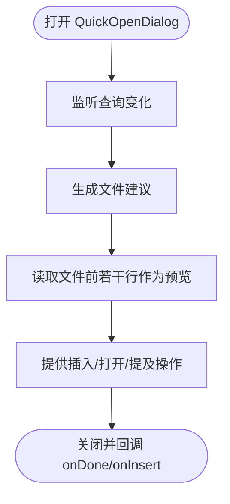
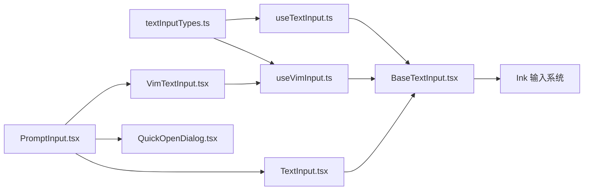

# 输入组件

<cite>
**本文档引用的文件**
- [components/TextInput.tsx](file://components/TextInput.tsx)
- [components/VimTextInput.tsx](file://components/VimTextInput.tsx)
- [components/BaseTextInput.tsx](file://components/BaseTextInput.tsx)
- [components/QuickOpenDialog.tsx](file://components/QuickOpenDialog.tsx)
- [components/PromptInput/PromptInput.tsx](file://components/PromptInput/PromptInput.tsx)
- [components/PromptInput/inputModes.ts](file://components/PromptInput/inputModes.ts)
- [components/PromptInput/utils.ts](file://components/PromptInput/utils.ts)
- [types/textInputTypes.ts](file://types/textInputTypes.ts)
- [hooks/useTextInput.ts](file://hooks/useTextInput.ts)
- [hooks/useVimInput.ts](file://hooks/useVimInput.ts)
</cite>

## 目录
1. [简介](#简介)
2. [项目结构](#项目结构)
3. [核心组件](#核心组件)
4. [架构总览](#架构总览)
5. [详细组件分析](#详细组件分析)
6. [依赖关系分析](#依赖关系分析)
7. [性能考量](#性能考量)
8. [故障排除指南](#故障排除指南)
9. [结论](#结论)
10. [附录](#附录)

## 简介
本文件系统性梳理 Claude Code 的输入组件体系，覆盖基础文本输入、Vim 模式输入、提示输入框以及快速打开对话框等。内容从架构设计、数据流、处理逻辑到事件与状态管理逐一展开，并结合实际代码路径进行说明，帮助开发者与使用者正确理解与使用这些输入组件。

## 项目结构
输入组件主要分布在以下模块：
- 基础输入层：BaseTextInput（渲染与基础输入处理）
- 文本输入层：TextInput（增强版，支持语音模式、光标反转、高亮等）
- Vim 输入层：VimTextInput（基于 Vim 编辑模型的输入）
- 提示输入框：PromptInput（集成命令建议、历史检索、占位符、高亮等）
- 快速打开对话框：QuickOpenDialog（模糊文件查找与预览）
- 类型与钩子：textInputTypes.ts、useTextInput.ts、useVimInput.ts

**图表来源**
- [components/BaseTextInput.tsx:19-136](file://components/BaseTextInput.tsx#L19-L136)
- [components/TextInput.tsx:34-124](file://components/TextInput.tsx#L34-L124)
- [components/VimTextInput.tsx:10-140](file://components/VimTextInput.tsx#L10-L140)
- [components/PromptInput/PromptInput.tsx:194-237](file://components/PromptInput/PromptInput.tsx#L194-L237)
- [components/QuickOpenDialog.tsx:17-244](file://components/QuickOpenDialog.tsx#L17-L244)
- [types/textInputTypes.ts:27-202](file://types/textInputTypes.ts#L27-L202)
- [hooks/useTextInput.ts:73-530](file://hooks/useTextInput.ts#L73-L530)
- [hooks/useVimInput.ts:34-317](file://hooks/useVimInput.ts#L34-L317)

**章节来源**
- [components/BaseTextInput.tsx:19-136](file://components/BaseTextInput.tsx#L19-L136)
- [components/TextInput.tsx:34-124](file://components/TextInput.tsx#L34-L124)
- [components/VimTextInput.tsx:10-140](file://components/VimTextInput.tsx#L10-L140)
- [components/PromptInput/PromptInput.tsx:194-237](file://components/PromptInput/PromptInput.tsx#L194-L237)
- [components/QuickOpenDialog.tsx:17-244](file://components/QuickOpenDialog.tsx#L17-L244)
- [types/textInputTypes.ts:27-202](file://types/textInputTypes.ts#L27-L202)
- [hooks/useTextInput.ts:73-530](file://hooks/useTextInput.ts#L73-L530)
- [hooks/useVimInput.ts:34-317](file://hooks/useVimInput.ts#L34-L317)

## 核心组件
- BaseTextInput：负责渲染、占位符、粘贴处理、高亮显示、光标声明与输入事件绑定。
- TextInput：在 BaseTextInput 基础上扩展语音模式下的波形光标、剪贴板图像提示、主题与可访问性控制。
- VimTextInput：基于 useVimInput 钩子，提供 INSERT/NORMAL 双模式与 Vim 命令语义。
- PromptInput：顶层提示输入框，整合命令建议、历史检索、占位符、高亮、任务/团队/桥接等底部栏导航。
- QuickOpenDialog：模糊文件选择器，支持预览、插入/打开、快捷操作与宽度自适应布局。

**章节来源**
- [components/BaseTextInput.tsx:19-136](file://components/BaseTextInput.tsx#L19-L136)
- [components/TextInput.tsx:34-124](file://components/TextInput.tsx#L34-L124)
- [components/VimTextInput.tsx:10-140](file://components/VimTextInput.tsx#L10-L140)
- [components/PromptInput/PromptInput.tsx:194-237](file://components/PromptInput/PromptInput.tsx#L194-L237)
- [components/QuickOpenDialog.tsx:17-244](file://components/QuickOpenDialog.tsx#L17-L244)

## 架构总览
输入组件采用分层设计：
- 渲染层：BaseTextInput 负责文本渲染、高亮、占位符与光标定位。
- 逻辑层：useTextInput/useVimInput 提供键盘映射、历史导航、粘贴处理、撤销/重做、多行编辑等能力。
- 组合层：TextInput/VimTextInput/PromptInput 将逻辑层能力组合为具体输入体验。
- 对话层：QuickOpenDialog 提供文件级交互入口。

**图表来源**
- [hooks/useTextInput.ts:431-501](file://hooks/useTextInput.ts#L431-L501)
- [hooks/useVimInput.ts:175-295](file://hooks/useVimInput.ts#L175-L295)
- [components/BaseTextInput.tsx:88-90](file://components/BaseTextInput.tsx#L88-L90)

**章节来源**
- [hooks/useTextInput.ts:431-501](file://hooks/useTextInput.ts#L431-L501)
- [hooks/useVimInput.ts:175-295](file://hooks/useVimInput.ts#L175-L295)
- [components/BaseTextInput.tsx:88-90](file://components/BaseTextInput.tsx#L88-L90)

## 详细组件分析

### 基础文本输入：BaseTextInput
- 职责：渲染文本、处理占位符、粘贴事件、高亮、光标声明、输入事件绑定。
- 关键点：
  - 使用 usePasteHandler 处理粘贴与图像粘贴，避免粘贴时触发回车提交。
  - 支持 argumentHint（命令参数提示），仅在无参数命令且位于命令行首时显示。
  - 高亮过滤：根据视口偏移裁剪高亮范围，避免渲染溢出。
  - 光标声明：通过 useDeclaredCursor 在终端中精确定位光标位置。

**图表来源**
- [components/BaseTextInput.tsx:55-135](file://components/BaseTextInput.tsx#L55-L135)

**章节来源**
- [components/BaseTextInput.tsx:19-136](file://components/BaseTextInput.tsx#L19-L136)

### 增强文本输入：TextInput
- 职责：在 BaseTextInput 上扩展语音模式下的波形光标、剪贴板图像提示、主题与可访问性控制。
- 关键点：
  - 语音录制时显示彩色波形光标，静音时灰色；支持减少动画设置。
  - 当处于语音模式时隐藏占位符文本，避免干扰。
  - 通过 useTextInput 注入输入状态，统一键盘映射与历史导航。

**图表来源**
- [components/TextInput.tsx:34-124](file://components/TextInput.tsx#L34-L124)
- [hooks/useTextInput.ts:73-530](file://hooks/useTextInput.ts#L73-L530)
- [components/BaseTextInput.tsx:19-136](file://components/BaseTextInput.tsx#L19-L136)

**章节来源**
- [components/TextInput.tsx:34-124](file://components/TextInput.tsx#L34-L124)
- [hooks/useTextInput.ts:73-530](file://hooks/useTextInput.ts#L73-L530)

### Vim 模式输入：VimTextInput
- 职责：提供 INSERT/NORMAL 双模式，支持 Vim 命令、重复执行（.）、寄存器、查找与替换等。
- 关键点：
  - 使用 useVimInput 钩子，内部维护 VimState 与 PersistentState。
  - INSERT 模式下记录插入文本，用于 '.' 重复；退出 INSERT 时左移一格光标。
  - NORMAL 模式下通过 transition 解析命令序列，执行对应操作（删除、替换、缩进、连接行等）。
  - ESC 在 INSERT 模式切换到 NORMAL；在 NORMAL 模式取消待执行命令。

**图表来源**
- [hooks/useVimInput.ts:34-317](file://hooks/useVimInput.ts#L34-L317)

**章节来源**
- [components/VimTextInput.tsx:10-140](file://components/VimTextInput.tsx#L10-L140)
- [hooks/useVimInput.ts:34-317](file://hooks/useVimInput.ts#L34-L317)

### 提示输入框：PromptInput
- 职责：顶层输入容器，集成命令建议、历史检索、占位符、高亮、任务/团队/桥接等底部栏导航。
- 关键点：
  - 支持多模式输入（bash/prompt），通过前缀字符切换。
  - 集成多种触发词高亮（思考/计划/审查/buddy 等）与成员 @ 提及高亮。
  - 支持插入文本与光标定位，便于语音转写等场景拼接。
  - 底部栏导航（tasks/teams/bridge/companion）与焦点同步。

**图表来源**
- [components/PromptInput/PromptInput.tsx:124-189](file://components/PromptInput/PromptInput.tsx#L124-L189)

**章节来源**
- [components/PromptInput/PromptInput.tsx:124-189](file://components/PromptInput/PromptInput.tsx#L124-L189)

### 快速打开对话框：QuickOpenDialog
- 职责：模糊文件查找，提供语法高亮预览与插入/打开操作。
- 关键点：
  - 动态计算可见结果数量与预览宽度，适配不同终端尺寸。
  - 支持“提及”（@路径）与“插入路径”两种操作。
  - 预览按需加载，避免大文件读取阻塞。

**图表来源**
- [components/QuickOpenDialog.tsx:71-166](file://components/QuickOpenDialog.tsx#L71-L166)

**章节来源**
- [components/QuickOpenDialog.tsx:17-244](file://components/QuickOpenDialog.tsx#L17-L244)

## 依赖关系分析
- 类型与接口：textInputTypes.ts 定义了 BaseTextInputProps、VimTextInputProps、BaseInputState、TextInputState、VimInputState 等，确保各组件间契约一致。
- 钩子依赖：useTextInput/useVimInput 分别依赖 Ink 的 useInput、Cursor 工具、通知系统等，实现键盘映射、历史导航、粘贴处理与模式切换。
- 组件依赖：TextInput/VimTextInput/PromptInput 依赖 BaseTextInput 进行渲染；PromptInput 还依赖 QuickOpenDialog 与多种上下文钩子。

**图表来源**
- [types/textInputTypes.ts:27-202](file://types/textInputTypes.ts#L27-L202)
- [hooks/useTextInput.ts:73-530](file://hooks/useTextInput.ts#L73-L530)
- [hooks/useVimInput.ts:34-317](file://hooks/useVimInput.ts#L34-L317)
- [components/BaseTextInput.tsx:19-136](file://components/BaseTextInput.tsx#L19-L136)
- [components/TextInput.tsx:34-124](file://components/TextInput.tsx#L34-L124)
- [components/VimTextInput.tsx:10-140](file://components/VimTextInput.tsx#L10-L140)
- [components/PromptInput/PromptInput.tsx:194-237](file://components/PromptInput/PromptInput.tsx#L194-L237)
- [components/QuickOpenDialog.tsx:17-244](file://components/QuickOpenDialog.tsx#L17-L244)

**章节来源**
- [types/textInputTypes.ts:27-202](file://types/textInputTypes.ts#L27-L202)
- [hooks/useTextInput.ts:73-530](file://hooks/useTextInput.ts#L73-L530)
- [hooks/useVimInput.ts:34-317](file://hooks/useVimInput.ts#L34-L317)
- [components/BaseTextInput.tsx:19-136](file://components/BaseTextInput.tsx#L19-L136)

## 性能考量
- 渲染优化：BaseTextInput 对高亮进行视口裁剪，避免长文本全量渲染；TextInput 在语音模式下使用平滑算法与动画节流，减少频繁重绘。
- 输入处理：useTextInput/useVimInput 通过键位映射与过滤器减少不必要的状态更新；DEL 字符在 SSH/tmux 环境下批量处理，避免逐字符回退导致的多次渲染。
- 预览加载：QuickOpenDialog 对预览采用异步加载与中止机制，防止大文件读取阻塞。

**章节来源**
- [components/BaseTextInput.tsx:98-102](file://components/BaseTextInput.tsx#L98-L102)
- [components/TextInput.tsx:65-91](file://components/TextInput.tsx#L65-L91)
- [hooks/useTextInput.ts:442-465](file://hooks/useTextInput.ts#L442-L465)
- [components/QuickOpenDialog.tsx:94-119](file://components/QuickOpenDialog.tsx#L94-L119)

## 故障排除指南
- 无法粘贴或粘贴触发提交：检查 usePasteHandler 的粘贴处理逻辑，确认粘贴期间回车键不会触发提交。
- ESC 双击未清空输入：确认 handleEscape 的双击检测与通知逻辑是否正常触发。
- Vim 模式下 ESC 不生效：确认 useVimInput 中对 ESC 的处理优先级高于其他映射。
- 多行换行无效：检查 isShiftEnterKeyBindingInstalled 与 hasUsedBackslashReturn 的判断，确保提示信息与行为一致。
- 高亮错位：确认 viewportCharOffset/viewportCharEnd 的计算与高亮裁剪逻辑。

**章节来源**
- [hooks/useTextInput.ts:126-153](file://hooks/useTextInput.ts#L126-L153)
- [hooks/useVimInput.ts:189-201](file://hooks/useVimInput.ts#L189-L201)
- [components/PromptInput/utils.ts:17-32](file://components/PromptInput/utils.ts#L17-L32)
- [components/BaseTextInput.tsx:98-102](file://components/BaseTextInput.tsx#L98-L102)

## 结论
输入组件体系通过清晰的分层设计与完善的钩子机制，实现了从基础渲染到高级交互（Vim 模式、提示建议、历史检索、文件快速打开）的一体化体验。开发者可根据需求选择合适的输入组件，并利用其丰富的属性与事件扩展能力实现定制化场景。

## 附录

### 属性与事件总览
- BaseTextInputProps（基础属性）
  - onHistoryUp/onHistoryDown/onHistoryReset/onClearInput：历史导航与清空
  - placeholder/placeholderElement：占位符
  - multiline/focus/mask/showCursor/highlightPastedText：输入特性
  - columns/maxVisibleLines：渲染窗口
  - onImagePaste/onPaste/onIsPastingChange：粘贴与图像粘贴
  - disableCursorMovementForUpDownKeys/disableEscapeDoublePress：行为开关
  - cursorOffset/onChangeCursorOffset：光标偏移
  - argumentHint/inlineGhostText/inputFilter/highlights/dimColor：辅助与过滤
- VimTextInputProps（Vim 扩展）
  - initialMode/onModeChange：初始模式与模式变更回调
- TextInputState/VimInputState（状态）
  - onInput/renderedValue/offset/setOffset/cursorLine/cursorColumn/viewportCharOffset/viewportCharEnd/isPasting/pasteState

**章节来源**
- [types/textInputTypes.ts:27-202](file://types/textInputTypes.ts#L27-L202)
- [types/textInputTypes.ts:227-260](file://types/textInputTypes.ts#L227-L260)

### 键盘快捷键与行为
- 基础文本输入
  - Ctrl+A/E：行首/行尾
  - Ctrl+B/F：左/右移动
  - Ctrl+K/U/W：删除至行首/行尾/单词
  - Ctrl+Y：粘贴
  - Ctrl+C：双击退出/清空
  - Esc：双击清空输入
  - Ctrl+D：空输入时退出，非空时删除
  - Enter：普通提交；Shift/Meta+Enter 插入换行；Backslash+Return 在多行模式启用
- Vim 模式
  - INSERT：标准文本输入，ESC 切换到 NORMAL
  - NORMAL：命令模式，支持 h/j/k/l 移动、d/x 删除、r 替换、gg/0/$ 行定位等
  - '.'：重复上次更改
  - 'r' + 字符：替换当前字符
  - 'J'：连接下一行
  - '>>'/'<<'：缩进/反缩进
  - 'o'/'O'：在下方/上方打开新行

**章节来源**
- [hooks/useTextInput.ts:224-245](file://hooks/useTextInput.ts#L224-L245)
- [hooks/useTextInput.ts:247-267](file://hooks/useTextInput.ts#L247-L267)
- [hooks/useVimInput.ts:175-295](file://hooks/useVimInput.ts#L175-L295)

### 样式定制与主题
- 主题颜色：通过 color('text', theme) 获取主题文本色，配合 invert/dim 控制光标与占位符视觉。
- 可访问性：可通过环境变量控制减少动画（prefersReducedMotion），避免闪烁影响。
- 占位符与高亮：支持自定义占位符元素与高亮范围，结合 viewport 裁剪提升渲染效率。

**章节来源**
- [components/TextInput.tsx:38-46](file://components/TextInput.tsx#L38-L46)
- [components/BaseTextInput.tsx:77-87](file://components/BaseTextInput.tsx#L77-L87)

### 使用示例与最佳实践
- 提示输入框
  - 场景：日常提示、bash 模式、命令建议、历史检索
  - 最佳实践：合理设置 maxVisibleLines 与 columns，启用 argumentHint 提升命令易用性；使用 onModeChange 切换模式。
- 增强文本输入
  - 场景：语音输入、实时反馈、图像粘贴
  - 最佳实践：开启语音模式时隐藏占位符；使用 inputFilter 在特定时机插入空格或特殊字符。
- Vim 输入
  - 场景：高效编辑、命令复用、批量修改
  - 最佳实践：在 INSERT 模式下谨慎使用 ESC；利用 '.' 重复常用操作；结合寄存器与查找功能提高效率。
- 快速打开
  - 场景：文件导航、快速插入路径
  - 最佳实践：合理设置可见结果数量与预览宽度；使用“提及”与“插入路径”两种方式满足不同工作流。

**章节来源**
- [components/PromptInput/PromptInput.tsx:194-237](file://components/PromptInput/PromptInput.tsx#L194-L237)
- [components/TextInput.tsx:34-124](file://components/TextInput.tsx#L34-L124)
- [components/VimTextInput.tsx:10-140](file://components/VimTextInput.tsx#L10-L140)
- [components/QuickOpenDialog.tsx:17-244](file://components/QuickOpenDialog.tsx#L17-L244)