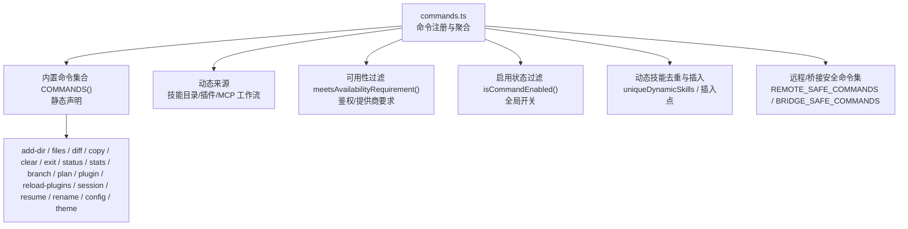
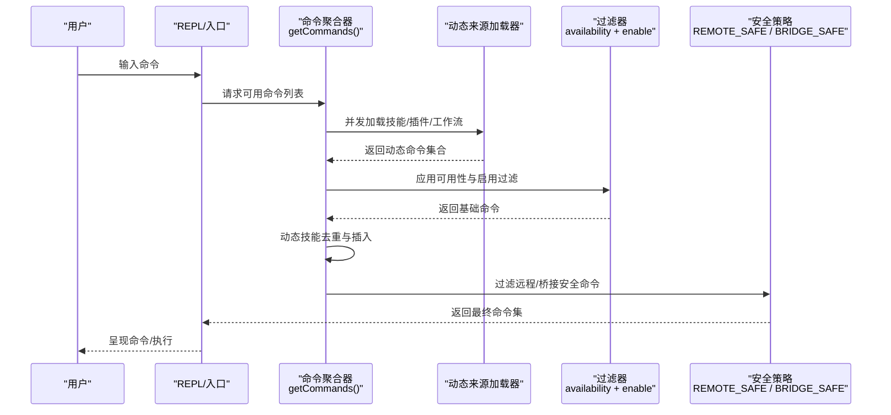
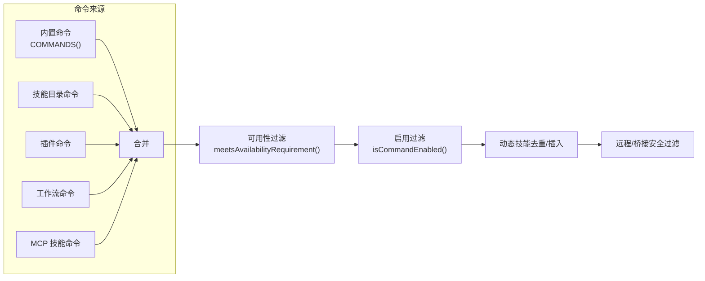
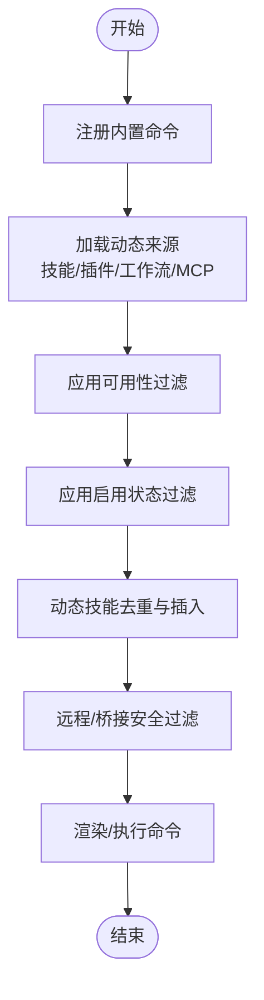

# 内置命令

<cite>
**本文引用的文件**
- [commands.ts](file://commands.ts)
- [help/index.ts](file://commands/help/index.ts)
- [add-dir/index.ts](file://commands/add-dir/index.ts)
- [files/index.ts](file://commands/files/index.ts)
- [diff/index.ts](file://commands/diff/index.ts)
- [copy/index.ts](file://commands/copy/index.ts)
- [clear/index.ts](file://commands/clear/index.ts)
- [exit/index.ts](file://commands/exit/index.ts)
- [status/index.ts](file://commands/status/index.ts)
- [stats/index.ts](file://commands/stats/index.ts)
- [branch/index.ts](file://commands/branch/index.ts)
- [plan/index.ts](file://commands/plan/index.ts)
- [plugin/index.tsx](file://commands/plugin/index.tsx)
- [reload-plugins/index.ts](file://commands/reload-plugins/index.ts)
- [session/index.ts](file://commands/session/index.ts)
- [resume/index.ts](file://commands/resume/index.ts)
- [rename/index.ts](file://commands/rename/index.ts)
- [config/index.ts](file://commands/config/index.ts)
- [theme/index.ts](file://commands/theme/index.ts)
</cite>

## 目录
1. [简介](#简介)
2. [项目结构](#项目结构)
3. [核心组件](#核心组件)
4. [架构总览](#架构总览)
5. [详细组件分析](#详细组件分析)
6. [依赖关系分析](#依赖关系分析)
7. [性能考量](#性能考量)
8. [故障排查指南](#故障排查指南)
9. [结论](#结论)
10. [附录](#附录)

## 简介
本文件系统性梳理 Claude Code 的内置命令体系，覆盖文件操作、系统管理、开发工具、插件管理、会话管理与配置管理等类别。文档从命令注册与发现机制入手，解释命令的元数据、可用性过滤、远程安全策略与动态技能注入；随后按功能分组详解各命令的用途、参数、典型用法与最佳实践，并给出组合使用与自动化思路。

## 项目结构
内置命令由统一入口集中注册与导出，命令清单在运行时根据能力、特性开关与启用状态进行筛选与拼装，同时支持动态技能与插件命令的注入与去重。

**图示来源**
- [commands.ts:258-346](file://commands.ts#L258-L346)
- [commands.ts:417-443](file://commands.ts#L417-L443)
- [commands.ts:476-517](file://commands.ts#L476-L517)
- [commands.ts:619-676](file://commands.ts#L619-L676)

**章节来源**
- [commands.ts:258-346](file://commands.ts#L258-L346)
- [commands.ts:417-443](file://commands.ts#L417-L443)
- [commands.ts:476-517](file://commands.ts#L476-L517)
- [commands.ts:619-676](file://commands.ts#L619-L676)

## 核心组件
- 命令注册与聚合
  - 统一导出类型与工具函数，集中维护命令清单与动态来源加载器。
  - 关键导出：命令类型定义、名称解析、可用性判断、远程安全命令集合、查找与格式化描述等。
- 动态来源
  - 技能目录命令、插件技能、内置插件技能、工作流命令等，均通过异步加载并在运行时合并到内置命令之前。
- 可用性与启用过滤
  - 按订阅/提供商/第三方服务等条件进行可见性控制；启用状态由全局开关决定。
- 远程/桥接安全策略
  - 明确允许在远程模式或移动端桥接通道中执行的命令白名单，避免渲染 UI 或依赖本地环境的命令被误放行。

**章节来源**
- [commands.ts:207-222](file://commands.ts#L207-L222)
- [commands.ts:353-398](file://commands.ts#L353-L398)
- [commands.ts:449-469](file://commands.ts#L449-L469)
- [commands.ts:476-517](file://commands.ts#L476-L517)
- [commands.ts:619-676](file://commands.ts#L619-L676)

## 架构总览
下图展示命令生命周期：注册 → 动态来源加载 → 可用性/启用过滤 → 去重与插入 → 远程安全校验 → 渲染/执行。

**图示来源**
- [commands.ts:449-469](file://commands.ts#L449-L469)
- [commands.ts:476-517](file://commands.ts#L476-L517)
- [commands.ts:619-676](file://commands.ts#L619-L676)

## 详细组件分析

### 文件操作命令
- add-dir
  - 类型：本地 JSX 命令
  - 参数：路径占位符
  - 用途：添加新的工作目录至上下文
  - 最佳实践：确保路径存在且可访问；结合上下文可视化查看效果
  - 参考路径：[add-dir/index.ts:1-12](file://commands/add-dir/index.ts#L1-L12)
- files
  - 类型：本地命令
  - 参数：无
  - 用途：列出当前上下文中已跟踪的文件
  - 非交互支持：是
  - 可见性：仅在特定用户类型下启用
  - 参考路径：[files/index.ts:1-13](file://commands/files/index.ts#L1-L13)
- diff
  - 类型：本地 JSX 命令
  - 参数：无
  - 用途：查看未提交变更与按轮次生成的差异
  - 参考路径：[diff/index.ts:1-9](file://commands/diff/index.ts#L1-L9)
- copy
  - 类型：本地 JSX 命令
  - 参数：可选历史序号（如复制第 N 条回复）
  - 用途：将 Claude 的上次或指定回复复制到剪贴板
  - 参考路径：[copy/index.ts:1-16](file://commands/copy/index.ts#L1-L16)

**章节来源**
- [add-dir/index.ts:1-12](file://commands/add-dir/index.ts#L1-L12)
- [files/index.ts:1-13](file://commands/files/index.ts#L1-L13)
- [diff/index.ts:1-9](file://commands/diff/index.ts#L1-L9)
- [copy/index.ts:1-16](file://commands/copy/index.ts#L1-L16)

### 系统管理命令
- clear
  - 类型：本地命令
  - 别名：reset、new
  - 参数：无
  - 用途：清空对话历史并释放上下文空间
  - 非交互支持：否
  - 参考路径：[clear/index.ts:1-20](file://commands/clear/index.ts#L1-L20)
- exit
  - 类型：本地 JSX 命令
  - 别名：quit
  - 参数：无
  - 用途：退出 REPL
  - 立即执行：是
  - 参考路径：[exit/index.ts:1-13](file://commands/exit/index.ts#L1-L13)
- status
  - 类型：本地 JSX 命令
  - 参数：无
  - 用途：显示版本、模型、账户、API 连通性与工具状态
  - 立即执行：是
  - 参考路径：[status/index.ts:1-13](file://commands/status/index.ts#L1-L13)
- stats
  - 类型：本地 JSX 命令
  - 参数：无
  - 用途：展示使用统计与活动
  - 参考路径：[stats/index.ts:1-11](file://commands/stats/index.ts#L1-L11)

**章节来源**
- [clear/index.ts:1-20](file://commands/clear/index.ts#L1-L20)
- [exit/index.ts:1-13](file://commands/exit/index.ts#L1-L13)
- [status/index.ts:1-13](file://commands/status/index.ts#L1-L13)
- [stats/index.ts:1-11](file://commands/stats/index.ts#L1-L11)

### 开发工具命令
- branch
  - 类型：本地 JSX 命令
  - 别名：fork（当独立的 fork 命令不存在时）
  - 参数：可选分支名
  - 用途：在当前会话处创建一个分支
  - 特性开关：受特定功能开关影响别名行为
  - 参考路径：[branch/index.ts:1-15](file://commands/branch/index.ts#L1-L15)
- plan
  - 类型：本地 JSX 命令
  - 参数：open 或描述片段
  - 用途：启用计划模式或查看当前会话计划
  - 参考路径：[plan/index.ts:1-12](file://commands/plan/index.ts#L1-L12)

**章节来源**
- [branch/index.ts:1-15](file://commands/branch/index.ts#L1-L15)
- [plan/index.ts:1-12](file://commands/plan/index.ts#L1-L12)

### 插件管理命令
- plugin
  - 类型：本地 JSX 命令
  - 别名：plugins、marketplace
  - 参数：无
  - 用途：管理插件（安装、卸载、市场浏览等）
  - 立即执行：是
  - 参考路径：[plugin/index.tsx:1-11](file://commands/plugin/index.tsx#L1-L11)
- reload-plugins
  - 类型：本地命令
  - 参数：无
  - 用途：激活当前会话中的待生效插件变更
  - 非交互支持：否
  - 参考路径：[reload-plugins/index.ts:1-19](file://commands/reload-plugins/index.ts#L1-L19)

**章节来源**
- [plugin/index.tsx:1-11](file://commands/plugin/index.tsx#L1-L11)
- [reload-plugins/index.ts:1-19](file://commands/reload-plugins/index.ts#L1-L19)

### 会话管理命令
- session
  - 类型：本地 JSX 命令
  - 别名：remote
  - 参数：无
  - 用途：显示远程会话 URL 与二维码（仅在远程模式下可见）
  - 可见性：受远程模式开关控制
  - 参考路径：[session/index.ts:1-17](file://commands/session/index.ts#L1-L17)
- resume
  - 类型：本地 JSX 命令
  - 别名：continue
  - 参数：会话 ID 或搜索关键词
  - 用途：恢复之前的对话
  - 参考路径：[resume/index.ts:1-13](file://commands/resume/index.ts#L1-L13)
- rename
  - 类型：本地 JSX 命令
  - 参数：新名称
  - 用途：重命名当前会话
  - 立即执行：是
  - 参考路径：[rename/index.ts:1-13](file://commands/rename/index.ts#L1-L13)

**章节来源**
- [session/index.ts:1-17](file://commands/session/index.ts#L1-L17)
- [resume/index.ts:1-13](file://commands/resume/index.ts#L1-L13)
- [rename/index.ts:1-13](file://commands/rename/index.ts#L1-L13)

### 配置管理命令
- config
  - 类型：本地 JSX 命令
  - 别名：settings
  - 参数：无
  - 用途：打开配置面板
  - 参考路径：[config/index.ts:1-12](file://commands/config/index.ts#L1-L12)
- theme
  - 类型：本地 JSX 命令
  - 参数：无
  - 用途：切换主题
  - 参考路径：[theme/index.ts:1-11](file://commands/theme/index.ts#L1-L11)

**章节来源**
- [config/index.ts:1-12](file://commands/config/index.ts#L1-L12)
- [theme/index.ts:1-11](file://commands/theme/index.ts#L1-L11)

## 依赖关系分析
命令系统通过中心化入口聚合多源命令，形成“内置命令 + 动态技能 + 插件命令”的统一视图，并在渲染前进行可用性与安全过滤。

**图示来源**
- [commands.ts:258-346](file://commands.ts#L258-L346)
- [commands.ts:417-443](file://commands.ts#L417-L443)
- [commands.ts:476-517](file://commands.ts#L476-L517)
- [commands.ts:547-559](file://commands.ts#L547-L559)

**章节来源**
- [commands.ts:258-346](file://commands.ts#L258-L346)
- [commands.ts:417-443](file://commands.ts#L417-L443)
- [commands.ts:476-517](file://commands.ts#L476-L517)
- [commands.ts:547-559](file://commands.ts#L547-L559)

## 性能考量
- 懒加载与缓存
  - 多数命令采用延迟加载以降低启动开销；命令聚合与动态来源加载均使用记忆化缓存，避免重复 I/O 与动态导入。
- 并发加载
  - 技能目录、插件与工作流命令通过并发加载提升初始化速度。
- 运行时过滤
  - 可用性与启用状态检查在每次请求时重新评估，以便登录状态变化后即时生效。

**章节来源**
- [commands.ts:449-469](file://commands.ts#L449-L469)
- [commands.ts:476-517](file://commands.ts#L476-L517)
- [commands.ts:523-539](file://commands.ts#L523-L539)

## 故障排查指南
- 命令未出现或不可用
  - 检查命令是否满足可用性要求（订阅/提供商/第三方服务）与启用状态。
  - 参考：[commands.ts:417-443](file://commands.ts#L417-L443)、[commands.ts:476-517](file://commands.ts#L476-L517)
- 命令在远程/移动端不可执行
  - 确认命令是否在远程安全或桥接安全白名单内。
  - 参考：[commands.ts:619-676](file://commands.ts#L619-L676)
- 动态技能未生效
  - 触发动态技能缓存清理或重启会话以刷新命令列表。
  - 参考：[commands.ts:523-539](file://commands.ts#L523-L539)
- 插件变更未反映
  - 使用重载插件命令激活待生效变更。
  - 参考：[reload-plugins/index.ts:1-19](file://commands/reload-plugins/index.ts#L1-L19)

**章节来源**
- [commands.ts:417-443](file://commands.ts#L417-L443)
- [commands.ts:476-517](file://commands.ts#L476-L517)
- [commands.ts:619-676](file://commands.ts#L619-L676)
- [commands.ts:523-539](file://commands.ts#L523-L539)
- [reload-plugins/index.ts:1-19](file://commands/reload-plugins/index.ts#L1-L19)

## 结论
Claude Code 的内置命令体系以“统一注册、动态聚合、运行时过滤、安全前置”为核心设计，既保证了命令生态的扩展性与灵活性，又确保了在不同运行环境（本地/远程/移动端）下的安全性与一致性。通过合理使用各命令与组合策略，可显著提升开发效率与会话体验。

## 附录
- 常用命令速览（按类别）
  - 文件操作：add-dir、files、diff、copy
  - 系统管理：clear、exit、status、stats
  - 开发工具：branch、plan
  - 插件管理：plugin、reload-plugins
  - 会话管理：session、resume、rename
  - 配置管理：config、theme
- 执行流程与内部机制概览

**图示来源**
- [commands.ts:258-346](file://commands.ts#L258-L346)
- [commands.ts:449-469](file://commands.ts#L449-L469)
- [commands.ts:476-517](file://commands.ts#L476-L517)
- [commands.ts:619-676](file://commands.ts#L619-L676)