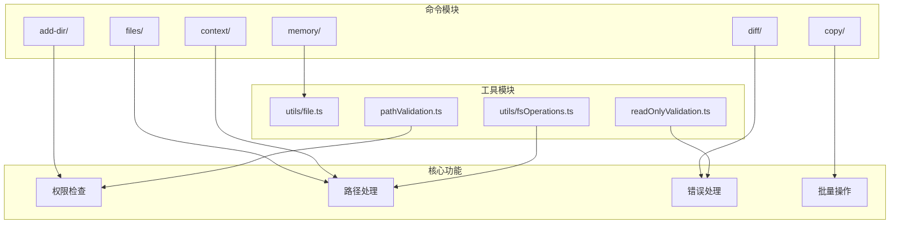
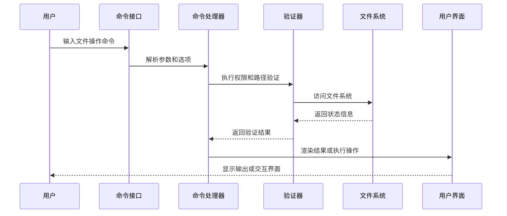
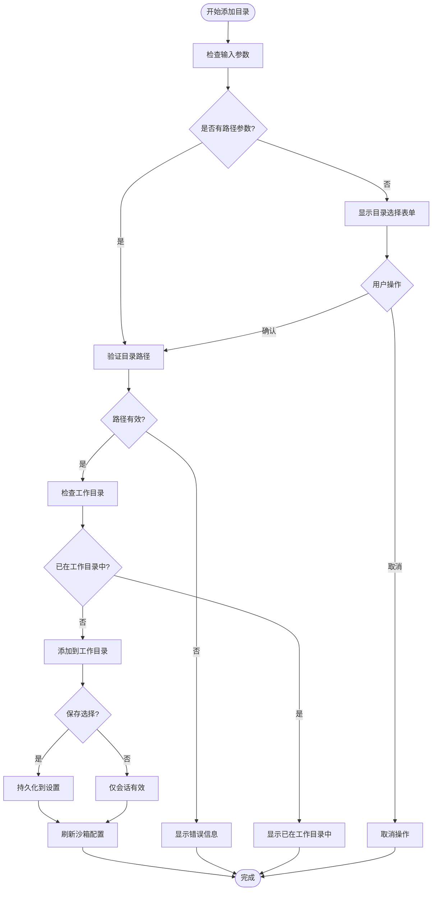
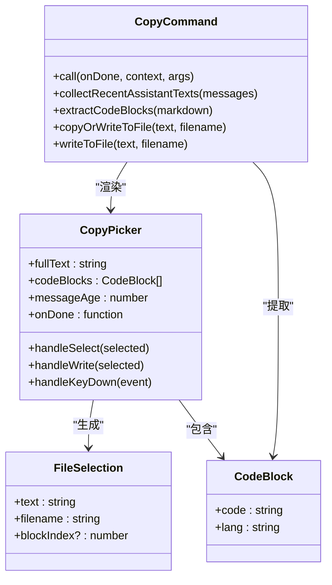
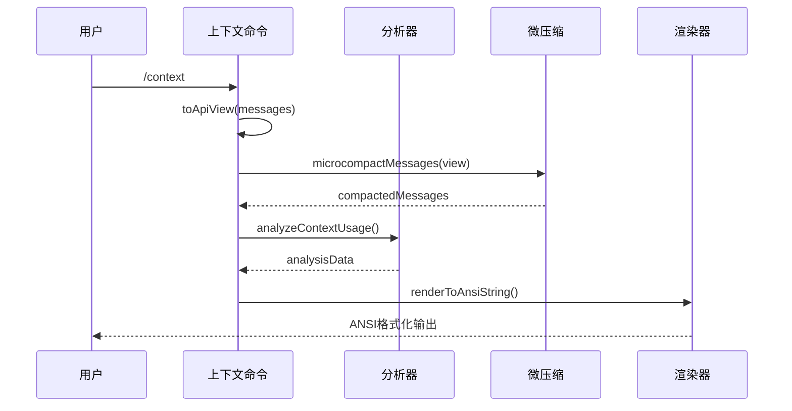
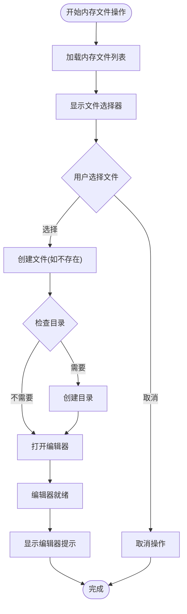
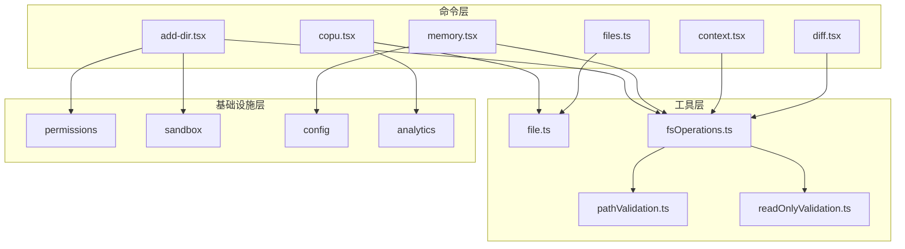

# 文件操作命令

<cite>
**本文档引用的文件**
- [add-dir.tsx](file://commands/add-dir/add-dir.tsx)
- [validation.ts](file://commands/add-dir/validation.ts)
- [files.ts](file://commands/files/files.ts)
- [files/index.ts](file://commands/files/index.ts)
- [diff.tsx](file://commands/diff/diff.tsx)
- [diff/index.ts](file://commands/diff/index.ts)
- [copy.tsx](file://commands/copy/copy.tsx)
- [copy/index.ts](file://commands/copy/index.ts)
- [context.tsx](file://commands/context/context.tsx)
- [context/index.ts](file://commands/context/index.ts)
- [memory.tsx](file://commands/memory/memory.tsx)
- [memory/index.ts](file://commands/memory/index.ts)
- [file.ts](file://utils/file.ts)
- [fsOperations.ts](file://utils/fsOperations.ts)
- [pathValidation.ts](file://tools/BashTool/pathValidation.ts)
- [readOnlyValidation.ts](file://tools/BashTool/readOnlyValidation.ts)
</cite>

## 目录
1. [简介](#简介)
2. [项目结构](#项目结构)
3. [核心组件](#核心组件)
4. [架构概览](#架构概览)
5. [详细组件分析](#详细组件分析)
6. [依赖关系分析](#依赖关系分析)
7. [性能考虑](#性能考虑)
8. [故障排除指南](#故障排除指南)
9. [结论](#结论)

## 简介

本文档详细介绍Claude Code中的文件操作命令系统，涵盖添加目录、文件列表、差异查看、文件复制、上下文查看和内存文件操作等核心功能。这些命令提供了强大的文件管理能力，支持交互式和非交互式两种模式，具有完善的权限检查、路径处理和错误处理机制。

## 项目结构

文件操作命令分布在commands目录下的专门子模块中，每个命令都有独立的实现文件和索引文件：

**图表来源**
- [add-dir.tsx:1-126](file://commands/add-dir/add-dir.tsx#L1-126)
- [files.ts:1-20](file://commands/files/files.ts#L1-20)
- [diff.tsx:1-9](file://commands/diff/diff.tsx#L1-9)
- [copy.tsx:1-371](file://commands/copy/copy.tsx#L1-371)
- [context.tsx:1-64](file://commands/context/context.tsx#L1-64)
- [memory.tsx:1-90](file://commands/memory/memory.tsx#L1-90)

**章节来源**
- [add-dir.tsx:1-126](file://commands/add-dir/add-dir.tsx#L1-126)
- [files.ts:1-20](file://commands/files/files.ts#L1-20)
- [diff.tsx:1-9](file://commands/diff/diff.tsx#L1-9)
- [copy.tsx:1-371](file://commands/copy/copy.tsx#L1-371)
- [context.tsx:1-64](file://commands/context/context.tsx#L1-64)
- [memory.tsx:1-90](file://commands/memory/memory.tsx#L1-90)

## 核心组件

### 添加目录命令 (/add-dir)

添加目录命令允许用户将工作目录添加到Claude Code的权限范围内，支持交互式和非交互式两种模式：

- **语法**: `/add-dir [目录路径]`
- **功能**: 验证目录存在性、权限检查、添加到工作目录列表
- **权限**: 支持会话级和持久化保存两种模式
- **错误处理**: 完善的路径验证和错误提示

### 文件列表命令 (/files)

文件列表命令显示当前上下文中包含的所有文件：

- **语法**: `/files`
- **功能**: 列出所有已读取的文件路径
- **输出**: 相对于当前工作目录的相对路径
- **条件**: 仅在特定用户类型下可用

### 差异查看命令 (/diff)

差异查看命令提供Git差异的可视化界面：

- **语法**: `/diff`
- **功能**: 显示未提交的变更和按回合的差异
- **界面**: 基于React的交互式对话框
- **集成**: 与消息历史深度集成

### 文件复制命令 (/copy)

文件复制命令支持从Claude的响应中复制内容到剪贴板或文件：

- **语法**: `/copy [N]`
- **功能**: 复制最新响应或指定回合的响应
- **特性**: 支持代码块选择、批量复制、文件写入
- **回退机制**: 剪贴板失败时自动写入临时文件

### 上下文查看命令 (/context)

上下文查看命令提供当前上下文使用的可视化分析：

- **语法**: `/context` (交互式) 或 `/context` (非交互式)
- **功能**: 可视化显示上下文使用情况、令牌消耗分析
- **特性**: 支持微压缩、项目视图折叠、终端宽度自适应
- **集成**: 与分析服务深度集成

### 内存文件操作命令 (/memory)

内存文件操作命令用于编辑Claude记忆文件：

- **语法**: `/memory`
- **功能**: 选择和编辑内存文件
- **特性**: 自动创建目录、文件保护、编辑器集成
- **环境变量**: 支持$EDITOR和$VISUAL环境变量

**章节来源**
- [add-dir.tsx:65-126](file://commands/add-dir/add-dir.tsx#L65-126)
- [files.ts:7-19](file://commands/files/files.ts#L7-19)
- [diff.tsx:3-8](file://commands/diff/diff.tsx#L3-8)
- [copy.tsx:334-371](file://commands/copy/copy.tsx#L334-371)
- [context.tsx:30-63](file://commands/context/context.tsx#L30-63)
- [memory.tsx:83-90](file://commands/memory/memory.tsx#L83-90)

## 架构概览

文件操作命令系统采用模块化设计，具有清晰的职责分离和扩展性：

**图表来源**
- [add-dir.tsx:65-126](file://commands/add-dir/add-dir.tsx#L65-126)
- [copy.tsx:334-371](file://commands/copy/copy.tsx#L334-371)
- [memory.tsx:83-90](file://commands/memory/memory.tsx#L83-90)

系统架构特点：

1. **模块化设计**: 每个命令都是独立的模块，便于维护和扩展
2. **异步处理**: 大量使用Promise和async/await确保非阻塞操作
3. **错误处理**: 统一的错误处理机制和用户友好的错误消息
4. **权限控制**: 基于工具权限上下文的细粒度访问控制
5. **用户体验**: 交互式界面和非交互式模式的双重支持

## 详细组件分析

### 添加目录命令详细分析

添加目录命令实现了完整的目录管理功能：

**图表来源**
- [validation.ts:31-93](file://commands/add-dir/validation.ts#L31-93)
- [add-dir.tsx:65-126](file://commands/add-dir/add-dir.tsx#L65-126)

关键特性：
- **路径验证**: 使用`resolve()`和`expandPath()`确保路径正确性
- **权限检查**: 检查目录存在性和可访问性
- **重复检测**: 防止重复添加现有工作目录
- **沙箱集成**: 自动更新沙箱配置以支持新目录访问

**章节来源**
- [validation.ts:12-93](file://commands/add-dir/validation.ts#L12-93)
- [add-dir.tsx:65-126](file://commands/add-dir/add-dir.tsx#L65-126)

### 文件复制命令详细分析

文件复制命令提供了灵活的内容复制和保存机制：

**图表来源**
- [copy.tsx:26-94](file://commands/copy/copy.tsx#L26-94)
- [copy.tsx:111-319](file://commands/copy/copy.tsx#L111-319)
- [copy.tsx:334-371](file://commands/copy/copy.tsx#L334-371)

核心功能：
- **智能选择**: 自动检测代码块并提供选择界面
- **批量操作**: 支持复制完整响应或选择特定代码块
- **回退机制**: 剪贴板失败时自动写入文件
- **配置持久化**: 支持用户偏好设置的保存和恢复

**章节来源**
- [copy.tsx:26-94](file://commands/copy/copy.tsx#L26-94)
- [copy.tsx:111-319](file://commands/copy/copy.tsx#L111-319)
- [copy.tsx:334-371](file://commands/copy/copy.tsx#L334-371)

### 上下文查看命令详细分析

上下文查看命令提供了复杂的上下文分析和可视化功能：

**图表来源**
- [context.tsx:18-63](file://commands/context/context.tsx#L18-63)

高级特性：
- **API视图转换**: 将原始消息转换为API实际看到的视图
- **微压缩算法**: 减少令牌计数的误报
- **项目视图折叠**: 条件性地应用项目视图折叠
- **终端适配**: 根据终端宽度动态调整布局

**章节来源**
- [context.tsx:18-63](file://commands/context/context.tsx#L18-63)
- [context/index.ts:4-25](file://commands/context/index.ts#L4-25)

### 内存文件操作详细分析

内存文件操作命令提供了安全的文件编辑体验：

**图表来源**
- [memory.tsx:14-90](file://commands/memory/memory.tsx#L14-90)

安全特性：
- **原子写入**: 使用临时文件和重命名确保数据完整性
- **权限保留**: 自动保留目标文件的权限设置
- **符号链接支持**: 正确处理符号链接目标
- **错误隔离**: 完善的错误捕获和用户反馈

**章节来源**
- [memory.tsx:14-90](file://commands/memory/memory.tsx#L14-90)

## 依赖关系分析

文件操作命令系统具有清晰的依赖层次结构：

**图表来源**
- [file.ts:1-585](file://utils/file.ts#L1-585)
- [fsOperations.ts:1-771](file://utils/fsOperations.ts#L1-771)
- [pathValidation.ts:511-601](file://tools/BashTool/pathValidation.ts#L511-601)
- [readOnlyValidation.ts:1436-1491](file://tools/BashTool/readOnlyValidation.ts#L1436-1491)

主要依赖关系：
- **文件系统抽象**: 所有命令都依赖统一的文件系统操作接口
- **权限系统**: 添加目录和内存文件操作直接依赖权限检查
- **分析服务**: 上下文命令依赖分析和统计服务
- **剪贴板集成**: 复制命令依赖系统剪贴板功能

**章节来源**
- [file.ts:1-585](file://utils/file.ts#L1-585)
- [fsOperations.ts:1-771](file://utils/fsOperations.ts#L1-771)
- [pathValidation.ts:511-601](file://tools/BashTool/pathValidation.ts#L511-601)
- [readOnlyValidation.ts:1436-1491](file://tools/BashTool/readOnlyValidation.ts#L1436-1491)

## 性能考虑

文件操作命令系统在设计时充分考虑了性能优化：

### 异步操作优化
- **非阻塞I/O**: 所有文件操作都使用异步API避免阻塞事件循环
- **缓存机制**: 文件读取和状态查询使用缓存减少重复I/O
- **流式处理**: 大文件读取使用流式API避免内存峰值

### 内存管理
- **垃圾回收**: 合理的内存释放策略防止内存泄漏
- **缓冲区管理**: 大文件操作使用分块读取避免大缓冲区
- **对象池**: 复用React组件实例减少创建开销

### 并发控制
- **并发限制**: 控制同时进行的文件操作数量
- **队列管理**: 使用队列确保操作顺序和一致性
- **超时机制**: 为长时间操作设置超时防止挂起

## 故障排除指南

### 常见问题及解决方案

**权限相关问题**
- **症状**: 添加目录失败或内存文件无法创建
- **原因**: 权限不足或路径不可访问
- **解决**: 检查目录权限，确保用户有读写权限

**路径解析问题**
- **症状**: 路径找不到或解析错误
- **原因**: 相对路径相对于错误的目录
- **解决**: 使用绝对路径或检查当前工作目录

**剪贴板问题**
- **症状**: 复制操作成功但剪贴板无内容
- **原因**: 终端不支持OSC 52协议
- **解决**: 命令会自动回退到文件写入，检查临时目录

**内存文件编辑问题**
- **症状**: 编辑器无法启动或文件无法保存
- **原因**: 编辑器环境变量未设置
- **解决**: 设置$EDITOR或$VISUAL环境变量

### 调试技巧

1. **启用调试日志**: 使用调试模式查看详细的错误信息
2. **检查系统状态**: 验证文件系统和权限状态
3. **测试最小场景**: 创建简单的测试用例排除复杂因素
4. **监控资源使用**: 关注内存和CPU使用情况

**章节来源**
- [validation.ts:55-73](file://commands/add-dir/validation.ts#L55-73)
- [copy.tsx:81-94](file://commands/copy/copy.tsx#L81-94)
- [memory.tsx:59-63](file://commands/memory/memory.tsx#L59-63)

## 结论

文件操作命令系统提供了全面而强大的文件管理功能，具有以下优势：

1. **功能完整性**: 涵盖了从基本文件操作到高级上下文分析的完整功能集
2. **用户体验**: 提供直观的交互界面和清晰的错误反馈
3. **安全性**: 实施了多层权限检查和安全防护措施
4. **可扩展性**: 模块化设计便于添加新功能和集成第三方工具
5. **性能优化**: 采用异步处理和缓存机制确保高效运行

该系统为开发者提供了高效的文件操作工具，支持各种开发场景下的文件管理和上下文分析需求。通过合理的架构设计和完善的错误处理机制，确保了系统的稳定性和可靠性。