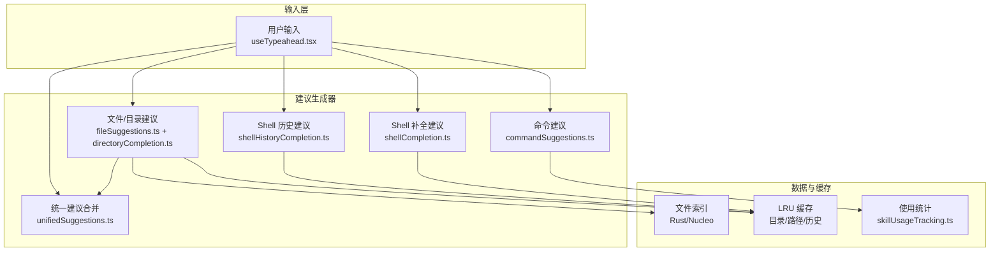
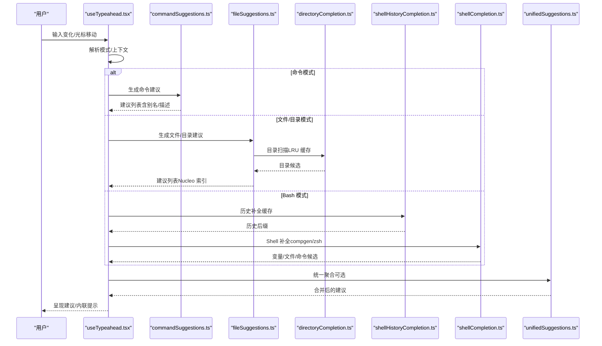
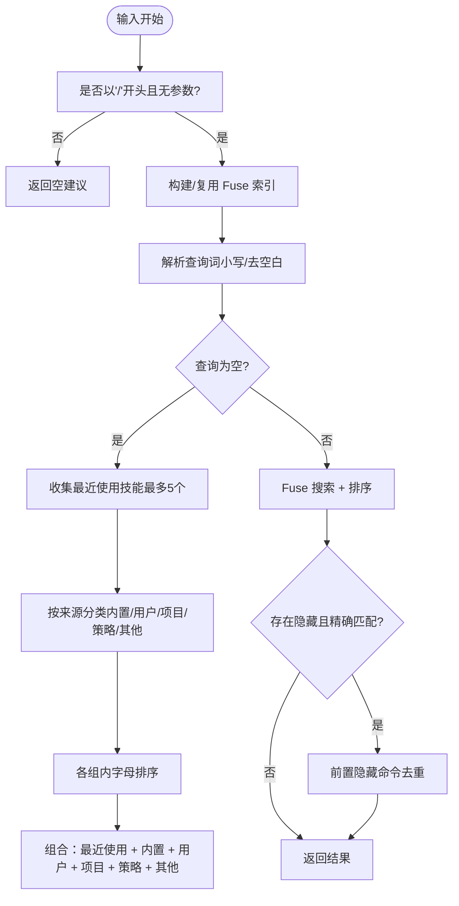
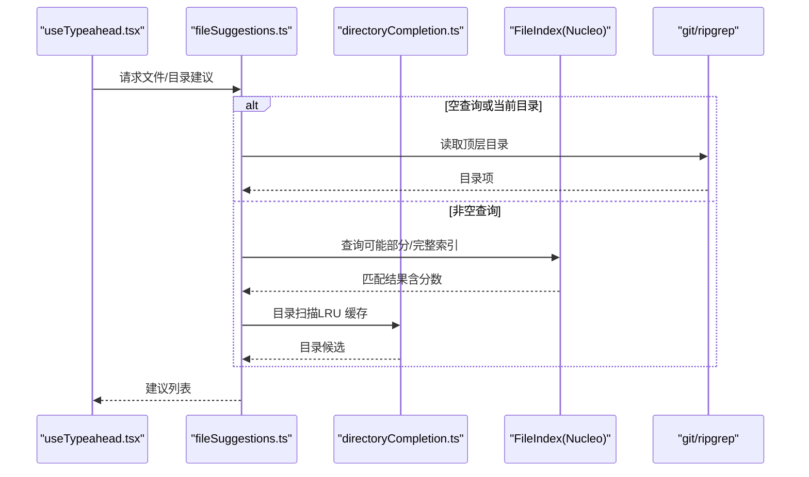
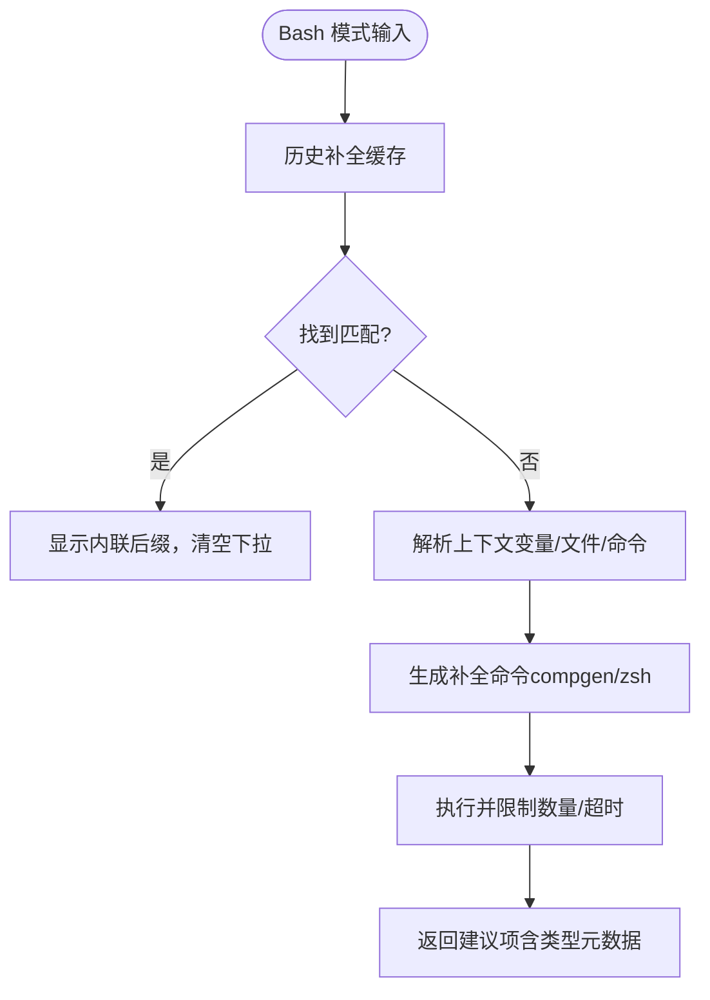
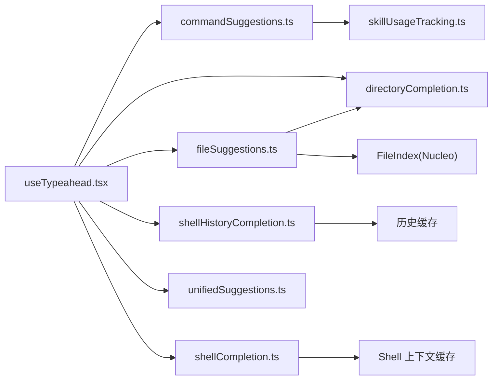

# 命令建议系统

<cite>
**本文档引用的文件**
- [useTypeahead.tsx](file://hooks/useTypeahead.tsx)
- [commandSuggestions.ts](file://utils/suggestions/commandSuggestions.ts)
- [directoryCompletion.ts](file://utils/suggestions/directoryCompletion.ts)
- [shellCompletion.ts](file://utils/bash/shellCompletion.ts)
- [shellHistoryCompletion.ts](file://utils/suggestions/shellHistoryCompletion.ts)
- [unifiedSuggestions.ts](file://hooks/unifiedSuggestions.ts)
- [fileSuggestions.ts](file://hooks/fileSuggestions.ts)
- [skillUsageTracking.ts](file://utils/suggestions/skillUsageTracking.ts)
</cite>

## 目录
1. [简介](#简介)
2. [项目结构](#项目结构)
3. [核心组件](#核心组件)
4. [架构总览](#架构总览)
5. [详细组件分析](#详细组件分析)
6. [依赖关系分析](#依赖关系分析)
7. [性能考虑](#性能考虑)
8. [故障排除指南](#故障排除指南)
9. [结论](#结论)

## 简介
本文件系统性阐述 Claude Code 的命令建议系统，覆盖工作原理、触发机制、配置方法与扩展策略。系统支持多种建议来源：命令历史、文件路径、目录补全、Shell 命令历史与补全、MCP 资源与智能体等，并通过缓存、去抖动与渐进式索引提升性能。本文提供可视化流程图与类图，帮助开发者快速理解与维护该系统。

## 项目结构
命令建议系统主要由以下模块构成：
- 输入处理与调度：hooks/useTypeahead.tsx
- 命令建议生成：utils/suggestions/commandSuggestions.ts
- 文件/目录建议：hooks/fileSuggestions.ts、utils/suggestions/directoryCompletion.ts
- Shell 历史与补全：utils/suggestions/shellHistoryCompletion.ts、utils/bash/shellCompletion.ts
- 统一建议合并：hooks/unifiedSuggestions.ts
- 使用统计与排序：utils/suggestions/skillUsageTracking.ts

**图表来源**
- [useTypeahead.tsx:350-800](file://hooks/useTypeahead.tsx#L350-L800)
- [commandSuggestions.ts:292-498](file://utils/suggestions/commandSuggestions.ts#L292-L498)
- [fileSuggestions.ts:523-784](file://hooks/fileSuggestions.ts#L523-L784)
- [directoryCompletion.ts:121-140](file://utils/suggestions/directoryCompletion.ts#L121-L140)
- [shellHistoryCompletion.ts:23-57](file://utils/suggestions/shellHistoryCompletion.ts#L23-L57)
- [shellCompletion.ts:221-259](file://utils/bash/shellCompletion.ts#L221-L259)
- [unifiedSuggestions.ts:111-202](file://hooks/unifiedSuggestions.ts#L111-L202)
- [skillUsageTracking.ts:44-55](file://utils/suggestions/skillUsageTracking.ts#L44-L55)

**章节来源**
- [useTypeahead.tsx:350-800](file://hooks/useTypeahead.tsx#L350-L800)
- [commandSuggestions.ts:292-498](file://utils/suggestions/commandSuggestions.ts#L292-L498)
- [fileSuggestions.ts:523-784](file://hooks/fileSuggestions.ts#L523-L784)
- [directoryCompletion.ts:121-140](file://utils/suggestions/directoryCompletion.ts#L121-L140)
- [shellHistoryCompletion.ts:23-57](file://utils/suggestions/shellHistoryCompletion.ts#L23-L57)
- [shellCompletion.ts:221-259](file://utils/bash/shellCompletion.ts#L221-L259)
- [unifiedSuggestions.ts:111-202](file://hooks/unifiedSuggestions.ts#L111-L202)
- [skillUsageTracking.ts:44-55](file://utils/suggestions/skillUsageTracking.ts#L44-L55)

## 核心组件
- useTypeahead 钩子：统一调度各类建议来源，处理输入变化、光标移动、模式切换与建议应用。
- 命令建议：基于 Fuse 模糊匹配与别名优先级，结合最近使用统计进行排序。
- 文件/目录建议：基于 Rust/Nucleo 的渐进式文件索引，支持 Git/ripgrep 快速扫描与忽略规则。
- Shell 历史与补全：从历史中提取候选，按上下文推断变量/文件/命令补全类型。
- 统一建议：聚合文件、MCP 资源与智能体建议，使用 Fuse 进行非文件项评分。

**章节来源**
- [useTypeahead.tsx:350-800](file://hooks/useTypeahead.tsx#L350-L800)
- [commandSuggestions.ts:292-498](file://utils/suggestions/commandSuggestions.ts#L292-L498)
- [fileSuggestions.ts:523-784](file://hooks/fileSuggestions.ts#L523-L784)
- [shellCompletion.ts:221-259](file://utils/bash/shellCompletion.ts#L221-L259)
- [unifiedSuggestions.ts:111-202](file://hooks/unifiedSuggestions.ts#L111-L202)

## 架构总览
下图展示从用户输入到建议呈现的关键调用链路：

**图表来源**
- [useTypeahead.tsx:533-800](file://hooks/useTypeahead.tsx#L533-L800)
- [commandSuggestions.ts:292-498](file://utils/suggestions/commandSuggestions.ts#L292-L498)
- [fileSuggestions.ts:715-784](file://hooks/fileSuggestions.ts#L715-L784)
- [directoryCompletion.ts:121-140](file://utils/suggestions/directoryCompletion.ts#L121-L140)
- [shellHistoryCompletion.ts:91-119](file://utils/suggestions/shellHistoryCompletion.ts#L91-L119)
- [shellCompletion.ts:221-259](file://utils/bash/shellCompletion.ts#L221-L259)
- [unifiedSuggestions.ts:111-202](file://hooks/unifiedSuggestions.ts#L111-L202)

## 详细组件分析

### 命令建议组件
- 触发条件：输入以 "/" 开头且无参数。
- 匹配策略：命令名、别名前缀、描述模糊匹配；隐藏命令精确名命中时前置显示。
- 排序策略：优先级（精确名 > 精确别名 > 前缀名 > 前缀别名 > 模糊）；同级按 Fuse 分数与使用频率打分。
- 最近使用：基于全局配置中的使用计数与时间衰减计算得分，用于“最近使用”分类优先。

**图表来源**
- [commandSuggestions.ts:292-498](file://utils/suggestions/commandSuggestions.ts#L292-L498)

**章节来源**
- [commandSuggestions.ts:292-498](file://utils/suggestions/commandSuggestions.ts#L292-L498)
- [skillUsageTracking.ts:44-55](file://utils/suggestions/skillUsageTracking.ts#L44-L55)

### 文件与目录建议组件
- 文件索引：基于 Rust/Nucleo 的渐进式索引，支持 Git/ripgrep 快速扫描，忽略规则来自 .ignore/.rgignore 或 Git VCS。
- 目录补全：解析路径，LRU 缓存目录内容，仅返回非隐藏目录，支持最大结果限制。
- 背景刷新：根据 .git/index mtime 与时间阈值节流刷新，避免频繁重建索引。

**图表来源**
- [fileSuggestions.ts:523-784](file://hooks/fileSuggestions.ts#L523-L784)
- [directoryCompletion.ts:121-140](file://utils/suggestions/directoryCompletion.ts#L121-L140)

**章节来源**
- [fileSuggestions.ts:523-784](file://hooks/fileSuggestions.ts#L523-L784)
- [directoryCompletion.ts:121-140](file://utils/suggestions/directoryCompletion.ts#L121-L140)

### Shell 历史与补全组件
- 历史补全：从历史记录中提取唯一命令，缓存 60 秒；按输入精确前缀匹配，返回后缀作为内联提示。
- Shell 补全：解析输入上下文，识别变量、文件、命令三类补全；调用 compgen/zsh 模式生成候选，带超时保护与安全转义。

**图表来源**
- [shellHistoryCompletion.ts:91-119](file://utils/suggestions/shellHistoryCompletion.ts#L91-L119)
- [shellCompletion.ts:80-137](file://utils/bash/shellCompletion.ts#L80-L137)
- [shellCompletion.ts:184-215](file://utils/bash/shellCompletion.ts#L184-L215)

**章节来源**
- [shellHistoryCompletion.ts:23-119](file://utils/suggestions/shellHistoryCompletion.ts#L23-L119)
- [shellCompletion.ts:80-259](file://utils/bash/shellCompletion.ts#L80-L259)

### 统一建议组件
- 来源聚合：文件（已由 Nucleo 打分）、MCP 资源、智能体。
- 评分策略：文件项保留 Nucleo 分数；非文件项使用 Fuse 多字段评分，综合显示文本、名称、服务器、描述等。
- 结果上限：最多 15 条，按分数升序排列。

**章节来源**
- [unifiedSuggestions.ts:111-202](file://hooks/unifiedSuggestions.ts#L111-L202)

## 依赖关系分析
- useTypeahead.tsx 是中枢，依赖各建议生成器与工具函数。
- 命令建议依赖 skillUsageTracking.ts 提供使用统计。
- 文件建议依赖 fileSuggestions.ts 与 directoryCompletion.ts，后者依赖 LRU 缓存。
- Shell 历史与补全分别依赖独立缓存与 Shell 工具执行。
- 统一建议依赖 Fuse 对非文件项进行评分。

**图表来源**
- [useTypeahead.tsx:22-31](file://hooks/useTypeahead.tsx#L22-L31)
- [commandSuggestions.ts:1-10](file://utils/suggestions/commandSuggestions.ts#L1-L10)
- [fileSuggestions.ts:1-32](file://hooks/fileSuggestions.ts#L1-L32)
- [directoryCompletion.ts:1-50](file://utils/suggestions/directoryCompletion.ts#L1-L50)
- [shellHistoryCompletion.ts:14-18](file://utils/suggestions/shellHistoryCompletion.ts#L14-L18)
- [shellCompletion.ts:1-10](file://utils/bash/shellCompletion.ts#L1-L10)
- [unifiedSuggestions.ts:1-11](file://hooks/unifiedSuggestions.ts#L1-L11)

**章节来源**
- [useTypeahead.tsx:22-31](file://hooks/useTypeahead.tsx#L22-L31)
- [commandSuggestions.ts:1-10](file://utils/suggestions/commandSuggestions.ts#L1-L10)
- [fileSuggestions.ts:1-32](file://hooks/fileSuggestions.ts#L1-L32)
- [directoryCompletion.ts:1-50](file://utils/suggestions/directoryCompletion.ts#L1-L50)
- [shellHistoryCompletion.ts:14-18](file://utils/suggestions/shellHistoryCompletion.ts#L14-L18)
- [shellCompletion.ts:1-10](file://utils/bash/shellCompletion.ts#L1-L10)
- [unifiedSuggestions.ts:1-11](file://hooks/unifiedSuggestions.ts#L1-L11)

## 性能考虑
- 缓存策略
  - 目录/路径扫描：LRU 缓存，容量 500，TTL 5 分钟。
  - Shell 历史：缓存数组与时间戳，TTL 60 秒。
  - 文件索引：签名检测避免重复重建；渐进式加载，查询期间返回部分结果。
- 去抖动与节流
  - 文件建议去抖 50ms；背景刷新每 5 秒一次，Git 状态变更即时刷新。
- 资源限制
  - Shell 补全超时 1000ms；每类补全最多 15 条。
  - 命令建议与统一建议均限制最大输出条数。
- 计算优化
  - 命令建议使用 Fuse 并缓存索引；按优先级与使用频率排序，减少 UI 渲染压力。

**章节来源**
- [directoryCompletion.ts:36-50](file://utils/suggestions/directoryCompletion.ts#L36-L50)
- [shellHistoryCompletion.ts:14-18](file://utils/suggestions/shellHistoryCompletion.ts#L14-L18)
- [fileSuggestions.ts:636-686](file://hooks/fileSuggestions.ts#L636-L686)
- [shellCompletion.ts:11-14](file://utils/bash/shellCompletion.ts#L11-L14)
- [commandSuggestions.ts:53-80](file://utils/suggestions/commandSuggestions.ts#L53-L80)
- [unifiedSuggestions.ts:70-75](file://hooks/unifiedSuggestions.ts#L70-L75)

## 故障排除指南
- 建议不出现
  - 检查输入是否满足触发条件（如命令模式需以 "/" 开头且无参数）。
  - 确认 useTypeahead 的模式与光标位置解析正确。
- 命令建议异常
  - 确认命令未被隐藏；若隐藏命令精确名命中，应前置显示但不重复。
  - 检查 skillUsageTracking 的配置读写是否正常。
- 文件建议缓慢
  - 查看文件索引是否在后台刷新；确认 Git/ripgrep 是否可用。
  - 检查忽略规则是否导致结果过少。
- Shell 历史/补全失败
  - 检查历史缓存是否过期；确认 Shell 类型为 bash/zsh。
  - 查看日志中关于 Shell 补全失败的调试信息。
- 缓存问题
  - 清理目录/路径缓存或历史缓存后重试。
  - 在会话恢复场景调用清理函数以确保新鲜度。

**章节来源**
- [useTypeahead.tsx:533-800](file://hooks/useTypeahead.tsx#L533-L800)
- [commandSuggestions.ts:391-401](file://utils/suggestions/commandSuggestions.ts#L391-L401)
- [fileSuggestions.ts:84-99](file://hooks/fileSuggestions.ts#L84-L99)
- [shellHistoryCompletion.ts:74-83](file://utils/suggestions/shellHistoryCompletion.ts#L74-L83)
- [shellCompletion.ts:255-258](file://utils/bash/shellCompletion.ts#L255-L258)

## 结论
命令建议系统通过多源融合与工程化优化，在保证响应速度的同时提供了丰富的交互体验。其核心在于：
- 明确的触发与上下文解析；
- 高效的缓存与渐进式索引；
- 可扩展的统一聚合与评分；
- 完善的错误处理与调试日志。

未来扩展建议：
- 新增建议类型：在 unifiedSuggestions 中增加新来源并接入 Fuse 评分。
- 配置化：将阈值、最大结果、缓存 TTL 等参数暴露为设置项。
- 诊断工具：增加建议来源与耗时的可视化面板，便于定位性能瓶颈。