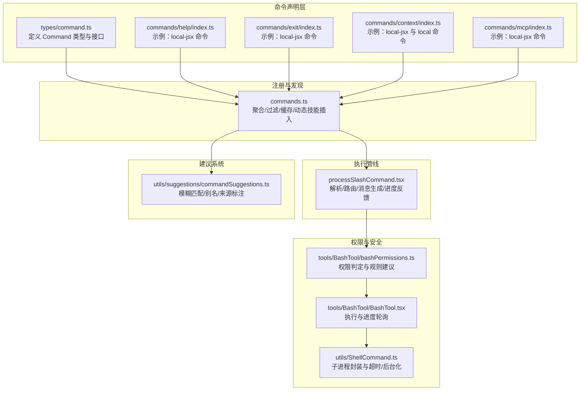
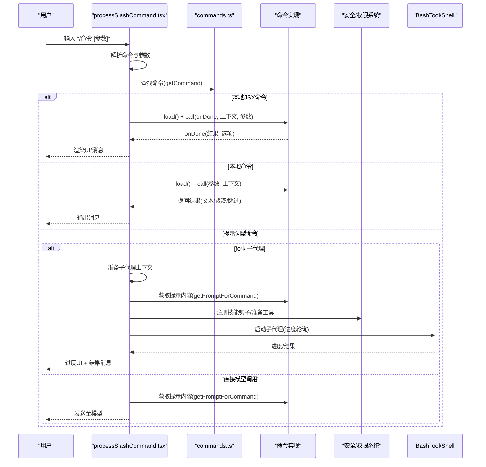
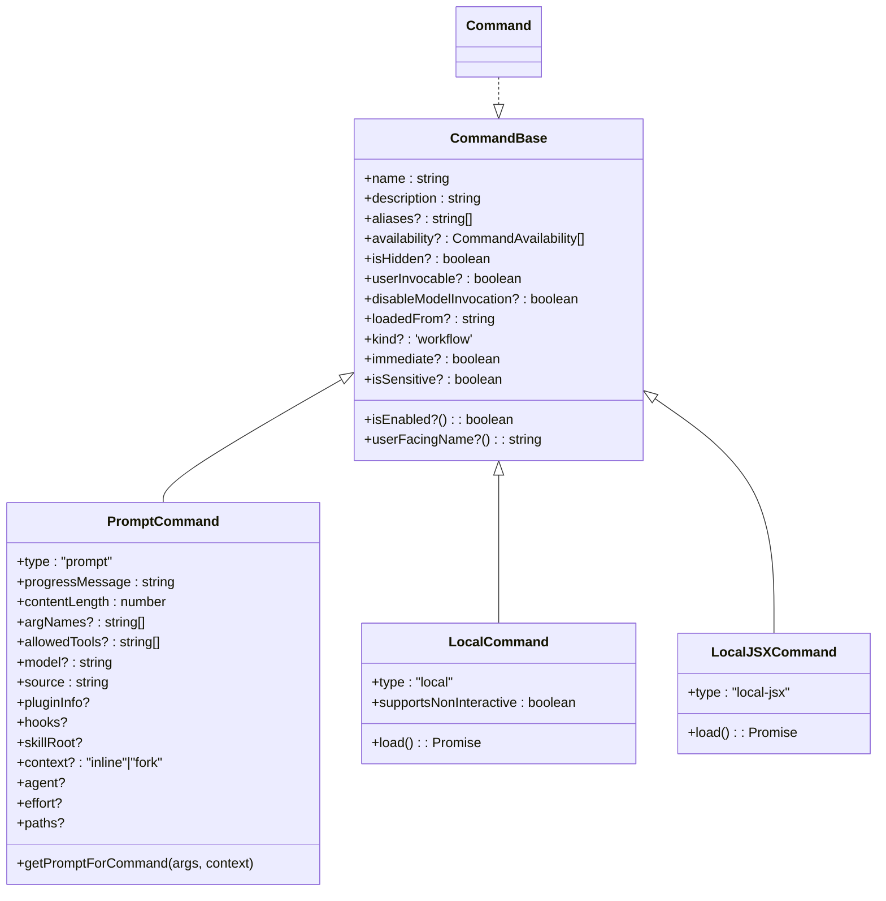
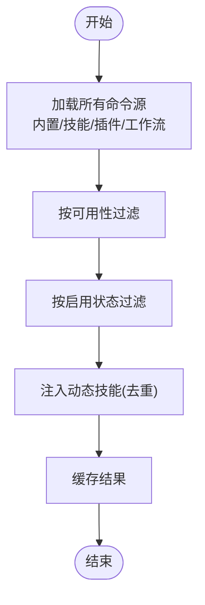
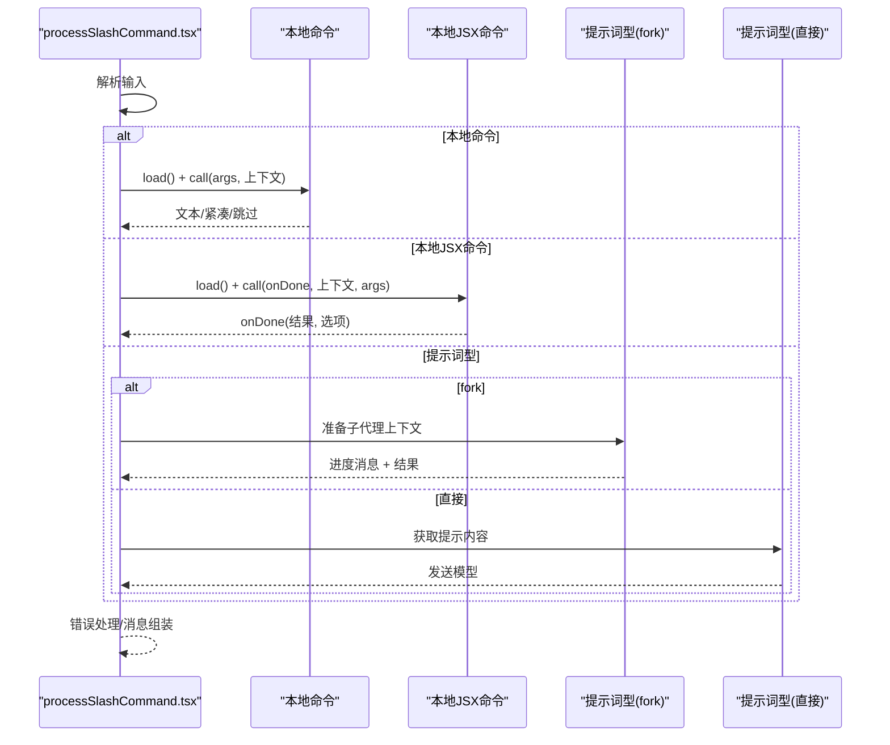
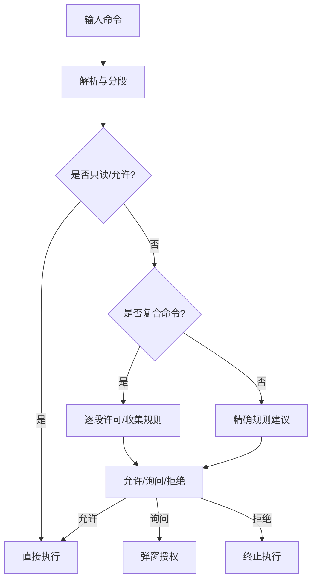
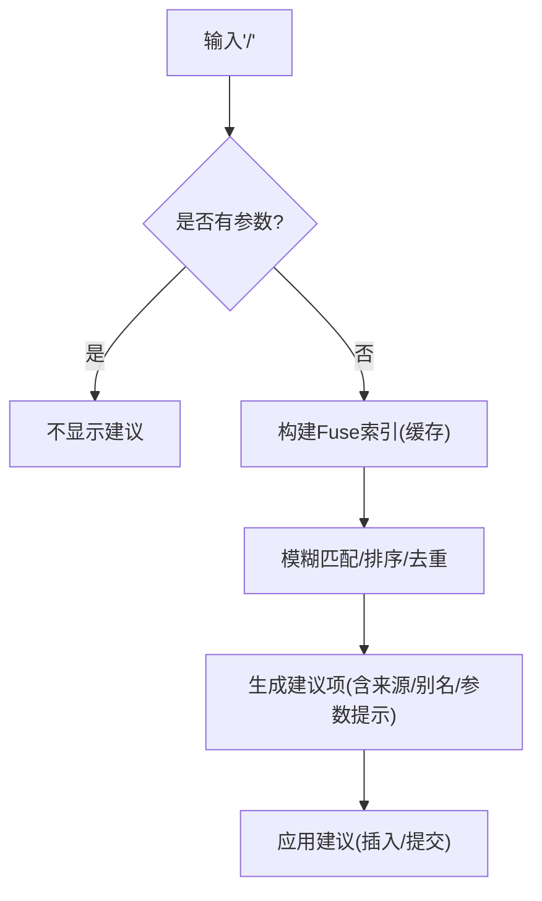
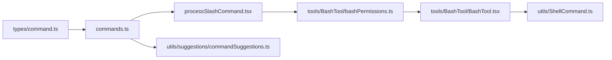

# 命令开发指南

<cite>
**本文档引用的文件**
- [commands.ts](file://commands.ts)
- [types/command.ts](file://types/command.ts)
- [utils/commandLifecycle.ts](file://utils/commandLifecycle.ts)
- [commands/help/index.ts](file://commands/help/index.ts)
- [commands/exit/index.ts](file://commands/exit/index.ts)
- [commands/context/index.ts](file://commands/context/index.ts)
- [commands/mcp/index.ts](file://commands/mcp/index.ts)
- [utils/suggestions/commandSuggestions.ts](file://utils/suggestions/commandSuggestions.ts)
- [utils/processUserInput/processSlashCommand.tsx](file://utils/processUserInput/processSlashCommand.tsx)
- [utils/exampleCommands.ts](file://utils/exampleCommands.ts)
- [tools/BashTool/bashPermissions.ts](file://tools/BashTool/bashPermissions.ts)
- [tools/BashTool/BashTool.tsx](file://tools/BashTool/BashTool.tsx)
- [utils/ShellCommand.ts](file://utils/ShellCommand.ts)
</cite>

## 目录
1. [简介](#简介)
2. [项目结构](#项目结构)
3. [核心组件](#核心组件)
4. [架构总览](#架构总览)
5. [详细组件分析](#详细组件分析)
6. [依赖关系分析](#依赖关系分析)
7. [性能考虑](#性能考虑)
8. [故障排查指南](#故障排查指南)
9. [结论](#结论)
10. [附录](#附录)

## 简介
本指南面向希望在 Claude Code 中开发自定义命令的开发者，涵盖命令类定义、参数与执行逻辑、错误处理、注册与生命周期、权限控制、命令建议系统、调试与测试等完整流程。文档以代码库的实际实现为依据，提供可操作的最佳实践与可视化图示，帮助你从零开始构建从简单到复杂的命令。

## 项目结构
命令系统由“命令声明”“命令注册与发现”“命令执行管线”“权限与安全”“命令建议系统”五大部分组成：

- 命令声明：统一在 types/command.ts 定义 Command 接口与类型（prompt/local/local-jsx），并在 commands/ 下以模块形式声明具体命令。
- 命令注册与发现：commands.ts 负责聚合内置命令、技能、插件技能、工作流等，并按可用性与启用状态过滤，提供查询、缓存与动态技能插入能力。
- 命令执行管线：processSlashCommand.tsx 解析输入、路由到具体命令、处理本地/提示词型命令、fork 子代理执行 prompt 命令、生成消息与进度反馈。
- 权限与安全：BashTool 及其权限系统对命令执行进行路径约束、只读检查、沙箱策略与用户授权决策；命令层也支持敏感参数脱敏与模型调用开关。
- 命令建议系统：commandSuggestions.ts 提供模糊匹配、别名与使用频率排序、来源标注等智能建议。

**图表来源**
- [commands.ts](file://commands.ts)
- [types/command.ts](file://types/command.ts)
- [utils/suggestions/commandSuggestions.ts](file://utils/suggestions/commandSuggestions.ts)
- [utils/processUserInput/processSlashCommand.tsx](file://utils/processUserInput/processSlashCommand.tsx)
- [tools/BashTool/bashPermissions.ts](file://tools/BashTool/bashPermissions.ts)
- [tools/BashTool/BashTool.tsx](file://tools/BashTool/BashTool.tsx)
- [utils/ShellCommand.ts](file://utils/ShellCommand.ts)

**章节来源**
- [commands.ts](file://commands.ts)
- [types/command.ts](file://types/command.ts)
- [utils/suggestions/commandSuggestions.ts](file://utils/suggestions/commandSuggestions.ts)
- [utils/processUserInput/processSlashCommand.tsx](file://utils/processUserInput/processSlashCommand.tsx)

## 核心组件
- 命令类型与接口
  - CommandBase：命令基础字段（名称、描述、别名、可用性、启用状态、来源等）
  - PromptCommand：提示词型命令（支持模型调用、上下文 fork、工具白名单、effort 等）
  - LocalCommand：本地命令（非 UI 渲染，返回文本或紧凑结果）
  - LocalJSXCommand：本地 JSX 命令（延迟加载，渲染 UI，通过 onDone 回传结果）
- 命令注册与发现
  - 内置命令聚合、条件导入、动态技能注入、可用性过滤、启用状态过滤、远程/桥接安全命令集合
- 执行管线
  - 解析斜杠命令、查找命令、路由到不同类型命令、生成消息、进度反馈、错误处理、结果格式化
- 权限与安全
  - BashTool 权限判定、只读检查、沙箱策略、子命令拆分与逐段许可、自动后台化与超时处理
- 建议系统
  - 命令模糊匹配、别名与使用频率排序、来源标注、中缀命令识别、建议应用

**章节来源**
- [types/command.ts](file://types/command.ts)
- [commands.ts](file://commands.ts)
- [utils/processUserInput/processSlashCommand.tsx](file://utils/processUserInput/processSlashCommand.tsx)
- [tools/BashTool/bashPermissions.ts](file://tools/BashTool/bashPermissions.ts)
- [utils/suggestions/commandSuggestions.ts](file://utils/suggestions/commandSuggestions.ts)

## 架构总览
下图展示命令从输入到输出的关键交互流程，包括本地命令、提示词型命令与 fork 子代理执行路径。

**图表来源**
- [utils/processUserInput/processSlashCommand.tsx](file://utils/processUserInput/processSlashCommand.tsx)
- [commands.ts](file://commands.ts)
- [types/command.ts](file://types/command.ts)
- [tools/BashTool/BashTool.tsx](file://tools/BashTool/BashTool.tsx)

## 详细组件分析

### 命令类型与继承关系
命令类型通过组合式接口定义，支持三种执行形态：
- prompt：可被模型调用，支持 fork 子代理、effort、allowedTools 等
- local：无 UI 渲染，返回文本或紧凑结果
- local-jsx：延迟加载 UI，通过 onDone 回传结果

**图表来源**
- [types/command.ts](file://types/command.ts)

**章节来源**
- [types/command.ts](file://types/command.ts)

### 命令注册与生命周期
- 聚合与过滤
  - commands.ts 将内置命令、技能、插件技能、工作流命令合并，并按 availability 与 isEnabled 过滤
  - 动态技能在运行时探测并去重后插入到合适位置
- 缓存与失效
  - 使用 memoize 对昂贵的加载过程进行缓存，提供 clearCommandMemoizationCaches 与 clearCommandsCache
- 生命周期通知
  - utils/commandLifecycle.ts 提供 setCommandLifecycleListener 与 notifyCommandLifecycle，便于外部监听命令启动/完成事件

**图表来源**
- [commands.ts](file://commands.ts)
- [utils/commandLifecycle.ts](file://utils/commandLifecycle.ts)

**章节来源**
- [commands.ts](file://commands.ts)
- [utils/commandLifecycle.ts](file://utils/commandLifecycle.ts)

### 命令执行管线与错误处理
- 解析与路由
  - processSlashCommand.tsx 解析斜杠命令，区分未知命令、文件路径与有效命令
  - 对 unknown 命令进行提示与保留参数，避免重复输入
- 本地命令
  - local：支持 skip/compact/text 三类结果；compact 会替换全量消息并保留特定消息
  - local-jsx：延迟加载，通过 onDone 控制消息显示、是否继续对话、元消息插入
- 提示词型命令
  - fork 子代理：支持进度 UI、后台运行、MCP 沉降等待、结果回填队列
  - 非 fork：直接生成提示内容发送给模型
- 错误处理
  - 统一捕获异常，区分中断、参数错误与一般错误，生成系统消息或中断消息

**图表来源**
- [utils/processUserInput/processSlashCommand.tsx](file://utils/processUserInput/processSlashCommand.tsx)
- [types/command.ts](file://types/command.ts)

**章节来源**
- [utils/processUserInput/processSlashCommand.tsx](file://utils/processUserInput/processSlashCommand.tsx)
- [types/command.ts](file://types/command.ts)

### 权限控制与安全
- BashTool 权限系统
  - 分段命令许可、只读检查、沙箱策略、模式特定处理、自动后台化与超时
  - 对复合命令进行子命令拆分与逐段许可，必要时收集规则建议
- 命令层安全
  - isSensitive 参数用于在历史记录中脱敏
  - disableModelInvocation 禁止用户直接调用仅模型可见的技能
  - BRIDGE_SAFE_COMMANDS/REMOTE_SAFE_COMMANDS 限制远程/桥接环境下的命令范围

**图表来源**
- [tools/BashTool/bashPermissions.ts](file://tools/BashTool/bashPermissions.ts)
- [tools/BashTool/BashTool.tsx](file://tools/BashTool/BashTool.tsx)
- [utils/ShellCommand.ts](file://utils/ShellCommand.ts)

**章节来源**
- [tools/BashTool/bashPermissions.ts](file://tools/BashTool/bashPermissions.ts)
- [tools/BashTool/BashTool.tsx](file://tools/BashTool/BashTool.tsx)
- [utils/ShellCommand.ts](file://utils/ShellCommand.ts)

### 命令建议系统
- 模糊匹配与排序
  - 使用 Fuse.js，优先级：精确名/别名前缀 > 名称前缀 > 描述模糊匹配 > 使用频率
- 别名与来源标注
  - 支持别名高亮、工作流标记、来源标注（插件/内置/捆绑等）
- 中缀命令识别
  - 识别光标前中缀命令，提供内联补全后缀
- 应用建议
  - 自动追加空格与参数提示，必要时直接提交无参命令

**图表来源**
- [utils/suggestions/commandSuggestions.ts](file://utils/suggestions/commandSuggestions.ts)
- [commands.ts](file://commands.ts)

**章节来源**
- [utils/suggestions/commandSuggestions.ts](file://utils/suggestions/commandSuggestions.ts)
- [commands.ts](file://commands.ts)

### 命令开发最佳实践
- 参数定义
  - 使用 argNames 提示参数顺序；argumentHint 提供一次性提示；isSensitive 标记敏感参数
  - 对于提示词型命令，合理设置 contentLength 与 progressMessage，提升 token 估算与进度反馈
- 执行逻辑
  - 本地命令优先返回紧凑结果(compact)以减少上下文膨胀；必要时使用 skip 跳过消息
  - JSX 命令通过 onDone 控制显示策略(display/system/skip)、是否继续对话(shouldQuery)、元消息(metaMessages)
- 异步与进度
  - fork 子代理命令应提供清晰的 progressMessage 与 effort；前台命令可利用 BashTool 的 onProgress 与后台化
- 错误处理
  - 明确区分中断(AbortError)与一般错误，分别返回中断消息与错误消息
  - 对未知命令保留参数以便复用，避免用户重复输入
- 权限与安全
  - 优先采用只读命令与沙箱策略；对复合命令逐段许可；必要时提供规则建议
  - 在远程/桥接环境下，仅开放安全命令集

**章节来源**
- [types/command.ts](file://types/command.ts)
- [utils/processUserInput/processSlashCommand.tsx](file://utils/processUserInput/processSlashCommand.tsx)
- [tools/BashTool/bashPermissions.ts](file://tools/BashTool/bashPermissions.ts)
- [commands.ts](file://commands.ts)

### 命令开发示例

#### 示例一：简单本地命令（local）
- 目标：输出一段文本结果，不渲染 UI，不继续对话
- 关键点：
  - type: "local"
  - supportsNonInteractive: true
  - load 返回包含 call(args, context) 的模块
  - call 返回 { type: "text", value } 或 { type: "skip" }
- 参考文件：
  - [commands/context/index.ts](file://commands/context/index.ts)

**章节来源**
- [commands/context/index.ts](file://commands/context/index.ts)
- [types/command.ts](file://types/command.ts)

#### 示例二：本地 JSX 命令（local-jsx）
- 目标：渲染 UI 并通过 onDone 返回结果
- 关键点：
  - type: "local-jsx"
  - load 返回包含 call(onDone, context, args) 的模块
  - onDone(result?, { display, shouldQuery, metaMessages, nextInput, submitNextInput })
  - immediate: true 可立即执行（不排队）
- 参考文件：
  - [commands/help/index.ts](file://commands/help/index.ts)
  - [commands/exit/index.ts](file://commands/exit/index.ts)
  - [commands/mcp/index.ts](file://commands/mcp/index.ts)

**章节来源**
- [commands/help/index.ts](file://commands/help/index.ts)
- [commands/exit/index.ts](file://commands/exit/index.ts)
- [commands/mcp/index.ts](file://commands/mcp/index.ts)
- [types/command.ts](file://types/command.ts)

#### 示例三：提示词型命令（prompt）与 fork 子代理
- 目标：通过模型执行复杂任务，支持进度反馈与后台运行
- 关键点：
  - type: "prompt"
  - context: "fork" 触发子代理执行
  - getPromptForCommand(args, context) 生成提示内容
  - 进度 UI 由 processSlashCommand.tsx 管理
- 参考文件：
  - [utils/processUserInput/processSlashCommand.tsx](file://utils/processUserInput/processSlashCommand.tsx)

**章节来源**
- [utils/processUserInput/processSlashCommand.tsx](file://utils/processUserInput/processSlashCommand.tsx)
- [types/command.ts](file://types/command.ts)

#### 示例四：带参数与进度反馈的命令
- 目标：根据参数生成提示内容，提供进度与结果
- 关键点：
  - argNames 与 argumentHint 提示参数
  - progressMessage 与 contentLength 用于估算与进度
  - fork 子代理时，注意 MCP 沉降等待与结果回填
- 参考文件：
  - [utils/processUserInput/processSlashCommand.tsx](file://utils/processUserInput/processSlashCommand.tsx)
  - [utils/exampleCommands.ts](file://utils/exampleCommands.ts)

**章节来源**
- [utils/processUserInput/processSlashCommand.tsx](file://utils/processUserInput/processSlashCommand.tsx)
- [utils/exampleCommands.ts](file://utils/exampleCommands.ts)

## 依赖关系分析
- 命令声明依赖 types/command.ts 的统一接口
- 命令注册依赖 commands.ts 的聚合与过滤逻辑
- 执行管线依赖 processSlashCommand.tsx 的路由与消息生成
- 权限系统依赖 BashTool 的许可判定与 Shell 封装
- 建议系统依赖 commandSuggestions.ts 的搜索与排序

**图表来源**
- [types/command.ts](file://types/command.ts)
- [commands.ts](file://commands.ts)
- [utils/processUserInput/processSlashCommand.tsx](file://utils/processUserInput/processSlashCommand.tsx)
- [tools/BashTool/bashPermissions.ts](file://tools/BashTool/bashPermissions.ts)
- [tools/BashTool/BashTool.tsx](file://tools/BashTool/BashTool.tsx)
- [utils/ShellCommand.ts](file://utils/ShellCommand.ts)
- [utils/suggestions/commandSuggestions.ts](file://utils/suggestions/commandSuggestions.ts)

**章节来源**
- [commands.ts](file://commands.ts)
- [utils/processUserInput/processSlashCommand.tsx](file://utils/processUserInput/processSlashCommand.tsx)
- [tools/BashTool/bashPermissions.ts](file://tools/BashTool/bashPermissions.ts)
- [utils/suggestions/commandSuggestions.ts](file://utils/suggestions/commandSuggestions.ts)

## 性能考虑
- 命令列表缓存
  - 使用 memoize 缓存 getCommands/loadAllCommands，避免重复磁盘 I/O 与动态导入
  - 提供 clearCommandMemoizationCaches 与 clearCommandsCache 以响应动态技能变化
- 进度与后台化
  - BashTool 的 onProgress 与自动后台化减少长时间前台阻塞
  - fork 子代理支持后台运行与 MCP 沉降等待，避免阻塞主线程
- 建议系统优化
  - Fuse 索引按命令数组身份缓存，避免每击键重建
  - 使用使用频率与来源权重排序，减少无效候选

**章节来源**
- [commands.ts](file://commands.ts)
- [utils/processUserInput/processSlashCommand.tsx](file://utils/processUserInput/processSlashCommand.tsx)
- [tools/BashTool/BashTool.tsx](file://tools/BashTool/BashTool.tsx)
- [utils/suggestions/commandSuggestions.ts](file://utils/suggestions/commandSuggestions.ts)

## 故障排查指南
- 命令未显示或不可用
  - 检查 availability 与 isEnabled 是否满足当前环境与功能开关
  - 确认命令未被 isHidden 标记
- 未知命令或路径冲突
  - processSlashCommand.tsx 会对看起来像命令但不存在的情况给出提示，并保留参数
- 权限拒绝
  - BashTool 会在无法解析或需要授权时返回 passthrough，并提供规则建议
  - 复合命令会逐段许可，必要时收集规则
- 远程/桥接限制
  - 仅允许 REMOTE_SAFE_COMMANDS/BRIDGE_SAFE_COMMANDS 中的命令执行
- 调试与日志
  - 使用 logForDebugging 与 logError 记录关键路径
  - 命令生命周期可通过 setCommandLifecycleListener 监听

**章节来源**
- [utils/processUserInput/processSlashCommand.tsx](file://utils/processUserInput/processSlashCommand.tsx)
- [tools/BashTool/bashPermissions.ts](file://tools/BashTool/bashPermissions.ts)
- [commands.ts](file://commands.ts)
- [utils/commandLifecycle.ts](file://utils/commandLifecycle.ts)

## 结论
通过统一的命令类型接口、完善的注册与发现机制、健壮的执行管线与权限体系，以及智能的建议系统，Claude Code 的命令开发具备良好的扩展性与安全性。遵循本文档的最佳实践，你可以快速构建从简单到复杂的命令，并在远程/桥接场景中保持一致的用户体验。

## 附录
- 命令开发清单
  - 定义命令类型与接口（prompt/local/local-jsx）
  - 实现参数解析与校验（argNames/argumentHint/isSensitive）
  - 设计执行逻辑（本地/提示词型/fork 子代理）
  - 集成权限与安全（只读/沙箱/规则建议）
  - 配置建议系统（来源标注/别名/使用频率）
  - 添加生命周期监听与调试日志
- 测试建议
  - 单元测试：命令参数解析、结果格式化、错误分支
  - 集成测试：执行管线端到端、权限判定、进度反馈
  - 性能测试：命令列表缓存命中率、建议系统响应时间