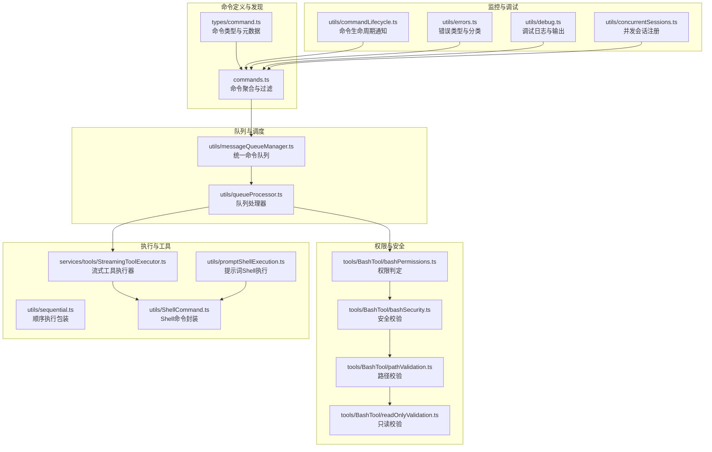
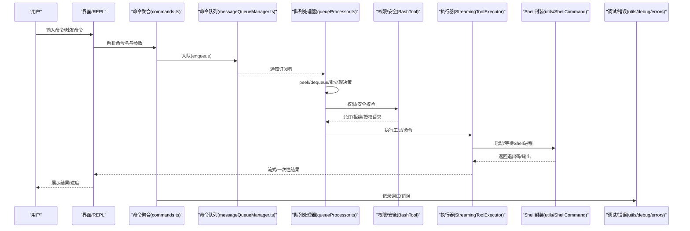
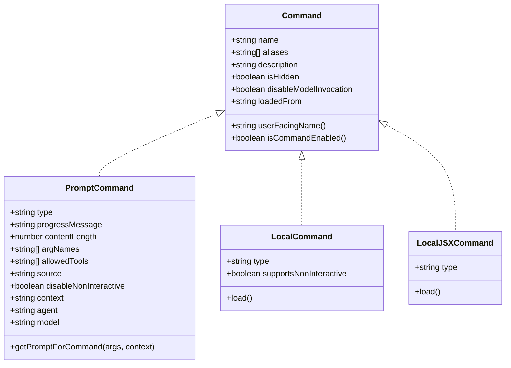
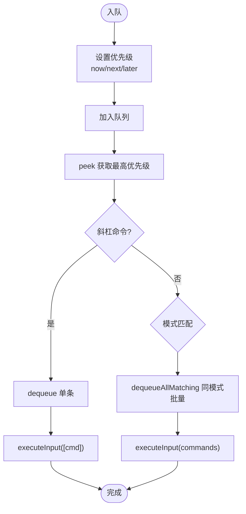
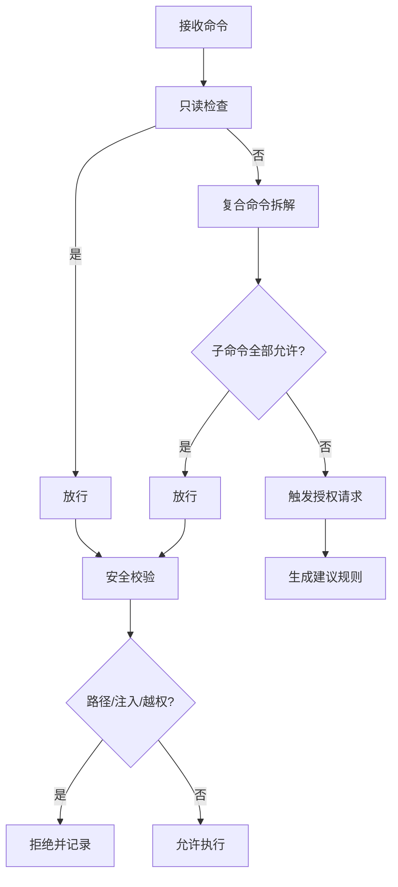
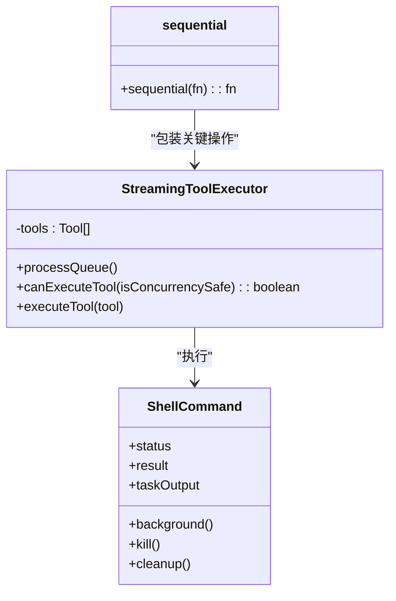
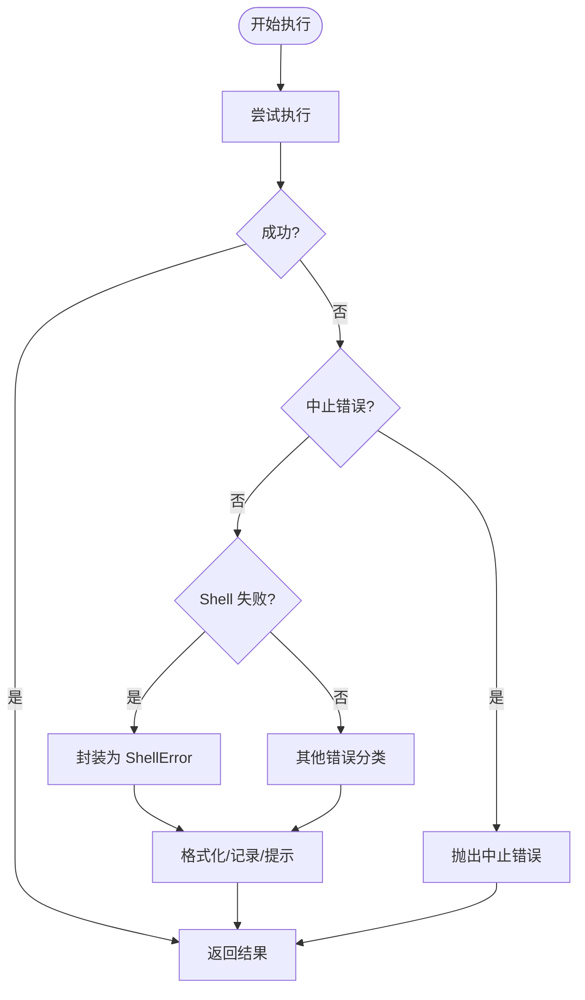
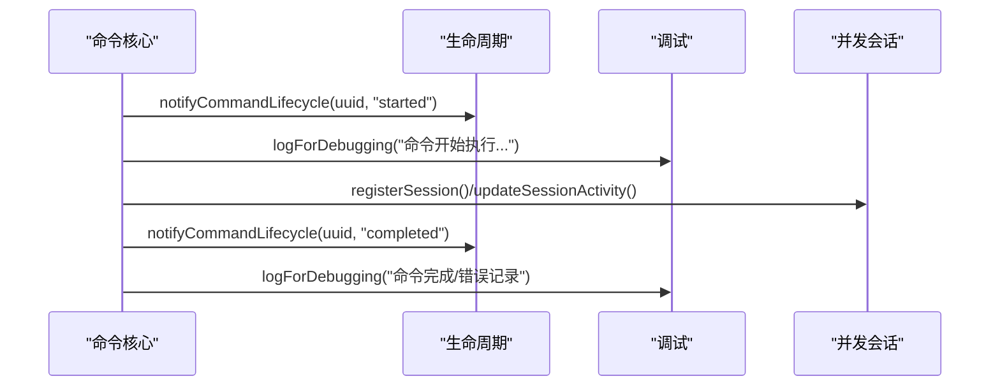
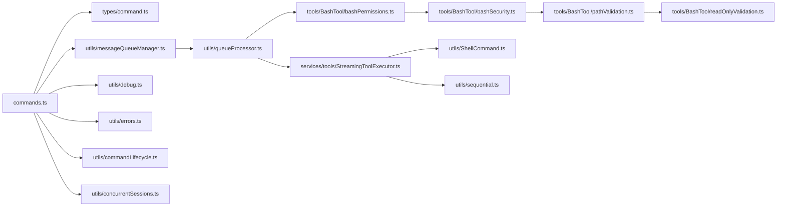

# 命令执行机制

<cite>
**本文引用的文件**
- [commands.ts](file://commands.ts)
- [types/command.ts](file://types/command.ts)
- [utils/commandLifecycle.ts](file://utils/commandLifecycle.ts)
- [utils/queueProcessor.ts](file://utils/queueProcessor.ts)
- [utils/messageQueueManager.ts](file://utils/messageQueueManager.ts)
- [utils/errors.ts](file://utils/errors.ts)
- [utils/debug.ts](file://utils/debug.ts)
- [utils/concurrentSessions.ts](file://utils/concurrentSessions.ts)
- [tools/BashTool/bashPermissions.ts](file://tools/BashTool/bashPermissions.ts)
- [tools/BashTool/bashSecurity.ts](file://tools/BashTool/bashSecurity.ts)
- [tools/BashTool/pathValidation.ts](file://tools/BashTool/pathValidation.ts)
- [tools/BashTool/readOnlyValidation.ts](file://tools/BashTool/readOnlyValidation.ts)
- [utils/promptShellExecution.ts](file://utils/promptShellExecution.ts)
- [utils/ShellCommand.ts](file://utils/ShellCommand.ts)
- [services/tools/StreamingToolExecutor.ts](file://services/tools/StreamingToolExecutor.ts)
- [utils/sequential.ts](file://utils/sequential.ts)
- [commands/help/index.ts](file://commands/help/index.ts)
- [commands/clear/index.ts](file://commands/clear/index.ts)
</cite>

## 目录
1. [简介](#简介)
2. [项目结构](#项目结构)
3. [核心组件](#核心组件)
4. [架构总览](#架构总览)
5. [详细组件分析](#详细组件分析)
6. [依赖关系分析](#依赖关系分析)
7. [性能考量](#性能考量)
8. [故障排查指南](#故障排查指南)
9. [结论](#结论)
10. [附录](#附录)

## 简介
本文件系统性阐述 Claude Code 的命令执行机制，覆盖从输入到输出的全生命周期：命令解析、验证（含权限与安全）、调度与执行、异步与并发控制、错误处理与异常恢复、监控与调试、以及与用户界面的交互方式。文档同时给出性能优化与资源管理策略，帮助开发者与使用者高效、安全地使用命令系统。

## 项目结构
命令系统由“命令定义与发现”“队列与调度”“权限与安全”“执行器与工具”“错误与调试”等模块协同完成。核心入口在命令聚合与过滤，随后进入统一队列，按优先级与模式进行批处理或单条处理，配合权限与安全校验后执行具体命令实现。

**图表来源**
- [commands.ts:258-517](file://commands.ts#L258-L517)
- [types/command.ts:16-217](file://types/command.ts#L16-L217)
- [utils/messageQueueManager.ts:53-337](file://utils/messageQueueManager.ts#L53-L337)
- [utils/queueProcessor.ts:52-95](file://utils/queueProcessor.ts#L52-L95)
- [tools/BashTool/bashPermissions.ts:1147-2473](file://tools/BashTool/bashPermissions.ts#L1147-L2473)
- [tools/BashTool/bashSecurity.ts:214-2592](file://tools/BashTool/bashSecurity.ts#L214-L2592)
- [tools/BashTool/pathValidation.ts:834-845](file://tools/BashTool/pathValidation.ts#L834-L845)
- [tools/BashTool/readOnlyValidation.ts:1422-1440](file://tools/BashTool/readOnlyValidation.ts#L1422-L1440)
- [services/tools/StreamingToolExecutor.ts:126-151](file://services/tools/StreamingToolExecutor.ts#L126-L151)
- [utils/sequential.ts:19-56](file://utils/sequential.ts#L19-L56)
- [utils/ShellCommand.ts:413-465](file://utils/ShellCommand.ts#L413-L465)
- [utils/promptShellExecution.ts:164-183](file://utils/promptShellExecution.ts#L164-L183)
- [utils/commandLifecycle.ts:1-22](file://utils/commandLifecycle.ts#L1-L22)
- [utils/errors.ts:1-239](file://utils/errors.ts#L1-L239)
- [utils/debug.ts:203-228](file://utils/debug.ts#L203-L228)
- [utils/concurrentSessions.ts:59-109](file://utils/concurrentSessions.ts#L59-L109)

**章节来源**
- [commands.ts:258-517](file://commands.ts#L258-L517)
- [types/command.ts:16-217](file://types/command.ts#L16-L217)
- [utils/messageQueueManager.ts:53-337](file://utils/messageQueueManager.ts#L53-L337)
- [utils/queueProcessor.ts:52-95](file://utils/queueProcessor.ts#L52-L95)

## 核心组件
- 命令定义与发现
  - 统一导出命令集合，支持动态技能、插件技能、工作流命令与内置命令的合并与去重，按可用性与启用状态过滤。
  - 提供命令查找、描述格式化、远程/桥接安全命令白名单等能力。
- 队列与调度
  - 单一命令队列，支持优先级（now/next/later）与模式（prompt/task-notification/bash 等）分组批处理。
  - 队列处理器区分斜杠命令与 Bash 模式命令，前者逐条执行以保证错误隔离与进度 UI，后者批量处理提升吞吐。
- 权限与安全
  - Bash 工具权限判定：只读命令放行、复合命令子命令允许则允许、未命中规则则请求授权。
  - 安全校验：不完整命令、潜在注入、路径越权等多维检测；路径命令剥离包装后校验实际命令与路径合法性。
- 执行器与工具
  - 流式工具执行器：基于并发安全标记串行或并发执行，维护执行顺序与一致性。
  - Shell 封装：抽象命令结果、中断与失败场景，提供中止/失败命令构造器。
- 错误与调试
  - 统一错误类型与分类（中止、Shell、配置、网络等），短栈输出用于模型工具结果。
  - 调试日志：支持级别过滤、文件输出、标准错误直出、最新日志链接等。
- 生命周期与并发
  - 命令生命周期通知：开始/完成事件回调。
  - 并发会话注册：PID 文件登记、活跃状态更新、并发计数清理。

**章节来源**
- [commands.ts:449-517](file://commands.ts#L449-L517)
- [utils/messageQueueManager.ts:128-149](file://utils/messageQueueManager.ts#L128-L149)
- [utils/queueProcessor.ts:68-86](file://utils/queueProcessor.ts#L68-L86)
- [tools/BashTool/bashPermissions.ts:1147-2473](file://tools/BashTool/bashPermissions.ts#L1147-L2473)
- [tools/BashTool/bashSecurity.ts:214-2592](file://tools/BashTool/bashSecurity.ts#L214-L2592)
- [services/tools/StreamingToolExecutor.ts:126-151](file://services/tools/StreamingToolExecutor.ts#L126-L151)
- [utils/ShellCommand.ts:413-465](file://utils/ShellCommand.ts#L413-L465)
- [utils/errors.ts:1-239](file://utils/errors.ts#L1-L239)
- [utils/debug.ts:203-228](file://utils/debug.ts#L203-L228)
- [utils/commandLifecycle.ts:1-22](file://utils/commandLifecycle.ts#L1-L22)
- [utils/concurrentSessions.ts:59-109](file://utils/concurrentSessions.ts#L59-L109)

## 架构总览
命令执行的端到端流程如下：

**图表来源**
- [commands.ts:258-517](file://commands.ts#L258-L517)
- [utils/messageQueueManager.ts:128-149](file://utils/messageQueueManager.ts#L128-L149)
- [utils/queueProcessor.ts:52-95](file://utils/queueProcessor.ts#L52-L95)
- [tools/BashTool/bashPermissions.ts:1147-2473](file://tools/BashTool/bashPermissions.ts#L1147-L2473)
- [services/tools/StreamingToolExecutor.ts:126-151](file://services/tools/StreamingToolExecutor.ts#L126-L151)
- [utils/ShellCommand.ts:413-465](file://utils/ShellCommand.ts#L413-L465)
- [utils/debug.ts:203-228](file://utils/debug.ts#L203-L228)
- [utils/errors.ts:1-239](file://utils/errors.ts#L1-L239)

## 详细组件分析

### 命令解析与发现
- 命令聚合
  - 动态加载技能目录、插件技能、内置命令与工作流命令，合并后按可用性与启用状态过滤，支持动态技能插入。
  - 远程/桥接安全命令白名单：仅允许本地状态变更类命令，屏蔽需要本地上下文的命令。
- 命令类型
  - prompt/local/local-jsx 三类命令，分别对应模型调用型、本地文本输出型、本地 UI 渲染型。
  - 支持别名、描述、版本、是否对模型可见、是否敏感参数等元信息。
- 命令查找与展示
  - 提供命令查找、存在性判断、名称格式化（含来源标注）等工具方法。

**图表来源**
- [types/command.ts:16-217](file://types/command.ts#L16-L217)

**章节来源**
- [commands.ts:449-517](file://commands.ts#L449-L517)
- [types/command.ts:16-217](file://types/command.ts#L16-L217)

### 输入处理与参数解析
- 队列写入
  - 用户输入与系统通知统一入队，支持优先级与可见性控制；任务通知默认低优先级，避免阻塞用户输入。
- 队列读取与批处理
  - 处理器根据模式与优先级选择逐条或批量执行；斜杠命令与 Bash 命令单独处理，确保错误隔离与进度反馈。
- 文本/富内容提取
  - 对字符串与富内容块进行文本提取与图片提取，便于编辑与预览。

**图表来源**
- [utils/messageQueueManager.ts:128-149](file://utils/messageQueueManager.ts#L128-L149)
- [utils/queueProcessor.ts:52-95](file://utils/queueProcessor.ts#L52-L95)

**章节来源**
- [utils/messageQueueManager.ts:128-149](file://utils/messageQueueManager.ts#L128-L149)
- [utils/queueProcessor.ts:52-95](file://utils/queueProcessor.ts#L52-L95)

### 权限检查与安全校验
- 权限判定
  - 只读命令直接放行；复合命令若所有子命令允许则整体允许；否则触发授权请求并提供建议规则。
- 安全校验
  - 不完整命令、潜在注入、路径越权等多维检测；路径命令剥离安全包装后校验实际命令与路径。
- 只读命令集
  - 通过正则限制命令调用的安全模式，避免写入与注入风险。

**图表来源**
- [tools/BashTool/bashPermissions.ts:1147-2473](file://tools/BashTool/bashPermissions.ts#L1147-L2473)
- [tools/BashTool/bashSecurity.ts:214-2592](file://tools/BashTool/bashSecurity.ts#L214-L2592)
- [tools/BashTool/pathValidation.ts:834-845](file://tools/BashTool/pathValidation.ts#L834-L845)
- [tools/BashTool/readOnlyValidation.ts:1422-1440](file://tools/BashTool/readOnlyValidation.ts#L1422-L1440)

**章节来源**
- [tools/BashTool/bashPermissions.ts:1147-2473](file://tools/BashTool/bashPermissions.ts#L1147-L2473)
- [tools/BashTool/bashSecurity.ts:214-2592](file://tools/BashTool/bashSecurity.ts#L214-L2592)
- [tools/BashTool/pathValidation.ts:834-845](file://tools/BashTool/pathValidation.ts#L834-L845)
- [tools/BashTool/readOnlyValidation.ts:1422-1440](file://tools/BashTool/readOnlyValidation.ts#L1422-L1440)

### 执行调度与并发控制
- 工具执行器
  - 基于并发安全标记串行或并发执行，非并发工具需等待当前执行队列清空，保持顺序一致性。
- 顺序执行包装
  - 对易产生竞态的操作（如文件写入）提供顺序执行包装，确保调用有序且正确返回。
- Shell 封装
  - 统一封装命令结果、中断与失败场景，提供中止/失败命令构造器，便于上层统一处理。

**图表来源**
- [services/tools/StreamingToolExecutor.ts:126-151](file://services/tools/StreamingToolExecutor.ts#L126-L151)
- [utils/sequential.ts:19-56](file://utils/sequential.ts#L19-L56)
- [utils/ShellCommand.ts:413-465](file://utils/ShellCommand.ts#L413-L465)

**章节来源**
- [services/tools/StreamingToolExecutor.ts:126-151](file://services/tools/StreamingToolExecutor.ts#L126-L151)
- [utils/sequential.ts:19-56](file://utils/sequential.ts#L19-L56)
- [utils/ShellCommand.ts:413-465](file://utils/ShellCommand.ts#L413-L465)

### 异步机制与错误处理
- 异步与并发
  - 队列处理器在主循环间运行，逐条或批量处理命令；工具执行器按并发安全策略串行/并发。
- 错误处理
  - 统一错误类型与分类，短栈输出用于模型工具结果；Shell 失败封装为 ShellError，便于上层识别与处理。
- 异常恢复
  - 中止类错误（AbortError、SDK 中止）与 Shell 失败有明确分支；提示词 Shell 执行将错误格式化为可读消息。

**图表来源**
- [utils/errors.ts:1-239](file://utils/errors.ts#L1-L239)
- [utils/promptShellExecution.ts:164-183](file://utils/promptShellExecution.ts#L164-L183)
- [utils/ShellCommand.ts:413-465](file://utils/ShellCommand.ts#L413-L465)

**章节来源**
- [utils/errors.ts:1-239](file://utils/errors.ts#L1-L239)
- [utils/promptShellExecution.ts:164-183](file://utils/promptShellExecution.ts#L164-L183)
- [utils/ShellCommand.ts:413-465](file://utils/ShellCommand.ts#L413-L465)

### 命令生命周期与监控
- 生命周期通知
  - 提供监听器注册与通知接口，上报命令开始/完成事件，便于外部统计与可视化。
- 调试与日志
  - 支持级别过滤、文件输出、标准错误直出、最新日志链接；提供最小日志级别与过滤器解析。
- 并发会话
  - 注册 PID 文件、更新活动状态、清理僵尸文件、统计并发会话数，辅助并发控制与诊断。

**图表来源**
- [utils/commandLifecycle.ts:1-22](file://utils/commandLifecycle.ts#L1-L22)
- [utils/debug.ts:203-228](file://utils/debug.ts#L203-L228)
- [utils/concurrentSessions.ts:59-109](file://utils/concurrentSessions.ts#L59-L109)

**章节来源**
- [utils/commandLifecycle.ts:1-22](file://utils/commandLifecycle.ts#L1-L22)
- [utils/debug.ts:203-228](file://utils/debug.ts#L203-L228)
- [utils/concurrentSessions.ts:59-109](file://utils/concurrentSessions.ts#L59-L109)

### 与用户界面的交互
- 命令类型与 UI
  - local-jsx 命令通过延迟加载渲染 UI 组件；local 命令返回文本或压缩结果；prompt 命令扩展为模型输入。
- 队列与输入缓冲
  - 可编辑命令可弹出合并至输入缓冲，支持光标偏移与图片恢复；通知类命令不可编辑但可见。
- 远程/桥接安全
  - 远程模式下预过滤仅允许本地状态变更命令；桥接模式下仅允许白名单内命令。

**章节来源**
- [types/command.ts:62-152](file://types/command.ts#L62-L152)
- [utils/messageQueueManager.ts:428-484](file://utils/messageQueueManager.ts#L428-L484)
- [commands.ts:619-686](file://commands.ts#L619-L686)

## 依赖关系分析
- 命令聚合依赖
  - commands.ts 依赖 types/command.ts 的类型定义，依赖技能/插件/工作流加载器，依赖可用性与启用状态过滤。
- 队列与处理器
  - messageQueueManager.ts 提供队列读写与快照；queueProcessor.ts 基于队列进行批处理决策。
- 权限与安全
  - BashTool 的权限与安全模块相互协作，形成完整的校验链。
- 执行与工具
  - StreamingToolExecutor 依赖 Shell 封装；sequential 包装关键异步函数。
- 调试与错误
  - 调试日志与错误分类贯穿各模块，提供一致的可观测性。

**图表来源**
- [commands.ts:258-517](file://commands.ts#L258-L517)
- [types/command.ts:16-217](file://types/command.ts#L16-L217)
- [utils/messageQueueManager.ts:53-337](file://utils/messageQueueManager.ts#L53-L337)
- [utils/queueProcessor.ts:52-95](file://utils/queueProcessor.ts#L52-L95)
- [tools/BashTool/bashPermissions.ts:1147-2473](file://tools/BashTool/bashPermissions.ts#L1147-L2473)
- [tools/BashTool/bashSecurity.ts:214-2592](file://tools/BashTool/bashSecurity.ts#L214-L2592)
- [tools/BashTool/pathValidation.ts:834-845](file://tools/BashTool/pathValidation.ts#L834-L845)
- [tools/BashTool/readOnlyValidation.ts:1422-1440](file://tools/BashTool/readOnlyValidation.ts#L1422-L1440)
- [services/tools/StreamingToolExecutor.ts:126-151](file://services/tools/StreamingToolExecutor.ts#L126-L151)
- [utils/sequential.ts:19-56](file://utils/sequential.ts#L19-L56)
- [utils/ShellCommand.ts:413-465](file://utils/ShellCommand.ts#L413-L465)
- [utils/debug.ts:203-228](file://utils/debug.ts#L203-L228)
- [utils/errors.ts:1-239](file://utils/errors.ts#L1-L239)
- [utils/commandLifecycle.ts:1-22](file://utils/commandLifecycle.ts#L1-L22)
- [utils/concurrentSessions.ts:59-109](file://utils/concurrentSessions.ts#L59-L109)

**章节来源**
- [commands.ts:258-517](file://commands.ts#L258-L517)
- [utils/messageQueueManager.ts:53-337](file://utils/messageQueueManager.ts#L53-L337)
- [utils/queueProcessor.ts:52-95](file://utils/queueProcessor.ts#L52-L95)

## 性能考量
- 队列批处理
  - 非斜杠命令按模式批处理，减少模型调用与 UI 刷新次数，提升吞吐。
- 并发控制
  - 工具执行器按并发安全策略串行/并发，避免锁争用与竞态。
- 缓存与懒加载
  - 命令列表与技能加载采用记忆化缓存，降低重复加载开销；部分命令实现采用延迟加载。
- 日志与观测
  - 调试日志缓冲与文件落盘，避免高频写入影响性能；并发会话统计用于资源评估。

[本节为通用指导，无需特定文件分析]

## 故障排查指南
- 常见问题定位
  - 使用调试日志开启与过滤，查看命令入队、出队、执行与错误信息。
  - 检查权限与安全校验日志，确认是否因只读/路径/注入等被拒绝。
- 错误分类与处理
  - 中止错误：检查中止来源（用户、SDK、信号）；Shell 失败：查看退出码与输出。
  - 网络/认证/超时：通过错误分类快速定位。
- 并发与会话
  - 查看并发会话注册与清理，确认是否存在僵尸文件或会话冲突。

**章节来源**
- [utils/debug.ts:203-228](file://utils/debug.ts#L203-L228)
- [utils/errors.ts:1-239](file://utils/errors.ts#L1-L239)
- [utils/concurrentSessions.ts:168-204](file://utils/concurrentSessions.ts#L168-L204)

## 结论
该命令执行机制通过“统一命令定义与发现—队列与调度—权限与安全—执行器与工具—错误与调试”的分层设计，实现了高安全性、高并发、可观测的命令执行体系。结合远程/桥接安全策略与生命周期监控，既保障了用户体验，也满足了生产环境的稳定性与可运维性。

## 附录
- 命令示例参考
  - help 命令：local-jsx 类型，延迟加载 UI 实现。
  - clear 命令：local 类型，延迟加载清理逻辑。

**章节来源**
- [commands/help/index.ts:1-11](file://commands/help/index.ts#L1-L11)
- [commands/clear/index.ts:1-20](file://commands/clear/index.ts#L1-L20)