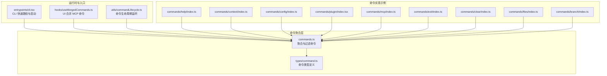
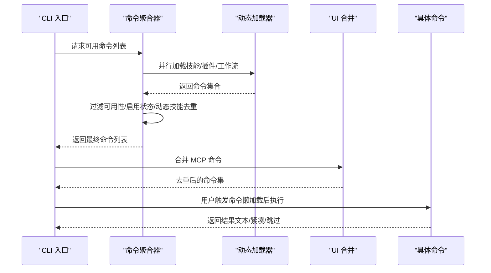
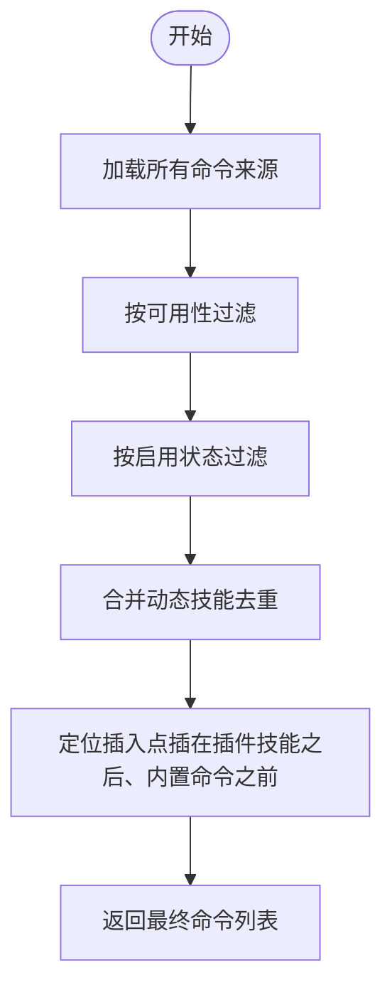
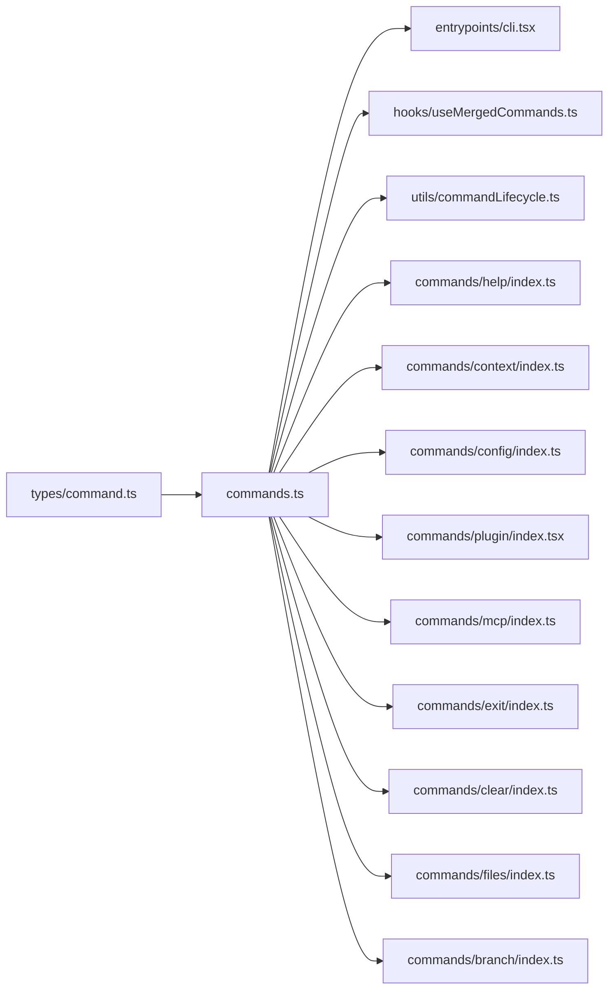

# 命令系统

<cite>
**本文引用的文件**
- [commands.ts](file://commands.ts)
- [types/command.ts](file://types/command.ts)
- [utils/commandLifecycle.ts](file://utils/commandLifecycle.ts)
- [hooks/useMergedCommands.ts](file://hooks/useMergedCommands.ts)
- [entrypoints/cli.tsx](file://entrypoints/cli.tsx)
- [commands/help/index.ts](file://commands/help/index.ts)
- [commands/context/index.ts](file://commands/context/index.ts)
- [commands/config/index.ts](file://commands/config/index.ts)
- [commands/plugin/index.tsx](file://commands/plugin/index.tsx)
- [commands/mcp/index.ts](file://commands/mcp/index.ts)
- [commands/exit/index.ts](file://commands/exit/index.ts)
- [commands/clear/index.ts](file://commands/clear/index.ts)
- [commands/files/index.ts](file://commands/files/index.ts)
- [commands/branch/index.ts](file://commands/branch/index.ts)
</cite>

## 目录
1. [简介](#简介)
2. [项目结构](#项目结构)
3. [核心组件](#核心组件)
4. [架构总览](#架构总览)
5. [详细组件分析](#详细组件分析)
6. [依赖关系分析](#依赖关系分析)
7. [性能考量](#性能考量)
8. [故障排除指南](#故障排除指南)
9. [结论](#结论)
10. [附录：命令开发与扩展指南](#附录命令开发与扩展指南)

## 简介
本文件系统性阐述 Claude Code 的命令系统，覆盖内置命令的分类、功能与使用方式；命令注册机制、参数解析与执行流程；命令开发指南（含参数校验与错误处理）；命令建议系统工作原理与配置；以及扩展性与插件集成能力。文档同时提供丰富的使用示例与最佳实践，并给出调试与故障排除方法。

## 项目结构
命令系统的核心由“命令清单聚合器”“命令类型定义”“生命周期监听”“UI 合并与渲染”“CLI 入口”等模块构成。命令来源包括内置命令、技能目录命令、插件命令、工作流命令、MCP 技能等，通过统一的聚合与过滤逻辑对外暴露。

**图表来源**
- [commands.ts:256-517](file://commands.ts#L256-L517)
- [types/command.ts:16-217](file://types/command.ts#L16-L217)
- [entrypoints/cli.tsx:33-299](file://entrypoints/cli.tsx#L33-L299)
- [hooks/useMergedCommands.ts:1-16](file://hooks/useMergedCommands.ts#L1-L16)
- [utils/commandLifecycle.ts:1-22](file://utils/commandLifecycle.ts#L1-L22)
- [commands/help/index.ts:1-11](file://commands/help/index.ts#L1-L11)
- [commands/context/index.ts:1-25](file://commands/context/index.ts#L1-L25)
- [commands/config/index.ts:1-12](file://commands/config/index.ts#L1-L12)
- [commands/plugin/index.tsx:1-11](file://commands/plugin/index.tsx#L1-L11)
- [commands/mcp/index.ts:1-13](file://commands/mcp/index.ts#L1-L13)
- [commands/exit/index.ts:1-13](file://commands/exit/index.ts#L1-L13)
- [commands/clear/index.ts:1-20](file://commands/clear/index.ts#L1-L20)
- [commands/files/index.ts:1-13](file://commands/files/index.ts#L1-L13)
- [commands/branch/index.ts:1-15](file://commands/branch/index.ts#L1-L15)

**章节来源**
- [commands.ts:256-517](file://commands.ts#L256-L517)
- [types/command.ts:16-217](file://types/command.ts#L16-L217)
- [entrypoints/cli.tsx:33-299](file://entrypoints/cli.tsx#L33-L299)
- [hooks/useMergedCommands.ts:1-16](file://hooks/useMergedCommands.ts#L1-L16)
- [utils/commandLifecycle.ts:1-22](file://utils/commandLifecycle.ts#L1-L22)

## 核心组件
- 命令类型与元数据
  - 命令分为三类：prompt 型（可被模型调用）、local 型（本地执行，返回文本或紧凑结果）、local-jsx 型（渲染 UI 组件）。
  - 关键字段：名称、别名、描述、可用性限制、启用条件、是否对模型可见、来源（内置/插件/MCP/技能）、上下文策略（内联/分叉）、路径过滤、延迟加载等。
- 命令聚合与过滤
  - 聚合来源：内置命令、技能目录命令、插件命令、工作流命令、MCP 技能。
  - 过滤条件：按可用性（订阅/控制台/第三方服务）、启用状态、动态技能去重与插入位置。
- 生命周期与 UI 集成
  - 提供命令生命周期监听接口，便于外部观察命令开始/完成事件。
  - UI 层合并初始命令与 MCP 命令，避免重复。
- CLI 入口与快速路径
  - CLI 在启动早期进行若干快速路径判断（版本、系统提示导出、远程控制桥、守护进程等），以减少模块加载开销。

**章节来源**
- [types/command.ts:16-217](file://types/command.ts#L16-L217)
- [commands.ts:449-517](file://commands.ts#L449-L517)
- [utils/commandLifecycle.ts:1-22](file://utils/commandLifecycle.ts#L1-L22)
- [hooks/useMergedCommands.ts:1-16](file://hooks/useMergedCommands.ts#L1-L16)
- [entrypoints/cli.tsx:33-299](file://entrypoints/cli.tsx#L33-L299)

## 架构总览
命令系统采用“声明式命令 + 动态聚合 + 按需懒加载”的设计，确保启动性能与功能扩展性兼顾。命令在运行期根据用户环境与权限进行筛选，并支持动态技能注入与 MCP 技能合并。

**图表来源**
- [commands.ts:449-517](file://commands.ts#L449-L517)
- [hooks/useMergedCommands.ts:1-16](file://hooks/useMergedCommands.ts#L1-L16)
- [entrypoints/cli.tsx:33-299](file://entrypoints/cli.tsx#L33-L299)

## 详细组件分析

### 命令类型与元数据（types/command.ts）
- 类型划分
  - PromptCommand：面向模型调用，支持进度消息、内容长度估算、工具白名单、上下文策略（内联/分叉）、路径过滤、钩子设置等。
  - LocalCommand：本地执行，返回文本或紧凑结果，支持非交互模式。
  - LocalJSXCommand：渲染 UI 组件，延迟加载，适合重型 UI。
- 关键元数据
  - 可见性与可用性：availability（订阅/控制台/第三方）、isEnabled、isHidden。
  - 来源与版本：loadedFrom、version、kind（如 workflow）。
  - 安全与敏感：disableModelInvocation、isSensitive（参数脱敏）。
  - 显示与交互：argumentHint、whenToUse、userFacingName、immediate（立即执行）。

**章节来源**
- [types/command.ts:16-217](file://types/command.ts#L16-L217)

### 命令聚合与过滤（commands.ts）
- 聚合顺序
  - 内置命令 → 插件技能 → 技能目录命令 → 工作流命令 → MCP 技能 → 动态技能（去重后插入）。
- 过滤规则
  - 可用性：按订阅/控制台/第三方服务判定可见性。
  - 启用状态：按 isEnabled 判定当前是否启用。
  - 动态技能：仅当名称未冲突且满足可用性与启用条件时插入。
- 缓存与性能
  - 使用 memoize 对昂贵的磁盘 I/O 与动态导入进行缓存，支持清理缓存以刷新动态技能。
- 远程安全命令
  - REMOTE_SAFE_COMMANDS：仅限远程模式显示/执行的命令集合。
  - BRIDGE_SAFE_COMMANDS：通过远程桥接收输入时允许的本地命令集合。
  - isBridgeSafeCommand：综合类型与白名单判定远程安全。

**图表来源**
- [commands.ts:449-517](file://commands.ts#L449-L517)

**章节来源**
- [commands.ts:449-517](file://commands.ts#L449-L517)

### 命令生命周期监听（utils/commandLifecycle.ts）
- 提供 setCommandLifecycleListener 与 notifyCommandLifecycle 接口，用于监听命令开始/完成事件。
- 适用于外部观测与统计。

**章节来源**
- [utils/commandLifecycle.ts:1-22](file://utils/commandLifecycle.ts#L1-L22)

### UI 合并与渲染（hooks/useMergedCommands.ts）
- 将初始命令与 MCP 命令按名称去重合并，避免重复展示。
- 适用于命令建议与选择器场景。

**章节来源**
- [hooks/useMergedCommands.ts:1-16](file://hooks/useMergedCommands.ts#L1-L16)

### CLI 入口与启动优化（entrypoints/cli.tsx）
- 多个快速路径：版本查询、系统提示导出、远程控制桥、守护进程、后台会话管理、模板作业、环境运行器、自托管运行器、tmux 工作树等。
- 通过动态导入与特性门控（feature）减少模块加载与死代码体积。

**章节来源**
- [entrypoints/cli.tsx:33-299](file://entrypoints/cli.tsx#L33-L299)

### 内置命令示例与分类

#### 文件操作类
- clear：清空对话历史与释放上下文，支持别名 reset/new。
- files：列出当前上下文中受跟踪的文件（ANT 用户可见）。
- branch：在当前会话处创建分支（可选别名 fork）。

**章节来源**
- [commands/clear/index.ts:1-20](file://commands/clear/index.ts#L1-L20)
- [commands/files/index.ts:1-13](file://commands/files/index.ts#L1-L13)
- [commands/branch/index.ts:1-15](file://commands/branch/index.ts#L1-L15)

#### 系统管理类
- exit：退出 REPL。
- config：打开配置面板（别名 settings）。
- plugin：管理插件（别名 plugins/marketplace，立即执行）。
- mcp：管理 MCP 服务器（立即执行）。

**章节来源**
- [commands/exit/index.ts:1-13](file://commands/exit/index.ts#L1-L13)
- [commands/config/index.ts:1-12](file://commands/config/index.ts#L1-L12)
- [commands/plugin/index.tsx:1-11](file://commands/plugin/index.tsx#L1-L11)
- [commands/mcp/index.ts:1-13](file://commands/mcp/index.ts#L1-L13)

#### 开发工具类
- context：可视化当前上下文占用（交互式）；另有一个非交互版本。
- help：显示帮助与可用命令。

**章节来源**
- [commands/context/index.ts:1-25](file://commands/context/index.ts#L1-L25)
- [commands/help/index.ts:1-11](file://commands/help/index.ts#L1-L11)

## 依赖关系分析
命令系统的关键依赖链如下：

**图表来源**
- [types/command.ts:16-217](file://types/command.ts#L16-L217)
- [commands.ts:256-517](file://commands.ts#L256-L517)
- [entrypoints/cli.tsx:33-299](file://entrypoints/cli.tsx#L33-L299)
- [hooks/useMergedCommands.ts:1-16](file://hooks/useMergedCommands.ts#L1-L16)
- [utils/commandLifecycle.ts:1-22](file://utils/commandLifecycle.ts#L1-L22)
- [commands/help/index.ts:1-11](file://commands/help/index.ts#L1-L11)
- [commands/context/index.ts:1-25](file://commands/context/index.ts#L1-L25)
- [commands/config/index.ts:1-12](file://commands/config/index.ts#L1-L12)
- [commands/plugin/index.tsx:1-11](file://commands/plugin/index.tsx#L1-L11)
- [commands/mcp/index.ts:1-13](file://commands/mcp/index.ts#L1-L13)
- [commands/exit/index.ts:1-13](file://commands/exit/index.ts#L1-L13)
- [commands/clear/index.ts:1-20](file://commands/clear/index.ts#L1-L20)
- [commands/files/index.ts:1-13](file://commands/files/index.ts#L1-L13)
- [commands/branch/index.ts:1-15](file://commands/branch/index.ts#L1-L15)

**章节来源**
- [commands.ts:256-517](file://commands.ts#L256-L517)

## 性能考量
- 懒加载与延迟模块
  - 大多数命令通过 load() 延迟加载，减少启动时的模块评估与内存占用。
- 缓存策略
  - 命令聚合与技能加载广泛使用 memoize，避免重复 I/O 与动态导入。
  - 提供 clearCommandMemoizationCaches 与 clearCommandsCache 以刷新缓存。
- 特性门控与死代码消除
  - 使用 feature() 在构建期剔除不相关功能，降低体积与运行时开销。
- CLI 快速路径
  - 对 --version、--dump-system-prompt 等常见场景进行零依赖快速返回。

**章节来源**
- [commands.ts:449-517](file://commands.ts#L449-L517)
- [entrypoints/cli.tsx:33-299](file://entrypoints/cli.tsx#L33-L299)

## 故障排除指南
- 命令未出现或不可用
  - 检查 availability 与 isEnabled 是否满足当前环境与配置。
  - 确认命令未被 isHidden 标记隐藏。
- 动态技能未生效
  - 调用 clearCommandMemoizationCaches 或 clearCommandsCache 刷新缓存。
  - 确认动态技能名称未与内置/插件命令冲突。
- 远程/桥接不可用
  - 确认 isBridgeSafeCommand 返回 true，或命令属于 REMOTE_SAFE_COMMANDS。
  - 检查组织策略限制与登录状态。
- 命令执行异常
  - 查看命令返回的 LocalCommandResult（text/compact/skip），必要时在 UI 中显示 metaMessages。
  - 使用 setCommandLifecycleListener 观察命令生命周期，辅助定位问题。

**章节来源**
- [commands.ts:417-443](file://commands.ts#L417-L443)
- [commands.ts:523-539](file://commands.ts#L523-L539)
- [commands.ts:619-686](file://commands.ts#L619-L686)
- [types/command.ts:16-217](file://types/command.ts#L16-L217)
- [utils/commandLifecycle.ts:1-22](file://utils/commandLifecycle.ts#L1-L22)

## 结论
Claude Code 的命令系统以“声明式 + 动态聚合 + 懒加载 + 缓存”为核心设计，既保证了启动性能，又提供了强大的扩展能力。通过统一的类型体系与过滤机制，系统能够灵活地整合内置命令、技能、插件与 MCP 资源，并在 UI 层面提供一致的交互体验。对于开发者而言，遵循本文档的开发指南与最佳实践，即可高效扩展命令生态。

## 附录：命令开发与扩展指南

### 命令注册与实现
- 新增命令文件
  - 在 commands/<your-command>/ 下创建 index.ts 与实现文件（如 .tsx 或 .ts）。
  - 导出一个符合 Command 接口的对象，指定 type/name/description/aliases 等。
- 加载与导出
  - 在 commands.ts 中引入该命令的 index，并将其加入 COMMANDS 数组或条件分支中。
  - 若为可选功能，使用 feature() 门控并在命令数组中条件拼接。
- 懒加载 UI 命令
  - 对于重型 UI 命令，使用 type: 'local-jsx' 并提供 load() 返回模块对象。

**章节来源**
- [commands.ts:256-517](file://commands.ts#L256-L517)
- [types/command.ts:16-217](file://types/command.ts#L16-L217)

### 参数解析与执行流程
- 参数解析
  - 命令参数以字符串形式传入，具体解析逻辑在命令实现内部完成。
  - 可通过 argumentHint 提示用户参数格式。
- 执行流程
  - prompt 命令：通过 getPromptForCommand 生成内容块，交由模型处理。
  - local 命令：返回 LocalCommandResult，支持 text/compact/skip。
  - local-jsx 命令：返回 React 组件，延迟加载以提升性能。
- 非交互模式
  - 支持 supportsNonInteractive 的命令可在非交互会话中执行。

**章节来源**
- [types/command.ts:16-217](file://types/command.ts#L16-L217)

### 命令建议系统
- 建议来源
  - 基于 getCommands() 返回的命令列表，结合 formatDescriptionWithSource 添加来源标注。
- 去重与合并
  - UI 层使用 useMergedCommands 合并初始命令与 MCP 命令，避免重复。
- 远程安全
  - 通过 isBridgeSafeCommand 与 REMOTE_SAFE_COMMANDS 控制远程/桥接输入的安全范围。

**章节来源**
- [commands.ts:728-754](file://commands.ts#L728-L754)
- [hooks/useMergedCommands.ts:1-16](file://hooks/useMergedCommands.ts#L1-L16)
- [commands.ts:619-686](file://commands.ts#L619-L686)

### 错误处理与调试
- 错误处理
  - 技能加载失败会被捕获并记录日志，不影响其他命令的可用性。
  - 命令执行异常可通过 onDone 的 metaMessages 注入额外信息。
- 调试方法
  - 使用 setCommandLifecycleListener 观察命令生命周期。
  - 清理缓存：clearCommandMemoizationCaches / clearCommandsCache。
  - CLI 快速路径：--version、--dump-system-prompt 等用于快速验证环境。

**章节来源**
- [commands.ts:358-398](file://commands.ts#L358-L398)
- [utils/commandLifecycle.ts:1-22](file://utils/commandLifecycle.ts#L1-L22)
- [entrypoints/cli.tsx:33-299](file://entrypoints/cli.tsx#L33-L299)

### 实际使用示例与最佳实践
- 文件操作
  - 使用 clear 清空上下文，随后执行文件相关任务以获得更佳性能。
  - 使用 files 查看当前上下文中的文件集合。
- 系统管理
  - 使用 config 打开设置面板；使用 plugin/mcp 管理扩展与服务器。
  - 使用 exit 优雅退出 REPL。
- 开发工具
  - 使用 context 可视化上下文占用；使用 branch 创建会话分支以便实验。
- 最佳实践
  - 优先使用 prompt 命令让模型参与决策；对重型 UI 使用 local-jsx 并懒加载。
  - 为命令提供清晰的 description 与 argumentHint，提升用户体验。
  - 对敏感参数设置 isSensitive，避免泄露。

**章节来源**
- [commands/clear/index.ts:1-20](file://commands/clear/index.ts#L1-L20)
- [commands/files/index.ts:1-13](file://commands/files/index.ts#L1-L13)
- [commands/exit/index.ts:1-13](file://commands/exit/index.ts#L1-L13)
- [commands/config/index.ts:1-12](file://commands/config/index.ts#L1-L12)
- [commands/plugin/index.tsx:1-11](file://commands/plugin/index.tsx#L1-L11)
- [commands/mcp/index.ts:1-13](file://commands/mcp/index.ts#L1-L13)
- [commands/context/index.ts:1-25](file://commands/context/index.ts#L1-L25)
- [commands/branch/index.ts:1-15](file://commands/branch/index.ts#L1-L15)