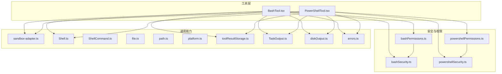
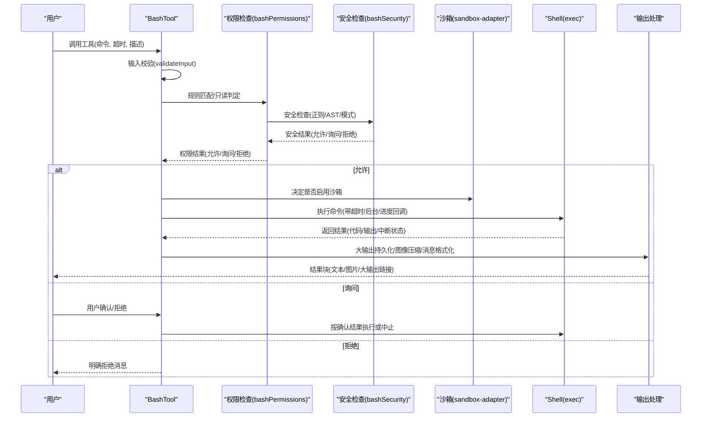
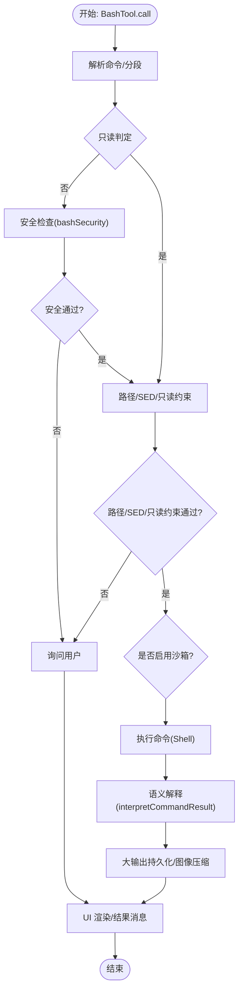
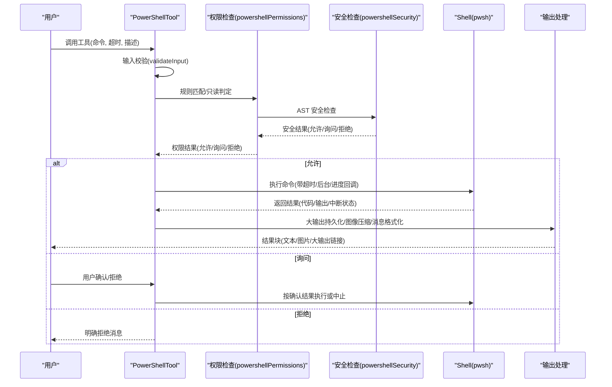
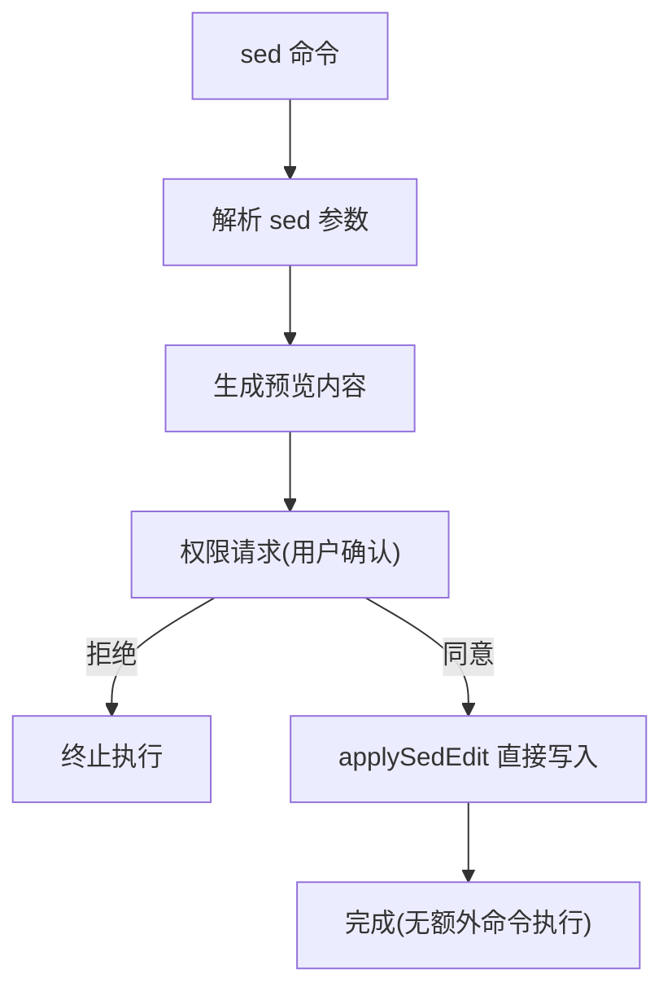
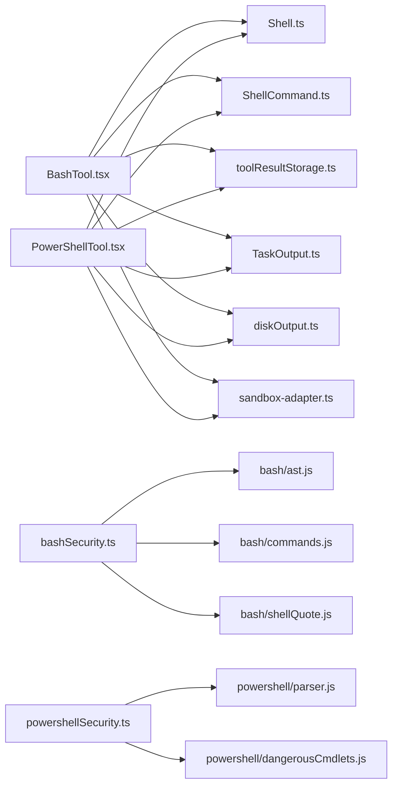

# Bash 工具

<cite>
**本文档引用的文件**
- [tools/BashTool/BashTool.tsx](file://tools/BashTool/BashTool.tsx)
- [tools/PowerShellTool/PowerShellTool.tsx](file://tools/PowerShellTool/PowerShellTool.tsx)
- [tools/BashTool/bashSecurity.ts](file://tools/BashTool/bashSecurity.ts)
- [tools/PowerShellTool/powershellSecurity.ts](file://tools/PowerShellTool/powershellSecurity.ts)
- [tools/BashTool/bashPermissions.ts](file://tools/BashTool/bashPermissions.ts)
- [tools/PowerShellTool/powershellPermissions.ts](file://tools/PowerShellTool/powershellPermissions.ts)
- [tools/BashTool/commandSemantics.ts](file://tools/BashTool/commandSemantics.ts)
- [tools/PowerShellTool/commandSemantics.ts](file://tools/PowerShellTool/commandSemantics.ts)
- [tools/BashTool/pathValidation.ts](file://tools/BashTool/pathValidation.ts)
- [tools/PowerShellTool/pathValidation.ts](file://tools/PowerShellTool/pathValidation.ts)
- [tools/BashTool/readOnlyValidation.ts](file://tools/BashTool/readOnlyValidation.ts)
- [tools/PowerShellTool/readOnlyValidation.ts](file://tools/PowerShellTool/readOnlyValidation.ts)
- [tools/BashTool/sedEditParser.ts](file://tools/BashTool/sedEditParser.ts)
- [tools/BashTool/sedValidation.ts](file://tools/BashTool/sedValidation.ts)
- [tools/BashTool/shouldUseSandbox.ts](file://tools/BashTool/shouldUseSandbox.ts)
- [tools/BashTool/UI.tsx](file://tools/BashTool/UI.tsx)
- [tools/BashTool/utils.ts](file://tools/BashTool/utils.ts)
- [tools/PowerShellTool/UI.tsx](file://tools/PowerShellTool/UI.tsx)
- [utils/sandbox/sandbox-adapter.ts](file://utils/sandbox/sandbox-adapter.ts)
- [utils/Shell.ts](file://utils/Shell.ts)
- [utils/ShellCommand.ts](file://utils/ShellCommand.ts)
- [utils/errors.ts](file://utils/errors.ts)
- [utils/file.ts](file://utils/file.ts)
- [utils/path.ts](file://utils/path.ts)
- [utils/platform.ts](file://utils/platform.ts)
- [utils/toolResultStorage.ts](file://utils/toolResultStorage.ts)
- [utils/task/TaskOutput.ts](file://utils/task/TaskOutput.ts)
- [utils/task/diskOutput.ts](file://utils/task/diskOutput.ts)
- [utils/permissions/permissions.ts](file://utils/permissions/permissions.ts)
- [utils/permissions/bashClassifier.js](file://utils/permissions/bashClassifier.js)
- [utils/powershell/parser.js](file://utils/powershell/parser.js)
- [utils/powershell/dangerousCmdlets.js](file://utils/powershell/dangerousCmdlets.js)
- [utils/bash/ast.js](file://utils/bash/ast.js)
- [utils/bash/commands.js](file://utils/bash/commands.js)
- [utils/bash/shellQuote.js](file://utils/bash/shellQuote.js)
- [utils/bash/ParsedCommand.js](file://utils/bash/ParsedCommand.js)
- [utils/bash/heredoc.js](file://utils/bash/heredoc.js)
- [utils/bash/treeSitterAnalysis.js](file://utils/bash/treeSitterAnalysis.js)
- [utils/permissions/PermissionResult.js](file://utils/permissions/PermissionResult.js)
- [utils/permissions/PermissionRule.js](file://utils/permissions/PermissionRule.js)
- [utils/permissions/shellRuleMatching.js](file://utils/permissions/shellRuleMatching.js)
- [utils/permissions/PermissionUpdate.js](file://utils/permissions/PermissionUpdate.js)
- [utils/permissions/PermissionUpdateSchema.js](file://utils/permissions/PermissionUpdateSchema.js)
- [utils/permissions/bashClassifier.js](file://utils/permissions/bashClassifier.js)
- [utils/permissions/bashClassifier.js](file://utils/permissions/bashClassifier.js)
- [utils/permissions/bashClassifier.js](file://utils/permissions/bashClassifier.js)
- [utils/permissions/bashClassifier.js](file://utils/permissions/bashClassifier.js)
- [utils/permissions/bashClassifier.js](file://utils/permissions/bashClassifier.js)
- [utils/permissions/bashClassifier.js](file://utils/permissions/bashClassifier.js)
- [utils/permissions/bashClassifier.js](file://utils/permissions/bashClassifier.js)
- [utils/permissions/bashClassifier.js](file://utils/permissions/bashClassifier.js)
- [utils/permissions/bashClassifier.js](file://utils/permissions/bashClassifier.js)
- [utils/permissions/bashClassifier.js](file://utils/permissions/bashClassifier.js)
- [utils/permissions/bashClassifier.js](file://utils/permissions/bashClassifier.js)
- [utils/permissions/bashClassifier.js](file://utils/permissions/bashClassifier.js)
- [utils/permissions/bashClassifier.js](file://utils/permissions/bashClassifier.js)
- [utils/permissions/bashClassifier.js](file://utils/permissions/bashClassifier.js)
- [utils/permissions/bashClassifier.js](file://utils/permissions/bashClassifier.js)
- [utils/permissions/bashClassifier.js](file://utils/permissions/bashClassifier.js)
- [utils/permissions/bashClassifier.js](file://utils/permissions/bashClassifier.js)
- [utils/permissions/bashClassifier.js](file://utils/permissions/bashClassifier.js)
- [utils/permissions/bashClassifier.js](file://utils/permissions/bashClassifier.js)
- [utils/permissions/bashClassifier.js](file://utils/permissions/bashClassifier.js)
- [utils/permissions/bashClassifier.js](file://utils/permissions/bashClassifier.js)
- [utils/permissions/bashClassifier.js](file://utils/permissions/bashClassifier.js)
- [utils/permissions/bashClassifier.js](file://utils/permissions/bashClassifier.js)
- [utils/permissions/bashClassifier.js](file://utils/permissions/bashClassifier.js)
- [utils/permissions/bashClassifier.js](file://utils/permissions/bashClassifier.js)
- [utils/permissions/bashClassifier.js](file://utils/permissions/bashClassifier.js)
- [utils/permissions/bashClassifier.js](file://utils/permissions/bashClassifier.js)
- [utils/permissions/bashClassifier.js](file://utils/permissions/bashClassifier.js)
- [utils/permissions......](file://utils/permissions/bashClassifier.js)
</cite>

## 目录
1. [简介](#简介)
2. [项目结构](#项目结构)
3. [核心组件](#核心组件)
4. [架构总览](#架构总览)
5. [详细组件分析](#详细组件分析)
6. [依赖关系分析](#依赖关系分析)
7. [性能考量](#性能考量)
8. [故障排除指南](#故障排除指南)
9. [结论](#结论)
10. [附录](#附录)

## 简介
本文件面向 Bash 工具与 PowerShell 工具的使用者与维护者，系统化阐述两者的实现原理、安全机制与权限控制流程，覆盖命令解析、参数校验、路径安全检查、破坏性操作警告、命令语义分析、sed 编辑器集成、只读模式验证与沙箱使用策略，并提供 UI 组件、结果消息格式与错误处理机制说明。文档同时给出常见使用场景（文件操作、系统管理、Git 集成）与安全最佳实践及故障排除建议。

## 项目结构
Bash 工具与 PowerShell 工具均基于统一的工具框架构建，遵循“工具定义 + 权限检查 + 执行 + 结果映射”的分层设计。两者共享大量通用能力（如任务输出持久化、终端输出截断检测、图像输出压缩、沙箱适配器、错误封装等），并在各自目录下提供安全规则、只读约束、命令语义解释与 UI 渲染。

**图表来源**
- [tools/BashTool/BashTool.tsx](file://tools/BashTool/BashTool.tsx)
- [tools/PowerShellTool/PowerShellTool.tsx](file://tools/PowerShellTool/PowerShellTool.tsx)
- [tools/BashTool/bashSecurity.ts](file://tools/BashTool/bashSecurity.ts)
- [tools/PowerShellTool/powershellSecurity.ts](file://tools/PowerShellTool/powershellSecurity.ts)
- [tools/BashTool/bashPermissions.ts](file://tools/BashTool/bashPermissions.ts)
- [tools/PowerShellTool/powershellPermissions.ts](file://tools/PowerShellTool/powershellPermissions.ts)
- [utils/sandbox/sandbox-adapter.ts](file://utils/sandbox/sandbox-adapter.ts)
- [utils/Shell.ts](file://utils/Shell.ts)
- [utils/ShellCommand.ts](file://utils/ShellCommand.ts)
- [utils/toolResultStorage.ts](file://utils/toolResultStorage.ts)
- [utils/task/TaskOutput.ts](file://utils/task/TaskOutput.ts)
- [utils/task/diskOutput.ts](file://utils/task/diskOutput.ts)
- [utils/errors.ts](file://utils/errors.ts)

**章节来源**
- [tools/BashTool/BashTool.tsx](file://tools/BashTool/BashTool.tsx)
- [tools/PowerShellTool/PowerShellTool.tsx](file://tools/PowerShellTool/PowerShellTool.tsx)

## 核心组件
- 工具定义与调用：BashTool 与 PowerShellTool 均通过 buildTool 构建，定义输入/输出模式、描述、提示词、并发安全判定、只读判定、权限匹配器、结果映射与 UI 渲染。
- 安全与权限：分别在 bashSecurity.ts 与 powershellSecurity.ts 中进行语法/语义安全检查；在 bashPermissions.ts 与 powershellPermissions.ts 中执行规则匹配、AST 解析、只读/路径约束与沙箱策略。
- 命令语义：commandSemantics.ts 将外部命令的退出码解释为“成功/信息/错误”，避免误报。
- 沙箱与平台：shouldUseSandbox.ts 与 sandbox-adapter.ts 协作，依据平台与策略决定是否启用沙箱。
- 输出与 UI：UI.tsx 提供工具使用、进度、排队与结果消息渲染；utils.ts 提供图像输出压缩与大输出持久化支持。

**章节来源**
- [tools/BashTool/BashTool.tsx](file://tools/BashTool/BashTool.tsx)
- [tools/PowerShellTool/PowerShellTool.tsx](file://tools/PowerShellTool/PowerShellTool.tsx)
- [tools/BashTool/commandSemantics.ts](file://tools/BashTool/commandSemantics.ts)
- [tools/PowerShellTool/commandSemantics.ts](file://tools/PowerShellTool/commandSemantics.ts)
- [tools/BashTool/shouldUseSandbox.ts](file://tools/BashTool/shouldUseSandbox.ts)
- [utils/sandbox/sandbox-adapter.ts](file://utils/sandbox/sandbox-adapter.ts)
- [tools/BashTool/UI.tsx](file://tools/BashTool/UI.tsx)
- [tools/PowerShellTool/UI.tsx](file://tools/PowerShellTool/UI.tsx)
- [tools/BashTool/utils.ts](file://tools/BashTool/utils.ts)

## 架构总览
下图展示了 Bash 工具从“输入校验”到“执行与结果映射”的端到端流程，以及与安全、权限、沙箱与输出持久化的交互。

**图表来源**
- [tools/BashTool/BashTool.tsx](file://tools/BashTool/BashTool.tsx)
- [tools/BashTool/bashPermissions.ts](file://tools/BashTool/bashPermissions.ts)
- [tools/BashTool/bashSecurity.ts](file://tools/BashTool/bashSecurity.ts)
- [utils/sandbox/sandbox-adapter.ts](file://utils/sandbox/sandbox-adapter.ts)
- [utils/Shell.ts](file://utils/Shell.ts)
- [utils/toolResultStorage.ts](file://utils/toolResultStorage.ts)

## 详细组件分析

### Bash 工具实现与安全机制
- 命令解析与只读判定
  - 使用 splitCommandWithOperators 对管道/重定向进行分段，识别搜索/读取/列表类命令，用于 UI 折叠与只读判定。
  - isReadOnly 通过 checkReadOnlyConstraints 与 commandHasAnyCd 判断是否涉及目录切换与破坏性操作。
- 安全检查
  - bashSecurity.ts 提供多层安全校验：不完整命令、heredoc 替换安全模式、git commit 消息注入、jq 危险函数、命令替换与重定向、IFS 注入、变量扩展、Zsh 危险命令等。
  - 支持早期放行（如安全 heredoc 替换）与严格回退（passthrough/ask/deny）。
- 权限控制
  - bashPermissions.ts 实现规则匹配（exact/prefix/wildcard）、前缀提取、包装器剥离（timeout/time/nice/nohup/env 等）、环境变量剥离、二进制劫持变量阻断、分类器辅助与建议生成。
  - 与只读/路径/SED 约束协同，确保复杂复合命令的安全性。
- 命令语义与错误处理
  - commandSemantics.ts 将 grep/rg/find/diff/test 等命令的非零退出码解释为“无匹配/部分成功”等信息，避免误判为错误。
  - 工具内部通过 interpretCommandResult 与 ShellError 统一处理错误消息与中断状态。
- 沙箱与平台
  - shouldUseSandbox.ts 与 sandbox-adapter.ts 协同，依据平台与策略决定是否启用沙箱；Windows 原生不支持沙箱时进行策略拒绝。
- 输出与 UI
  - UI.tsx 提供工具使用、排队、进度与结果消息；utils.ts 提供图像压缩与大输出持久化，防止模型侧内存压力过大。

**图表来源**
- [tools/BashTool/BashTool.tsx](file://tools/BashTool/BashTool.tsx)
- [tools/BashTool/bashSecurity.ts](file://tools/BashTool/bashSecurity.ts)
- [tools/BashTool/bashPermissions.ts](file://tools/BashTool/bashPermissions.ts)
- [tools/BashTool/commandSemantics.ts](file://tools/BashTool/commandSemantics.ts)
- [tools/BashTool/shouldUseSandbox.ts](file://tools/BashTool/shouldUseSandbox.ts)
- [tools/BashTool/UI.tsx](file://tools/BashTool/UI.tsx)
- [tools/BashTool/utils.ts](file://tools/BashTool/utils.ts)

**章节来源**
- [tools/BashTool/BashTool.tsx](file://tools/BashTool/BashTool.tsx)
- [tools/BashTool/bashSecurity.ts](file://tools/BashTool/bashSecurity.ts)
- [tools/BashTool/bashPermissions.ts](file://tools/BashTool/bashPermissions.ts)
- [tools/BashTool/commandSemantics.ts](file://tools/BashTool/commandSemantics.ts)
- [tools/BashTool/shouldUseSandbox.ts](file://tools/BashTool/shouldUseSandbox.ts)
- [tools/BashTool/UI.tsx](file://tools/BashTool/UI.tsx)
- [tools/BashTool/utils.ts](file://tools/BashTool/utils.ts)

### PowerShell 工具实现与安全机制
- 命令解析与只读判定
  - 使用 parsePowerShellCommand 获取 AST，识别安全输出命令、动态命令名、脚本块注入、成员调用等危险模式。
  - readOnlyValidation 提供同步安全检查与只读判定，异步路径在权限检查中进一步细化。
- 安全检查
  - powershellSecurity.ts 基于 AST 的安全检查：Invoke-Expression、动态命令名、编码参数、嵌套 PowerShell 进程、下载链、COM 对象、Add-Type、危险脚本块、子表达式、可展开字符串、Splatting、停止解析标记、成员调用等。
- 权限控制
  - powershellPermissions.ts 实现大小写无关的规则匹配、别名与模块限定符规范化、canonical 化、跨语句/片段的 deny/ask/allow 决策与建议生成。
  - 与只读/路径约束、Git 安全写入与归档提取器保护协同。
- 命令语义与错误处理
  - commandSemantics.ts 将外部可执行（grep/rg/findstr/robocopy）的退出码解释为“无匹配/复制成功/部分失败”等，避免误报。
- 沙箱与平台
  - Windows 原生不支持沙箱时进行策略拒绝；其余平台与 Bash 一致。
- 输出与 UI
  - UI.tsx 与 Bash 类似，提供进度、排队与结果消息；图像压缩与大输出持久化逻辑一致。

**图表来源**
- [tools/PowerShellTool/PowerShellTool.tsx](file://tools/PowerShellTool/PowerShellTool.tsx)
- [tools/PowerShellTool/powershellPermissions.ts](file://tools/PowerShellTool/powershellPermissions.ts)
- [tools/PowerShellTool/powershellSecurity.ts](file://tools/PowerShellTool/powershellSecurity.ts)
- [utils/Shell.ts](file://utils/Shell.ts)
- [utils/toolResultStorage.ts](file://utils/toolResultStorage.ts)

**章节来源**
- [tools/PowerShellTool/PowerShellTool.tsx](file://tools/PowerShellTool/PowerShellTool.tsx)
- [tools/PowerShellTool/powershellSecurity.ts](file://tools/PowerShellTool/powershellSecurity.ts)
- [tools/PowerShellTool/powershellPermissions.ts](file://tools/PowerShellTool/powershellPermissions.ts)
- [tools/PowerShellTool/commandSemantics.ts](file://tools/PowerShellTool/commandSemantics.ts)
- [tools/PowerShellTool/UI.tsx](file://tools/PowerShellTool/UI.tsx)
- [tools/PowerShellTool/utils.ts](file://tools/PowerShellTool/utils.ts)

### 命令语义分析与 sed 编辑器集成
- 命令语义
  - Bash/PowerShell 的 commandSemantics.ts 将常见外部命令的退出码解释为“信息性结果”，减少误报。
- sed 编辑器集成
  - BashTool 提供 sedEditParser 与 sedValidation，支持对 sed in-place 修改进行预览与权限请求；当用户批准时，通过 applySedEdit 直接写入文件，保证预览与实际写入一致，避免绕过权限检查。

**图表来源**
- [tools/BashTool/sedEditParser.ts](file://tools/BashTool/sedEditParser.ts)
- [tools/BashTool/sedValidation.ts](file://tools/BashTool/sedValidation.ts)
- [tools/BashTool/BashTool.tsx](file://tools/BashTool/BashTool.tsx)

**章节来源**
- [tools/BashTool/commandSemantics.ts](file://tools/BashTool/commandSemantics.ts)
- [tools/PowerShellTool/commandSemantics.ts](file://tools/PowerShellTool/commandSemantics.ts)
- [tools/BashTool/sedEditParser.ts](file://tools/BashTool/sedEditParser.ts)
- [tools/BashTool/sedValidation.ts](file://tools/BashTool/sedValidation.ts)
- [tools/BashTool/BashTool.tsx](file://tools/BashTool/BashTool.tsx)

### 只读模式验证与路径安全检查
- 只读模式
  - Bash/PowerShell 的 readOnlyValidation 提供同步与异步两阶段只读判定：前者快速过滤明显破坏性命令，后者在 AST 可用时进行更细粒度分析。
- 路径安全
  - pathValidation 对输出重定向、危险删除、UNC 路径、Git 内部路径与归档提取器进行约束，避免在敏感位置写入或破坏 Git 仓库状态。

**章节来源**
- [tools/BashTool/readOnlyValidation.ts](file://tools/BashTool/readOnlyValidation.ts)
- [tools/PowerShellTool/readOnlyValidation.ts](file://tools/PowerShellTool/readOnlyValidation.ts)
- [tools/BashTool/pathValidation.ts](file://tools/BashTool/pathValidation.ts)
- [tools/PowerShellTool/pathValidation.ts](file://tools/PowerShellTool/pathValidation.ts)

### 沙箱使用策略
- 平台差异
  - Linux/macOS/WSL2：pwsh 作为原生二进制运行，沙箱对 Bash 与 PowerShell 同样生效。
  - Windows 原生：沙箱不可用；若企业策略要求沙箱且不允许无沙箱执行，则直接拒绝。
- 策略开关
  - shouldUseSandbox.ts 与 sandbox-adapter.ts 协同，根据平台与设置决定是否启用沙箱；BashTool/PowerShellTool 在执行前评估并应用。

**章节来源**
- [tools/BashTool/shouldUseSandbox.ts](file://tools/BashTool/shouldUseSandbox.ts)
- [utils/sandbox/sandbox-adapter.ts](file://utils/sandbox/sandbox-adapter.ts)
- [tools/PowerShellTool/PowerShellTool.tsx](file://tools/PowerShellTool/PowerShellTool.tsx)

### UI 组件、结果消息格式与错误处理
- UI 组件
  - UI.tsx 提供工具使用、排队、进度与结果消息渲染；支持背景任务提示与自动后台化。
- 结果消息格式
  - mapToolResultToToolResultBlockParam 将 stdout/stderr/interrupted/backgroundTaskId 等整合为模型可用的 tool_result 内容块；支持大输出的“预览 + 文件路径”格式。
- 错误处理
  - 工具内部统一使用 ShellError 包装非零退出码与中断状态；错误消息中不再重复附加“Exit code N”，避免冗余。

**章节来源**
- [tools/BashTool/UI.tsx](file://tools/BashTool/UI.tsx)
- [tools/PowerShellTool/UI.tsx](file://tools/PowerShellTool/UI.tsx)
- [tools/BashTool/BashTool.tsx](file://tools/BashTool/BashTool.tsx)
- [tools/PowerShellTool/PowerShellTool.tsx](file://tools/PowerShellTool/PowerShellTool.tsx)
- [utils/errors.ts](file://utils/errors.ts)

## 依赖关系分析
- 工具与通用能力
  - BashTool/PowerShellTool 依赖 Shell.ts 执行命令、ShellCommand.ts 提供执行结果类型、toolResultStorage.ts 提供大输出持久化、task/TaskOutput.ts 与 task/diskOutput.ts 提供后台任务通道。
  - sandbox-adapter.ts 提供沙箱注解与失败标注，统一错误日志与事件上报。
- 安全与权限
  - bashSecurity.ts 与 powershellSecurity.ts 依赖各自的解析器与危险清单；bashPermissions.ts 与 powershellPermissions.ts 依赖权限规则匹配与分类器。

**图表来源**
- [tools/BashTool/BashTool.tsx](file://tools/BashTool/BashTool.tsx)
- [tools/PowerShellTool/PowerShellTool.tsx](file://tools/PowerShellTool/PowerShellTool.tsx)
- [utils/Shell.ts](file://utils/Shell.ts)
- [utils/ShellCommand.ts](file://utils/ShellCommand.ts)
- [utils/toolResultStorage.ts](file://utils/toolResultStorage.ts)
- [utils/task/TaskOutput.ts](file://utils/task/TaskOutput.ts)
- [utils/task/diskOutput.ts](file://utils/task/diskOutput.ts)
- [utils/sandbox/sandbox-adapter.ts](file://utils/sandbox/sandbox-adapter.ts)
- [tools/BashTool/bashSecurity.ts](file://tools/BashTool/bashSecurity.ts)
- [utils/bash/ast.js](file://utils/bash/ast.js)
- [utils/bash/commands.js](file://utils/bash/commands.js)
- [utils/bash/shellQuote.js](file://utils/bash/shellQuote.js)
- [tools/PowerShellTool/powershellSecurity.ts](file://tools/PowerShellTool/powershellSecurity.ts)
- [utils/powershell/parser.js](file://utils/powershell/parser.js)
- [utils/powershell/dangerousCmdlets.js](file://utils/powershell/dangerousCmdlets.js)

**章节来源**
- [tools/BashTool/BashTool.tsx](file://tools/BashTool/BashTool.tsx)
- [tools/PowerShellTool/PowerShellTool.tsx](file://tools/PowerShellTool/PowerShellTool.tsx)

## 性能考量
- 命令拆分与事件循环
  - 复杂复合命令可能产生大量子命令，安全检查采用上限控制（MAX_SUBCOMMANDS_FOR_SECURITY_CHECK）避免事件循环饥饿。
- 输出截断与大输出持久化
  - 通过 isOutputLineTruncated 与工具结果存储机制，避免长输出导致 UI 卡顿与内存压力。
- 后台任务与自动后台化
  - 提供 run_in_background 与自动后台化阈值，降低长时间阻塞对用户体验的影响。

**章节来源**
- [tools/BashTool/BashTool.tsx](file://tools/BashTool/BashTool.tsx)
- [tools/PowerShellTool/PowerShellTool.tsx](file://tools/PowerShellTool/PowerShellTool.tsx)
- [utils/terminal.ts](file://utils/terminal.ts)
- [utils/toolResultStorage.ts](file://utils/toolResultStorage.ts)

## 故障排除指南
- 常见问题
  - 命令被拒绝：检查权限规则（deny/ask/allow）、只读/路径约束与安全检查结果；必要时调整命令或添加规则。
  - Windows 原生沙箱拒绝：企业策略要求沙箱但平台不支持，需在受支持平台（WSL2/Linux/macOS）执行。
  - 大输出未显示：确认持久化文件已生成并检查预览大小限制。
  - 图像输出异常：检查 resizeShellImageOutput 与 MAX_IMAGE_FILE_SIZE 限制。
- 排查步骤
  - 查看工具返回的 interrupted 与 backgroundTaskId 字段，确认是否被中断或后台化。
  - 检查 SandboxManager.annotateStderrWithSandboxFailures 的标注，定位沙箱违规原因。
  - 使用 validateInput 的阻断睡眠模式检测（sleep/Start-Sleep）提示，改为后台执行或 Monitor 工具。

**章节来源**
- [tools/BashTool/BashTool.tsx](file://tools/BashTool/BashTool.tsx)
- [tools/PowerShellTool/PowerShellTool.tsx](file://tools/PowerShellTool/PowerShellTool.tsx)
- [utils/sandbox/sandbox-adapter.ts](file://utils/sandbox/sandbox-adapter.ts)
- [utils/errors.ts](file://utils/errors.ts)

## 结论
Bash 工具与 PowerShell 工具在统一框架下实现了高度一致的安全与权限控制流程：通过 AST/正则双轨安全检查、严格的只读/路径约束、精细的命令语义解释与沙箱策略，既保障了执行灵活性，又有效降低了破坏性风险。UI 与输出持久化机制进一步提升了可观测性与可追溯性。建议在生产环境中结合权限规则与分类器，持续优化只读与路径策略，并在 Windows 原生环境下谨慎配置沙箱策略。

## 附录
- 实际使用示例（概念性说明）
  - 文件操作：使用只读命令（如 ls/cat/head/tail）进行浏览；对写入操作（如 sed/echo >）先进行预览与权限请求。
  - 系统管理：通过 run_in_background 执行长时间任务（如 docker/build/watch），避免阻塞对话。
  - Git 集成：利用命令语义解释（如 grep/rg 返回 1 表示“无匹配”而非错误），避免误报；注意 Git 安全写入与归档提取器保护。
- 安全最佳实践
  - 优先使用只读命令与预览；对 sed/重定向/删除等高危操作务必进行权限请求。
  - 在 Windows 原生平台避免依赖沙箱，改用其他隔离手段或在受支持平台执行。
  - 合理设置超时与后台化阈值，提升响应性与稳定性。