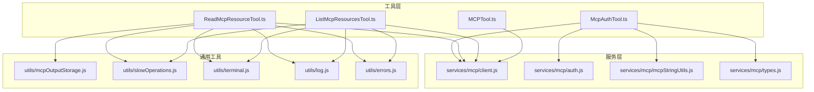
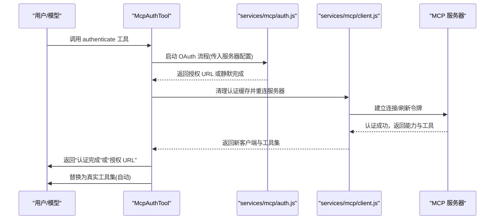
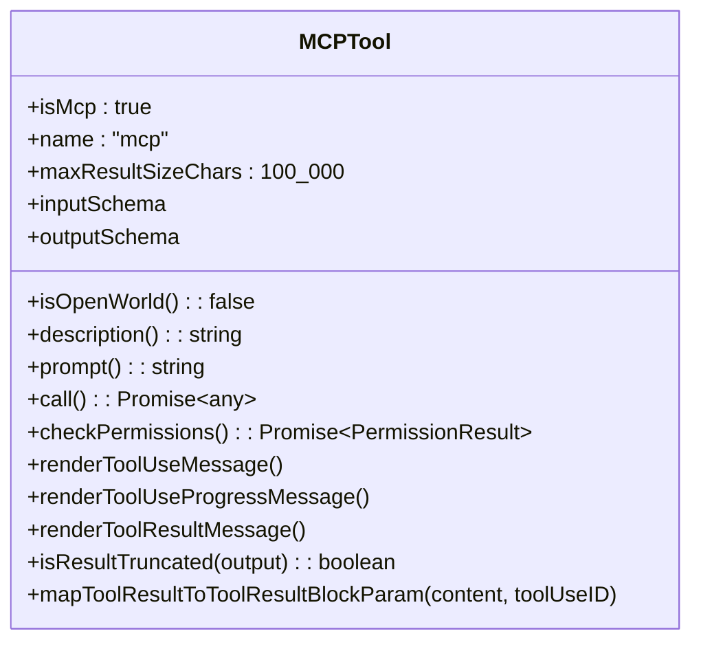
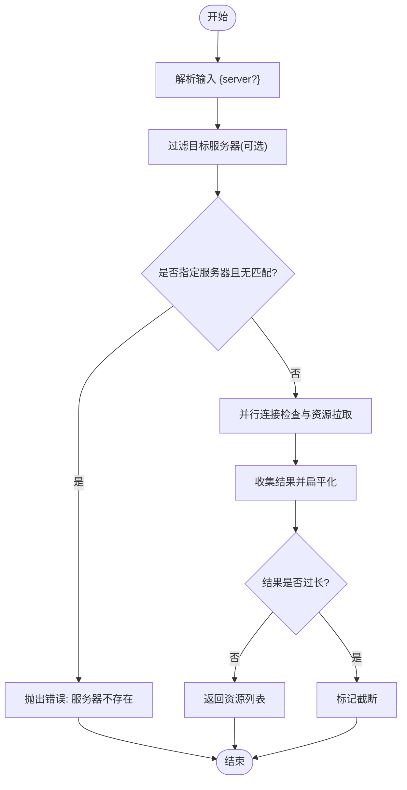
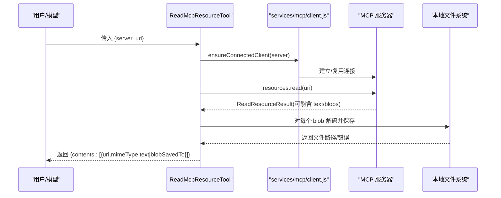
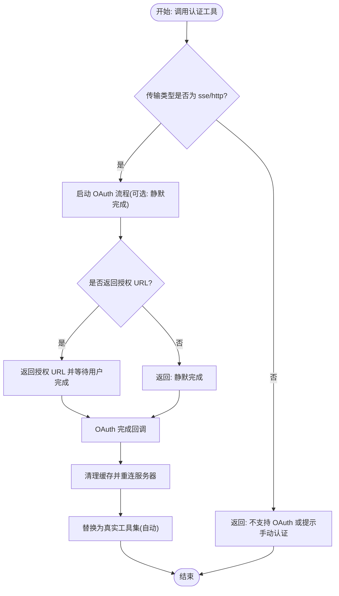
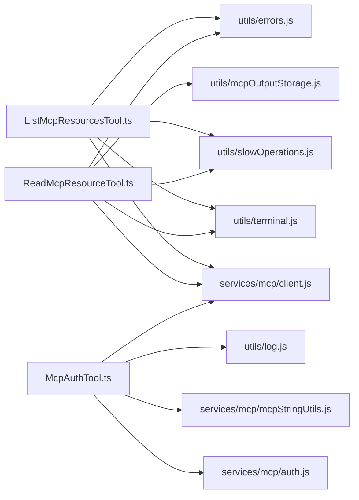

# MCP 工具

<cite>
**本文引用的文件**
- [MCPTool.ts](file://tools/MCPTool/MCPTool.ts)
- [ListMcpResourcesTool.ts](file://tools/ListMcpResourcesTool/ListMcpResourcesTool.ts)
- [ReadMcpResourceTool.ts](file://tools/ReadMcpResourceTool/ReadMcpResourceTool.ts)
- [McpAuthTool.ts](file://tools/McpAuthTool/McpAuthTool.ts)
- [client.js](file://services/mcp/client.js)
- [auth.js](file://services/mcp/auth.js)
- [mcpStringUtils.js](file://services/mcp/mcpStringUtils.js)
- [types.js](file://services/mcp/types.js)
- [mcpOutputStorage.js](file://utils/mcpOutputStorage.js)
- [slowOperations.js](file://utils/slowOperations.js)
- [terminal.js](file://utils/terminal.js)
- [errors.js](file://utils/errors.js)
- [log.js](file://utils/log.js)
- [UI.js（ListMcpResourcesTool）](file://tools/ListMcpResourcesTool/UI.js)
- [UI.js（ReadMcpResourceTool）](file://tools/ReadMcpResourceTool/UI.js)
- [prompt.js（ListMcpResourcesTool）](file://tools/ListMcpResourcesTool/prompt.js)
- [prompt.js（ReadMcpResourceTool）](file://tools/ReadMcpResourceTool/prompt.js)
- [prompt.js（MCPTool）](file://tools/MCPTool/prompt.js)
</cite>

## 目录
1. [简介](#简介)
2. [项目结构](#项目结构)
3. [核心组件](#核心组件)
4. [架构总览](#架构总览)
5. [详细组件分析](#详细组件分析)
6. [依赖关系分析](#依赖关系分析)
7. [性能考量](#性能考量)
8. [故障排查指南](#故障排查指南)
9. [结论](#结论)
10. [附录](#附录)

## 简介
本文件系统性介绍 MCP 工具系列：MCPTool、ListMcpResourcesTool、ReadMcpResourceTool 与 McpAuthTool 的功能特性、集成方式与运行机制。文档覆盖 MCP 协议规范在本项目中的落地、资源发现与读取、认证与安全验证、服务器连接与权限管理，并提供外部工具调用、数据同步与状态查询的实际案例与最佳实践。同时给出错误处理、重连机制与性能优化策略，帮助开发者与使用者高效、安全地集成 MCP 服务。

## 项目结构
MCP 工具位于 tools 目录下，配套的服务层位于 services/mcp，通用工具位于 utils。关键文件组织如下：
- 工具定义与 UI：tools/MCPTool、tools/ListMcpResourcesTool、tools/ReadMcpResourceTool、tools/McpAuthTool
- MCP 客户端与认证：services/mcp/client.js、services/mcp/auth.js、services/mcp/mcpStringUtils.js、services/mcp/types.js
- 输出存储与工具输出：utils/mcpOutputStorage.js、utils/slowOperations.js、utils/terminal.js
- 日志与错误：utils/log.js、utils/errors.js
- UI 渲染与提示词：各工具目录下的 UI.js 与 prompt.js

图表来源
- [MCPTool.ts:1-78](file://tools/MCPTool/MCPTool.ts#L1-L78)
- [ListMcpResourcesTool.ts:1-124](file://tools/ListMcpResourcesTool/ListMcpResourcesTool.ts#L1-L124)
- [ReadMcpResourceTool.ts:1-159](file://tools/ReadMcpResourceTool/ReadMcpResourceTool.ts#L1-L159)
- [McpAuthTool.ts:1-216](file://tools/McpAuthTool/McpAuthTool.ts#L1-L216)
- [client.js](file://services/mcp/client.js)
- [auth.js](file://services/mcp/auth.js)
- [mcpStringUtils.js](file://services/mcp/mcpStringUtils.js)
- [types.js](file://services/mcp/types.js)
- [mcpOutputStorage.js](file://utils/mcpOutputStorage.js)
- [slowOperations.js](file://utils/slowOperations.js)
- [terminal.js](file://utils/terminal.js)
- [errors.js](file://utils/errors.js)
- [log.js](file://utils/log.js)

章节来源
- [MCPTool.ts:1-78](file://tools/MCPTool/MCPTool.ts#L1-L78)
- [ListMcpResourcesTool.ts:1-124](file://tools/ListMcpResourcesTool/ListMcpResourcesTool.ts#L1-L124)
- [ReadMcpResourceTool.ts:1-159](file://tools/ReadMcpResourceTool/ReadMcpResourceTool.ts#L1-L159)
- [McpAuthTool.ts:1-216](file://tools/McpAuthTool/McpAuthTool.ts#L1-L216)

## 核心组件
- MCPTool：作为 MCP 工具的统一基类，提供输入/输出模式、渲染钩子、截断检测与结果映射等能力，具体名称与行为由 MCP 客户端在运行时覆盖。
- ListMcpResourcesTool：列出已连接 MCP 服务器提供的资源清单，支持按服务器过滤；内部使用 LRU 缓存与健康检查，失败不阻塞整体结果。
- ReadMcpResourceTool：按 URI 读取指定资源，自动处理文本与二进制内容，二进制内容落盘并替换为本地路径，保障上下文安全。
- McpAuthTool：为未认证的 MCP 服务器生成“伪工具”，触发 OAuth 流程，完成后自动重连并替换为真实工具集合。

章节来源
- [MCPTool.ts:27-77](file://tools/MCPTool/MCPTool.ts#L27-L77)
- [ListMcpResourcesTool.ts:40-123](file://tools/ListMcpResourcesTool/ListMcpResourcesTool.ts#L40-L123)
- [ReadMcpResourceTool.ts:49-158](file://tools/ReadMcpResourceTool/ReadMcpResourceTool.ts#L49-L158)
- [McpAuthTool.ts:49-215](file://tools/McpAuthTool/McpAuthTool.ts#L49-L215)

## 架构总览
MCP 工具通过统一的工具框架接入，底层依赖 MCP 客户端与认证服务，结合输出存储与日志工具完成资源读写与错误处理。认证流程中，McpAuthTool 负责启动 OAuth，成功后触发重连并替换工具集。

图表来源
- [McpAuthTool.ts:85-206](file://tools/McpAuthTool/McpAuthTool.ts#L85-L206)
- [auth.js](file://services/mcp/auth.js)
- [client.js](file://services/mcp/client.js)

## 详细组件分析

### MCPTool 组件分析
- 角色定位：MCP 工具的抽象基类，提供统一的工具接口、渲染钩子与截断检测。
- 关键点：
  - 输入/输出模式采用惰性 Schema，允许 MCP 客户端动态注入实际模式。
  - 提供渲染消息与进度消息钩子，便于 UI 展示。
  - 截断检测基于终端输出长度，避免超长结果污染上下文。
  - 结果映射为标准工具块参数，保证与对话流兼容。

图表来源
- [MCPTool.ts:27-77](file://tools/MCPTool/MCPTool.ts#L27-L77)

章节来源
- [MCPTool.ts:1-78](file://tools/MCPTool/MCPTool.ts#L1-L78)
- [prompt.js（MCPTool）](file://tools/MCPTool/prompt.js)

### ListMcpResourcesTool 组件分析
- 功能概述：列举所有已连接 MCP 服务器的资源，支持按服务器名过滤；对每个客户端进行健康检查与重连尝试，单个服务器失败不影响其他结果。
- 数据结构与复杂度：
  - 输入：{ server?: string }
  - 输出：资源数组，每项含 uri、name、mimeType、description、server。
  - 复杂度：O(N) 并行遍历客户端，LRU 缓存命中为 O(1)，缓存失效后每次请求为 O(1) 平摊。
- 错误处理：
  - 服务器不存在：抛出明确错误，提示可用服务器列表。
  - 连接异常：记录错误并跳过该服务器，保证整体结果可用。
- 性能优化：
  - 使用 Promise.all 并行拉取多个服务器资源。
  - 内置缓存与失效策略，减少重复请求。
  - 结果截断检测基于 JSON 字符串化后的长度。

图表来源
- [ListMcpResourcesTool.ts:66-101](file://tools/ListMcpResourcesTool/ListMcpResourcesTool.ts#L66-L101)
- [client.js](file://services/mcp/client.js)

章节来源
- [ListMcpResourcesTool.ts:1-124](file://tools/ListMcpResourcesTool/ListMcpResourcesTool.ts#L1-L124)
- [UI.js（ListMcpResourcesTool）](file://tools/ListMcpResourcesTool/UI.js)
- [prompt.js（ListMcpResourcesTool）](file://tools/ListMcpResourcesTool/prompt.js)
- [terminal.js](file://utils/terminal.js)
- [slowOperations.js](file://utils/slowOperations.js)
- [errors.js](file://utils/errors.js)
- [log.js](file://utils/log.js)

### ReadMcpResourceTool 组件分析
- 功能概述：按服务器名与 URI 读取资源，自动区分文本与二进制内容；二进制内容解码后保存到本地临时位置，并以人类可读的消息替换为文件路径，避免将大段 Base64 注入上下文。
- 数据结构与复杂度：
  - 输入：{ server: string, uri: string }
  - 输出：包含 contents 数组的对象，每项含 uri、mimeType、text 或 blobSavedTo。
  - 复杂度：O(1) 请求 + O(k) 处理 k 个内容片段（文本直接返回，二进制逐个落盘）。
- 安全与合规：
  - 仅在客户端具备 resources 能力时执行，避免不支持的服务器被误用。
  - 二进制内容落盘前进行 MIME 类型派生扩展，确保可识别性。
- 错误处理：
  - 服务器不存在或未连接：抛出明确错误。
  - 不支持 resources 能力：抛出能力错误。
  - 落盘失败：保留错误信息并回退为文本描述。

图表来源
- [ReadMcpResourceTool.ts:75-144](file://tools/ReadMcpResourceTool/ReadMcpResourceTool.ts#L75-L144)
- [client.js](file://services/mcp/client.js)
- [mcpOutputStorage.js](file://utils/mcpOutputStorage.js)

章节来源
- [ReadMcpResourceTool.ts:1-159](file://tools/ReadMcpResourceTool/ReadMcpResourceTool.ts#L1-L159)
- [UI.js（ReadMcpResourceTool）](file://tools/ReadMcpResourceTool/UI.js)
- [prompt.js（ReadMcpResourceTool）](file://tools/ReadMcpResourceTool/prompt.js)
- [terminal.js](file://utils/terminal.js)
- [slowOperations.js](file://utils/slowOperations.js)
- [mcpOutputStorage.js](file://utils/mcpOutputStorage.js)

### McpAuthTool 组件分析
- 功能概述：为未认证的 MCP 服务器生成“认证伪工具”，当被调用时启动 OAuth 流程，返回授权 URL 或静默完成；完成后清理认证缓存并重连，自动替换为真实工具集。
- 支持范围：
  - 仅对 sse/http 传输类型提供 OAuth 启动能力；claudeai-proxy 类型提示用户手动认证。
- 认证流程：
  - 启动 performMCPOAuthFlow，监听授权 URL 回调。
  - OAuth 成功后，clearMcpAuthCache + reconnectMcpServerImpl，更新全局状态中的 tools/commands/resources。
- 错误处理：
  - 无法启动 OAuth：返回错误信息，建议手动认证。
  - OAuth 失败：记录错误日志，不影响其他工具。

图表来源
- [McpAuthTool.ts:85-206](file://tools/McpAuthTool/McpAuthTool.ts#L85-L206)
- [auth.js](file://services/mcp/auth.js)
- [client.js](file://services/mcp/client.js)
- [mcpStringUtils.js](file://services/mcp/mcpStringUtils.js)
- [types.js](file://services/mcp/types.js)

章节来源
- [McpAuthTool.ts:1-216](file://tools/McpAuthTool/McpAuthTool.ts#L1-L216)
- [auth.js](file://services/mcp/auth.js)
- [client.js](file://services/mcp/client.js)
- [mcpStringUtils.js](file://services/mcp/mcpStringUtils.js)
- [types.js](file://services/mcp/types.js)
- [log.js](file://utils/log.js)
- [errors.js](file://utils/errors.js)

## 依赖关系分析
- 工具层依赖服务层：
  - ListMcpResourcesTool 与 ReadMcpResourceTool 依赖 services/mcp/client.js 进行连接与资源操作。
  - McpAuthTool 依赖 services/mcp/auth.js 与 services/mcp/client.js 完成认证与重连。
- 工具层依赖通用工具：
  - 截断检测依赖 utils/terminal.js。
  - 输出序列化依赖 utils/slowOperations.js。
  - 二进制内容落盘依赖 utils/mcpOutputStorage.js。
  - 错误与日志依赖 utils/errors.js 与 utils/log.js。
- 命名与前缀：
  - 通过 services/mcp/mcpStringUtils.js 提供工具名构建与前缀提取，用于替换工具集。

图表来源
- [ListMcpResourcesTool.ts:1-124](file://tools/ListMcpResourcesTool/ListMcpResourcesTool.ts#L1-L124)
- [ReadMcpResourceTool.ts:1-159](file://tools/ReadMcpResourceTool/ReadMcpResourceTool.ts#L1-L159)
- [McpAuthTool.ts:1-216](file://tools/McpAuthTool/McpAuthTool.ts#L1-L216)
- [client.js](file://services/mcp/client.js)
- [auth.js](file://services/mcp/auth.js)
- [mcpStringUtils.js](file://services/mcp/mcpStringUtils.js)
- [mcpOutputStorage.js](file://utils/mcpOutputStorage.js)
- [slowOperations.js](file://utils/slowOperations.js)
- [terminal.js](file://utils/terminal.js)
- [errors.js](file://utils/errors.js)
- [log.js](file://utils/log.js)

章节来源
- [ListMcpResourcesTool.ts:1-124](file://tools/ListMcpResourcesTool/ListMcpResourcesTool.ts#L1-L124)
- [ReadMcpResourceTool.ts:1-159](file://tools/ReadMcpResourceTool/ReadMcpResourceTool.ts#L1-L159)
- [McpAuthTool.ts:1-216](file://tools/McpAuthTool/McpAuthTool.ts#L1-L216)

## 性能考量
- 并行化与缓存：
  - ListMcpResourcesTool 使用 Promise.all 并行拉取多个服务器资源，显著降低总延迟。
  - fetchResourcesForClient 具备 LRU 缓存，启动预热，关闭或收到资源变更通知时失效，避免陈旧数据。
- 连接健壮性：
  - ensureConnectedClient 在健康状态下为无操作缓存命中，断开后返回新连接，保证重试成功。
- 输出控制：
  - 截断检测基于字符串化后的长度，避免超长输出影响上下文与性能。
- 二进制处理：
  - 二进制内容直接落盘并以路径替代，避免 Base64 大量字符串化带来的内存与序列化成本。

章节来源
- [ListMcpResourcesTool.ts:84-96](file://tools/ListMcpResourcesTool/ListMcpResourcesTool.ts#L84-L96)
- [ReadMcpResourceTool.ts:106-139](file://tools/ReadMcpResourceTool/ReadMcpResourceTool.ts#L106-L139)
- [terminal.js](file://utils/terminal.js)
- [slowOperations.js](file://utils/slowOperations.js)

## 故障排查指南
- 服务器不存在或未连接：
  - 现象：调用报错，提示可用服务器列表。
  - 排查：确认服务器名称拼写、连接状态与能力声明。
- 不支持 resources 能力：
  - 现象：读取时报能力错误。
  - 排查：确认服务器 capabilities 中包含 resources。
- OAuth 启动失败：
  - 现象：返回错误信息，建议手动认证。
  - 排查：确认传输类型为 sse/http；检查网络与授权回调配置。
- 二进制内容保存失败：
  - 现象：返回错误描述，内容中包含失败原因。
  - 排查：检查磁盘权限、MIME 类型与文件系统容量。
- 认证后工具未出现：
  - 现象：静默完成但工具未替换。
  - 排查：确认重连流程已执行，检查全局状态替换逻辑与前缀匹配。

章节来源
- [ListMcpResourcesTool.ts:73-77](file://tools/ListMcpResourcesTool/ListMcpResourcesTool.ts#L73-L77)
- [ReadMcpResourceTool.ts:80-92](file://tools/ReadMcpResourceTool/ReadMcpResourceTool.ts#L80-L92)
- [McpAuthTool.ts:167-172](file://tools/McpAuthTool/McpAuthTool.ts#L167-L172)
- [mcpOutputStorage.js](file://utils/mcpOutputStorage.js)
- [log.js](file://utils/log.js)
- [errors.js](file://utils/errors.js)

## 结论
MCP 工具系列在本项目中实现了资源发现、内容读取与认证流程的完整闭环。通过并行化、缓存与重连机制，兼顾了性能与可靠性；通过二进制落盘与截断检测，保障了安全性与上下文质量。McpAuthTool 将认证体验无缝嵌入工具调用，提升自动化程度。建议在生产环境中结合日志监控与错误告警，持续优化缓存与重连策略。

## 附录
- 实际案例建议（概念性说明，非特定源码）：
  - 外部工具调用：在对话中触发 McpAuthTool 启动 OAuth，随后自动替换为真实工具集，再调用 ListMcpResourcesTool 与 ReadMcpResourceTool 完成资源检索。
  - 数据同步：定期调用 ListMcpResourcesTool 并缓存结果，监听服务器资源变更事件后主动失效缓存并重新拉取。
  - 状态查询：通过工具描述与提示词了解当前服务器能力与可用资源，辅助决策下一步操作。
- 最佳实践（概念性说明，非特定源码）：
  - 服务器配置：优先使用 sse/http 传输以支持 OAuth；为 claudeai-proxy 类型提供手动认证指引。
  - 权限管理：严格限制工具调用范围，仅在必要时授予认证与资源访问权限。
  - 安全验证：对二进制内容进行 MIME 检测与扩展派生，避免未知格式风险；对输出进行截断与大小限制。
  - 错误处理：统一记录错误日志，提供清晰的用户提示；对不可恢复错误引导至手动修复路径。