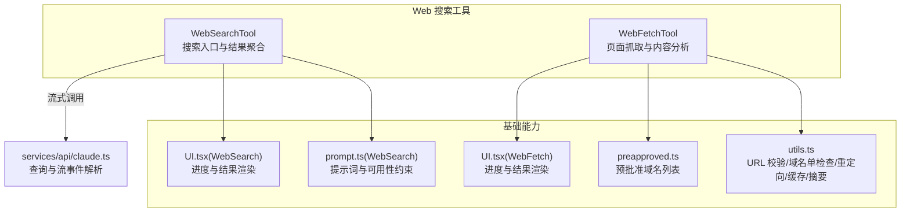
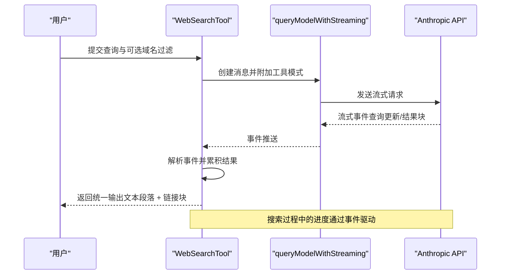
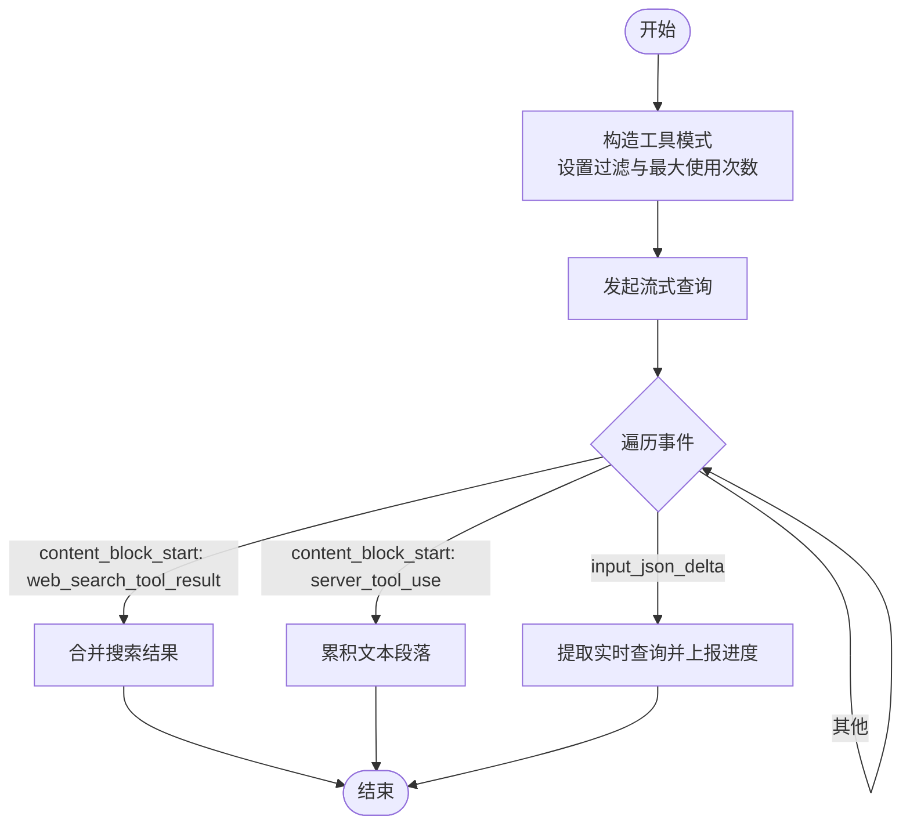
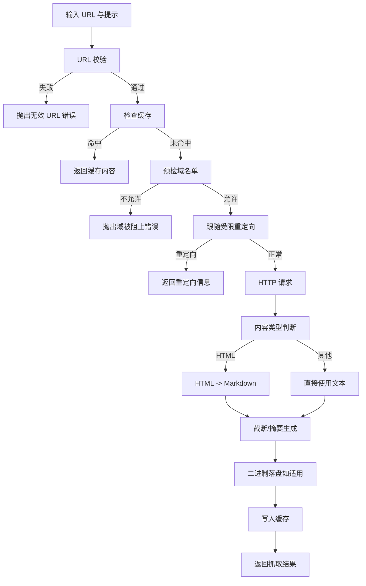
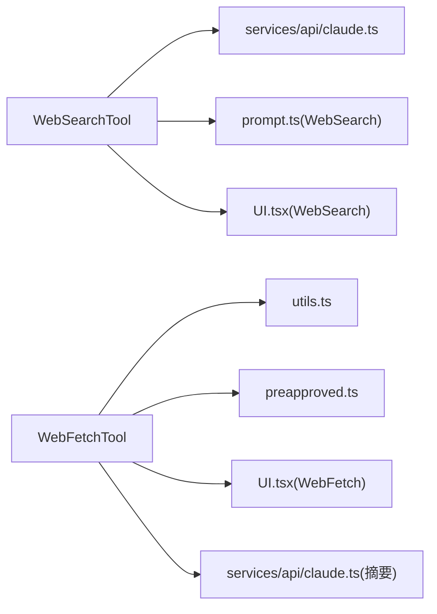

# Web 搜索工具

<cite>
**本文引用的文件**
- [WebSearchTool.ts](file://tools/WebSearchTool/WebSearchTool.ts)
- [WebFetchTool.ts](file://tools/WebFetchTool/WebFetchTool.ts)
- [utils.ts](file://tools/WebFetchTool/utils.ts)
- [preapproved.ts](file://tools/WebFetchTool/preapproved.ts)
- [prompt.ts](file://tools/WebSearchTool/prompt.ts)
- [UI.tsx（WebSearch）](file://tools/WebSearchTool/UI.tsx)
- [UI.tsx（WebFetch）](file://tools/WebFetchTool/UI.tsx)
- [tools.ts](file://constants/tools.ts)
- [claude.ts](file://services/api/claude.ts)
- [claudeAiLimits.ts](file://services/claudeAiLimits.ts)
- [rateLimitMocking.ts](file://services/rateLimitMocking.ts)
- [mockRateLimits.ts](file://services/mockRateLimits.ts)
</cite>

## 目录
1. [简介](#简介)
2. [项目结构](#项目结构)
3. [核心组件](#核心组件)
4. [架构总览](#架构总览)
5. [详细组件分析](#详细组件分析)
6. [依赖关系分析](#依赖关系分析)
7. [性能考量](#性能考量)
8. [故障排查指南](#故障排查指南)
9. [结论](#结论)
10. [附录：使用示例与最佳实践](#附录使用示例与最佳实践)

## 简介
本文件系统性阐述 Web 搜索工具的实现与使用，重点覆盖以下方面：
- WebSearchTool 的搜索算法、结果解析与进度反馈
- WebFetchTool 的内容提取、缓存与安全控制
- 预批准域名列表、URL 校验、内容过滤与隐私保护
- 搜索引擎集成、结果排序、摘要生成与链接处理
- 实际使用示例与场景化应用
- 安全限制、速率限制与反爬虫防护机制
- 网络请求优化与错误处理策略

## 项目结构
Web 搜索工具由两个核心工具组成：
- WebSearchTool：面向“一次性搜索”的工具，通过流式 API 获取搜索结果，支持域名白/黑名单过滤与进度回调。
- WebFetchTool：面向“单页抓取与内容分析”的工具，具备严格的 URL 校验、域名单预检、重定向许可检查、内容缓存与二进制落盘能力。

图示来源
- [WebSearchTool.ts:152-435](file://tools/WebSearchTool/WebSearchTool.ts#L152-L435)
- [WebFetchTool.ts:66-307](file://tools/WebFetchTool/WebFetchTool.ts#L66-L307)
- [utils.ts:139-203](file://tools/WebFetchTool/utils.ts#L139-L203)
- [preapproved.ts:14-167](file://tools/WebFetchTool/preapproved.ts#L14-L167)
- [UI.tsx（WebSearch）:55-92](file://tools/WebSearchTool/UI.tsx#L55-L92)
- [UI.tsx（WebFetch）:29-62](file://tools/WebFetchTool/UI.tsx#L29-L62)
- [prompt.ts:5-34](file://tools/WebSearchTool/prompt.ts#L5-L34)
- [claude.ts](file://services/api/claude.ts)

章节来源
- [WebSearchTool.ts:152-435](file://tools/WebSearchTool/WebSearchTool.ts#L152-L435)
- [WebFetchTool.ts:66-307](file://tools/WebFetchTool/WebFetchTool.ts#L66-L307)
- [utils.ts:139-203](file://tools/WebFetchTool/utils.ts#L139-L203)
- [preapproved.ts:14-167](file://tools/WebFetchTool/preapproved.ts#L14-L167)
- [UI.tsx（WebSearch）:55-92](file://tools/WebSearchTool/UI.tsx#L55-L92)
- [UI.tsx（WebFetch）:29-62](file://tools/WebFetchTool/UI.tsx#L29-L62)
- [prompt.ts:5-34](file://tools/WebSearchTool/prompt.ts#L5-L34)
- [claude.ts](file://services/api/claude.ts)

## 核心组件
- WebSearchTool
  - 输入：查询语句与可选的允许/禁止域名列表
  - 输出：按文本段落与搜索结果块混合组织的结果，包含“来源链接”
  - 进度：在流事件中分批上报“查询更新”和“结果到达”两类进度
  - 权限：需要显式授权规则
  - 可用性：受模型与提供商限制
- WebFetchTool
  - 输入：目标 URL 与对内容的处理提示
  - 输出：响应状态码、字节数、处理后结果、耗时、原始 URL
  - 安全：URL 校验、域名单预检、重定向许可、二进制落盘、缓存
  - 权限：基于预批准主机或用户规则的动态决策

章节来源
- [WebSearchTool.ts:25-69](file://tools/WebSearchTool/WebSearchTool.ts#L25-L69)
- [WebSearchTool.ts:152-435](file://tools/WebSearchTool/WebSearchTool.ts#L152-L435)
- [WebFetchTool.ts:24-48](file://tools/WebFetchTool/WebFetchTool.ts#L24-L48)
- [WebFetchTool.ts:66-307](file://tools/WebFetchTool/WebFetchTool.ts#L66-L307)

## 架构总览
WebSearchTool 通过流式 API 发起一次或多轮搜索，并在流事件中逐步产出“查询更新”和“结果到达”进度；最终将多轮内容块合并为统一输出。WebFetchTool 在抓取前进行 URL 校验与域名单检查，遵循受限重定向策略，将 HTML 转换为 Markdown 并按需截断，再交由辅助模型生成摘要；同时支持二进制内容落盘以便后续查看。

图示来源
- [WebSearchTool.ts:254-388](file://tools/WebSearchTool/WebSearchTool.ts#L254-L388)
- [claude.ts](file://services/api/claude.ts)

章节来源
- [WebSearchTool.ts:254-388](file://tools/WebSearchTool/WebSearchTool.ts#L254-L388)
- [claude.ts](file://services/api/claude.ts)

## 详细组件分析

### WebSearchTool：搜索算法、结果解析与进度
- 工具模式构造
  - 将输入转换为工具模式对象，携带 allowed_domains/blocked_domains 与最大使用次数限制
- 流式调用与事件解析
  - 使用流式查询接口，逐条消费事件
  - 识别 server_tool_use 与 web_search_tool_result 两类内容块，累积文本段落与搜索结果
  - 从 input_json_delta 中提取实时查询，用于“查询更新”进度
- 结果聚合
  - 将文本段落与搜索结果块混合输出，支持错误块的降级处理
- 输出映射
  - 将结果映射为工具结果块参数，统一格式化“来源链接”

图示来源
- [WebSearchTool.ts:76-84](file://tools/WebSearchTool/WebSearchTool.ts#L76-L84)
- [WebSearchTool.ts:254-388](file://tools/WebSearchTool/WebSearchTool.ts#L254-L388)
- [WebSearchTool.ts:86-150](file://tools/WebSearchTool/WebSearchTool.ts#L86-L150)

章节来源
- [WebSearchTool.ts:76-84](file://tools/WebSearchTool/WebSearchTool.ts#L76-L84)
- [WebSearchTool.ts:254-388](file://tools/WebSearchTool/WebSearchTool.ts#L254-L388)
- [WebSearchTool.ts:86-150](file://tools/WebSearchTool/WebSearchTool.ts#L86-L150)

### WebFetchTool：内容提取、缓存与安全控制
- URL 校验与升级
  - 长度与基本格式校验，去除凭据字段，必要时将 http 升级为 https
- 域名单预检
  - 通过外部接口检查是否允许抓取；支持跳过预检的设置项
- 重定向许可
  - 仅允许协议/端口一致且主机变化为 www. 增删或路径/查询变更的重定向
- 抓取与内容处理
  - 限制最大内容长度与超时时间；HTML 转 Markdown；二进制内容落盘并记录路径
- 缓存策略
  - LRU 缓存，带 TTL 与大小上限；域名预检结果独立缓存
- 摘要生成
  - 对超长内容截断后交由辅助模型生成摘要；支持非交互会话模式

图示来源
- [utils.ts:139-169](file://tools/WebFetchTool/utils.ts#L139-L169)
- [utils.ts:176-203](file://tools/WebFetchTool/utils.ts#L176-L203)
- [utils.ts:212-243](file://tools/WebFetchTool/utils.ts#L212-L243)
- [utils.ts:347-482](file://tools/WebFetchTool/utils.ts#L347-L482)
- [utils.ts:484-531](file://tools/WebFetchTool/utils.ts#L484-L531)

章节来源
- [utils.ts:139-169](file://tools/WebFetchTool/utils.ts#L139-L169)
- [utils.ts:176-203](file://tools/WebFetchTool/utils.ts#L176-L203)
- [utils.ts:212-243](file://tools/WebFetchTool/utils.ts#L212-L243)
- [utils.ts:347-482](file://tools/WebFetchTool/utils.ts#L347-L482)
- [utils.ts:484-531](file://tools/WebFetchTool/utils.ts#L484-L531)

### 预批准域名列表与权限控制
- 预批准主机
  - 代码相关文档站点与主流技术栈官方文档被纳入白名单，支持路径前缀匹配
- 权限决策
  - WebFetchTool：若 URL 主机在预批准列表则直接放行；否则按用户规则（允许/询问/拒绝）决策
  - WebSearchTool：需要本地授权规则

章节来源
- [preapproved.ts:14-167](file://tools/WebFetchTool/preapproved.ts#L14-L167)
- [WebFetchTool.ts:104-180](file://tools/WebFetchTool/WebFetchTool.ts#L104-L180)
- [WebSearchTool.ts:209-222](file://tools/WebSearchTool/WebSearchTool.ts#L209-L222)

### URL 验证、内容过滤与隐私保护
- URL 验证
  - 长度限制、协议/凭据/主机合法性检查
- 内容过滤
  - 二进制内容自动落盘并保留扩展名，便于后续人工审阅
  - Markdown 截断阈值控制，避免模型输入过长
- 隐私保护
  - 不携带 Cookie 或内部域访问；凭据字段直接拒绝
  - 企业网络限制检测：对特定代理错误进行专门处理

章节来源
- [utils.ts:139-169](file://tools/WebFetchTool/utils.ts#L139-L169)
- [utils.ts:442-449](file://tools/WebFetchTool/utils.ts#L442-L449)
- [utils.ts:518-520](file://tools/WebFetchTool/utils.ts#L518-L520)

### 搜索引擎集成、结果排序与摘要生成
- 引擎集成
  - 通过流式 API 与服务器协作完成搜索；工具模式由输入动态构造
- 排序与摘要
  - 服务器侧负责排序与摘要生成；客户端仅负责聚合与格式化
- 链接处理
  - 搜索结果以标题与 URL 组织，最终以 Markdown 超链接形式呈现

章节来源
- [WebSearchTool.ts:76-84](file://tools/WebSearchTool/WebSearchTool.ts#L76-L84)
- [WebSearchTool.ts:86-150](file://tools/WebSearchTool/WebSearchTool.ts#L86-L150)
- [prompt.ts:5-34](file://tools/WebSearchTool/prompt.ts#L5-L34)

### 进度反馈与 UI 渲染
- WebSearchTool
  - “查询更新”与“结果到达”两类进度，分别显示当前查询与结果数量
- WebFetchTool
  - 抓取阶段显示“正在抓取”，结果阶段显示响应大小与状态码

章节来源
- [UI.tsx（WebSearch）:55-78](file://tools/WebSearchTool/UI.tsx#L55-L78)
- [UI.tsx（WebFetch）:29-33](file://tools/WebFetchTool/UI.tsx#L29-L33)

## 依赖关系分析
- WebSearchTool 依赖
  - 流式查询服务：解析事件、聚合结果
  - 提示词：约束输出格式与来源链接要求
  - UI：进度与结果渲染
- WebFetchTool 依赖
  - HTTP 客户端：Axios，自定义超时与内容长度限制
  - 缓存：LRU 缓存与域名单缓存
  - 模型服务：辅助模型用于摘要生成
  - 预批准列表：快速放行可信站点

图示来源
- [WebSearchTool.ts:152-435](file://tools/WebSearchTool/WebSearchTool.ts#L152-L435)
- [WebFetchTool.ts:66-307](file://tools/WebFetchTool/WebFetchTool.ts#L66-L307)
- [utils.ts:1-531](file://tools/WebFetchTool/utils.ts#L1-L531)
- [preapproved.ts:1-167](file://tools/WebFetchTool/preapproved.ts#L1-L167)
- [prompt.ts:5-34](file://tools/WebSearchTool/prompt.ts#L5-L34)
- [UI.tsx（WebSearch）:55-92](file://tools/WebSearchTool/UI.tsx#L55-L92)
- [UI.tsx（WebFetch）:29-62](file://tools/WebFetchTool/UI.tsx#L29-L62)
- [claude.ts](file://services/api/claude.ts)

章节来源
- [WebSearchTool.ts:152-435](file://tools/WebSearchTool/WebSearchTool.ts#L152-L435)
- [WebFetchTool.ts:66-307](file://tools/WebFetchTool/WebFetchTool.ts#L66-L307)
- [utils.ts:1-531](file://tools/WebFetchTool/utils.ts#L1-L531)
- [preapproved.ts:1-167](file://tools/WebFetchTool/preapproved.ts#L1-L167)
- [prompt.ts:5-34](file://tools/WebSearchTool/prompt.ts#L5-L34)
- [UI.tsx（WebSearch）:55-92](file://tools/WebSearchTool/UI.tsx#L55-L92)
- [UI.tsx（WebFetch）:29-62](file://tools/WebFetchTool/UI.tsx#L29-L62)
- [claude.ts](file://services/api/claude.ts)

## 性能考量
- 资源消耗控制
  - HTTP 最大内容长度与超时、重定向最大跳数、Markdown 截断阈值
- 缓存策略
  - URL 内容缓存与域名单缓存，降低重复请求与预检开销
- 摘要生成
  - 对超长内容截断后交由轻量模型生成摘要，减少令牌占用

章节来源
- [utils.ts:112-128](file://tools/WebFetchTool/utils.ts#L112-L128)
- [utils.ts:61-78](file://tools/WebFetchTool/utils.ts#L61-L78)
- [utils.ts:484-531](file://tools/WebFetchTool/utils.ts#L484-L531)

## 故障排查指南
- 域名被阻止
  - 触发域名单检查失败或被明确标记为不可抓取
- 企业网络限制
  - 代理返回特定头部时判定为“出口受限”，抛出专门错误
- 重定向问题
  - 非许可重定向会返回重定向信息而非继续跟随
- 速率限制
  - 429 错误携带速率限制头；可通过模拟与监控工具辅助诊断

章节来源
- [utils.ts:176-203](file://tools/WebFetchTool/utils.ts#L176-L203)
- [utils.ts:316-328](file://tools/WebFetchTool/utils.ts#L316-L328)
- [rateLimitMocking.ts:89-144](file://services/rateLimitMocking.ts#L89-L144)
- [claudeAiLimits.ts:347-374](file://services/claudeAiLimits.ts#L347-L374)

## 结论
WebSearchTool 与 WebFetchTool 共同构成完整的“网页搜索与内容分析”能力闭环：前者聚焦“搜索结果聚合与来源链接”，后者聚焦“单页抓取、内容处理与安全控制”。二者在权限、缓存、重定向与速率限制等方面形成互补，既满足实用性需求，又严格遵循安全与合规边界。

## 附录：使用示例与最佳实践
- WebSearchTool
  - 场景：获取最新技术文档、新闻资讯、近期事件信息
  - 建议：合理使用 allowed_domains/blocked_domains 控制范围；确保回答末尾包含“Sources:”与链接
- WebFetchTool
  - 场景：抓取特定文档、API 文档、技术博客文章并生成摘要
  - 建议：优先使用预批准域名；对长文本启用摘要；注意二进制内容落盘路径
- 安全与合规
  - 避免访问含凭据的 URL；遵守企业网络与域名单策略；在受限环境中谨慎使用跳过预检选项

章节来源
- [prompt.ts:5-34](file://tools/WebSearchTool/prompt.ts#L5-L34)
- [WebFetchTool.ts:104-180](file://tools/WebFetchTool/WebFetchTool.ts#L104-L180)
- [utils.ts:139-169](file://tools/WebFetchTool/utils.ts#L139-L169)