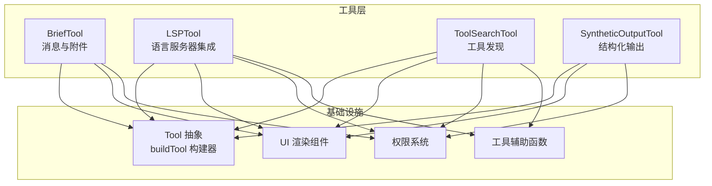
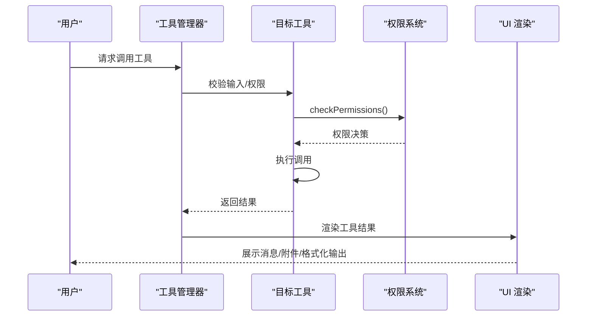
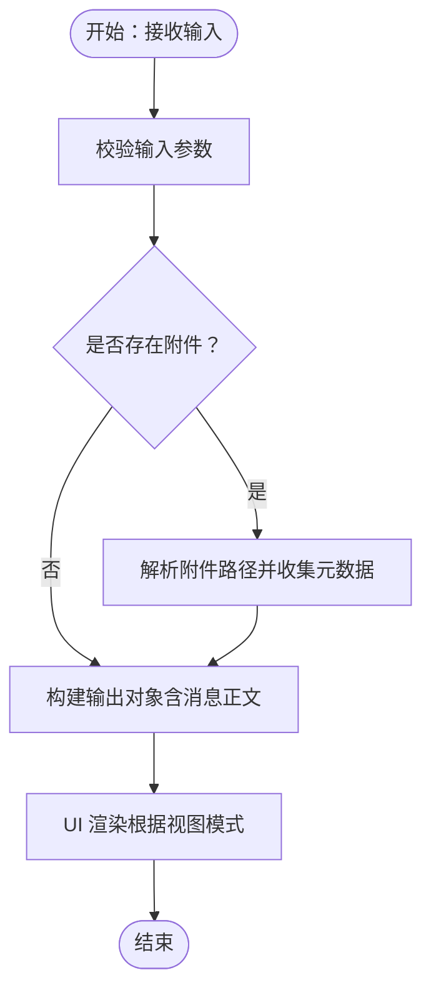
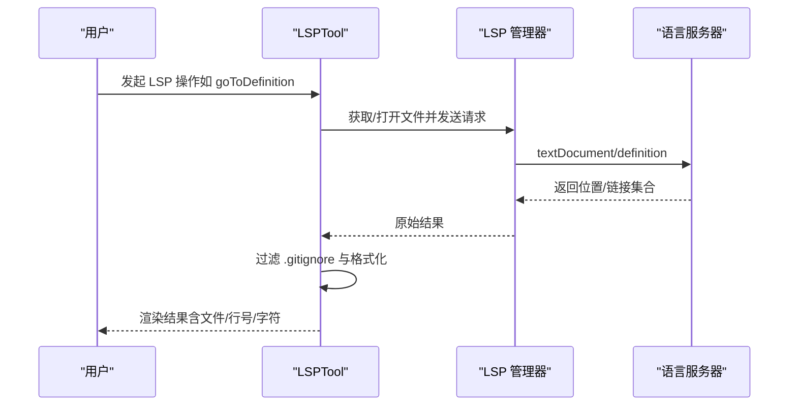
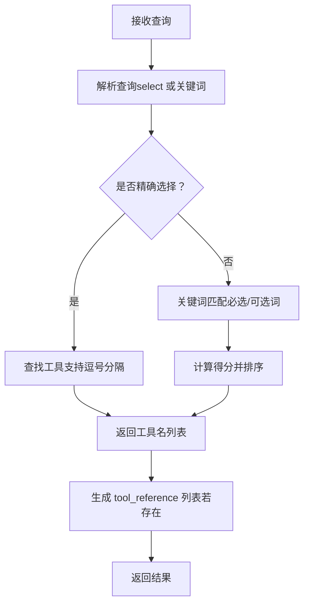
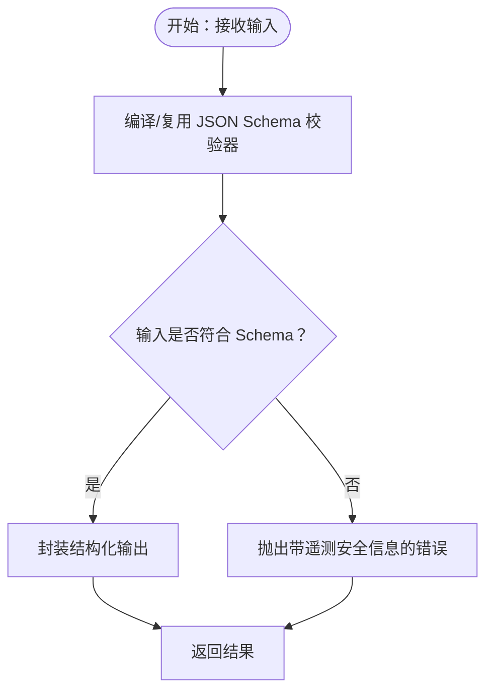
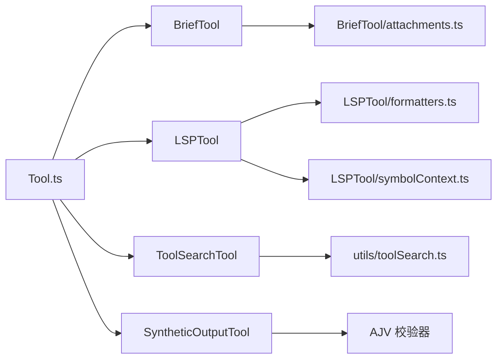

# 专用工具

<cite>
**本文引用的文件**
- [BriefTool/briefTool.ts](file://tools/BriefTool/briefTool.ts)
- [BriefTool/prompt.ts](file://tools/BriefTool/prompt.ts)
- [BriefTool/UI.tsx](file://tools/BriefTool/UI.tsx)
- [BriefTool/attachments.ts](file://tools/BriefTool/attachments.ts)
- [LSPTool/lspTool.ts](file://tools/LSPTool/lspTool.ts)
- [LSPTool/formatters.ts](file://tools/LSPTool/formatters.ts)
- [LSPTool/UI.tsx](file://tools/LSPTool/UI.tsx)
- [LSPTool/schemas.ts](file://tools/LSPTool/schemas.ts)
- [LSPTool/symbolContext.ts](file://tools/LSPTool/symbolContext.ts)
- [ToolSearchTool/toolSearchTool.ts](file://tools/ToolSearchTool/toolSearchTool.ts)
- [ToolSearchTool/prompt.ts](file://tools/ToolSearchTool/prompt.ts)
- [SyntheticOutputTool/syntheticOutputTool.ts](file://tools/SyntheticOutputTool/syntheticOutputTool.ts)
- [Tool.ts](file://Tool.ts)
- [utils/toolSearch.ts](file://utils/toolSearch.ts)
- [utils/utils.ts](file://utils/utils.ts)
</cite>

## 目录
1. [简介](#简介)
2. [项目结构](#项目结构)
3. [核心组件](#核心组件)
4. [架构总览](#架构总览)
5. [详细组件分析](#详细组件分析)
6. [依赖关系分析](#依赖关系分析)
7. [性能考量](#性能考量)
8. [故障排查指南](#故障排查指南)
9. [结论](#结论)
10. [附录](#附录)

## 简介
本文件面向“专用工具”的深入使用与扩展，聚焦以下四类专业工具：
- BriefTool：面向用户的消息发送与附件投递，强调可见性与可读性优先的摘要输出通道
- LSPTool：面向代码智能的 LSP 集成，提供定义跳转、引用查找、悬停信息、符号浏览与调用层级等能力
- ToolSearchTool：面向动态工具发现与加载，支持按关键词或精确选择检索延迟加载的工具（尤其是 MCP 工具）
- SyntheticOutputTool：面向非交互式场景的结构化输出工具，用于在最终阶段返回严格校验的结构化 JSON

文档将从系统架构、组件关系、数据流、处理逻辑、集成点、错误处理与性能特性等方面进行系统化阐述，并给出实际应用案例、使用技巧与最佳实践。

## 项目结构
专用工具位于 tools 目录下，围绕 Tool.ts 的统一抽象构建，每个工具通过 buildTool 构建器组合输入/输出模式、权限控制、渲染与结果映射等能力。工具间通过工具池、权限系统、消息管线与 UI 组件协同工作。

图表来源
- [Tool.ts:783-793](file://Tool.ts#L783-L793)
- [BriefTool/briefTool.ts:136-205](file://tools/BriefTool/briefTool.ts#L136-L205)
- [LSPTool/lspTool.ts:127-423](file://tools/LSPTool/lspTool.ts#L127-L423)
- [ToolSearchTool/toolSearchTool.ts:304-472](file://tools/ToolSearchTool/toolSearchTool.ts#L304-L472)
- [SyntheticOutputTool/syntheticOutputTool.ts:28-101](file://tools/SyntheticOutputTool/syntheticOutputTool.ts#L28-L101)

章节来源
- [Tool.ts:362-793](file://Tool.ts#L362-L793)
- [utils/toolSearch.ts:1-757](file://utils/toolSearch.ts#L1-L757)

## 核心组件
- 工具抽象与构建
  - Tool.ts 定义了工具的统一接口、默认行为与构建器 buildTool，确保各工具具备一致的生命周期、权限、渲染与结果映射能力
- BriefTool
  - 提供用户消息发送与附件解析，支持主动/正常两类状态，具备附件解析与 UI 展示
- LSPTool
  - 封装 LSP 协议请求与格式化输出，支持多类操作（定义、引用、悬停、符号、实现、调用层级），内置安全与过滤逻辑
- ToolSearchTool
  - 动态发现与加载延迟工具，支持关键词匹配与精确选择，结合模型能力与代理兼容性策略
- SyntheticOutputTool
  - 在非交互式会话中返回结构化 JSON，支持基于 JSON Schema 的运行时校验与缓存优化

章节来源
- [Tool.ts:362-793](file://Tool.ts#L362-L793)
- [BriefTool/briefTool.ts:136-205](file://tools/BriefTool/briefTool.ts#L136-L205)
- [LSPTool/lspTool.ts:127-423](file://tools/LSPTool/lspTool.ts#L127-L423)
- [ToolSearchTool/toolSearchTool.ts:304-472](file://tools/ToolSearchTool/toolSearchTool.ts#L304-L472)
- [SyntheticOutputTool/syntheticOutputTool.ts:28-101](file://tools/SyntheticOutputTool/syntheticOutputTool.ts#L28-L101)

## 架构总览
专用工具的运行链路包括：工具注册与可用性判定、输入校验与权限检查、调用执行、结果格式化与 UI 渲染、以及消息与进度的传递。工具池由工具管理器维护，动态工具加载通过 ToolSearchTool 与工具引用块完成。

图表来源
- [Tool.ts:499-504](file://Tool.ts#L499-L504)
- [utils/toolSearch.ts:385-473](file://utils/toolSearch.ts#L385-L473)

## 详细组件分析

### BriefTool：消息与附件摘要
- 能力概述
  - 发送面向用户的文本消息，支持 Markdown；可附加图片、差异、日志等文件
  - 支持“主动”与“正常”两类状态，指导下游路由与呈现
  - 内置附件解析与元数据收集，保证 UI 友好展示
- 关键实现要点
  - 输入/输出模式：严格 Zod schema 校验，输出包含消息正文、附件列表与时间戳
  - 可用性门控：结合特性开关、用户授权与助手模式，决定是否启用
  - 渲染：在不同视图（转录、简报仅视图、默认）下采用不同的排版与时间戳显示
- 应用场景
  - 代码总结：将分析结果以简洁、可读的方式呈现给用户
  - 智能提示：在用户等待时发送阶段性进展，提升交互体验
  - 测试数据生成：将生成的数据以附件形式随消息一并呈现

图表来源
- [BriefTool/briefTool.ts:186-204](file://tools/BriefTool/briefTool.ts#L186-L204)
- [BriefTool/attachments.ts:1-200](file://tools/BriefTool/attachments.ts#L1-L200)
- [BriefTool/UI.tsx:15-68](file://tools/BriefTool/UI.tsx#L15-L68)

章节来源
- [BriefTool/briefTool.ts:136-205](file://tools/BriefTool/briefTool.ts#L136-L205)
- [BriefTool/prompt.ts:1-23](file://tools/BriefTool/prompt.ts#L1-L23)
- [BriefTool/UI.tsx:15-68](file://tools/BriefTool/UI.tsx#L15-L68)

### LSPTool：语言服务器集成
- 能力概述
  - 支持定义跳转、引用查找、悬停信息、文档/工作区符号、实现跳转、调用层级（入站/出站）等
  - 自动打开文件、大小限制、URI 解析与相对路径展示、忽略 .gitignore 文件过滤
- 关键实现要点
  - LSP 方法映射：将工具操作映射到标准 LSP 方法与参数
  - 结果格式化：针对不同操作类型输出统一格式，支持计数与文件数量统计
  - 安全与健壮性：文件存在性校验、UNC 路径防护、异常捕获与日志记录
- 应用场景
  - 代码补全：通过悬停与符号浏览辅助理解上下文
  - 符号导航：快速定位定义与引用，加速重构与阅读
  - 调用分析：查看入站/出站调用，辅助复杂函数的追踪与理解

图表来源
- [LSPTool/lspTool.ts:224-414](file://tools/LSPTool/lspTool.ts#L224-L414)
- [LSPTool/formatters.ts:127-169](file://tools/LSPTool/formatters.ts#L127-L169)
- [LSPTool/UI.tsx:212-227](file://tools/LSPTool/UI.tsx#L212-L227)

章节来源
- [LSPTool/lspTool.ts:127-423](file://tools/LSPTool/lspTool.ts#L127-L423)
- [LSPTool/formatters.ts:1-593](file://tools/LSPTool/formatters.ts#L1-L593)
- [LSPTool/UI.tsx:13-228](file://tools/LSPTool/UI.tsx#L13-L228)

### ToolSearchTool：工具发现与动态加载
- 能力概述
  - 将延迟加载的工具（MCP 与 shouldDefer 工具）暴露为可检索项，支持关键词匹配与精确选择
  - 结合模型能力与代理兼容性策略，自动启用/禁用动态加载
- 关键实现要点
  - 工具筛选：识别 shouldDefer/MCP 工具，排除 alwaysLoad 工具
  - 关键词匹配：拆分查询词、区分必选/可选词、预编译正则、缓存描述与评分
  - 动态加载：通过 tool_reference 块在消息中携带工具名，后续请求中仅包含已发现工具
  - 兼容性：检测模型对 tool_reference 的支持，避免第三方代理不支持导致的失败
- 应用场景
  - 工具选择：当模型需要特定外部能力（如 Slack、GitHub 等）时，通过关键词快速定位
  - 最小化提示：在工具过多时避免一次性注入完整工具集，降低上下文开销

图表来源
- [ToolSearchTool/toolSearchTool.ts:328-434](file://tools/ToolSearchTool/toolSearchTool.ts#L328-L434)
- [ToolSearchTool/prompt.ts:54-108](file://tools/ToolSearchTool/prompt.ts#L54-L108)
- [utils/toolSearch.ts:385-473](file://utils/toolSearch.ts#L385-L473)

章节来源
- [ToolSearchTool/toolSearchTool.ts:304-472](file://tools/ToolSearchTool/toolSearchTool.ts#L304-L472)
- [ToolSearchTool/prompt.ts:1-122](file://tools/ToolSearchTool/prompt.ts#L1-L122)
- [utils/toolSearch.ts:1-757](file://utils/toolSearch.ts#L1-L757)

### SyntheticOutputTool：结构化输出生成
- 能力概述
  - 在非交互式会话中返回最终结构化 JSON，确保输出符合指定 JSON Schema
  - 对同一 Schema 的多次调用进行弱引用缓存，减少编译与校验开销
- 关键实现要点
  - 动态 Schema 校验：使用 AJV 编译并验证输入，失败时抛出带遥测安全信息的错误
  - 输出封装：返回“结构化输出已提供”的通用文本与原始结构化内容
  - UI 最小化：在 SDK/CLI 场景下提供简洁 UI 行为
- 应用场景
  - 测试数据生成：按固定 Schema 生成测试用例
  - 智能推荐：返回结构化建议（如修复方案、配置项）

图表来源
- [SyntheticOutputTool/syntheticOutputTool.ts:116-164](file://tools/SyntheticOutputTool/syntheticOutputTool.ts#L116-L164)

章节来源
- [SyntheticOutputTool/syntheticOutputTool.ts:28-101](file://tools/SyntheticOutputTool/syntheticOutputTool.ts#L28-L101)
- [SyntheticOutputTool/syntheticOutputTool.ts:116-164](file://tools/SyntheticOutputTool/syntheticOutputTool.ts#L116-L164)

## 依赖关系分析
- 工具抽象与构建
  - 所有工具均通过 Tool.ts 的 buildTool 构建，统一实现权限、渲染、结果映射与 UI 行为
- 工具间协作
  - ToolSearchTool 依赖工具池与权限上下文，动态发现工具后通过 tool_reference 与消息管线传递
  - LSPTool 依赖 LSP 管理器与格式化器，输出统一格式供 UI 使用
  - BriefTool 依赖附件解析与 UI 组件，负责最终用户可见输出
  - SyntheticOutputTool 依赖 AJV 与工具缓存，确保结构化输出一致性
- 外部依赖与集成点
  - LSPTool 与 LSP 服务器协议对接，遵循 VS Code 类型规范
  - ToolSearchTool 与模型的 tool_reference 能力耦合，需考虑代理兼容性

图表来源
- [Tool.ts:362-793](file://Tool.ts#L362-L793)
- [utils/toolSearch.ts:1-757](file://utils/toolSearch.ts#L1-L757)
- [LSPTool/formatters.ts:1-593](file://tools/LSPTool/formatters.ts#L1-L593)
- [LSPTool/symbolContext.ts:1-200](file://tools/LSPTool/symbolContext.ts#L1-L200)
- [BriefTool/attachments.ts:1-200](file://tools/BriefTool/attachments.ts#L1-L200)
- [SyntheticOutputTool/syntheticOutputTool.ts:116-164](file://tools/SyntheticOutputTool/syntheticOutputTool.ts#L116-L164)

章节来源
- [Tool.ts:362-793](file://Tool.ts#L362-L793)
- [utils/toolSearch.ts:1-757](file://utils/toolSearch.ts#L1-L757)

## 性能考量
- BriefTool
  - 附件解析与 UI 渲染在渲染层完成，避免在工具层做重 IO；输出包含时间戳，便于回放与调试
- LSPTool
  - 文件大小限制（默认 10MB）、URI 解析与相对路径展示减少冗余；对位置结果进行 .gitignore 过滤，减少无关文件传输
  - 两步调用层级流程（prepareCallHierarchy → incoming/outgoingCalls）避免一次性拉取大量数据
- ToolSearchTool
  - 关键词匹配前编译正则与缓存描述，降低重复计算；自动阈值检测（令牌/字符）避免过早启用动态加载
  - 模型兼容性检测（tool_reference 支持）避免无效往返
- SyntheticOutputTool
  - 弱引用缓存同一 Schema 的编译结果，显著降低重复校验开销

章节来源
- [LSPTool/lspTool.ts:53-611](file://tools/LSPTool/lspTool.ts#L53-L611)
- [ToolSearchTool/toolSearchTool.ts:66-105](file://tools/ToolSearchTool/toolSearchTool.ts#L66-L105)
- [utils/toolSearch.ts:124-152](file://utils/toolSearch.ts#L124-L152)
- [SyntheticOutputTool/syntheticOutputTool.ts:109-125](file://tools/SyntheticOutputTool/syntheticOutputTool.ts#L109-L125)

## 故障排查指南
- BriefTool
  - 附件路径无效：检查路径合法性与可访问性；确认附件解析流程未被强制要求字段破坏
  - 用户不可见：确认 isBriefEnabled 门控与用户授权状态
- LSPTool
  - LSP 服务器不可用：检查初始化状态与连接；关注“无 LSP 服务器可用”的提示
  - 结果为空：确认光标位置、符号是否被索引；检查 .gitignore 过滤是否误删
  - 文件过大：超过 10MB 限制会被拒绝
- ToolSearchTool
  - 模型不支持 tool_reference：检查模型名称与代理设置；必要时调整 ENABLE_TOOL_SEARCH
  - 工具未出现：确认 isDeferredTool 规则与 alwaysLoad 设置
- SyntheticOutputTool
  - Schema 不合法：AJV 会返回诊断信息；修正后重新创建工具实例
  - 输出不符合约束：核对输入字段与 Schema 定义

章节来源
- [BriefTool/briefTool.ts:163-204](file://tools/BriefTool/briefTool.ts#L163-L204)
- [LSPTool/lspTool.ts:224-414](file://tools/LSPTool/lspTool.ts#L224-L414)
- [utils/toolSearch.ts:239-252](file://utils/toolSearch.ts#L239-L252)
- [SyntheticOutputTool/syntheticOutputTool.ts:130-164](file://tools/SyntheticOutputTool/syntheticOutputTool.ts#L130-L164)

## 结论
专用工具通过统一抽象与模块化设计，在 Claude Code 生态中实现了“可见性优先”的消息输出、强大的代码智能、灵活的工具发现与严格的结构化输出。它们在性能、安全性与可扩展性方面均有明确考量，适合在复杂工程场景中承担关键角色。建议在实际使用中结合上下文窗口、代理兼容性与业务需求，合理选择与组合这些工具。

## 附录
- 实际应用案例
  - 代码总结：使用 BriefTool 将分析结果与关键文件摘要一并呈现，提高可读性
  - 智能提示：在长时间任务中通过 BriefTool 发送阶段性 checkpoint，提升用户体验
  - 工具选择：通过 ToolSearchTool 快速定位外部集成（如 Slack/GitHub），减少手动配置
  - 测试数据生成：借助 SyntheticOutputTool 生成符合 Schema 的测试用例，保障质量
- 使用技巧与最佳实践
  - BriefTool：尽量使用 Markdown 简洁表达；附件应与消息语义强关联
  - LSPTool：在复杂函数上先查看调用层级，再逐步深入定义与引用
  - ToolSearchTool：优先使用 select: 精确选择，关键词搜索用于模糊发现
  - SyntheticOutputTool：对高频使用的 Schema 做缓存复用，减少编译成本