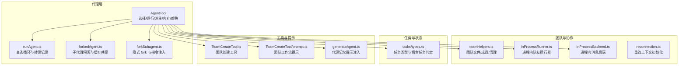
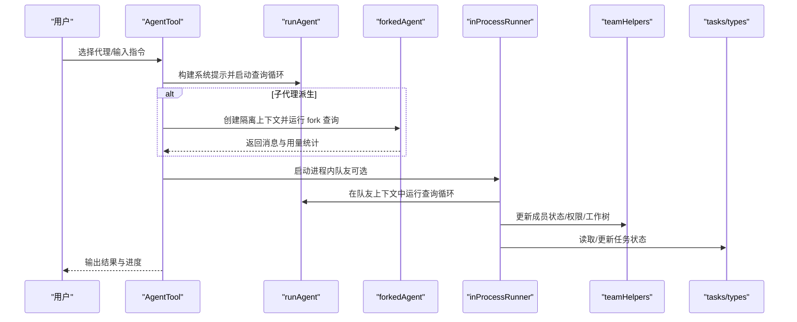
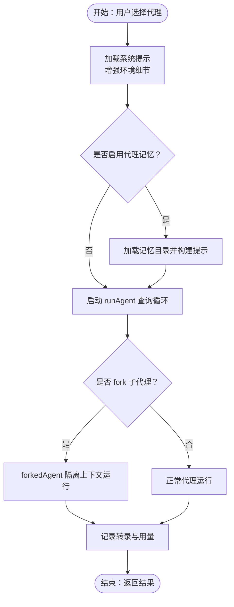
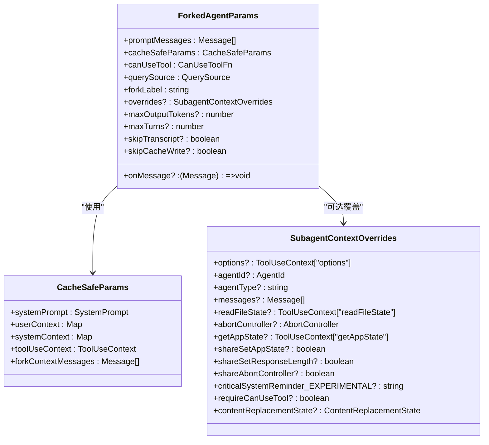
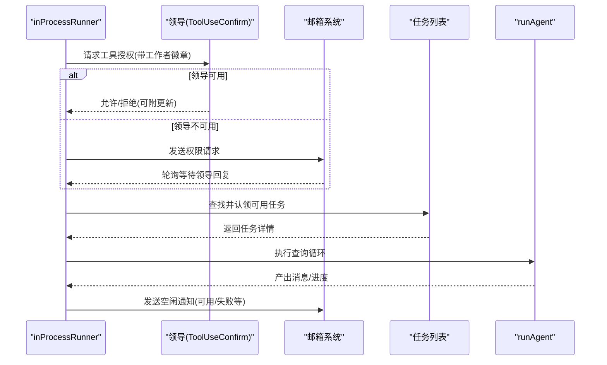
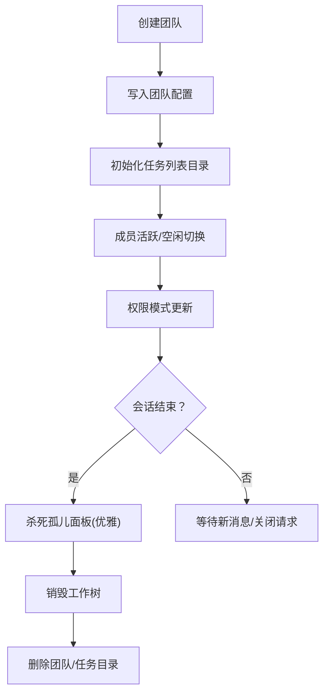
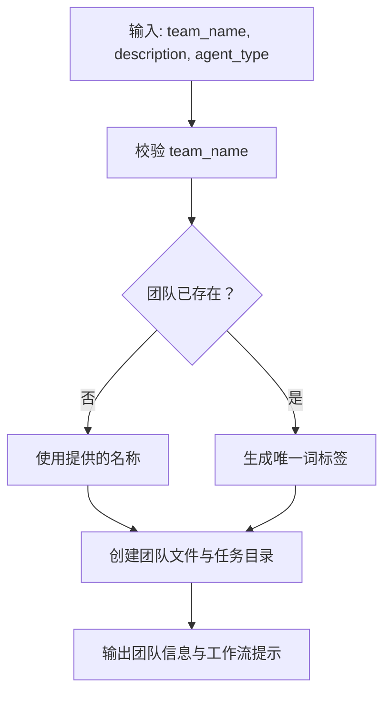
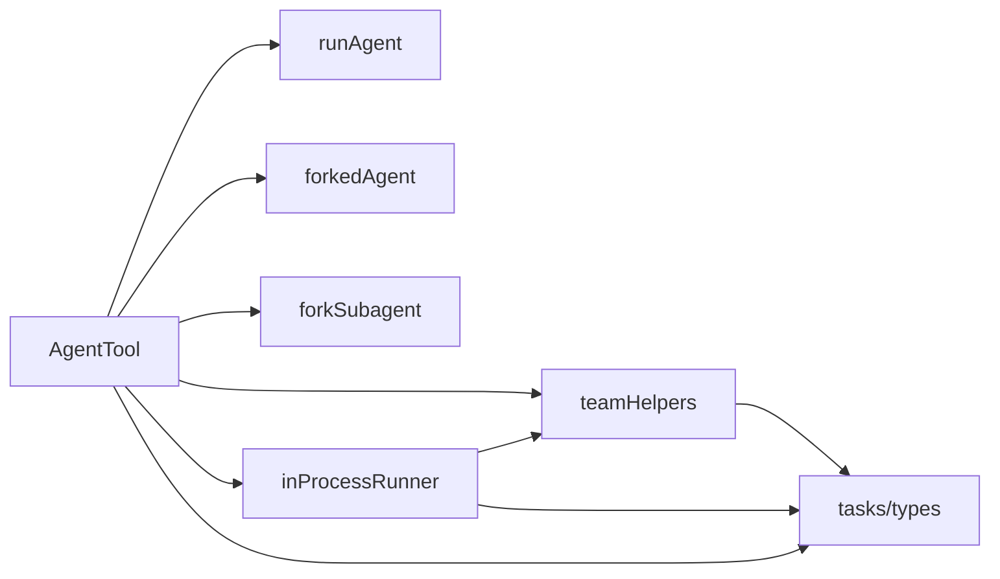

# 多代理协作工具

<cite>
**本文引用的文件**
- [tools/AgentTool/AgentTool.tsx](file://tools/AgentTool/AgentTool.tsx)
- [tools/AgentTool/runAgent.ts](file://tools/AgentTool/runAgent.ts)
- [tools/AgentTool/forkSubagent.ts](file://tools/AgentTool/forkSubagent.ts)
- [tools/AgentTool/agentMemory.ts](file://tools/AgentTool/agentMemory.ts)
- [tools/AgentTool/agentColorManager.ts](file://tools/AgentTool/agentColorManager.ts)
- [tools/AgentTool/builtInAgents.ts](file://tools/AgentTool/builtInAgents.ts)
- [utils/forkedAgent.ts](file://utils/forkedAgent.ts)
- [utils/agentContext.ts](file://utils/agentContext.ts)
- [utils/swarm/teamHelpers.ts](file://utils/swarm/teamHelpers.ts)
- [utils/swarm/inProcessRunner.ts](file://utils/swarm/inProcessRunner.ts)
- [utils/swarm/reconnection.ts](file://utils/swarm/reconnection.ts)
- [utils/swarm/backends/InProcessBackend.ts](file://utils/swarm/backends/InProcessBackend.ts)
- [tasks/types.ts](file://tasks/types.ts)
- [tools/TeamCreateTool/TeamCreateTool.ts](file://tools/TeamCreateTool/TeamCreateTool.ts)
- [tools/TeamCreateTool/prompt.ts](file://tools/TeamCreateTool/prompt.ts)
- [components/agents/generateAgent.ts](file://components/agents/generateAgent.ts)
</cite>

## 目录
1. [简介](#简介)
2. [项目结构](#项目结构)
3. [核心组件](#核心组件)
4. [架构总览](#架构总览)
5. [详细组件分析](#详细组件分析)
6. [依赖关系分析](#依赖关系分析)
7. [性能考量](#性能考量)
8. [故障排查指南](#故障排查指南)
9. [结论](#结论)
10. [附录](#附录)

## 简介
本文件面向“多代理协作工具”的使用者与开发者，系统性阐述 AgentTool 的架构设计、代理生命周期管理、团队协作机制与内存系统，并覆盖子代理派生、提示工程、任务分配与进度跟踪、结果汇总、跨代理通信协议与冲突解决、状态同步、性能监控与资源管理、以及故障恢复策略。文档同时提供可复用的工作流案例（如代码审查、项目管理、复杂任务分解），帮助读者在实际场景中落地使用。

## 项目结构
围绕多代理协作的关键模块包括：
- AgentTool：代理选择、系统提示构建、运行与派生（含子代理与 fork 子代理）、内存与颜色管理、UI 集成。
- Swarm 团队与进程后端：团队配置、成员状态、权限请求与响应、消息邮箱、进程内/外部执行后端。
- 任务系统：统一的任务类型与后台任务判定，支撑团队任务列表与进度跟踪。
- 工具集：团队创建、任务 CRUD、消息发送等协作工具。

**图示来源**
- [tools/AgentTool/AgentTool.tsx:517-549](file://tools/AgentTool/AgentTool.tsx#L517-L549)
- [tools/AgentTool/runAgent.ts:732-810](file://tools/AgentTool/runAgent.ts#L732-L810)
- [utils/forkedAgent.ts:489-626](file://utils/forkedAgent.ts#L489-L626)
- [tools/AgentTool/forkSubagent.ts:107-198](file://tools/AgentTool/forkSubagent.ts#L107-L198)
- [utils/swarm/teamHelpers.ts:115-182](file://utils/swarm/teamHelpers.ts#L115-L182)
- [utils/swarm/inProcessRunner.ts:471-502](file://utils/swarm/inProcessRunner.ts#L471-L502)
- [utils/swarm/backends/InProcessBackend.ts:150-180](file://utils/swarm/backends/InProcessBackend.ts#L150-L180)
- [utils/swarm/reconnection.ts:36-66](file://utils/swarm/reconnection.ts#L36-L66)
- [tasks/types.ts:12-47](file://tasks/types.ts#L12-L47)
- [tools/TeamCreateTool/TeamCreateTool.ts:128-143](file://tools/TeamCreateTool/TeamCreateTool.ts#L128-L143)
- [tools/TeamCreateTool/prompt.ts:22-47](file://tools/TeamCreateTool/prompt.ts#L22-L47)
- [components/agents/generateAgent.ts:99-111](file://components/agents/generateAgent.ts#L99-L111)

**章节来源**
- [tools/AgentTool/AgentTool.tsx:517-549](file://tools/AgentTool/AgentTool.tsx#L517-L549)
- [tools/AgentTool/runAgent.ts:732-810](file://tools/AgentTool/runAgent.ts#L732-L810)
- [utils/forkedAgent.ts:489-626](file://utils/forkedAgent.ts#L489-L626)
- [tools/AgentTool/forkSubagent.ts:107-198](file://tools/AgentTool/forkSubagent.ts#L107-L198)
- [utils/swarm/teamHelpers.ts:115-182](file://utils/swarm/teamHelpers.ts#L115-L182)
- [utils/swarm/inProcessRunner.ts:471-502](file://utils/swarm/inProcessRunner.ts#L471-L502)
- [utils/swarm/backends/InProcessBackend.ts:150-180](file://utils/swarm/backends/InProcessBackend.ts#L150-L180)
- [utils/swarm/reconnection.ts:36-66](file://utils/swarm/reconnection.ts#L36-L66)
- [tasks/types.ts:12-47](file://tasks/types.ts#L12-L47)
- [tools/TeamCreateTool/TeamCreateTool.ts:128-143](file://tools/TeamCreateTool/TeamCreateTool.ts#L128-L143)
- [tools/TeamCreateTool/prompt.ts:22-47](file://tools/TeamCreateTool/prompt.ts#L22-L47)
- [components/agents/generateAgent.ts:99-111](file://components/agents/generateAgent.ts#L99-L111)

## 核心组件
- AgentTool：负责代理选择、系统提示增强、运行与派生（子代理与 fork 子代理）、内存加载与持久化、颜色映射、UI 集成与元数据记录。
- forkedAgent：提供子代理隔离、缓存安全参数传递、用量统计与事件记录，确保 fork 查询循环与父请求共享提示缓存。
- inProcessRunner：进程内队友运行器，封装 runAgent，提供异步上下文隔离、进度跟踪、空闲通知、计划模式审批、权限桥接与清理。
- teamHelpers：团队配置文件读写、成员状态变更、会话清理、工作树销毁与任务目录清理。
- tasks/types：统一任务类型与后台任务判定，支撑团队任务列表与 UI 展示。
- TeamCreateTool：团队创建工具，生成唯一团队名、创建团队文件与任务列表目录、输出团队信息。

**章节来源**
- [tools/AgentTool/AgentTool.tsx:517-549](file://tools/AgentTool/AgentTool.tsx#L517-L549)
- [utils/forkedAgent.ts:489-626](file://utils/forkedAgent.ts#L489-L626)
- [utils/swarm/inProcessRunner.ts:471-502](file://utils/swarm/inProcessRunner.ts#L471-L502)
- [utils/swarm/teamHelpers.ts:115-182](file://utils/swarm/teamHelpers.ts#L115-L182)
- [tasks/types.ts:12-47](file://tasks/types.ts#L12-L47)
- [tools/TeamCreateTool/TeamCreateTool.ts:128-143](file://tools/TeamCreateTool/TeamCreateTool.ts#L128-L143)

## 架构总览
多代理协作以 AgentTool 为核心入口，结合 forkedAgent 实现子代理隔离与缓存共享；通过 inProcessRunner 管理进程内队友生命周期；teamHelpers 提供团队配置与成员状态持久化；TeamCreateTool 负责团队初始化；tasks/types 统一任务模型；InProcessBackend 提供进程内消息通道；reconnection 支持断线重连时的上下文重建。

**图示来源**
- [tools/AgentTool/AgentTool.tsx:517-549](file://tools/AgentTool/AgentTool.tsx#L517-L549)
- [tools/AgentTool/runAgent.ts:732-810](file://tools/AgentTool/runAgent.ts#L732-L810)
- [utils/forkedAgent.ts:489-626](file://utils/forkedAgent.ts#L489-L626)
- [utils/swarm/inProcessRunner.ts:471-502](file://utils/swarm/inProcessRunner.ts#L471-L502)
- [utils/swarm/teamHelpers.ts:115-182](file://utils/swarm/teamHelpers.ts#L115-L182)
- [tasks/types.ts:12-47](file://tasks/types.ts#L12-L47)

## 详细组件分析

### AgentTool：代理选择、系统提示与运行
- 代理选择与系统提示：根据所选代理获取系统提示，增强环境细节，支持代理记忆加载与持久化。
- 运行与转录：记录初始消息与后续消息，支持中断与异常处理。
- 子代理与 fork 子代理：支持显式子代理与隐式 fork（省略子代理类型时自动触发），fork 子代理通过占位 tool_result 与指令文本最大化提示缓存命中。
- 内存系统：按用户/项目/本地作用域加载代理记忆，构建记忆提示并注入到系统提示。
- 颜色管理：基于代理类型映射主题颜色，支持设置与清除。

**图示来源**
- [tools/AgentTool/AgentTool.tsx:517-549](file://tools/AgentTool/AgentTool.tsx#L517-L549)
- [tools/AgentTool/runAgent.ts:732-810](file://tools/AgentTool/runAgent.ts#L732-L810)
- [tools/AgentTool/forkSubagent.ts:107-198](file://tools/AgentTool/forkSubagent.ts#L107-L198)
- [utils/forkedAgent.ts:489-626](file://utils/forkedAgent.ts#L489-L626)
- [tools/AgentTool/agentMemory.ts:138-177](file://tools/AgentTool/agentMemory.ts#L138-L177)
- [tools/AgentTool/agentColorManager.ts:36-66](file://tools/AgentTool/agentColorManager.ts#L36-L66)

**章节来源**
- [tools/AgentTool/AgentTool.tsx:517-549](file://tools/AgentTool/AgentTool.tsx#L517-L549)
- [tools/AgentTool/runAgent.ts:732-810](file://tools/AgentTool/runAgent.ts#L732-L810)
- [tools/AgentTool/forkSubagent.ts:107-198](file://tools/AgentTool/forkSubagent.ts#L107-L198)
- [utils/forkedAgent.ts:489-626](file://utils/forkedAgent.ts#L489-L626)
- [tools/AgentTool/agentMemory.ts:138-177](file://tools/AgentTool/agentMemory.ts#L138-L177)
- [tools/AgentTool/agentColorManager.ts:36-66](file://tools/AgentTool/agentColorManager.ts#L36-L66)

### forkedAgent：子代理隔离与缓存共享
- 缓存安全参数：确保 fork 与父请求共享提示缓存所需的系统提示、用户上下文、系统上下文、工具上下文与前缀消息一致。
- 上下文隔离：克隆文件状态缓存、内容替换状态、动态技能触发集合等，避免对父代理状态的干扰。
- 用量统计与事件记录：聚合每轮 API 使用量，记录 fork 查询事件，便于性能分析与成本追踪。
- 可选上限：支持输出令牌上限、轮次上限、消息回调与跳过缓存写入等选项。

**图示来源**
- [utils/forkedAgent.ts:83-113](file://utils/forkedAgent.ts#L83-L113)
- [utils/forkedAgent.ts:252-304](file://utils/forkedAgent.ts#L252-L304)
- [utils/forkedAgent.ts:489-626](file://utils/forkedAgent.ts#L489-L626)

**章节来源**
- [utils/forkedAgent.ts:83-113](file://utils/forkedAgent.ts#L83-L113)
- [utils/forkedAgent.ts:252-304](file://utils/forkedAgent.ts#L252-L304)
- [utils/forkedAgent.ts:489-626](file://utils/forkedAgent.ts#L489-L626)

### inProcessRunner：进程内队友生命周期与权限
- 权限决策：优先通过领导者的 ToolUseConfirm 对话框进行工具授权，若不可用则通过邮箱系统请求与等待响应。
- 空闲通知：队友完成一轮后向领导发送空闲通知，支持可用/被打断/失败等状态与摘要。
- 任务领取：从团队任务列表中查找可用任务并认领，格式化任务提示后执行。
- 状态同步：通过邮箱系统接收新消息或关闭请求，保持队友在空闲态而非终止。
- 清理与回收：在成功/失败/中止后进行清理，释放资源并发出 SDK 事件。

**图示来源**
- [utils/swarm/inProcessRunner.ts:128-451](file://utils/swarm/inProcessRunner.ts#L128-L451)
- [utils/swarm/inProcessRunner.ts:547-589](file://utils/swarm/inProcessRunner.ts#L547-L589)
- [utils/swarm/inProcessRunner.ts:624-657](file://utils/swarm/inProcessRunner.ts#L624-L657)
- [utils/swarm/inProcessRunner.ts:689-800](file://utils/swarm/inProcessRunner.ts#L689-L800)

**章节来源**
- [utils/swarm/inProcessRunner.ts:128-451](file://utils/swarm/inProcessRunner.ts#L128-L451)
- [utils/swarm/inProcessRunner.ts:547-589](file://utils/swarm/inProcessRunner.ts#L547-L589)
- [utils/swarm/inProcessRunner.ts:624-657](file://utils/swarm/inProcessRunner.ts#L624-L657)
- [utils/swarm/inProcessRunner.ts:689-800](file://utils/swarm/inProcessRunner.ts#L689-L800)

### teamHelpers：团队配置与成员管理
- 团队文件：读写团队配置（名称、描述、成员、允许路径、隐藏面板等）。
- 成员状态：设置成员活跃/空闲、权限模式、移除成员、隐藏/显示面板。
- 会话清理：注册/注销会话创建的团队，优雅/非优雅退出时清理团队目录与任务目录，销毁工作树。
- 工作树管理：删除工作树（优先 git worktree remove，回退 rm -rf）。

**图示来源**
- [utils/swarm/teamHelpers.ts:115-182](file://utils/swarm/teamHelpers.ts#L115-L182)
- [utils/swarm/teamHelpers.ts:454-485](file://utils/swarm/teamHelpers.ts#L454-L485)
- [utils/swarm/teamHelpers.ts:576-590](file://utils/swarm/teamHelpers.ts#L576-L590)
- [utils/swarm/teamHelpers.ts:641-683](file://utils/swarm/teamHelpers.ts#L641-L683)

**章节来源**
- [utils/swarm/teamHelpers.ts:115-182](file://utils/swarm/teamHelpers.ts#L115-L182)
- [utils/swarm/teamHelpers.ts:454-485](file://utils/swarm/teamHelpers.ts#L454-L485)
- [utils/swarm/teamHelpers.ts:576-590](file://utils/swarm/teamHelpers.ts#L576-L590)
- [utils/swarm/teamHelpers.ts:641-683](file://utils/swarm/teamHelpers.ts#L641-L683)

### TeamCreateTool：团队创建与工作流
- 输入校验：要求团队名，可选描述与代理类型。
- 唯一性：若团队已存在，生成唯一名称；限制每个领导者仅能管理一个团队。
- 工作流提示：创建团队文件与任务列表目录，说明团队工作流与任务所有权。

**图示来源**
- [tools/TeamCreateTool/TeamCreateTool.ts:96-143](file://tools/TeamCreateTool/TeamCreateTool.ts#L96-L143)
- [tools/TeamCreateTool/prompt.ts:22-47](file://tools/TeamCreateTool/prompt.ts#L22-L47)

**章节来源**
- [tools/TeamCreateTool/TeamCreateTool.ts:96-143](file://tools/TeamCreateTool/TeamCreateTool.ts#L96-L143)
- [tools/TeamCreateTool/prompt.ts:22-47](file://tools/TeamCreateTool/prompt.ts#L22-L47)

### 任务系统与后台任务判定
- 统一任务类型：涵盖本地/远程代理任务、进程内队友任务、本地 Shell 任务、工作流任务、MCP 监控任务、梦境任务等。
- 后台任务判定：运行中或待执行且未显式标记为前台的任务视为后台任务，用于后台任务指示器。

**章节来源**
- [tasks/types.ts:12-47](file://tasks/types.ts#L12-L47)

### 代理提示工程与记忆注入
- 代理记忆提示：当提及“记忆/记住/学习/持久化”或代理需要跨对话积累知识时，注入领域特定的记忆更新指令。
- 记忆范围：用户/项目/本地三类作用域，分别对应通用性、团队共享与本地机器定制。

**章节来源**
- [components/agents/generateAgent.ts:99-111](file://components/agents/generateAgent.ts#L99-L111)
- [tools/AgentTool/agentMemory.ts:138-177](file://tools/AgentTool/agentMemory.ts#L138-L177)

## 依赖关系分析
- AgentTool 依赖 runAgent/forkedAgent/forkSubagent 提供运行与派生能力；依赖 teamHelpers 与 inProcessRunner 管理团队与队友生命周期；依赖 tasks/types 统一任务模型。
- inProcessRunner 依赖邮箱系统与权限桥接实现跨代理通信与权限同步。
- teamHelpers 依赖任务系统与 Git 工具进行工作树与目录清理。

**图示来源**
- [tools/AgentTool/AgentTool.tsx:517-549](file://tools/AgentTool/AgentTool.tsx#L517-L549)
- [tools/AgentTool/runAgent.ts:732-810](file://tools/AgentTool/runAgent.ts#L732-L810)
- [utils/forkedAgent.ts:489-626](file://utils/forkedAgent.ts#L489-L626)
- [tools/AgentTool/forkSubagent.ts:107-198](file://tools/AgentTool/forkSubagent.ts#L107-L198)
- [utils/swarm/teamHelpers.ts:115-182](file://utils/swarm/teamHelpers.ts#L115-L182)
- [utils/swarm/inProcessRunner.ts:471-502](file://utils/swarm/inProcessRunner.ts#L471-L502)
- [tasks/types.ts:12-47](file://tasks/types.ts#L12-L47)

**章节来源**
- [tools/AgentTool/AgentTool.tsx:517-549](file://tools/AgentTool/AgentTool.tsx#L517-L549)
- [tools/AgentTool/runAgent.ts:732-810](file://tools/AgentTool/runAgent.ts#L732-L810)
- [utils/forkedAgent.ts:489-626](file://utils/forkedAgent.ts#L489-L626)
- [tools/AgentTool/forkSubagent.ts:107-198](file://tools/AgentTool/forkSubagent.ts#L107-L198)
- [utils/swarm/teamHelpers.ts:115-182](file://utils/swarm/teamHelpers.ts#L115-L182)
- [utils/swarm/inProcessRunner.ts:471-502](file://utils/swarm/inProcessRunner.ts#L471-L502)
- [tasks/types.ts:12-47](file://tasks/types.ts#L12-L47)

## 性能考量
- 提示缓存共享：fork 子代理通过占位 tool_result 与一致的系统提示前缀最大化缓存命中，降低重复计算。
- 用量聚合：forkedAgent 聚合每轮 API 使用量并记录事件，便于成本与性能分析。
- 后台任务与转录：runAgent 仅记录可记录消息并维护父链连续性，减少不必要 I/O。
- 会话清理：优雅退出时先杀面板再删目录，避免孤儿进程与资源泄漏。

[本节为通用指导，无需列出具体文件来源]

## 故障排查指南
- fork 子代理递归：检测历史中的 fork 模板标签，防止递归 fork。
- 中止与异常：runAgent 在中止时抛出中断错误；forkedAgent 在 finally 中释放缓存与消息数组。
- 权限问题：inProcessRunner 优先通过领导 UI 授权，否则通过邮箱轮询等待；支持拒绝反馈与权限更新持久化。
- 重连上下文：reconnection 基于团队文件计算初始上下文，确保心跳与功能正常。
- 目录清理：teamHelpers 在会话结束时销毁工作树与目录，避免残留。

**章节来源**
- [tools/AgentTool/forkSubagent.ts:78-89](file://tools/AgentTool/forkSubagent.ts#L78-L89)
- [tools/AgentTool/runAgent.ts:808-810](file://tools/AgentTool/runAgent.ts#L808-L810)
- [utils/forkedAgent.ts:599-604](file://utils/forkedAgent.ts#L599-L604)
- [utils/swarm/inProcessRunner.ts:198-334](file://utils/swarm/inProcessRunner.ts#L198-L334)
- [utils/swarm/reconnection.ts:36-66](file://utils/swarm/reconnection.ts#L36-L66)
- [utils/swarm/teamHelpers.ts:576-590](file://utils/swarm/teamHelpers.ts#L576-L590)

## 结论
该多代理协作工具以 AgentTool 为核心，结合 forkedAgent 的缓存共享与隔离、inProcessRunner 的权限与状态管理、teamHelpers 的团队持久化与清理、以及统一的任务类型体系，形成了完整的多代理生命周期与团队协作闭环。通过明确的通信协议（邮箱系统与权限桥）、冲突解决（领导授权优先、邮箱轮询）、状态同步（空闲通知、活跃/空闲切换）与性能优化（提示缓存、用量聚合、后台任务），能够稳定支撑复杂任务分解与持续协作场景。

## 附录

### 多代理工作流案例
- 代码审查：团队创建 → 任务创建 → 分配任务给审查代理 → 审查代理 fork 子代理并行扫描 → 汇总结果与建议 → 关闭团队。
- 项目管理：团队创建 → 任务分解 → 分配给不同角色代理（研究/验证/实现） → 进度跟踪与空闲通知 → 结果汇总与归档。
- 复杂任务分解：leader 使用 fork 子代理派生多个子任务，每个子代理专注单一子任务范围，最终汇总事实与结论。

[本节为概念性说明，无需列出具体文件来源]