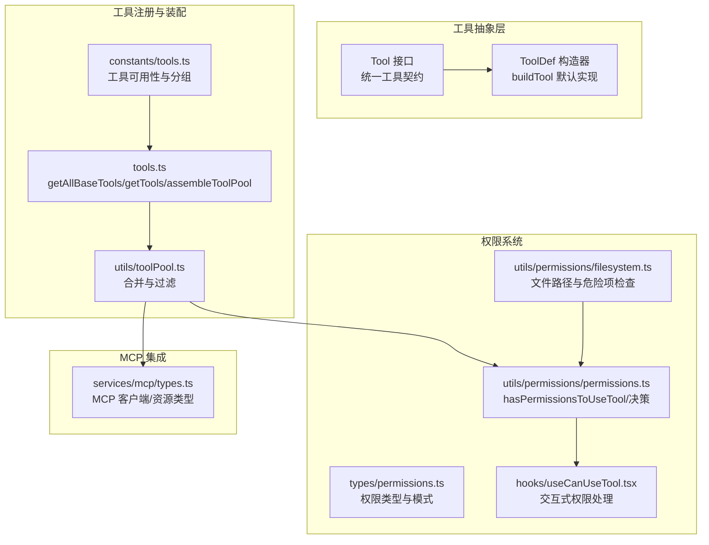
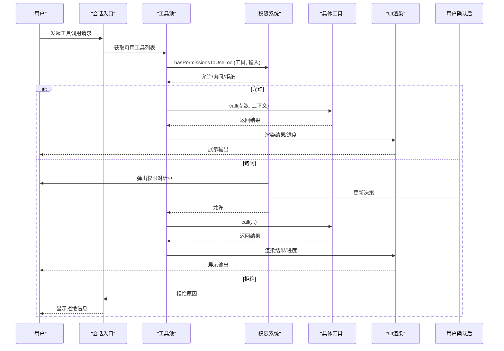
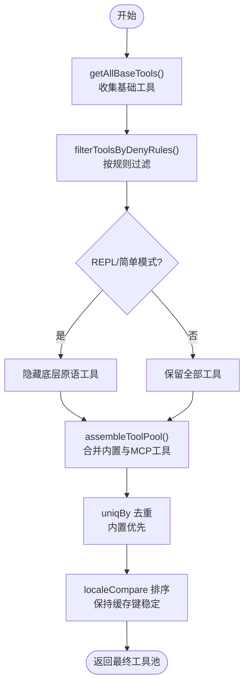
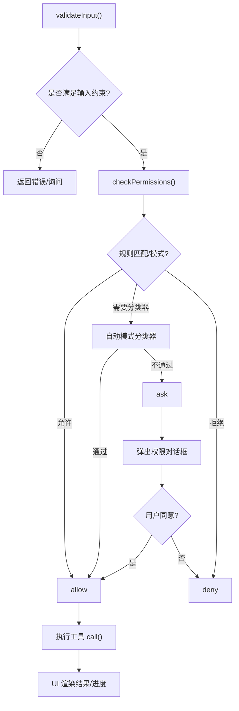
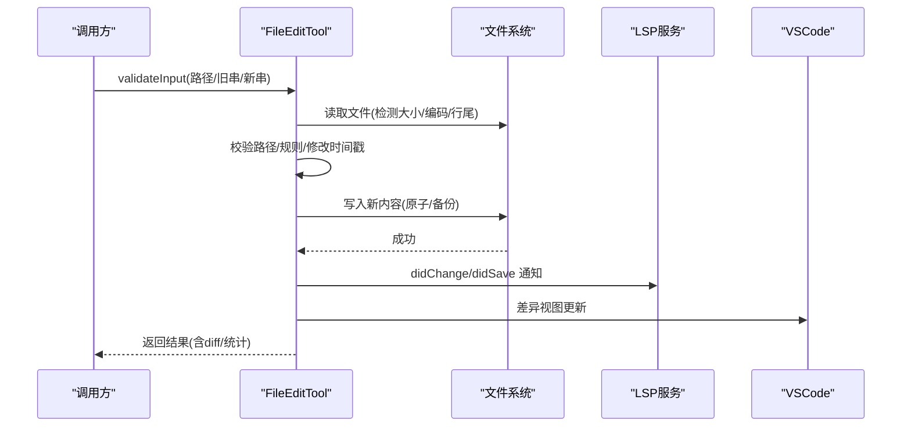
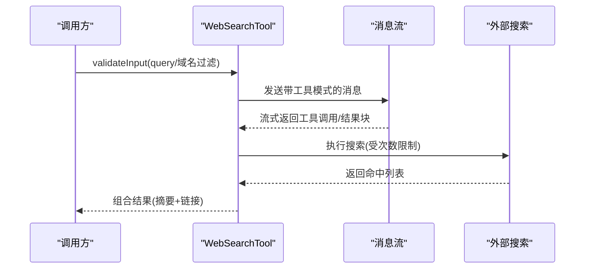
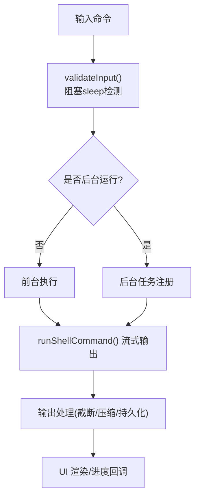
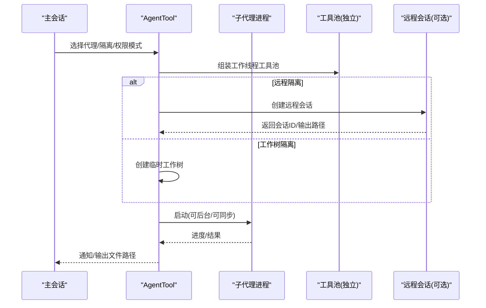
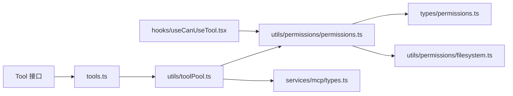

# 工具系统

<cite>
**本文档引用的文件**
- [Tool.ts](file://Tool.ts)
- [tools.ts](file://tools.ts)
- [constants/tools.ts](file://constants/tools.ts)
- [types/permissions.ts](file://types/permissions.ts)
- [utils/toolPool.ts](file://utils/toolPool.ts)
- [utils/permissions/permissions.ts](file://utils/permissions/permissions.ts)
- [utils/permissions/filesystem.ts](file://utils/permissions/filesystem.ts)
- [services/mcp/types.ts](file://services/mcp/types.ts)
- [hooks/useCanUseTool.tsx](file://hooks/useCanUseTool.tsx)
- [tools/FileEditTool/FileEditTool.ts](file://tools/FileEditTool/FileEditTool.ts)
- [tools/WebSearchTool/WebSearchTool.ts](file://tools/WebSearchTool/WebSearchTool.ts)
- [tools/BashTool/BashTool.tsx](file://tools/BashTool/BashTool.tsx)
- [tools/AgentTool/AgentTool.tsx](file://tools/AgentTool/AgentTool.tsx)
</cite>

## 目录
1. [简介](#简介)
2. [项目结构](#项目结构)
3. [核心组件](#核心组件)
4. [架构总览](#架构总览)
5. [详细组件分析](#详细组件分析)
6. [依赖关系分析](#依赖关系分析)
7. [性能考量](#性能考量)
8. [故障排除指南](#故障排除指南)
9. [结论](#结论)
10. [附录](#附录)

## 简介
本文件系统性梳理 Claude Code 的工具系统，覆盖 40+ 内置工具的功能、使用场景、实现原理与安全机制。重点阐述工具注册机制、权限检查与执行流程、工具开发指南（含接口实现与安全考虑）、权限分类与保护机制、与命令系统的集成关系、调试与故障排除方法，并提供最佳实践与性能优化建议。

## 项目结构
工具系统围绕统一的工具抽象构建：所有工具遵循相同的接口契约，通过集中注册与过滤机制装配到会话中；权限系统在调用前进行规则匹配与决策；MCP（Model Context Protocol）工具可动态注入并与内置工具合并。

**图表来源**
- [tools.ts:193-390](file://tools.ts#L193-L390)
- [constants/tools.ts:36-113](file://constants/tools.ts#L36-L113)
- [utils/toolPool.ts:55-80](file://utils/toolPool.ts#L55-L80)
- [utils/permissions/permissions.ts:473-800](file://utils/permissions/permissions.ts#L473-L800)
- [utils/permissions/filesystem.ts:620-665](file://utils/permissions/filesystem.ts#L620-L665)
- [types/permissions.ts:1-442](file://types/permissions.ts#L1-L442)
- [hooks/useCanUseTool.tsx:1-204](file://hooks/useCanUseTool.tsx#L1-L204)
- [services/mcp/types.ts:180-259](file://services/mcp/types.ts#L180-L259)

**章节来源**
- [tools.ts:193-390](file://tools.ts#L193-L390)
- [constants/tools.ts:36-113](file://constants/tools.ts#L36-L113)
- [utils/toolPool.ts:55-80](file://utils/toolPool.ts#L55-L80)
- [utils/permissions/permissions.ts:473-800](file://utils/permissions/permissions.ts#L473-L800)
- [utils/permissions/filesystem.ts:620-665](file://utils/permissions/filesystem.ts#L620-L665)
- [types/permissions.ts:1-442](file://types/permissions.ts#L1-L442)
- [hooks/useCanUseTool.tsx:1-204](file://hooks/useCanUseTool.tsx#L1-L204)
- [services/mcp/types.ts:180-259](file://services/mcp/types.ts#L180-L259)

## 核心组件
- 工具抽象与契约
  - 统一的工具接口定义，包含名称、输入输出模式、并发安全、只读/破坏性标记、权限检查、描述生成、UI 渲染、进度回调等能力。
  - 通过构造器统一填充默认行为，确保一致性与安全性。
- 工具注册与装配
  - 基础工具集合按环境与特性开关组装，支持内置工具与 MCP 工具合并，去重并保持提示缓存稳定排序。
  - 支持简单模式与 REPL 包装模式下的工具过滤。
- 权限系统
  - 多层级权限模式与规则来源，结合自动模式分类器与钩子，实现“允许/询问/拒绝”三态决策。
  - 文件系统安全检查覆盖危险目录/文件、UNC 路径、Windows 特殊路径模式等。
- MCP 集成
  - MCP 客户端连接状态管理、工具序列化、资源类型与配置模型，支持多种传输协议与认证方式。

**章节来源**
- [Tool.ts:362-793](file://Tool.ts#L362-L793)
- [tools.ts:193-390](file://tools.ts#L193-L390)
- [utils/permissions/permissions.ts:473-800](file://utils/permissions/permissions.ts#L473-L800)
- [utils/permissions/filesystem.ts:435-665](file://utils/permissions/filesystem.ts#L435-L665)
- [services/mcp/types.ts:180-259](file://services/mcp/types.ts#L180-L259)

## 架构总览
工具系统采用“抽象契约 + 注册装配 + 权限决策 + UI 渲染”的分层设计。调用链从会话入口进入，经由权限钩子与自动模式分类器进行前置校验，再根据工具类型执行具体逻辑，并通过统一的 UI 层展示结果与进度。

**图表来源**
- [hooks/useCanUseTool.tsx:28-191](file://hooks/useCanUseTool.tsx#L28-L191)
- [utils/permissions/permissions.ts:473-800](file://utils/permissions/permissions.ts#L473-L800)
- [tools.ts:345-390](file://tools.ts#L345-L390)

**章节来源**
- [hooks/useCanUseTool.tsx:28-191](file://hooks/useCanUseTool.tsx#L28-L191)
- [utils/permissions/permissions.ts:473-800](file://utils/permissions/permissions.ts#L473-L800)
- [tools.ts:345-390](file://tools.ts#L345-L390)

## 详细组件分析

### 工具注册与装配机制
- 基础工具集合
  - 通过集中函数生成基础工具数组，按特性开关与环境变量条件加载，避免不必要的依赖。
  - 支持嵌入搜索工具（如 ripgrep/ugrep）时自动剔除冗余的 Glob/Grep 工具。
- 权限过滤
  - 基于规则来源与工具名匹配，过滤掉被显式禁止的工具（含 MCP 服务器级规则）。
- REPL 与简单模式
  - 在 REPL 启用时隐藏底层原语工具，仅通过包装器访问；简单模式仅暴露必要工具集。
- 合并与去重
  - 将内置工具与 MCP 工具合并，按名称去重，内置工具优先，保证提示缓存稳定性。

**图表来源**
- [tools.ts:193-390](file://tools.ts#L193-L390)
- [utils/toolPool.ts:55-80](file://utils/toolPool.ts#L55-L80)

**章节来源**
- [tools.ts:193-390](file://tools.ts#L193-L390)
- [utils/toolPool.ts:55-80](file://utils/toolPool.ts#L55-L80)

### 权限系统与执行流程
- 权限模式与规则
  - 支持多种权限模式（默认、绕过、接受编辑、自动、计划等），规则来源包括用户设置、项目设置、本地设置、策略、标志位、命令、会话等。
  - 规则匹配支持通配符与前缀模式，MCP 工具支持服务器级规则。
- 决策流程
  - 工具调用前先执行 validateInput，再进入 checkPermissions，随后根据模式与规则决定允许、询问或拒绝。
  - 自动模式下优先尝试 acceptEdits 快速通道与安全工具白名单，否则运行分类器进行异步审批。
  - 交互式权限通过 UI 对话框处理，支持建议更新权限与内容块附加。
- 文件系统安全
  - 检测危险路径（.git、.claude、shell 配置、UNC 路径等），识别可疑 Windows 路径模式（短名、长路径前缀、设备名等），并提供细粒度的“仅允许此技能范围”建议。

**图表来源**
- [utils/permissions/permissions.ts:473-800](file://utils/permissions/permissions.ts#L473-L800)
- [utils/permissions/filesystem.ts:435-665](file://utils/permissions/filesystem.ts#L435-L665)
- [hooks/useCanUseTool.tsx:28-191](file://hooks/useCanUseTool.tsx#L28-L191)

**章节来源**
- [utils/permissions/permissions.ts:473-800](file://utils/permissions/permissions.ts#L473-L800)
- [utils/permissions/filesystem.ts:435-665](file://utils/permissions/filesystem.ts#L435-L665)
- [hooks/useCanUseTool.tsx:28-191](file://hooks/useCanUseTool.tsx#L28-L191)

### 文件编辑工具（FileEditTool）
- 功能与场景
  - 在读取文件后进行字符串替换，支持全量替换与逐次替换，自动检测编码与行尾，保持引用样式一致。
  - 提供撤销备份、LSP 通知、VSCode 差异视图联动、Git Diff 记录等增强体验。
- 安全与限制
  - 严格限制对大文件写入（>1GiB），防止 OOM；拒绝 UNC 路径以避免凭据泄露。
  - 未读取过的文件禁止直接写入；修改时间戳变化需与上次读取内容一致才允许写入。
  - 设置文件写入前进行格式校验，防止破坏配置。
- UI 与结果
  - 结果消息包含操作摘要与用户修改提示；支持结构化内容与大结果持久化。

**图表来源**
- [tools/FileEditTool/FileEditTool.ts:137-595](file://tools/FileEditTool/FileEditTool.ts#L137-L595)

**章节来源**
- [tools/FileEditTool/FileEditTool.ts:137-595](file://tools/FileEditTool/FileEditTool.ts#L137-L595)

### 网络搜索工具（WebSearchTool）
- 功能与场景
  - 通过专用工具模式发起网络搜索，聚合多个搜索结果并生成自然语言摘要。
  - 支持域名白/黑名单过滤，限制最大使用次数，保障安全与成本控制。
- 执行流程
  - 构建工具模式与系统提示，流式接收工具调用与搜索结果块，实时更新进度。
  - 输出包含搜索命中列表与文本摘要，强调引用来源。
- 权限与可用性
  - 受 API 提供商与模型能力限制，仅在特定环境下启用。

**图表来源**
- [tools/WebSearchTool/WebSearchTool.ts:254-436](file://tools/WebSearchTool/WebSearchTool.ts#L254-L436)

**章节来源**
- [tools/WebSearchTool/WebSearchTool.ts:254-436](file://tools/WebSearchTool/WebSearchTool.ts#L254-L436)

### Shell 工具（BashTool）
- 功能与场景
  - 执行任意 shell 命令，支持后台运行、自动后台、长时间阻塞命令提示、图像输出压缩、结构化内容等。
  - 搜索/读取/列出类命令支持折叠显示，减少 UI 噪音。
- 安全与限制
  - 读写约束检查、沙箱模式开关、危险命令拦截（如 standalone sleep）、SED 预览与模拟写入。
  - 输出过大时落盘并提供预览，避免内存压力。
- 权限与分类器
  - 命令解析与规则匹配，自动模式下对 Bash 进行快速通道与分类器审批。

**图表来源**
- [tools/BashTool/BashTool.tsx:524-800](file://tools/BashTool/BashTool.tsx#L524-L800)

**章节来源**
- [tools/BashTool/BashTool.tsx:524-800](file://tools/BashTool/BashTool.tsx#L524-L800)

### 多代理协作工具（AgentTool）
- 功能与场景
  - 启动子代理执行任务，支持工作树隔离、远程隔离、后台运行、进度跟踪与摘要。
  - 支持团队模式（多代理编排）、权限模式继承与 MCP 服务器要求检查。
- 生命周期与隔离
  - fork 子代理路径与普通代理路径分别构建系统提示与工具池，确保缓存一致性与权限独立。
  - 工作树隔离自动清理无变更分支，远程隔离通过 CCR 会话管理。
- UI 与通知
  - 后台任务完成后通过通知与输出文件告知用户。

**图表来源**
- [tools/AgentTool/AgentTool.tsx:239-800](file://tools/AgentTool/AgentTool.tsx#L239-L800)

**章节来源**
- [tools/AgentTool/AgentTool.tsx:239-800](file://tools/AgentTool/AgentTool.tsx#L239-L800)

### 概念总览
- 工具接口与 UI 渲染
  - 工具统一实现渲染接口，支持简洁/详细模式、进度消息、拒绝/错误 UI、群组渲染等。
- 搜索与延迟加载
  - 部分工具（如 WebSearch）支持延迟加载与工具搜索阈值控制，减少初始提示体积。
- 协作与命令系统集成
  - 工具系统与命令系统通过上下文与消息流集成，工具调用可作为命令执行的一部分。

[本节为概念性说明，不直接分析具体文件]

## 依赖关系分析
- 工具层
  - 所有工具依赖统一的工具接口与构造器，确保行为一致性。
- 注册层
  - 工具池依赖常量与环境开关，按模式与特性装配工具。
- 权限层
  - 权限系统依赖规则来源、模式与分类器，与工具的 checkPermissions 钩子配合。
- MCP 层
  - MCP 类型与客户端状态影响工具可用性与装配顺序。

**图表来源**
- [tools.ts:193-390](file://tools.ts#L193-L390)
- [utils/toolPool.ts:55-80](file://utils/toolPool.ts#L55-L80)
- [utils/permissions/permissions.ts:473-800](file://utils/permissions/permissions.ts#L473-L800)
- [types/permissions.ts:1-442](file://types/permissions.ts#L1-L442)
- [utils/permissions/filesystem.ts:620-665](file://utils/permissions/filesystem.ts#L620-L665)
- [hooks/useCanUseTool.tsx:28-191](file://hooks/useCanUseTool.tsx#L28-L191)
- [services/mcp/types.ts:180-259](file://services/mcp/types.ts#L180-L259)

**章节来源**
- [tools.ts:193-390](file://tools.ts#L193-L390)
- [utils/toolPool.ts:55-80](file://utils/toolPool.ts#L55-L80)
- [utils/permissions/permissions.ts:473-800](file://utils/permissions/permissions.ts#L473-L800)
- [types/permissions.ts:1-442](file://types/permissions.ts#L1-L442)
- [utils/permissions/filesystem.ts:620-665](file://utils/permissions/filesystem.ts#L620-L665)
- [hooks/useCanUseTool.tsx:28-191](file://hooks/useCanUseTool.tsx#L28-L191)
- [services/mcp/types.ts:180-259](file://services/mcp/types.ts#L180-L259)

## 性能考量
- 工具池装配
  - 使用 localeCompare 排序与 uniqBy 去重，确保提示缓存键稳定，避免下游缓存失效。
  - 内置工具优先，MCP 工具次之，减少跨分区干扰。
- 输出持久化
  - 大输出自动落盘并提供预览，避免内存峰值；图像输出压缩与尺寸限制降低传输成本。
- 分类器与自动模式
  - acceptEdits 快速通道与安全工具白名单减少分类器调用；后台任务与自动后台策略提升响应性。
- 并发与只读
  - 只读工具并发安全，减少锁竞争；后台任务通道共享，便于统一管理与中断。

[本节提供通用指导，不直接分析具体文件]

## 故障排除指南
- 权限相关
  - 若工具被拒绝，检查权限模式与规则来源；查看自动模式拒绝通知与分类器原因；必要时通过 UI 建议更新权限。
  - 文件写入失败：确认文件已读取、未被外部修改、路径不在危险目录；UNC 路径会被拒绝。
- Shell 工具
  - 阻塞命令被拦截：使用 run_in_background 或改用 Monitor 工具；长时间 sleep 建议改为定时任务。
  - 输出过大：查看持久化输出路径与大小；检查预览截断。
- MCP 工具
  - 服务器未连接/认证失败：检查配置与认证流程；等待连接完成后再调用。
- UI 与交互
  - 权限对话框未出现：确认 awaitAutomatedChecksBeforeDialog 设置；检查自动模式分类器是否提前决策。

**章节来源**
- [hooks/useCanUseTool.tsx:28-191](file://hooks/useCanUseTool.tsx#L28-L191)
- [utils/permissions/permissions.ts:473-800](file://utils/permissions/permissions.ts#L473-L800)
- [utils/permissions/filesystem.ts:435-665](file://utils/permissions/filesystem.ts#L435-L665)
- [tools/BashTool/BashTool.tsx:524-800](file://tools/BashTool/BashTool.tsx#L524-L800)

## 结论
Claude Code 的工具系统以统一抽象为核心，通过严格的权限与安全检查、灵活的装配与合并机制、完善的 UI 与进度反馈，实现了高安全性与易用性的平衡。内置工具覆盖文件编辑、Shell、网络搜索、代理协作等多个领域；MCP 工具扩展了生态能力。开发者可基于统一接口快速实现自定义工具，并遵循安全与权限规范，确保在复杂场景下的可控与可靠。

## 附录
- 工具开发指南
  - 实现工具接口：定义名称、输入输出模式、描述、UI 渲染、权限检查与安全限制。
  - 使用构造器：通过 buildTool 填充默认行为，避免遗漏关键方法。
  - 安全考虑：输入验证、路径安全检查、只读/破坏性标记、沙箱与分类器集成。
  - 性能优化：合理使用并发安全、输出持久化、进度回调与 UI 折叠。
- 最佳实践
  - 优先使用只读工具与 acceptEdits 快速通道；对高风险操作启用交互式权限。
  - 在 REPL/简单模式下谨慎暴露底层原语；利用工具搜索与延迟加载减少初始负担。
  - 对大输出与图像输出进行压缩与落盘；为后台任务提供通知与输出文件路径。
- 与命令系统的集成
  - 工具调用作为命令执行的一部分，通过消息流与上下文传递；工具结果可作为后续命令输入。

[本节为通用指导，不直接分析具体文件]