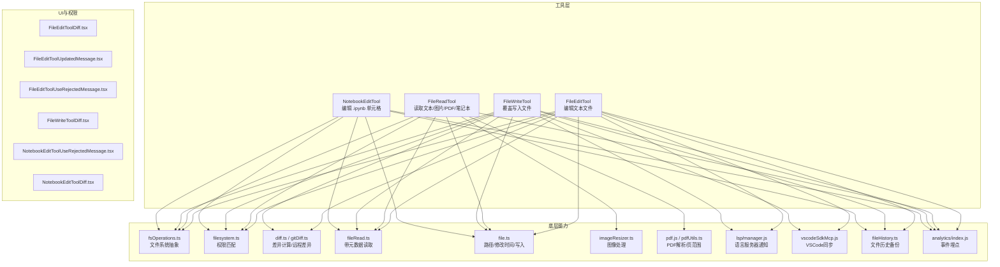
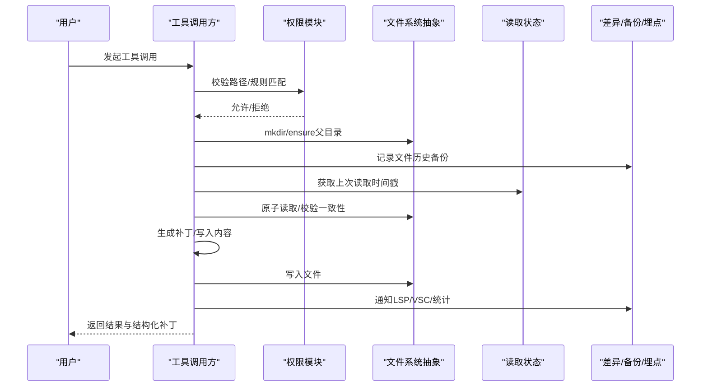
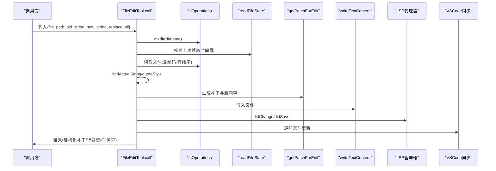
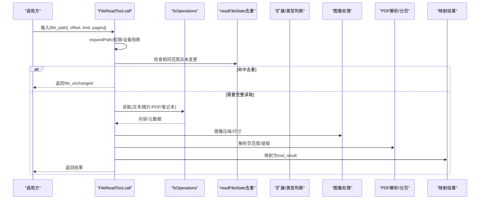
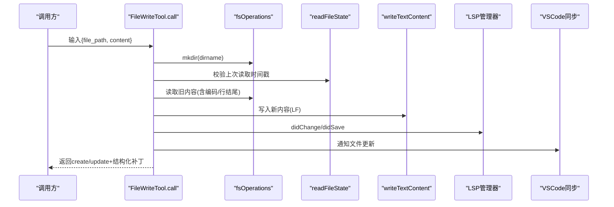
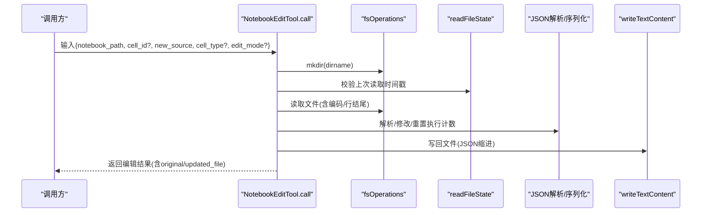
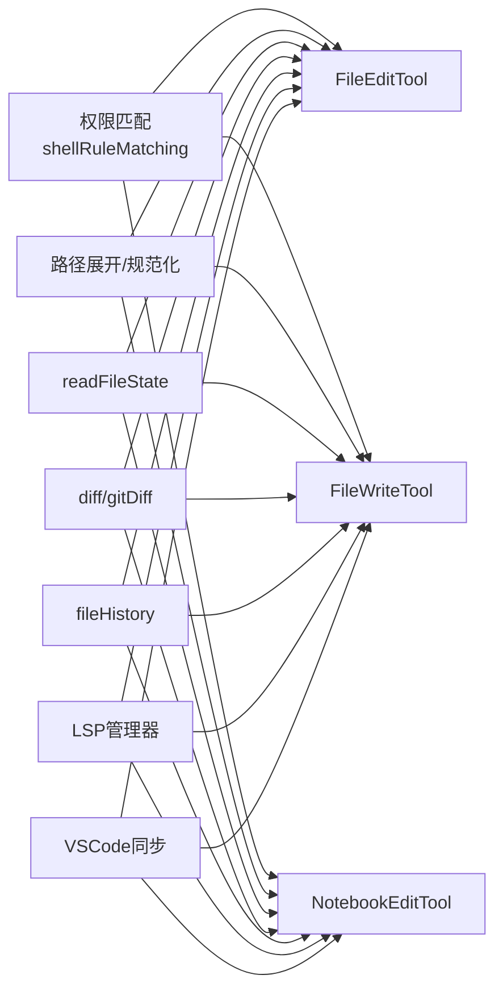

# 文件编辑工具

<cite>
**本文引用的文件**
- [tools/FileEditTool/FileEditTool.ts](file://tools/FileEditTool/FileEditTool.ts)
- [tools/FileReadTool/FileReadTool.ts](file://tools/FileReadTool/FileReadTool.ts)
- [tools/FileWriteTool/FileWriteTool.ts](file://tools/FileWriteTool/FileWriteTool.ts)
- [tools/NotebookEditTool/NotebookEditTool.ts](file://tools/NotebookEditTool/NotebookEditTool.ts)
- [tools/FileEditTool/constants.ts](file://tools/FileEditTool/constants.ts)
- [tools/FileEditTool/prompt.ts](file://tools/FileEditTool/prompt.ts)
- [tools/FileEditTool/types.ts](file://tools/FileEditTool/types.ts)
- [tools/FileEditTool/utils.ts](file://tools/FileEditTool/utils.ts)
- [components/FileEditToolDiff.tsx](file://components/FileEditToolDiff.tsx)
- [components/FileEditToolUpdatedMessage.tsx](file://components/FileEditToolUpdatedMessage.tsx)
- [components/FileEditToolUseRejectedMessage.tsx](file://components/FileEditToolUseRejectedMessage.tsx)
- [components/permissions/FileWriteToolDiff.tsx](file://components/permissions/FileWriteToolDiff.tsx)
- [components/NotebookEditToolUseRejectedMessage.tsx](file://components/NotebookEditToolUseRejectedMessage.tsx)
- [components/permissions/NotebookEditPermissionRequest/NotebookEditToolDiff.tsx](file://components/permissions/NotebookEditPermissionRequest/NotebookEditToolDiff.tsx)
- [utils/fileRead.ts](file://utils/fileRead.ts)
- [utils/file.ts](file://utils/file.ts)
- [utils/diff.ts](file://utils/diff.ts)
- [utils/gitDiff.ts](file://utils/gitDiff.ts)
- [utils/fsOperations.ts](file://utils/fsOperations.ts)
- [utils/permissions/filesystem.ts](file://utils/permissions/filesystem.ts)
- [utils/permissions/shellRuleMatching.ts](file://utils/permissions/shellRuleMatching.ts)
- [utils/fileHistory.ts](file://utils/fileHistory.ts)
- [utils/fileOperationAnalytics.ts](file://utils/fileOperationAnalytics.ts)
- [utils/notebook.ts](file://utils/notebook.ts)
- [utils/imageResizer.ts](file://utils/imageResizer.ts)
- [utils/pdf.js](file://utils/pdf.js)
- [utils/pdfUtils.ts](file://utils/pdfUtils.ts)
- [services/lsp/manager.js](file://services/lsp/manager.js)
- [services/mcp/vscodeSdkMcp.js](file://services/mcp/vscodeSdkMcp.js)
- [services/teamMemorySync/teamMemSecretGuard.js](file://services/teamMemorySync/teamMemSecretGuard.js)
- [hooks/useDiffInIDE.ts](file://hooks/useDiffInIDE.ts)
- [hooks/useIDEIntegration.tsx](file://hooks/useIDEIntegration.tsx)
- [hooks/useDiffData.ts](file://hooks/useDiffData.ts)
- [services/analytics/index.js](file://services/analytics/index.js)
- [services/diagnosticTracking.js](file://services/diagnosticTracking.js)
- [services/lsp/LSPDiagnosticRegistry.js](file://services/lsp/LSPDiagnosticRegistry.js)
- [services/analytics/growthbook.js](file://services/analytics/growthbook.js)
- [constants/files.ts](file://constants/files.ts)
- [constants/apiLimits.ts](file://constants/apiLimits.ts)
- [utils/format.js](file://utils/format.js)
- [utils/log.js](file://utils/log.js)
- [utils/debug.js](file://utils/debug.js)
- [utils/errors.js](file://utils/errors.js)
- [utils/envUtils.js](file://utils/envUtils.js)
- [utils/cwd.js](file://utils/cwd.js)
- [utils/readFileInRange.js](file://utils/readFileInRange.js)
- [utils/semanticNumber.js](file://utils/semanticNumber.js)
- [utils/slowOperations.js](file://utils/slowOperations.js)
- [utils/json.js](file://utils/json.js)
- [utils/lazySchema.js](file://utils/lazySchema.js)
- [utils/path.js](file://utils/path.js)
- [utils/tokenEstimation.js](file://utils/tokenEstimation.js)
- [utils/memoryFileDetection.js](file://utils/memoryFileDetection.js)
- [utils/messages.js](file://utils/messages.js)
- [utils/model/model.js](file://utils/model/model.js)
- [utils/format.js](file://utils/format.js)
- [utils/fileOperationAnalytics.js](file://utils/fileOperationAnalytics.js)
- [utils/fileHistory.ts](file://utils/fileHistory.ts)
- [utils/fileRead.ts](file://utils/fileRead.ts)
- [utils/file.ts](file://utils/file.ts)
- [utils/diff.ts](file://utils/diff.ts)
- [utils/gitDiff.ts](file://utils/gitDiff.ts)
- [utils/fsOperations.ts](file://utils/fsOperations.ts)
- [utils/permissions/filesystem.ts](file://utils/permissions/filesystem.ts)
- [utils/permissions/shellRuleMatching.ts](file://utils/permissions/shellRuleMatching.ts)
- [utils/notebook.ts](file://utils/notebook.ts)
- [utils/imageResizer.ts](file://utils/imageResizer.ts)
- [utils/pdf.js](file://utils/pdf.js)
- [utils/pdfUtils.ts](file://utils/pdfUtils.ts)
- [services/lsp/manager.js](file://services/lsp/manager.js)
- [services/mcp/vscodeSdkMcp.js](file://services/mcp/vscodeSdkMcp.js)
- [services/teamMemorySync/teamMemSecretGuard.js](file://services/teamMemorySync/teamMemSecretGuard.js)
- [hooks/useDiffInIDE.ts](file://hooks/useDiffInIDE.ts)
- [hooks/useIDEIntegration.tsx](file://hooks/useIDEIntegration.tsx)
- [hooks/useDiffData.ts](file://hooks/useDiffData.ts)
- [services/analytics/index.js](file://services/analytics/index.js)
- [services/diagnosticTracking.js](file://services/diagnosticTracking.js)
- [services/lsp/LSPDiagnosticRegistry.js](file://services/lsp/LSPDiagnosticRegistry.js)
- [services/analytics/growthbook.js](file://services/analytics/growthbook.js)
- [constants/files.ts](file://constants/files.ts)
- [constants/apiLimits.ts](file://constants/apiLimits.ts)
- [utils/format.js](file://utils/format.js)
- [utils/log.js](file://utils/log.js)
- [utils/debug.js](file://utils/debug.js)
- [utils/errors.js](file://utils/errors.js)
- [utils/envUtils.js](file://utils/envUtils.js)
- [utils/cwd.js](file://utils/cwd.js)
- [utils/readFileInRange.js](file://utils/readFileInRange.js)
- [utils/semanticNumber.js](file://utils/semanticNumber.js)
- [utils/slowOperations.js](file://utils/slowOperations.js)
- [utils/json.js](file://utils/json.js)
- [utils/lazySchema.js](file://utils/lazySchema.js)
- [utils/path.js](file://utils/path.js)
- [utils/tokenEstimation.js](file://utils/tokenEstimation.js)
- [utils/memoryFileDetection.js](file://utils/memoryFileDetection.js)
- [utils/messages.js](file://utils/messages.js)
- [utils/model/model.js](file://utils/model/model.js)
</cite>

## 目录
1. [简介](#简介)
2. [项目结构](#项目结构)
3. [核心组件](#核心组件)
4. [架构总览](#架构总览)
5. [详细组件分析](#详细组件分析)
6. [依赖关系分析](#依赖关系分析)
7. [性能考量](#性能考量)
8. [故障排查指南](#故障排查指南)
9. [结论](#结论)
10. [附录](#附录)

## 简介
本文件面向文件编辑工具系列，系统性梳理 FileEditTool（文件编辑）、FileReadTool（文件读取）、FileWriteTool（文件写入）与 NotebookEditTool（笔记本编辑）的功能特性、输入输出、安全与权限控制、文件路径校验、内容差异显示、批量与撤销能力、IDE 集成与实时预览、以及最佳实践与性能优化建议。文档同时覆盖图像处理、PDF 提取、大文件读取限制、编码转换与备份策略等主题，并提供常见问题与排障指引。

## 项目结构
文件编辑工具位于 tools 目录下，配套 UI 组件与权限/差异展示组件位于 components 目录；底层能力由 utils 与 services 提供，包括文件读写、权限匹配、差异计算、LSP 通知、VSCode 同步、Git Diff、文件历史备份、分析埋点等。

图表来源
- [tools/FileEditTool/FileEditTool.ts:86-595](file://tools/FileEditTool/FileEditTool.ts#L86-L595)
- [tools/FileReadTool/FileReadTool.ts:337-718](file://tools/FileReadTool/FileReadTool.ts#L337-L718)
- [tools/FileWriteTool/FileWriteTool.ts:94-434](file://tools/FileWriteTool/FileWriteTool.ts#L94-L434)
- [tools/NotebookEditTool/NotebookEditTool.ts:90-490](file://tools/NotebookEditTool/NotebookEditTool.ts#L90-L490)
- [utils/fsOperations.ts](file://utils/fsOperations.ts)
- [utils/permissions/filesystem.ts](file://utils/permissions/filesystem.ts)
- [utils/diff.ts](file://utils/diff.ts)
- [utils/gitDiff.ts](file://utils/gitDiff.ts)
- [utils/fileRead.ts](file://utils/fileRead.ts)
- [utils/file.ts](file://utils/file.ts)
- [utils/imageResizer.ts](file://utils/imageResizer.ts)
- [utils/pdf.js](file://utils/pdf.js)
- [utils/pdfUtils.ts](file://utils/pdfUtils.ts)
- [services/lsp/manager.js](file://services/lsp/manager.js)
- [services/mcp/vscodeSdkMcp.js](file://services/mcp/vscodeSdkMcp.js)
- [utils/fileHistory.ts](file://utils/fileHistory.ts)
- [services/analytics/index.js](file://services/analytics/index.js)

章节来源
- [tools/FileEditTool/FileEditTool.ts:86-595](file://tools/FileEditTool/FileEditTool.ts#L86-L595)
- [tools/FileReadTool/FileReadTool.ts:337-718](file://tools/FileReadTool/FileReadTool.ts#L337-L718)
- [tools/FileWriteTool/FileWriteTool.ts:94-434](file://tools/FileWriteTool/FileWriteTool.ts#L94-L434)
- [tools/NotebookEditTool/NotebookEditTool.ts:90-490](file://tools/NotebookEditTool/NotebookEditTool.ts#L90-L490)

## 核心组件
- FileEditTool：在“先读取后编辑”的约束下执行精确字符串替换，支持 replace_all 批量替换、读取状态一致性检查、差异生成与 VSCode Diff 同步、LSP 诊断刷新、文件历史备份、Git 差异采集与埋点统计。
- FileReadTool：统一读取文本、图片、PDF、Jupyter 笔记本；内置设备文件阻断、二进制扩展过滤、macOS 截图路径兼容、分段读取与去重、令牌上限估算与校验、图像压缩与尺寸信息、PDF 分页提取与元数据返回。
- FileWriteTool：全量内容覆盖写入，要求“先读取后写入”，保持行尾与编码一致性，生成结构化补丁，通知 LSP/VSC 并更新读取时间戳，支持 Git 差异采集与埋点。
- NotebookEditTool：专门编辑 .ipynb 单元格，支持 replace/insert/delete 模式，自动解析 cell id/索引，重置执行计数与输出，生成结构化补丁并进行文件历史备份。

章节来源
- [tools/FileEditTool/FileEditTool.ts:86-595](file://tools/FileEditTool/FileEditTool.ts#L86-L595)
- [tools/FileReadTool/FileReadTool.ts:337-718](file://tools/FileReadTool/FileReadTool.ts#L337-L718)
- [tools/FileWriteTool/FileWriteTool.ts:94-434](file://tools/FileWriteTool/FileWriteTool.ts#L94-L434)
- [tools/NotebookEditTool/NotebookEditTool.ts:90-490](file://tools/NotebookEditTool/NotebookEditTool.ts#L90-L490)

## 架构总览
文件编辑工具遵循“只读/只写/编辑”三类工具的统一模式：权限前置校验、路径归一化、读取状态一致性检查、原子写入、LSP/VSC 同步、文件历史备份、可选 Git 差异与埋点统计。

图表来源
- [tools/FileEditTool/FileEditTool.ts:387-574](file://tools/FileEditTool/FileEditTool.ts#L387-L574)
- [tools/FileWriteTool/FileWriteTool.ts:223-417](file://tools/FileWriteTool/FileWriteTool.ts#L223-L417)
- [utils/permissions/filesystem.ts](file://utils/permissions/filesystem.ts)
- [utils/fileHistory.ts](file://utils/fileHistory.ts)
- [utils/diff.ts](file://utils/diff.ts)
- [utils/gitDiff.ts](file://utils/gitDiff.ts)
- [services/lsp/manager.js](file://services/lsp/manager.js)
- [services/mcp/vscodeSdkMcp.js](file://services/mcp/vscodeSdkMcp.js)

## 详细组件分析

### FileEditTool（文件编辑）
- 功能要点
  - 严格“先读取后编辑”：若未读取或自上次读取以来被外部修改，将拒绝写入以避免覆盖。
  - 字符串替换：支持唯一匹配与 replace_all 批量替换；自动处理引号风格（直引号/弯引号）以保持排版一致。
  - 输入校验：路径展开、UNC 路径安全、大小限制（最大 1GiB）、笔记本文档识别（交由 NotebookEditTool 处理）、设置文件语义校验、团队机密防护。
  - 输出：返回结构化补丁、原始文件、是否批量替换、可选 Git 差异、行变更统计与埋点。
- 关键流程（编辑调用）

图表来源
- [tools/FileEditTool/FileEditTool.ts:387-574](file://tools/FileEditTool/FileEditTool.ts#L387-L574)
- [tools/FileEditTool/utils.ts:234-350](file://tools/FileEditTool/utils.ts#L234-L350)
- [utils/fileRead.ts](file://utils/fileRead.ts)
- [utils/file.ts](file://utils/file.ts)
- [utils/diff.ts](file://utils/diff.ts)
- [services/lsp/manager.js](file://services/lsp/manager.js)
- [services/mcp/vscodeSdkMcp.js](file://services/mcp/vscodeSdkMcp.js)

- 输入/输出与类型
  - 输入：file_path、old_string、new_string、replace_all（布尔或语义布尔）
  - 输出：filePath、oldString、newString、originalFile、structuredPatch、userModified、replaceAll、gitDiff（可选）
- UI 组件
  - FileEditToolDiff.tsx、FileEditToolUpdatedMessage.tsx、FileEditToolUseRejectedMessage.tsx 用于差异展示、更新提示与拒绝消息渲染。

章节来源
- [tools/FileEditTool/FileEditTool.ts:86-595](file://tools/FileEditTool/FileEditTool.ts#L86-L595)
- [tools/FileEditTool/types.ts:5-86](file://tools/FileEditTool/types.ts#L5-L86)
- [tools/FileEditTool/utils.ts:73-93](file://tools/FileEditTool/utils.ts#L73-L93)
- [tools/FileEditTool/utils.ts:104-136](file://tools/FileEditTool/utils.ts#L104-L136)
- [tools/FileEditTool/utils.ts:234-350](file://tools/FileEditTool/utils.ts#L234-L350)
- [components/FileEditToolDiff.tsx](file://components/FileEditToolDiff.tsx)
- [components/FileEditToolUpdatedMessage.tsx](file://components/FileEditToolUpdatedMessage.tsx)
- [components/FileEditToolUseRejectedMessage.tsx](file://components/FileEditToolUseRejectedMessage.tsx)

### FileReadTool（文件读取）
- 功能要点
  - 支持文本、图片、PDF、Jupyter 笔记本；对二进制扩展进行白名单过滤；设备文件阻断；macOS 截图路径兼容（薄空格/常规空格）。
  - 分段读取（offset/limit）与去重（file_unchanged）；令牌上限估算与校验；图像压缩与尺寸信息；PDF 页范围解析与分页提取。
  - 权限校验与 UNC 路径延迟 I/O；会话文件类型检测与新鲜度前缀。
- 关键流程（读取调用）

图表来源
- [tools/FileReadTool/FileReadTool.ts:496-718](file://tools/FileReadTool/FileReadTool.ts#L496-L718)
- [utils/imageResizer.ts](file://utils/imageResizer.ts)
- [utils/pdf.js](file://utils/pdf.js)
- [utils/pdfUtils.ts](file://utils/pdfUtils.ts)
- [utils/fileRead.ts](file://utils/fileRead.ts)
- [utils/file.ts](file://utils/file.ts)

- 输入/输出与类型
  - 输入：file_path、offset（可选）、limit（可选）、pages（可选，PDF）
  - 输出：text/image/notebook/pdf/parts/file_unchanged
- UI 组件
  - UI.ts 中提供工具使用消息、标签与结果消息渲染。

章节来源
- [tools/FileReadTool/FileReadTool.ts:337-718](file://tools/FileReadTool/FileReadTool.ts#L337-L718)
- [constants/files.ts](file://constants/files.ts)
- [constants/apiLimits.ts](file://constants/apiLimits.ts)

### FileWriteTool（文件写入）
- 功能要点
  - 全量覆盖写入，要求“先读取后写入”；保持编码与行结尾一致性；生成结构化补丁；通知 LSP/VSC；记录文件历史备份；可选 Git 差异与埋点。
- 关键流程（写入调用）

图表来源
- [tools/FileWriteTool/FileWriteTool.ts:223-417](file://tools/FileWriteTool/FileWriteTool.ts#L223-L417)
- [utils/fileRead.ts](file://utils/fileRead.ts)
- [utils/file.ts](file://utils/file.ts)
- [utils/diff.ts](file://utils/diff.ts)
- [services/lsp/manager.js](file://services/lsp/manager.js)
- [services/mcp/vscodeSdkMcp.js](file://services/mcp/vscodeSdkMcp.js)

- 输入/输出与类型
  - 输入：file_path、content
  - 输出：type（create/update）、filePath、content、structuredPatch、originalFile、gitDiff（可选）
- UI 组件
  - FileWriteToolDiff.tsx 用于权限差异展示。

章节来源
- [tools/FileWriteTool/FileWriteTool.ts:94-434](file://tools/FileWriteTool/FileWriteTool.ts#L94-L434)
- [components/permissions/FileWriteToolDiff.tsx](file://components/permissions/FileWriteToolDiff.tsx)

### NotebookEditTool（笔记本编辑）
- 功能要点
  - 仅处理 .ipynb；支持 replace/insert/delete；自动解析 cell id 或 cell-N 索引；插入时默认生成新 id；重置代码单元执行计数与输出；生成结构化补丁并进行文件历史备份。
- 关键流程（笔记本编辑调用）

图表来源
- [tools/NotebookEditTool/NotebookEditTool.ts:295-490](file://tools/NotebookEditTool/NotebookEditTool.ts#L295-L490)
- [utils/fileRead.ts](file://utils/fileRead.ts)
- [utils/file.ts](file://utils/file.ts)
- [utils/json.js](file://utils/json.js)
- [utils/notebook.ts](file://utils/notebook.ts)

- 输入/输出与类型
  - 输入：notebook_path、cell_id（可选）、new_source、cell_type（可选）、edit_mode（可选，默认 replace）
  - 输出：new_source、cell_id、cell_type、language、edit_mode、error（可选）、notebook_path、original_file、updated_file
- UI 组件
  - NotebookEditToolUseRejectedMessage.tsx、NotebookEditToolDiff.tsx 用于拒绝消息与权限差异展示。

章节来源
- [tools/NotebookEditTool/NotebookEditTool.ts:90-490](file://tools/NotebookEditTool/NotebookEditTool.ts#L90-L490)
- [components/NotebookEditToolUseRejectedMessage.tsx](file://components/NotebookEditToolUseRejectedMessage.tsx)
- [components/permissions/NotebookEditPermissionRequest/NotebookEditToolDiff.tsx](file://components/permissions/NotebookEditPermissionRequest/NotebookEditToolDiff.tsx)

## 依赖关系分析
- 权限与路径
  - 权限匹配通过通配符规则与路径展开实现，UNC 路径在权限阶段即被拦截，避免 NTLM 凭据泄露风险。
- 文件系统与读取状态
  - 读取状态 readFileState 用于“先读取后写入”的一致性校验；去重逻辑基于范围与修改时间戳。
- 差异与备份
  - 差异计算采用 diff 库与结构化补丁；文件历史备份在写入前捕获预写内容，确保可恢复。
- IDE 集成
  - LSP 管理器负责 didChange/didSave；VSCode SDK 用于 Diff 视图同步；hooks 提供 IDE 集成与差异数据钩子。

图表来源
- [utils/permissions/shellRuleMatching.ts](file://utils/permissions/shellRuleMatching.ts)
- [utils/permissions/filesystem.ts](file://utils/permissions/filesystem.ts)
- [utils/path.js](file://utils/path.js)
- [utils/fileRead.ts](file://utils/fileRead.ts)
- [utils/diff.ts](file://utils/diff.ts)
- [utils/gitDiff.ts](file://utils/gitDiff.ts)
- [utils/fileHistory.ts](file://utils/fileHistory.ts)
- [services/lsp/manager.js](file://services/lsp/manager.js)
- [services/mcp/vscodeSdkMcp.js](file://services/mcp/vscodeSdkMcp.js)

章节来源
- [utils/permissions/filesystem.ts](file://utils/permissions/filesystem.ts)
- [utils/permissions/shellRuleMatching.ts](file://utils/permissions/shellRuleMatching.ts)
- [utils/fileRead.ts](file://utils/fileRead.ts)
- [utils/diff.ts](file://utils/diff.ts)
- [utils/gitDiff.ts](file://utils/gitDiff.ts)
- [utils/fileHistory.ts](file://utils/fileHistory.ts)
- [services/lsp/manager.js](file://services/lsp/manager.js)
- [services/mcp/vscodeSdkMcp.js](file://services/mcp/vscodeSdkMcp.js)

## 性能考量
- 大文件处理
  - FileEditTool 对单文件大小设限（默认 1GiB），超过阈值需交互确认；FileReadTool 支持 offset/limit 分段读取与去重，避免重复传输。
- 编码与行结尾
  - 读取时探测 UTF-16/UTF-8 并统一换行；写入时保留原编码与行结尾，避免无意破坏脚本格式。
- 差异计算
  - 使用结构化补丁与上下文截断，限制附件片段大小，平衡可观测性与性能。
- 埋点与统计
  - 统计行变更、令牌估算与 Git 差异计算耗时，便于性能监控与优化。

章节来源
- [tools/FileEditTool/FileEditTool.ts:79-84](file://tools/FileEditTool/FileEditTool.ts#L79-L84)
- [tools/FileReadTool/FileReadTool.ts:504-507](file://tools/FileReadTool/FileReadTool.ts#L504-L507)
- [tools/FileEditTool/utils.ts:355-406](file://tools/FileEditTool/utils.ts#L355-L406)
- [utils/diff.ts](file://utils/diff.ts)
- [utils/format.js](file://utils/format.js)

## 故障排查指南
- “文件已被意外修改”
  - 现象：写入前检测到文件自上次读取以来被外部修改。
  - 处理：重新读取文件后再尝试写入；检查云同步/杀毒软件导致的时间戳抖动。
  - 参考：错误常量与一致性校验逻辑。
- “字符串未找到/不唯一”
  - 现象：old_string 在文件中找不到或出现多次但未开启 replace_all。
  - 处理：提供更大上下文以唯一定位，或启用 replace_all。
- “文件不存在/路径错误”
  - 现象：ENOENT；可能为 macOS 截图薄空格/常规空格差异。
  - 处理：使用相似文件建议或替代路径尝试。
- “二进制文件无法读取”
  - 现象：二进制扩展被拒绝。
  - 处理：改用专用工具或仅读取受支持的媒体类型。
- “权限被拒绝”
  - 现象：路径被 deny 规则拦截。
  - 处理：调整权限规则或使用允许的路径模式。
- “UNC 路径触发 NTLM 凭证泄露风险”
  - 现象：UNC 路径在权限阶段被拦截。
  - 处理：使用本地映射路径或网络驱动器挂载后的本地路径。

章节来源
- [tools/FileEditTool/FileEditTool.ts:176-181](file://tools/FileEditTool/FileEditTool.ts#L176-L181)
- [tools/FileReadTool/FileReadTool.ts:461-467](file://tools/FileReadTool/FileReadTool.ts#L461-L467)
- [tools/FileReadTool/FileReadTool.ts:484-492](file://tools/FileReadTool/FileReadTool.ts#L484-L492)
- [tools/FileReadTool/FileReadTool.ts:609-648](file://tools/FileReadTool/FileReadTool.ts#L609-L648)
- [utils/permissions/filesystem.ts](file://utils/permissions/filesystem.ts)
- [utils/permissions/shellRuleMatching.ts](file://utils/permissions/shellRuleMatching.ts)
- [tools/FileEditTool/constants.ts:10-11](file://tools/FileEditTool/constants.ts#L10-L11)

## 结论
文件编辑工具系列围绕“先读取后写入”的一致性模型构建，结合严格的权限控制、路径规范化、读取状态校验、差异与备份、IDE 集成与埋点，形成安全、可观测、可追溯的文件操作闭环。针对不同文件类型（文本/图片/PDF/笔记本）提供差异化能力，满足从日常编辑到复杂笔记本编排的多样化需求。

## 附录

### 文件路径验证与权限控制
- 路径展开与规范化：统一使用 expandPath，避免相对路径与波浪号带来的绕过风险。
- 权限规则匹配：支持通配符模式，deny 优先；UNC 路径在权限阶段拦截。
- 团队机密防护：对写入内容进行机密检测，防止敏感信息进入团队记忆。

章节来源
- [tools/FileEditTool/FileEditTool.ts:112-124](file://tools/FileEditTool/FileEditTool.ts#L112-L124)
- [tools/FileWriteTool/FileWriteTool.ts:125-134](file://tools/FileWriteTool/FileWriteTool.ts#L125-L134)
- [tools/NotebookEditTool/NotebookEditTool.ts:125-132](file://tools/NotebookEditTool/NotebookEditTool.ts#L125-L132)
- [utils/permissions/filesystem.ts](file://utils/permissions/filesystem.ts)
- [utils/permissions/shellRuleMatching.ts](file://utils/permissions/shellRuleMatching.ts)
- [services/teamMemorySync/teamMemSecretGuard.js](file://services/teamMemorySync/teamMemSecretGuard.js)

### 内容差异显示与附件片段
- 差异生成：使用结构化补丁与上下文截断，限制附件片段长度，兼顾可观测性与性能。
- 片段截断：超过阈值按行边界截断并标注剩余行数。

章节来源
- [tools/FileEditTool/utils.ts:355-406](file://tools/FileEditTool/utils.ts#L355-L406)
- [utils/diff.ts](file://utils/diff.ts)

### 批量操作与撤销机制
- 批量替换：FileEditTool 的 replace_all 参数支持一次性替换所有匹配项。
- 撤销能力：通过文件历史备份（fileHistory）与 Git 差异（gitDiff）实现可回溯；写入前后均记录快照，便于对比与恢复。

章节来源
- [tools/FileEditTool/FileEditTool.ts:387-574](file://tools/FileEditTool/FileEditTool.ts#L387-L574)
- [tools/FileWriteTool/FileWriteTool.ts:223-417](file://tools/FileWriteTool/FileWriteTool.ts#L223-L417)
- [utils/fileHistory.ts](file://utils/fileHistory.ts)
- [utils/gitDiff.ts](file://utils/gitDiff.ts)

### 编码转换与备份策略
- 编码探测：读取时根据字节序标记识别 UTF-16/UTF-8；写入时保留原编码。
- 行结尾：统一换行为 LF，避免跨平台差异。
- 备份策略：写入前捕获预写内容，失败时可回滚；结合 Git 差异与文件历史实现多层保障。

章节来源
- [tools/FileEditTool/FileEditTool.ts:202-221](file://tools/FileEditTool/FileEditTool.ts#L202-L221)
- [tools/FileWriteTool/FileWriteTool.ts:297-305](file://tools/FileWriteTool/FileWriteTool.ts#L297-L305)
- [utils/fileRead.ts](file://utils/fileRead.ts)
- [utils/file.ts](file://utils/file.ts)
- [utils/fileHistory.ts](file://utils/fileHistory.ts)

### 图像处理与 PDF 提取
- 图像处理：支持 JPEG/PNG/GIF/WebP，自动压缩与尺寸信息返回。
- PDF 提取：支持页范围解析与分页提取，返回元数据与页数统计。

章节来源
- [tools/FileReadTool/FileReadTool.ts:44-50](file://tools/FileReadTool/FileReadTool.ts#L44-L50)
- [utils/imageResizer.ts](file://utils/imageResizer.ts)
- [utils/pdf.js](file://utils/pdf.js)
- [utils/pdfUtils.ts](file://utils/pdfUtils.ts)

### IDE 集成与实时预览
- LSP 集成：写入后触发 didChange/didSave，刷新诊断。
- VSCode 同步：通知 VSCode 进行 Diff 视图更新。
- Hooks：提供 useDiffInIDE、useIDEIntegration、useDiffData 等钩子，支持 IDE 实时预览与差异联动。

章节来源
- [services/lsp/manager.js](file://services/lsp/manager.js)
- [services/mcp/vscodeSdkMcp.js](file://services/mcp/vscodeSdkMcp.js)
- [hooks/useDiffInIDE.ts](file://hooks/useDiffInIDE.ts)
- [hooks/useIDEIntegration.tsx](file://hooks/useIDEIntegration.tsx)
- [hooks/useDiffData.ts](file://hooks/useDiffData.ts)

### 最佳实践
- 读取先行：任何编辑/写入前必须先调用 FileReadTool 获取最新视图。
- 唯一匹配：尽量提供足够上下文使 old_string 唯一，必要时启用 replace_all。
- 分段读取：大文件优先使用 offset/limit，避免一次性读取造成内存压力。
- 编码一致：避免在不同编码间切换，保持 LF 行结尾。
- 备份优先：启用文件历史备份，定期导出 Git 差异，确保可回溯。
- 权限最小化：仅授予必要的路径模式，避免全局写入权限。

章节来源
- [tools/FileEditTool/prompt.ts:4-28](file://tools/FileEditTool/prompt.ts#L4-L28)
- [tools/FileReadTool/FileReadTool.ts:504-507](file://tools/FileReadTool/FileReadTool.ts#L504-L507)
- [utils/fileHistory.ts](file://utils/fileHistory.ts)
- [utils/gitDiff.ts](file://utils/gitDiff.ts)