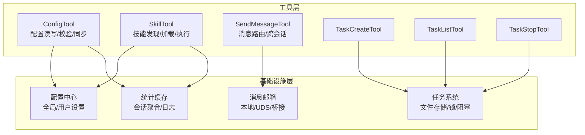
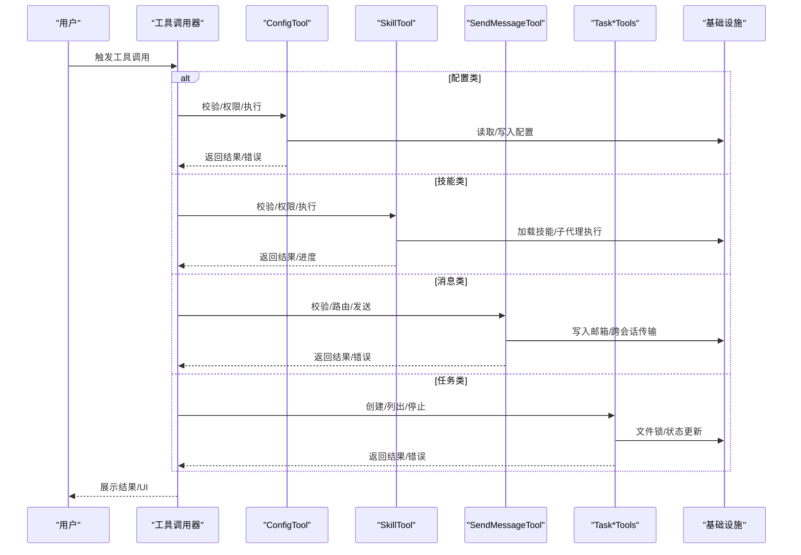
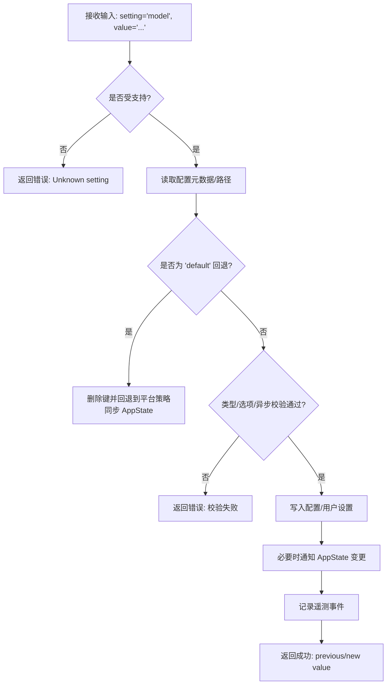
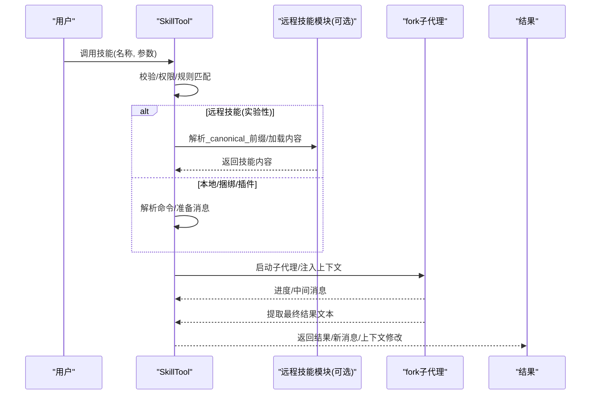
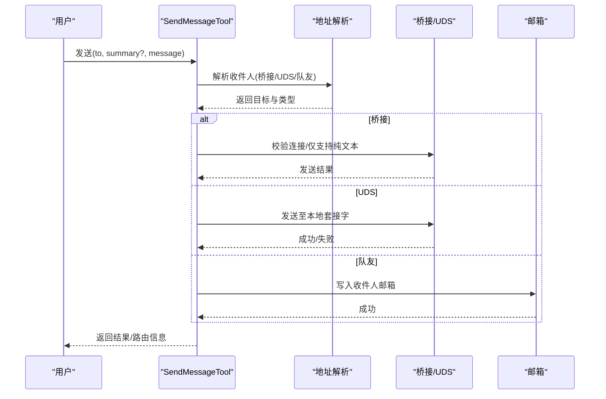
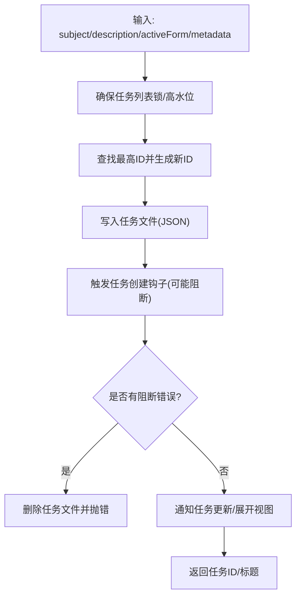
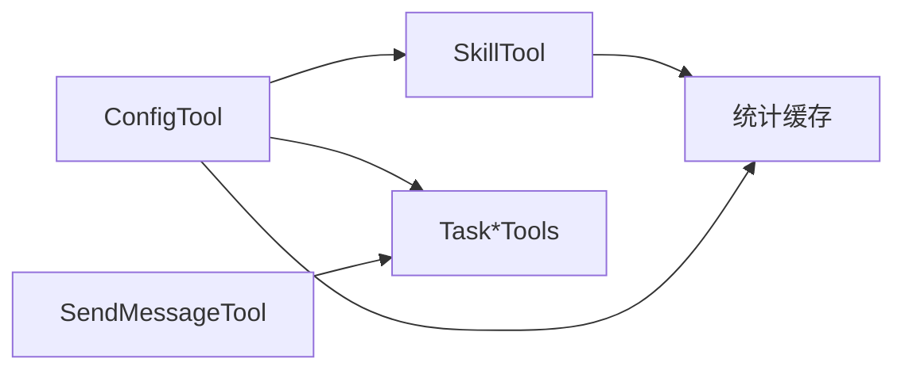

# 系统管理工具

<cite>
**本文引用的文件**
- [tools/ConfigTool/configTool.ts](file://tools/ConfigTool/configTool.ts)
- [tools/ConfigTool/supportedSettings.ts](file://tools/ConfigTool/supportedSettings.ts)
- [tools/SkillTool/skillTool.ts](file://tools/SkillTool/skillTool.ts)
- [tools/SkillTool/prompt.ts](file://tools/SkillTool/prompt.ts)
- [tools/SendMessageTool/sendMessageTool.ts](file://tools/SendMessageTool/sendMessageTool.ts)
- [tools/SendMessageTool/prompt.ts](file://tools/SendMessageTool/prompt.ts)
- [tools/TaskCreateTool/taskCreateTool.ts](file://tools/TaskCreateTool/taskCreateTool.ts)
- [tools/TaskListTool/taskListTool.ts](file://tools/TaskListTool/taskListTool.ts)
- [tools/TaskStopTool/taskStopTool.ts](file://tools/TaskStopTool/taskStopTool.ts)
- [utils/tasks.ts](file://utils/tasks.ts)
- [utils/stats.ts](file://utils/stats.ts)
</cite>

## 目录
1. [简介](#简介)
2. [项目结构](#项目结构)
3. [核心组件](#核心组件)
4. [架构总览](#架构总览)
5. [详细组件分析](#详细组件分析)
6. [依赖关系分析](#依赖关系分析)
7. [性能考量](#性能考量)
8. [故障排除指南](#故障排除指南)
9. [结论](#结论)
10. [附录](#附录)

## 简介
本文件面向系统管理员与高级用户，系统性梳理并说明以下系统管理工具：ConfigTool（配置管理）、SkillTool（技能管理）、Task*Tools（任务管理系列）与 SendMessageTool（消息发送）。文档覆盖功能边界、输入输出规范、权限与安全控制、配置项校验与格式化、技能加载与执行机制、任务调度与状态持久化、消息路由与跨会话通信、系统状态监控与性能指标采集、告警与维护建议，以及常见运维场景的操作流程。

## 项目结构
系统管理工具围绕“工具定义 + 工具实现 + 配置/任务/消息基础设施”组织：
- 工具层：每个工具以独立模块实现，遵循统一的工具接口与生命周期（输入校验、权限检查、调用执行、结果映射、UI 渲染）。
- 基础设施层：配置中心（全局/用户设置）、任务列表（文件持久化、并发锁、阻塞关系）、消息邮箱（本地/跨会话）、统计与缓存（会话统计、磁盘缓存）。
- 协同层：工具间通过 AppState 上下文、权限规则、消息邮箱、任务状态相互影响与协作。

图示来源
- [tools/ConfigTool/configTool.ts:67-434](file://tools/ConfigTool/configTool.ts#L67-L434)
- [tools/SkillTool/skillTool.ts:331-800](file://tools/SkillTool/skillTool.ts#L331-L800)
- [tools/SendMessageTool/sendMessageTool.ts:520-800](file://tools/SendMessageTool/sendMessageTool.ts#L520-L800)
- [tools/TaskCreateTool/taskCreateTool.ts:48-139](file://tools/TaskCreateTool/taskCreateTool.ts#L48-L139)
- [tools/TaskListTool/taskListTool.ts:33-117](file://tools/TaskListTool/taskListTool.ts#L33-L117)
- [tools/TaskStopTool/taskStopTool.ts:39-132](file://tools/TaskStopTool/taskStopTool.ts#L39-L132)
- [utils/tasks.ts:199-241](file://utils/tasks.ts#L199-L241)
- [utils/stats.ts:640-710](file://utils/stats.ts#L640-L710)

章节来源
- [tools/ConfigTool/configTool.ts:67-434](file://tools/ConfigTool/configTool.ts#L67-L434)
- [tools/SkillTool/skillTool.ts:331-800](file://tools/SkillTool/skillTool.ts#L331-L800)
- [tools/SendMessageTool/sendMessageTool.ts:520-800](file://tools/SendMessageTool/sendMessageTool.ts#L520-L800)
- [tools/TaskCreateTool/taskCreateTool.ts:48-139](file://tools/TaskCreateTool/taskCreateTool.ts#L48-L139)
- [tools/TaskListTool/taskListTool.ts:33-117](file://tools/TaskListTool/taskListTool.ts#L33-L117)
- [tools/TaskStopTool/taskStopTool.ts:39-132](file://tools/TaskStopTool/taskStopTool.ts#L39-L132)
- [utils/tasks.ts:199-241](file://utils/tasks.ts#L199-L241)
- [utils/stats.ts:640-710](file://utils/stats.ts#L640-L710)

## 核心组件
- ConfigTool：统一的配置读取/设置入口，支持类型校验、选项约束、异步验证、格式化显示、即时 UI 同步、语音模式前置检查与权限提示。
- SkillTool：技能发现与执行，支持内置/捆绑/插件/远程技能，fork 子代理隔离执行，权限规则匹配，遥测记录，进度回传。
- SendMessageTool：团队内消息、广播、跨会话（UDS/桥接）消息、计划审批与关机请求/响应协议处理。
- Task*Tools：任务创建、列出、停止，基于文件系统的高水位标记与锁保证并发一致性，支持阻塞关系与状态迁移。
- 统计与监控：会话统计聚合、每日活动/模型用量、热力图、峰值时段、连击天数、推测节省时长等指标，带缓存与增量更新。

章节来源
- [tools/ConfigTool/configTool.ts:67-434](file://tools/ConfigTool/configTool.ts#L67-L434)
- [tools/SkillTool/skillTool.ts:331-800](file://tools/SkillTool/skillTool.ts#L331-L800)
- [tools/SendMessageTool/sendMessageTool.ts:520-800](file://tools/SendMessageTool/sendMessageTool.ts#L520-L800)
- [tools/TaskCreateTool/taskCreateTool.ts:48-139](file://tools/TaskCreateTool/taskCreateTool.ts#L48-L139)
- [tools/TaskListTool/taskListTool.ts:33-117](file://tools/TaskListTool/taskListTool.ts#L33-L117)
- [tools/TaskStopTool/taskStopTool.ts:39-132](file://tools/TaskStopTool/taskStopTool.ts#L39-L132)
- [utils/stats.ts:640-710](file://utils/stats.ts#L640-L710)

## 架构总览
系统管理工具通过统一的工具框架构建，围绕“输入校验 → 权限决策 → 执行 → 结果映射 → UI/状态更新”的闭环工作流运行。配置与技能通过集中式配置表与命令注册表驱动；任务通过文件系统持久化与锁保障一致性；消息通过邮箱与路由协议在进程内/跨会话传递。

图示来源
- [tools/ConfigTool/configTool.ts:111-411](file://tools/ConfigTool/configTool.ts#L111-L411)
- [tools/SkillTool/skillTool.ts:580-760](file://tools/SkillTool/skillTool.ts#L580-L760)
- [tools/SendMessageTool/sendMessageTool.ts:741-798](file://tools/SendMessageTool/sendMessageTool.ts#L741-L798)
- [tools/TaskCreateTool/taskCreateTool.ts:80-129](file://tools/TaskCreateTool/taskCreateTool.ts#L80-L129)
- [utils/tasks.ts:284-308](file://utils/tasks.ts#L284-L308)

## 详细组件分析

### ConfigTool 配置管理
- 功能要点
  - 支持读取与设置多种配置键，包括主题、编辑器模式、通知通道、自动压缩/记忆、终端进度条、模型、思考模式、权限默认模式、语言、队友模式、语音开关、远程控制启动策略、推送通知等。
  - 输入校验：类型强制（布尔/字符串）、选项枚举、异步验证（如模型有效性）、字符串到布尔的宽松转换。
  - 运行时特性门控：语音模式需鉴权与设备可用性检查；远程控制键支持“default”回退到平台策略。
  - 写入路径：全局配置写入全局配置对象；用户设置写入用户设置目录；必要时触发 AppState 同步与变更通知。
  - 输出映射：将成功/失败、前值/新值、错误信息映射为工具结果块。
- 安全与权限
  - 读取免审；写入需要权限弹窗确认或自动允许（如仅读取场景）。
- 典型流程（设置模型）

图示来源
- [tools/ConfigTool/configTool.ts:111-411](file://tools/ConfigTool/configTool.ts#L111-L411)
- [tools/ConfigTool/supportedSettings.ts:29-186](file://tools/ConfigTool/supportedSettings.ts#L29-L186)

章节来源
- [tools/ConfigTool/configTool.ts:67-434](file://tools/ConfigTool/configTool.ts#L67-L434)
- [tools/ConfigTool/supportedSettings.ts:15-212](file://tools/ConfigTool/supportedSettings.ts#L15-L212)

### SkillTool 技能管理
- 功能要点
  - 技能发现：合并本地/捆绑/插件/远程 MCP 技能，去重后提供给模型选择。
  - 执行模式：内联直接扩展对话；fork 子代理隔离执行，支持进度回传与结果提取。
  - 权限控制：基于规则的显式允许/拒绝；对“仅安全属性”的技能自动放行；支持添加规则建议。
  - 遥测：记录调用上下文、来源、查询深度、父代理、插件来源等。
  - 参数与校验：去除前导斜杠兼容；禁止禁用模型调用的技能；非 prompt 类型拒绝。
- 典型流程（fork 执行）

图示来源
- [tools/SkillTool/skillTool.ts:580-760](file://tools/SkillTool/skillTool.ts#L580-L760)
- [tools/SkillTool/prompt.ts:173-196](file://tools/SkillTool/prompt.ts#L173-L196)

章节来源
- [tools/SkillTool/skillTool.ts:331-800](file://tools/SkillTool/skillTool.ts#L331-L800)
- [tools/SkillTool/prompt.ts:1-242](file://tools/SkillTool/prompt.ts#L1-L242)

### SendMessageTool 消息发送
- 功能要点
  - 收件人解析：支持队友名、广播、UDS 本地套接字、桥接跨机器会话。
  - 消息类型：纯文本摘要必填；结构化消息（关机请求/响应、计划审批）按协议处理。
  - 路由与校验：UDS/桥接地址合法性、摘要必填、跨会话仅支持纯文本、连接状态检查、权限弹窗（桥接）。
  - 协议处理：关机请求/批准/拒绝；计划审批请求/批准/拒绝；向邮箱写入并触发相应动作。
- 典型流程（跨会话发送）

图示来源
- [tools/SendMessageTool/sendMessageTool.ts:741-798](file://tools/SendMessageTool/sendMessageTool.ts#L741-L798)
- [tools/SendMessageTool/prompt.ts:5-49](file://tools/SendMessageTool/prompt.ts#L5-L49)

章节来源
- [tools/SendMessageTool/sendMessageTool.ts:520-800](file://tools/SendMessageTool/sendMessageTool.ts#L520-L800)
- [tools/SendMessageTool/prompt.ts:1-50](file://tools/SendMessageTool/prompt.ts#L1-L50)

### Task*Tools 任务管理
- 功能要点
  - TaskCreateTool：创建任务，写入文件并触发任务创建钩子；失败则回滚；自动展开任务视图。
  - TaskListTool：列出任务，过滤内部任务，计算阻塞关系（仅保留未完成的阻塞者）。
  - TaskStopTool：校验任务存在且处于运行中，调用停止逻辑并返回任务信息。
  - 并发与一致性：任务列表级锁与任务文件锁，防止竞态；高水位标记避免 ID 重复。
  - 任务状态：pending/in_progress/completed；支持 owner、blocks、blockedBy、metadata。
- 典型流程（创建任务）

图示来源
- [tools/TaskCreateTool/taskCreateTool.ts:80-129](file://tools/TaskCreateTool/taskCreateTool.ts#L80-L129)
- [utils/tasks.ts:284-308](file://utils/tasks.ts#L284-L308)

章节来源
- [tools/TaskCreateTool/taskCreateTool.ts:48-139](file://tools/TaskCreateTool/taskCreateTool.ts#L48-L139)
- [tools/TaskListTool/taskListTool.ts:33-117](file://tools/TaskListTool/taskListTool.ts#L33-L117)
- [tools/TaskStopTool/taskStopTool.ts:39-132](file://tools/TaskStopTool/taskStopTool.ts#L39-L132)
- [utils/tasks.ts:199-241](file://utils/tasks.ts#L199-L241)

## 依赖关系分析
- 工具间耦合
  - SkillTool 与 ConfigTool：技能执行可能受模型/思考模式等配置影响；ConfigTool 的语音开关会影响 SkillTool 的前置检查。
  - SendMessageTool 与 Task*Tools：消息可用于计划审批/关机请求，Task*Tools 的状态变化影响团队可见性。
  - Task*Tools 与 ConfigTool：任务功能开关（如 TODO V2）受配置控制。
- 外部依赖
  - 文件系统：任务持久化、统计缓存、会话日志。
  - 运行时特性门：语音模式、远程控制、UDS、Kairos 推送等。
  - 权限系统：规则匹配、自动放行/弹窗策略。

图示来源
- [tools/ConfigTool/configTool.ts:383-389](file://tools/ConfigTool/configTool.ts#L383-L389)
- [tools/SkillTool/skillTool.ts:152-203](file://tools/SkillTool/skillTool.ts#L152-L203)
- [utils/stats.ts:640-710](file://utils/stats.ts#L640-L710)

章节来源
- [tools/ConfigTool/configTool.ts:67-434](file://tools/ConfigTool/configTool.ts#L67-L434)
- [tools/SkillTool/skillTool.ts:331-800](file://tools/SkillTool/skillTool.ts#L331-L800)
- [tools/SendMessageTool/sendMessageTool.ts:520-800](file://tools/SendMessageTool/sendMessageTool.ts#L520-L800)
- [tools/TaskCreateTool/taskCreateTool.ts:48-139](file://tools/TaskCreateTool/taskCreateTool.ts#L48-L139)
- [utils/tasks.ts:199-241](file://utils/tasks.ts#L199-L241)
- [utils/stats.ts:640-710](file://utils/stats.ts#L640-L710)

## 性能考量
- 统计聚合
  - 会话文件扫描采用分批并行处理，避免大文件全量读取；缓存上次计算日期，增量处理新数据；今日数据实时处理。
  - 日常活动、模型用量、小时分布、连击天数等指标在缓存基础上合并当日统计，减少重复计算。
- 任务系统
  - 列表级锁与文件级锁双重保护，重试退避策略降低竞争冲突；高水位标记避免 ID 回绕。
- 技能列表预算
  - 技能描述长度按上下文预算动态裁剪，优先保留捆绑技能完整描述，其余按可用空间截断，平衡展示与令牌开销。

章节来源
- [utils/stats.ts:117-184](file://utils/stats.ts#L117-L184)
- [utils/stats.ts:440-478](file://utils/stats.ts#L440-L478)
- [utils/tasks.ts:102-108](file://utils/tasks.ts#L102-L108)
- [utils/tasks.ts:504-523](file://utils/tasks.ts#L504-L523)
- [tools/SkillTool/prompt.ts:31-41](file://tools/SkillTool/prompt.ts#L31-L41)
- [tools/SkillTool/prompt.ts:70-171](file://tools/SkillTool/prompt.ts#L70-L171)

## 故障排除指南
- 配置设置失败
  - 现象：设置某配置键报错。
  - 排查：确认键是否受支持；检查类型/选项；查看异步校验（如模型有效性）；检查语音模式前置条件（鉴权、麦克风权限、依赖工具）。
  - 处理：修正输入类型/值；满足前置条件；必要时使用“default”回退。
- 技能无法执行
  - 现象：技能名称未知、被禁用、非 prompt 类型。
  - 排查：确认技能名（支持去除前导斜杠）；检查 disable-model-invocation；确认来自 MCP 的 prompt 技能。
  - 处理：修正技能名；调整权限规则；使用允许的技能。
- 消息发送异常
  - 现象：跨会话发送失败、摘要缺失、权限未授权。
  - 排查：UDS/桥接地址合法性；摘要必填；桥接仅支持纯文本；检查连接状态。
  - 处理：补齐摘要；确认连接；接受权限弹窗。
- 任务创建失败
  - 现象：创建后立即回滚。
  - 排查：任务创建钩子阻断错误；并发冲突导致锁失败。
  - 处理：修复钩子逻辑；重试；检查磁盘权限。
- 任务停止无效
  - 现象：提示任务不存在或不在运行中。
  - 排查：核对任务 ID；确认任务状态。
  - 处理：使用正确的 ID；等待任务进入运行态后再停止。

章节来源
- [tools/ConfigTool/configTool.ts:111-411](file://tools/ConfigTool/configTool.ts#L111-L411)
- [tools/SkillTool/skillTool.ts:354-430](file://tools/SkillTool/skillTool.ts#L354-L430)
- [tools/SendMessageTool/sendMessageTool.ts:604-718](file://tools/SendMessageTool/sendMessageTool.ts#L604-L718)
- [tools/TaskCreateTool/taskCreateTool.ts:92-113](file://tools/TaskCreateTool/taskCreateTool.ts#L92-L113)
- [tools/TaskStopTool/taskStopTool.ts:60-91](file://tools/TaskStopTool/taskStopTool.ts#L60-L91)

## 结论
本系统管理工具体系以统一框架实现配置、技能、任务与消息的闭环管理，结合严格的输入校验、权限控制、并发一致性与可观测性，既满足日常运维需求，又具备良好的扩展性与安全性。通过统计与缓存机制，系统能够持续优化用户体验并为运营决策提供数据支撑。

## 附录

### 系统状态监控与性能指标
- 指标类别
  - 活动概览：总会话数、消息数、活跃天数、总天数、最长会话。
  - 连击与高峰：当前/最长连击周期、起止日期、峰值活跃日与小时。
  - 模型用量：按模型聚合的输入/输出/缓存令牌、成本估算、上下文窗口与最大输出令牌。
  - 会话统计：每日活动（会话数/消息数/工具调用数）、每日模型令牌分布。
  - 推测节省：因推测接受节省的总时长。
  - 射击率（实验性）：单次/多次射击会话分布与一次射击率。
- 数据来源与更新
  - 会话日志（主会话与子代理）解析；缓存上次计算日期，增量处理昨日与今日数据；历史数据合并缓存。
- 使用建议
  - 定期查看“最近7/30天/全部”范围统计，关注模型用量趋势与峰值时段，优化资源与成本。

章节来源
- [utils/stats.ts:53-87](file://utils/stats.ts#L53-L87)
- [utils/stats.ts:640-710](file://utils/stats.ts#L640-L710)
- [utils/stats.ts:718-743](file://utils/stats.ts#L718-L743)

### 安全加固与访问控制策略
- 权限规则
  - 显式允许/拒绝：基于规则内容精确匹配或前缀匹配；对“仅安全属性”的技能自动放行。
  - 自动放行：内置/捆绑/官方市场技能在特定条件下自动放行。
  - 弹窗确认：跨机器桥接消息、敏感配置写入等需用户明确同意。
- 配置安全
  - 语音模式写入前进行鉴权与设备可用性检查；麦克风权限缺失时引导用户开启。
  - 远程控制启动策略支持“default”，避免硬编码风险。
- 消息安全
  - 跨会话仅支持纯文本；结构化消息仅限本地/桥接协议内的特定类型；连接状态实时校验。
- 最佳实践
  - 为常用技能建立允许规则；定期审查拒绝规则；对跨机器桥接消息保持谨慎。

章节来源
- [tools/SkillTool/skillTool.ts:432-578](file://tools/SkillTool/skillTool.ts#L432-L578)
- [tools/ConfigTool/configTool.ts:231-308](file://tools/ConfigTool/configTool.ts#L231-L308)
- [tools/SendMessageTool/sendMessageTool.ts:585-602](file://tools/SendMessageTool/sendMessageTool.ts#L585-L602)

### 实际运维案例
- 配置更新
  - 场景：将模型从默认切换为指定模型，并启用“总是思考”。
  - 步骤：使用 ConfigTool 设置 model 与 alwaysThinkingEnabled；若失败，先校验模型有效性与权限；必要时使用“default”回退。
  - 验证：读取当前值确认生效；观察 UI 与日志中的遥测事件。
- 技能安装
  - 场景：安装插件市场技能后，希望自动允许该技能。
  - 步骤：在 SkillTool 中调用技能；若提示权限，根据建议添加允许规则；或使用自动放行策略。
  - 验证：再次调用技能无需弹窗。
- 任务清理
  - 场景：清理已完成任务并释放阻塞关系。
  - 步骤：列出任务，识别已完成；使用 TaskListTool 过滤阻塞；必要时手动解除阻塞；删除不再需要的任务。
  - 验证：任务列表为空或仅剩未完成任务。
- 关闭/重启
  - 场景：团队成员申请关机，负责人审批。
  - 步骤：发起方发送关机请求；负责人收到消息后发送批准/拒绝；被请求方根据结果退出或继续工作。
  - 验证：被请求方进程退出或继续运行。

章节来源
- [tools/ConfigTool/configTool.ts:111-411](file://tools/ConfigTool/configTool.ts#L111-L411)
- [tools/SkillTool/skillTool.ts:580-760](file://tools/SkillTool/skillTool.ts#L580-L760)
- [tools/TaskListTool/taskListTool.ts:65-90](file://tools/TaskListTool/taskListTool.ts#L65-L90)
- [tools/SendMessageTool/sendMessageTool.ts:268-432](file://tools/SendMessageTool/sendMessageTool.ts#L268-L432)