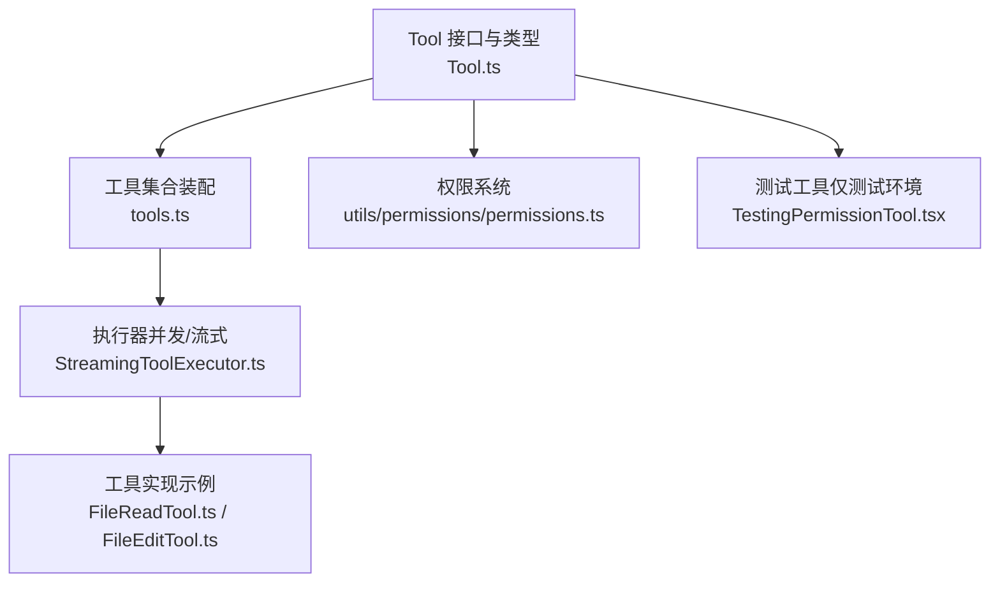
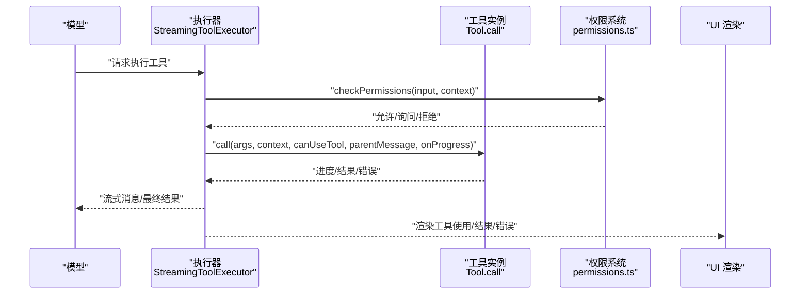
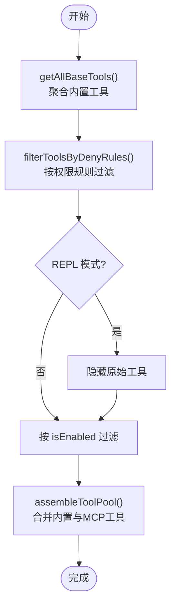
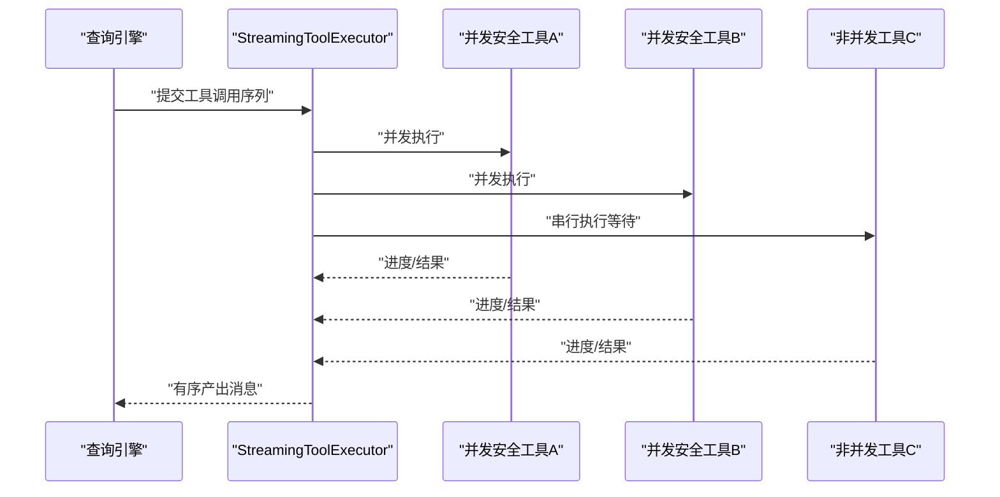
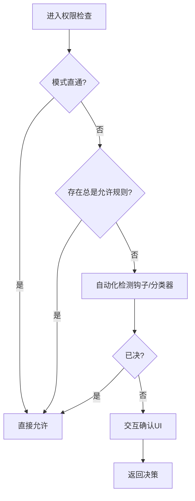
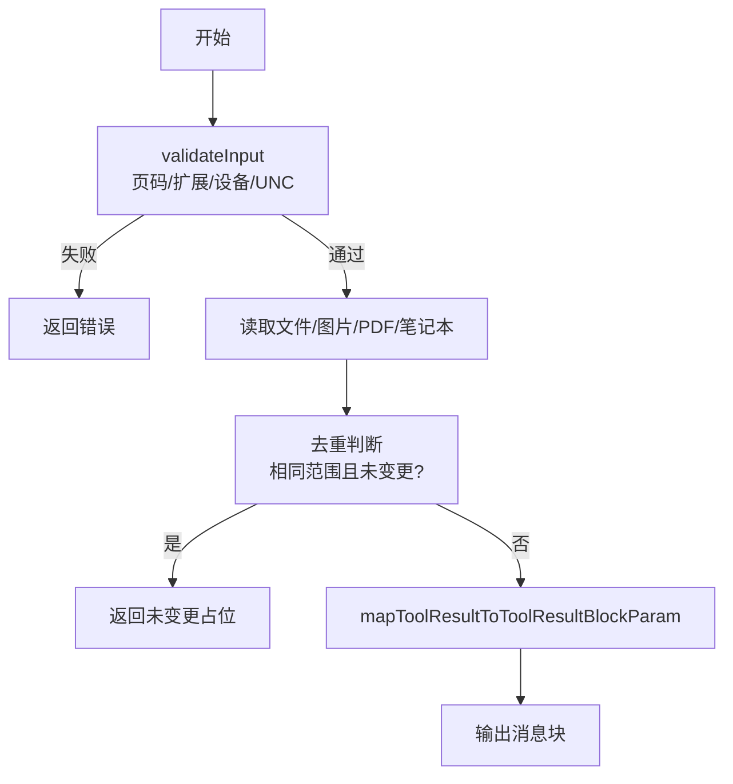
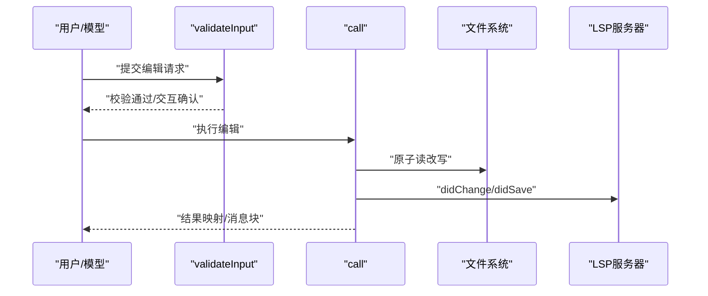
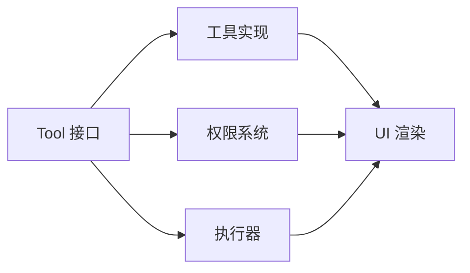

# 自定义工具开发

<cite>
**本文引用的文件**
- [Tool.ts](file://Tool.ts)
- [tools.ts](file://tools.ts)
- [FileReadTool.ts](file://tools/FileReadTool/FileReadTool.ts)
- [FileEditTool.ts](file://tools/FileEditTool/FileEditTool.ts)
- [permissions.ts](file://utils/permissions/permissions.ts)
- [StreamingToolExecutor.ts](file://services/tools/StreamingToolExecutor.ts)
- [TestingPermissionTool.tsx](file://tools/testing/TestingPermissionTool.tsx)
- [perfettoTracing.ts](file://utils/telemetry/perfettoTracing.ts)
- [queryProfiler.ts](file://utils/queryProfiler.ts)
</cite>

## 目录
1. [简介](#简介)
2. [项目结构](#项目结构)
3. [核心组件](#核心组件)
4. [架构总览](#架构总览)
5. [详细组件分析](#详细组件分析)
6. [依赖关系分析](#依赖关系分析)
7. [性能考量](#性能考量)
8. [故障排查指南](#故障排查指南)
9. [结论](#结论)
10. [附录](#附录)

## 简介
本指南面向希望在本项目中开发自定义工具的工程师与高级用户。文档围绕 Tool 接口设计、工具类继承结构与生命周期管理、工具注册机制、权限检查流程、执行上下文与结果处理进行系统化阐述，并提供从简单文本处理到复杂系统集成的完整开发示例路径、最佳实践、安全与性能优化策略、测试与调试方法以及发布流程。

## 项目结构
工具系统由“接口定义 + 工具集合装配 + 执行器 + 权限与UI”四部分组成：
- 接口与类型：统一的 Tool 定义、工具上下文、权限上下文、进度与结果模型
- 工具集合：集中装配内置工具、过滤与去重、合并 MCP 工具
- 执行器：并发安全控制、流式进度与结果收集、中断与取消
- 权限与UI：权限决策、提示消息、UI渲染钩子与工具可视化



图表来源
- [Tool.ts:1-793](file://Tool.ts#L1-L793)
- [tools.ts:1-390](file://tools.ts#L1-L390)
- [StreamingToolExecutor.ts:34-530](file://services/tools/StreamingToolExecutor.ts#L34-L530)
- [permissions.ts:1-200](file://utils/permissions/permissions.ts#L1-L200)
- [FileReadTool.ts:1-800](file://tools/FileReadTool/FileReadTool.ts#L1-L800)
- [FileEditTool.ts:1-626](file://tools/FileEditTool/FileEditTool.ts#L1-L626)
- [TestingPermissionTool.tsx:1-74](file://tools/testing/TestingPermissionTool.tsx#L1-L74)

章节来源
- [Tool.ts:1-793](file://Tool.ts#L1-L793)
- [tools.ts:1-390](file://tools.ts#L1-L390)

## 核心组件
- Tool 接口与默认行为
  - 统一的工具签名：call(args, context, canUseTool, parentMessage, onProgress)
  - 输入/输出模式：输入使用 Zod 模式或 JSON Schema；输出通过 mapToolResultToToolResultBlockParam 映射为消息块
  - 可选能力：并发安全、只读/破坏性、搜索/读取命令识别、透明包装器、摘要与活动描述、自动分类器输入等
  - 构建器 buildTool：填充常用默认值，确保安全基线
- 工具集合装配
  - getAllBaseTools：按环境特性动态聚合内置工具
  - getTools / assembleToolPool / getMergedTools：基于权限上下文过滤、去重、合并 MCP 工具
- 执行器 StreamingToolExecutor
  - 并发安全：非并发工具串行，其他工具可并行
  - 流式进度：即时产出 progress 与结果消息
  - 中断与取消：支持 Bash 等工具失败时级联终止兄弟进程
- 权限系统
  - 权限模式与规则：允许/拒绝/询问、CLI/设置/会话来源
  - 决策链：模式直通、规则匹配、自动化检测（分类器/钩子）、交互确认
  - UI 提示：根据决策原因生成可读消息

章节来源
- [Tool.ts:362-695](file://Tool.ts#L362-L695)
- [Tool.ts:783-792](file://Tool.ts#L783-L792)
- [tools.ts:193-390](file://tools.ts#L193-L390)
- [StreamingToolExecutor.ts:40-530](file://services/tools/StreamingToolExecutor.ts#L40-L530)
- [permissions.ts:122-206](file://utils/permissions/permissions.ts#L122-L206)

## 架构总览
工具调用从“模型选择工具”到“权限决策”，再到“执行器调度”，最后“映射为消息块返回”。下图展示关键交互：



图表来源
- [StreamingToolExecutor.ts:34-530](file://services/tools/StreamingToolExecutor.ts#L34-L530)
- [permissions.ts:1262-1297](file://utils/permissions/permissions.ts#L1262-L1297)
- [Tool.ts:379-385](file://Tool.ts#L379-L385)

## 详细组件分析

### Tool 接口与生命周期
- 关键职责
  - 输入校验 validateInput：纯参数校验，避免 IO；返回验证结果与错误码
  - 权限检查 checkPermissions：结合工具特定规则与全局权限上下文
  - 执行 call：实际业务逻辑，支持进度回调 onProgress
  - 结果映射 mapToolResultToToolResultBlockParam：标准化为消息块
  - UI 渲染：renderToolUseMessage / renderToolResultMessage / renderToolUseErrorMessage / renderToolUseRejectedMessage
  - 元数据：并发安全、只读/破坏性、搜索/读取识别、摘要与活动描述
- 默认行为 buildTool
  - 失败闭合的安全默认：并发不安全、写操作、需要权限确认、自动分类器输入为空
  - 通过构建器统一注入 userFacingName 等

```mermaid
classDiagram
class Tool {
+name : string
+aliases? : string[]
+searchHint? : string
+inputSchema
+outputSchema?
+isEnabled() : boolean
+isConcurrencySafe(input) : boolean
+isReadOnly(input) : boolean
+isDestructive?(input) : boolean
+isSearchOrReadCommand?(input) : {...}
+isOpenWorld?(input) : boolean
+interruptBehavior?() : "cancel"|"block"
+shouldDefer? : boolean
+alwaysLoad? : boolean
+mcpInfo? : {serverName, toolName}
+maxResultSizeChars : number
+strict? : boolean
+backfillObservableInput?(input)
+validateInput?(input, context)
+checkPermissions(input, context)
+getPath?(input) : string
+preparePermissionMatcher?(input)
+prompt(...)
+userFacingName(input?)
+userFacingNameBackgroundColor?(input?)
+isTransparentWrapper?() : boolean
+getToolUseSummary?(input?)
+getActivityDescription?(input?)
+toAutoClassifierInput(input)
+mapToolResultToToolResultBlockParam(content, toolUseID)
+renderToolUseMessage(input, options)
+renderToolResultMessage?(content, progress, options)
+extractSearchText?(out)
+renderToolUseProgressMessage?(msgs, options)
+renderToolUseQueuedMessage?()
+renderToolUseRejectedMessage?(input, options)
+renderToolUseErrorMessage?(result, options)
+renderGroupedToolUse?(toolUses, options)
}
class ToolDef {
<<partial>>
}
ToolDef --> Tool : "buildTool 填充默认"
```

图表来源
- [Tool.ts:362-695](file://Tool.ts#L362-L695)
- [Tool.ts:783-792](file://Tool.ts#L783-L792)

章节来源
- [Tool.ts:362-695](file://Tool.ts#L362-L695)
- [Tool.ts:743-774](file://Tool.ts#L743-L774)

### 工具集合装配与注册
- 装配策略
  - getAllBaseTools：按环境特性聚合内置工具，避免不必要的 IO
  - getTools：应用权限规则过滤、REPL 模式隐藏原始工具、按 isEnabled 过滤
  - assembleToolPool：合并内置与 MCP 工具，保持内置前缀连续以稳定缓存键
  - getMergedTools：用于需要包含 MCP 的场景（如工具搜索阈值计算）
- 注册机制
  - 通过集中导出与条件 require 实现模块化注册，避免循环依赖
  - 支持按功能开关（feature flags）启用/禁用工具



图表来源
- [tools.ts:193-390](file://tools.ts#L193-L390)

章节来源
- [tools.ts:193-390](file://tools.ts#L193-L390)

### 执行上下文与并发控制
- 上下文 ToolUseContext
  - 包含命令集、调试/详细模式、思考配置、MCP 客户端与资源、文件读取状态、应用状态存取、通知与系统消息追加、进度回调、查询跟踪、内容替换预算等
- 并发与流式执行
  - StreamingToolExecutor：区分并发安全工具与非并发工具；非并发工具串行执行；支持进度即时产出与结果有序回传
  - Bash 等工具失败时，级联终止兄弟进程，避免无效开销
  - 支持丢弃未决与进行中的工具队列（流式回退）



图表来源
- [StreamingToolExecutor.ts:40-530](file://services/tools/StreamingToolExecutor.ts#L40-L530)

章节来源
- [Tool.ts:158-300](file://Tool.ts#L158-L300)
- [StreamingToolExecutor.ts:40-530](file://services/tools/StreamingToolExecutor.ts#L40-L530)

### 权限检查流程
- 决策链
  - 模式直通：bypassPermissions 或 plan 模式且允许绕过
  - 规则匹配：alwaysAllowRules / alwaysDenyRules
  - 自动化检测：钩子与分类器（可选），协调员模式下顺序等待
  - 交互确认：ask 行为触发 UI 对话框
- UI 提示
  - 根据决策原因生成可读消息，支持子命令拆分说明



图表来源
- [permissions.ts:1262-1297](file://utils/permissions/permissions.ts#L1262-L1297)
- [permissions.ts:137-206](file://utils/permissions/permissions.ts#L137-L206)

章节来源
- [permissions.ts:1262-1297](file://utils/permissions/permissions.ts#L1262-L1297)
- [permissions.ts:137-206](file://utils/permissions/permissions.ts#L137-L206)

### 工具实现示例

#### 示例一：只读文件读取工具（FileReadTool）
- 设计要点
  - 只读、并发安全、严格模式、自动分类器输入为文件路径
  - 输入校验：页码范围、二进制扩展名、设备文件阻断、UNC 路径安全
  - 输出类型：文本/图片/笔记本/PDF/部分提取/未变更文件
  - UI：摘要、活动描述、搜索文本抽取为空（避免索引）
  - 结果映射：按类型映射为消息块（图片、笔记本、PDF 元数据、未变更提示）
- 性能优化
  - 文件读取去重：相同范围且未修改的文件直接返回“未变更”占位
  - 令牌限制：按类型估算与 API 计数双重校验，超限抛错
  - 技能发现：按路径异步发现技能目录，非阻塞加载



图表来源
- [FileReadTool.ts:418-495](file://tools/FileReadTool/FileReadTool.ts#L418-L495)
- [FileReadTool.ts:594-718](file://tools/FileReadTool/FileReadTool.ts#L594-L718)

章节来源
- [FileReadTool.ts:337-718](file://tools/FileReadTool/FileReadTool.ts#L337-L718)

#### 示例二：文件编辑工具（FileEditTool）
- 设计要点
  - 破坏性、非并发安全、严格模式、自动分类器输入为“路径:新内容”
  - 输入校验：旧字符串存在性、多处匹配需 replace_all、大小限制、UNC 路径安全、笔记本文件引导
  - 执行 call：原子读改写、更新 LSP、记录历史、计算差异、更新 readFileState
  - UI：摘要、活动描述、拒绝/错误消息
  - 结果映射：成功/全部替换提示
- 安全与一致性
  - 读取后时间戳校验，防止并发修改导致覆盖
  - 替换前后引号风格保留，提升可读性



图表来源
- [FileEditTool.ts:137-362](file://tools/FileEditTool/FileEditTool.ts#L137-L362)
- [FileEditTool.ts:387-595](file://tools/FileEditTool/FileEditTool.ts#L387-L595)

章节来源
- [FileEditTool.ts:86-595](file://tools/FileEditTool/FileEditTool.ts#L86-L595)

#### 示例三：测试专用权限工具（TestingPermissionTool）
- 设计要点
  - 仅测试环境可用，强制弹出权限对话框
  - 无副作用，便于端到端测试

章节来源
- [TestingPermissionTool.tsx:12-73](file://tools/testing/TestingPermissionTool.tsx#L12-L73)

## 依赖关系分析
- 组件耦合
  - Tool 接口与工具实现解耦：通过构建器注入默认行为，降低重复实现
  - 工具集合与权限系统解耦：通过权限上下文过滤，避免工具内部感知权限
  - 执行器与工具实现解耦：通过统一的 call/onProgress/mapToolResult 接口
- 外部依赖
  - 权限系统依赖分类器与钩子（可选），通过 feature 开关控制
  - UI 渲染依赖主题与工具元数据（名称、颜色、摘要）



图表来源
- [Tool.ts:362-695](file://Tool.ts#L362-L695)
- [permissions.ts:1-200](file://utils/permissions/permissions.ts#L1-200)
- [StreamingToolExecutor.ts:40-530](file://services/tools/StreamingToolExecutor.ts#L40-L530)

章节来源
- [Tool.ts:362-695](file://Tool.ts#L362-L695)
- [permissions.ts:1-200](file://utils/permissions/permissions.ts#L1-200)
- [StreamingToolExecutor.ts:40-530](file://services/tools/StreamingToolExecutor.ts#L40-L530)

## 性能考量
- 工具侧
  - FileReadTool：去重命中率显著减少重复传输；令牌估算与 API 计数双重校验，避免超大输出
  - FileEditTool：原子读改写、LSP 通知、差异计算，保证一致性与可观测性
- 执行器侧
  - StreamingToolExecutor：并发安全与有序回传，Bash 错误级联终止兄弟进程，避免无效开销
- 可观测性
  - Perfetto 跟踪：startToolPerfettoSpan/endToolPerfettoSpan 记录工具执行耗时、结果令牌与错误
  - 查询剖析：queryProfiler 汇总各阶段耗时，定位瓶颈

章节来源
- [FileReadTool.ts:536-573](file://tools/FileReadTool/FileReadTool.ts#L536-L573)
- [FileEditTool.ts:425-544](file://tools/FileEditTool/FileEditTool.ts#L425-L544)
- [StreamingToolExecutor.ts:354-396](file://services/tools/StreamingToolExecutor.ts#L354-L396)
- [perfettoTracing.ts:690-763](file://utils/telemetry/perfettoTracing.ts#L690-L763)
- [queryProfiler.ts:216-262](file://utils/queryProfiler.ts#L216-L262)

## 故障排查指南
- 权限相关
  - 检查权限模式与规则：bypassPermissions、alwaysAllowRules、alwaysDenyRules
  - 子命令拆分：Bash 工具可能拆分为多个子命令，逐个审批
- 工具执行
  - 非并发工具阻塞：确认是否被其他非并发工具占用
  - Bash 失败级联：查看兄弟进程是否被终止
- UI 与消息
  - 检查 renderToolUseErrorMessage / renderToolUseRejectedMessage 是否正确覆盖
  - 使用 TestingPermissionTool 在测试环境强制弹窗，验证权限链路

章节来源
- [permissions.ts:1262-1297](file://utils/permissions/permissions.ts#L1262-L1297)
- [StreamingToolExecutor.ts:354-396](file://services/tools/StreamingToolExecutor.ts#L354-L396)
- [TestingPermissionTool.tsx:36-42](file://tools/testing/TestingPermissionTool.tsx#L36-L42)

## 结论
本项目的工具体系以 Tool 接口为核心，通过构建器默认安全基线、权限系统与执行器并发控制，形成“可扩展、可审计、可观察”的工具生态。开发者应遵循“严格输入校验、最小权限原则、并发安全优先、清晰 UI 呈现”的原则，结合示例工具的实现模式快速落地自定义工具。

## 附录

### 最佳实践清单
- 输入校验优先：在 validateInput 中完成所有纯参数校验，避免 IO
- 并发安全：非共享状态工具尽量标记为并发安全，提升吞吐
- 权限最小化：默认 checkPermissions 返回 ask，必要时提供明确理由
- UI 友好：提供摘要、活动描述、拒绝/错误消息，提升可读性
- 结果映射：统一 mapToolResultToToolResultBlockParam，避免 UI 与模型层混杂

### 安全考虑
- 设备文件阻断：禁止 /dev/zero、/dev/random 等
- UNC 路径：Windows UNC 可能触发认证，先走权限检查再 IO
- 二进制文件：默认拒绝，图片/PDF 特殊处理
- 团队内存敏感：编辑时校验是否引入机密

章节来源
- [FileReadTool.ts:117-128](file://tools/FileReadTool/FileReadTool.ts#L117-L128)
- [FileReadTool.ts:463-492](file://tools/FileReadTool/FileReadTool.ts#L463-L492)
- [FileEditTool.ts:143-147](file://tools/FileEditTool/FileEditTool.ts#L143-L147)
- [FileEditTool.ts:176-181](file://tools/FileEditTool/FileEditTool.ts#L176-L181)

### 性能优化策略
- 工具内：去重、令牌估算、限制最大结果尺寸
- 执行器：并发安全、有序回传、失败级联终止
- 可观测性：工具级 Span 与查询剖析，定位热点阶段

章节来源
- [FileReadTool.ts:536-573](file://tools/FileReadTool/FileReadTool.ts#L536-L573)
- [StreamingToolExecutor.ts:354-396](file://services/tools/StreamingToolExecutor.ts#L354-L396)
- [perfettoTracing.ts:690-763](file://utils/telemetry/perfettoTracing.ts#L690-L763)
- [queryProfiler.ts:216-262](file://utils/queryProfiler.ts#L216-L262)

### 测试与调试
- 单元测试：围绕 validateInput、checkPermissions、call 的边界条件
- 集成测试：使用 TestingPermissionTool 强制弹窗，验证权限链路
- 调试技巧：开启 verbose 模式、使用 onProgress 查看中间状态、利用 UI 标签与摘要定位问题

章节来源
- [TestingPermissionTool.tsx:12-73](file://tools/testing/TestingPermissionTool.tsx#L12-L73)
- [Tool.ts:379-385](file://Tool.ts#L379-L385)

### 发布流程建议
- 功能开关：通过 feature flags 控制工具可见性与行为
- 权限规则：在设置/CLI 中预置 allow/deny 规则，避免硬编码
- 文档与 UI：完善 userFacingName、searchHint、prompt 与 UI 渲染，确保用户可理解

章节来源
- [tools.ts:104-135](file://tools.ts#L104-L135)
- [Tool.ts:362-473](file://Tool.ts#L362-L473)