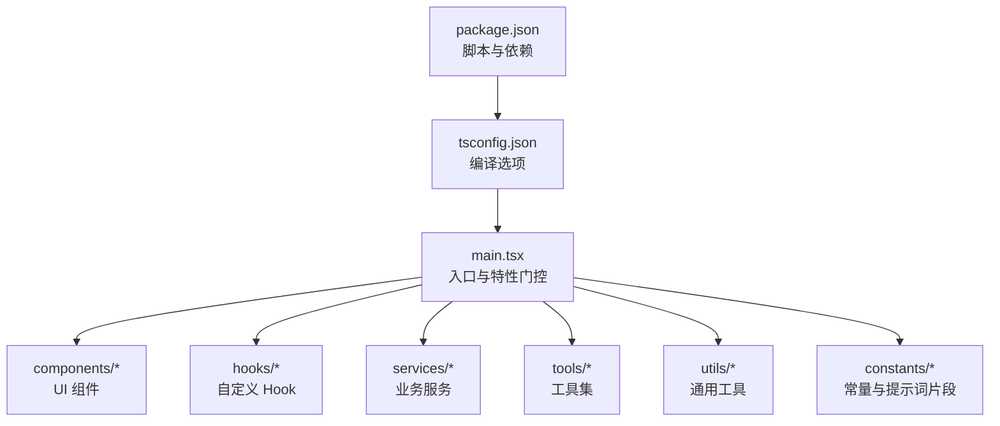
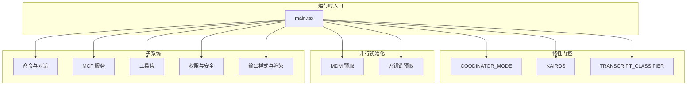
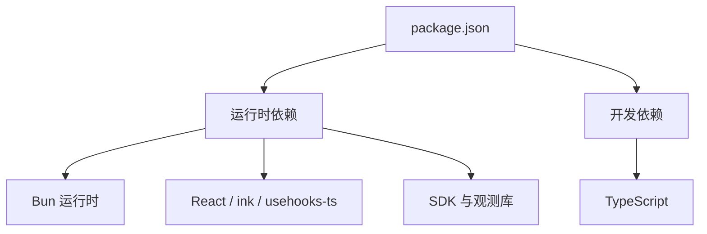

# 代码规范与风格

<cite>
**本文引用的文件**
- [package.json](file://package.json)
- [tsconfig.json](file://tsconfig.json)
- [main.tsx](file://main.tsx)
- [README.md](file://README.md)
- [utils/frontmatterParser.ts](file://utils/frontmatterParser.ts)
- [constants/outputStyles.ts](file://constants/outputStyles.ts)
- [services/mcp/config.ts](file://services/mcp/config.ts)
- [utils/claudemd.ts](file://utils/claudemd.ts)
- [utils/settings/permissionValidation.ts](file://utils/settings/permissionValidation.ts)
- [utils/generatedFiles.ts](file://utils/generatedFiles.ts)
- [tools/FileEditTool/utils.ts](file://tools/FileEditTool/utils.ts)
- [outputStyles/loadOutputStylesDir.ts](file://outputStyles/loadOutputStylesDir.ts)
- [utils/markdown.ts](file://utils/markdown.ts)
</cite>

## 目录
1. [引言](#引言)
2. [项目结构](#项目结构)
3. [核心组件](#核心组件)
4. [架构总览](#架构总览)
5. [详细组件分析](#详细组件分析)
6. [依赖分析](#依赖分析)
7. [性能考虑](#性能考虑)
8. [故障排查指南](#故障排查指南)
9. [结论](#结论)
10. [附录](#附录)

## 引言
本规范旨在为 Claude Code 项目建立统一的 TypeScript 编码标准、命名约定、文件组织结构与风格指南，覆盖代码格式化（Prettier 配置）、静态分析（ESLint 规则）、组件开发规范、Hook 使用最佳实践、类型定义标准、注释规范、错误处理模式与性能优化原则。文档同时提供正反例对比与图示，帮助团队在大型仓库中保持一致性与可维护性。

## 项目结构
- 语言与构建：使用 TypeScript（目标 ESNext），打包器为 Bun，脚本包含构建与类型检查。
- 入口与运行时：入口文件负责并行预取、特性门控与模块懒加载，体现性能优先与按需加载策略。
- 模块划分：按功能域拆分目录（如 bridge、assistant、services、tools 等），组件与 Hook 分层清晰，便于维护与测试。

**图表来源**
- [package.json:1-113](file://package.json#L1-L113)
- [tsconfig.json:1-29](file://tsconfig.json#L1-L29)
- [main.tsx:1-200](file://main.tsx#L1-L200)

**章节来源**
- [package.json:1-113](file://package.json#L1-L113)
- [tsconfig.json:1-29](file://tsconfig.json#L1-L29)
- [main.tsx:1-200](file://main.tsx#L1-L200)

## 核心组件
- 构建与类型检查
  - 使用 Bun 构建，开启 React 编译时优化别名；提供开发与生产构建脚本；类型检查通过 tsc 实现。
- 特性门控与死码消除
  - 通过 Bun 的 feature() 常量折叠与条件 require 实现编译期门控，外部构建自动移除未启用分支。
- 并行初始化与启动性能
  - 入口文件对系统读取、密钥链预取等进行并行初始化，减少冷启动时间。
- 文件与路径处理
  - 统一使用安全解析与路径规范化，避免路径遍历与权限绕过风险。
- 权限与安全
  - 工具调用前进行风险分级与权限校验，支持自动批准、交互式确认与受保护文件保护。
- 输出样式与前端渲染
  - 输出样式由 Markdown 前言元数据驱动，支持强制插件样式与用户设置回退。

**章节来源**
- [package.json:6-10](file://package.json#L6-L10)
- [main.tsx:11-20](file://main.tsx#L11-L20)
- [main.tsx:74-81](file://main.tsx#L74-L81)
- [utils/claudemd.ts:724-752](file://utils/claudemd.ts#L724-L752)
- [utils/settings/permissionValidation.ts:183-239](file://utils/settings/permissionValidation.ts#L183-L239)
- [constants/outputStyles.ts:181-216](file://constants/outputStyles.ts#L181-L216)

## 架构总览
下图展示入口模块如何通过特性门控、并行初始化与懒加载组织核心子系统，形成高内聚、低耦合的模块化架构。

**图表来源**
- [main.tsx:74-81](file://main.tsx#L74-L81)
- [main.tsx:11-20](file://main.tsx#L11-L20)
- [main.tsx:168-193](file://main.tsx#L168-L193)

## 详细组件分析

### TypeScript 编码标准与命名约定
- 目标与模块
  - 目标版本：ESNext；模块系统：ESNext；解析器：bundler；启用 JSX：react-jsx。
- 类型严格性
  - 严格模式关闭，允许导入 TS 扩展、允许 JS、JSON 模块解析、跳过库检查、不生成输出。
- 路径映射
  - 使用 baseUrl 与 paths，简化相对路径引用。
- 命名建议
  - 变量与函数：采用小驼峰；类与接口：采用大驼峰；常量：全大写蛇形或帕斯卡；文件名：与导出实体一致，组件以 .tsx 结尾。
  - 类型别名：优先使用字面量联合与工具类型，避免冗余包装。
  - 导出：明确默认导出与具名导出，保持一致性。

**章节来源**
- [tsconfig.json:2-18](file://tsconfig.json#L2-L18)

### 文件组织结构
- 功能域导向
  - components：UI 组件与设计系统；
  - hooks：自定义 Hook；
  - services：业务服务（API、分析、MCP、权限等）；
  - tools：工具集（文件操作、终端、网络、技能等）；
  - utils：通用工具（路径、解析、缓存、日志等）；
  - constants：系统提示词片段、键值、输出样式等。
- 入口与引导
  - main.tsx 作为应用入口，集中特性门控与并行初始化逻辑。

**章节来源**
- [main.tsx:1-200](file://main.tsx#L1-L200)

### 组件开发规范
- 组件职责单一
  - 将复杂 UI 拆分为多个小组件，通过 props 明确输入与行为。
- 状态管理
  - 将状态提升至最近公共父组件，必要时使用上下文或状态容器。
- 渲染优化
  - 使用 React.memo、useMemo、useCallback 缓解重渲染；避免在渲染期间执行昂贵计算。
- 事件与副作用
  - 在 useEffect 中处理副作用，确保清理函数正确释放资源；避免在渲染阶段产生副作用。

### Hook 使用最佳实践
- 自定义 Hook
  - 以 use 开头；仅在顶层调用；不传递 DOM 节点；返回稳定对象或数组。
- 性能
  - 对依赖数组进行最小化；对昂贵计算使用 useMemo/useCallback；避免在 Hook 内部创建新函数导致重渲染。
- 错误边界
  - 在需要时使用错误边界捕获异常，避免影响全局。

### 类型定义标准
- 接口与类型
  - 优先使用接口描述对象结构；使用类型别名表达联合与交叉；尽量使用只读类型。
- 泛型
  - 仅在必要时引入泛型；保持泛型参数名称简洁且语义明确。
- 不可变性
  - 优先使用不可变更新策略；对数组与对象使用浅拷贝或不可变库。

### 注释规范
- 函数与方法
  - 使用 JSDoc 注释说明参数、返回值、异常与注意事项；对复杂算法提供步骤说明。
- 复杂逻辑
  - 对分支与边界条件添加注释；对安全相关逻辑强调风险控制。
- 常量与配置
  - 对关键常量与配置项添加注释，说明来源与用途。

### 错误处理模式
- 统一错误捕获
  - 在关键流程中捕获异常并记录诊断信息；对外暴露用户可理解的错误消息。
- 安全容错
  - 对文件系统与路径操作进行健壮性检查；对权限与策略进行前置校验。
- 日志与追踪
  - 区分调试日志与错误日志；避免在日志中泄露敏感信息。

### 性能优化原则
- 启动性能
  - 并行初始化系统读取与密钥链；延迟加载非关键模块；利用特性门控移除未使用代码。
- 渲染性能
  - 控制组件层级深度；使用虚拟滚动与懒加载；避免不必要的重渲染。
- I/O 与网络
  - 合理使用缓存与节流；对批量操作进行合并；对网络请求设置超时与重试。

### 代码示例与反例对比
- 示例：特性门控与死码消除
  - 正例：通过 feature() 与条件 require 实现编译期门控，外部构建自动移除未启用分支。
  - 反例：在运行时 if 判断所有分支，导致未使用代码仍被包含。
- 示例：并行初始化
  - 正例：入口文件对 MDM 与密钥链进行并行预取，缩短启动时间。
  - 反例：串行初始化导致启动阻塞。
- 示例：路径安全
  - 正例：统一使用安全解析与路径规范化，避免路径遍历与权限绕过。
  - 反例：直接拼接用户输入路径，存在注入风险。
- 示例：权限校验
  - 正例：工具调用前进行风险分级与权限校验，支持自动批准与交互式确认。
  - 反例：未做权限校验直接执行高风险操作。

**章节来源**
- [main.tsx:74-81](file://main.tsx#L74-L81)
- [main.tsx:11-20](file://main.tsx#L11-L20)
- [utils/claudemd.ts:724-752](file://utils/claudemd.ts#L724-L752)
- [utils/settings/permissionValidation.ts:183-239](file://utils/settings/permissionValidation.ts#L183-L239)

## 依赖分析
- 构建与运行时
  - Bun 作为打包器与运行时；React 用于 UI；ink 用于终端渲染；usehooks-ts 提供常用 Hook。
- 第三方 SDK
  - Anthropic SDK、AWS SDK、Azure Identity、OpenTelemetry 等，按需引入。
- 类型与工具
  - TypeScript、@types/* 与各类工具库，保证类型安全与开发体验。

**图表来源**
- [package.json:11-111](file://package.json#L11-L111)

**章节来源**
- [package.json:11-111](file://package.json#L11-L111)

## 性能考虑
- 启动阶段
  - 并行预取与懒加载减少首屏阻塞；特性门控移除未使用代码。
- 渲染阶段
  - 控制组件层级与重渲染频率；对长列表使用虚拟化；对高频交互使用防抖/节流。
- I/O 与网络
  - 合理缓存与批处理；对网络请求设置超时与指数退避；避免在主线程执行耗时任务。

## 故障排查指南
- 路径与文件访问
  - 使用安全解析与路径规范化，避免权限绕过与路径遍历；对不存在或无权限的路径进行容错处理。
- 权限与策略
  - 在工具调用前进行风险分级与权限校验；对受保护文件与路径进行拦截。
- 输出样式与渲染
  - 通过 Markdown 前言元数据与用户设置控制输出样式；对不支持的语言降级处理。
- 日志与诊断
  - 使用调试日志区分问题范围；避免在日志中泄露敏感信息；对异常进行结构化记录。

**章节来源**
- [utils/claudemd.ts:724-752](file://utils/claudemd.ts#L724-L752)
- [utils/settings/permissionValidation.ts:183-239](file://utils/settings/permissionValidation.ts#L183-L239)
- [outputStyles/loadOutputStylesDir.ts:34-62](file://outputStyles/loadOutputStylesDir.ts#L34-L62)
- [utils/markdown.ts:49-94](file://utils/markdown.ts#L49-L94)

## 结论
本规范从编码标准、命名约定、文件组织、格式化与静态分析、组件与 Hook 最佳实践、类型定义、注释、错误处理与性能优化等方面，为 Claude Code 项目提供了系统化的指导。建议团队在日常开发中遵循上述规范，并结合实际场景持续优化，以确保代码质量与可维护性。

## 附录
- 术语表
  - 特性门控：通过编译期常量折叠与条件加载实现的功能开关。
  - 死码消除：构建时移除未使用的代码分支，减小包体积。
  - 并行初始化：在启动阶段并行执行多个异步任务，缩短启动时间。
- 参考资料
  - 项目 README 对内部系统、特性门控与安全机制的说明，有助于理解整体架构与设计意图。

**章节来源**
- [README.md:389-414](file://README.md#L389-L414)