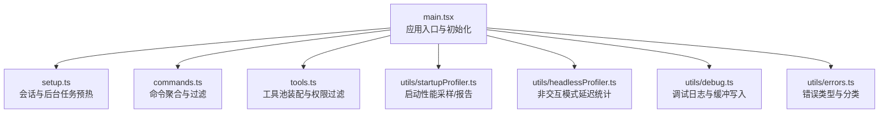
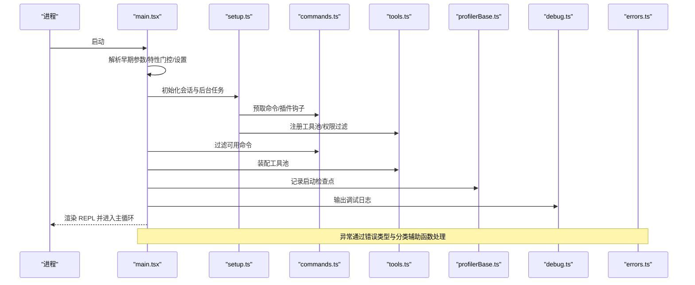
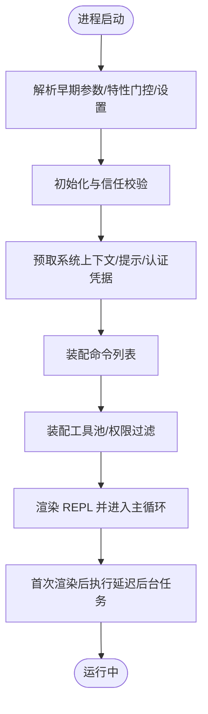
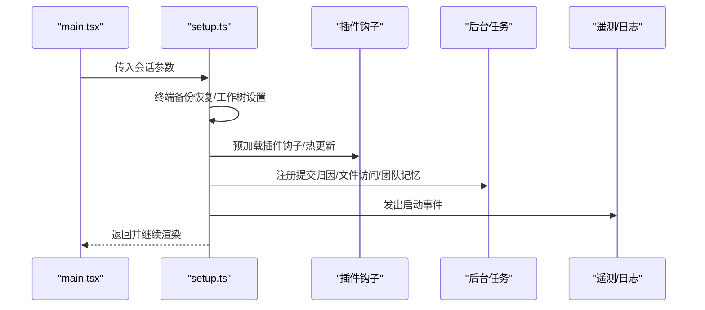
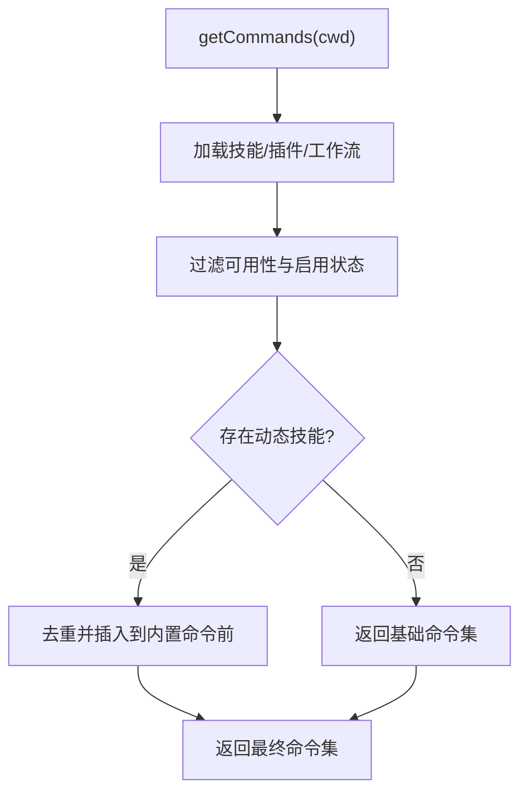
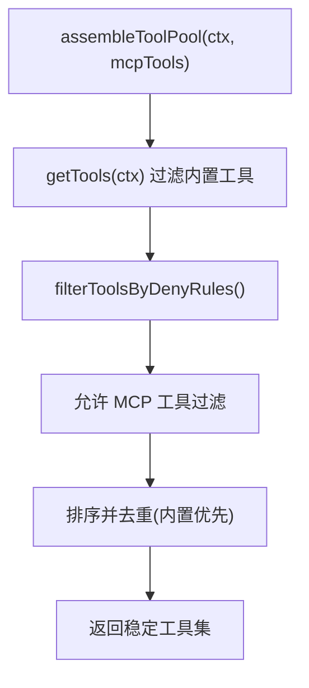
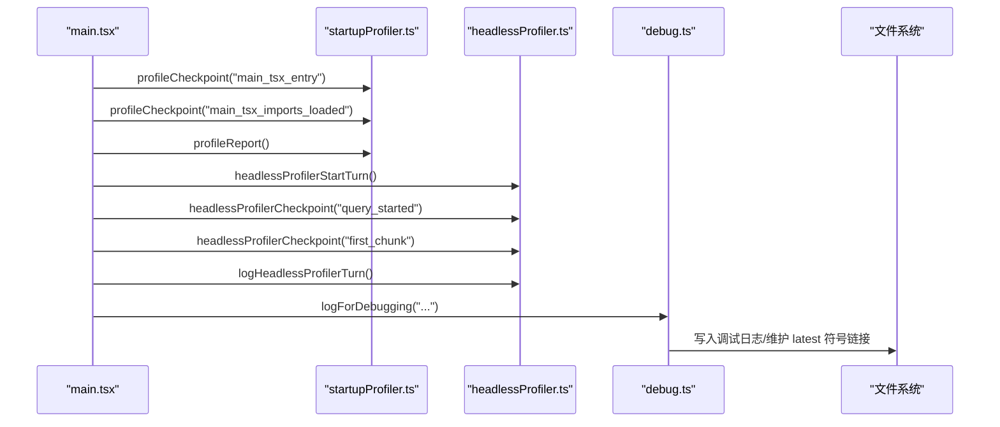
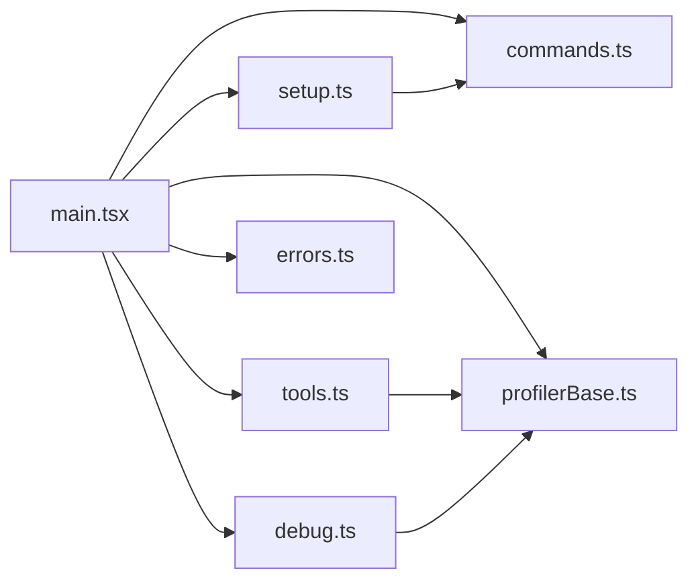

# 开发指南

<cite>
**本文引用的文件**   
- [README.md](file://README.md)
- [main.tsx](file://main.tsx)
- [setup.ts](file://setup.ts)
- [commands.ts](file://commands.ts)
- [tools.ts](file://tools.ts)
- [utils/startupProfiler.ts](file://utils/startupProfiler.ts)
- [utils/profilerBase.ts](file://utils/profilerBase.ts)
- [utils/headlessProfiler.ts](file://utils/headlessProfiler.ts)
- [utils/debug.ts](file://utils/debug.ts)
- [utils/errors.ts](file://utils/errors.ts)
</cite>

## 目录
1. [简介](#简介)
2. [项目结构](#项目结构)
3. [核心组件](#核心组件)
4. [架构总览](#架构总览)
5. [详细组件分析](#详细组件分析)
6. [依赖关系分析](#依赖关系分析)
7. [性能考量](#性能考量)
8. [故障排除指南](#故障排除指南)
9. [结论](#结论)
10. [附录](#附录)

## 简介
本指南面向希望在 Claude Code 项目上进行开发与贡献的工程师，覆盖开发环境搭建、代码结构理解、贡献流程、代码规范、测试策略、调试技巧、构建与发布、性能优化与 Profiling、代码评审标准、架构演进与设计决策，以及常见问题排查与社区参与方式。  
项目基于 Bun 运行时与 TypeScript，采用模块化分层设计（入口、命令系统、工具系统、服务层、UI 渲染等），并通过编译期特征门控（feature flags）实现内外部能力隔离与按需裁剪。

## 项目结构
- 入口与启动
  - 入口：main.tsx 负责初始化、参数解析、权限校验、特性门控加载、命令注册与渲染。
  - 启动流程：setup.ts 在交互式会话中执行工作树、消息通道、插件钩子、遥测等后台任务的预热与注册。
- 命令系统
  - commands.ts 统一聚合内置命令、技能、插件技能、工作流命令，并根据可用性与启用状态动态过滤。
- 工具系统
  - tools.ts 定义并装配工具池，支持内置工具与 MCP 工具合并、权限规则过滤、REPL 模式隐藏原始工具等。
- 性能与调试
  - 启动性能：utils/startupProfiler.ts 提供采样与详细报告；utils/profilerBase.ts 提供通用格式化与时间线；utils/headlessProfiler.ts 针对非交互模式的 TTFT/首包延迟统计。
  - 调试日志：utils/debug.ts 支持多源开关、过滤器、输出到文件或 stderr、缓冲写入与符号链接追踪最新日志。
  - 错误体系：utils/errors.ts 提供统一错误类型与分类辅助函数，便于安全地记录与上报。
- 其他关键目录
  - bridge/、cli/、remote/、services/、hooks/、utils/ 等按职责划分清晰，体现高内聚低耦合的设计。

图示来源
- [main.tsx:585-800](file://main.tsx#L585-L800)
- [setup.ts:56-120](file://setup.ts#L56-L120)
- [commands.ts:258-346](file://commands.ts#L258-L346)
- [tools.ts:193-251](file://tools.ts#L193-L251)
- [utils/startupProfiler.ts:65-149](file://utils/startupProfiler.ts#L65-L149)
- [utils/headlessProfiler.ts:62-97](file://utils/headlessProfiler.ts#L62-L97)
- [utils/debug.ts:203-228](file://utils/debug.ts#L203-L228)
- [utils/errors.ts:3-101](file://utils/errors.ts#L3-L101)

章节来源
- [README.md:1-463](file://README.md#L1-L463)
- [main.tsx:585-800](file://main.tsx#L585-L800)
- [setup.ts:56-120](file://setup.ts#L56-L120)
- [commands.ts:258-346](file://commands.ts#L258-L346)
- [tools.ts:193-251](file://tools.ts#L193-L251)
- [utils/startupProfiler.ts:65-149](file://utils/startupProfiler.ts#L65-L149)
- [utils/headlessProfiler.ts:62-97](file://utils/headlessProfiler.ts#L62-L97)
- [utils/debug.ts:203-228](file://utils/debug.ts#L203-L228)
- [utils/errors.ts:3-101](file://utils/errors.ts#L3-L101)

## 核心组件
- 应用入口与控制流
  - 初始化阶段：设置安全环境变量、安装警告处理器、解析早期参数（如 deep link、ssh、assistant）、加载设置与特性门控、迁移配置版本、预取上下文与提示信息。
  - 会话准备：根据是否交互式决定是否跳过信任确认、预取系统上下文、注册插件钩子、启动后台任务（仓库归因、会话文件访问监控、团队记忆同步等）。
  - 命令与工具装配：在渲染前完成命令列表与工具池的最终装配，确保权限规则生效。
- 命令系统
  - 内置命令、技能、插件技能、工作流命令统一聚合，按可用性与启用状态过滤；远程模式下对仅本地命令进行白名单保护。
- 工具系统
  - 支持内置工具与 MCP 工具合并，按权限规则与 REPL 模式进行过滤与去重，保证提示缓存稳定性。
- 性能与调试
  - 启动性能采样与报告、非交互模式延迟统计、调试日志缓冲与落盘、错误类型化与分类辅助。

章节来源
- [main.tsx:585-800](file://main.tsx#L585-L800)
- [setup.ts:56-120](file://setup.ts#L56-L120)
- [commands.ts:476-517](file://commands.ts#L476-L517)
- [tools.ts:345-389](file://tools.ts#L345-L389)
- [utils/startupProfiler.ts:65-149](file://utils/startupProfiler.ts#L65-L149)
- [utils/headlessProfiler.ts:62-97](file://utils/headlessProfiler.ts#L62-L97)
- [utils/debug.ts:203-228](file://utils/debug.ts#L203-L228)
- [utils/errors.ts:3-101](file://utils/errors.ts#L3-L101)

## 架构总览
下图展示了从进程启动到命令执行的关键路径，包括特性门控、命令与工具装配、远程/桥接安全策略、性能采样与调试输出。

图示来源
- [main.tsx:585-800](file://main.tsx#L585-L800)
- [setup.ts:56-120](file://setup.ts#L56-L120)
- [commands.ts:476-517](file://commands.ts#L476-L517)
- [tools.ts:345-389](file://tools.ts#L345-L389)
- [utils/profilerBase.ts:14-47](file://utils/profilerBase.ts#L14-L47)
- [utils/debug.ts:203-228](file://utils/debug.ts#L203-L228)
- [utils/errors.ts:3-101](file://utils/errors.ts#L3-L101)

## 详细组件分析

### 入口与启动流程（main.tsx）
- 关键职责
  - 安全与信任：在外部构建中阻止调试/检查模式；预取系统上下文需满足信任条件。
  - 特性门控：通过 Bun 的 feature() 实现编译期死码消除，按用户类型与环境变量裁剪功能。
  - 设置加载：支持 --settings 与 --setting-sources 的早期解析，避免后续初始化中的重复开销。
  - 延迟预取：在首次渲染后异步执行非关键后台任务，减少冷启动阻塞。
- 典型调用链
  - main() -> early argv 处理 -> 初始化分析与入口点标记 -> 权限模式与安全校验 -> 迁移与设置 -> 预取与渲染 -> 启动延迟任务。

图示来源
- [main.tsx:585-800](file://main.tsx#L585-L800)
- [main.tsx:388-431](file://main.tsx#L388-L431)

章节来源
- [main.tsx:585-800](file://main.tsx#L585-L800)
- [main.tsx:388-431](file://main.tsx#L388-L431)

### 会话与后台任务（setup.ts）
- 关键职责
  - 会话级初始化：终端备份恢复、工作树创建与 tmux 会话管理、项目根目录与原工作目录设定。
  - 插件与钩子：在渲染前完成插件钩子预加载与热更新监听，避免与渲染竞争。
  - 背景任务：提交归因钩子、会话文件访问监控、团队记忆同步等。
  - 安全校验：在 bypass 权限模式下进行沙箱/网络访问限制校验。
- 典型调用链
  - setup() -> 终端备份恢复 -> 工作树/项目根设置 -> 插件钩子与后台任务注册 -> 预取 API 凭据 -> 发出启动事件。

图示来源
- [setup.ts:56-120](file://setup.ts#L56-L120)
- [setup.ts:287-371](file://setup.ts#L287-L371)

章节来源
- [setup.ts:56-120](file://setup.ts#L56-L120)
- [setup.ts:287-371](file://setup.ts#L287-L371)

### 命令系统（commands.ts）
- 关键职责
  - 命令聚合：内置命令、技能、插件技能、工作流命令统一装配。
  - 可用性与启用：按订阅/提供商要求过滤；按特性门控与启用状态动态调整。
  - 远程安全：定义远程/桥接安全命令白名单，保障移动端/网页端输入安全。
- 典型调用链
  - getCommands() -> 加载技能/插件/工作流 -> 过滤可用性与启用 -> 动态技能去重插入 -> 返回最终命令集。

图示来源
- [commands.ts:476-517](file://commands.ts#L476-L517)
- [commands.ts:619-686](file://commands.ts#L619-L686)

章节来源
- [commands.ts:476-517](file://commands.ts#L476-L517)
- [commands.ts:619-686](file://commands.ts#L619-L686)

### 工具系统（tools.ts）
- 关键职责
  - 工具装配：内置工具与 MCP 工具合并，按权限规则与 REPL 模式过滤。
  - 缓存稳定性：排序保持内置工具连续前缀，避免跨分区导致缓存失效。
  - 简化模式：--simple 模式下仅暴露必要工具，协调协调者模式下的任务工具。
- 典型调用链
  - assembleToolPool()/getMergedTools() -> 过滤 deny 规则 -> 去重与排序 -> 返回稳定工具集。

图示来源
- [tools.ts:345-389](file://tools.ts#L345-L389)

章节来源
- [tools.ts:345-389](file://tools.ts#L345-L389)

### 性能与调试（profilerBase.ts、startupProfiler.ts、headlessProfiler.ts、debug.ts）
- 启动性能
  - 采样与报告：按用户类型与随机采样决定是否记录；支持详细报告落盘与 Statsig 上报。
  - 时间线格式化：统一时间戳与内存快照格式，便于对比与定位瓶颈。
- 非交互模式延迟
  - 针对 -p 模式记录 TTFT、查询开始、首包到达等关键节点，支持采样与详细输出。
- 调试日志
  - 支持级别过滤、文件/stderr 输出、缓冲写入、符号链接指向最新日志，便于问题复现与收集。

图示来源
- [utils/startupProfiler.ts:65-149](file://utils/startupProfiler.ts#L65-L149)
- [utils/headlessProfiler.ts:62-97](file://utils/headlessProfiler.ts#L62-L97)
- [utils/debug.ts:203-228](file://utils/debug.ts#L203-L228)

章节来源
- [utils/startupProfiler.ts:65-149](file://utils/startupProfiler.ts#L65-L149)
- [utils/headlessProfiler.ts:62-97](file://utils/headlessProfiler.ts#L62-L97)
- [utils/debug.ts:203-228](file://utils/debug.ts#L203-L228)

### 错误处理（errors.ts）
- 错误类型
  - 统一抽象：Abort/ConfigParse/Shell/Teleport/TelemetrySafe 等，便于区分与处理。
- 分类与提取
  - isAbortError、toError、errorMessage、getErrnoCode、isENOENT、shortErrorStack、isFsInaccessible、classifyAxiosError 等辅助函数，简化错误分支与模型侧输出。

章节来源
- [utils/errors.ts:3-101](file://utils/errors.ts#L3-L101)
- [utils/errors.ts:103-239](file://utils/errors.ts#L103-L239)

## 依赖关系分析
- 模块耦合
  - main.tsx 作为中枢，依赖 commands.ts 与 tools.ts 完成命令与工具装配；setup.ts 为 main.tsx 提供会话与后台任务的前置条件。
  - 性能与调试模块相互独立但共享底层性能计时基础设施（profilerBase.ts）。
- 特性门控
  - 通过 Bun 的 feature() 与环境变量实现编译期死码消除与运行时门控，降低外部构建体积与复杂度。
- 外部依赖
  - 使用 @commander-js/extra-typings、chalk、lodash-es 等库；Bun 的性能钩子与 fs/promises 提供计时与文件操作能力。

图示来源
- [main.tsx:585-800](file://main.tsx#L585-L800)
- [setup.ts:56-120](file://setup.ts#L56-L120)
- [commands.ts:258-346](file://commands.ts#L258-L346)
- [tools.ts:193-251](file://tools.ts#L193-L251)
- [utils/profilerBase.ts:14-47](file://utils/profilerBase.ts#L14-L47)
- [utils/debug.ts:203-228](file://utils/debug.ts#L203-L228)
- [utils/errors.ts:3-101](file://utils/errors.ts#L3-L101)

章节来源
- [main.tsx:585-800](file://main.tsx#L585-L800)
- [setup.ts:56-120](file://setup.ts#L56-L120)
- [commands.ts:258-346](file://commands.ts#L258-L346)
- [tools.ts:193-251](file://tools.ts#L193-L251)
- [utils/profilerBase.ts:14-47](file://utils/profilerBase.ts#L14-L47)
- [utils/debug.ts:203-228](file://utils/debug.ts#L203-L228)
- [utils/errors.ts:3-101](file://utils/errors.ts#L3-L101)

## 性能考量
- 启动性能
  - 使用 utils/startupProfiler.ts 采样记录关键检查点，结合 utils/profilerBase.ts 的统一格式化输出，定位导入、设置、初始化耗时。
  - 在需要时开启 CLAUDE_CODE_PROFILE_STARTUP=1 生成详细报告并落盘，便于回归分析。
- 非交互延迟
  - 针对 -p 模式使用 utils/headlessProfiler.ts 记录 TTFT、查询开始、首包到达等指标，支持采样与详细输出。
- 日志与 I/O
  - utils/debug.ts 采用缓冲写入与符号链接维护最新日志，避免频繁 I/O 影响主循环。
- 优化建议
  - 将非关键后台任务延迟至首次渲染后执行（参见 main.tsx 的 startDeferredPrefetches）。
  - 对工具与命令装配进行缓存（memoize），避免重复磁盘扫描与动态导入。
  - 在远程/桥接场景下严格遵循安全白名单，减少不必要的渲染与网络请求。

章节来源
- [utils/startupProfiler.ts:65-149](file://utils/startupProfiler.ts#L65-L149)
- [utils/headlessProfiler.ts:62-97](file://utils/headlessProfiler.ts#L62-L97)
- [utils/debug.ts:155-196](file://utils/debug.ts#L155-L196)
- [main.tsx:388-431](file://main.tsx#L388-L431)

## 故障排除指南
- 常见问题
  - 调试模式被阻止：外部构建默认禁止调试/检查模式，若需调试请在内部构建或通过命令行参数启用。
  - 权限绕过限制：--dangerously-skip-permissions 仅在特定沙箱且无外网访问的环境下允许，否则会直接退出。
  - 文件系统错误：使用 isFsInaccessible 判断预期的“不存在/无权限”错误，避免误判为异常。
  - Axios 请求错误：使用 classifyAxiosError 快速区分鉴权/超时/网络/HTTP/其他错误类别。
- 排查步骤
  - 启用调试日志：--debug 或 /debug 启用运行时调试；--debug-file 指定输出文件；--debug-to-stderr 输出到标准错误。
  - 查看最新日志：~/.claude/debug/latest 符号链接指向当前会话日志，便于快速收集。
  - 性能分析：设置 CLAUDE_CODE_PROFILE_STARTUP=1 获取详细启动报告；或使用采样模式观察 Statsig 指标。
  - 错误分类：通过 isAbortError、shortErrorStack 等辅助函数快速定位中断原因与最小化堆栈。

章节来源
- [main.tsx:266-271](file://main.tsx#L266-L271)
- [setup.ts:395-442](file://setup.ts#L395-L442)
- [utils/errors.ts:27-33](file://utils/errors.ts#L27-L33)
- [utils/errors.ts:186-195](file://utils/errors.ts#L186-L195)
- [utils/errors.ts:213-239](file://utils/errors.ts#L213-L239)
- [utils/debug.ts:203-228](file://utils/debug.ts#L203-L228)
- [utils/debug.ts:242-253](file://utils/debug.ts#L242-L253)

## 结论
本指南从入口控制流、命令与工具装配、会话后台任务、性能与调试、错误处理五个维度梳理了 Claude Code 的核心实现。通过特性门控与死码消除，项目实现了内外部能力的清晰边界；通过模块化的命令与工具系统，提升了可扩展性与可维护性；通过完善的性能采样与调试机制，保障了可观测性与问题定位效率。建议在开发中遵循本文档的规范与流程，持续关注性能指标与错误分类，确保高质量交付。

## 附录
- 开发环境搭建
  - 运行时：Node.js 18+（入口在 setup.ts 中有版本检查）。
  - 包管理：Bun（项目使用 Bun 的 feature() 与性能钩子）。
  - 建议：在本地启用 --debug 与必要的采样模式，配合调试日志与性能报告进行迭代。
- 贡献流程
  - 新增命令：在 commands/ 下新增命令文件，按需声明 availability 与启用逻辑；在 commands.ts 中注册并加入过滤逻辑。
  - 新增工具：在 tools/ 下新增工具实现，更新 tools.ts 的装配逻辑与权限规则；注意与 REPL 模式的兼容。
  - 特性门控：通过 Bun 的 feature() 与环境变量控制功能开关，确保外部构建体积最小化。
- 代码规范
  - 命名与职责：模块职责单一，命名清晰；错误类型明确，分类辅助函数统一。
  - 性能与可观测性：关键路径打点，采样与详细报告并存；调试日志分级与缓冲写入。
- 测试策略
  - 单元测试：围绕错误分类、命令过滤、工具装配等关键逻辑编写单元测试。
  - 集成测试：模拟远程/桥接场景、权限绕过限制、非交互模式延迟等。
- 发布与打包
  - 构建系统：基于 Bun 的特性门控与死码消除，确保外部构建不包含内部功能。
  - 打包流程：通过 feature() 与环境变量裁剪，结合性能采样与日志落盘，确保产物稳定可测。
- 代码评审标准
  - 正确性：命令/工具装配逻辑正确，权限规则与远程安全白名单完备。
  - 可观测性：关键路径具备采样/详细报告能力，调试日志分级合理。
  - 性能：避免阻塞主线程的 I/O 与计算，延迟非关键任务，缓存昂贵操作。
  - 安全：严格限制权限绕过场景，确保沙箱与网络访问约束生效。

章节来源
- [setup.ts:69-79](file://setup.ts#L69-L79)
- [commands.ts:476-517](file://commands.ts#L476-L517)
- [tools.ts:345-389](file://tools.ts#L345-L389)
- [utils/startupProfiler.ts:65-149](file://utils/startupProfiler.ts#L65-L149)
- [utils/debug.ts:203-228](file://utils/debug.ts#L203-L228)
- [utils/errors.ts:3-101](file://utils/errors.ts#L3-L101)