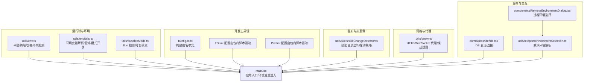
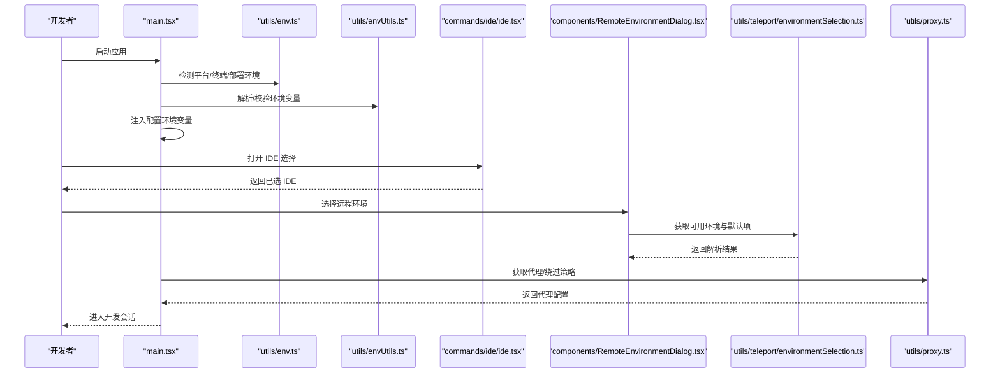
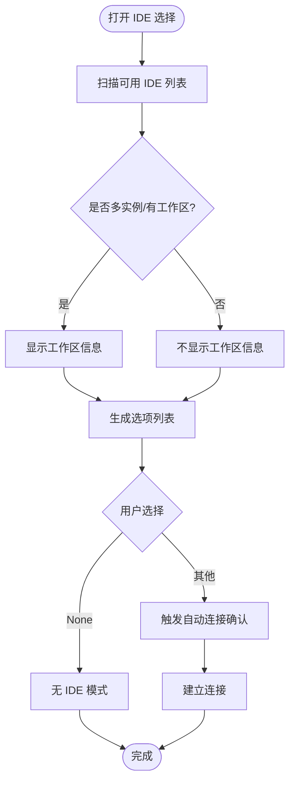
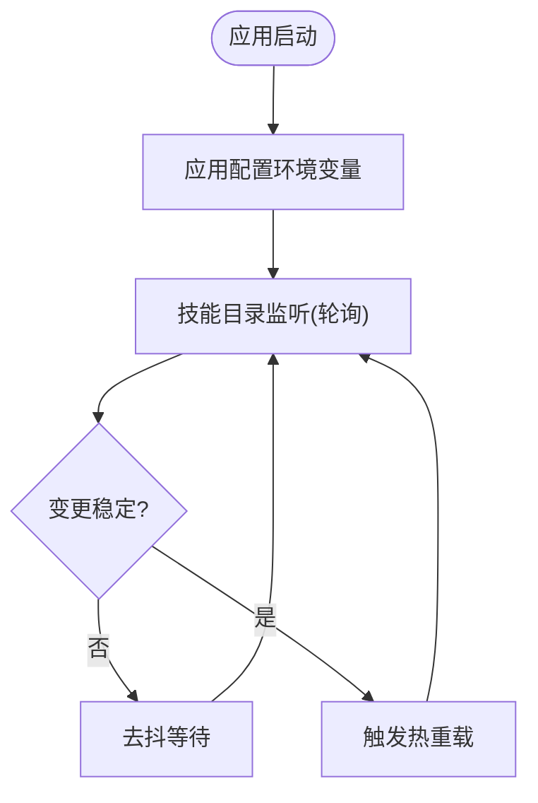
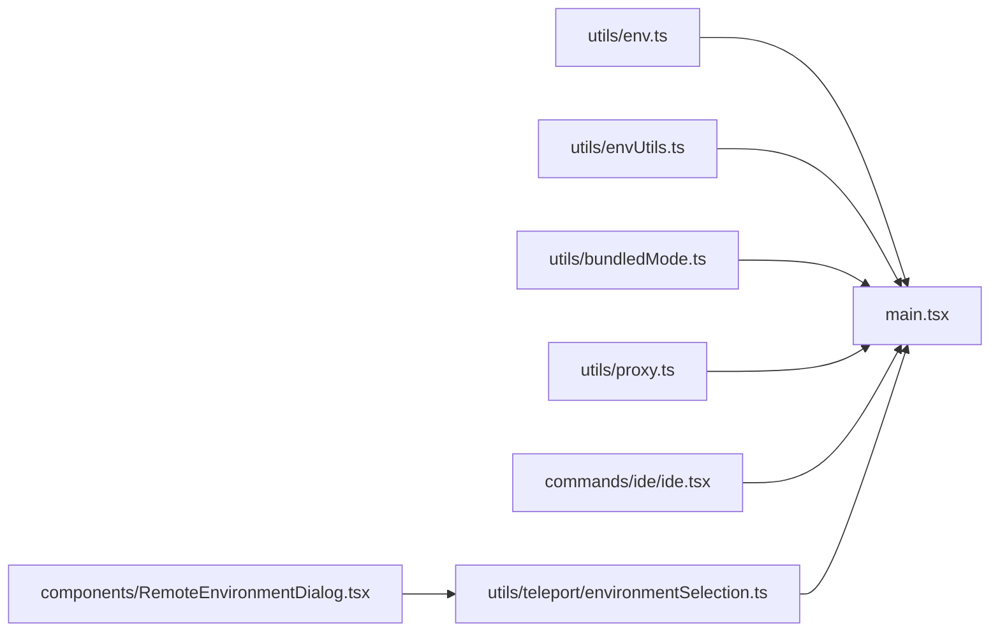

# 开发环境搭建

<cite>
**本文引用的文件**   
- [README.md](file://README.md)
- [bunfig.toml](file://bunfig.toml)
- [utils/env.ts](file://utils/env.ts)
- [utils/envUtils.ts](file://utils/envUtils.ts)
- [utils/bundledMode.ts](file://utils/bundledMode.ts)
- [utils/skills/skillChangeDetector.ts](file://utils/skills/skillChangeDetector.ts)
- [utils/proxy.ts](file://utils/proxy.ts)
- [utils/bash/ShellSnapshot.ts](file://utils/bash/ShellSnapshot.ts)
- [services/mcp/envExpansion.ts](file://services/mcp/envExpansion.ts)
- [commands/ide/ide.tsx](file://commands/ide/ide.tsx)
- [components/RemoteEnvironmentDialog.tsx](file://components/RemoteEnvironmentDialog.tsx)
- [utils/teleport/environmentSelection.ts](file://utils/teleport/environmentSelection.ts)
- [main.tsx](file://main.tsx)
</cite>

## 目录
1. [简介](#简介)
2. [项目结构](#项目结构)
3. [核心组件](#核心组件)
4. [架构总览](#架构总览)
5. [详细组件分析](#详细组件分析)
6. [依赖分析](#依赖分析)
7. [性能考虑](#性能考虑)
8. [故障排查指南](#故障排查指南)
9. [结论](#结论)
10. [附录](#附录)

## 简介
本指南面向希望在本地搭建并开发 Claude Code 的工程师与高级用户。内容覆盖系统要求（Node.js 与 Bun 兼容性、操作系统支持）、依赖安装、环境变量配置、IDE 设置、TypeScript 与调试配置、开发工具链（Bun、ESLint、Prettier）的使用与建议、开发服务器启动与热重载、开发模式切换等。同时提供常见问题排查与解决方案，帮助快速上手并高效迭代。

## 项目结构
该项目采用以功能域划分的目录组织方式，前端渲染基于自定义终端渲染器，后端通过命令与服务模块化实现，CLI 与插件生态完善。关键开发相关目录与文件包括：
- 根级构建别名配置：bunfig.toml
- 运行时环境检测与平台信息：utils/env.ts、utils/envUtils.ts、utils/bundledMode.ts
- 文件监听与热重载：utils/skills/skillChangeDetector.ts
- 代理与网络：utils/proxy.ts
- 命令与交互：commands/ide/ide.tsx、components/RemoteEnvironmentDialog.tsx
- 远程环境选择：utils/teleport/environmentSelection.ts
- 启动入口与环境变量注入：main.tsx

**图示来源**
- [bunfig.toml:1-4](file://bunfig.toml#L1-L4)
- [utils/env.ts:316-333](file://utils/env.ts#L316-L333)
- [utils/envUtils.ts:60-65](file://utils/envUtils.ts#L60-L65)
- [utils/bundledMode.ts:7-22](file://utils/bundledMode.ts#L7-L22)
- [utils/skills/skillChangeDetector.ts:62-80](file://utils/skills/skillChangeDetector.ts#L62-L80)
- [utils/proxy.ts:236-275](file://utils/proxy.ts#L236-L275)
- [commands/ide/ide.tsx:19-280](file://commands/ide/ide.tsx#L19-L280)
- [components/RemoteEnvironmentDialog.tsx:66-306](file://components/RemoteEnvironmentDialog.tsx#L66-L306)
- [utils/teleport/environmentSelection.ts:1-77](file://utils/teleport/environmentSelection.ts#L1-L77)
- [main.tsx:1959-1965](file://main.tsx#L1959-L1965)

**章节来源**
- [README.md:1-463](file://README.md#L1-L463)
- [bunfig.toml:1-4](file://bunfig.toml#L1-L4)
- [utils/env.ts:316-333](file://utils/env.ts#L316-L333)
- [utils/envUtils.ts:60-65](file://utils/envUtils.ts#L60-L65)
- [utils/bundledMode.ts:7-22](file://utils/bundledMode.ts#L7-L22)
- [utils/skills/skillChangeDetector.ts:62-80](file://utils/skills/skillChangeDetector.ts#L62-L80)
- [utils/proxy.ts:236-275](file://utils/proxy.ts#L236-L275)
- [commands/ide/ide.tsx:19-280](file://commands/ide/ide.tsx#L19-L280)
- [components/RemoteEnvironmentDialog.tsx:66-306](file://components/RemoteEnvironmentDialog.tsx#L66-L306)
- [utils/teleport/environmentSelection.ts:1-77](file://utils/teleport/environmentSelection.ts#L1-L77)
- [main.tsx:1959-1965](file://main.tsx#L1959-L1965)

## 核心组件
- 运行时与平台检测：提供平台、架构、终端类型、CI/SSH/Wsl 等检测，并暴露可覆写的主机平台用于分析上报。
- 环境变量解析与安全：支持从命令行解析 -e KEY=VALUE，提供 AWS/Vertex 区域默认值与覆写，以及“极简模式”开关。
- 构建别名与优化：Bun 构建别名配置，提升 React 编译运行时性能。
- 文件监听与热重载：在 Bun 环境下使用轮询替代 FSWatcher，避免死锁；对技能目录变更进行稳定阈值与去抖处理。
- 代理与网络：统一的 HTTP/WebSocket 代理获取与绕过策略，适配 Bun 的 WebSocket 代理字符串选项。
- 命令与交互：IDE 自动发现与连接流程；远程环境选择对话框与默认环境解析逻辑。
- 应用入口：在初始化阶段应用配置环境变量，确保插件与项目设置生效。

**章节来源**
- [utils/env.ts:316-333](file://utils/env.ts#L316-L333)
- [utils/envUtils.ts:60-65](file://utils/envUtils.ts#L60-L65)
- [bunfig.toml:1-4](file://bunfig.toml#L1-L4)
- [utils/skills/skillChangeDetector.ts:62-80](file://utils/skills/skillChangeDetector.ts#L62-L80)
- [utils/proxy.ts:236-275](file://utils/proxy.ts#L236-L275)
- [commands/ide/ide.tsx:19-280](file://commands/ide/ide.tsx#L19-L280)
- [components/RemoteEnvironmentDialog.tsx:66-306](file://components/RemoteEnvironmentDialog.tsx#L66-L306)
- [utils/teleport/environmentSelection.ts:1-77](file://utils/teleport/environmentSelection.ts#L1-L77)
- [main.tsx:1959-1965](file://main.tsx#L1959-L1965)

## 架构总览
下图展示开发环境的关键交互路径：从入口初始化到环境变量注入、IDE 发现、远程环境选择与代理网络。

**图示来源**
- [main.tsx:1959-1965](file://main.tsx#L1959-L1965)
- [utils/env.ts:316-333](file://utils/env.ts#L316-L333)
- [utils/envUtils.ts:60-65](file://utils/envUtils.ts#L60-L65)
- [commands/ide/ide.tsx:19-280](file://commands/ide/ide.tsx#L19-L280)
- [components/RemoteEnvironmentDialog.tsx:66-306](file://components/RemoteEnvironmentDialog.tsx#L66-L306)
- [utils/teleport/environmentSelection.ts:1-77](file://utils/teleport/environmentSelection.ts#L1-L77)
- [utils/proxy.ts:236-275](file://utils/proxy.ts#L236-L275)

## 详细组件分析

### 系统要求与运行时
- 运行时：代码中存在 Bun 专用检测与嵌入文件判断，表明项目原生支持 Bun。同时具备 Node/Deno 可用性检测与回退逻辑。
- 平台与终端：提供跨平台检测（Linux/macOS/Windows），并识别多种终端与 IDE 环境，便于在不同环境下进行调试与集成。
- 代理与网络：支持 HTTP 代理与 WebSocket 代理，且在 Bun 中使用字符串代理而非 Node 的 agent，体现对 Bun 的适配。

**章节来源**
- [utils/bundledMode.ts:7-22](file://utils/bundledMode.ts#L7-L22)
- [utils/env.ts:316-333](file://utils/env.ts#L316-L333)
- [utils/proxy.ts:236-275](file://utils/proxy.ts#L236-L275)

### 依赖安装与环境准备
- 构建别名：通过 bunfig.toml 配置 react 编译运行时别名，减少运行时开销。
- 包管理器与运行时检测：自动检测可用的包管理器（npm/pnpm/yarn）与运行时（bun/deno/node），便于在多环境中复用同一套安装流程。
- 代理与网络：若需要通过代理访问上游服务，可依据代理策略自动配置。

**章节来源**
- [bunfig.toml:1-4](file://bunfig.toml#L1-L4)
- [utils/env.ts:49-67](file://utils/env.ts#L49-L67)
- [utils/proxy.ts:236-275](file://utils/proxy.ts#L236-L275)

### 环境变量配置
- 基础变量：支持通过 -e KEY=VALUE 形式传入环境变量，解析为键值对象。
- 区域与模型：提供 AWS 与 Vertex 默认区域，以及按模型前缀的区域覆写映射。
- 极简模式：通过环境变量或命令行参数开启“极简模式”，跳过钩子、LSP、插件同步等，仅保留最小认证链路。
- 主机平台覆盖：允许通过环境变量覆盖分析上报的主机平台，适用于容器/远程环境。

**章节来源**
- [utils/envUtils.ts:60-65](file://utils/envUtils.ts#L60-L65)
- [utils/envUtils.ts:72-90](file://utils/envUtils.ts#L72-L90)
- [utils/envUtils.ts:96-105](file://utils/envUtils.ts#L96-L105)
- [utils/envUtils.ts:171-183](file://utils/envUtils.ts#L171-L183)
- [utils/envUtils.ts:340-347](file://utils/envUtils.ts#L340-L347)

### IDE 设置与连接
- IDE 发现：扫描可用 IDE 实例，支持多实例与工作区信息展示。
- 自动连接：根据选择触发自动连接流程，必要时弹出确认对话框。
- 无 IDE 模式：支持“None”选项，便于在纯终端或远程环境下开发。

**图示来源**
- [commands/ide/ide.tsx:19-280](file://commands/ide/ide.tsx#L19-L280)

**章节来源**
- [commands/ide/ide.tsx:19-280](file://commands/ide/ide.tsx#L19-L280)

### 远程环境与默认选择
- 可用环境：从远端拉取可用环境列表。
- 默认环境：优先读取合并后的设置中的默认环境 ID，若未设置则选择非桥接类的第一个环境。
- 来源追踪：从最高优先级到最低优先级遍历设置源，定位默认环境来自哪个设置源。

**章节来源**
- [utils/teleport/environmentSelection.ts:1-77](file://utils/teleport/environmentSelection.ts#L1-L77)
- [components/RemoteEnvironmentDialog.tsx:66-306](file://components/RemoteEnvironmentDialog.tsx#L66-L306)

### TypeScript 与调试配置
- TypeScript：项目内含大量 TS 组件与工具，建议在 IDE 中启用严格模式与合适的编译选项，确保类型安全。
- 调试：结合 IDE 的调试器与断点，可在命令、服务、工具等模块中进行逐步调试；配合环境变量控制日志级别与模式。

**章节来源**
- [README.md:49-56](file://README.md#L49-L56)

### 开发工具链（Bun、ESLint、Prettier）
- Bun：作为首选运行时，具备内置的文件监听与打包能力；可通过 bunfig.toml 进行别名与优化配置。
- ESLint/Prettier：项目内各依赖包均包含 lint/format 脚本，建议在本地执行 lint 与格式化以保持一致性。

**章节来源**
- [bunfig.toml:1-4](file://bunfig.toml#L1-L4)
- [README.md:39-41](file://README.md#L39-L41)

### 开发服务器启动、热重载与开发模式
- 启动入口：应用入口在初始化阶段应用配置环境变量，确保插件与项目设置生效。
- 热重载：在 Bun 环境下，技能目录监听采用轮询策略，避免 FSWatcher 死锁；对变更进行稳定阈值与去抖处理，保证热重载的稳定性。
- 开发模式：通过环境变量或命令行参数切换“极简模式”，在需要时关闭钩子、LSP、插件同步等以加速开发迭代。

**图示来源**
- [main.tsx:1959-1965](file://main.tsx#L1959-L1965)
- [utils/skills/skillChangeDetector.ts:62-80](file://utils/skills/skillChangeDetector.ts#L62-L80)

**章节来源**
- [main.tsx:1959-1965](file://main.tsx#L1959-L1965)
- [utils/skills/skillChangeDetector.ts:62-80](file://utils/skills/skillChangeDetector.ts#L62-L80)

## 依赖分析
- 运行时与平台：通过 env 模块统一输出平台、架构、终端类型、CI/SSH/Wsl 等信息，供其他模块按需使用。
- 环境变量：envUtils 提供解析与校验，支持区域与模型覆写，保障在不同云平台与模型下的正确配置。
- 网络层：proxy 模块提供统一代理与绕过策略，适配 Bun 的 WebSocket 代理字符串，降低跨网络环境的接入复杂度。
- 命令与交互：IDE 选择与远程环境选择形成闭环，确保在不同环境下都能正确连接与切换。

**图示来源**
- [utils/env.ts:316-333](file://utils/env.ts#L316-L333)
- [utils/envUtils.ts:60-65](file://utils/envUtils.ts#L60-L65)
- [utils/bundledMode.ts:7-22](file://utils/bundledMode.ts#L7-L22)
- [utils/proxy.ts:236-275](file://utils/proxy.ts#L236-L275)
- [commands/ide/ide.tsx:19-280](file://commands/ide/ide.tsx#L19-L280)
- [components/RemoteEnvironmentDialog.tsx:66-306](file://components/RemoteEnvironmentDialog.tsx#L66-L306)
- [utils/teleport/environmentSelection.ts:1-77](file://utils/teleport/environmentSelection.ts#L1-L77)
- [main.tsx:1959-1965](file://main.tsx#L1959-L1965)

**章节来源**
- [utils/env.ts:316-333](file://utils/env.ts#L316-L333)
- [utils/envUtils.ts:60-65](file://utils/envUtils.ts#L60-L65)
- [utils/bundledMode.ts:7-22](file://utils/bundledMode.ts#L7-L22)
- [utils/proxy.ts:236-275](file://utils/proxy.ts#L236-L275)
- [commands/ide/ide.tsx:19-280](file://commands/ide/ide.tsx#L19-L280)
- [components/RemoteEnvironmentDialog.tsx:66-306](file://components/RemoteEnvironmentDialog.tsx#L66-L306)
- [utils/teleport/environmentSelection.ts:1-77](file://utils/teleport/environmentSelection.ts#L1-L77)
- [main.tsx:1959-1965](file://main.tsx#L1959-L1965)

## 性能考虑
- 构建别名：通过 bunfig.toml 将 react 编译运行时指向内置别名，减少运行时开销。
- 文件监听：在 Bun 下使用轮询替代 FSWatcher，避免死锁；合理设置稳定阈值与去抖时间，平衡响应速度与资源占用。
- 代理策略：在需要时启用代理，避免不必要的网络绕行；对特定域名启用绕过策略，减少握手与延迟。

**章节来源**
- [bunfig.toml:1-4](file://bunfig.toml#L1-L4)
- [utils/skills/skillChangeDetector.ts:62-80](file://utils/skills/skillChangeDetector.ts#L62-L80)
- [utils/proxy.ts:236-275](file://utils/proxy.ts#L236-L275)

## 故障排查指南
- 代理相关
  - 症状：无法访问上游服务或 WebSocket 连接失败。
  - 排查：检查代理 URL 是否配置，URL 是否命中绕过规则；在 Bun 中确认使用代理字符串而非 Node 的 agent。
  - 参考：[utils/proxy.ts:236-275](file://utils/proxy.ts#L236-L275)
- 环境变量
  - 症状：模型区域错误或认证失败。
  - 排查：核对 AWS_REGION/VERTEX_REGION_* 等环境变量；确认 -e KEY=VALUE 传参格式正确。
  - 参考：[utils/envUtils.ts:96-105](file://utils/envUtils.ts#L96-L105)，[utils/envUtils.ts:171-183](file://utils/envUtils.ts#L171-L183)，[utils/envUtils.ts:72-90](file://utils/envUtils.ts#L72-L90)
- IDE 连接
  - 症状：IDE 未被发现或连接失败。
  - 排查：确认 IDE 已启动且可被扫描；检查自动连接确认流程；必要时选择“None”进入无 IDE 模式。
  - 参考：[commands/ide/ide.tsx:19-280](file://commands/ide/ide.tsx#L19-L280)
- 远程环境
  - 症状：默认环境与预期不符。
  - 排查：检查合并后的设置中 defaultEnvironmentId 的来源；确认设置源优先级与匹配逻辑。
  - 参考：[utils/teleport/environmentSelection.ts:1-77](file://utils/teleport/environmentSelection.ts#L1-L77)，[components/RemoteEnvironmentDialog.tsx:66-306](file://components/RemoteEnvironmentDialog.tsx#L66-L306)
- 热重载
  - 症状：技能目录变更后未触发热重载或频繁抖动。
  - 排查：确认轮询策略已启用；调整稳定阈值与去抖时间；避免在高并发目录操作时触发过多变更。
  - 参考：[utils/skills/skillChangeDetector.ts:62-80](file://utils/skills/skillChangeDetector.ts#L62-L80)
- 启动与注入
  - 症状：插件或项目设置未生效。
  - 排查：确认入口在初始化阶段调用了环境变量注入逻辑。
  - 参考：[main.tsx:1959-1965](file://main.tsx#L1959-L1965)

**章节来源**
- [utils/proxy.ts:236-275](file://utils/proxy.ts#L236-L275)
- [utils/envUtils.ts:96-105](file://utils/envUtils.ts#L96-L105)
- [utils/envUtils.ts:171-183](file://utils/envUtils.ts#L171-L183)
- [utils/envUtils.ts:72-90](file://utils/envUtils.ts#L72-L90)
- [commands/ide/ide.tsx:19-280](file://commands/ide/ide.tsx#L19-L280)
- [utils/teleport/environmentSelection.ts:1-77](file://utils/teleport/environmentSelection.ts#L1-L77)
- [components/RemoteEnvironmentDialog.tsx:66-306](file://components/RemoteEnvironmentDialog.tsx#L66-L306)
- [utils/skills/skillChangeDetector.ts:62-80](file://utils/skills/skillChangeDetector.ts#L62-L80)
- [main.tsx:1959-1965](file://main.tsx#L1959-L1965)

## 结论
本指南围绕 Claude Code 的开发环境搭建提供了从系统要求、依赖安装、环境变量配置到 IDE 设置、TypeScript 与调试、开发工具链、开发服务器启动与热重载、开发模式切换的完整路径。结合项目内的运行时检测、代理策略、环境变量解析与热重载机制，开发者可在多平台与多环境下稳定地进行开发与调试。

## 附录
- 快速清单
  - 安装 Bun 并确保其在 PATH 中
  - 使用 bunfig.toml 中的别名配置提升构建性能
  - 通过 -e KEY=VALUE 传入必要的环境变量
  - 在需要时配置代理并验证 WebSocket 代理字符串
  - 使用 IDE 命令选择合适的 IDE 并建立连接
  - 通过远程环境对话框设置默认环境
  - 在开发过程中启用热重载并根据场景调整轮询策略