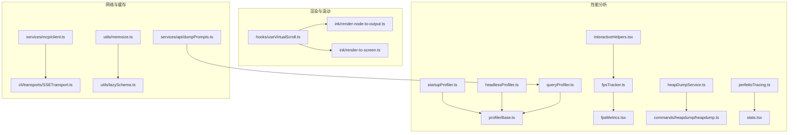
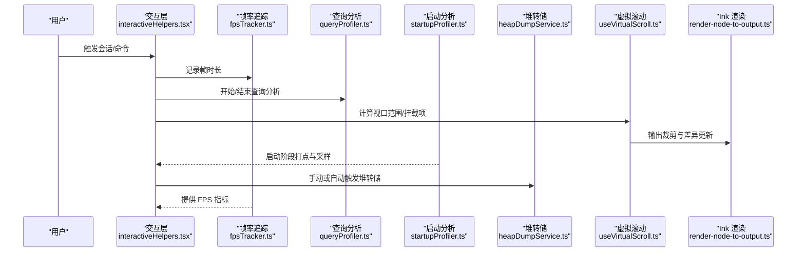
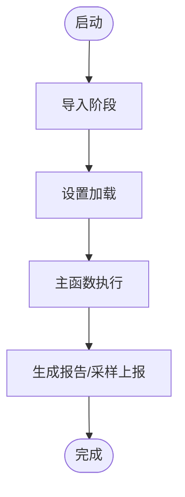
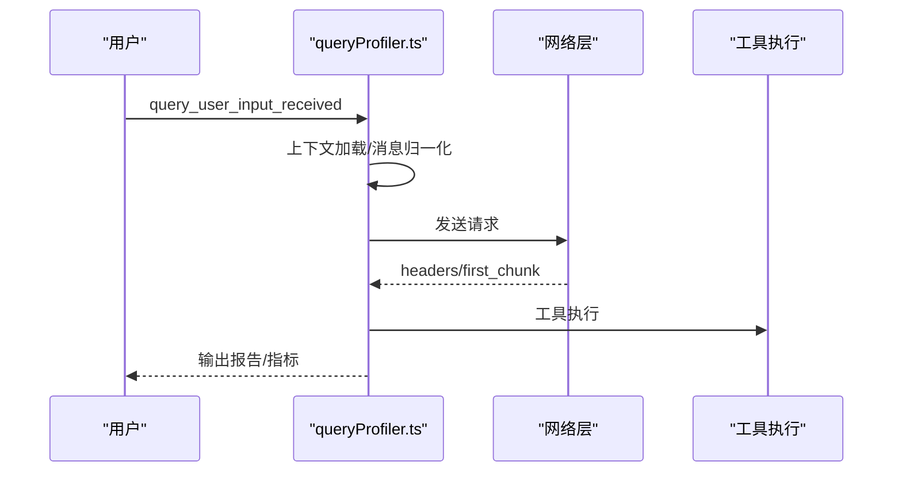
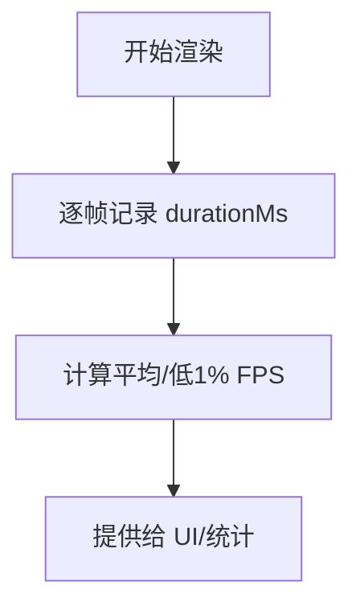
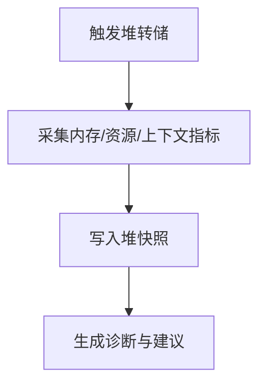
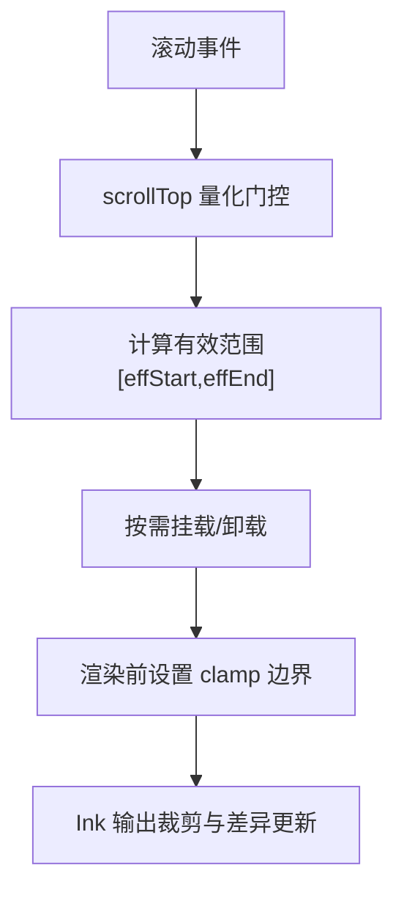
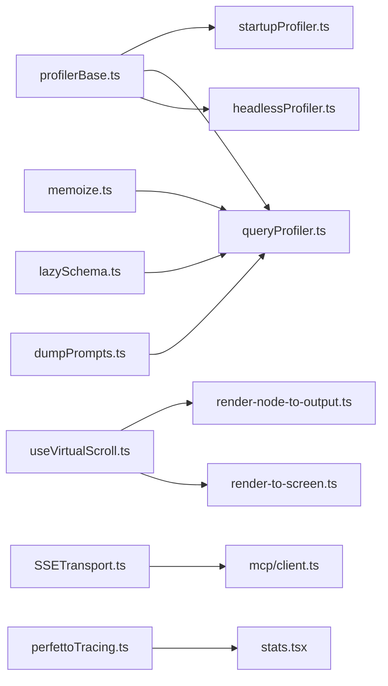

# 性能优化

<cite>
**本文引用的文件**
- [utils/fpsTracker.ts](file://utils/fpsTracker.ts)
- [context/fpsMetrics.tsx](file://context/fpsMetrics.tsx)
- [interactiveHelpers.tsx](file://interactiveHelpers.tsx)
- [utils/startupProfiler.ts](file://utils/startupProfiler.ts)
- [utils/headlessProfiler.ts](file://utils/headlessProfiler.ts)
- [utils/profilerBase.ts](file://utils/profilerBase.ts)
- [utils/queryProfiler.ts](file://utils/queryProfiler.ts)
- [utils/heapDumpService.ts](file://utils/heapDumpService.ts)
- [commands/heapdump/heapdump.ts](file://commands/heapdump/heapdump.ts)
- [hooks/useVirtualScroll.ts](file://hooks/useVirtualScroll.ts)
- [utils/memoize.ts](file://utils/memoize.ts)
- [utils/lazySchema.ts](file://utils/lazySchema.ts)
- [utils/telemetry/perfettoTracing.ts](file://utils/telemetry/perfettoTracing.ts)
- [context/stats.tsx](file://context/stats.tsx)
- [services/mcp/client.ts](file://services/mcp/client.ts)
- [services/api/dumpPrompts.ts](file://services/api/dumpPrompts.ts)
- [cli/transports/SSETransport.ts](file://cli/transports/SSETransport.ts)
- [ink/render-node-to-output.ts](file://ink/render-node-to-output.ts)
- [ink/render-to-screen.ts](file://ink/render-to-screen.ts)
- [costHook.ts](file://costHook.ts)
</cite>

## 目录
1. [简介](#简介)
2. [项目结构](#项目结构)
3. [核心组件](#核心组件)
4. [架构总览](#架构总览)
5. [详细组件分析](#详细组件分析)
6. [依赖关系分析](#依赖关系分析)
7. [性能考量](#性能考量)
8. [故障排查指南](#故障排查指南)
9. [结论](#结论)
10. [附录](#附录)

## 简介
本指南面向 Claude Code 项目，系统性梳理启动性能、渲染性能、内存与 CPU 使用优化策略，并结合仓库内已实现的 Profiler、FPS Tracker、虚拟滚动、懒加载与缓存等能力，给出可操作的优化建议与最佳实践。同时覆盖性能分析工具使用方法、指标解读、用户体验优化、网络请求优化以及性能监控与基准测试方法。

## 项目结构
围绕性能优化的关键模块分布如下：
- 启动与查询阶段性能分析：startupProfiler、headlessProfiler、queryProfiler、profilerBase
- 渲染与帧率监控：fpsTracker、fpsMetrics 上下文、interactiveHelpers 帧回调
- 内存诊断与快照：heapDumpService、/heapdump 命令
- 虚拟滚动与渲染优化：useVirtualScroll、ink 渲染管线
- 缓存与懒加载：memoize、lazySchema
- 网络与传输：SSETransport、MCP 客户端超时控制、API 请求保存
- 性能遥测：Perfetto Tracing、Stats 指标收集
- 成本与退出时汇总：costHook

图表来源
- [utils/startupProfiler.ts:1-195](file://utils/startupProfiler.ts#L1-L195)
- [utils/headlessProfiler.ts:1-179](file://utils/headlessProfiler.ts#L1-L179)
- [utils/queryProfiler.ts:1-302](file://utils/queryProfiler.ts#L1-L302)
- [utils/profilerBase.ts:1-47](file://utils/profilerBase.ts#L1-L47)
- [utils/fpsTracker.ts:1-47](file://utils/fpsTracker.ts#L1-L47)
- [context/fpsMetrics.tsx:1-29](file://context/fpsMetrics.tsx#L1-L29)
- [interactiveHelpers.tsx:315-342](file://interactiveHelpers.tsx#L315-L342)
- [utils/heapDumpService.ts:1-304](file://utils/heapDumpService.ts#L1-L304)
- [commands/heapdump/heapdump.ts:1-17](file://commands/heapdump/heapdump.ts#L1-L17)
- [utils/telemetry/perfettoTracing.ts:642-1005](file://utils/telemetry/perfettoTracing.ts#L642-L1005)
- [context/stats.tsx:38-219](file://context/stats.tsx#L38-L219)
- [hooks/useVirtualScroll.ts:1-722](file://hooks/useVirtualScroll.ts#L1-L722)
- [ink/render-node-to-output.ts:60-1399](file://ink/render-node-to-output.ts#L60-L1399)
- [ink/render-to-screen.ts:84-117](file://ink/render-to-screen.ts#L84-L117)
- [services/mcp/client.ts:496-523](file://services/mcp/client.ts#L496-L523)
- [services/api/dumpPrompts.ts:170-226](file://services/api/dumpPrompts.ts#L170-L226)
- [cli/transports/SSETransport.ts:647-694](file://cli/transports/SSETransport.ts#L647-L694)
- [utils/memoize.ts:1-172](file://utils/memoize.ts#L1-L172)
- [utils/lazySchema.ts:1-9](file://utils/lazySchema.ts#L1-L9)

章节来源
- [utils/startupProfiler.ts:1-195](file://utils/startupProfiler.ts#L1-L195)
- [utils/queryProfiler.ts:1-302](file://utils/queryProfiler.ts#L1-L302)
- [utils/headlessProfiler.ts:1-179](file://utils/headlessProfiler.ts#L1-L179)
- [utils/profilerBase.ts:1-47](file://utils/profilerBase.ts#L1-L47)
- [utils/fpsTracker.ts:1-47](file://utils/fpsTracker.ts#L1-L47)
- [context/fpsMetrics.tsx:1-29](file://context/fpsMetrics.tsx#L1-L29)
- [interactiveHelpers.tsx:315-342](file://interactiveHelpers.tsx#L315-L342)
- [utils/heapDumpService.ts:1-304](file://utils/heapDumpService.ts#L1-L304)
- [hooks/useVirtualScroll.ts:1-722](file://hooks/useVirtualScroll.ts#L1-L722)
- [utils/memoize.ts:1-172](file://utils/memoize.ts#L1-L172)
- [utils/lazySchema.ts:1-9](file://utils/lazySchema.ts#L1-L9)
- [utils/telemetry/perfettoTracing.ts:642-1005](file://utils/telemetry/perfettoTracing.ts#L642-L1005)
- [context/stats.tsx:38-219](file://context/stats.tsx#L38-L219)
- [services/mcp/client.ts:496-523](file://services/mcp/client.ts#L496-L523)
- [services/api/dumpPrompts.ts:170-226](file://services/api/dumpPrompts.ts#L170-L226)
- [cli/transports/SSETransport.ts:647-694](file://cli/transports/SSETransport.ts#L647-L694)
- [ink/render-node-to-output.ts:60-1399](file://ink/render-node-to-output.ts#L60-L1399)
- [ink/render-to-screen.ts:84-117](file://ink/render-to-screen.ts#L84-L117)

## 核心组件
- 启动性能分析：通过性能时间线标记与采样统计，输出分阶段耗时与内存快照，支持详细报告与 Statsig 事件上报。
- 查询性能分析：记录从输入到首 token 到达的完整流水线关键节点，计算 TTFT、预请求开销占比，输出阶段分解与慢点告警。
- 帧率与渲染监控：基于帧时长采样计算平均 FPS 与低 1% 极端帧的 FPS，结合 Ink 渲染管线进行实时观测。
- 内存诊断与堆转储：采集进程内存、V8 堆统计、句柄与请求计数等指标，生成堆快照与诊断文件，辅助定位泄漏与增长趋势。
- 虚拟滚动与渲染优化：在 React 层与 Ink 输出层双重裁剪，按需挂载视口内及 overscan 的元素，量化挂载上限与滑动节流，避免同步阻塞。
- 缓存与懒加载：提供带 TTL 的写入穿透缓存与惰性模式的 Schema 工厂，降低初始化与重复计算成本。
- 网络与传输：SSE 连接指数退避重连、MCP 请求超时采用 setTimeout 并及时清理，避免信号定时器泄漏；API 请求响应持久化用于离线分析。
- 性能遥测与指标：Perfetto Tracing 事件流与 Stats 指标（直方图、百分位、集合）统一采集与导出。

章节来源
- [utils/startupProfiler.ts:1-195](file://utils/startupProfiler.ts#L1-L195)
- [utils/queryProfiler.ts:1-302](file://utils/queryProfiler.ts#L1-L302)
- [utils/fpsTracker.ts:1-47](file://utils/fpsTracker.ts#L1-L47)
- [interactiveHelpers.tsx:315-342](file://interactiveHelpers.tsx#L315-L342)
- [utils/heapDumpService.ts:1-304](file://utils/heapDumpService.ts#L1-L304)
- [hooks/useVirtualScroll.ts:1-722](file://hooks/useVirtualScroll.ts#L1-L722)
- [utils/memoize.ts:1-172](file://utils/memoize.ts#L1-L172)
- [utils/lazySchema.ts:1-9](file://utils/lazySchema.ts#L1-L9)
- [utils/telemetry/perfettoTracing.ts:642-1005](file://utils/telemetry/perfettoTracing.ts#L642-L1005)
- [context/stats.tsx:38-219](file://context/stats.tsx#L38-L219)
- [services/mcp/client.ts:496-523](file://services/mcp/client.ts#L496-L523)
- [services/api/dumpPrompts.ts:170-226](file://services/api/dumpPrompts.ts#L170-L226)
- [cli/transports/SSETransport.ts:647-694](file://cli/transports/SSETransport.ts#L647-L694)

## 架构总览
下图展示了从用户交互到渲染与分析的端到端路径，包括性能分析与监控的关键节点。

图表来源
- [interactiveHelpers.tsx:315-342](file://interactiveHelpers.tsx#L315-L342)
- [utils/fpsTracker.ts:1-47](file://utils/fpsTracker.ts#L1-L47)
- [utils/queryProfiler.ts:1-302](file://utils/queryProfiler.ts#L1-L302)
- [utils/startupProfiler.ts:1-195](file://utils/startupProfiler.ts#L1-L195)
- [utils/heapDumpService.ts:1-304](file://utils/heapDumpService.ts#L1-L304)
- [hooks/useVirtualScroll.ts:1-722](file://hooks/useVirtualScroll.ts#L1-L722)
- [ink/render-node-to-output.ts:60-1399](file://ink/render-node-to-output.ts#L60-L1399)

## 详细组件分析

### 启动性能分析（startupProfiler）
- 功能要点
  - 在启动流程中插入多个检查点（如模块导入、设置加载、主函数执行等），记录绝对时间与相对增量。
  - 支持两类输出：采样日志（Statsig）与详细报告（含内存快照）。
  - 仅在启用时工作，避免对非采样用户产生额外开销。
- 关键接口
  - profileCheckpoint(name)：记录检查点。
  - profileReport()：生成报告并写入配置目录。
  - logStartupPerf()：按阶段计算耗时并上报。
- 最佳实践
  - 将关键初始化步骤逐一打点，确保覆盖 IO、解析、插件加载、设置缓存重建等。
  - 结合环境变量开关，仅在问题复现或回归测试时开启详细模式。

图表来源
- [utils/startupProfiler.ts:48-54](file://utils/startupProfiler.ts#L48-L54)
- [utils/startupProfiler.ts:65-119](file://utils/startupProfiler.ts#L65-L119)
- [utils/startupProfiler.ts:123-194](file://utils/startupProfiler.ts#L123-L194)

章节来源
- [utils/startupProfiler.ts:1-195](file://utils/startupProfiler.ts#L1-L195)
- [utils/profilerBase.ts:1-47](file://utils/profilerBase.ts#L1-L47)

### 查询性能分析（queryProfiler）
- 功能要点
  - 覆盖从输入接收、上下文加载、消息归一化、客户端创建、网络请求、工具执行到首块到达的全链路。
  - 统计 TTFT、预请求开销占比、阶段耗时与慢点告警。
  - 可输出阶段分解柱状图与摘要。
- 关键接口
  - startQueryProfile()/endQueryProfile()：会话生命周期。
  - queryCheckpoint(name)：记录关键节点。
  - logQueryProfileReport()：输出报告。
- 指标解读
  - Total TTFT：首块到达时间。
  - Pre-request overhead 占比：客户端准备、消息归一化、工具 Schema 构建等开销占比。
  - 阶段耗时：定位瓶颈（如网络、Schema 构建、工具执行）。

图表来源
- [utils/queryProfiler.ts:8-28](file://utils/queryProfiler.ts#L8-L28)
- [utils/queryProfiler.ts:129-211](file://utils/queryProfiler.ts#L129-L211)
- [utils/queryProfiler.ts:216-293](file://utils/queryProfiler.ts#L216-L293)

章节来源
- [utils/queryProfiler.ts:1-302](file://utils/queryProfiler.ts#L1-L302)

### 帧率与渲染监控（FPS Tracker）
- 功能要点
  - 以事件为单位记录帧时长，首次渲染与最后渲染时间用于计算平均 FPS。
  - 通过排序取 p99 对应的帧时长换算低 1% 极端帧的 FPS，更贴近真实卡顿体验。
  - 在交互式渲染中注入 onFrame 回调，记录每帧耗时与阶段拆解（bench 模式）。
- 指标
  - averageFps：整体平均帧率。
  - low1PctFps：极端低帧场景下的参考值。
- 使用建议
  - 在高频滚动、长列表渲染、复杂语法高亮场景下重点关注 low1PctFps。
  - bench 模式下可将每帧阶段耗时写入文件，便于离线分析。

图表来源
- [utils/fpsTracker.ts:1-47](file://utils/fpsTracker.ts#L1-L47)
- [context/fpsMetrics.tsx:1-29](file://context/fpsMetrics.tsx#L1-L29)
- [interactiveHelpers.tsx:315-342](file://interactiveHelpers.tsx#L315-L342)
- [ink/render-to-screen.ts:84-117](file://ink/render-to-screen.ts#L84-L117)

章节来源
- [utils/fpsTracker.ts:1-47](file://utils/fpsTracker.ts#L1-L47)
- [context/fpsMetrics.tsx:1-29](file://context/fpsMetrics.tsx#L1-L29)
- [interactiveHelpers.tsx:315-342](file://interactiveHelpers.tsx#L315-L342)
- [ink/render-to-screen.ts:84-117](file://ink/render-to-screen.ts#L84-L117)

### 内存诊断与堆转储（heapDumpService）
- 功能要点
  - 先写入内存诊断信息（heapUsed、external、rss、句柄/请求、上下文数量等），再写堆快照，避免大堆转储导致崩溃时丢失诊断数据。
  - 自动检测潜在泄漏指标（detachedContexts、活跃句柄、native 内存占比、增长速率、文件描述符）。
  - 支持手动与阈值触发（如 1.5GB）两种方式。
- 输出
  - ~/Desktop 下生成 .heapsnapshot 与 -diagnostics.json，包含平台、版本、分析建议等。
- 最佳实践
  - 在长时间运行或高负载场景下定期触发，结合 RSS 与增长速率判断是否需要进一步分析。
  - 优先关注 detachedContexts 与活跃句柄数量，它们常是泄漏的直接信号。

图表来源
- [utils/heapDumpService.ts:88-212](file://utils/heapDumpService.ts#L88-L212)
- [utils/heapDumpService.ts:221-278](file://utils/heapDumpService.ts#L221-L278)
- [commands/heapdump/heapdump.ts:1-17](file://commands/heapdump/heapdump.ts#L1-L17)

章节来源
- [utils/heapDumpService.ts:1-304](file://utils/heapDumpService.ts#L1-L304)
- [commands/heapdump/heapdump.ts:1-17](file://commands/heapdump/heapdump.ts#L1-L17)

### 虚拟滚动与渲染优化（useVirtualScroll）
- 功能要点
  - React 层虚拟化：仅挂载视口+overscan 的元素，使用顶部/底部 spacer 保持滚动高度恒定。
  - 高度估计与测量：默认估计高度较低，随后用 Yoga 实际高度替换；支持列宽变化时按比例缩放缓存高度。
  - 滑动节流与挂载上限：限制单次新增挂载数量，避免同步阻塞；根据滚动速度动态节流。
  - 偏差校正与粘底：当粘底时回退尾部遍历策略，保证可见内容连续；渲染前读取 listOrigin，避免偏移漂移。
- 性能收益
  - 大会话（数千条消息）显著降低 Fiber 与 Yoga 节点分配，减少内存占用与布局开销。
- 最佳实践
  - 为每个虚拟项提供 measureRef，以便尽快获得准确高度。
  - 长文本/工具结果场景适当增大 overscan，平衡“过早挂载”与“空白闪烁”。

图表来源
- [hooks/useVirtualScroll.ts:220-244](file://hooks/useVirtualScroll.ts#L220-L244)
- [hooks/useVirtualScroll.ts:314-479](file://hooks/useVirtualScroll.ts#L314-L479)
- [hooks/useVirtualScroll.ts:554-597](file://hooks/useVirtualScroll.ts#L554-L597)
- [ink/render-node-to-output.ts:1371-1391](file://ink/render-node-to-output.ts#L1371-L1391)

章节来源
- [hooks/useVirtualScroll.ts:1-722](file://hooks/useVirtualScroll.ts#L1-L722)
- [ink/render-node-to-output.ts:60-1399](file://ink/render-node-to-output.ts#L60-L1399)

### 缓存与懒加载（memoize、lazySchema）
- memoizeWithTTL
  - 写入穿透缓存：命中返回即时值，过期则后台刷新但先返回旧值，避免抖动。
  - 并发安全：使用 Map 与 Promise inFlight 避免重复计算。
  - 提供 cache.clear/cache.delete/get/has 等操作，便于调试与失效。
- lazySchema
  - 将昂贵的 Schema 构造延迟到首次访问，减少模块初始化成本。
- 最佳实践
  - 对昂贵的 IO 或计算（如解析、编译、构建 Schema）使用 memoizeWithTTL。
  - 对大型 JSON Schema 或复杂类型定义使用 lazySchema。

章节来源
- [utils/memoize.ts:1-172](file://utils/memoize.ts#L1-L172)
- [utils/lazySchema.ts:1-9](file://utils/lazySchema.ts#L1-L9)

### 网络与传输优化
- SSETransport
  - 指数退避重连，避免频繁重试造成拥塞。
  - 明确关闭时清理定时器与存活检测，防止悬挂。
- MCP 客户端
  - GET 请求跳过通用超时（长连接 SSE 流），避免 AbortController 定时器泄漏。
  - 使用 setTimeout + clearTimeout 控制超时，确保请求完成后及时释放。
- API 请求持久化
  - 在特定条件下克隆响应流，解析 SSE 并保存到文件，便于离线分析与回归验证。

章节来源
- [cli/transports/SSETransport.ts:647-694](file://cli/transports/SSETransport.ts#L647-L694)
- [services/mcp/client.ts:496-523](file://services/mcp/client.ts#L496-L523)
- [services/api/dumpPrompts.ts:170-226](file://services/api/dumpPrompts.ts#L170-L226)

### 性能遥测与指标（Perfetto、Stats）
- Perfetto Tracing
  - 以事件形式记录 API 调用、工具执行、采样阶段等，支持按 span 起止时间与参数聚合。
  - 支持周期性落盘，异常失败不中断会话。
- Stats 指标
  - 提供直方图（count/min/max/avg/p50/p90/p99）、集合去重、计数器与量表接口，便于多维度观测。

章节来源
- [utils/telemetry/perfettoTracing.ts:642-1005](file://utils/telemetry/perfettoTracing.ts#L642-L1005)
- [context/stats.tsx:38-219](file://context/stats.tsx#L38-L219)

## 依赖关系分析
- 分析模块共享 perf_hooks 时间线与格式化工具，确保跨模块报告一致性。
- 渲染路径依赖 Ink 的布局与输出管线，虚拟滚动与裁剪在渲染前生效，减少不必要的 diff。
- 缓存与懒加载贯穿于查询、工具、Schema 构建等环节，降低重复计算与初始化成本。
- 网络层通过超时与重连策略保障稳定性，避免阻塞与资源泄漏。

图表来源
- [utils/profilerBase.ts:1-47](file://utils/profilerBase.ts#L1-L47)
- [utils/startupProfiler.ts:1-195](file://utils/startupProfiler.ts#L1-L195)
- [utils/queryProfiler.ts:1-302](file://utils/queryProfiler.ts#L1-L302)
- [utils/headlessProfiler.ts:1-179](file://utils/headlessProfiler.ts#L1-L179)
- [hooks/useVirtualScroll.ts:1-722](file://hooks/useVirtualScroll.ts#L1-L722)
- [ink/render-node-to-output.ts:60-1399](file://ink/render-node-to-output.ts#L60-L1399)
- [ink/render-to-screen.ts:84-117](file://ink/render-to-screen.ts#L84-L117)
- [utils/memoize.ts:1-172](file://utils/memoize.ts#L1-L172)
- [utils/lazySchema.ts:1-9](file://utils/lazySchema.ts#L1-L9)
- [cli/transports/SSETransport.ts:647-694](file://cli/transports/SSETransport.ts#L647-L694)
- [services/mcp/client.ts:496-523](file://services/mcp/client.ts#L496-L523)
- [services/api/dumpPrompts.ts:170-226](file://services/api/dumpPrompts.ts#L170-L226)
- [utils/telemetry/perfettoTracing.ts:642-1005](file://utils/telemetry/perfettoTracing.ts#L642-L1005)
- [context/stats.tsx:38-219](file://context/stats.tsx#L38-L219)

## 性能考量
- 启动性能
  - 通过分阶段打点识别瓶颈（IO、解析、插件、设置缓存），优先优化最慢阶段。
  - 仅在问题复现时开启详细模式，避免日常开销。
- 渲染性能
  - 使用虚拟滚动与输出层裁剪，严格控制一次性挂载数量与 overscan。
  - 在高频滚动场景下，关注 low1PctFps 与渲染阶段耗时，必要时调整估算与滑动节流。
- 内存使用
  - 定期触发堆转储与诊断，关注 detachedContexts、活跃句柄与 native 内存占比。
  - 对大对象与缓存设置合理 TTL，避免长期持有。
- CPU 使用
  - 减少同步阻塞：将重计算放入微任务或空闲时间；限制单次新增挂载数量。
  - 使用懒加载与缓存，避免重复解析与构造。
- 网络请求
  - 合理设置超时与指数退避；对长连接流请求避免通用超时逻辑。
  - 对响应进行持久化以便离线分析与回归验证。

## 故障排查指南
- 启动变慢
  - 使用启动分析报告定位具体阶段；检查磁盘 IO、插件加载、设置缓存重建。
- 首帧慢（TTFT）
  - 查看查询分析报告，关注预请求开销占比；优化消息归一化、Schema 构建与客户端创建。
- 渲染卡顿
  - 关注 FPS 低 1% 极端帧；检查虚拟滚动范围、overscan 设置与语法高亮开销。
- 内存增长
  - 触发堆转储与诊断，核对泄漏指标；检查是否存在大量 detachedContexts 或活跃句柄。
- 网络不稳定
  - 检查 SSE 重连策略与超时设置；确认请求未被误加通用超时。

章节来源
- [utils/startupProfiler.ts:81-119](file://utils/startupProfiler.ts#L81-L119)
- [utils/queryProfiler.ts:129-211](file://utils/queryProfiler.ts#L129-L211)
- [utils/fpsTracker.ts:20-46](file://utils/fpsTracker.ts#L20-L46)
- [utils/heapDumpService.ts:88-212](file://utils/heapDumpService.ts#L88-L212)
- [cli/transports/SSETransport.ts:647-694](file://cli/transports/SSETransport.ts#L647-L694)
- [services/mcp/client.ts:496-523](file://services/mcp/client.ts#L496-L523)

## 结论
通过启动、查询、渲染、内存与网络五个维度的分析工具与优化策略，Claude Code 能够在复杂交互场景下维持稳定性能。建议在开发与回归测试中常态化使用 Profiler、FPS Tracker、虚拟滚动与缓存策略，配合 Heap Dump 与 Perfetto Tracing，形成闭环的性能治理流程。

## 附录
- 性能分析工具使用
  - 启动分析：设置环境变量开启详细模式，查看配置目录中的报告文件。
  - 查询分析：设置环境变量启用查询分析，结束后输出阶段分解与慢点告警。
  - FPS 跟踪：在交互式渲染中注入回调，获取平均与低 1% FPS。
  - 堆转储：通过命令触发或达到阈值自动触发，生成诊断与快照。
- 指标解读
  - 启动：关注阶段耗时与内存快照，定位 IO/解析/插件瓶颈。
  - 查询：关注 TTFT、预请求占比、阶段耗时与慢点标签。
  - 渲染：关注 averageFps 与 low1PctFps，结合阶段耗时定位热点。
  - 内存：关注 detachedContexts、活跃句柄、native 内存占比与增长速率。
- 基准测试方法
  - 使用 bench 模式将帧阶段耗时写入文件，离线统计 p50/p90/p99。
  - 对关键路径（虚拟滚动、语法高亮、消息归一化）进行独立压测，对比不同配置下的资源消耗。

章节来源
- [utils/startupProfiler.ts:123-194](file://utils/startupProfiler.ts#L123-L194)
- [utils/queryProfiler.ts:298-301](file://utils/queryProfiler.ts#L298-L301)
- [interactiveHelpers.tsx:315-342](file://interactiveHelpers.tsx#L315-L342)
- [utils/heapDumpService.ts:221-278](file://utils/heapDumpService.ts#L221-L278)
- [utils/telemetry/perfettoTracing.ts:990-1005](file://utils/telemetry/perfettoTracing.ts#L990-L1005)
- [context/stats.tsx:38-219](file://context/stats.tsx#L38-L219)