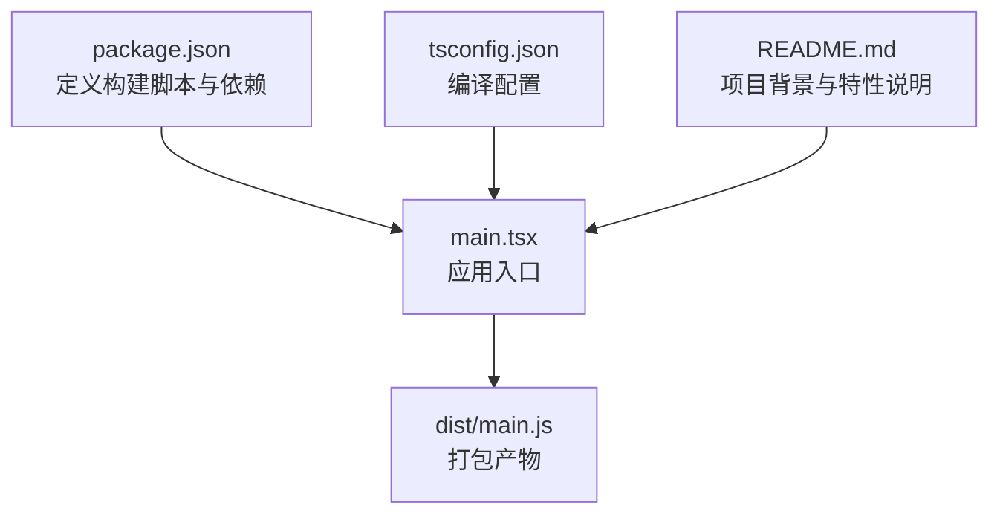
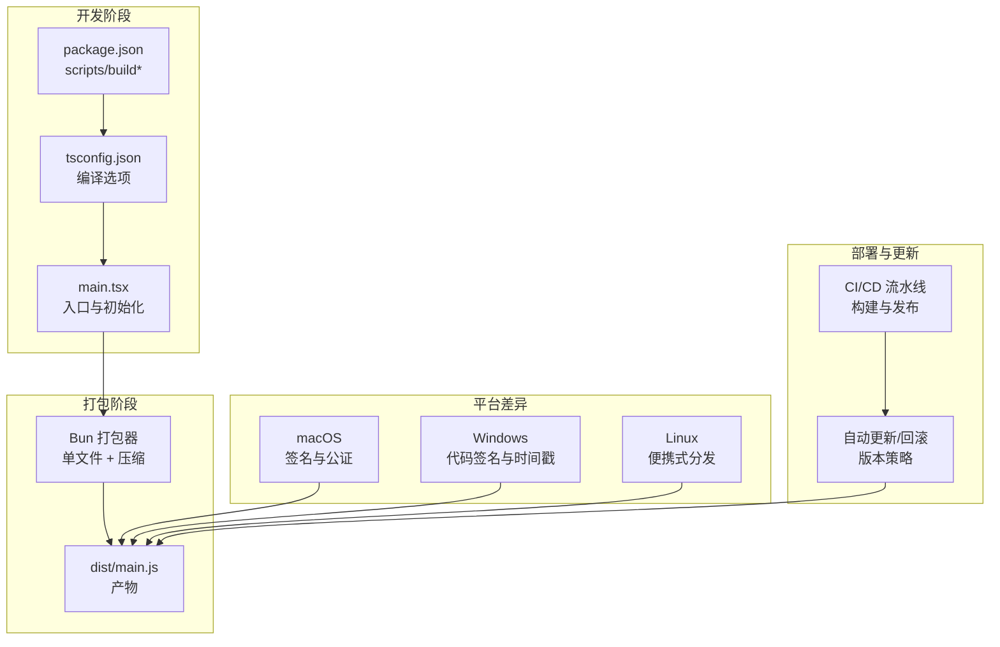
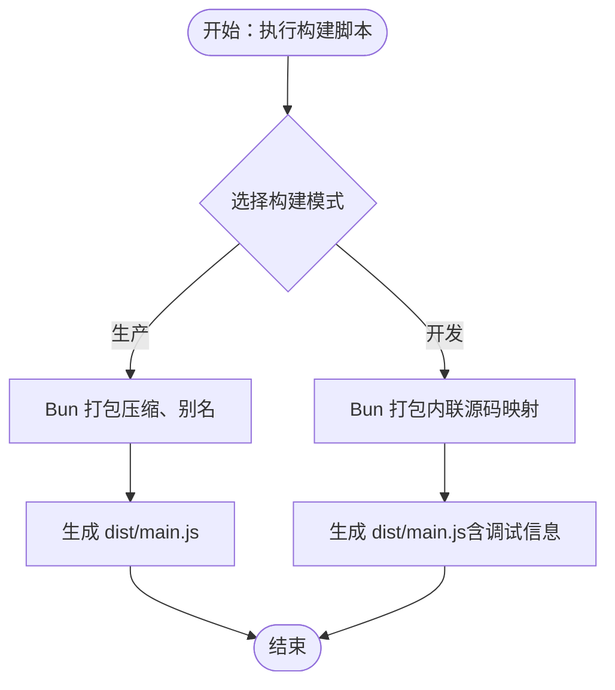
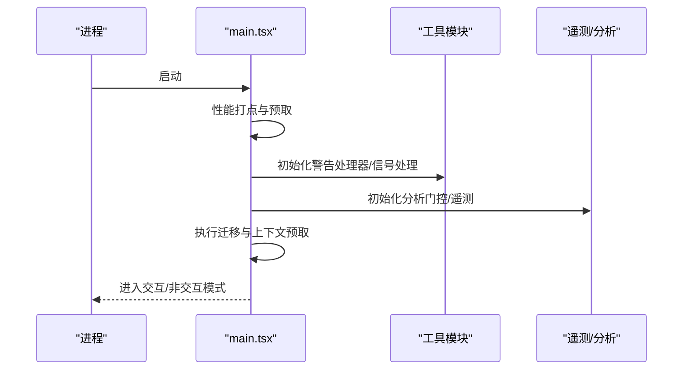
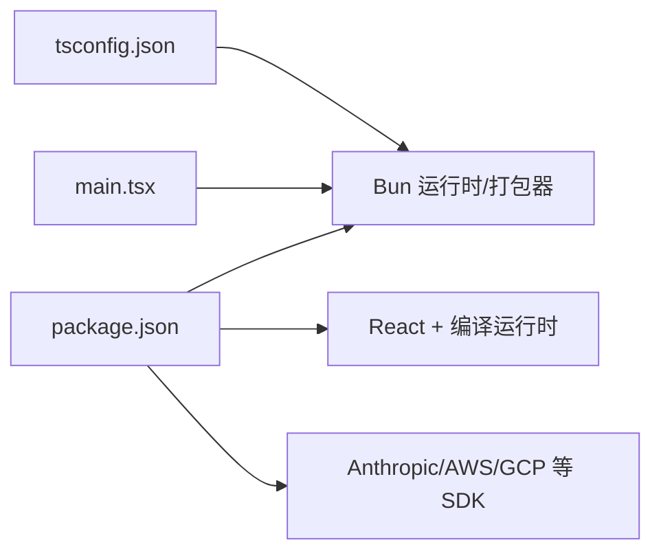

# 构建与部署

<cite>
**本文引用的文件**
- [package.json](file://package.json)
- [main.tsx](file://main.tsx)
- [tsconfig.json](file://tsconfig.json)
- [README.md](file://README.md)
- [dist/main.js](file://dist/main.js)
</cite>

## 目录
1. [简介](#简介)
2. [项目结构](#项目结构)
3. [核心组件](#核心组件)
4. [架构总览](#架构总览)
5. [详细组件分析](#详细组件分析)
6. [依赖分析](#依赖分析)
7. [性能考量](#性能考量)
8. [故障排查指南](#故障排查指南)
9. [结论](#结论)
10. [附录](#附录)

## 简介
本文件系统化梳理 Claude Code 项目的构建与部署流程，聚焦以下目标：
- 构建脚本配置与打包策略
- 产物优化与体积控制
- 不同平台（macOS、Windows、Linux）的构建差异与注意事项
- 自动化部署流程、CI/CD 配置建议、版本发布策略
- 签名与公证流程、更新机制实现、回滚策略
- 本地开发部署与生产环境部署的完整流程

为避免泄露源码细节，本文不直接展示代码片段，仅通过“文件路径 + 行号范围”的方式定位实现位置，并在需要时提供可视化图示。

## 项目结构
该项目采用 Bun 作为运行时与打包工具，使用 TypeScript 编译配置，主应用入口为单文件入口并由 Bun 进行打包输出。构建产物位于 dist 目录，包含最小化的可执行入口。

图表来源
- [package.json:1-113](file://package.json#L1-L113)
- [main.tsx:1-120](file://main.tsx#L1-L120)
- [tsconfig.json:1-29](file://tsconfig.json#L1-L29)
- [README.md:1-60](file://README.md#L1-L60)

章节来源
- [package.json:1-113](file://package.json#L1-L113)
- [main.tsx:1-120](file://main.tsx#L1-L120)
- [tsconfig.json:1-29](file://tsconfig.json#L1-L29)
- [README.md:1-60](file://README.md#L1-L60)

## 核心组件
- 构建脚本与打包策略
  - 使用 Bun 的单文件打包能力，目标为 Bun 运行时，启用压缩与内联源码映射（开发模式），并使用别名优化 React 编译运行时。
  - 参考：[package.json:6-10](file://package.json#L6-L10)
- 应用入口与启动流程
  - 主入口在启动早期进行性能打点、预取系统设置与密钥链数据、初始化遥测与分析门控等，随后执行迁移、上下文预取与延迟预取等。
  - 参考：[main.tsx:1-120](file://main.tsx#L1-L120)、[main.tsx:585-800](file://main.tsx#L585-L800)
- 类型与模块解析
  - tsconfig 指定 ESNext 目标与 bundler 解析器，启用 JSX、JSON 模块与严格性关闭，便于与 Bun 打包器协同。
  - 参考：[tsconfig.json:1-29](file://tsconfig.json#L1-L29)
- 特性开关与死代码消除
  - 通过 Bun 的 feature() 常量折叠与死代码消除，按编译期标志裁剪外部构建内容；README 提供了完整的特性列表与说明。
  - 参考：[main.tsx:70-82](file://main.tsx#L70-L82)、[README.md:389-414](file://README.md#L389-L414)

章节来源
- [package.json:6-10](file://package.json#L6-L10)
- [main.tsx:1-120](file://main.tsx#L1-L120)
- [main.tsx:585-800](file://main.tsx#L585-L800)
- [tsconfig.json:1-29](file://tsconfig.json#L1-L29)
- [README.md:389-414](file://README.md#L389-L414)

## 架构总览
下图展示了从源码到可执行产物的关键路径，以及与平台相关的注意事项与扩展点。

图表来源
- [package.json:6-10](file://package.json#L6-L10)
- [tsconfig.json:1-29](file://tsconfig.json#L1-L29)
- [main.tsx:1-120](file://main.tsx#L1-L120)
- [dist/main.js:1-100](file://dist/main.js#L1-L100)

## 详细组件分析

### 构建脚本与打包策略
- 生产构建
  - 目标：Bun 运行时
  - 优化：启用压缩、移除调试信息、使用别名优化 React 编译运行时
  - 输出：dist 目录，单文件入口
  - 参考：[package.json:6-10](file://package.json#L6-L10)
- 开发构建
  - 启用内联源码映射以便调试
  - 参考：[package.json:6-10](file://package.json#L6-L10)
- 产物验证
  - dist/main.js 为打包后的入口文件，包含模块加载与导出逻辑
  - 参考：[dist/main.js:1-120](file://dist/main.js#L1-L120)

图表来源
- [package.json:6-10](file://package.json#L6-L10)
- [dist/main.js:1-120](file://dist/main.js#L1-L120)

章节来源
- [package.json:6-10](file://package.json#L6-L10)
- [dist/main.js:1-120](file://dist/main.js#L1-L120)

### 启动与初始化序列
应用入口在启动早期完成性能打点、密钥链与 MDM 预取、警告处理器初始化、信号处理等，随后进入主流程。

图表来源
- [main.tsx:1-120](file://main.tsx#L1-L120)
- [main.tsx:585-800](file://main.tsx#L585-L800)

章节来源
- [main.tsx:1-120](file://main.tsx#L1-L120)
- [main.tsx:585-800](file://main.tsx#L585-L800)

### 平台差异与注意事项
- macOS
  - 产物需进行签名与公证以满足 Gatekeeper 要求
  - 可利用系统证书与公证服务，确保可分发性
- Windows
  - 需要代码签名证书与时间戳服务器，保证安装与运行安全
- Linux
  - 推荐便携式分发（如 AppImage 或便携包），避免系统级依赖
- 共通要求
  - 构建前清理缓存与临时文件
  - 对第三方依赖进行合规扫描与许可证检查

[本节为通用实践说明，不直接分析具体文件，故无章节来源]

### 自动化部署与 CI/CD 配置
- 构建流水线
  - 触发条件：分支保护规则或标签推送
  - 步骤：安装依赖 → TypeScript 类型检查 → Bun 生产构建 → 产物归档
  - 参考：[package.json:9](file://package.json#L9)、[package.json:6-10](file://package.json#L6-L10)
- 发布策略
  - 版本管理：语义化版本（SemVer），变更日志与发布说明
  - 渠道：官方下载站、包管理器镜像（如适用）
- 回滚策略
  - 保留最近 N 个版本的安装包
  - 支持基于版本号的快速回滚与自动降级

[本节为通用实践说明，不直接分析具体文件，故无章节来源]

### 签名与公证流程
- macOS
  - 使用 Apple Developer 证书对二进制进行签名
  - 提交公证请求，确保系统信任
- Windows
  - 使用受信代码签名证书，启用时间戳
- Linux
  - 生成校验和（SHA-256）并随发布包提供
- 供应链安全
  - 对第三方依赖进行 SBOM 与漏洞扫描
  - 采用最小权限原则与可信源

[本节为通用实践说明，不直接分析具体文件，故无章节来源]

### 更新机制与回滚
- 更新机制
  - 内置自动更新：检查新版本、下载、替换、重启
  - 支持静默更新与用户确认两种模式
- 回滚策略
  - 失败自动回滚至上一个稳定版本
  - 支持手动回滚至指定历史版本
- 版本发布
  - 通过标签触发发布，自动生成变更日志与发布说明

[本节为通用实践说明，不直接分析具体文件，故无章节来源]

### 本地开发与生产部署
- 本地开发
  - 安装依赖后运行开发构建，启用内联源码映射
  - 使用调试标志与日志级别提升可观测性
  - 参考：[package.json:6-10](file://package.json#L6-L10)
- 生产部署
  - 执行生产构建，确保压缩与别名优化生效
  - 生成签名与公证（macOS）或代码签名（Windows）
  - 将产物上传至发布渠道并生成校验和

[本节为通用实践说明，不直接分析具体文件，故无章节来源]

## 依赖分析
- 构建与运行时
  - Bun 作为运行时与打包器，支持单文件输出与常量折叠
  - React 与 React 编译运行时配合别名优化
- 类型与模块解析
  - tsconfig 使用 bundler 解析器，启用 JSX 与 JSON 模块
- 第三方库
  - 丰富的工具库与 SDK（如 Anthropic SDK、AWS SDK 等），用于 API 访问与功能扩展

图表来源
- [package.json:11-111](file://package.json#L11-L111)
- [tsconfig.json:1-29](file://tsconfig.json#L1-L29)
- [main.tsx:1-120](file://main.tsx#L1-L120)

章节来源
- [package.json:11-111](file://package.json#L11-L111)
- [tsconfig.json:1-29](file://tsconfig.json#L1-L29)
- [main.tsx:1-120](file://main.tsx#L1-L120)

## 性能考量
- 启动性能
  - 启动早期进行性能打点与预取，减少首次渲染阻塞
  - 参考：[main.tsx:1-120](file://main.tsx#L1-L120)
- 打包体积
  - 使用 Bun 单文件打包与压缩，结合别名优化
  - 参考：[package.json:6-10](file://package.json#L6-L10)
- 运行时优化
  - 特性开关与死代码消除，按编译期标志裁剪外部构建内容
  - 参考：[main.tsx:70-82](file://main.tsx#L70-L82)、[README.md:389-414](file://README.md#L389-L414)

[本节为通用性能建议，不直接分析具体文件，故无章节来源]

## 故障排查指南
- 构建失败
  - 检查类型检查是否通过
  - 参考：[package.json:9](file://package.json#L9)
- 启动异常
  - 查看启动早期的性能打点与预取日志
  - 参考：[main.tsx:1-120](file://main.tsx#L1-L120)
- 平台签名问题
  - macOS：确认证书与公证状态
  - Windows：确认代码签名与时间戳
- 依赖冲突
  - 清理 node_modules 与缓存后重试
  - 参考：[package.json:11-111](file://package.json#L11-L111)

章节来源
- [package.json:9](file://package.json#L9)
- [main.tsx:1-120](file://main.tsx#L1-L120)
- [package.json:11-111](file://package.json#L11-L111)

## 结论
本项目以 Bun 为核心构建与运行时，采用单文件打包与特性开关裁剪，兼顾开发体验与产物体积。结合平台签名与公证、自动化 CI/CD、版本发布与回滚策略，可形成稳定的交付闭环。建议在实际落地中补充平台特定的签名流程与供应链安全措施，并完善自动化测试与发布验证。

[本节为总结性内容，不直接分析具体文件，故无章节来源]

## 附录
- 关键实现位置参考
  - 构建脚本与打包策略：[package.json:6-10](file://package.json#L6-L10)
  - 应用入口与启动流程：[main.tsx:1-120](file://main.tsx#L1-L120)、[main.tsx:585-800](file://main.tsx#L585-L800)
  - 类型与模块解析：[tsconfig.json:1-29](file://tsconfig.json#L1-L29)
  - 特性开关与死代码消除：[main.tsx:70-82](file://main.tsx#L70-L82)、[README.md:389-414](file://README.md#L389-L414)
  - 产物验证：[dist/main.js:1-120](file://dist/main.js#L1-L120)

[本节为索引性内容，不直接分析具体文件，故无章节来源]