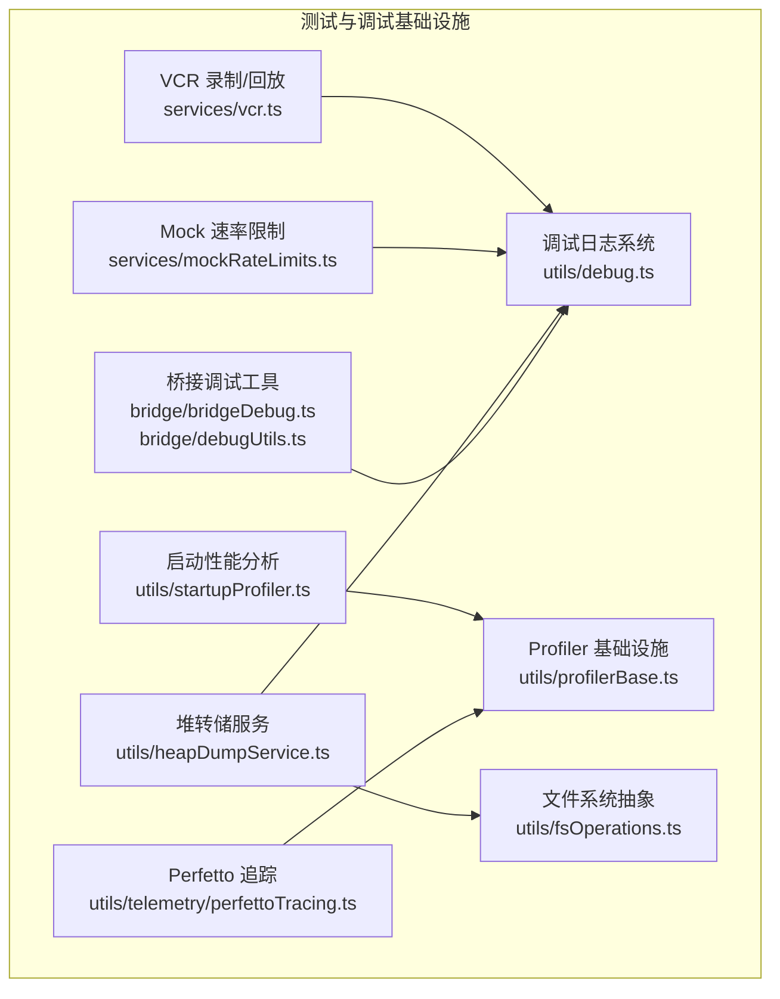
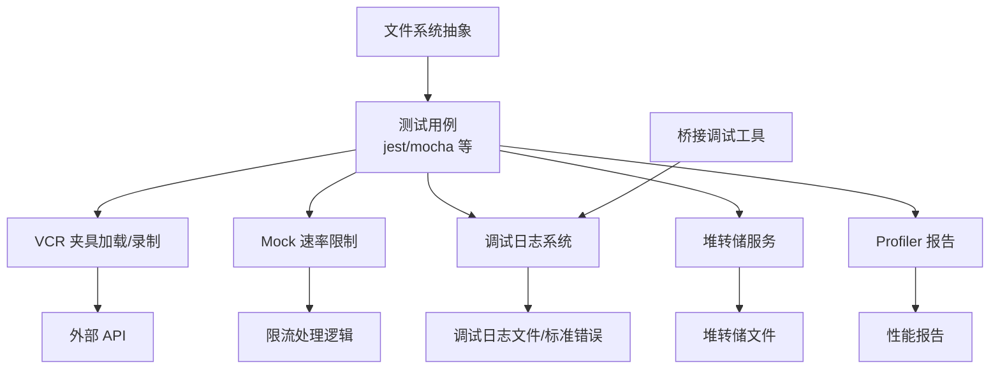
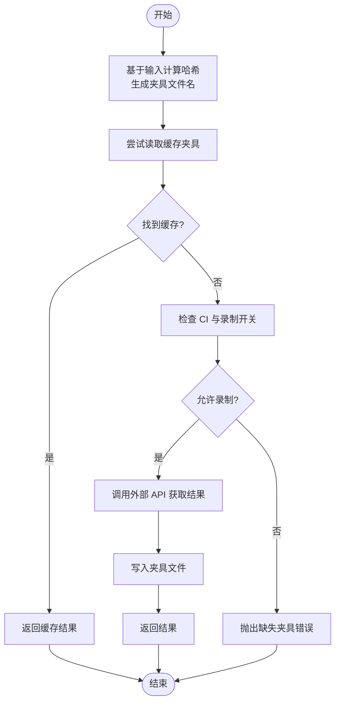
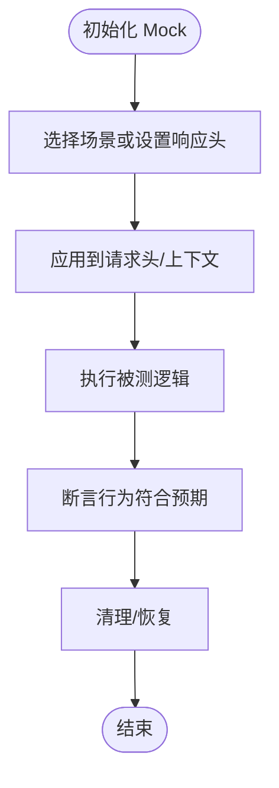
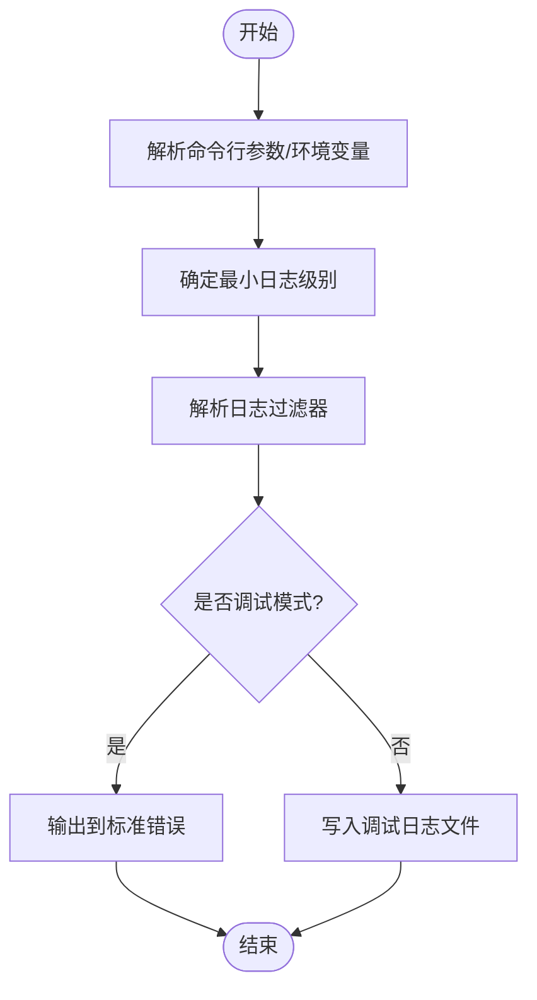
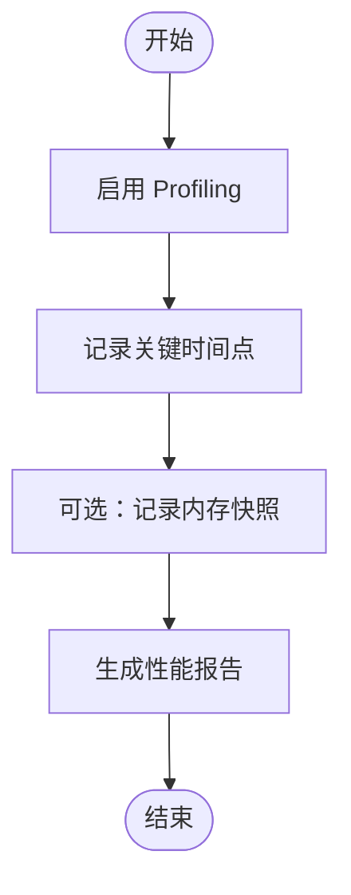
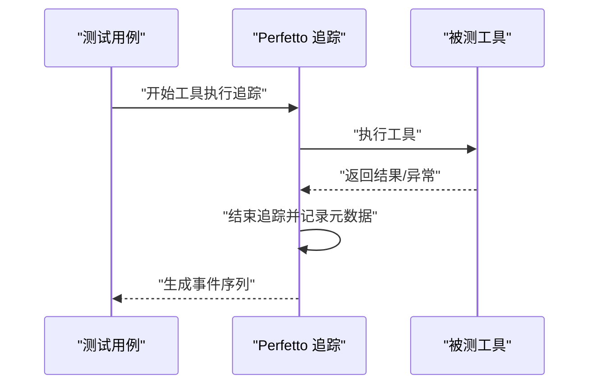
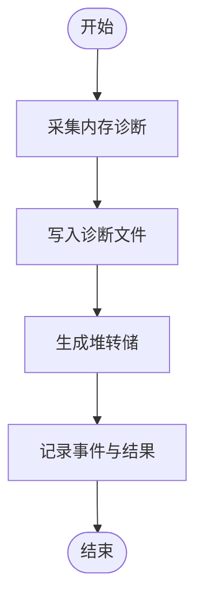
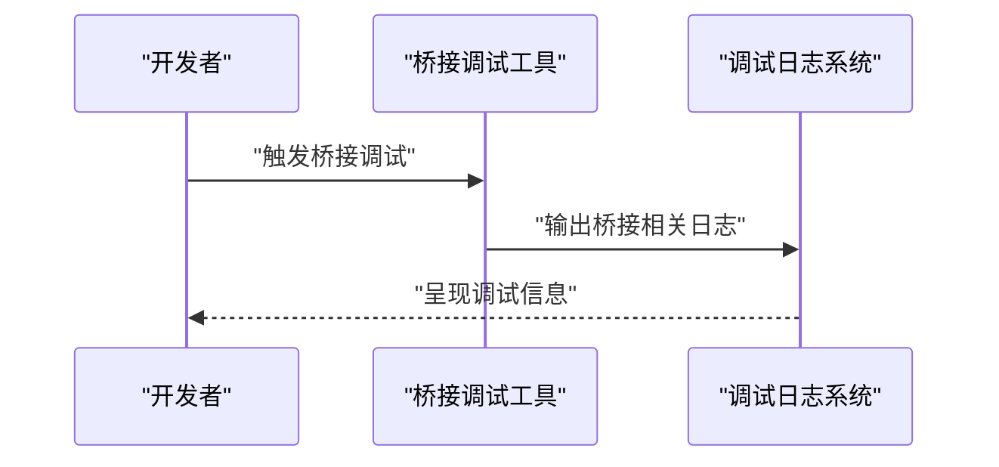
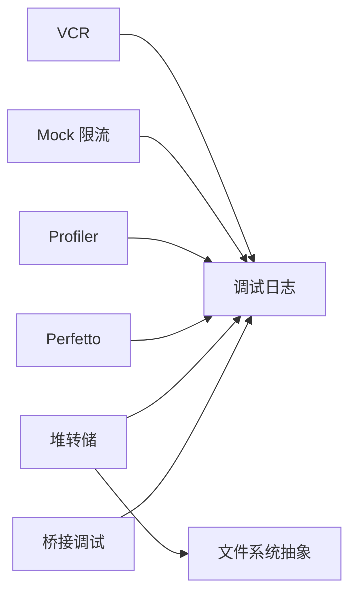

# 测试与调试

<cite>
**本文引用的文件**
- [package.json](file://package.json)
- [services/vcr.ts](file://services/vcr.ts)
- [services/mockRateLimits.ts](file://services/mockRateLimits.ts)
- [utils/debug.ts](file://utils/debug.ts)
- [utils/heapDumpService.ts](file://utils/heapDumpService.ts)
- [utils/startupProfiler.ts](file://utils/startupProfiler.ts)
- [utils/profilerBase.ts](file://utils/profilerBase.ts)
- [utils/telemetry/perfettoTracing.ts](file://utils/telemetry/perfettoTracing.ts)
- [utils/fsOperations.ts](file://utils/fsOperations.ts)
- [utils/settings/changeDetector.ts](file://utils/settings/changeDetector.ts)
- [bridge/bridgeDebug.ts](file://bridge/bridgeDebug.ts)
- [bridge/debugUtils.ts](file://bridge/debugUtils.ts)
- [commands/heapdump/heapdump.ts](file://commands/heapdump/heapdump.ts)
- [commands.ts](file://commands.ts)
- [bootstrap/state.ts](file://bootstrap/state.ts)
</cite>

## 目录
1. [引言](#引言)
2. [项目结构](#项目结构)
3. [核心组件](#核心组件)
4. [架构总览](#架构总览)
5. [详细组件分析](#详细组件分析)
6. [依赖关系分析](#依赖关系分析)
7. [性能考量](#性能考量)
8. [故障排查指南](#故障排查指南)
9. [结论](#结论)
10. [附录](#附录)

## 引言
本文件面向 Claude Code 项目的测试与调试，系统化阐述测试策略与调试方法，覆盖单元测试、集成测试与端到端测试的组织方式；详述测试框架配置、Mock 策略与测试数据准备；解释调试工具（Node.js Inspector、VS Code 调试器）的使用、断点设置与变量监控；提供性能分析（Profiler 使用）、内存泄漏检测与崩溃分析技巧；并给出测试覆盖率要求与持续集成配置建议。

## 项目结构
- 测试与调试相关能力主要分布在以下模块：
  - 测试夹具与回放：VCR（虚拟化录制与回放）
  - 速率限制与配额 Mock：模拟限流场景
  - 调试日志与输出：统一调试日志系统
  - 性能分析：启动阶段与查询阶段 Profiler 基础设施
  - 内存诊断：堆转储与内存诊断采集
  - 桥接层调试：桥接通信与调试工具
  - 文件系统抽象：便于在测试中替换真实文件系统

**图表来源**
- [services/vcr.ts:48-106](file://services/vcr.ts#L48-L106)
- [services/mockRateLimits.ts:1-800](file://services/mockRateLimits.ts#L1-L800)
- [utils/debug.ts:1-269](file://utils/debug.ts#L1-L269)
- [utils/profilerBase.ts:1-46](file://utils/profilerBase.ts#L1-L46)
- [utils/startupProfiler.ts:35-128](file://utils/startupProfiler.ts#L35-L128)
- [utils/telemetry/perfettoTracing.ts:696-835](file://utils/telemetry/perfettoTracing.ts#L696-L835)
- [utils/heapDumpService.ts:1-304](file://utils/heapDumpService.ts#L1-L304)
- [utils/fsOperations.ts:18-51](file://utils/fsOperations.ts#L18-L51)
- [bridge/bridgeDebug.ts](file://bridge/bridgeDebug.ts)
- [bridge/debugUtils.ts](file://bridge/debugUtils.ts)

**章节来源**
- [package.json:1-113](file://package.json#L1-L113)

## 核心组件
- VCR（虚拟化录制与回放）
  - 通过输入哈希生成夹具文件名，优先读取缓存夹具；在 CI 或未显式允许时抛错提示回放失败；支持在本地开启录制以生成新夹具。
  - 用于稳定地复现外部 API 行为，避免网络波动影响测试稳定性。
- Mock 速率限制
  - 提供多种 Mock 场景（会话/周限额、超量使用、快速模式限流等），可按需设置响应头或场景描述，便于测试限流分支与降级逻辑。
- 调试日志系统
  - 支持命令行开关与环境变量控制日志级别、输出目标（标准错误或文件）、过滤器；提供运行期启用调试的能力。
- Profiler 基础设施
  - 统一的性能计时与报告格式，支持启动阶段与查询阶段的性能分析；可选记录内存快照。
- Perfetto 追踪
  - 工具执行与用户等待阶段的事件追踪，便于定位长尾问题。
- 堆转储与内存诊断
  - 自动采集内存指标、V8 堆空间统计、句柄与请求数量、平台信息等，并在堆转储前先写入诊断文件，降低大堆转储失败风险。
- 桥接调试工具
  - 针对桥接通信与调试流程的专用工具，配合调试日志系统使用。
- 文件系统抽象
  - 将 Node.js fs 能力抽象为接口，便于在测试中注入虚拟实现或替换真实文件系统。

**章节来源**
- [services/vcr.ts:48-106](file://services/vcr.ts#L48-L106)
- [services/mockRateLimits.ts:1-800](file://services/mockRateLimits.ts#L1-L800)
- [utils/debug.ts:1-269](file://utils/debug.ts#L1-L269)
- [utils/profilerBase.ts:1-46](file://utils/profilerBase.ts#L1-L46)
- [utils/startupProfiler.ts:35-128](file://utils/startupProfiler.ts#L35-L128)
- [utils/telemetry/perfettoTracing.ts:696-835](file://utils/telemetry/perfettoTracing.ts#L696-L835)
- [utils/heapDumpService.ts:1-304](file://utils/heapDumpService.ts#L1-L304)
- [utils/fsOperations.ts:18-51](file://utils/fsOperations.ts#L18-L51)
- [bridge/bridgeDebug.ts](file://bridge/bridgeDebug.ts)
- [bridge/debugUtils.ts](file://bridge/debugUtils.ts)

## 架构总览
下图展示测试与调试关键路径在系统中的交互关系：

**图表来源**
- [services/vcr.ts:48-106](file://services/vcr.ts#L48-L106)
- [services/mockRateLimits.ts:1-800](file://services/mockRateLimits.ts#L1-L800)
- [utils/debug.ts:1-269](file://utils/debug.ts#L1-L269)
- [utils/heapDumpService.ts:1-304](file://utils/heapDumpService.ts#L1-L304)
- [utils/startupProfiler.ts:35-128](file://utils/startupProfiler.ts#L35-L128)
- [utils/fsOperations.ts:18-51](file://utils/fsOperations.ts#L18-L51)
- [bridge/bridgeDebug.ts](file://bridge/bridgeDebug.ts)
- [bridge/debugUtils.ts](file://bridge/debugUtils.ts)

## 详细组件分析

### VCR（夹具录制与回放）
- 设计要点
  - 输入哈希决定夹具文件名，避免重复与冲突。
  - 优先从缓存读取；在 CI 且未显式允许录制时，抛出明确错误提示。
  - 支持按消息规范化后参与哈希，确保不同但语义一致的输入得到相同夹具。
- 使用建议
  - 在本地开发时，可通过环境变量开启录制以生成新夹具。
  - 在 CI 中保持严格，避免无夹具导致的不稳定。
- 关键流程

**图表来源**
- [services/vcr.ts:48-106](file://services/vcr.ts#L48-L106)

**章节来源**
- [services/vcr.ts:48-106](file://services/vcr.ts#L48-L106)

### Mock 速率限制
- 设计要点
  - 提供细粒度响应头设置与场景切换，覆盖正常、警告、拒绝、超量使用、快速模式限流等。
  - 支持代表型限额声明与重置时间计算，自动维护 retry-after。
- 使用建议
  - 在单元测试中选择具体场景，确保覆盖所有分支。
  - 在集成测试中组合多个限额状态，验证降级与回退逻辑。
- 关键流程

**图表来源**
- [services/mockRateLimits.ts:1-800](file://services/mockRateLimits.ts#L1-L800)

**章节来源**
- [services/mockRateLimits.ts:1-800](file://services/mockRateLimits.ts#L1-L800)

### 调试日志系统
- 设计要点
  - 支持命令行参数与环境变量控制日志级别、输出目标与过滤器。
  - 运行期可启用调试，便于在不重启的情况下收集诊断信息。
  - 对测试环境进行特殊处理，避免噪声输出。
- 使用建议
  - 在 VS Code 中通过命令行参数传入调试开关，或在运行配置中设置环境变量。
  - 使用过滤器仅输出关注模块的日志，减少干扰。
- 关键流程

**图表来源**
- [utils/debug.ts:1-269](file://utils/debug.ts#L1-L269)

**章节来源**
- [utils/debug.ts:1-269](file://utils/debug.ts#L1-L269)

### Profiler 基础设施与启动性能分析
- 设计要点
  - 统一的性能计时 API，支持多阶段打点与格式化输出。
  - 启动阶段可选记录内存快照，便于分析冷启动瓶颈。
- 使用建议
  - 在关键路径上添加打点，对比不同版本的性能变化。
  - 结合 Perfetto 追踪，定位长尾与阻塞点。
- 关键流程

**图表来源**
- [utils/profilerBase.ts:1-46](file://utils/profilerBase.ts#L1-L46)
- [utils/startupProfiler.ts:35-128](file://utils/startupProfiler.ts#L35-L128)

**章节来源**
- [utils/profilerBase.ts:1-46](file://utils/profilerBase.ts#L1-L46)
- [utils/startupProfiler.ts:35-128](file://utils/startupProfiler.ts#L35-L128)

### Perfetto 追踪
- 设计要点
  - 工具执行与用户等待阶段的事件追踪，支持开始/结束事件与元数据记录。
- 使用建议
  - 在长耗时工具调用前后打点，结合报告定位热点。
- 关键流程

**图表来源**
- [utils/telemetry/perfettoTracing.ts:696-835](file://utils/telemetry/perfettoTracing.ts#L696-L835)

**章节来源**
- [utils/telemetry/perfettoTracing.ts:696-835](file://utils/telemetry/perfettoTracing.ts#L696-L835)

### 堆转储与内存诊断
- 设计要点
  - 先写入内存诊断文件，再进行堆转储，降低大堆转储失败风险。
  - 采集 V8 堆统计、堆空间分布、句柄/请求数量、平台信息等，辅助判断泄漏类型。
- 使用建议
  - 在内存增长明显时触发手动堆转储，或在达到阈值时自动触发。
  - 结合诊断文件分析泄漏来源（V8 堆 vs 原生内存）。
- 关键流程

**图表来源**
- [utils/heapDumpService.ts:1-304](file://utils/heapDumpService.ts#L1-L304)

**章节来源**
- [utils/heapDumpService.ts:1-304](file://utils/heapDumpService.ts#L1-L304)
- [commands/heapdump/heapdump.ts:1-17](file://commands/heapdump/heapdump.ts#L1-L17)

### 桥接调试工具
- 设计要点
  - 面向桥接通信与调试流程的专用工具，配合调试日志系统使用。
- 使用建议
  - 在桥接层出现异常时，结合桥接调试工具与调试日志定位问题。
- 关键流程

**图表来源**
- [bridge/bridgeDebug.ts](file://bridge/bridgeDebug.ts)
- [bridge/debugUtils.ts](file://bridge/debugUtils.ts)
- [utils/debug.ts:1-269](file://utils/debug.ts#L1-L269)

**章节来源**
- [bridge/bridgeDebug.ts](file://bridge/bridgeDebug.ts)
- [bridge/debugUtils.ts](file://bridge/debugUtils.ts)
- [utils/debug.ts:1-269](file://utils/debug.ts#L1-L269)

## 依赖关系分析
- 测试与调试组件之间的耦合与协作
  - VCR 与 Mock 速率限制相互独立，均可作为测试前置条件。
  - 调试日志系统贯穿各模块，是问题定位的核心。
  - Profiler 与 Perfetto 追踪互补，前者偏向时间线，后者偏向事件序列。
  - 堆转储服务依赖文件系统抽象，确保在不同运行环境下可写入桌面目录。
  - 桥接调试工具与调试日志系统协同工作，提升桥接层可观测性。

**图表来源**
- [services/vcr.ts:48-106](file://services/vcr.ts#L48-L106)
- [services/mockRateLimits.ts:1-800](file://services/mockRateLimits.ts#L1-L800)
- [utils/debug.ts:1-269](file://utils/debug.ts#L1-L269)
- [utils/startupProfiler.ts:35-128](file://utils/startupProfiler.ts#L35-L128)
- [utils/telemetry/perfettoTracing.ts:696-835](file://utils/telemetry/perfettoTracing.ts#L696-L835)
- [utils/heapDumpService.ts:1-304](file://utils/heapDumpService.ts#L1-L304)
- [utils/fsOperations.ts:18-51](file://utils/fsOperations.ts#L18-L51)
- [bridge/bridgeDebug.ts](file://bridge/bridgeDebug.ts)
- [bridge/debugUtils.ts](file://bridge/debugUtils.ts)

**章节来源**
- [utils/fsOperations.ts:18-51](file://utils/fsOperations.ts#L18-L51)
- [utils/debug.ts:1-269](file://utils/debug.ts#L1-L269)

## 性能考量
- Profiler 使用
  - 在关键路径上添加打点，对比不同版本的性能变化；必要时开启详细内存快照。
- 内存泄漏检测
  - 使用堆转储与内存诊断，区分 V8 堆泄漏与原生内存泄漏；关注句柄/请求数量与文件描述符。
- 崩溃分析
  - 结合调试日志与堆转储，定位异常前后的状态变化；在桥接层出现问题时，利用桥接调试工具辅助定位。

[本节为通用指导，无需列出章节来源]

## 故障排查指南
- 调试工具与断点
  - 使用 Node.js Inspector 或 VS Code 调试器附加到进程，设置断点于关键函数入口与异常路径。
  - 利用调试日志系统输出上下文信息，结合过滤器缩小范围。
- 变量监控
  - 在断点处观察关键变量与状态机，确认进入分支与状态转换是否符合预期。
- 速率限制问题
  - 使用 Mock 速率限制切换不同场景，验证限流分支与降级逻辑。
- 性能瓶颈
  - 使用 Profiler 与 Perfetto 追踪定位长尾与阻塞点；结合启动性能分析报告优化冷启动。
- 内存问题
  - 触发堆转储并分析诊断文件，识别泄漏类型与来源；关注高内存增长速率与异常句柄数量。

**章节来源**
- [utils/debug.ts:1-269](file://utils/debug.ts#L1-L269)
- [utils/heapDumpService.ts:1-304](file://utils/heapDumpService.ts#L1-L304)
- [utils/startupProfiler.ts:35-128](file://utils/startupProfiler.ts#L35-L128)
- [utils/telemetry/perfettoTracing.ts:696-835](file://utils/telemetry/perfettoTracing.ts#L696-L835)
- [services/mockRateLimits.ts:1-800](file://services/mockRateLimits.ts#L1-L800)

## 结论
本文件梳理了 Claude Code 项目的测试与调试体系：以 VCR 保证外部依赖稳定、以 Mock 速率限制覆盖复杂边界、以统一调试日志系统支撑问题定位、以 Profiler 与 Perfetto 追踪驱动性能优化、以堆转储与内存诊断应对内存问题、以桥接调试工具强化桥接层可观测性。建议在团队内推广这些实践，形成标准化的测试与调试流程，持续提升质量与效率。

[本节为总结，无需列出章节来源]

## 附录
- 测试策略组织结构建议
  - 单元测试：聚焦纯函数与小模块，使用 Mock 与夹具；优先覆盖边界与异常路径。
  - 集成测试：组合模块与外部依赖，使用 VCR 与 Mock 速率限制；覆盖关键业务链路。
  - 端到端测试：覆盖真实用户场景，结合调试日志与性能追踪；定期回归关键路径。
- 测试框架配置与运行
  - 当前仓库未包含测试框架配置文件；建议在根目录新增测试配置（如 jest.config 或 mocha.opts），并定义：
    - 测试文件匹配规则
    - Mock 注入策略
    - VCR 夹具根目录与录制开关
    - 调试日志输出与过滤器
  - 在 CI 中禁用录制，强制回放以保证一致性。
- 测试覆盖率要求
  - 建议对核心模块设置行/分支/函数/语句覆盖率门槛（例如 80%/80%/80%/80%），并在 PR 中强制校验。
- 持续集成配置
  - 在 CI 中：
    - 安装依赖并构建
    - 运行类型检查
    - 运行测试（禁用录制）
    - 上传覆盖率报告
    - 记录性能报告与调试日志

**章节来源**
- [package.json:1-113](file://package.json#L1-L113)
- [services/vcr.ts:48-106](file://services/vcr.ts#L48-L106)
- [utils/debug.ts:1-269](file://utils/debug.ts#L1-L269)
- [services/mockRateLimits.ts:1-800](file://services/mockRateLimits.ts#L1-L800)