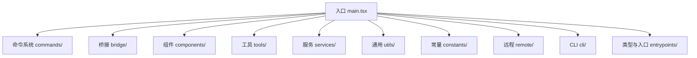
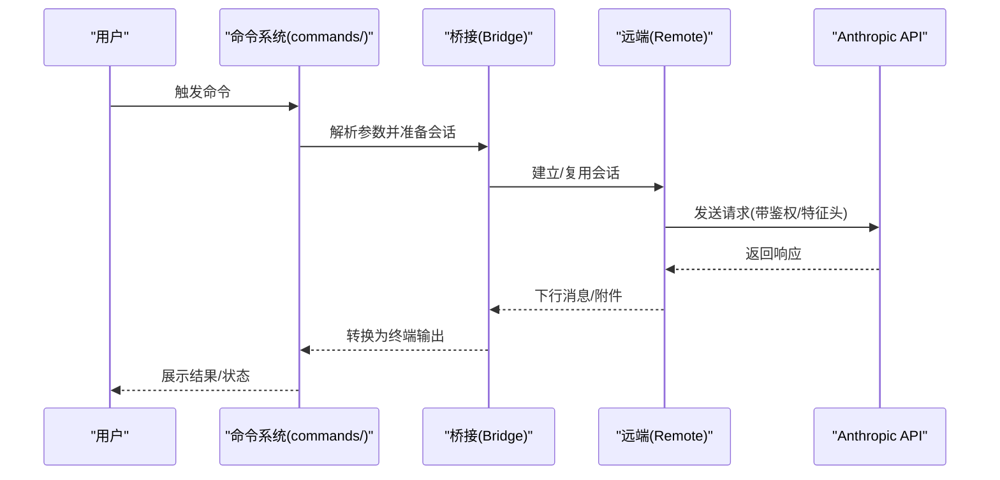
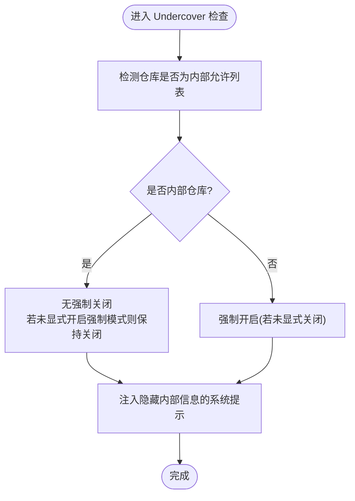
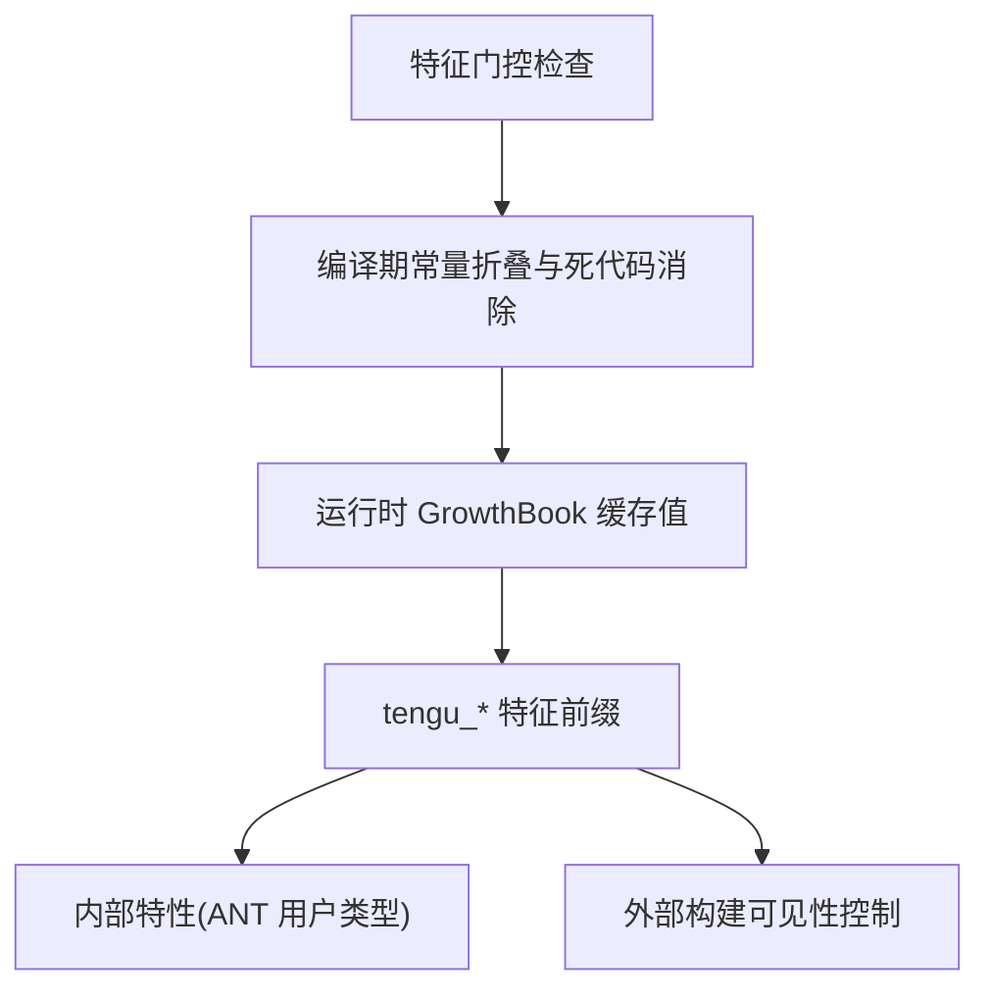
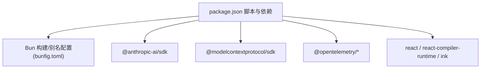

# 贡献指南

<cite>
**本文引用的文件**
- [README.md](file://README.md)
- [package.json](file://package.json)
- [bunfig.toml](file://bunfig.toml)
- [commands.ts](file://commands.ts)
- [main.tsx](file://main.tsx)
- [utils/undercover.ts](file://utils/undercover.ts)
- [constants/betas.ts](file://constants/betas.ts)
- [constants/systemPromptSections.ts](file://constants/systemPromptSections.ts)
- [bridge/bridgeApi.ts](file://bridge/bridgeApi.ts)
- [bridge/bridgeConfig.ts](file://bridge/bridgeConfig.ts)
- [bridge/bridgeMain.ts](file://bridge/bridgeMain.ts)
- [bridge/bridgeUI.ts](file://bridge/bridgeUI.ts)
- [bridge/createSession.ts](file://bridge/createSession.ts)
- [bridge/sessionRunner.ts](file://bridge/sessionRunner.ts)
- [bridge/types.ts](file://bridge/types.ts)
- [bridge/workSecret.ts](file://bridge/workSecret.ts)
- [bridge/envLessBridgeConfig.ts](file://bridge/envLessBridgeConfig.ts)
- [bridge/pollConfig.ts](file://bridge/pollConfig.ts)
- [bridge/pollConfigDefaults.ts](file://bridge/pollConfigDefaults.ts)
- [bridge/flushGate.ts](file://bridge/flushGate.ts)
- [bridge/inboundMessages.ts](file://bridge/inboundMessages.ts)
- [bridge/inboundAttachments.ts](file://bridge/inboundAttachments.ts)
- [bridge/remoteBridgeCore.ts](file://bridge/remoteBridgeCore.ts)
- [bridge/replBridge.ts](file://bridge/replBridge.ts)
- [bridge/replBridgeHandle.ts](file://bridge/replBridgeHandle.ts)
- [bridge/replBridgeTransport.ts](file://bridge/replBridgeTransport.ts)
- [bridge/sessionIdCompat.ts](file://bridge/sessionIdCompat.ts)
- [bridge/trustedDevice.ts](file://bridge/trustedDevice.ts)
- [bridge/capacityWake.ts](file://bridge/capacityWake.ts)
- [bridge/codeSessionApi.ts](file://bridge/codeSessionApi.ts)
- [bridge/initReplBridge.ts](file://bridge/initReplBridge.ts)
- [bridge/jwtUtils.ts](file://bridge/jwtUtils.ts)
- [bridge/bridgeEnabled.ts](file://bridge/bridgeEnabled.ts)
- [bridge/bridgeStatusUtil.ts](file://bridge/bridgeStatusUtil.ts)
- [bridge/bridgePermissionCallbacks.ts](file://bridge/bridgePermissionCallbacks.ts)
- [bridge/bridgePointer.ts](file://bridge/bridgePointer.ts)
- [bridge/bridgeDebug.ts](file://bridge/bridgeDebug.ts)
- [bridge/debugUtils.ts](file://bridge/debugUtils.ts)
- [bridge/agentSdkTypes.ts](file://entrypoints/agentSdkTypes.ts)
- [bridge/bridgeApi.ts](file://bridge/bridgeApi.ts)
- [bridge/bridgeConfig.ts](file://bridge/bridgeConfig.ts)
- [bridge/bridgeMain.ts](file://bridge/bridgeMain.ts)
- [bridge/bridgeUI.ts](file://bridge/bridgeUI.ts)
- [bridge/createSession.ts](file://bridge/createSession.ts)
- [bridge/sessionRunner.ts](file://bridge/sessionRunner.ts)
- [bridge/types.ts](file://bridge/types.ts)
- [bridge/workSecret.ts](file://bridge/workSecret.ts)
- [bridge/envLessBridgeConfig.ts](file://bridge/envLessBridgeConfig.ts)
- [bridge/pollConfig.ts](file://bridge/pollConfig.ts)
- [bridge/pollConfigDefaults.ts](file://bridge/pollConfigDefaults.ts)
- [bridge/flushGate.ts](file://bridge/flushGate.ts)
- [bridge/inboundMessages.ts](file://bridge/inboundMessages.ts)
- [bridge/inboundAttachments.ts](file://bridge/inboundAttachments.ts)
- [bridge/remoteBridgeCore.ts](file://bridge/remoteBridgeCore.ts)
- [bridge/replBridge.ts](file://bridge/replBridge.ts)
- [bridge/replBridgeHandle.ts](file://bridge/replBridgeHandle.ts)
- [bridge/replBridgeTransport.ts](file://bridge/replBridgeTransport.ts)
- [bridge/sessionIdCompat.ts](file://bridge/sessionIdCompat.ts)
- [bridge/trustedDevice.ts](file://bridge/trustedDevice.ts)
- [bridge/capacityWake.ts](file://bridge/capacityWake.ts)
- [bridge/codeSessionApi.ts](file://bridge/codeSessionApi.ts)
- [bridge/initReplBridge.ts](file://bridge/initReplBridge.ts)
- [bridge/jwtUtils.ts](file://bridge/jwtUtils.ts)
- [bridge/bridgeEnabled.ts](file://bridge/bridgeEnabled.ts)
- [bridge/bridgeStatusUtil.ts](file://bridge/bridgeStatusUtil.ts)
- [bridge/bridgePermissionCallbacks.ts](file://bridge/bridgePermissionCallbacks.ts)
- [bridge/bridgePointer.ts](file://bridge/bridgePointer.ts)
- [bridge/bridgeDebug.ts](file://bridge/bridgeDebug.ts)
- [bridge/debugUtils.ts](file://bridge/debugUtils.ts)
- [bridge/agentSdkTypes.ts](file://entrypoints/agentSdkTypes.ts)
</cite>

## 目录
1. 引言
2. 项目结构
3. 核心组件
4. 架构总览
5. 详细组件分析
6. 依赖关系分析
7. 性能考量
8. 故障排查指南
9. 结论
10. 附录

## 引言
本指南面向希望参与 Claude Code 项目的贡献者，系统化阐述代码提交规范、分支管理策略、Pull Request 流程、代码审查标准、测试要求、文档更新规范，并给出新功能开发与 Bug 修复流程、向后兼容性注意事项。同时提供社区行为准则、沟通渠道、问题报告模板以及贡献者权益与项目治理结构说明。

Claude Code 是由 Anthropic 官方发布的 AI 编码 CLI 工具，具备多代理编排、远程会话桥接、权限与安全控制、工具生态、系统提示模块化架构等复杂能力。仓库中包含大量内部特性与安全机制（如 Undercover 模式、特征门控、桥接通道等），这些内容对贡献者理解项目背景与边界至关重要。

章节来源
- [README.md:1-463](file://README.md#L1-L463)

## 项目结构
该项目采用以功能域与层次划分相结合的组织方式：
- 入口与运行时：入口点 main.tsx、应用初始化 setup.ts、主程序 main.tsx
- 命令体系：commands/ 下按功能分组的命令实现与索引
- 桥接层：bridge/ 提供与 claude.ai 的桥接、会话管理、传输与安全
- 组件与 UI：components/、hooks/、ink/ 等前端渲染与交互
- 工具与服务：tools/、services/、utils/ 提供核心能力与通用工具
- 配置与常量：constants/、entrypoints/、schemas/、types/ 等
- 远端与 SDK：remote/、entrypoints/sdk/、entrypoints/agentSdkTypes.ts
- CLI 传输与处理器：cli/ 包含 handlers/ 与 transports/

图表来源
- [main.tsx](file://main.tsx)
- [commands.ts](file://commands.ts)
- [bridge/bridgeMain.ts](file://bridge/bridgeMain.ts)
- [bridge/types.ts](file://bridge/types.ts)
- [constants/systemPromptSections.ts](file://constants/systemPromptSections.ts)
- [entrypoints/agentSdkTypes.ts](file://entrypoints/agentSdkTypes.ts)

章节来源
- [package.json:1-113](file://package.json#L1-L113)
- [bunfig.toml:1-4](file://bunfig.toml#L1-L4)

## 核心组件
- 入口与构建
  - 构建脚本通过 bun build 打包，支持内联 sourcemap 用于开发调试；类型检查使用 tsc。
  - 别名配置将 react/compiler-runtime 指向 react-compiler-runtime，提升运行时性能。
- 命令系统
  - commands.ts 汇总命令注册与路由，commands/ 下按功能模块化组织命令实现与索引。
- 桥接通道
  - bridge/ 提供与 claude.ai 的桥接能力，包括会话创建、消息收发、权限回调、可信设备、工作密钥、轮询配置、REPL 桥接等。
- 权限与安全
  - Undercover 模式在公开仓库中限制内部信息泄露；工具权限分级与路径遍历防护确保操作安全。
- 特征门控与内部特性
  - 通过 compile-time feature flags 控制外部构建中的死代码消除；内部特性（如 KAIROS、Coordinator Mode、Buddy）受环境变量与用户类型控制。

章节来源
- [package.json:6-10](file://package.json#L6-L10)
- [bunfig.toml:1-4](file://bunfig.toml#L1-L4)
- [commands.ts](file://commands.ts)
- [utils/undercover.ts](file://utils/undercover.ts)
- [constants/betas.ts:365-383](file://constants/betas.ts#L365-L383)

## 架构总览
下图展示了从命令到桥接、再到远端服务的整体调用链路与数据流：

图表来源
- [commands.ts](file://commands.ts)
- [bridge/bridgeApi.ts](file://bridge/bridgeApi.ts)
- [bridge/createSession.ts](file://bridge/createSession.ts)
- [bridge/sessionRunner.ts](file://bridge/sessionRunner.ts)
- [bridge/inboundMessages.ts](file://bridge/inboundMessages.ts)
- [bridge/inboundAttachments.ts](file://bridge/inboundAttachments.ts)
- [remote/RemoteSessionManager.ts](file://remote/RemoteSessionManager.ts)

## 详细组件分析

### 桥接通道（Bridge）
桥接层负责本地与远端会话的建立、消息传递、权限控制与安全校验。其核心职责包括：
- 会话生命周期管理：创建、复用、关闭
- 消息与附件处理：入站消息解析、附件提取
- 权限回调：根据用户授权与风险级别执行动作
- 安全与可信：JWT 鉴权、可信设备令牌、工作密钥
- 配置与轮询：环境无关配置、轮询策略与默认值
- REPL 与传输：REPL 桥接、传输抽象与容量唤醒

```mermaid
classDiagram
class BridgeApi {
+send()
+request()
}
class BridgeConfig {
+get()
+set()
}
class BridgeMain {
+init()
+shutdown()
}
class BridgeUI {
+render()
}
class CreateSession {
+create()
}
class SessionRunner {
+run()
+stop()
}
class Types {
+SessionId
+WorkSecret
}
class WorkSecret {
+generate()
+validate()
}
class EnvLessBridgeConfig {
+load()
}
class PollConfig {
+get()
}
class PollConfigDefaults {
+defaults
}
class FlushGate {
+open()
+close()
}
class InboundMessages {
+handle()
}
class InboundAttachments {
+extract()
}
class RemoteBridgeCore {
+relay()
}
class ReplBridge {
+attach()
}
class ReplBridgeHandle {
+dispatch()
}
class ReplBridgeTransport {
+send()
}
class SessionIdCompat {
+normalize()
}
class TrustedDevice {
+register()
}
class CapacityWake {
+activate()
}
class CodeSessionApi {
+list()
}
class InitReplBridge {
+setup()
}
class JwtUtils {
+sign()
+verify()
}
class BridgeEnabled {
+check()
}
class BridgeStatusUtil {
+getStatus()
}
class BridgePermissionCallbacks {
+onApprove()
+onDeny()
}
class BridgePointer {
+get()
}
class BridgeDebug {
+log()
}
class DebugUtils {
+format()
}
BridgeMain --> BridgeApi : "使用"
BridgeMain --> CreateSession : "创建会话"
BridgeMain --> SessionRunner : "运行会话"
BridgeMain --> BridgeUI : "渲染界面"
BridgeMain --> Types : "类型约束"
BridgeMain --> WorkSecret : "工作密钥"
BridgeMain --> EnvLessBridgeConfig : "加载配置"
BridgeMain --> PollConfig : "轮询策略"
BridgeMain --> PollConfigDefaults : "默认值"
BridgeMain --> FlushGate : "门控"
BridgeMain --> InboundMessages : "处理消息"
BridgeMain --> InboundAttachments : "处理附件"
BridgeMain --> RemoteBridgeCore : "远端中继"
BridgeMain --> ReplBridge : "REPL桥接"
BridgeMain --> ReplBridgeHandle : "调度"
BridgeMain --> ReplBridgeTransport : "传输"
BridgeMain --> SessionIdCompat : "会话ID兼容"
BridgeMain --> TrustedDevice : "可信设备"
BridgeMain --> CapacityWake : "容量唤醒"
BridgeMain --> CodeSessionApi : "会话API"
BridgeMain --> InitReplBridge : "初始化"
BridgeMain --> JwtUtils : "JWT工具"
BridgeMain --> BridgeEnabled : "启用检查"
BridgeMain --> BridgeStatusUtil : "状态工具"
BridgeMain --> BridgePermissionCallbacks : "权限回调"
BridgeMain --> BridgePointer : "指针"
BridgeMain --> BridgeDebug : "调试"
BridgeMain --> DebugUtils : "调试工具"
```

图表来源
- [bridge/bridgeApi.ts](file://bridge/bridgeApi.ts)
- [bridge/bridgeConfig.ts](file://bridge/bridgeConfig.ts)
- [bridge/bridgeMain.ts](file://bridge/bridgeMain.ts)
- [bridge/bridgeUI.ts](file://bridge/bridgeUI.ts)
- [bridge/createSession.ts](file://bridge/createSession.ts)
- [bridge/sessionRunner.ts](file://bridge/sessionRunner.ts)
- [bridge/types.ts](file://bridge/types.ts)
- [bridge/workSecret.ts](file://bridge/workSecret.ts)
- [bridge/envLessBridgeConfig.ts](file://bridge/envLessBridgeConfig.ts)
- [bridge/pollConfig.ts](file://bridge/pollConfig.ts)
- [bridge/pollConfigDefaults.ts](file://bridge/pollConfigDefaults.ts)
- [bridge/flushGate.ts](file://bridge/flushGate.ts)
- [bridge/inboundMessages.ts](file://bridge/inboundMessages.ts)
- [bridge/inboundAttachments.ts](file://bridge/inboundAttachments.ts)
- [bridge/remoteBridgeCore.ts](file://bridge/remoteBridgeCore.ts)
- [bridge/replBridge.ts](file://bridge/replBridge.ts)
- [bridge/replBridgeHandle.ts](file://bridge/replBridgeHandle.ts)
- [bridge/replBridgeTransport.ts](file://bridge/replBridgeTransport.ts)
- [bridge/sessionIdCompat.ts](file://bridge/sessionIdCompat.ts)
- [bridge/trustedDevice.ts](file://bridge/trustedDevice.ts)
- [bridge/capacityWake.ts](file://bridge/capacityWake.ts)
- [bridge/codeSessionApi.ts](file://bridge/codeSessionApi.ts)
- [bridge/initReplBridge.ts](file://bridge/initReplBridge.ts)
- [bridge/jwtUtils.ts](file://bridge/jwtUtils.ts)
- [bridge/bridgeEnabled.ts](file://bridge/bridgeEnabled.ts)
- [bridge/bridgeStatusUtil.ts](file://bridge/bridgeStatusUtil.ts)
- [bridge/bridgePermissionCallbacks.ts](file://bridge/bridgePermissionCallbacks.ts)
- [bridge/bridgePointer.ts](file://bridge/bridgePointer.ts)
- [bridge/bridgeDebug.ts](file://bridge/bridgeDebug.ts)
- [bridge/debugUtils.ts](file://bridge/debugUtils.ts)

章节来源
- [bridge/bridgeMain.ts](file://bridge/bridgeMain.ts)
- [bridge/bridgeApi.ts](file://bridge/bridgeApi.ts)
- [bridge/createSession.ts](file://bridge/createSession.ts)
- [bridge/sessionRunner.ts](file://bridge/sessionRunner.ts)
- [bridge/types.ts](file://bridge/types.ts)

### Undercover 模式与安全边界
Undercover 模式用于在公开/开源仓库中隐藏内部信息，防止在提交信息与 PR 中泄露内部命名与上下文。该模式通过系统提示注入与环境判断自动启用，并提供强制开关。

图表来源
- [utils/undercover.ts](file://utils/undercover.ts)

章节来源
- [utils/undercover.ts](file://utils/undercover.ts)
- [README.md:206-244](file://README.md#L206-L244)

### 特征门控与内部特性
项目广泛使用 compile-time feature flags 控制外部构建中的死代码消除，并通过运行时 GrowthBook 缓存值进行门控。内部特性（如 KAIROS、Coordinator Mode、Buddy 等）受用户类型与环境变量控制。

图表来源
- [README.md:389-414](file://README.md#L389-L414)

章节来源
- [README.md:389-414](file://README.md#L389-L414)

## 依赖关系分析
- 构建与打包
  - 使用 Bun 作为目标运行时，bunfig.toml 提供别名优化；package.json 定义 build 与 typecheck 脚本。
- 外部依赖
  - @anthropic-ai/sdk、@modelcontextprotocol/sdk、@opentelemetry/* 等用于 API 通信、MCP 协议与可观测性。
- 前端与终端
  - react、react-compiler-runtime、ink 等用于终端 UI 渲染与交互。

图表来源
- [package.json:6-10](file://package.json#L6-L10)
- [package.json:11-101](file://package.json#L11-L101)
- [bunfig.toml:1-4](file://bunfig.toml#L1-L4)

章节来源
- [package.json:1-113](file://package.json#L1-L113)
- [bunfig.toml:1-4](file://bunfig.toml#L1-L4)

## 性能考量
- 构建优化
  - 内联 sourcemap 仅在开发构建中启用，生产构建启用压缩与别名优化，减少体积与提升启动性能。
- 运行时缓存
  - 特征门控值采用缓存策略，避免阻塞主线程；工具 Schema 缓存降低提示开销。
- I/O 与网络
  - 桥接层的消息与附件处理采用异步与批处理策略，结合轮询配置与容量唤醒机制平衡实时性与资源占用。

章节来源
- [package.json:6-10](file://package.json#L6-L10)
- [constants/systemPromptSections.ts](file://constants/systemPromptSections.ts)

## 故障排查指南
- 构建失败
  - 确认 Bun 版本与别名配置一致；检查内联 sourcemap 是否导致调试成本过高。
- 权限与安全
  - Undercover 模式下避免在提交信息中出现内部命名；确认工具权限分级与路径遍历防护生效。
- 桥接异常
  - 检查会话创建与轮询配置；验证 JWT 鉴权与可信设备令牌；确认 REPL 桥接与传输链路。
- 日志与调试
  - 使用桥接调试工具与日志格式化函数定位问题；必要时开启桥接调试开关。

章节来源
- [bridge/bridgeDebug.ts](file://bridge/bridgeDebug.ts)
- [bridge/debugUtils.ts](file://bridge/debugUtils.ts)
- [bridge/bridgeStatusUtil.ts](file://bridge/bridgeStatusUtil.ts)
- [utils/undercover.ts](file://utils/undercover.ts)

## 结论
本指南为 Claude Code 项目的贡献者提供了从提交规范、分支策略到审查标准、测试与文档更新的全流程说明，并结合项目内部特性与安全边界给出实践建议。遵循上述流程与规范，有助于提升协作效率与代码质量，同时确保在公开与内部环境中的合规与安全。

## 附录

### 代码提交规范
- 提交信息
  - 采用主题与描述分层，避免包含内部命名或敏感信息（Undercover 模式下尤其注意）。
- 分支命名
  - feature/xxx、fix/xxx、docs/xxx、chore/xxx 等语义化前缀。
- 提交粒度
  - 小步提交，聚焦单一变更；每个提交应可独立通过测试与审查。

章节来源
- [utils/undercover.ts](file://utils/undercover.ts)

### 分支管理策略
- 主分支保护
  - 严禁直接推送至主分支；所有变更必须通过 Pull Request 合并。
- 分支清理
  - 功能分支在合并后及时删除，保持仓库整洁。

### Pull Request 流程
- 创建 PR
  - 选择正确的基线分支；填写清晰的标题与描述；关联相关 Issue。
- 代码审查
  - 至少一名维护者审查；关注安全性、性能与可维护性；Undercover 模式下的信息披露需特别审慎。
- CI 与测试
  - 通过类型检查与相关测试；确保构建产物符合预期。
- 合并
  - 通过审查与 CI 后方可合并；必要时进行 Squash 或 Rebase 以保持历史整洁。

章节来源
- [package.json:9](file://package.json#L9)

### 代码审查标准
- 正确性
  - 逻辑正确、边界条件覆盖、错误处理完备。
- 可读性
  - 命名清晰、注释充分、模块职责单一。
- 安全性
  - 避免硬编码敏感信息；Undercover 模式下严格限制内部信息暴露。
- 性能
  - 避免不必要的计算与 I/O；合理使用缓存与异步处理。
- 兼容性
  - 不破坏现有 API；必要时提供迁移指南。

章节来源
- [utils/undercover.ts](file://utils/undercover.ts)
- [constants/systemPromptSections.ts](file://constants/systemPromptSections.ts)

### 测试要求
- 单元测试
  - 关键工具与服务需有单元测试覆盖；测试用例应覆盖正常与异常路径。
- 集成测试
  - 桥接通道与命令系统需进行集成测试，模拟真实会话与消息流转。
- 类型检查
  - 通过 tsc --noEmit 确保类型安全。

章节来源
- [package.json:9](file://package.json#L9)

### 文档更新规范
- 新增功能
  - 在 README 或对应模块文档中补充使用说明与注意事项。
- 变更记录
  - 对外接口变更需更新变更日志；内部特性变更需在相应模块文档中标注。
- 示例与教程
  - 提供最小可运行示例与常见问题解答。

章节来源
- [README.md:1-463](file://README.md#L1-L463)

### 新功能开发流程
- 需求评审
  - 明确需求背景与影响范围；评估安全性与性能影响。
- 设计与原型
  - 输出设计文档与原型；确定对外 API 与内部接口。
- 实现
  - 遵循提交规范与分支策略；编写测试与文档。
- 审查与发布
  - 代码审查与 CI 通过后合并；按需发布预览版本。

### Bug 修复流程
- 报告与复现
  - 提供最小复现步骤与环境信息；分类为严重/中等/轻微。
- 修复与验证
  - 编写针对性测试；回归验证相关功能。
- 合并与跟进
  - 合并后持续观察；必要时回滚与二次修复。

### 向后兼容性考虑
- 接口稳定性
  - 避免破坏性变更；提供迁移路径与弃用时间表。
- 特性门控
  - 内部特性通过门控与用户类型隔离；对外发布前统一评估。
- 数据与配置
  - 配置项变更需提供迁移脚本；保留向后兼容的默认值。

章节来源
- [constants/betas.ts:365-383](file://constants/betas.ts#L365-L383)
- [README.md:389-414](file://README.md#L389-L414)

### 社区行为准则
- 尊重与包容
  - 保持尊重、开放与包容的交流氛围。
- 透明与协作
  - 积极分享知识与经验；鼓励建设性反馈。
- 安全与隐私
  - 不泄露内部信息；遵守 Undercover 模式要求。

章节来源
- [utils/undercover.ts](file://utils/undercover.ts)

### 沟通渠道
- 讨论与反馈
  - 通过 Issue 与 Discussion 进行需求与问题讨论。
- 实时沟通
  - 使用团队指定的即时通讯渠道进行紧急协调。

### 问题报告模板
- 标题
  - 简洁明确的问题摘要
- 环境
  - 操作系统、Node/Bun 版本、Claude Code 版本
- 复现步骤
  - 最小可复现步骤
- 预期行为
  - 描述期望结果
- 实际行为
  - 描述实际结果与错误信息
- 附加信息
  - 截图、日志片段、相关链接

### 贡献者权益与项目治理
- 权益
  - 贡献者在被认可后可获得相应的权限与激励。
- 治理
  - 重大变更需经过维护者评审与社区讨论；Undercover 模式下的安全边界由专门团队负责。

章节来源
- [README.md:206-244](file://README.md#L206-L244)