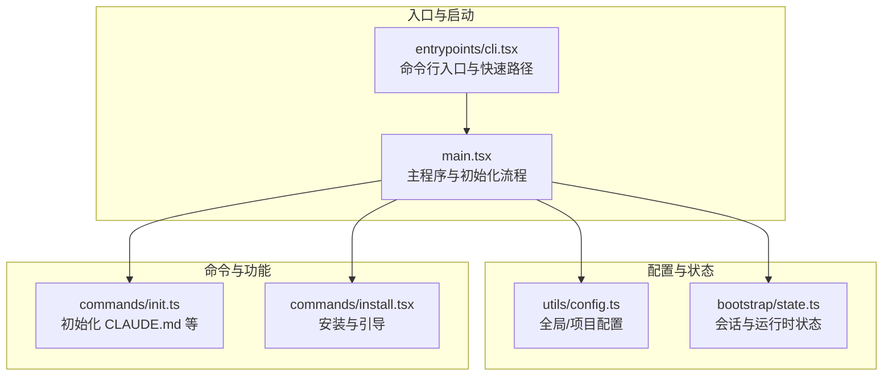
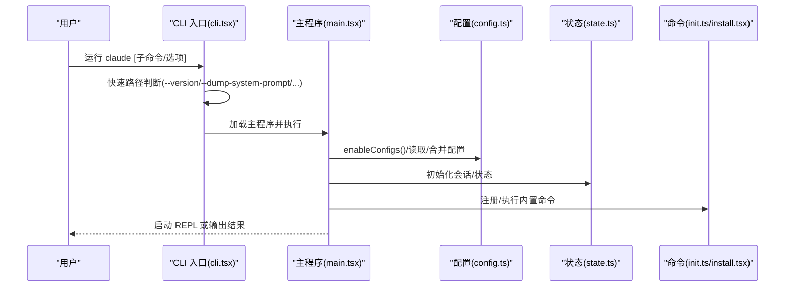
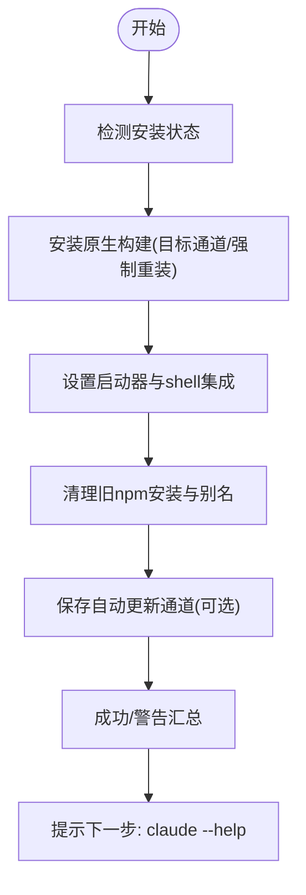
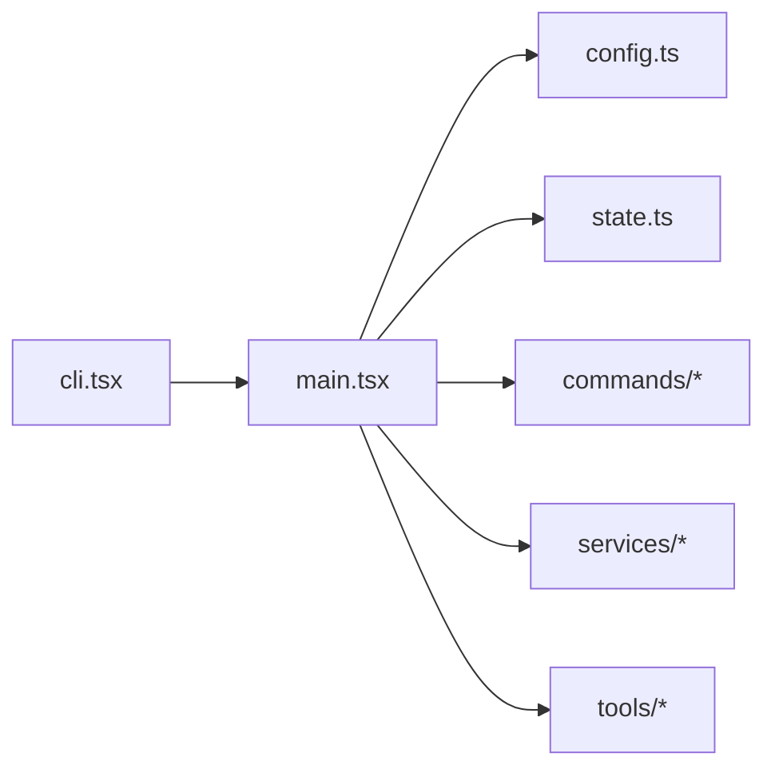

# 快速开始

<cite>
**本文引用的文件**
- [README.md](file://README.md)
- [cli.tsx](file://entrypoints/cli.tsx)
- [main.tsx](file://main.tsx)
- [config.ts](file://utils/config.ts)
- [install.tsx](file://commands/install.tsx)
- [init.ts](file://commands/init.ts)
- [state.ts](file://bootstrap/state.ts)
</cite>

## 目录
1. [简介](#简介)
2. [项目结构](#项目结构)
3. [核心组件](#核心组件)
4. [架构总览](#架构总览)
5. [详细组件分析](#详细组件分析)
6. [依赖分析](#依赖分析)
7. [性能考虑](#性能考虑)
8. [故障排除指南](#故障排除指南)
9. [结论](#结论)
10. [附录](#附录)

## 简介
本指南面向首次接触 Claude Code 的用户，帮助你在最短时间内完成安装、初始化与基础使用。文档覆盖系统要求、依赖安装、初始配置、基本使用流程、常见初始化选项与最佳实践，并提供故障排除建议与常见问题解答。对于有经验的用户，我们也在“进阶配置”部分提供了可选的高级开关与环境变量说明。

## 项目结构
Claude Code 是一个基于 Bun 的终端 CLI 工具，采用模块化设计，入口文件负责解析命令行参数与快速路径优化，随后按需加载主逻辑与 UI 渲染层。关键目录与职责概览如下：
- entrypoints：程序入口与子命令分发（如 CLI 入口、MCP 服务等）
- commands：内置命令实现（如 init、install、login 等）
- utils：通用工具函数（配置、权限、模型、设置、诊断等）
- bootstrap：全局状态管理（会话 ID、计时器、指标等）
- services：外部服务集成（分析、MCP、策略限制等）
- tools：工具集（文件读写、搜索、终端、浏览器、技能等）

**图表来源**
- [cli.tsx](file://entrypoints/cli.tsx)
- [main.tsx](file://main.tsx)
- [config.ts](file://utils/config.ts)
- [state.ts](file://bootstrap/state.ts)
- [init.ts](file://commands/init.ts)
- [install.tsx](file://commands/install.tsx)

**章节来源**
- [README.md](file://README.md)
- [cli.tsx](file://entrypoints/cli.tsx)
- [main.tsx](file://main.tsx)

## 核心组件
- 命令行入口（entrypoints/cli.tsx）：支持版本查询、系统提示导出、桥接模式、守护进程、后台会话管理、模板作业、环境运行器、自托管运行器、工作树与 tmux 集成等快速路径，避免不必要的模块加载。
- 主程序（main.tsx）：负责信任对话框、策略限制、遥测、迁移、插件与技能加载、命令注册、REPL 启动等。
- 配置系统（utils/config.ts）：定义全局与项目级配置键、信任检查、设置来源过滤、远程控制启动策略等。
- 安装命令（commands/install.tsx）：本地原生构建安装、启动器与 shell 集成设置、清理旧 npm 安装与别名、自动更新通道保存。
- 初始化命令（commands/init.ts）：生成/更新 CLAUDE.md、个人偏好 CLAUDE.local.md、技能与钩子建议、GitHub CLI 与 Lint 检查等。

**章节来源**
- [cli.tsx](file://entrypoints/cli.tsx)
- [main.tsx](file://main.tsx)
- [config.ts](file://utils/config.ts)
- [install.tsx](file://commands/install.tsx)
- [init.ts](file://commands/init.ts)

## 架构总览
下图展示了从启动到进入交互式 REPL 的关键调用链，以及与配置、状态、命令系统的交互关系。

**图表来源**
- [cli.tsx](file://entrypoints/cli.tsx)
- [main.tsx](file://main.tsx)
- [config.ts](file://utils/config.ts)
- [state.ts](file://bootstrap/state.ts)
- [init.ts](file://commands/init.ts)
- [install.tsx](file://commands/install.tsx)

## 详细组件分析

### 安装与初始化
- 安装流程要点
  - 优先安装原生构建，随后进行启动器与 shell 集成设置
  - 清理旧的 npm 安装与历史别名
  - 可通过目标通道（latest/stable/版本号）或强制重装
  - 成功后记录版本与安装位置，并给出下一步提示
- 初始化流程要点
  - 生成/更新 CLAUDE.md 与 CLAUDE.local.md
  - 探测项目结构、语言/包管理器、测试/格式化/构建命令
  - 询问团队与个人偏好，生成技能与钩子建议
  - 可选安装 GitHub CLI、Lint 规则等

**图表来源**
- [install.tsx](file://commands/install.tsx)

**章节来源**
- [install.tsx](file://commands/install.tsx)
- [init.ts](file://commands/init.ts)

### 基本使用流程
- 启动应用
  - 查看版本：claude --version
  - 导出系统提示：claude --dump-system-prompt [--model 模型]
  - 进入交互式 REPL：直接运行 claude
- 执行第一个命令
  - 使用内置命令：claude /help 查看可用命令
  - 初始化项目：claude /init（根据向导生成 CLAUDE.md 与技能）
  - 安装依赖：claude /install（安装原生构建与集成）
- 退出与后台管理
  - 退出：Ctrl+C 或 /exit
  - 后台会话：claude ps/logs/attach/kill 或 --bg/--background

**章节来源**
- [cli.tsx](file://entrypoints/cli.tsx)
- [main.tsx](file://main.tsx)

### 常见初始化配置选项与最佳实践
- 初始化向导
  - 选择生成项目级 CLAUDE.md 或个人偏好 CLAUDE.local.md，或两者
  - 是否同时设置技能与钩子；钩子更严格（不可跳过），技能按需触发
  - 自动探测构建/测试/格式化命令，避免重复信息
- 个人偏好
  - 角色、对代码库熟悉度、沙箱/测试账户、沟通偏好等
  - 多工作树场景下的个人指令存放位置
- 团队协作
  - 将 CLAUDE.md 放入源码控制，CLAUDE.local.md.gitignore
  - 使用 .claude/skills/ 与 .claude/rules/ 组织知识与规则
- 最佳实践
  - 保持 CLAUDE.md 精简，仅包含“缺少就会出错”的信息
  - 使用钩子自动化格式化/测试/校验；使用技能承载复杂流程
  - 为不同子目录添加局部规则文件，提升定位性

**章节来源**
- [init.ts](file://commands/init.ts)

### 进阶配置选项
- 环境变量与快速路径
  - --bare：跳过预取与非必要初始化，加速启动
  - --settings 与 --setting-sources：在启动前注入/限定设置来源
  - --dump-system-prompt：导出渲染后的系统提示用于评测
- 远程与桥接
  - remote-control/rc/sync/bridge 子命令：启用远程控制模式（需登录与策略允许）
  - --daemon：长驻守护进程（内部特性）
  - --worktree 与 --tmux：工作树与 tmux 集成
- 模型与性能
  - --model：指定主循环模型
  - fast-mode（内部）：加速模式头信息（由 beta 头部控制）
- 权限与安全
  - bypass 权限模式、自动权限模式、受保护命名空间检测
  - 信任对话框接受状态缓存与持久化

**章节来源**
- [cli.tsx](file://entrypoints/cli.tsx)
- [main.tsx](file://main.tsx)
- [config.ts](file://utils/config.ts)

## 依赖分析
- 运行时与平台
  - 基于 Bun 的原生构建与动态导入，减少冷启动时间
  - 跨平台支持（Windows/macOS/Linux），路径与权限处理差异
- 外部服务
  - OAuth/订阅状态、MCP 服务器、策略限制、分析与遥测
- 内部模块耦合
  - CLI 入口与主程序解耦，通过快速路径避免无关模块加载
  - 配置与状态为全局单例，被广泛模块依赖

**图表来源**
- [cli.tsx](file://entrypoints/cli.tsx)
- [main.tsx](file://main.tsx)
- [config.ts](file://utils/config.ts)
- [state.ts](file://bootstrap/state.ts)

**章节来源**
- [cli.tsx](file://entrypoints/cli.tsx)
- [main.tsx](file://main.tsx)

## 性能考虑
- 启动性能
  - CLI 快速路径：版本查询、系统提示导出、桥接/守护/后台/模板/环境/自托管运行器等直接返回
  - --bare 模式跳过所有预取，适合脚本化与最小延迟场景
- 避免阻塞
  - 非交互模式下跳过信任对话框，直接预取系统上下文
  - 交互模式下仅在建立信任后才预取，防止潜在危险命令执行
- 缓存与复用
  - 设置来源与配置键缓存、GrowthBook/Statsig 特征缓存
  - 插件与技能加载缓存，减少重复 IO

**章节来源**
- [cli.tsx](file://entrypoints/cli.tsx)
- [main.tsx](file://main.tsx)
- [config.ts](file://utils/config.ts)

## 故障排除指南
- 安装失败
  - 另一进程正在安装：等待或使用 --force 强制重试
  - 清理旧 npm 安装与别名后重试
  - 检查安装位置与 PATH 配置
- 登录与远程控制
  - 未登录或令牌无效：先执行登录流程
  - 策略限制禁用远程控制：联系管理员或检查组织策略
- 权限与信任
  - 信任对话框未显示：确认当前目录是否已接受信任
  - bypass 权限模式：谨慎使用，仅在必要时开启
- 系统提示导出
  - 导出失败：确认已启用配置与模型参数正确
- 常见错误排查清单
  - 检查网络与代理设置
  - 清理临时文件与缓存
  - 更新到最新版本或切换自动更新通道

**章节来源**
- [install.tsx](file://commands/install.tsx)
- [main.tsx](file://main.tsx)
- [config.ts](file://utils/config.ts)

## 结论
通过本快速开始指南，你可以在几分钟内完成 Claude Code 的安装与初始化，并掌握基本的使用流程与常见配置。随着对工具的深入使用，建议逐步引入技能、钩子与团队共享规则，以获得更高效、一致的开发体验。遇到问题时，优先参考“故障排除指南”，并结合“进阶配置”中的开关与环境变量进行调试与优化。

## 附录
- 常用命令速查
  - claude --version：查看版本
  - claude --dump-system-prompt [--model 模型]：导出系统提示
  - claude /install：安装原生构建与集成
  - claude /init：初始化 CLAUDE.md 与技能
  - claude ps/logs/attach/kill：后台会话管理
  - claude --help：查看帮助
- 环境变量与开关
  - CLAUDE_CODE_EXIT_AFTER_FIRST_RENDER：仅测量启动性能（跳过后续预取）
  - CLAUDE_CODE_BARE：启动时跳过预取（--bare）
  - CLAUDE_CODE_REMOTE=1：在容器/远程环境中调整内存上限
  - --settings 与 --setting-sources：注入/限定设置来源
  - fast-mode（内部）：通过 beta 头部启用加速模式

**章节来源**
- [cli.tsx](file://entrypoints/cli.tsx)
- [main.tsx](file://main.tsx)
- [config.ts](file://utils/config.ts)