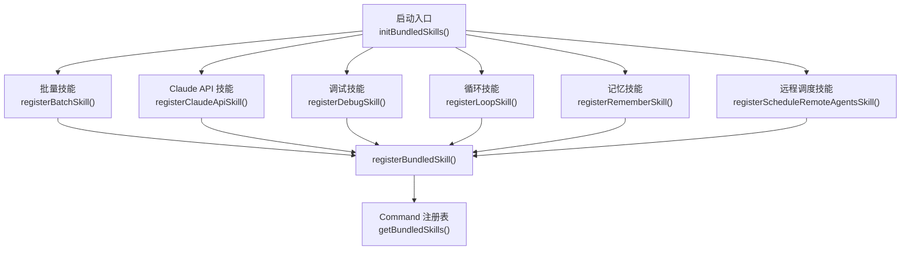
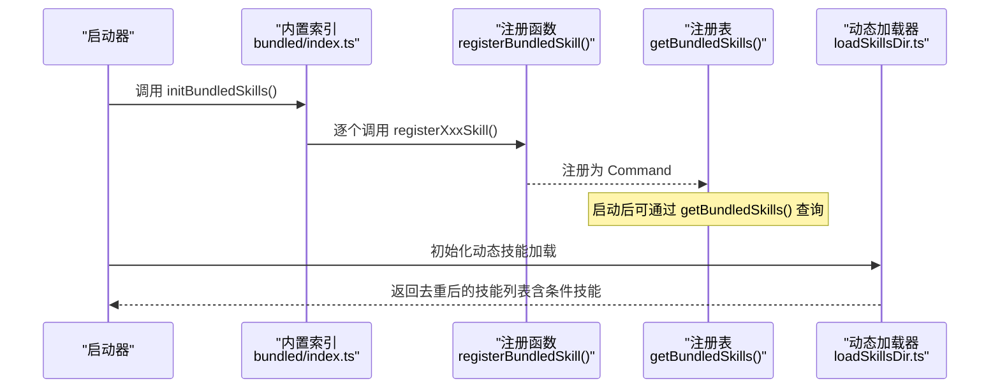
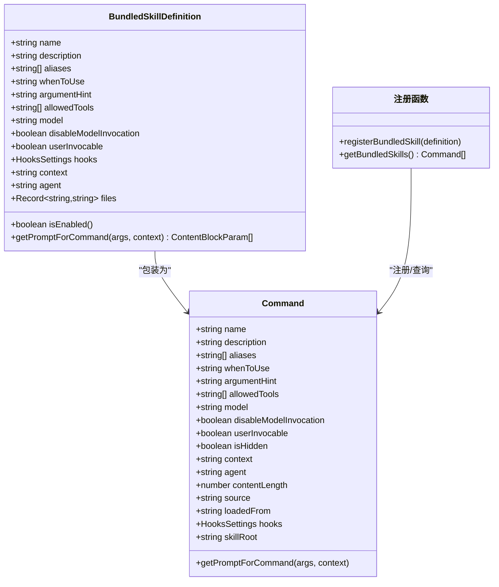
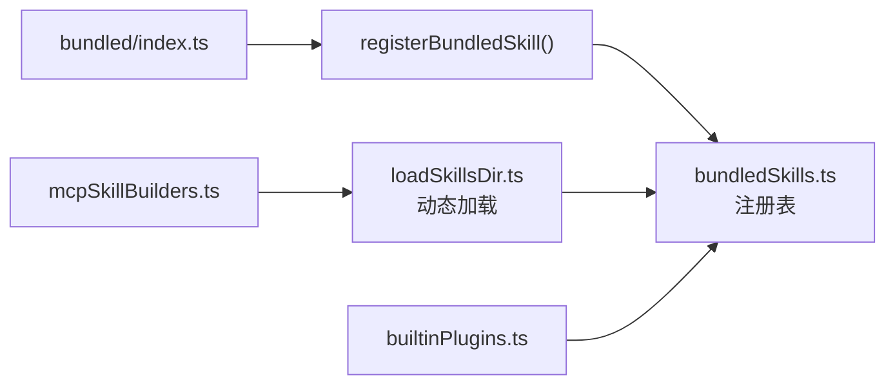

# 内置技能

<cite>
**本文引用的文件**
- [skills/bundled/index.ts](file://skills/bundled/index.ts)
- [skills/bundled/batch.ts](file://skills/bundled/batch.ts)
- [skills/bundled/claudeApi.ts](file://skills/bundled/claudeApi.ts)
- [skills/bundled/claudeApiContent.ts](file://skills/bundled/claudeApiContent.ts)
- [skills/bundled/debug.ts](file://skills/bundled/debug.ts)
- [skills/bundled/loop.ts](file://skills/bundled/loop.ts)
- [skills/bundled/remember.ts](file://skills/bundled/remember.ts)
- [skills/bundled/scheduleRemoteAgents.ts](file://skills/bundled/scheduleRemoteAgents.ts)
- [skills/bundledSkills.ts](file://skills/bundledSkills.ts)
- [skills/loadSkillsDir.ts](file://skills/loadSkillsDir.ts)
- [skills/mcpSkillBuilders.ts](file://skills/mcpSkillBuilders.ts)
- [plugins/builtinPlugins.ts](file://plugins/builtinPlugins.ts)
</cite>

## 目录
1. [简介](#简介)
2. [项目结构](#项目结构)
3. [核心组件](#核心组件)
4. [架构总览](#架构总览)
5. [详细组件分析](#详细组件分析)
6. [依赖关系分析](#依赖关系分析)
7. [性能考量](#性能考量)
8. [故障排查指南](#故障排查指南)
9. [结论](#结论)
10. [附录](#附录)

## 简介
本文件系统性阐述 Claude Code 的“内置技能”体系：概念、作用、优势、注册机制、加载流程与运行时行为，并对 batch、claudeApi、debug、loop、remember、scheduleRemoteAgents 等关键内置技能进行功能特性与使用方法详解。同时给出与用户自定义技能的区别与选择标准，以及实际使用示例与最佳实践。

## 项目结构
内置技能由“注册入口 + 技能定义 + 加载器 + 注册表”构成：
- 注册入口：在启动阶段集中调用各技能的 register 函数，完成一次性注册。
- 技能定义：每个技能以 registerXxxSkill 形式导出，内部通过 registerBundledSkill 注册为 Command。
- 加载器：负责从磁盘目录或插件中发现并加载技能；内置技能在启动时直接注册，不依赖动态加载。
- 注册表：维护已注册的技能集合，供后续查询与调用。

**图表来源**
- [skills/bundled/index.ts:24-79](file://skills/bundled/index.ts#L24-L79)
- [skills/bundled/batch.ts:100-124](file://skills/bundled/batch.ts#L100-L124)
- [skills/bundled/claudeApi.ts:180-196](file://skills/bundled/claudeApi.ts#L180-L196)
- [skills/bundled/debug.ts:12-103](file://skills/bundled/debug.ts#L12-L103)
- [skills/bundled/loop.ts:74-92](file://skills/bundled/loop.ts#L74-L92)
- [skills/bundled/remember.ts:4-82](file://skills/bundled/remember.ts#L4-L82)
- [skills/bundled/scheduleRemoteAgents.ts:324-447](file://skills/bundled/scheduleRemoteAgents.ts#L324-L447)
- [skills/bundledSkills.ts:53-108](file://skills/bundledSkills.ts#L53-L108)

**章节来源**
- [skills/bundled/index.ts:15-79](file://skills/bundled/index.ts#L15-L79)

## 核心组件
- 注册机制
  - 每个内置技能导出一个 registerXxxSkill 函数，在启动时被统一调用，通过 registerBundledSkill 将其包装为 Command 并加入注册表。
  - 注册表提供 getBundledSkills 获取全部内置技能副本，避免外部修改。
- 加载流程
  - 内置技能在启动阶段静态注册，不走动态加载路径；动态加载主要面向用户自定义技能与插件技能。
  - 动态加载器负责从策略/用户/项目/附加目录加载技能，去重与条件技能激活逻辑在此处实现。
- 运行时行为
  - 技能命令包含名称、描述、别名、允许工具、上下文、代理、钩子、是否可被用户调用等元数据。
  - getPromptForCommand 在首次调用时生成最终提示词，支持参数替换、环境变量注入、脚本执行等。

**章节来源**
- [skills/bundled/index.ts:15-79](file://skills/bundled/index.ts#L15-L79)
- [skills/bundled/batch.ts:100-124](file://skills/bundled/batch.ts#L100-L124)
- [skills/bundled/claudeApi.ts:180-196](file://skills/bundled/claudeApi.ts#L180-L196)
- [skills/bundled/debug.ts:12-103](file://skills/bundled/debug.ts#L12-L103)
- [skills/bundled/loop.ts:74-92](file://skills/bundled/loop.ts#L74-L92)
- [skills/bundled/remember.ts:4-82](file://skills/bundled/remember.ts#L4-L82)
- [skills/bundled/scheduleRemoteAgents.ts:324-447](file://skills/bundled/scheduleRemoteAgents.ts#L324-L447)
- [skills/bundledSkills.ts:53-108](file://skills/bundledSkills.ts#L53-L108)
- [skills/loadSkillsDir.ts:638-800](file://skills/loadSkillsDir.ts#L638-L800)

## 架构总览
内置技能与动态技能的加载路径分离，内置技能直接注册到注册表，动态技能通过加载器解析文件并创建 Command。

**图表来源**
- [skills/bundled/index.ts:24-79](file://skills/bundled/index.ts#L24-L79)
- [skills/bundled/batch.ts:100-124](file://skills/bundled/batch.ts#L100-L124)
- [skills/bundled/claudeApi.ts:180-196](file://skills/bundled/claudeApi.ts#L180-L196)
- [skills/bundled/debug.ts:12-103](file://skills/bundled/debug.ts#L12-L103)
- [skills/bundled/loop.ts:74-92](file://skills/bundled/loop.ts#L74-L92)
- [skills/bundled/remember.ts:4-82](file://skills/bundled/remember.ts#L4-L82)
- [skills/bundled/scheduleRemoteAgents.ts:324-447](file://skills/bundled/scheduleRemoteAgents.ts#L324-L447)
- [skills/bundledSkills.ts:53-108](file://skills/bundledSkills.ts#L53-L108)
- [skills/loadSkillsDir.ts:638-800](file://skills/loadSkillsDir.ts#L638-L800)

## 详细组件分析

### 批量处理（batch）
- 角色与定位
  - 面向大规模、可并行的机械式变更，自动分解为多个独立工作单元，隔离执行并在完成后汇总结果。
- 关键特性
  - 强制 Git 仓库环境，使用独立工作树并行执行，完成后汇总 PR 状态。
  - 支持计划模式（Plan Mode）研究范围、拆分任务、确定端到端验证方案。
  - 默认最小/最大并发数区间，按规模动态调整。
- 使用方法
  - 提供清晰的变更目标指令，系统会引导进入计划模式并产出工作清单与验证 Recipe。
  - 计划批准后并行启动子代理，自动渲染进度表并追踪每个单元的 PR 状态。
- 最佳实践
  - 先在计划模式下明确变更范围与验证路径，再执行并行工作。
  - 对于跨模块/跨目录的大变更，优先按模块切分，确保每单元可独立合并。
- 示例场景
  - 从 React 迁移到 Vue 的全站重构。
  - 统一替换某库的使用方式。
  - 为大量函数添加类型注解。

**章节来源**
- [skills/bundled/batch.ts:12-88](file://skills/bundled/batch.ts#L12-L88)
- [skills/bundled/batch.ts:100-124](file://skills/bundled/batch.ts#L100-L124)

### Claude API 调用（claudeApi）
- 角色与定位
  - 帮助开发者基于 Claude API 或 Anthropic SDK 快速构建应用，按语言自动内联相关文档。
- 关键特性
  - 语言检测：根据项目特征文件自动识别 Python/TypeScript/Java/Go/Ruby/C#/PHP/curl 等。
  - 文档内联：仅内嵌匹配语言的文档片段，减少无关上下文。
  - 变量替换：在技能提示中通过占位符替换模型 ID/名称等。
  - 工具限制：默认允许 Read/Grep/Glob/WebFetch 等工具用于检索参考文档。
- 使用方法
  - 直接调用 /claude-api，系统会自动选择语言并内联对应文档；也可在提示中补充具体问题。
- 最佳实践
  - 明确指出需要集成的 SDK 或场景（如流式响应、工具调用、批处理等），以便更精准地内联文档。
  - 若未检测到语言，系统会提示选择语言后再内联文档。
- 示例场景
  - 使用 Python SDK 实现长对话缓存优化。
  - 用 TypeScript SDK 构建带工具的智能体。
  - 通过 curl 接口实现文件上传与多请求协作。

**章节来源**
- [skills/bundled/claudeApi.ts:19-53](file://skills/bundled/claudeApi.ts#L19-L53)
- [skills/bundled/claudeApi.ts:81-178](file://skills/bundled/claudeApi.ts#L81-L178)
- [skills/bundled/claudeApi.ts:180-196](file://skills/bundled/claudeApi.ts#L180-L196)
- [skills/bundled/claudeApiContent.ts:47-75](file://skills/bundled/claudeApiContent.ts#L47-L75)

### 调试工具（debug）
- 角色与定位
  - 在当前会话启用调试日志并读取最近日志片段，辅助诊断问题。
- 关键特性
  - 自动开启调试日志（若之前未开启），并仅读取尾部有限字节，避免内存压力。
  - 输出日志大小、最近若干行内容，并提示如何进一步排查（如 grep 错误/警告）。
  - 显示设置文件位置，便于核对配置来源。
- 使用方法
  - 调用 /debug 后，系统会显示当前会话的调试日志尾部，并指导如何复现问题或重启以捕获启动期日志。
- 最佳实践
  - 在问题出现前先启用调试日志，以便捕获前后文。
  - 结合错误/警告关键词进行 grep 分析，定位异常模式。
- 示例场景
  - 会话卡顿或崩溃，需要查看最近日志中的异常堆栈。
  - 工具权限或 MCP 连接失败，需检查日志中的权限与连接信息。

**章节来源**
- [skills/bundled/debug.ts:12-103](file://skills/bundled/debug.ts#L12-L103)

### 循环执行（loop）
- 角色与定位
  - 将任意提示或斜杠命令以固定周期重复执行，适合轮询状态、定时任务等。
- 关键特性
  - 解析输入中的时间间隔（支持 s/m/h/d），并转换为 cron 表达式。
  - 默认间隔为 10 分钟；当输入不合法或为空时返回用法说明。
  - 通过调度工具创建周期任务，并在创建后立即执行一次。
- 使用方法
  - /loop [间隔] <提示>，例如 /loop 5m /babysit-prs 或 /loop check the deploy。
- 最佳实践
  - 仅用于需要定期执行的任务，避免对一次性任务使用循环。
  - 注意 cron 最小粒度为分钟级，避免过短间隔导致资源浪费。
- 示例场景
  - 每 5 分钟轮询 PR 状态。
  - 每小时检查部署健康状况。
  - 每天定时生成报告。

**章节来源**
- [skills/bundled/loop.ts:11-72](file://skills/bundled/loop.ts#L11-L72)
- [skills/bundled/loop.ts:74-92](file://skills/bundled/loop.ts#L74-L92)

### 记忆存储（remember）
- 角色与定位
  - 审阅自动记忆条目，提出提升与清理建议，帮助组织 CLAUDE.md、CLAUDE.local.md 与团队共享记忆。
- 关键特性
  - 仅在启用自动记忆时可用。
  - 将自动记忆与项目约定、个人约定、团队知识进行比对，识别重复、过时与冲突项。
  - 输出结构化报告，包含提升、清理、模糊项与无需操作等分类。
- 使用方法
  - 调用 /remember，系统会读取相关记忆层并输出改进建议；必要时可要求用户提供额外背景。
- 最佳实践
  - 定期审查自动记忆，将有价值的经验迁移到合适的记忆层。
  - 对模糊或争议项主动征询用户决定，避免误迁移。
- 示例场景
  - 发现重复的编码规范条目，建议删除冗余。
  - 发现过时的流程说明，建议更新至最新版本。
  - 对跨层冲突进行协调，形成统一口径。

**章节来源**
- [skills/bundled/remember.ts:4-82](file://skills/bundled/remember.ts#L4-L82)

### 远程代理调度（scheduleRemoteAgents）
- 角色与定位
  - 创建、更新、列出或立即运行在云端以 cron 调度的远程 Claude Code 代理触发器。
- 关键特性
  - 需要 Claude.ai 账户授权与远程会话策略许可。
  - 自动拉取可用的云环境列表；若无环境则尝试创建默认环境。
  - 列出用户已连接的 MCP 连接器，用于在触发器中附加所需服务。
  - 严格校验 GitHub 访问权限，必要时提醒用户安装 GitHub App 或完成 Web 设置。
  - 通过交互式问答理解用户意图，生成完整的触发器配置（名称、cron、模型、环境、MCP 连接、事件等）。
- 使用方法
  - 调用 /schedule，系统会先检查登录状态与环境，随后引导用户完成创建/更新/列出/立即运行的流程。
- 最佳实践
  - 明确远程代理的目标与范围，确保其具备访问所需仓库与服务的权限。
  - 选择合适的模型与环境，注意最小化 cron 间隔，避免过度消耗资源。
- 示例场景
  - 每日定时扫描仓库并生成安全报告。
  - 每小时检查外部服务状态并通过 Slack 通知。
  - 每周一早间自动创建一次代码审查任务。

**章节来源**
- [skills/bundled/scheduleRemoteAgents.ts:324-447](file://skills/bundled/scheduleRemoteAgents.ts#L324-L447)

### 类型与注册表概览

**图表来源**
- [skills/bundled/batch.ts:15-41](file://skills/bundled/batch.ts#L15-L41)
- [skills/bundled/batch.ts:75-99](file://skills/bundled/batch.ts#L75-L99)
- [skills/bundledSkills.ts:53-108](file://skills/bundledSkills.ts#L53-L108)

## 依赖关系分析
- 启动期依赖
  - bundled/index.ts 作为集中注册入口，按功能开关导入并调用各技能注册函数。
  - registerBundledSkill 将技能定义转换为 Command，写入注册表。
- 动态加载依赖
  - loadSkillsDir.ts 负责从策略/用户/项目/附加目录加载技能，解析 frontmatter，去重与条件技能管理。
  - mcpSkillBuilders.ts 为 MCP 技能发现提供注册点，避免循环依赖。
- 插件依赖
  - builtinPlugins.ts 提供内置插件能力，其 skills 字段可被转换为 Command 并参与统一调度。

**图表来源**
- [skills/bundled/index.ts:24-79](file://skills/bundled/index.ts#L24-L79)
- [skills/bundled/batch.ts:100-124](file://skills/bundled/batch.ts#L100-L124)
- [skills/bundled/claudeApi.ts:180-196](file://skills/bundled/claudeApi.ts#L180-L196)
- [skills/bundled/debug.ts:12-103](file://skills/bundled/debug.ts#L12-L103)
- [skills/bundled/loop.ts:74-92](file://skills/bundled/loop.ts#L74-L92)
- [skills/bundled/remember.ts:4-82](file://skills/bundled/remember.ts#L4-L82)
- [skills/bundled/scheduleRemoteAgents.ts:324-447](file://skills/bundled/scheduleRemoteAgents.ts#L324-L447)
- [skills/bundledSkills.ts:53-108](file://skills/bundledSkills.ts#L53-L108)
- [skills/loadSkillsDir.ts:638-800](file://skills/loadSkillsDir.ts#L638-L800)
- [skills/mcpSkillBuilders.ts:33-44](file://skills/mcpSkillBuilders.ts#L33-L44)
- [plugins/builtinPlugins.ts:108-121](file://plugins/builtinPlugins.ts#L108-L121)

**章节来源**
- [skills/bundled/index.ts:15-79](file://skills/bundled/index.ts#L15-L79)
- [skills/bundledSkills.ts:53-108](file://skills/bundledSkills.ts#L53-L108)
- [skills/loadSkillsDir.ts:638-800](file://skills/loadSkillsDir.ts#L638-L800)
- [skills/mcpSkillBuilders.ts:33-44](file://skills/mcpSkillBuilders.ts#L33-L44)
- [plugins/builtinPlugins.ts:108-121](file://plugins/builtinPlugins.ts#L108-L121)

## 性能考量
- 内置技能
  - 采用惰性提取与缓存策略：对于包含参考文件的内置技能，首次调用时才将文件写入磁盘并缓存目录路径，避免启动期开销。
  - 文件写入使用安全标志与原子性策略，防止竞态与符号链接风险。
- 动态技能
  - 去重与条件技能：通过 realpath 去重与条件技能存储，减少重复加载与无效计算。
  - 并行加载：不同来源的技能目录并行扫描，缩短加载时间。
- 日志与调试
  - 调试技能仅读取尾部有限字节，避免大日志文件造成内存峰值。

**章节来源**
- [skills/bundled/batch.ts:100-124](file://skills/bundled/batch.ts#L100-L124)
- [skills/bundled/debug.ts:25-57](file://skills/bundled/debug.ts#L25-L57)
- [skills/bundledSkills.ts:131-145](file://skills/bundledSkills.ts#L131-L145)
- [skills/loadSkillsDir.ts:725-769](file://skills/loadSkillsDir.ts#L725-L769)

## 故障排查指南
- /schedule 无法创建触发器
  - 检查 Claude.ai 登录状态与远程会话策略许可。
  - 若无可用云环境，系统会尝试创建默认环境；若失败，请前往网页端创建并重试。
  - 若涉及 GitHub 仓库访问，确认已安装 Claude GitHub App 或完成 Web 设置。
- /loop 未生效或报错
  - 确认输入的间隔格式正确（支持 s/m/h/d），且最小粒度为分钟。
  - 检查调度功能开关与权限。
- /debug 无日志
  - 首次调用会自动开启调试日志；若仍无日志，尝试以 --debug 重启以捕获启动期信息。
  - 使用 grep 查找 [ERROR]/[WARN] 条目定位问题。
- claudeApi 未内联文档
  - 确认项目根目录存在语言特征文件；若未检测到语言，系统会提示选择语言。
  - 检查网络与 WebFetch 权限，确保可获取在线文档。

**章节来源**
- [skills/bundled/scheduleRemoteAgents.ts:336-344](file://skills/bundled/scheduleRemoteAgents.ts#L336-L344)
- [skills/bundled/scheduleRemoteAgents.ts:346-379](file://skills/bundled/scheduleRemoteAgents.ts#L346-L379)
- [skills/bundled/scheduleRemoteAgents.ts:393-409](file://skills/bundled/scheduleRemoteAgents.ts#L393-L409)
- [skills/bundled/loop.ts:84-89](file://skills/bundled/loop.ts#L84-L89)
- [skills/bundled/debug.ts:25-57](file://skills/bundled/debug.ts#L25-L57)
- [skills/bundled/claudeApi.ts:189-194](file://skills/bundled/claudeApi.ts#L189-L194)

## 结论
内置技能通过统一的注册与命令模型，为 Claude Code 提供了稳定、可扩展且高性能的技能体系。内置技能在启动期静态注册，覆盖常见开发场景；动态加载器与插件机制则保证了用户自定义技能的灵活性。结合本文的使用方法与最佳实践，用户可在不同场景下高效选择与组合内置技能，提升开发效率与一致性。

## 附录

### 内置技能与用户自定义技能的区别与选择标准
- 区别
  - 内置技能：随 CLI 一起发布，启动期静态注册，面向通用场景；不可被用户直接编辑。
  - 用户自定义技能：位于策略/用户/项目/附加目录，通过 loadSkillsDir 动态加载；可自由编辑与扩展。
- 选择标准
  - 通用场景优先使用内置技能（如 /batch、/claude-api、/debug、/loop、/remember、/schedule）。
  - 特定团队/项目的定制化流程建议封装为自定义技能，便于复用与版本管理。
  - 需要与 MCP 服务器联动或远程执行时，优先考虑 /schedule 并结合内置插件能力。

**章节来源**
- [skills/bundled/index.ts:15-79](file://skills/bundled/index.ts#L15-L79)
- [skills/loadSkillsDir.ts:638-800](file://skills/loadSkillsDir.ts#L638-L800)
- [plugins/builtinPlugins.ts:108-121](file://plugins/builtinPlugins.ts#L108-L121)